# 使用存储和资源

[第三章](03.html#22O7C0-6c8359cae3d4492eb9973d94ec3e4f1e)*Kubernetes入门*我们介绍了Kubernetes的基本功能。一旦开始部署 Kubernetes 的一些容器，就需要考虑应用的数据生命周期和 CPU/内存资源管理。

在本章中，我们将讨论以下主题:

*   容器如何随体积变化
*   介绍 Kubernetes 音量功能
*   Kubernetes 持久卷的最佳实践和陷阱
*   Kubernetes 资源管理

# 不可分割的卷管理

默认情况下，Kubernetes 和 Docker 使用本地主机磁盘。Docker 应用可以将任何数据存储和加载到磁盘上，例如日志数据、临时文件和应用数据。只要主机有足够的空间，应用有必要的权限，只要容器存在，数据就会存在。换句话说，当容器关闭时，应用退出，崩溃，并将容器重新分配给另一个主机，数据将丢失。

# 集装箱容积生命周期

为了理解 Kubernetes 卷管理，您需要了解 Docker 卷生命周期。以下示例显示了容器重新启动时 Docker 如何处理卷:

```
//run CentOS Container
$ docker run -it centos

# ls
anaconda-post.log  dev  home  lib64       media  opt   root  sbin  sys  usr
bin                etc  lib   lost+found  mnt    proc  run   srv   tmp  var

//create one file (/I_WAS_HERE) at root directory
# touch /I_WAS_HERE
# ls /
I_WAS_HERE         bin  etc   lib    lost+found  mnt  proc  run   srv  tmp  var
anaconda-post.log  dev  home  lib64  media       opt  root  sbin  sys  usr 

//Exit container
# exit
exit 

//re-run CentOS Container
# docker run -it centos 

//previous file (/I_WAS_HERE) was disappeared
# ls /
anaconda-post.log  dev  home  lib64       media  opt   root  sbin  sys  usr
bin                etc  lib   lost+found  mnt    proc  run   srv   tmp  var  
```

在 Kubernetes 上，它还需要 care pod 重启。在资源短缺的情况下，Kubernetes 可能会停止一个容器，然后在同一或另一个 Kubernetes 节点上重新启动一个容器。

以下示例显示了当资源短缺时，Kubernetes 的行为。当收到内存不足错误时，一个 pod 被终止并重新启动:

```

//there are 2 pod on the same Node
$ kubectl get pods
NAME                          READY     STATUS    RESTARTS   AGE
Besteffort                    1/1       Running   0          1h
guaranteed                    1/1       Running   0          1h 

//when application consumes a lot of memory, one Pod has been killed
$ kubectl get pods
NAME                          READY     STATUS    RESTARTS   AGE
Besteffort                    0/1       Error     0          1h
guaranteed                    1/1       Running   0          1h 

//clashed Pod is restarting
$ kubectl get pods
NAME                          READY     STATUS             RESTARTS   AGE
Besteffort                    0/1       CrashLoopBackOff   0          1h
guaranteed                    1/1       Running            0          1h

//few moment later, Pod has been restarted 
$ kubectl get pods
NAME                          READY     STATUS    RESTARTS   AGE
Besteffort                    1/1       Running   1          1h
guaranteed                    1/1       Running   0          1h

```

# 在一个容器内的容器之间共享容积

[第 3 章](03.html#22O7C0-6c8359cae3d4492eb9973d94ec3e4f1e)、*Kubernetes 入门*描述了同一 Kubernetes pod 内的多个容器可以共享相同的 pod IP 地址、网络端口和 IPC，因此应用可以通过本地主机网络相互通信；但是，文件系统是隔离的。

下图显示**雄猫**和 **nginx** 在同一个Pod 中。这些应用可以通过 localhost 相互通信。但是，他们不能访问对方的`config`文件:


有些应用不会影响这些场景和行为，但是有些应用可能有一些用例要求它们使用共享目录或文件。因此，开发人员和 Kubernetes 管理员需要了解无状态和有状态应用的不同类型。

# 无状态和有状态应用

就无状态应用而言，在这种情况下使用临时卷。容器上的应用不需要保存数据。虽然无状态应用可能会在容器存在时将数据写入文件系统，但就应用的生命周期而言，这并不重要。

例如，`tomcat`容器运行一些 web 应用。它也在`/usr/local/tomcat/logs/`下写一个应用日志，但是如果丢失了一个`log`文件，它不会受到影响。

但是，如果您开始分析应用日志会怎么样？出于审计目的需要保存吗？在这个场景中，Tomcat 仍然可以是无状态的，但是将`/usr/local/tomcat/logs`卷共享给另一个容器，比如 Logstash([https://www.elastic.co/products/logstash](https://www.elastic.co/products/logstash))。然后 Logstash 会发送一个日志到选择的分析商店，比如 elastic search([https://www.elastic.co/products/elasticsearch](https://www.elastic.co/products/elasticsearch))。

在这种情况下，`tomcat`容器和`logstash`容器*必须在同一个Kubernetes荚*中，并共享`/usr/local/tomcat/logs`体积，如下所示:


上图显示了 Tomcat 和 Logstash 如何使用 Kubernetes `emptyDir`卷([https://Kubernetes . io/docs/concepts/storage/volumes/# emptydir)](https://kubernetes.io/docs/concepts/storage/volumes/)共享`log`文件。

Tomcat 和 Logstash 没有通过本地主机使用网络，而是通过 Kubernetes `emptyDir`卷在 Tomcat 容器的`/usr/local/tomcat/logs`和 Logstash 容器的`/mnt`之间共享文件系统:


让我们创建`tomcat`和`logstash` pod，然后看看 Logstash 是否可以看到`/mnt`下的 Tomcat 应用日志:


在这种情况下，在最终目标中，弹性搜索必须是有状态的。就有状态而言，意味着使用持久卷。即使容器重新启动，弹性搜索容器也必须保留数据。此外，您不需要在与 Tomcat/Logstash 相同的容器中配置 Elasticsearch 容器。因为 Elasticsearch 应该是一个集中的日志数据存储，所以它可以从 Tomcat/Logsstash 窗格中分离出来并独立扩展。

一旦您确定您的应用需要一个持久卷，就有一些不同类型的卷和不同的方法来管理持久卷。

# Kubernetes 持久卷和动态资源调配

Kubernetes 支持多种持久卷。比如 AWS EBS、谷歌持久盘等公共云存储。它还支持网络(分布式)文件系统，如 NFS、GlusterFS 和 Ceph。此外，它还可以支持块设备，如 iSCSI 和光纤通道。根据环境和基础架构，Kubernetes 管理员可以选择持久性卷的最佳匹配类型。

以下示例使用 GCP 永久磁盘作为永久卷。第一步是创建一个 GCP 永久磁盘并命名为`gce-pd-1`。

If you use AWS EBS or Google Persistent Disk, the Kubernetes node must be in the AWS or Google Cloud Platform.

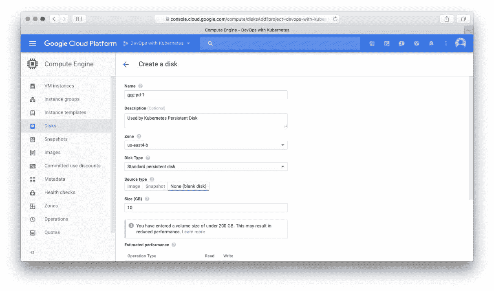

然后在`Deployment`定义中指定名称`gce-pd-1`:


它会将永久磁盘从 GCE 永久磁盘挂载到`/usr/local/tomcat/logs`，可以持久化 Tomcat 应用日志。

# 声称抽象层的持久卷

将持久卷直接指定到配置文件中，这与特定的基础架构紧密结合。在前面的例子中，这是谷歌云平台，也是磁盘名称(`gce-pd-1`)。从容器管理的角度来看，pod 定义不应该被锁定在特定的环境中，因为基础设施可能会因环境而异。理想的 pod 定义应该是灵活的，或者抽象出只指定卷名和装载点的实际基础结构。

因此，Kubernetes 提供了一个在 pod 和持久卷之间关联的抽象层，称为**持久卷声明** ( **PVC** )。它允许我们与基础设施分离。Kubernetes 管理员只需要提前预分配一个必要大小的持久卷。那么Kubernetes将结合在持久体积和聚氯乙烯之间:


以下示例是使用聚氯乙烯的 pod 的定义；让我们重复前面的例子(`gce-pd-1`)首先向 Kubernetes 注册:

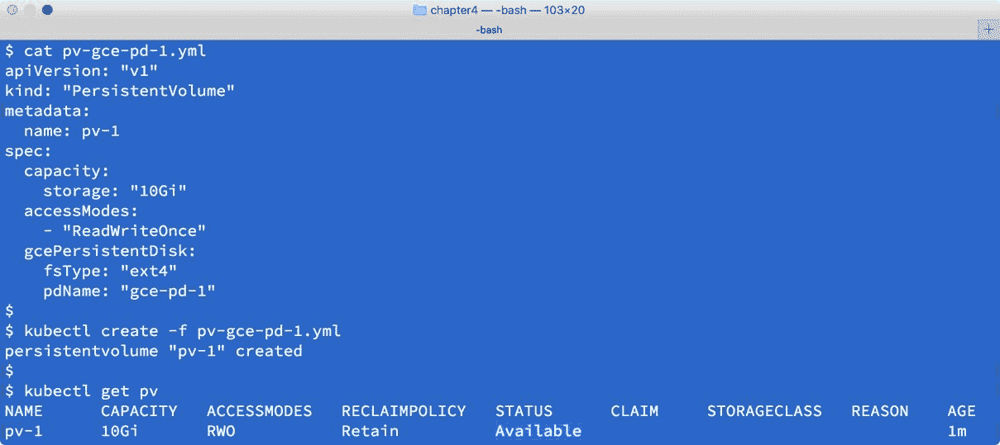

然后，创建一个与持久卷(`pv-1`)相关联的聚氯乙烯。

Note that setting it as `storageClassName: ""` means, that it should explicitly use static provisioning. Some of the Kubernetes environments such as **Google Container Engine** (**GKE**), are already set up with Dynamic Provisioning. If we don't specify `storageClassName: ""`, Kubernetes will ignore the existing `PersistentVolume` and allocates a new `PersistentVolume` when creating the `PersistentVolumeClaim`.


现在，`tomcat`设置已经从特定音量解耦到“`pvc-1`”:


# 动态资源调配和存储类

聚氯乙烯为持久卷管理提供了一定程度的灵活性。但是，预分配一些持久性卷池可能不经济，尤其是在公共云中。

Kubernetes 还通过支持持久卷的动态供应来帮助解决这种情况。Kubernetes 管理员定义了持久卷的*提供程序*，称为`StorageClass`。然后，永久卷声明要求`StorageClass`动态分配一个永久卷，然后将其与永久卷相关联:

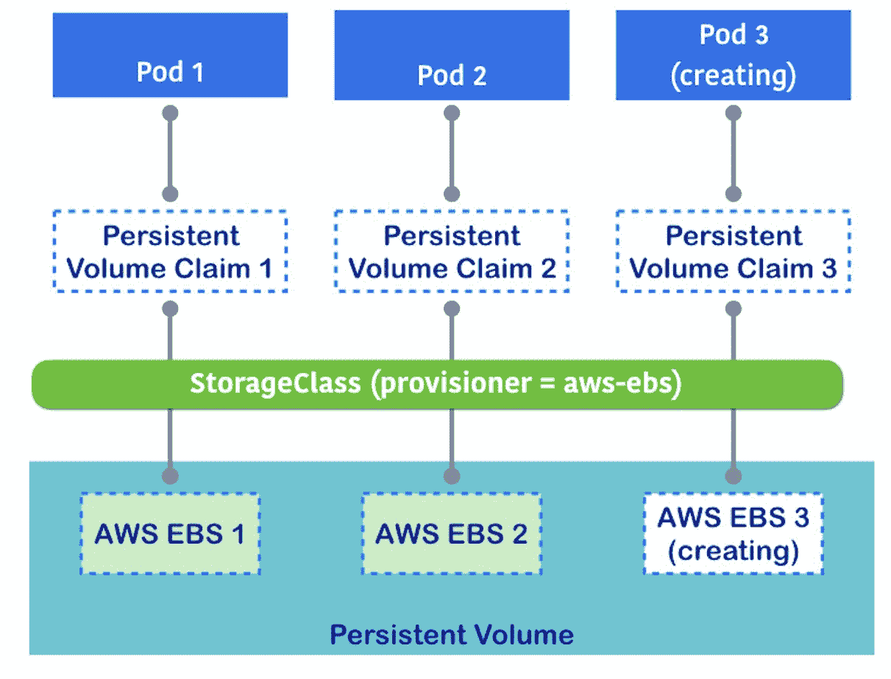

在以下示例中，AWS EBS 被用作`StorageClass`，然后，在创建聚氯乙烯时，`StorageClass`动态创建 EBS，并将其注册到Kubernetes持久卷，然后连接到聚氯乙烯:

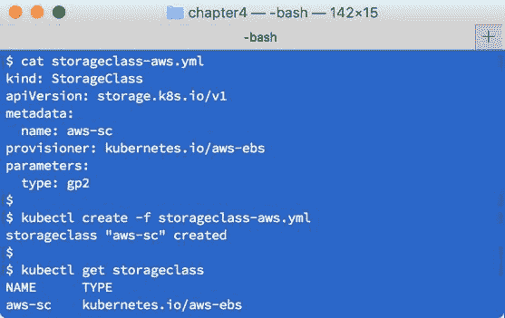

一旦`StorageClass`创建成功，创建一个没有 PV 的 PVC，但是指定`StorageClass`名称。在本例中，这将是“`aws-sc`”，如下图所示:


然后，聚氯乙烯要求`StorageClass`在 AWS 上自动创建一个永久卷，如下所示:


请注意，默认情况下，kops([https://github.com/kubernetes/kops](https://github.com/kubernetes/kops))和谷歌容器引擎([https://cloud.google.com/container-engine/](https://cloud.google.com/container-engine/))等 Kubernetes 供应工具会创建一个`StorageClass`。例如，kops 在 AWS 环境中将默认`StorageClass`设置为 AWS EBS。以及 GKE 的谷歌云持久盘。更多信息请参考 AWS 上的[第 9 章](09.html#6NGV40-6c8359cae3d4492eb9973d94ec3e4f1e)、 *Kubernetes 和 GCP* 上的[第 10 章](10.html#7BHQU0-6c8359cae3d4492eb9973d94ec3e4f1e)、 *Kubernetes:*

```
//default Storage Class on AWS
$ kubectl get sc
NAME            TYPE
default         kubernetes.io/aws-ebs
gp2 (default)   kubernetes.io/aws-ebs

//default Storage Class on GKE
$ kubectl get sc
NAME                 TYPE
standard (default)   kubernetes.io/gce-pd   
```

# 短暂而持久的环境问题

您可以将您的应用确定为无状态，因为`datastore`功能由另一个 pod 或系统处理。然而，有时应用实际上存储了您不知道的重要文件，这有一些陷阱。比如 Grafana([https://grafana.com/grafana](https://grafana.com/grafana))，它连接了石墨([https://graphiteapp.org](https://graphiteapp.org))和 influxb([https://www.influxdata.com/time-series-database/](https://www.influxdata.com/time-series-database/)等时间序列数据源，让人们可以判断 Grafana 是否是无状态应用。

但是，Grafana 本身也使用数据库来存储用户、组织和仪表板元数据。默认情况下，Grafana 使用 SQLite3 组件，并将数据库存储为`/var/lib/grafana/grafana.db`。因此，当容器重新启动时，Grafana 设置将全部重置。

以下示例演示了 Grafana 如何处理短暂的卷:


让我们创建一个名为`kubernetes org`的 Grafana `organizations`，如下所示:

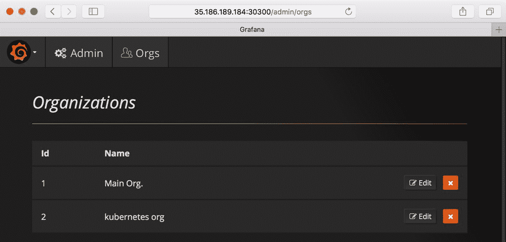

然后，看一下`Grafana`目录，有一个数据库文件(`/var/lib/grafana/grafana.db`)时间戳，在创建一个 Grafana `organization`后已经更新了:

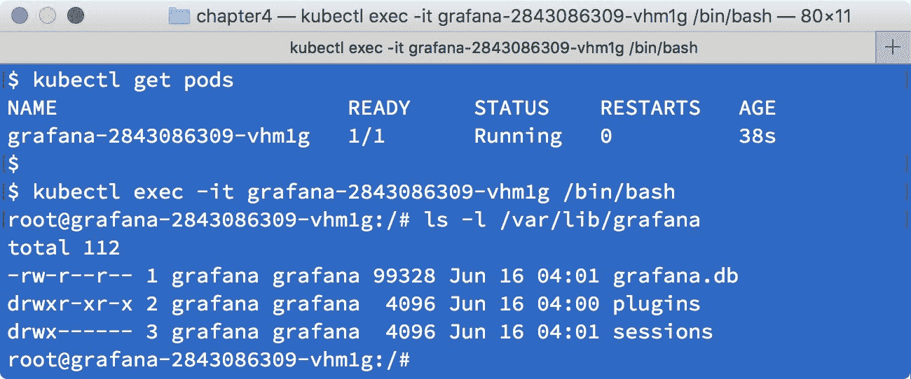

删除 pod 后，ReplicaSet 将启动一个新的 pod，并检查 Grafana `organization`是否存在:

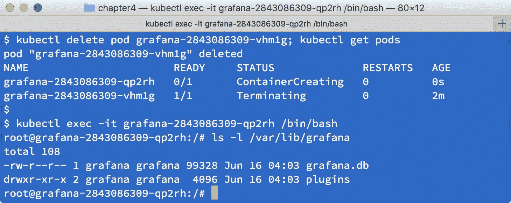

看起来`sessions`目录已经消失了，`grafana.db`也再次被 Docker 映像重新创建。然后，如果您访问网络控制台，格拉夫纳`organization`也将消失:


对 Grafana 只使用持久卷怎么样？但是使用带有持久卷的复制集，它不能正确复制(扩展)。因为所有的单元都试图装入同一个永久卷。在大多数情况下，只有第一个 pod 可以挂载持久卷，然后另一个 pod 会尝试挂载，如果不能，它会放弃。如果持久卷只能进行 RWO 操作(一次读写，只有一个 pod 可以写入)，就会出现这种情况。

在下面的例子中，Grafana 使用持久卷挂载`/var/lib/grafana`；然而，它无法扩展，因为谷歌持久磁盘是 RWO:

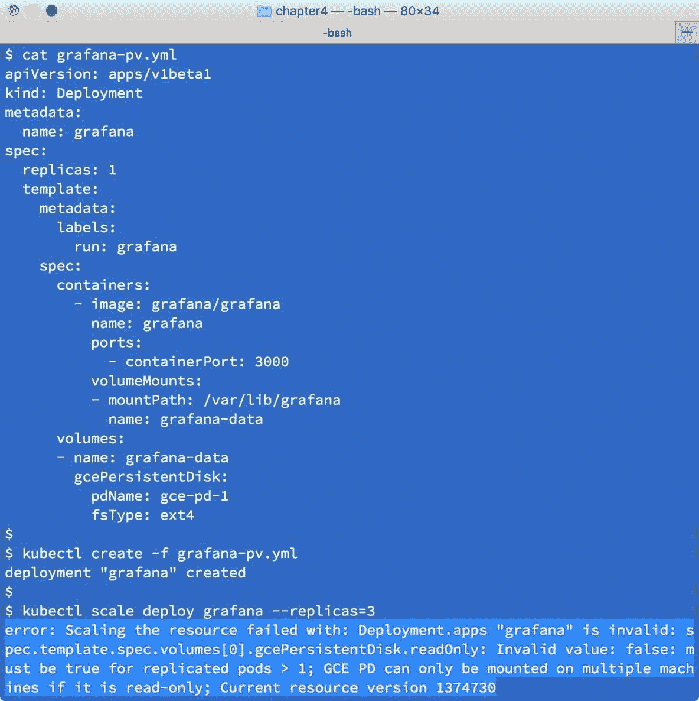

即使持久卷具有 RWX 的功能(读/写多，许多单元可以同时装载以进行读和写)，例如 NFS，如果多个单元试图绑定同一个卷，它也不会抱怨。但是，我们仍然需要考虑多个应用实例是否可以使用同一个文件夹/文件。例如，如果它将 Grafana 复制到两个或更多的 pods，它将与多个试图写入同一个`/var/lib/grafana/grafana.db`的 Grafana 实例冲突，然后数据可能被破坏，如下图所示:

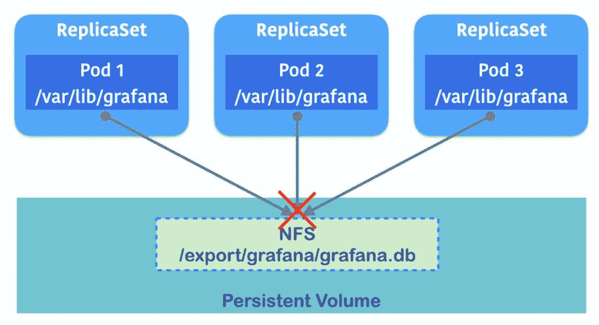

在这种情况下，Grafana 必须使用后端数据库，如 MySQL 或 PostgreSQL，而不是 SQLite3，如下所示。它允许多个 Grafana 实例正确读取/写入 Grafana 元数据:

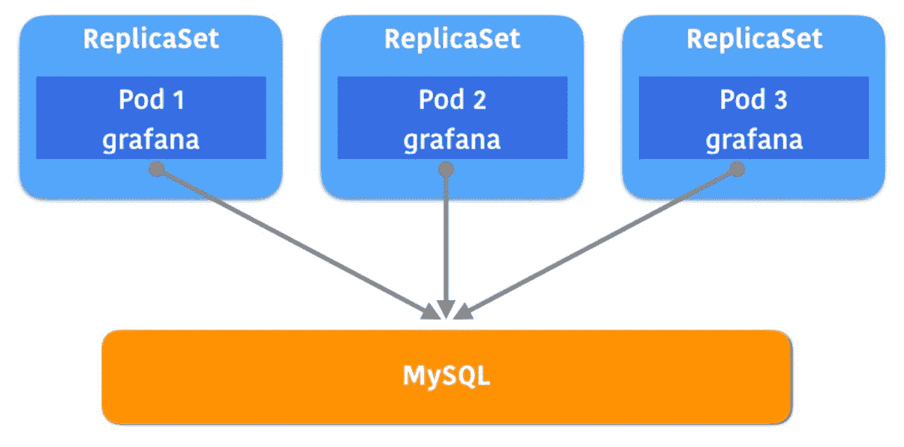

因为关系数据库管理系统基本上支持通过网络与多个应用实例连接，因此，这个场景非常适合由多个Pod 使用。注意，Grafana 支持使用 RDBMS 作为后端元数据存储；但是，并非所有应用都支持 RDBMS。

For the Grafana configuration that uses MySQL/PostgreSQL, please visit the online documentation via:
[http://docs.grafana.org/installation/configuration/#database](http://docs.grafana.org/installation/configuration/#database).

因此，Kubernetes 管理员需要仔细监控应用如何处理卷。并且要明白，在某些使用情况下，仅仅使用持久卷可能没有帮助，因为扩展 pods 时可能会出现问题。

如果多个单元需要访问集中式卷，则考虑使用前面显示的数据库(如果适用)。另一方面，如果多个荚需要一个单独的卷，可以考虑使用 StatefulSet。

# 使用状态集复制带有持久卷的盒

StatefulSet 是在 Kubernetes 1.5 中引入的；它由 pod 和持久卷之间的连接组成。缩放增加或减少的 pod 时，pod 和持久卷会一起创建或删除。

此外，pod 的创建过程是串行的。例如，当请求 Kubernetes 扩展两个附加状态集时，Kubernetes 首先创建**持久卷声明 1** 和 **Pod 1** ，然后创建**持久卷声明 2** 和 **Pod 2** ，但不是同时创建。如果应用在应用引导期间注册到注册表，它会帮助管理员:

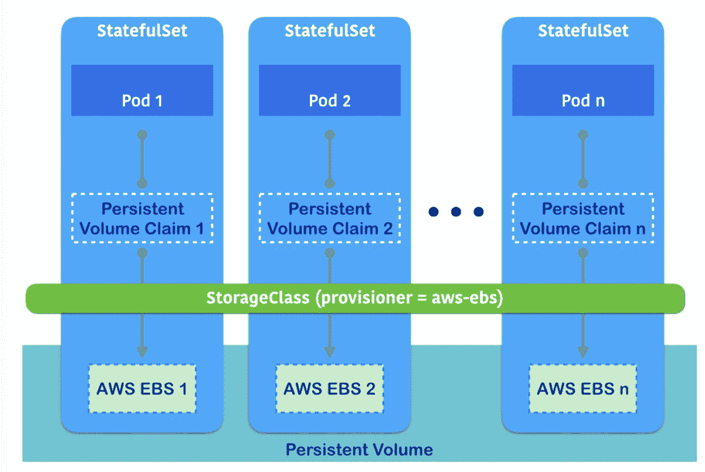

即使一个容器已经死亡，StatefulSet 也会保留容器的位置(容器名称、IP 地址和相关的 Kubernetes 元数据)以及持久卷。然后，它尝试重新创建一个容器，该容器重新分配给同一个容器并装载同一个持久卷。

它有助于保持 pods/持久卷的数量，并且应用使用 Kubernetes 调度程序保持在线:

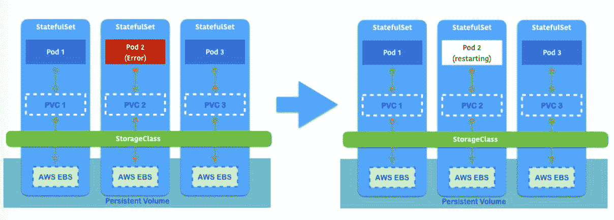

具有持久卷的状态集需要动态资源调配和`StorageClass`，因为状态集可以扩展。Kubernetes 需要知道在添加更多豆荚时如何配置持久卷。

# 持久卷示例

在本章中，介绍了一些持久性卷的示例。根据环境和场景，Kubernetes 管理员需要正确配置 Kubernetes。

以下是一些使用不同角色节点来配置不同类型的持久卷来构建弹性搜索集群的示例。它们将帮助您决定如何配置和管理持久卷。

# 弹性搜索集群场景

Elasticsearch 能够通过使用多个节点来设置集群。从 elastic search 2.4 版本开始，有几个不同的类型，如主节点、数据节点和坐标节点([https://www . elastic . co/guide/en/elastic search/reference/2.4/modules-node . html](https://www.elastic.co/guide/en/elasticsearch/reference/2.4/modules-node.html))。每个节点在集群中都有不同的角色和职责，因此相应的 Kubernetes 配置和持久卷应该与正确的设置保持一致。

下图显示了弹性搜索节点的组件和角色。主节点是群集中唯一管理所有弹性搜索节点注册和配置的节点。它还可以有一个备份节点(符合主节点条件的节点)，可以随时充当主节点:

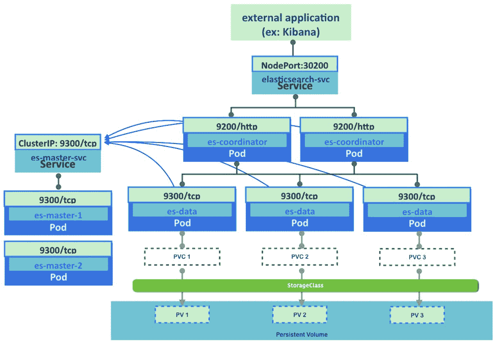

数据节点在弹性搜索中保存和操作数据存储。协调节点处理来自其他应用的 HTTP 请求，然后对数据节点进行负载平衡/调度。

# Elasticsearch master node

主节点是群集中唯一的节点。另外，其他节点因为注册需要指向主节点。因此，主节点应该使用 Kubernetes StatefulSet 来分配一个稳定的 DNS 名称，如`es-master-1`。因此，我们必须使用 Kubernetes 服务以无头模式分配 DNS，该模式将 DNS 名称直接分配给 pod IP 地址。

另一方面，如果不需要持久卷，因为主节点不需要持久存储应用的数据。

# 符合弹性搜索主节点条件的节点

符合主节点条件的节点是主节点的备用节点，因此不需要创建另一个`Kubernetes`对象。这意味着缩放分配`es-master-2`、`es-master-3`和`es-master-N`的主状态集就足够了。当主节点没有响应时，在符合主节点条件的节点中有一个主节点选择，选择并提升一个节点作为主节点。

# Elasticsearch data node

弹性搜索数据节点负责存储数据。此外，如果需要更大的数据容量和/或更多的查询请求，我们需要横向扩展。因此，我们可以使用带有持久卷的 StatefulSet 来稳定 pod 和持久卷。另一方面，不需要有域名，因此不需要为弹性搜索数据节点设置 Kubernetes 服务。

# 弹性搜索协调节点

协调节点是弹性搜索中的负载平衡器角色。因此，我们需要横向扩展来处理来自外部源的 HTTP 流量，并且不需要持久化数据。因此，我们可以将 Kubernetes ReplicaSet 与 Kubernetes 服务一起使用，将 HTTP 公开给外部服务。

以下示例显示了在 Kubernetes 创建所有前面的 Elasticsearch 节点时使用的命令:

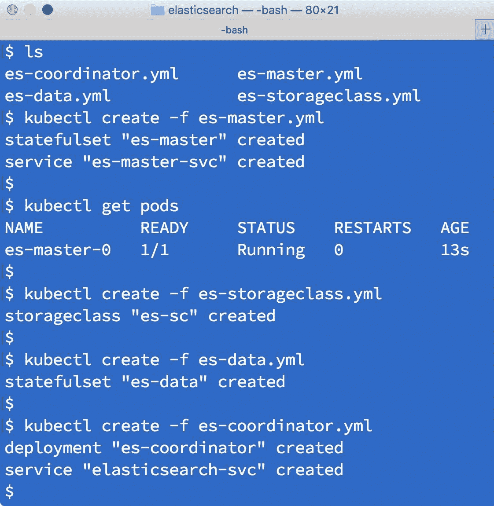

此外，以下截图是我们在创建上述实例后获得的结果:

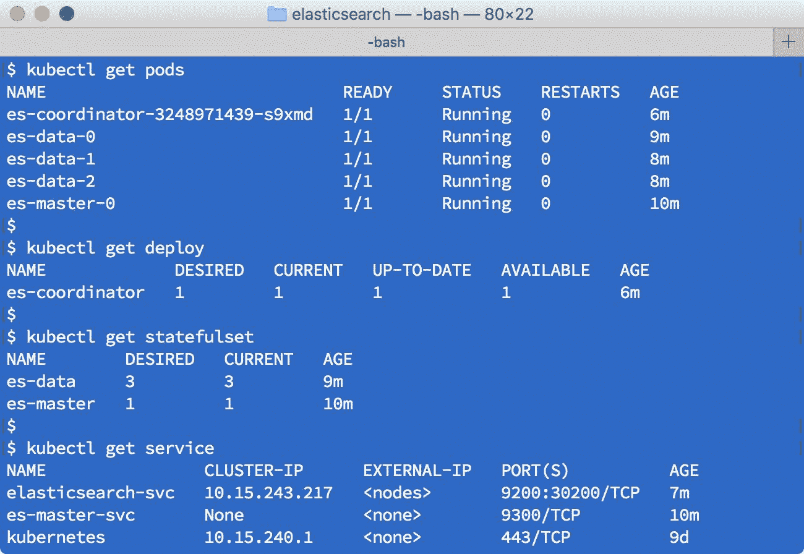


在这种情况下，外部服务(Kubernetes 节点:`30020`)是外部应用的入口点。出于测试目的，让我们安装`elasticsearch-head`([https://github.com/mobz/elasticsearch-head](https://github.com/mobz/elasticsearch-head))来可视化集群信息。

连接弹性搜索协调节点安装`elasticsearch-head`插件:

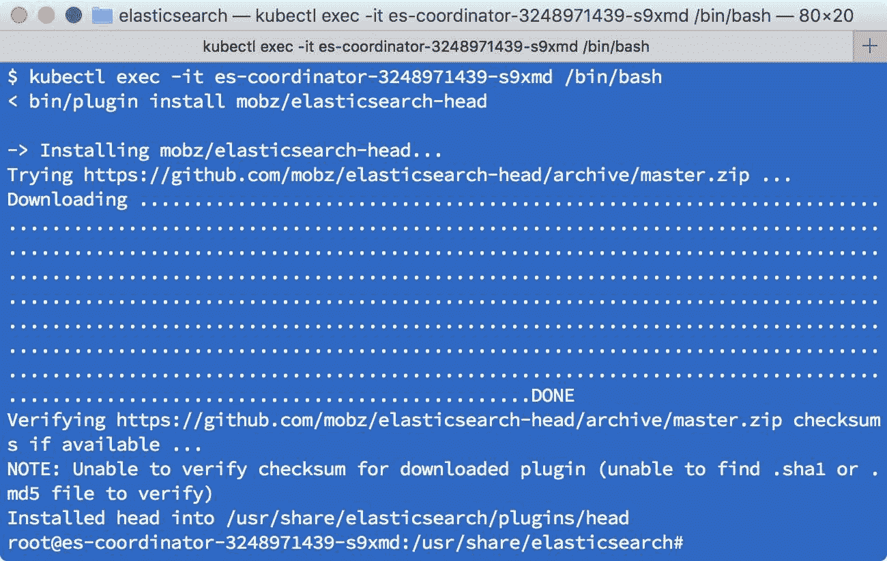

然后，访问任意 Kubernetes 节点，URL 为`http://<kubernetes-node>:30200/_plugin/head`。以下用户界面包含集群节点信息:

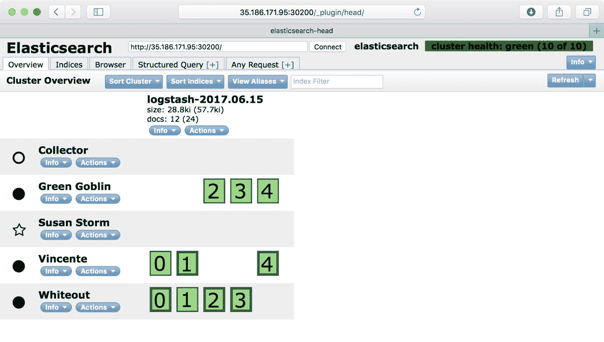

星形图标表示弹性搜索主节点，三个黑色项目符号是数据节点，白色圆圈项目符号是协调器节点。

在这种配置中，如果一个数据节点关闭，将不会发生服务影响，如以下代码片段所示:

```
//simulate to occur one data node down 
$ kubectl delete pod es-data-0
pod "es-data-0" deleted
```

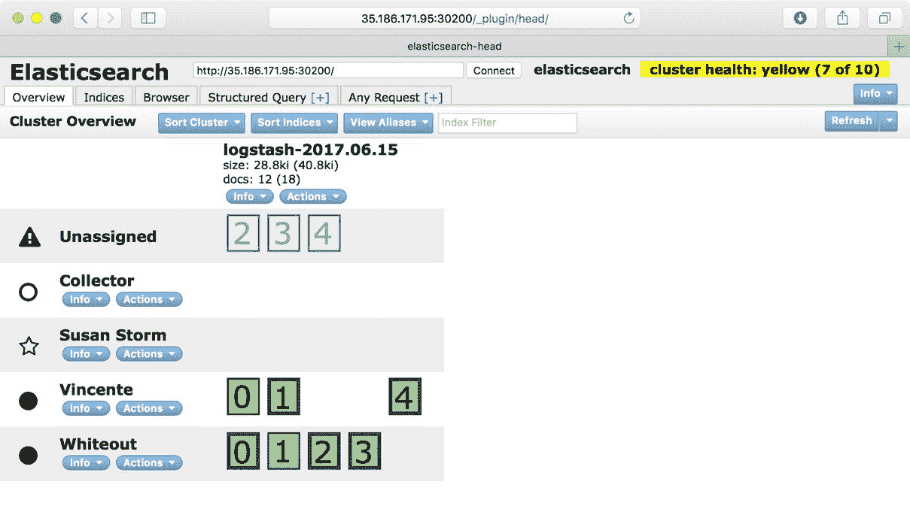

几分钟后，新的Pod 安装了相同的聚氯乙烯，保存了`es-data-0`数据。然后 Elasticsearch 数据节点再次注册到主节点，之后集群健康恢复为绿色(正常)，如下图截图所示:

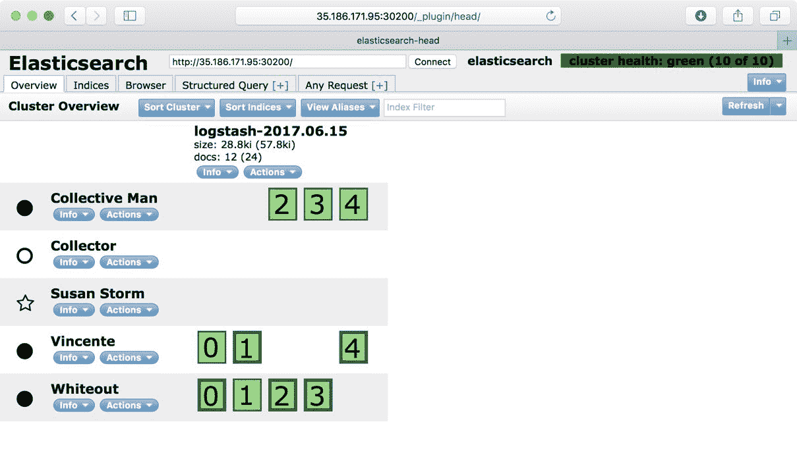

由于状态集和持久卷，应用数据不会在`es-data-0`丢失。如果需要更多磁盘空间，请增加数据节点的数量。如果需要支持更多流量，请增加协调器节点的数量。如果需要备份主节点，请增加主节点的数量，以使一些主节点符合条件。

总的来说，StatefulSet 的 Persistent Volume 组合非常强大，可以使应用具有灵活性和可扩展性。

# Kubernetes 资源管理

[第 3 章](03.html#22O7C0-6c8359cae3d4492eb9973d94ec3e4f1e)、*Kubernetes 入门*提到 Kubernetes 有一个调度器，负责管理 Kubernetes 节点，然后决定在哪里部署 pod。当节点有足够的资源，如 CPU 和内存，Kubernetes 管理员可以放心部署应用。但是，一旦达到其资源限制，Kubernetes 调度程序会根据其配置而有所不同。因此，Kubernetes 管理员必须了解如何配置和利用机器资源。

# 资源服务质量

Kubernetes 有**资源 QoS** ( **服务质量**)的概念，帮助管理员根据不同的优先级分配和管理豆荚。根据 pod 的设置，Kubernetes 将每个 pod 分类为:

*   保证Pod 
*   可爆裂Pod 
*   最佳努力舱

优先级将是保证>可突发>最佳努力，这意味着如果最佳努力窗格和保证窗格存在于同一节点中，则当其中一个窗格消耗内存并导致节点资源短缺时，将终止其中一个最佳努力窗格以保存保证窗格。

为了配置资源服务质量，您必须在 pod 定义中设置资源请求和/或资源限制。以下示例是 nginx 的资源请求和资源限制的定义:

```
$ cat burstable.yml  
apiVersion: v1 
kind: Pod 
metadata: 
  name: burstable-pod 
spec: 
  containers: 
  - name: nginx 
    image: nginx 
    resources: 
      requests: 
        cpu: 0.1 
        memory: 10Mi 
      limits: 
        cpu: 0.5 
        memory: 300Mi 
```

该示例显示了以下内容:

| **资源定义类型** | **资源名称** | **值** | **表示** |
| `requests` | `cpu` | `0.1` | 至少占 1 个中央处理器核心的 10% |
|  | `memory` | `10Mi` | 至少 10 兆字节的内存 |
| `limits` | `cpu` | `0.5` | 1 个中央处理器核心的最大 50 % |
|  | `memory` | `300Mi` | 最大 300 兆字节内存 |

对于 CPU 资源，任一内核的可接受值表达式(0.1，0.2...1.0、2.0)或毫 CPU(100 米、200 米...1000 米，2000 米)。1000 米相当于 1 芯。例如，如果 Kubernetes 节点具有 2 核 cpu(或 1 核超线程)，则总共有 2.0 核或 2000 毫 CPU，如下所示:


如果运行 nginx 示例(`requests.cpu: 0.1`)，它至少占用 0.1 个核心，如下图所示:


只要 CPU 有足够的空间，最多可以占用 0.5 个内核(`limits.cpu: 0.5`)，如下图所示:


您也可以使用`kubectl describe nodes`命令查看配置，如下所示:


请注意，在前面的示例中，它显示了一个取决于 Kubernetes 节点规格的百分比；如您所见，该节点有 1 个内核和 600 MB 内存。

另一方面，如果超过内存限制，Kubernetes 调度器会确定此 pod 内存不足，然后会杀死一个 pod ( `OOMKilled`):

```

//Pod is reaching to the memory limit
$ kubectl get pods
NAME            READY     STATUS    RESTARTS   AGE
burstable-pod   1/1       Running   0          10m

//got OOMKilled
$ kubectl get pods
NAME            READY     STATUS      RESTARTS   AGE
burstable-pod   0/1       OOMKilled   0          10m

//restarting Pod
$ kubectl get pods
NAME            READY     STATUS      RESTARTS   AGE
burstable-pod   0/1       CrashLoopBackOff   0   11m 

//restarted
$ kubectl get pods
NAME            READY     STATUS    RESTARTS   AGE
burstable-pod   1/1       Running   1          12m  
```

# 配置最佳工作窗格

最佳工作窗格在资源服务质量配置中具有最低优先级。因此，在资源短缺的情况下，该 pod 将是第一个被终止的 pod。使用 BestEffort 的用例是一个无状态且可恢复的应用，例如:

*   工人流程
*   代理或缓存节点

在资源短缺的情况下，这个 pod 应该将 CPU 和内存资源让给其他优先级更高的 pod。为了将窗格配置为最佳工作窗格，您需要将资源限制设置为 0，或者不指定资源限制。例如:

```
//no resource setting
$ cat besteffort-implicit.yml 
apiVersion: v1
kind: Pod
metadata:
 name: besteffort
spec:
 containers:
 - name: nginx
 image: nginx

//resource limit setting as 0
$ cat besteffort-explicit.yml 
apiVersion: v1
kind: Pod
metadata:
 name: besteffort
spec:
 containers:
 - name: nginx
 image: nginx
 resources:
 limits:
      cpu: 0
      memory: 0
```

请注意，资源设置由`namespace default`设置继承。因此，如果您打算使用隐式设置将容器配置为最佳工作容器，那么如果命名空间具有如下默认资源设置，则可能不会将其配置为最佳工作:

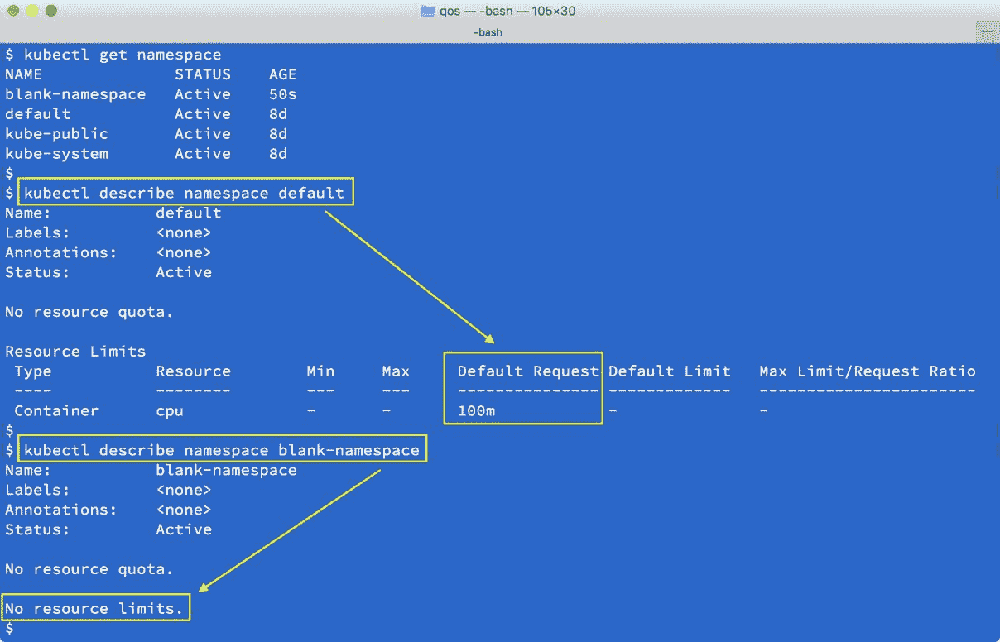

在这种情况下，如果您使用隐式设置部署到默认命名空间，它会应用一个默认的 CPU 请求作为`request.cpu: 0.1`，然后它会变成可突发的。另一方面，如果部署到`blank-namespace`，应用`request.cpu: 0`，那么就会变成 BestEffort。

# 配置为保证 pod

保证是资源服务质量的最高优先级。在资源短缺的情况下，Kubernetes 调度程序会尝试将“保证”pod 保留到最后。

因此，保证 pod 的使用将是一个关键任务节点，例如:

*   具有持久卷的后端数据库
*   主节点(如弹性搜索主节点和 HDFS 名称节点)

为了配置为保证 pod，请将资源限制和资源请求显式设置为相同的值，或者仅设置资源限制。但是，同样，如果命名空间具有默认资源设置，可能会导致不同的结果:

```
$ cat guaranteed.yml 
apiVersion: v1
kind: Pod
metadata:
 name: guaranteed-pod
spec:
 containers:
   - name: nginx
     image: nginx
     resources:
      limits:
       cpu: 0.3
       memory: 350Mi
      requests:
       cpu: 0.3
       memory: 350Mi

$ kubectl get pods
NAME             READY     STATUS    RESTARTS   AGE
guaranteed-pod   1/1       Running   0          52s

$ kubectl describe pod guaranteed-pod | grep -i qos
QoS Class:  Guaranteed
```

因为保证 pod 必须设置资源限制，如果您不能 100%确定应用所需的 CPU/内存资源，尤其是最大内存使用量；您应该使用 Burstable 设置来监控一段时间的应用行为。否则，即使节点有足够的内存，Kubernetes 调度程序也可能终止 pod ( `OOMKilled`)。

# 配置为可突发 pod

可爆裂Pod 的优先级高于最佳努力，但低于保证。与保证 pod 不同，资源限制设置不是强制性的；因此，当节点资源可用时，pod 可以尽可能多地消耗 CPU 和内存。因此，它可以被任何类型的应用使用。

如果您已经知道应用的最小内存大小，您应该指定请求资源，这有助于 Kubernetes 调度程序分配给正确的节点。例如，有两个节点各有 1 GB 内存。节点 1 已经分配了 600 兆内存，节点 2 分配了 200 兆内存给其他Pod 。

如果我们再创建一个资源请求内存为 500 MB 的 pod，那么 Kubernetes 调度程序会将这个 pod 分配给节点 2。但是，如果 pod 没有资源请求，结果将会因节点 1 或节点 2 而异。因为 Kubernetes 不知道这个豆荚会消耗多少内存:


还有资源服务质量的重要行为需要讨论。资源服务质量单元的粒度是容器级别，而不是容器级别。这意味着，如果您配置一个包含两个容器的 pod，您打算将容器 A 设置为保证(请求/限制值相同)，容器 B 为可突发(仅设置请求)。不幸的是，Kubernetes 将这个 pod 配置为 Burstable，因为 Kubernetes 不知道容器 B 的限制是什么。

以下示例演示了未能配置为保证 pod，但最终配置为可突发:

```
// supposed nginx is Guaranteed, tomcat as Burstable...
$ cat guaranteed-fail.yml 
apiVersion: v1
kind: Pod
metadata:
 name: burstable-pod
spec:
  containers:
  - name: nginx
    image: nginx
    resources:
     limits:
       cpu: 0.3
       memory: 350Mi
     requests:
       cpu: 0.3
       memory: 350Mi
  - name: tomcat
    image: tomcat
    resources:
      requests:
       cpu: 0.2
       memory: 100Mi

$ kubectl create -f guaranteed-fail.yml 
pod "guaranteed-fail" created

//at the result, Pod is configured as Burstable
$ kubectl describe pod guaranteed-fail | grep -i qos
QoS Class:  Burstable
```

即使更改为仅配置资源限制，但如果容器 A 仅具有 CPU 限制，则容器 B 仅具有内存限制，那么结果也将再次是可突发的，因为 Kubernetes 只知道其中一个限制:

```
//nginx set only cpu limit, tomcat set only memory limit
$ cat guaranteed-fail2.yml 
apiVersion: v1
kind: Pod
metadata:
 name: guaranteed-fail2
spec:
 containers:
  - name: nginx
    image: nginx
    resources:
      limits:
       cpu: 0.3
  - name: tomcat
    image: tomcat
    resources:
      requests:
       memory: 100Mi

$ kubectl create -f guaranteed-fail2.yml 
pod "guaranteed-fail2" created

//result is Burstable again
$ kubectl describe pod |grep -i qos
QoS Class:  Burstable
```

因此，如果您打算将 pod 配置为保证，则必须将所有容器设置为保证。

# 监控资源使用情况

当您开始配置以设置资源请求和/或限制时，由于资源不足，Kubernetes 计划程序可能无法计划部署您的 pod。为了了解可分配资源和可用资源，使用`kubectl describe nodes`命令查看状态。

以下示例显示了一个具有 600 兆内存和一个核心中央处理器的节点。因此，可分配的资源如下:


但是，该节点已经运行了一些可突发的 pod(使用资源请求)，如下所示:

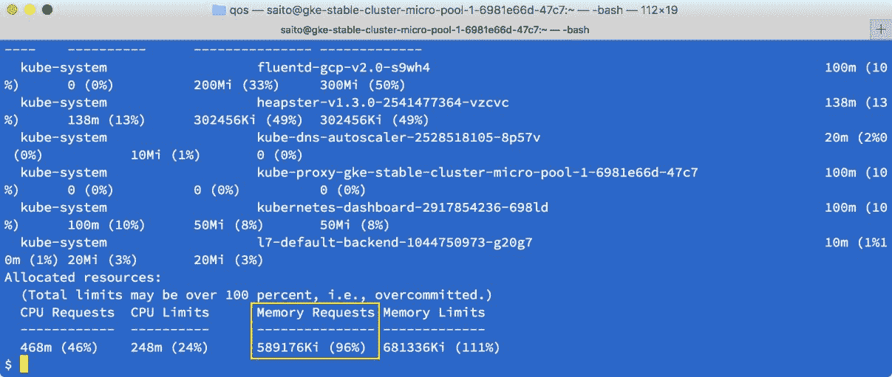

可用内存被限制为大约 20 MB。因此，如果您提交请求超过 20 MB 的可突发 pod，它将永远不会被调度，如下图所示:


错误事件可以通过`kubectl describe pod`命令捕获:


在这种情况下，您需要添加更多的 Kubernetes 节点来支持更多的资源。

# 摘要

在本章中，我们介绍了使用临时卷或永久卷的无状态和有状态应用。当应用重启或 pod 扩展时，两者都有缺陷。此外，Kubernetes 上的持久卷管理得到了增强，使其变得更加容易，这可以从 StatefulSet 和动态资源调配等工具中看到。

此外，资源服务质量帮助 Kubernetes 调度程序根据请求将 pod 分配给正确的节点，并根据优先级进行限制。

下一章将介绍 Kubernetes 的网络和安全性，它可以更容易地配置 pod 和服务，并使它们具有可扩展性和安全性。