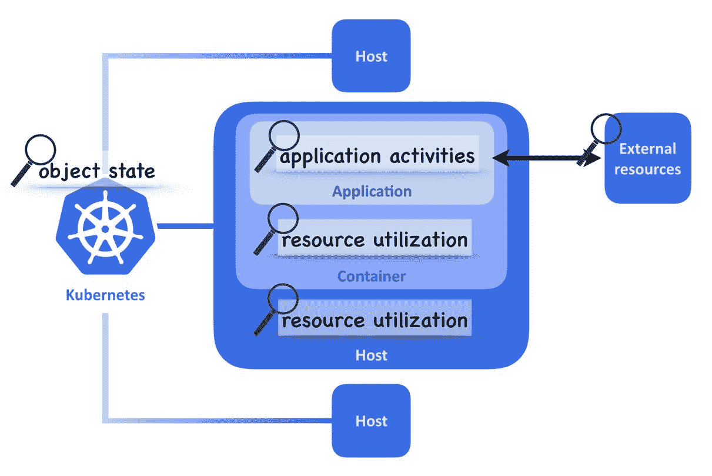
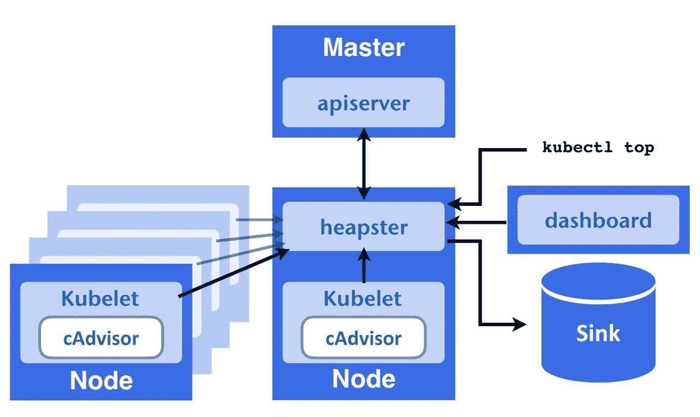
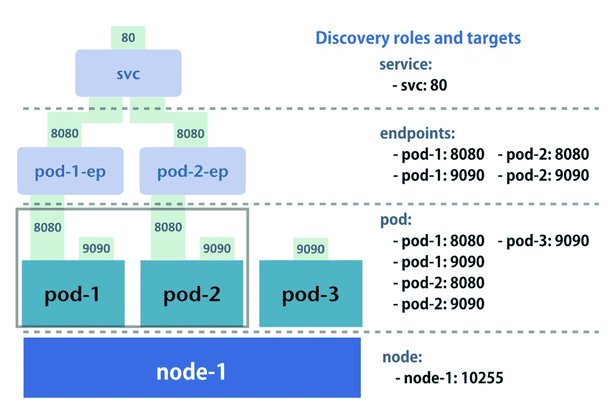
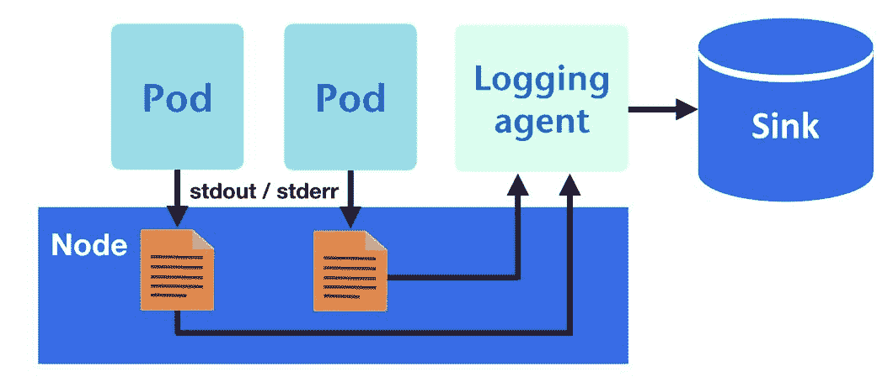
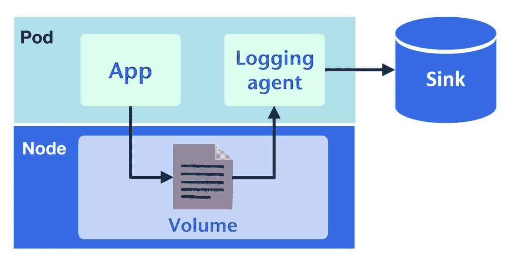

# 监控和记录

监控和记录是站点可靠性的关键部分。我们已经学习了如何利用各种控制器来处理我们的应用程序，以及如何利用服务和入口来服务我们的网络应用程序。接下来，在本章中，我们将学习如何通过以下主题跟踪我们的应用程序:

*   获取容器的状态快照
*   库本内特斯的监测
*   普罗米修斯从库本内斯收集指标
*   库本内斯的伐木概念
*   具有流动性和弹性研究的测井

# 检查集装箱

每当我们的应用程序行为异常时，我们肯定会想知道发生了什么，使用一切手段，如检查日志、资源使用情况、进程看门狗，甚至直接进入运行的主机来挖掘问题。在 Kubernetes 中，我们有`kubectl get`和`kubectl describe`可以查询部署状态，这将有助于我们确定应用程序是否已经崩溃或按照预期工作。

此外，如果我们想从应用程序的输出中知道发生了什么，我们还有`kubectl logs`，它将容器的`stdout`重定向到我们的终端。对于 CPU 和内存使用统计，我们还可以使用类似 top 的命令`kubectl top`。`kubectl top node`，概述节点的资源使用情况，`kubectl top pod <POD_NAME>`显示每个 pod 的使用情况:

```
# kubectl top node
NAME        CPU(cores)   CPU%      MEMORY(bytes)  MEMORY% 
node-1      42m          4%        273Mi           12% 
node-2      152m         15%       1283Mi          75% 

# kubectl top pod mypod-name-2587489005-xq72v
NAME                         CPU(cores)   MEMORY(bytes) 
mypod-name-2587489005-xq72v   0m           0Mi            
```

To use `kubectl top`, you'll need Heapster deployed in your cluster. We'll discuss this later in the chapter.

如果我们把原木之类的东西放在一个容器里，却没有送到任何地方，会怎么样？我们知道在一个正在运行的容器中有一个`docker exec` execute 命令，但是我们不可能每次都能访问节点。幸运的是，`kubectl`允许我们用`kubectl exec`命令做同样的事情。它的用法类似于 Docker。例如，我们可以在这样一个容器中运行一个外壳:

```
$ kubectl exec -it mypod-name-2587489005-xq72v /bin/sh
/ # 
/ # hostname
mypod-name-2587489005-xq72v  
```

这与通过 SSH 登录主机非常相似，它使我们能够使用我们熟悉的工具进行故障排除，就像我们在非容器世界中所做的那样。

# 忽必烈的控制板

除了命令行实用程序之外，还有一个仪表板，它聚合了我们刚刚在一个体面的网络用户界面上讨论的几乎所有信息:


它实际上是 Kubernetes 集群的通用图形用户界面，因为它还允许我们创建、编辑和删除资源。部署它相当容易；我们只需要应用一个模板:

```
$ kubectl create -f \ https://raw.githubusercontent.com/kubernetes/dashboard/v1.6.3/src/deploy/kubernetes-dashboard.yaml  
```

该模板适用于启用了 **RBAC** ( **基于角色的访问控制**)的 Kubernetes 集群。如果您需要其他部署选项，请查看仪表板的项目存储库([https://github.com/kubernetes/dashboard](https://github.com/kubernetes/dashboard))。关于 RBAC，我们将在[第 8 章](08.html#5J99O0-6c8359cae3d4492eb9973d94ec3e4f1e)、*集群管理*中讨论。许多托管的 Kubernetes 服务，比如 Google Container Engine，在集群中预先部署了仪表板，这样我们就不需要自己安装了。要确定仪表板是否存在于我们的集群中，请使用`kubectl cluster-info`。

我们将看到 kubernetes-dashboard 正在运行...如果安装了的话。使用默认模板部署或由云提供商提供的仪表板服务通常是集群 IP。为了访问它，我们需要用`kubectl proxy.`在我们的终端和 Kubernetes 的 API 服务器之间建立一个代理，一旦代理启动，我们就可以在`http://localhost:8001/ui`访问仪表板。港口`8001`是`kubectl proxy`的默认港口。

As with `kubectl top`, you'll need Heapster deployed in your cluster to see the CPU and memory stats.

# 库本内特斯的监测

因为我们现在知道如何在 Kubernetes 中检查我们的应用程序，所以我们应该有一个机制来不断地这样做，以便在第一次发生时检测到任何事件，这是非常自然的。换句话说，我们需要一个监控系统。监控系统从各种来源收集指标，存储和分析收到的数据，然后对异常做出响应。在传统的应用程序监控设置中，我们至少会从基础架构的三个不同层收集指标，以确保服务的可用性和质量。

# 应用

我们在这个级别上关心的数据涉及应用程序的内部状态，这可以帮助我们确定服务内部发生了什么。例如，以下截图来自 Elasticsearch 漫威([https://www . elastic . co/guide/en/marvel/current/introduction . html](https://www.elastic.co/guide/en/marvel/current/introduction.html)，从第 5 版开始称为 **Monitoring** ，这是一个针对 Elasticsearch 集群的监控解决方案。它汇集了关于我们集群的信息，尤其是弹性搜索特定指标:


此外，我们将利用分析工具和跟踪工具来检测我们的程序，这增加了维度，使我们能够以更精细的粒度检查我们的服务。尤其是现在，一个应用程序可能由几十个分布式服务组成。如果不使用跟踪工具，例如 OpenTracing([http://OpenTracing . io](http://opentracing.io))实现，识别性能问题可能会非常困难。

# 主持

主机级别的收集任务通常由监控框架提供的代理执行。代理提取并发送有关主机的综合指标，如负载、磁盘、连接或进程统计数据，以帮助确定主机的运行状况。

# 外部资源

除了前面提到的两个组件，我们还需要检查相关组件的状态。例如，假设我们有一个应用程序消耗一个队列并执行相应的任务；我们还应该关注度量标准，比如队列长度和消耗率。如果消耗率低，队列长度不断增长，我们的应用程序可能会遇到麻烦。

这些原则也适用于 Kubernetes 上的容器，因为在主机上运行容器几乎等同于运行进程。尽管如此，由于 Kubernetes 上的容器和传统主机上的容器利用资源的方式之间存在微妙的区别，我们在使用监控策略时仍然需要考虑这些差异。例如，Kubernetes 上的一个应用程序的容器会分布在多个主机上，也不会总是在同一个主机上。如果我们仍然采用以主机为中心的监控方法，那么为一个应用程序制作一个一致的记录将是非常辛苦的。因此，我们不应该只观察主机级别的资源使用情况，而是应该在监控堆栈中堆积一个容器层。此外，由于 Kubernetes 实际上是我们应用程序的基础设施，我们绝对也应该考虑它。

# 容器

如上所述，在容器级别收集的指标和我们在主机级别获得的指标几乎是一样的，尤其是系统资源的使用。尽管看似冗余，但这是帮助我们解决监控移动集装箱困难的关键。这个想法很简单:我们需要做的是将逻辑信息附加到指标上，比如 pod 标签或它们的控制器名称。通过这种方式，来自不同主机的容器的度量可以被有意义地分组。考虑下图；假设我们想知道在 **App 2** 上传输了多少字节( **tx** ，我们可以对 **App 2** 标签上的 **tx** 度量进行求和，得出 **20 MB:**


另一个不同之处是，关于 CPU 限制的指标仅在容器级别报告。如果某个应用程序遇到性能问题，但主机上的 CPU 资源是空闲的，我们可以检查它是否受到相关指标的限制。

# 忽必烈忽必烈忽必烈忽必烈忽必烈忽必烈忽必烈忽必烈忽必烈忽必烈

Kubernetes 负责管理、调度和编排我们的应用程序。因此，一旦某个应用程序崩溃，Kubernetes 肯定是我们首先要关注的地方之一。特别是，当新部署推出后发生崩溃时，相关对象的状态会立即反映在 Kubernetes 上。

总的来说，下图说明了应该监控的组件:



# 获取 Kubernetes 的监控要点

对于监控堆栈的每一层，我们总能找到对应的收集器。例如，在应用程序级别，我们可以手动转储指标；在主机级别，我们会在每个盒子上安装一个度量收集器；至于 Kubernetes，有用于导出我们感兴趣的指标的 API，至少我们手头有`kubectl`。

说到容器级收集器，我们有哪些选择？也许在应用程序的映像中安装主机度量收集器可以完成这项工作，但是我们很快就会意识到，这可能会使我们的容器在大小和资源利用率方面过于笨拙。幸运的是，对于这样的需求已经有了一个解决方案，即 cAdvisor([https://github.com/google/cadvisor](https://github.com/google/cadvisor))，容器级度量收集器的答案。简而言之，cAdvisor 聚合了机器上每个运行容器的资源使用情况和性能统计。请注意，cAdvisor 的部署是每个主机一个，而不是每个容器一个，这对于容器化的应用程序来说更合理。在 Kubernetes 中，我们甚至不关心 cAdvisor 的部署，因为它已经嵌入到了 kubelet 中。

cAdvisor 可通过每个节点上的端口`4194`访问。在 Kubernetes 1.7 之前，cAdvisor 收集的数据也可以通过 kubelet 端口(`10250` / `10255`)收集。要访问 cAdvisor，我们可以在`http://localhost:8001/api/v1/nodes/<nodename>:4194/proxy/`访问实例端口`4194`或通过`kubectl proxy`访问，或者直接访问`http://<node-ip>:4194/`。

以下截图来自 cAdvisor 网络用户界面。连接后，您将看到类似的页面。要查看 cAdvisor 获取的指标，请访问端点`/metrics`。

>

监控管线中的另一个重要组件是 Heapster([https://github.com/kubernetes/heapster](https://github.com/kubernetes/heapster))。它从每个节点检索监控统计数据，特别是在节点处理上的 kubelet，然后写入外部接收器。它还通过 REST 应用编程接口公开聚合度量。对于 cAdvisor 来说，Heapster 的功能听起来相当多余，但实际上它们在监控管道中扮演着不同的角色。Heapster 收集集群范围的统计数据；cAdvisor 是一个主机范围的组件。也就是说，Heapster 赋予了 Kubernetes 集群基本的监控能力。下图说明了它如何与集群中的其他组件交互:



事实上，如果您的监控框架提供了一个类似的工具，也可以从 kubelet 中抓取指标，那么就没有必要安装 Heapster 了。然而，由于它是 Kubernetes 生态系统中的默认监控组件，许多工具都依赖于它，例如`kubectl top`和前面提到的 Kubernetes 仪表板。

在部署 Heapster 之前，请检查您正在使用的监控工具是否支持作为本文中的 Heapster 接收器:[https://github . com/kubernetes/Heapster/blob/master/docs/sink-configuration . MD](https://github.com/kubernetes/heapster/blob/master/docs/sink-configuration.md)。

如果没有，我们可以有一个独立的设置，通过应用这个模板使仪表板和`kubectl top`工作:

```
$ kubectl create -f \
    https://raw.githubusercontent.com/kubernetes/heapster/master/deploy/kube-config/standalone/heapster-controller.yaml  
```

如果启用了 RBAC，请记住应用此模板:

```
$ kubectl create -f \ https://raw.githubusercontent.com/kubernetes/heapster/master/deploy/kube-config/rbac/heapster-rbac.yaml
```

安装 Heapster 后，`kubectl top`命令和 Kubernetes 仪表板应该正确显示资源使用情况。

虽然 cAdvisor 和 Heapster 专注于物理指标，但我们也希望在监控仪表板上显示对象的逻辑状态。kube-state-metrics([https://github.com/kubernetes/kube-state-metrics](https://github.com/kubernetes/kube-state-metrics))正是完成我们监控堆栈的那块。它观看 Kubernetes 大师，并将我们从`kubectl get`或`kubectl describe`看到的对象雕像转换为普罗米修斯格式的度量标准([https://Prometheus . io/docs/instrumenting/exposure _ formats/](https://prometheus.io/docs/instrumenting/exposition_formats/))。只要监控系统支持这种格式，我们就可以将状态抓取到度量存储中，并在发生无法解释的重启计数等事件时得到警报。要安装 kube-state-metrics，首先下载项目存储库([https://github . com/kubernetes/kube-state-metrics/tree/master/kubernetes](https://github.com/kubernetes/kube-state-metrics/tree/master/kubernetes))下的`kubernetes`文件夹中的模板，然后应用它们:

```
$ kubectl apply -f kubernetes
```

之后，我们可以在其服务端点的指标中查看集群内部的状态:

`http://kube-state-metrics.kube-system:8080/metrics`

# 动手监控

到目前为止，我们已经学习了很多在 Kubernetes 中构建一个不透水的监控系统的原则，以实现一个健壮的服务，现在是时候实现一个实用的了。因为绝大多数 Kubernetes 组件以 Prometheus 格式在常规路径上公开它们的检测度量，所以我们可以自由使用我们熟悉的任何监控工具，只要该工具理解该格式。在本节中，我们将用一个开源项目 Prometheus([https://Prometheus . io](https://prometheus.io))建立一个示例，它是一个独立于平台的监控工具。它在库本内特生态系统中的受欢迎不仅是因为它的强大，还因为它得到了同样赞助库本内特项目的**云原生计算基金会**([https://www.cncf.io/](https://www.cncf.io/))的支持。

# 遇见普罗米修斯

普罗米修斯框架由几个组件组成，如下图所示:


与所有其他监控框架一样，普罗米修斯依赖代理从我们的系统组件中抓取统计数据，这些代理是图表左侧的导出者。除此之外，普罗米修斯在度量收集上采用了拉取模型，也就是说，它不是被动地接收度量，而是主动地从出口商的度量端点拉取数据。如果一个应用程序公开了一个指标的端点，普罗米修斯也能够抓取该数据。默认存储后端是嵌入式级别数据库，可以切换到其他远程存储，如 InfluxDB 或石墨。普罗米修斯还负责根据预先配置的规则向**告警管理器**发送告警。**报警管理器**处理报警发送任务。它将收到的警报分组，并将其分派给实际发送消息的工具，如电子邮件、Slack、PagerDuty 等。除了警报之外，我们还希望将收集的指标可视化，以便快速了解我们的系统，Grafana 就是在这里派上用场的工具。

# 部署普罗米修斯

我们为本章准备的模板可以在这里找到:
[https://github . com/DevOps-wit-Kubernetes/examples/tree/master/chapter 6](https://github.com/DevOps-with-Kubernetes/examples/tree/master/chapter6)

在 6-1_prometheus 下面是这个部分的清单，包括 prometheus 部署、导出器和相关资源。除了需要在`kube-system`命名空间中工作的组件之外，它们将被固定在一个专用的命名空间`monitoring`中。请仔细查看，现在让我们按照以下顺序创建资源:

```
$ kubectl apply -f monitoring-ns.yml
$ kubectl apply -f prometheus/config/prom-config-default.yml
$ kubectl apply -f prometheus  
```

在所提供的设置中，资源的使用被限制在相对较低的水平。如果您想以更正式的方式使用它们，建议根据实际要求调整参数。普罗米修斯服务器启动后，我们可以通过`kubectl port-forward`在端口`9090`连接到它的网络用户界面。如果相应地修改它的服务(`prometheus/prom-svc.yml`)，我们可以使用节点端口或入口来连接到用户界面。当进入 UI 时，我们将看到的第一个页面是普罗米修斯的表达式浏览器，我们在这里构建查询并可视化度量。在默认设置下，普罗米修斯将从自身收集指标。在路径`/targets`可以找到所有有效的刮擦目标。要和普罗米修斯对话，我们必须对它的语言有所了解: **PromQL** 。

# 使用 PromQL

PromQL 有三种数据类型:即时向量、范围向量和标量。瞬时向量是采样数据的时间序列；范围向量是包含一定时间范围内数据的一组时间序列；标量是一个数字浮点值。存储在普罗米修斯内部的度量用度量名称和标签来标识，我们可以通过表达式浏览器上“执行”按钮旁边的下拉列表找到任何收集的度量的名称。如果我们用度量名称来查询普罗米修斯，比如`http_requests_total`，我们会得到很多结果，因为即时向量与名称匹配，但标签不同。同样，我们也可以只使用`{}`语法来查询一组特定的标签。例如，查询`{code="400",method="get"}`意味着我们需要标签分别为`code`、`method`等于`400`和`get`的任何指标。在查询中组合名称和标签也是有效的，例如`http_requests_total{code="400",method="get"}`。PromQL 赋予我们从各种线索中检查我们的应用程序或系统的检测能力，只要收集了相关的指标。

除了刚才提到的基本查询之外，PromQL 还有很多东西，比如用正则表达式和逻辑运算符查询标签，用函数连接和聚合度量，甚至在不同的度量之间执行操作。例如，下面的表达式给出了`kube-system`命名空间中`kube-dns`部署消耗的总内存:

```
sum(container_memory_usage_bytes{namespace="kube-system", pod_name=~"kube-dns-(\\d+)-.*"} ) / 1048576
```

更详细的文档可以在普罗米修斯官方网站([https://prometheus.io/docs/querying/basics/](https://prometheus.io/docs/querying/basics/))上找到，肯定能帮你释放普罗米修斯的力量。

# 在库本内特斯发现目标

由于普罗米修斯只从它知道的端点提取指标，我们必须明确告诉它我们希望从哪里收集数据。路径`/config`下是列出当前配置的拉取目标的页面。默认情况下，会有一个作业收集普罗米修斯本身的当前指标，它位于传统的抓取路径`/metrics`中。如果连接到端点，我们会看到一个很长的文本页面:

```
$ kubectl exec -n monitoring prometheus-1496092314-jctr6 -- \
wget -qO - localhost:9090/metrics

# HELP go_gc_duration_seconds A summary of the GC invocation durations.
# TYPE go_gc_duration_seconds summary
go_gc_duration_seconds{quantile="0"} 2.4032e-05
go_gc_duration_seconds{quantile="0.25"} 3.7359e-05
go_gc_duration_seconds{quantile="0.5"} 4.1723e-05
...
```

这只是我们多次提到的普罗米修斯度量格式。下次当我们看到这样的页面时，我们会知道它是一个度量端点。

刮削普罗米修斯的默认作业被配置为静态目标。然而，由于 Kubernetes 中的容器是动态创建和销毁的，要找出一个容器的确切地址真的很麻烦，更不用说将其设置在普罗米修斯上了。在某些情况下，我们可能会利用服务 DNS 作为静态指标目标，但这仍然不能解决所有情况。幸运的是，普罗米修斯通过其发现库本内服务的能力帮助我们克服了这个问题。

更具体地说，它能够查询 Kubernetes 关于运行服务的信息，并相应地将它们添加或删除到目标配置中。目前支持四种发现机制:

*   **节点**发现模式为每个节点创建一个目标，默认情况下，目标端口是 kubelet 的端口。
*   **服务**发现模式为每个`service`对象创建一个目标，服务中所有定义的端口都将成为一个抓取目标。
*   **pod** 发现模式的工作方式类似于服务发现角色，也就是说，它为每个 pod 创建目标，并为每个 pod 公开所有定义的容器端口。如果 pod 的模板中没有定义端口，它仍然会创建一个仅包含地址的抓取目标。
*   **端点**模式发现由服务创建的`endpoint`对象。例如，如果一个服务由三个荚支持，每个荚有两个端口，那么我们将有六个抓取目标。此外，对于 pod，不仅会发现暴露给服务的端口，还会发现其他声明的容器端口。

下图说明了四种发现机制:左边的是 Kubernetes 中的资源，右边列表中的是 Prometheus 中创建的目标:



一般来说，并不是所有暴露的端口都被用作度量端点，所以我们当然不希望普罗米修斯抓取我们集群中的所有东西，而只收集标记的资源。为了实现这一点，普罗米修斯利用资源清单上的注释来区分要抓取的目标。注释格式如下:

*   **在吊舱**上:如果吊舱是由吊舱控制器创建的，请记住在吊舱规范中而不是在吊舱控制器中设置普罗米修斯注释:
    *   `prometheus.io/scrape` : `true`表示该吊舱应该被拉动。
    *   `prometheus.io/path`:将此标注设置为暴露度量的路径；仅当目标吊舱使用的路径不是`/metrics`时才需要设置。
    *   `prometheus.io/port`:如果定义的端口不同于实际的度量端口，用这个注释覆盖它。

*   **关于服务**:由于端点大多不是手动创建的，端点发现使用从服务继承的注释。也就是说，对服务的注释同时影响服务和端点发现模式。因此，我们将使用`prometheus.io/scrape: 'true'`来表示服务创建的要被抓取的端点，并使用`prometheus.io/probe: 'true'`来用度量标记服务。此外，`prometheus.io/scheme`指定使用`http`还是`https`。除此之外，路径和端口注释也在这里工作。

以下模板片段指出了普罗米修斯的端点发现角色，但在 pods 上创建目标的服务发现角色是在:`9100/prom`选择的。

```
apiVersion: v1 
kind: Service 
metadata: 
  annotations: 
    prometheus.io/scrape: 'true' 
    prometheus.io/path: '/prom' 
... 
spec: 
  ports: 
 - port: 9100 
```

我们的示例存储库下的模板`prom-config-k8s.yml`包含为普罗米修斯发现库本内斯资源的配置。将其应用于:

```
$ kubectl apply -f prometheus/config/prom-config-k8s.yml  
```

因为它是一个配置映射，所以需要几秒钟才能保持一致。然后，通过向进程发送`SIGHUP`来重新装载普罗米修斯:

```
$ kubectl exec -n monitoring ${PROM_POD_NAME} -- kill -1 1
```

提供的模板基于普罗米修斯官方存储库的这个例子；您可以在这里找到更多用法:

[https://github . com/Prometheus/Prometheus/blob/master/documentation/examples/Prometheus-kublets . yml](https://github.com/prometheus/prometheus/blob/master/documentation/examples/prometheus-kubernetes.yml)

此外，文档页面详细描述了普罗米修斯配置的工作原理:

[https://prometheus.io/docs/operating/configuration/](https://prometheus.io/docs/operating/configuration/)

# 从 Kubernetes 收集数据

实现前面在 Prometheus 中讨论的五个监控层的步骤现在已经非常清楚了:安装导出器，用适当的标签注释它们，然后在自动发现的端点上收集它们。

普罗米修斯中的主机层监控由节点导出器([https://github.com/prometheus/node_exporter](https://github.com/prometheus/node_exporter))完成。它的 Kubernetes 清单可以在本章的示例下找到，它包含一个带有刮擦注释的 DaemonSet。安装时请使用:

```
$ kubectl apply -f exporters/prom-node-exporter.yml
```

它的相应配置将由 pod 发现角色创建。

容器层收集器应该是 cAdvisor，它已经安装在 kubelet 中。因此，用节点模式发现它是我们唯一需要做的事情。

Kubernetes 的监控是由 kube-state-metrics 完成的，这也是之前介绍过的。更好的一点是，它带有普罗米修斯注释，这意味着我们不需要做任何额外的事情来配置它。

到目前为止，我们已经建立了一个基于普罗米修斯的强大监控堆栈。关于应用程序和外部资源监控，普罗米修斯生态系统中有大量的导出器来支持监控我们系统中的各种组件。例如，如果我们需要我们的 MySQL 数据库的统计数据，我们可以只安装 MySQL 服务器导出器([https://github.com/prometheus/mysqld_exporter](https://github.com/prometheus/mysqld_exporter)，它提供了全面和有用的指标。

除了已经描述的这些度量标准，Kubernetes 组件中还有一些其他有用的度量标准，它们在许多方面发挥着重要作用:

*   **Kubernetes API 服务器**:API 服务器在`/metrics`暴露状态，默认启用此目标。
*   **kube-controller-manager** :这个组件公开了端口`10252`上的指标，但是在一些托管的 Kubernetes 服务上是不可见的，比如**谷歌容器引擎** ( **GKE** )。如果您在自托管集群上，应用“`kubernetes/self/kube-controller-manager-metrics-svc.yml`”会为普罗米修斯创建端点。
*   **kube-scheduler** :它使用端口`10251`，在 GKE 的集群上也看不到。“`kubernetes/self/kube-scheduler-metrics-svc.yml`”是为普罗米修斯创建目标的模板。
*   **kube-DNS**:kube-DNS pod 中有两个容器，`dnsmasq`和`sky-dns`，它们的度量端口分别是`10054`和`10055`。对应的模板是`kubernetes/self/ kube-dns-metrics-svc.yml`。
*   **etcd**:etcd 集群在端口`4001`上还有一个普罗米修斯度量端点。如果您的 etcd 集群是由 Kubernetes 自托管和管理的，您可以将“`kubernetes/self/etcd-server.yml`”作为参考。
*   **Nginx 入口控制器**:Nginx 控制器在端口`10254`发布度量。但是这些指标只包含有限的信息。要按主机或路径获取连接计数等数据，您需要激活控制器中的`vts`模块来增强收集的指标。

# 与格拉夫纳一起查看指标

表达式浏览器有一个内置的图形面板，使我们能够看到可视化的指标，但它不是为日常工作设计的可视化仪表板。格拉夫纳是普罗米修斯的最佳选择。我们已经在[第 4 章](04.html#3279U0-6c8359cae3d4492eb9973d94ec3e4f1e)、*中讨论了如何设置 Grafana 使用存储和资源*，我们也在知识库中提供了本章的模板；两个选项都可以。

要在 Grafana 中看到普罗米修斯度量，我们必须先添加一个数据源。连接到我们的普罗米修斯服务器需要以下配置:

*   类型:“普罗米修斯”
*   Url: `http://prometheus-svc.monitoring:9090`
*   访问:代理

一旦连接上，我们就可以导入一个仪表板来查看正在运行的东西。在 Grafana 的分享页面([https://grafana.com/dashboards?dataSource=prometheus](https://grafana.com/dashboards?dataSource=prometheus))上有丰富的现成仪表盘。以下截图来自仪表盘`#1621`:


因为图表是由普罗米修斯公司的数据绘制的，所以只要我们掌握了 PromQL，我们就有能力绘制我们关心的任何数据。

# 记录事件

利用系统状态的定量时间序列进行监控，使我们能够迅速找出系统中哪些组件发生了故障，但这仍然不足以诊断综合征下的根本原因。因此，通过将事件与检测到的异常相关联，收集、保存和搜索日志的日志记录系统无疑有助于揭示出现问题的原因。

通常，日志记录系统中有两个主要组件:日志记录代理和日志记录后端。前者是程序的抽象层。它收集、转换日志并将日志分派到日志后端。日志后端存储收到的所有日志。与监控一样，为 Kubernetes 构建日志系统最具挑战性的部分是确定如何将日志从容器收集到集中的日志后端。通常，向程序发送日志有三种方式:

*   将所有东西倾倒至`stdout` / `stderr`
*   书写`log`文件
*   将日志发送到日志记录代理或直接记录后端；Kubernetes 中的程序也能够以同样的方式发出日志，只要我们了解日志流在 Kubernetes 中是如何流动的

# 聚合日志的模式

对于直接登录到日志代理或后端的程序来说，它们是否在 Kubernetes 内部总体上并不重要，因为它们在技术上并不通过 Kubernetes 输出日志。至于其他情况，我们将使用以下两种模式来集中日志。

# 使用每个节点的日志记录代理收集日志

我们知道我们通过`kubectl logs`检索到的消息是从容器的`stdout` / `stderr`重定向的流，但是用`kubectl logs`收集日志显然不是一个好主意。实际上，`kubectl logs`从 kubelet 获取日志，kubelet 从下面的容器引擎将日志聚合到主机路径`/var/log/containers/`。

因此，在每个节点上设置日志代理，并配置它们来跟踪和转发路径下的`log`文件，正是我们汇聚运行容器的标准流所需要的，如下图所示:



实际上，我们还会配置一个日志代理来跟踪来自系统和 Kubernetes 的日志，它们是主节点和节点上`/var/log`下的组件，例如:

*   `kube-proxy.log`
*   `kube-apiserver.log`
*   `kube-scheduler.log`
*   `kube-controller-manager.log`
*   `etcd.log`

除了`stdout` / `stderr`之外，如果应用程序的日志作为文件存储在容器中并通过`hostPath`卷持久化，节点日志记录代理同样能够将它们传递给节点。然而，对于每个导出的`log`文件，我们必须在日志代理中定制它们相应的配置，以便它们能够被正确调度。此外，我们还需要正确命名`log`文件，以防止任何冲突，并自行处理日志旋转，这使其成为不可扩展和不可管理的日志机制。

# 运行边车容器来转发日志

有时只是很难修改我们的应用程序来将日志写入标准流而不是`log`文件，我们也不想面对登录`hostPath`卷带来的麻烦。在这种情况下，我们可以运行一个 Sidecar 容器来处理一个 pod 内的日志记录。换句话说，每个应用程序容器都有两个共享相同`emptyDir`体积的容器，这样 Sidecar 容器就可以跟踪来自应用程序容器的日志，并将它们发送到它们的容器之外，如下图所示:



虽然我们不再需要担心`log`文件的管理，但是像为每个 pod 配置日志代理和将 Kubernetes 的元数据附加到日志条目这样的杂务仍然需要额外的努力。另一种选择是利用 Sidecar 容器将日志输出到标准流，而不是像下面的 pod 一样运行一个专用的日志代理；应用程序容器坚持不懈地向`/var/log/myapp.log`写入消息，而 Sidecar 在共享卷中尾随`myapp.log`。

```
---6-2_logging-sidecar.yml--- 
apiVersion: v1 
kind: Pod 
metadata: 
  name: myapp 
spec: 
  containers: 
  - image: busybox 
    name: application 
    args: 
     - /bin/sh 
     - -c 
     - > 
      while true; do 
        echo "$(date) INFO hello" >> /var/log/myapp.log ; 
        sleep 1; 
      done 
    volumeMounts: 
    - name: log 
      mountPath: /var/log 
  - name: sidecar 
    image: busybox 
    args: 
     - /bin/sh 
     - -c 
     - tail -fn+1 /var/log/myapp.log 
    volumeMounts: 
    - name: log 
      mountPath: /var/log 
  volumes: 
  - name: log 
emptyDir: {}  
```

现在我们可以看到写有`kubectl logs`的日志:

```
$ kubectl logs -f myapp -c sidecar
Tue Jul 25 14:51:33 UTC 2017 INFO hello
Tue Jul 25 14:51:34 UTC 2017 INFO hello
...
```

# 投资 kubernetes 活动

我们在`kubectl describe`的输出中看到的事件消息包含有价值的信息，并补充了 kube-state-metrics 收集的指标，这使我们能够知道我们的吊舱或节点到底发生了什么。因此，它应该与系统和应用程序日志一起成为我们的日志记录要素的一部分。为了实现这一点，我们需要一些东西来观察 Kubernetes API 服务器，并将事件聚合到日志接收器中。有一个事件发生者做了我们需要做的事情。

Eventer 是 Heapster 的一部分，目前它支持 Elasticsearch、InfluxDB、Riemann 和 Google 云日志作为它的接收器。如果不支持我们使用的日志系统，Eventer 也可以直接输出到`stdout`。

eventer 的部署类似于 Heapster 的部署，除了容器启动命令，因为它们被打包在同一个映像中。每个接收器类型的标志和选项可以在这里找到:([https://github . com/kubernetes/heap ster/blob/master/docs/sink-configuration . MD](https://github.com/kubernetes/heapster/blob/master/docs/sink-configuration.md))。

我们为本章提供的示例模板还包括 eventer，它被配置为与 Elasticsearch 一起工作。我们将在下一节中描述它。

# 具有流动性和弹性研究的测井

到目前为止，我们已经讨论了现实世界中可能遇到的各种测井条件，现在是时候卷起袖子，利用我们所学的知识来构建一个测井系统了。

日志系统和监控系统的体系结构在某些方面几乎是相同的——收集器、存储和用户界面。我们将要设置的相应组件分别是 Fluent/event er、Elasticsearch 和 Kibana。这个部分的模板可以在`6-3_efk`下找到，它们将被部署到上一部分的名称空间`monitoring`中。

Elasticsearch 是一个功能强大的文本搜索和分析引擎，它是持久化、处理和分析集群中运行的所有日志的理想选择。本章的弹性搜索模板使用非常简单的设置来演示这个概念。如果您希望部署一个弹性搜索集群用于生产，利用 StatefulSet 控制器并使用适当的配置调整弹性搜索，正如我们在[第 4 章](04.html#3279U0-6c8359cae3d4492eb9973d94ec3e4f1e)、*中讨论的那样。使用存储和资源，推荐使用*。让我们使用以下模板部署 elastic search(https://github . com/DevOps-wit-Kubernetes/examples/tree/master/chapter 6/6-3 _ efk/):

```
$ kubectl apply -f elasticsearch/es-config.yml
$ kubectl apply -f elasticsearch/es-logging.yml
```

如果`es-logging-svc:9200`有回应，弹性搜索就准备好了。

下一步是设置节点日志代理。因为我们会在每个节点上运行它，所以我们肯定希望它在节点的资源使用方面尽可能轻，因此选择了 Fluentd([www.fluentd.org](http://www.fluentd.org))。Fluentd 的特点是内存占用较低，这使它成为满足我们需求的合格日志代理。此外，因为容器化环境中的日志记录需求非常集中，所以有一个兄弟项目，Fluent Bit ( `fluentbit.io`)，它旨在通过删除不会用于其目标场景的功能来最小化资源使用。在我们的示例中，我们将使用 Kubernetes([https://github.com/fluent/fluentd-kubernetes-daemonset](https://github.com/fluent/fluentd-kubernetes-daemonset))的 Fluentd 图像来执行我们之前提到的第一个测井模式。

该映像已经配置为在`/var/log/containers`下转发容器日志，在`/var/log`下转发某些系统组件的日志。如果需要，我们绝对能够进一步定制它的日志配置。这里提供了两个模板:`fluentd-sa.yml`是 Fluentd DaemonSet 的 RBAC 配置，`fluentd-ds.yml`:

```
$ kubectl apply -f fluentd/fluentd-sa.yml
$ kubectl apply -f fluentd/fluentd-ds.yml  
```

另一个必备的日志记录组件是 eventer。这里我们为不同的条件准备了两个模板。如果您使用的是已经部署了 Heapster 的托管 Kubernetes 服务，那么在这种情况下将使用独立事件器的模板`eventer-only.yml`。否则，考虑在同一个窗格中运行 Heapster 和 eventer 的模板:

```
$ kubectl apply -f heapster-eventer/heapster-eventer.yml
or
$ kubectl apply -f heapster-eventer/eventer-only.yml
```

要查看发送到 Elasticsearch 的日志，我们可以调用 Elasticsearch 的搜索 API，但是还有一个更好的选择，即 Kibana，一个允许我们玩 Elasticsearch 的 web 界面。基巴纳的模板是[下的`elasticsearch/kibana-logging.yml`。](https://github.com/DevOps-with-Kubernetes/examples/tree/master/chapter6/6-3_efk/)

```
$ kubectl apply -f elasticsearch/kibana-logging.yml  
```

我们例子中的基巴纳正在监听端口`5601`。在将服务暴露在集群之外并用任何浏览器连接到它之后，您可以开始从 Kubernetes 搜索日志。eventer 发出的日志索引名为`heapster-*`，Fluentd 转发的日志为`logstash-*`。下面的截图显示了弹性搜索中日志条目的样子。

该条目来自我们前面的示例`myapp`，我们可以发现该条目已经在 Kubernetes 上用方便的元数据进行了标记。


# 从日志中提取指标

下图显示了我们围绕 Kubernetes 之上的应用程序构建的监控和日志记录系统:


日志部分和监控部分看起来像是两个独立的轨迹，但是日志的价值远不止是一个简短文本的集合。它们是结构化数据，像往常一样用时间戳发出；因此，将日志转换为时间序列数据的想法是有希望的。然而，虽然普罗米修斯非常擅长处理时间序列数据，但如果没有任何转换，它就无法摄取文本。

来自 HTTPD 的访问日志条目如下所示:

`10.1.8.10 - - [07/Jul/2017:16:47:12 0000] "GET /ping HTTP/1.1" 200 68`。

它由请求 IP 地址、时间、方法、处理程序等组成。如果我们根据其含义来划分测井曲线段，那么计数的剖面就可以被视为一个度量样本，如下所示:`"10.1.8.10": 1, "GET": 1, "/ping": 1, "200": 1`。

mtail([https://github.com/google/mtail](https://github.com/google/mtail))和 Grok Exporter([https://github.com/fstab/grok_exporter](https://github.com/fstab/grok_exporter))等工具对日志条目进行计数，并将这些数字组织成指标，以便我们可以在 Prometheus 中进一步处理它们。

# 摘要

在这一章的开始，我们描述了如何通过`kubectl`等内置函数快速获取运行容器的状态。然后我们将讨论扩展到监控的概念和原则，包括为什么有必要进行监控，监控什么，如何监控。之后，我们建立了一个以普罗米修斯为核心的监控系统，并设立了出口商来收集库本内特斯的指标。还介绍了 Prometheus 的基础知识，以便我们能够利用指标来更好地了解我们的集群以及运行在其中的应用程序。在日志部分，我们提到了常见的日志模式以及如何在 Kubernetes 中处理它们，并部署了一个 EFK 堆栈来聚合日志。我们在本章中构建的系统提高了我们服务的可靠性。接下来，我们正在推进建立一条管道，在库本内斯持续交付我们的产品。