# 介绍和安装

在本章中，我们将介绍以下食谱:

*   验证 Docker 安装的要求
*   在 Ubuntu 上安装坞站
*   在中央操作系统上安装 Docker
*   用自动脚本在 Linux 上安装 Docker
*   为窗口安装 Docker
*   为 Mac 安装 Docker
*   提取图像并运行容器
*   添加非根用户来管理 Docker
*   使用 Docker 命令行查找帮助

# 介绍

在信息技术革命的最开始，大多数应用程序都是通过主机操作系统直接部署在物理硬件上的。因为只有一个用户空间，所以应用程序之间共享运行时。部署稳定，以硬件为中心，维护周期长。它主要由信息技术部门管理，给开发人员的灵活性要小得多。在这种情况下，硬件资源大部分时间都没有得到充分利用。下图描述了这样的设置:

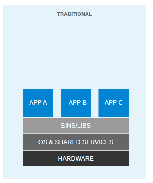

Traditional application deployment 

为了灵活部署，并且为了更好地利用主机系统的资源，发明了虚拟化。借助虚拟机管理程序，如 KVM、XEN、ESX、Hyper-V 等，我们模拟了**虚拟机**(虚拟机)的硬件，并在每个虚拟机上部署了一个来宾操作系统。虚拟机可以有不同于其主机的操作系统；这意味着我们负责管理该虚拟机的补丁、安全性和性能。通过虚拟化，应用程序在虚拟机级别被隔离，并由虚拟机的生命周期定义。这为我们带来了更好的投资回报和更高的灵活性，但代价是复杂性和冗余性增加。下图描述了一个典型的虚拟化环境:

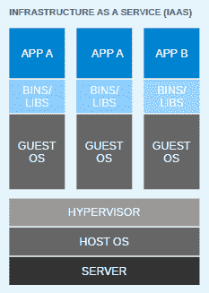

Application deployment in a virtualized environment

自从开发虚拟化以来，我们一直在朝着更加以应用程序为中心的 IT 方向发展。我们移除了虚拟机管理程序层，以降低硬件仿真和复杂性。应用程序与其运行时环境打包在一起，并使用容器进行部署。OpenVZ、Solaris Zones 和 LXC 是容器技术的几个例子。与虚拟机相比，容器的灵活性较低；例如，截至编写本文时，我们无法在 Linux OS 上运行 Microsoft Windows。容器也被认为不如虚拟机安全，因为有了容器，一切都在主机操作系统上运行。如果一个容器遭到破坏，那么就有可能获得对主机操作系统的完全访问权限。设置、管理和自动化可能有点过于复杂。这些是我们在过去几年中没有看到容器被大规模采用的几个原因，尽管我们有这种技术。下图显示了如何使用容器部署应用程序:

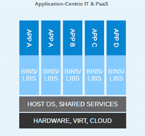

Application deployment with containers 

有了 Docker，集装箱一下子成了一等公民。所有大公司，如谷歌、微软、红帽、IBM 和其他公司，现在都在努力使容器成为主流。

Docker 是由 dotCloud 创始人所罗门·海克斯作为内部项目创立的。它于 2013 年 3 月在 Apache 2.0 许可下作为开源发布。借助 dotCloud 的平台即服务体验，Docker 的创始人和工程师意识到了运行容器的挑战。因此，通过 Docker，他们开发了一种管理容器的标准方法。

Docker 使用操作系统的底层内核特性，这使得容器化成为可能。下图描述了 Docker 平台和 Docker 使用的内核特性。让我们看看 Docker 使用的一些主要内核特性:

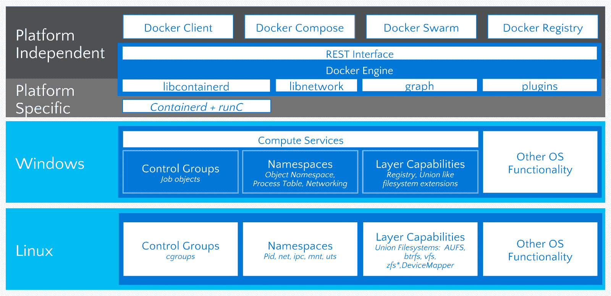

Docker platform and the kernel features used by Docker 

# 命名空间

名称空间是容器的构造块。命名空间有不同的类型，每种类型都将应用程序与其他应用程序隔离开来。它们是使用克隆系统调用创建的。您也可以附加到现有的命名空间。Docker 使用的一些名称空间将在以下章节中解释。

# PID 命名空间

PID 命名空间允许每个容器有自己的进程编号。每个工艺流程图都有自己的流程层次结构。父命名空间可以看到子命名空间并影响它们，但是子命名空间既不能看到父命名空间也不能影响它。

如果有两个层次，那么在顶层，我们会看到进程在子命名空间中以不同的 PID 运行。因此，在子命名空间中运行的进程将有两个 PID:一个在子命名空间中，另一个在父命名空间中。例如，如果我们在`container.sh `容器上运行一个程序，那么我们也可以在主机上看到相应的程序。

在容器上，`sh container.sh`流程的 PID 为`8`:


在主机上，同一个进程的 PID 为`29778`:


# net 命名空间

有了 PID 命名空间，我们可以在不同的隔离环境中多次运行同一个程序；例如，我们可以在不同的容器上运行不同的 Apache 实例。但是如果没有 net 名称空间，我们将无法监听它们中每一个的端口 80。net 命名空间允许我们在每个容器上有不同的网络接口，这解决了我前面提到的问题。每个容器中的环回接口也是不同的。

为了在容器中实现联网，我们在两个不同的网络名称空间中创建了成对的特殊接口，并允许它们相互通信。特殊接口的一端位于容器内部，另一端位于主机系统上。一般容器内部的接口叫`eth0`，在主机系统上给它取一个随机的名字，比如`veth516cc56`。然后，这些特殊接口通过主机上的网桥(`docker0`)进行链接，以实现容器和路由数据包之间的通信。

在容器内部，您将看到类似如下的内容:

```
$ docker container run -it alpine ash
# ip a
```

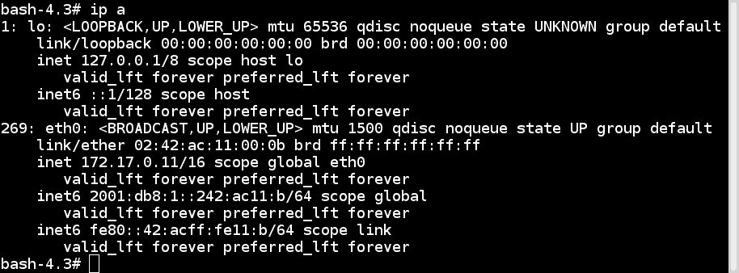

在主机上，它看起来如下所示:

```
$ ip a
```

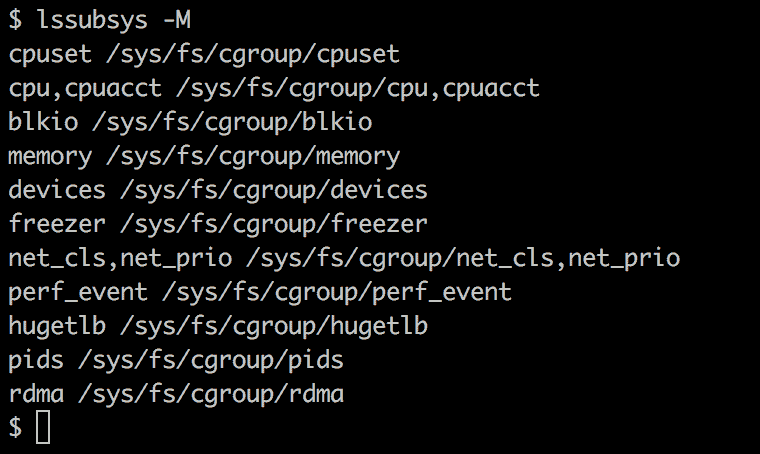

此外，每个网络名称空间都有自己的路由表和防火墙规则。

# IPC 命名空间

**进程间通信** ( **IPC** )命名空间提供信号量、消息队列和共享内存段。现在还没有广泛使用，但是一些程序仍然依赖它。

如果一个容器创建的 IPC 资源被另一个容器使用，那么在第一个容器上运行的应用程序可能会失败。使用 IPC 命名空间，在一个命名空间中运行的进程不能从另一个命名空间访问资源。

# mnt 命名空间

仅使用一个 chroot，您就可以从一个 chroot 目录/名称空间检查系统的相对路径。mnt 命名空间将 chroots 的思想提升到了一个新的层次。使用 mnt 命名空间，容器可以有自己的一组挂载的文件系统和根目录。一个 mnt 命名空间中的进程看不到另一个 mnt 命名空间的已装载文件系统。

# UTS 命名空间

使用 UTS 命名空间，我们可以为每个容器使用不同的主机名。

# 用户命名空间

有了用户名称空间支持，我们可以让用户在主机上有一个非零的标识，但是在容器中可以有一个零标识。这是因为用户名称空间允许映射每个名称空间的用户和组标识。

有多种方法可以在主机和容器以及其他容器之间共享命名空间。我们将在后续章节中看到如何做到这一点。

# cggroups

控制组(cgroups)为容器提供资源限制和核算。以下引文来自 Linux 内核文档:

"Control Groups provide a mechanism for aggregating/partitioning sets of tasks, and all their future children, into hierarchical groups with specialized behaviour."

简单来说，它们可以与`ulimit` shell 命令或`setrlimit`系统调用相比较。cgroups 不将资源限制设置为单个进程，而是允许您将资源限制为一组进程。

控制组分为不同的子系统，如中央处理器、中央处理器集、内存块输入/输出等。每个子系统可以独立使用，也可以与其他子系统组合使用。cgroups 提供的功能如下:

*   **资源限制**:例如，一个 cgroup 可以绑定到特定的 CPU，这样该组中的所有进程只能在给定的 CPU 上运行
*   **优先级**:一些群体可能获得更大份额的 CPU
*   **计费**:可以测量不同子系统的资源使用情况进行计费
*   **控制**:可以冻结和重启群组

cgroups 可以管理的一些子系统如下:

*   **blkio** :设置对数据块设备(如磁盘、固态硬盘等)的输入/输出访问
*   **Cpu** :限制对 Cpu 的访问
*   **Cpuacct** :生成 CPU 资源利用率
*   **CPU uset**:将多核系统上的 CPU 分配给一个组中的任务
*   **设备**:授予设备访问组中一组任务的权限
*   **冻结**:暂停或恢复一个组中的任务
*   **内存**:设置一组任务的内存使用限制

有多种方法可以控制对 cgroups 的工作。最流行的两种方法是手动访问 cgroup 虚拟文件系统和使用 libcgroup 库访问它。要在 Linux 上使用 libcgroup，请运行以下命令在 Ubuntu 或 Debian 上安装所需的包:

```
$ sudo apt-get install cgroup-tools
```

要在 CentOS、Fedora 或红帽上安装所需的软件包，请使用以下代码:

```
$ sudo yum install libcgroup libcgroup-tools
```

These steps are not possible on Docker for Mac and Windows, because you can't install the required packages on those versions of Docker.

安装后，您可以使用以下命令在伪文件系统中获取子系统列表及其挂载点:

```
$ lssubsys -M
```


虽然我们还没有看到实际的命令，但是让我们假设我们正在运行几个容器，并且想要获得一个容器的`cgroup`条目。要获取这些，我们首先需要获取容器标识，然后使用`lscgroup`命令获取容器的`cgroup`条目，我们可以使用以下命令获取:


For more details, visit [https://docs.docker.com/config/containers/runmetrics/.](https://docs.docker.com/config/containers/runmetrics/.)

# 联合文件系统

联合文件系统允许独立文件系统(称为层)的文件和目录被透明地覆盖，以创建新的虚拟文件系统。在启动一个容器时，Docker 会覆盖附加到图像的所有层，并创建一个只读文件系统。除此之外，Docker 创建了一个由容器的运行时环境使用的读/写层。可以阅读本章的*拉图运行容器*食谱了解更多详情。Docker 可以使用几种联合文件系统变体，包括 AUFS、Btrfs、zfs、覆盖、重叠 2 和设备映射器。

Docker 还有一个**虚拟文件系统** ( **VFS** )存储驱动。VFS 不支持写时复制，也不是联合文件系统。这意味着每个层都是磁盘上的一个目录，每次创建新层时，都需要其父层的深度拷贝。由于这些原因，它的性能较低，需要更多的磁盘空间，但它是一个健壮而稳定的选项，适用于所有环境。

# 容器格式

Docker 引擎将名称空间、控件组和 UnionFS 组合成一个称为容器格式的包装器。2015 年，Docker 将其容器格式和运行时捐赠给了一个名为**开放容器倡议** ( **OCI** )的组织。OCI 是一个轻量级、开放的治理结构，由 Docker 和其他行业领导者在 Linux 基金会下组建。OCI 的目的是围绕容器格式和运行时创建开放的行业标准。目前有两种规范:运行时规范和映像规范。

运行时规范概述了如何运行 OCI 运行时文件系统包。Docker 向 OCI 捐赠了 RuNC([https://github.com/opencontainers/runc](https://github.com/opencontainers/runc))其符合 OCI 标准的运行时，作为参考实现。

OCI 图像格式包含在目标平台上启动应用程序所需的信息。该规范定义了如何创建 OCI 图像，以及期望的输出是什么样子。输出将由映像清单、文件系统(层)序列化和映像配置组成。Docker 将其 Docker V2 图像格式捐赠给 OCI，以形成 OCI 图像规范的基础。

目前有两个支持 OCI 运行时和图像规范的容器引擎:Docker 和 rkt。

# 验证 Docker 安装的要求

很多 Linux 平台都支持 Docker，比如 RHEL、Ubuntu、Fedora、CentOS、Debian、Arch Linux 等等。许多云平台也支持它，如亚马逊网络服务、数字海洋、微软 Azure 和谷歌云。Docker 还为微软 Windows 和 Mac OS X 发布了桌面应用程序，使您可以轻松地让 Docker 直接在您的本地机器上启动和运行。

在本食谱中，我们将验证 Docker 安装的要求。我们将研究一个安装了 Ubuntu 18.04 LTS 的系统，尽管同样的步骤也适用于其他的 Linux 版本。

# 准备好

在安装了 Ubuntu 18.04 的系统上以 root 用户身份登录。

# 怎么做…

请执行以下步骤:

1.32 位架构不支持 Docker。要检查系统的体系结构，请运行以下命令:

```
 $ uname -i
 x86_64
```

2.  内核 3.8 或更高版本支持 Docker。它已经在一些内核 2.6 上进行了移植，比如 RHEL 6.5 和更高版本。要检查内核版本，请运行以下命令:

```
 $ uname -r
 4.15.0-29-generic
```

3.  运行内核应该支持适当的存储后端。这种后端的一些选项包括 VFS、设备映射器、AUFS、Btrfs、zfs 和 Overlayfs。

对于 Ubuntu，默认的存储后端或驱动程序是 overlay2，自 Ubuntu 14.04 以来一直可用。另一个流行的是设备映射器，它使用`device-mapper`精简资源调配模块来实现层。它应该默认安装在大多数 Linux 平台上。要检查`device-mapper`，您可以运行以下命令:

```
 $ grep device-mapper /proc/devices
 253 device-mapper
```

在大多数发行版上，AUFS 需要一个修改过的内核。

4.  对 cgroups 和名称空间的支持已经在内核中存在了一段时间，默认情况下应该是启用的。为了检查它们的存在，您可以查看正在运行的内核的相应配置文件。例如，在 Ubuntu 上，我可以做如下事情:

```
 $ grep -i namespaces /boot/config-4.15.0-29-generic
 CONFIG_NAMESPACES=y

 $ grep -i cgroups /boot/config-4.15.0-29-generic
 CONFIG_CGROUPS=y
```

The name of the `config` file is usually dependent on your kernel version. Your system might have a different filename. If this is the case, change the command accordingly. 

# 它是如何工作的…

Docker 要求主机系统满足一组基本要求，以便正确运行。通过运行前面的命令，我们能够确认我们的系统满足这些要求。

# 请参见

在 Docker 网站[https://docs.docker.com/install/](https://docs.docker.com/install/)查看安装文档。

# 在 Ubuntu 上安装坞站

Ubuntu 有几个不同的版本。在本食谱中，我们将在 Ubuntu 18.04 上安装 Docker，这是截至本文撰写时的最新 LTS 版本。这些相同的步骤也应该适用于 Ubuntu 16.04。

# 准备好

检查前面配方中提到的先决条件。

卸载所有旧版本的 Docker。Docker 软件包的早期版本被称为`docker`、`docker.io`或`docker-engine`。如果安装了这些，那么我们需要卸载它们，否则它们可能会导致问题:

```
 $ sudo apt-get remove docker docker-engine docker.io
```

# 怎么做…

执行以下步骤:

1.  更新`apt`包索引:

```
 $ sudo apt-get update
```

2.  安装软件包以允许`apt`使用 HTTPS 的存储库:

```
 $ sudo apt-get install \
 apt-transport-https \
 ca-certificates \
 curl \
 software-properties-common
```

3.  添加 Docker 的官方 GPG 密钥:

```
 $ curl -fsSL https://download.docker.com/linux/ubuntu/gpg | sudo apt-key add -
 OK
```

验证我们安装了正确的密钥:

```
 $ sudo apt-key fingerprint 0EBFCD88
 pub rsa4096 2017-02-22 [SCEA]
 9DC8 5822 9FC7 DD38 854A E2D8 8D81 803C 0EBF CD88
 uid [ unknown] Docker Release (CE deb) <docker@docker.com>
 sub rsa4096 2017-02-22 [S]
```

4.  使用`stable`通道添加 Docker `apt`存储库:

```
 $ sudo add-apt-repository \
 "deb [arch=amd64] https://download.docker.com/linux/ubuntu \
 $(lsb_release -cs) \
 stable"
```

If you want more frequent updates, and you don't mind a few bugs, you can use the nightly test channel. To use the test channel, all you need to do is change `stable` to `test` in the preceding command.

5.  更新`apt`包索引，使其包含我们刚刚添加的 Docker 存储库:

```
 $ sudo apt-get update
```

6.  安装最新版本的 Docker CE:

```
 $ sudo apt-get install docker-ce
```

7.  验证安装是否正常:

```
 $ sudo docker container run hello-world
```

# 它是如何工作的...

前面的命令将在 Ubuntu 上安装 Docker 以及它所需的所有包。

# 还有更多…

默认的 Docker 守护程序配置文件位于`/etc/docker`，在启动守护程序时使用。以下是一些基本操作:

*   要启动服务，请输入以下内容:

```
 $ sudo systemctl start docker
```

*   要验证安装，请输入以下内容:

```
 $ docker info
```

*   要更新包，请输入以下内容:

```
 $ sudo apt-get update
```

*   要在启动时启动服务，请输入以下内容:

```
 $ sudo systemctl enable docker
```

*   要停止服务，请输入以下内容:

```
 $ sudo systemctl stop docker
```

# 请参见

更多信息，请查看 https://docs.docker.com/install/linux/docker-ce/ubuntu/ Docker 网站上的 Ubuntu 安装文档。

# 在中央操作系统上安装 Docker

另一个流行的 Linux 发行版是 CentOS，这是一个免费的企业级发行版，与红帽企业版 Linux (RHEL)兼容。通过以下简单的方法在 CentOS 7.x 上安装 Docker。

# 准备好

必须启用`centos-extra`存储库。这通常是默认启用的，但是如果您禁用了它，请再次启用它。

此前，Docker 包有一个不同的名字:它被称为`docker`或`docker-engine`；它现在被称为`docker-ce`。我们需要删除任何以前的 Docker 版本，以防止任何冲突:

```
$ sudo yum remove docker \
 docker-client \
 docker-client-latest \
 docker-common \
 docker-latest \
 docker-latest-logrotate \
 docker-logrotate \
 docker-selinux \
 docker-engine-selinux \
 docker-engine
```

It is OK if `yum` reports that none of these packages are installed.

# 怎么做...

执行以下步骤:

1.  安装所需的软件包:

```
 $ sudo yum install -y yum-utils \
 device-mapper-persistent-data \
 lvm2
```

2.  使用`stable`通道设置 Docker `yum`存储库:

```
 $ sudo yum-config-manager \
 --add-repo \
 https://download.docker.com/linux/centos/docker-ce.repo
```

3.  **可选**:启用`test`通道访问夜间版本:

```
 $ sudo yum-config-manager --enable docker-ce-test
```

4.  安装最新版本的`docker-ce`:

```
 $ sudo yum install docker-ce
```

5.  如果提示接受 GPG 键，请确认其与`060A 61C5 1B55 8A7F 742B 77AA C52F EB6B 621E 9F35`匹配。如果是，那么接受它:

```
 Retrieving key from https://download.docker.com/linux/centos/gpg
 Importing GPG key 0x621E9F35:
 Userid : "Docker Release (CE rpm) <docker@docker.com>"
 Fingerprint: 060a 61c5 1b55 8a7f 742b 77aa c52f eb6b 621e 9f35
 From : https://download.docker.com/linux/centos/gpg
 Is this ok [y/N]: y
```

6.  启动停靠守护进程:

```
 $ sudo systemctl start docker
```

7.  验证安装是否正常:

```
 $ docker container run hello-world
```

# 它是如何工作的...

前面的方法在 CentOS 上安装了 Docker 及其所需的所有包。

# 还有更多...

默认的 Docker 守护程序配置文件位于`/etc/docker`，在启动守护程序时使用。以下是一些基本操作:

*   要启动服务，请输入以下内容:

```
 $ sudo systemctl start docker
```

*   要验证安装，请输入以下内容:

```
 $ docker info
```

*   要更新包，请输入以下内容:

```
 $ sudo yum -y upgrade
```

*   要在启动时启用服务启动，请输入以下内容:

```
 $ sudo systemctl enable docker
```

*   要卸载 Docker，请输入以下内容:

```
 $ sudo yum remove docker-ce
```

*   要停止服务，请输入以下内容:

```
 $ sudo systemctl stop docker
```

# 请参见

有关更多信息，请查看 Docker 网站上的 CentOS 安装文档，网址为[https://docs.docker.com/install/linux/docker-ce/centos/](https://docs.docker.com/install/linux/docker-ce/centos/)。

# 用自动脚本在 Linux 上安装 Docker

在前两个食谱中，我们经历了在 Ubuntu 和 CentOS 上安装 Docker 所需的不同步骤。当您只在一两个主机上安装它时，这些步骤很好，但是如果您需要在一百个主机上安装它呢？在这种情况下，您会想要一些更自动化的东西来加速这个过程。这个食谱向您展示了如何使用 Docker 提供的安装脚本在不同的 Linux 版本上安装 Docker。

# 准备好

像你从网上下载的所有脚本一样，你应该做的第一件事是检查脚本，并确保你在使用它之前知道它在做什么。为此，请执行以下步骤:

1.  在你最喜欢的网络浏览器中访问[https://get.docker.com](https://get.docker.com)查看脚本，并确保你对它正在做的事情感到满意。如果有疑问，不要使用它。
2.  该脚本需要以 root 或 sudo 权限运行。
3.  如果 Docker 已经安装在主机上，则需要在运行脚本之前将其删除。

该脚本目前使用以下几种 Linux 风格:CentOS、Fedora、Debian、Ubuntu 和 Raspbian。

# 怎么做

要使用该脚本，请执行以下步骤:

1.  将脚本下载到主机系统:

```
 $ curl -fsSL get.docker.com -o get-docker.sh
```

2.  运行脚本:

```
 $ sudo sh get-docker.sh
```

# 它是如何工作的...

前面的方法使用自动脚本在 Linux 上安装 Docker。

# 还有更多...

为了升级 Docker，您需要在主机上使用包管理器。如果试图重新添加已经添加的存储库，重新运行脚本可能会导致问题。参见前面的食谱，了解如何使用它们各自的包管理器升级 CentOS 和 Ubuntu 上的 Docker。

# 为窗口安装 Docker

Docker for Windows 是一个本机应用程序，与 Hyper-V 虚拟化以及 Windows 网络和文件系统深度集成。这是一个功能齐全的开发环境，可用于在 Windows 电脑上构建、调试和测试 Docker 应用程序。它还可以很好地与虚拟专用网络和代理一起工作，使其在企业环境中使用时更容易。

Docker for Windows 开箱即用地支持 Windows 和 Linux 容器，在两者之间切换以构建您的多平台应用程序非常容易。它配备了码头工人命令行界面客户端、码头工人编写、码头工人机器和码头工人公证人。

最近的版本也增加了对 Kubernetes 的支持，这样您只需点击一个按钮，就可以轻松地在您的机器上创建完整的 Kubernetes 环境。

# 准备好

Windows docker 有以下系统要求:

*   64 位 Windows 10 Pro、企业版和教育版(1607 周年更新，版本 14393 或更高版本)
*   虚拟化必须在基本输入输出系统中启用，并且能够支持中央处理器。
*   4 GB 内存

If your system does not satisfy these requirements, fear not—all is not lost. You can install Docker Toolbox ([https://docs.docker.com/toolbox/overview/](https://docs.docker.com/toolbox/overview/)), which uses Oracle VirtualBox instead of Hyper-V. It isn't as good, but it is better than nothing.

# 怎么做

要为 Windows 安装 Docker，请执行以下步骤:

1.  从 Docker 商店[下载 Windows Docker，网址为 https://Store . Docker . com/editions/community/Docker-ce-desktop-Windows](https://store.docker.com/editions/community/docker-ce-desktop-windows)。您需要登录才能下载安装程序。如果您没有 Docker 帐户，您可以在[https://store.docker.com/signup](https://store.docker.com/signup)创建一个。
2.  双击从商店下载的安装文件。应该叫类似`Docker for windows` `Installer.exe`的东西:


一旦安装完成，它将自动启动。您会在任务栏的通知区域注意到一个小鲸鱼图标。如果需要更改任何设置，右键单击图标并选择设置。

3.  打开命令行终端并检查以确保安装工作正常:

```
 $ docker container run hello-world
```

# 它是如何工作的...

这个食谱将告诉你如何在你的 Windows 机器上安装 Docker 开发环境。

# 还有更多

现在您已经安装了 Docker for Windows，请查看以下提示以充分利用您的安装:

*   视窗 Docker 支持视窗和 Linux 容器。如果你想切换，你只需要右击鲸鱼图标，选择切换到 Windows 容器...，然后单击“切换”按钮:


要切换回来，做同样的事情，除了这次，选择切换到 Linux 容器....

*   Windows docker 将自动检查新的更新，并让您知道何时有新版本可供安装。如果您同意升级，它将下载新版本并为您安装。
*   默认情况下，Kubernetes 不运行。如果你想打开它，你需要右击任务栏中的 Docker whale 图标，然后选择设置。在“设置”菜单中，有一个 Kubernetes 选项卡。单击选项卡，然后单击启用库本内特选项并点击应用按钮:

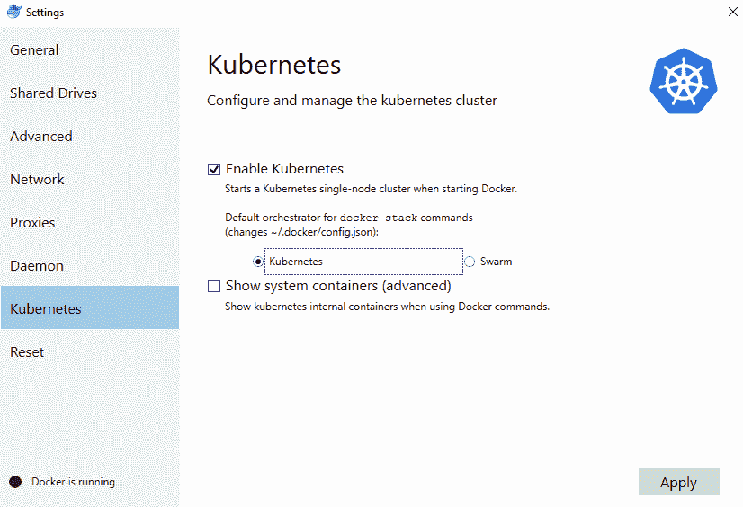

# 请参见

有关 Windows Docker 的更多信息，以及实验室和更多示例的链接，请访问[https://docs.docker.com/docker-for-windows/](https://docs.docker.com/docker-for-windows/)。

# 为 Mac 安装 Docker

Mac 的 Docker 是在 Mac 上运行 Docker 最快、最可靠的方法。它安装了在您的 Mac 上设置完整的 Docker 开发环境所需的所有工具。它包括 Docker 命令行、Docker 编写和 Docker 公证。它还可以很好地与虚拟专用网络和代理一起工作，使其在企业环境中使用时更容易。

最近的版本也增加了对 Kubernetes 的支持，这样您只需点击一个按钮，就可以轻松地在您的机器上创建完整的 Kubernetes 环境。

# 准备好

Docker 有以下系统要求:

*   macOS El Capitan 10.11 或更新的 macOS 版本
*   至少 4 GB 内存
*   Mac 硬件必须是 2010 年或更高版本，英特尔硬件支持**内存管理单元** ( **MMU** )虚拟化，包括**扩展页表** ( **EPT** )和无限制模式。要查看您的机器是否支持此功能，请在终端中运行以下命令:

```
 $ sysctl kern.hv_support
 kern.hv_support: 1

```

If your system does not satisfy these requirements, fear not—all is not lost. You can install Docker Toolbox ([https://docs.docker.com/toolbox/overview/](https://docs.docker.com/toolbox/overview/)), which uses Oracle VirtualBox instead of HyperKit. It isn't as good, but it is better than nothing.

# 怎么做

要为 Mac 安装 Docker，请执行以下步骤:

1.  从 Docker 商店[https://Store . Docker . com/editions/community/Docker-ce-desktop-Mac](https://store.docker.com/editions/community/docker-ce-desktop-mac)下载 Docker for Mac。您需要登录才能下载安装程序。如果您没有 Docker 帐户，您可以在[https://store.docker.com/signup](https://store.docker.com/signup)创建一个。
2.  打开从商店下载的安装文件。应该叫`Docker.dmg`之类的东西。

3.  将鲸鱼图标拖放到应用程序文件夹中:

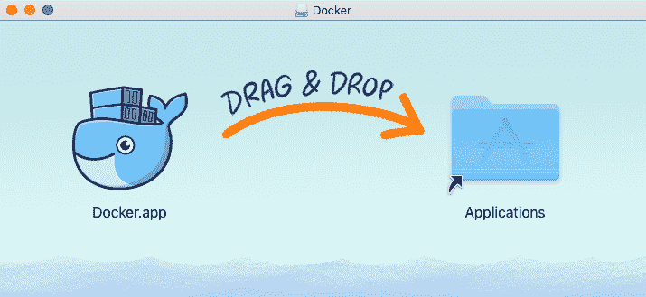

4.  双击应用程序文件夹中的 Docker.app 图标启动 Docker，如下图所示:


5.  系统将提示您使用系统密码授权 Docker.app。这很正常——docker . app 需要特权访问才能安装它的一些组件。单击“确定”并输入您的密码，以便完成安装:


6.  当 Docker 完成后，屏幕右上角的状态菜单中会出现一个小鲸鱼图标，如下图所示:


7.  如果您点击鲸鱼，您可以访问应用程序首选项和其他选项。
8.  选择“关于 Docker”按钮以验证您是否拥有最新版本。
9.  检查以确保它已安装并正常工作。打开终端窗口并键入以下内容:

```
 $ docker container run hello-world
```

# 它是如何工作的...

上面的方法将在你的 Mac 上下载并安装一个 Docker 开发环境。

# 还有更多...

现在您已经安装了 Docker for Mac，下面是一些入门的提示:

*   Docker 将自动检查新的更新，并让您知道何时有新版本可供您安装。如果你同意升级，它会做所有的工作，下载新版本并为你安装。
*   默认情况下，Kubernetes 不运行。如果你想打开它，你需要点击状态菜单中的 Docker whale 图标，然后选择首选项。在首选项中，有一个 Kubernetes 选项卡。单击选项卡，然后单击启用库本内斯选项，并点击应用按钮:

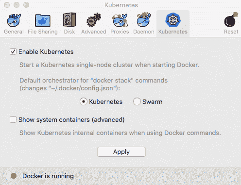

# 请参见

请访问*开始使用 Mac Docker*指南，帮助您了解该应用程序以及如何最好地使用它。你可以在[https://docs.docker.com/docker-for-mac/](https://docs.docker.com/docker-for-mac/)找到它。

# 提取图像并运行容器

我借用下一章的食谱来介绍一些概念。如果食谱不能说明一切，不要担心；我们将在本章后面或接下来的几章中详细介绍这些主题。现在，让我们拉一个图像并运行它。我们还将熟悉 Docker 架构及其在本食谱中的组件。

# 准备好

首先，访问安装了 Docker 的系统。

# 怎么做...

要提取图像并运行容器，请执行以下步骤:

1.  通过运行以下命令拉出图像:

```
 $ docker image pull alpine
```

2.  使用以下命令列出现有图像:

```
 $ docker image ls
```


3.  使用提取的图像创建容器，并按如下方式列出容器:

```
 $ docker container run -id --name demo alpine ash
```


# 它是如何工作的…

Docker 采用客户机-服务器架构。它的二进制文件由 Docker 客户端和服务器守护程序组成，可以驻留在同一台主机上。客户端可以通过套接字或 RESTful API 与本地或远程 Docker 守护程序进行通信。Docker 守护进程构建、运行和分发容器。如下图所示，Docker 客户端向主机上运行的 Docker 守护程序发送命令。Docker 守护程序还连接到公共或本地注册表，以获取客户端请求的映像:

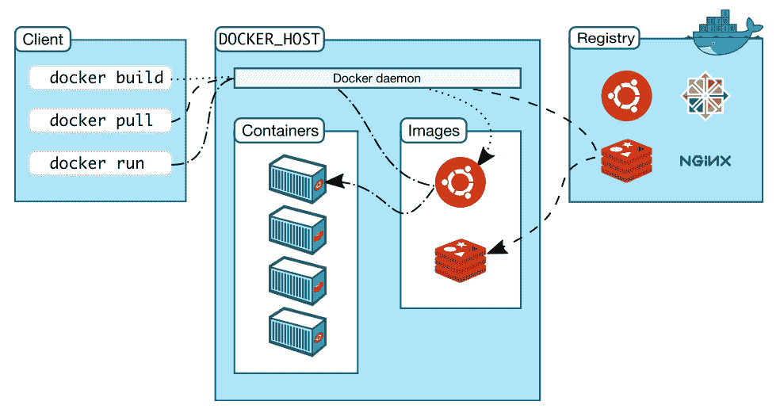

因此，在我们的例子中，Docker 客户端向本地系统上运行的守护程序发送请求，然后守护程序连接到公共 Docker 注册表并下载映像。下载后，我们就可以运行它了。

# 还有更多…

让我们来探究一下我们在本食谱前面遇到的一些关键词:

*   **图像** : Docker 图像是只读模板，在运行时给我们容器。它们是基于一个基本图像和位于其上的图层的想法。例如，我们可以有一个 Alpine 或 Ubuntu 的基础图像，然后我们可以在基础图像上安装软件包或进行修改，以创建一个新的层。基础图像和新图层可以被视为新图像。例如，在下图中，Debian 是基础图像，然后 Emacs 和 Apache 是添加在它上面的两个层。它们高度便携，可以轻松共享:

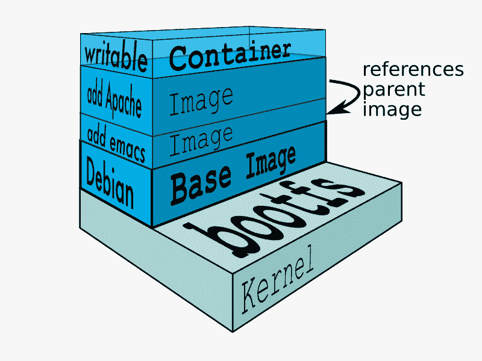

图层透明地放置在基础图像的顶部，以创建一个统一的文件系统。

*   **注册表**:注册表保存 Docker 映像。它可以是公共的或私有的，这取决于您可以下载或上传图像的位置。公共码头工人登记处被称为**码头工人中心**，我们将在后面介绍。
*   **索引**:索引管理用户帐户、权限、搜索、标记以及 Docker 注册表的公共网络界面中的所有好东西。
*   **容器**:容器运行由基础图像和其上的图层组合而成的图像。它们包含运行应用程序所需的一切。如上图所示，在启动容器时还添加了一个临时层，如果在容器停止并删除后没有提交，这个临时层将被丢弃。如果它被提交，那么它将创建另一个层。
*   **存储库**:一个图像的不同版本可以通过多个标签进行管理，用不同的 GUID 进行保存。存储库是由 GUIDs 跟踪的图像的集合。

# 请参见

有关更多信息，请查看 Docker 网站上的文档，网址为[https://docs.docker.com/engine/docker-overview/](https://docs.docker.com/engine/docker-overview/)。

# 添加非根用户来管理 Docker

为了便于使用，我们可以允许非根用户通过将其添加到 Docker 组来管理 Docker。在 Mac 或 Windows 上使用 Docker 时，这不是必需的。

# 准备好

要准备添加非根用户来管理 Docker，请执行以下步骤:

1.  创建 Docker 组(如果还没有):

```
 $ sudo groupadd docker
```

2.  创建要授予其管理 Docker 权限的用户:

```
 $ sudo useradd dockertest
```

# 怎么做...

运行以下命令，将新创建的用户添加到 Docker 中进行管理:

```
 $ sudo usermod -aG docker dockertest
```

# 它是如何工作的…

前面的命令将用户添加到 Docker 组。这样，添加的用户将能够执行所有 Docker 操作。

# 使用 Docker 命令行查找帮助

Docker 命令被很好地记录下来，并且可以在任何需要的时候被引用。许多文档也可以在线获得，但是它可能与您正在运行的 Docker 版本的文档不同。

# 准备好

首先，在您的系统上安装 Docker。

# 怎么做…

1.  在基于 Linux 的系统上，您可以使用`man`命令来查找帮助，如下所示:

```
 $ man docker
```

2.  也可以通过以下任一命令找到特定于子命令的帮助:

```
 $ man docker ps
 $ man docker-ps
```

# 它是如何工作的…

`man`命令使用 Docker 包安装的`man`页面提供帮助。

# 请参见

有关更多信息，请参见 Docker 网站上位于[https://docs.docker.com/engine/reference/commandline/cli/](https://docs.docker.com/engine/reference/commandline/cli/)的文档。