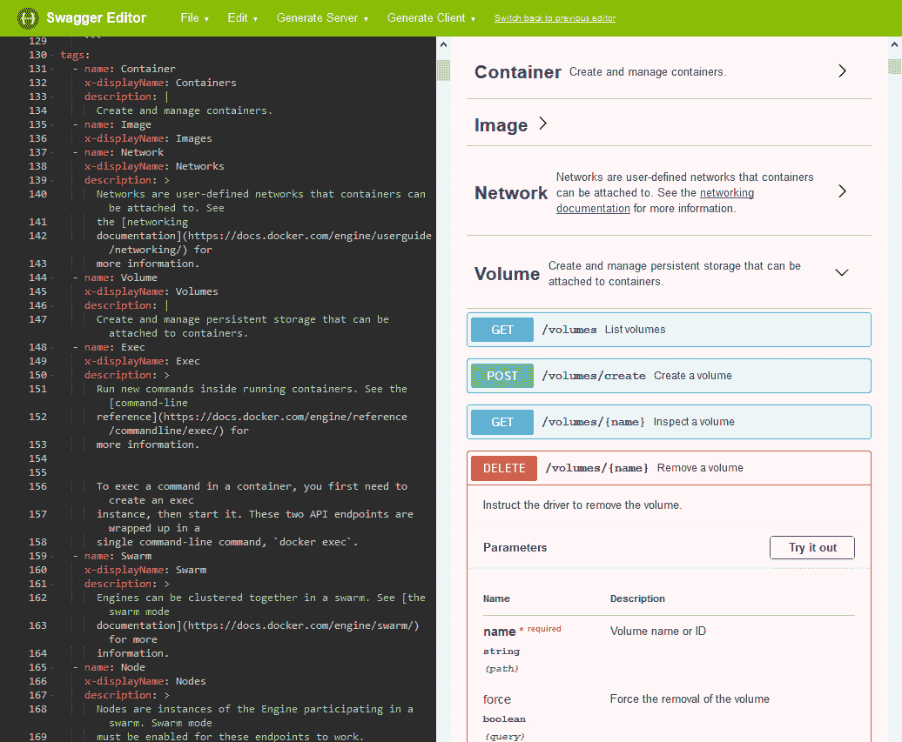
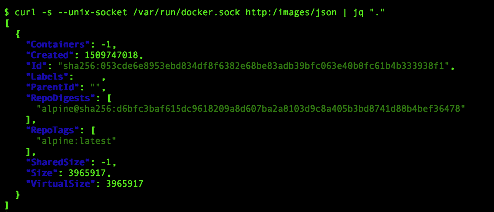
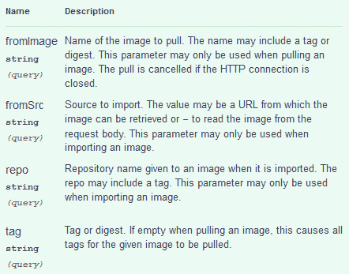
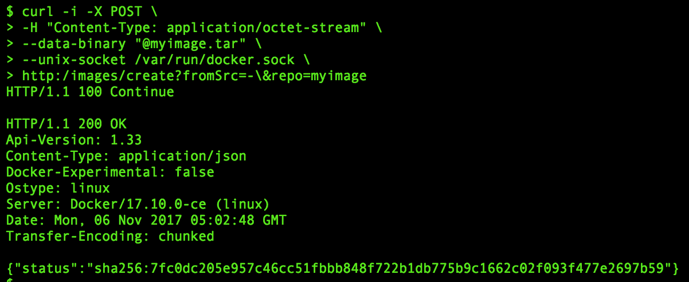
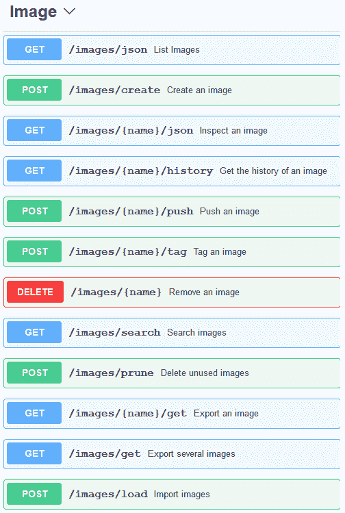
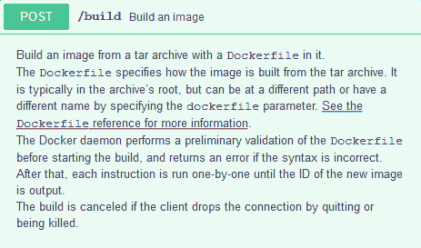
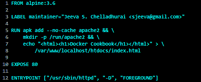

# 六、Docker API 和 SDK

在本章中，我们将介绍以下食谱:

*   使用应用编程接口处理映像
*   使用 API 构建映像
*   使用 API 启动容器
*   使用 API 执行容器操作
*   探索 Docker 远程应用编程接口客户端库
*   为远程连接配置 Docker 守护程序
*   保护 Docker 守护进程的远程连接

# 介绍

在前面的章节中，我们已经使用了很多 Docker 命令来处理 Docker 映像、容器、卷和网络。Docker 的标志之一是它通过易于记忆和结构良好的命令提供了惊人的用户体验。通过一个 Docker 命令，我们可以旋转一个非常有用的微服务或实用程序容器。然而，在幕后，Docker 客户端将我们的请求翻译成多个 API 调用来实现它。这些 API 被称为 Docker 引擎 API，它们是使用 REST 范式设计的。

Note: **REST** (aka **RESTful**) stands for **REpresentational State Transfer**, which is a web standard for data communication over the HTTP protocol.

Docker 引擎 API 使用 OpenAPI(以前称为**swaggle**)规范进行记录。因此，我们可以通过任何标准的 OpenAPI 编辑器访问 API 帮助。在这本书里，我们使用了一个名为 Swagger Editor 的编辑器，它可以在[http://Editor . swaggy . io](http://editor.swagger.io)上找到；但是，您可以使用自己选择的任何 OpenAPI 编辑器。Swagger Editor 有“试用”和“执行”等选项，可用于生成带有适当选项的`curl`命令。下面的截图显示了带有 Docker 引擎 API 文档的 Swagger 编辑器:



在这里，我们从[https://docs.docker.com/engine/api/v1.35/swagger.yaml.](https://docs.docker.com/engine/api/v1.35/swagger.yaml.)提供的`swagger.yaml`文件中生成了 Docker Engine API 文档，当然，您也可以从[https://raw . githubusercontent . com/Moby/Moby/master/API/swag . YAML .](https://raw.githubusercontent.com/moby/moby/master/api/swagger.yaml)中参考当前正在进行的 API 版本

默认情况下，Docker 引擎监听`/var/run/docker.sock`，一个 Unix 域套接字，与其客户端通信。Unix 域套接字，也称为进程间通信套接字，支持主机内的可靠通信。除此之外，`/var/run/docker.sock`对用户`root`和组`docker`有读写权限；因此，客户端应用必须拥有`root`权限或者是`docker`组的成员。除了 Unix 套接字之外，Docker 守护程序还支持两种套接字类型:

*   `fd` : Systemd 的套接字激活。在基于 Systemd 的系统上，例如 Ubuntu 16.04，Docker 守护进程监听`fd`套接字，该套接字使用 systemd 的套接字激活特性在内部映射到 Unix 套接字`/var/run/docker.sock`。
*   `tcp`:用于远程连接。在配方*中，配置 Docker 守护程序进行远程连接*，我们将配置 Docker 守护程序接受来自客户端的未加密通信，在配方*中，保护 Docker 守护程序的远程连接*，我们将配置 Docker 守护程序使用安全通信。

Docker 还为 Python 和 Go 字母组合语言提供了软件开发工具包。这些 SDK 在内部使用 Docker 引擎 REST APIs。除了这些标准的 SDK 之外，还有许多其他编程语言的社区支持的 API 绑定。这些应用编程接口绑定中的一些列在[https://docs.docker.com/develop/sdk/#unofficial-libraries](https://docs.docker.com/develop/sdk/#unofficial-libraries)上。然而，Docker 并没有测试这些库。

在本章中，我们将使用两个工具:`curl`和`jq`:

*   `curl`是传输数据的命令行工具。我们使用`curl`连接到我们的 Docker 守护进程。请确保您运行的是`curl`T3 或更高版本，因为 curl 从版本`7.40`开始支持 Unix 套接字。你可以在官方网站[https://curl.haxx.se/.](https://curl.haxx.se/)找到更多关于`curl`的详细信息
*   `jq`是处理 JSON 数据的命令行工具。我们使用`jq`来处理从 Docker 守护进程接收的数据。您可以在[https://stedolan.github.io/jq/.](https://stedolan.github.io/jq/)T5 官方网站上找到更多关于`jq`的详细信息

In this chapter we are using Ubuntu 16.04 and Docker 17.10, because of an issue with the default curl command that comes along with the Ubuntu 18.04 installation.  If you choose to continue with Ubuntu 18.04 and Docker 18.03, you can do so by prefixing any text in the Docker API endpoint (http://bug/version) as a workaround.

本章中的所有配方都假设 Docker 已经安装并运行。

# 使用应用编程接口处理映像

如前所述，Docker 在内部使用 Docker 引擎 API 来满足我们所有的容器化需求

南在本食谱中，我们将使用`curl`命令和 Docker 引擎 API 对 Docker 映像执行各种操作。

# 怎么做...

在本食谱中，我们将看一些映像操作，如下所示:

1.  要列出映像，请使用以下应用编程接口:


下面是前面语法的一个例子:



2.  您可以使用以下应用编程接口从任何注册表或 tar 文件中提取映像来创建映像:


`/img/create`应用编程接口支持几个选项来处理映像，如下所列:



现在让我们看几个例子:

3.  从 Docker Hub 获取`cookbook/apache2`映像:

```
 $ curl -X POST \ --unix-socket /var/run/docker.sock \ 
 httimg/create?fromImage=cookbook/apache2
```

4.  获取带有`latest`标签的 WordPress 映像:


5.  从`tar`文件创建映像:



在本例中，我们选择使用`curl`命令的`--data-binary`选项从 Docker 主机上传映像作为 tar 包。这里，`myimage.tar`的内容通过 HTTP 消息体发送给 Docker 守护进程。如果你仔细观察`curl`命令调用，你会注意到`-i`选项。我们正在使用`curl`命令的`-i`选项来获取 HTTP 头信息。

要删除映像，请使用以下应用编程接口:


下面是前面语法的一个例子:

```
    $ curl -X DELETE \
           --unix-socket /var/run/docker.sock \
           httimg/wordpress:latest 
```

# 它是如何工作的...

在本食谱中，我们使用`curl`命令对 Docker 映像执行了各种操作。`curl`命令通过 HTTP 将我们的应用编程接口请求作为 REST 应用编程接口请求发送给 Docker 守护程序。接下来，Docker 守护程序将对映像执行请求的操作，并回复操作状态。

# 还有更多...

在这个食谱中，我们只介绍了与 Docker 映像处理相关的三个 API，但还有更多。下面的截图列出了所有可用的`/images`API:



# 请参见

*   每个应用编程接口端点可以有不同的输入来控制操作。有关更多详细信息，请访问 Docker 网站上的文档，网址为[https://docs.docker.com/engine/api/latest/.](https://docs.docker.com/engine/api/latest/)

# 使用 API 构建映像

在前面的食谱中，我们探索了使用 API 对 Docker 映像执行的一些操作。在这个食谱中，我们将使用`/build` API 构建一个 Docker 映像。以下是斯瓦格编辑器的`/build`应用编程接口片段:



# 怎么做...

1.  首先克隆[https://github.com/docker-cookbook/apache2](https://github.com/docker-cookbook/apache2)存储库，如下所示:

```
    $ git clone https://github.com/docker-cookbook/apache2  
```

该存储库包含用于捆绑`apache2`服务的`Dockerfile`；这里列出的是`Dockerfile`的内容:



2.  让我们通过将克隆的`apache2`存储库的内容绑定为 tar 文件来创建构建上下文，如下所示:

```
        $ cd apache2
        $ tar cvf /tmp/apache2.tar *  
```

3.  继续使用`/build`应用编程接口构建 Docker 映像:

```
        $ curl -X POST \
           -H "Content-Type:application/tar" \
           --data-binary '@/tmp/apache2.tar' \
    --unix-socket /var/run/docker.sock \ 
           http:/build
```

在构建过程中，您会收到一系列 JSON 消息形式的构建日志。一旦构建成功完成，您将获得类似如下的 JSON 消息:

```
    {"stream":"Successfully built 3c6f5044386d\n"} 
```

在前面的 JSON 消息中，`3c6f5044386d`是我们刚刚使用`/build` API 构建的映像的 ID。

# 它是如何工作的...

在这个方法中，我们将构建上下文捆绑为一个 tar 文件，并将其作为`/build` API 调用的一部分发送给 Docker 引擎。Docker 引擎使用构建上下文和构建上下文中的`Dockerfile`来构建 Docker 映像。

# 还有更多...

1.  在这个配方中，我们没有指定任何存储库或标签名，因此创建的映像没有任何存储库或标签名，如下所示:

```
        $ curl -s --unix-socket /var/run/docker.sock \
                 httimg/json | jq ".[0].RepoTags"
    [
      "<none>:<none>"
    ]  
```

当然，您现在可以使 img/{name}/tag`应用编程接口用适当的存储库和标签名称来标记映像。以下是从斯瓦格编辑器中截取的帮助文档:


或者，您可以在构建期间使用`t`参数将映像与存储库名称捆绑在一起，如下所示:

```
        $ curl -X POST \
           -H "Content-Type:application/tar" \
           --data-binary '@/tmp/apache2.tar' \
    --unix-socket /var/run/docker.sock \ 
           http:/build?t=apache2:usingapi  
```

标签名是可选的，如果没有指定标签名，Docker 构建引擎将采用标签名`latest`。

2.  您还可以使用以下应用编程接口从容器创建映像:


以下是从容器标识`4aaec8980c43`提交映像的示例:


# 请参见

每个应用编程接口端点可以有不同的输入来控制操作。有关更多详细信息，请访问 Docker 网站上的文档，网址为[https://docs.docker.com/engine/api/latest/.](https://docs.docker.com/engine/api/latest/)

# 使用 API 启动容器

在[第二章](02.html)、*与 Docker Containers 合作、*配方*启动容器*中，我们有条不紊、一丝不苟地探索了运行容器的不同方式。在所有这些场景中，我们使用了带有几个选项的`docker container run`命令，并且我们所有的容器都已启动并运行。然而，在幕后，Docker CLI 通过首先通过`/create` API 创建容器层，然后通过`/start` API 启动应用(`cmd`)来实现，如下图所示:


除了`/create`和`/start` API 之外，Docker CLI 还使用了`/attach`和`/wait`等 API 来满足我们的要求。在本食谱中，我们将创建一个`alpine`容器，并运行一个简单的`ls`命令来演示通过 Docker 引擎 API 启动容器所涉及的步骤。

# 怎么做...

1.  首先从`alpine`映像创建一个容器，如下图所示:


这里，我们使用`curl`命令的`-d`选项将我们的容器配置作为 JSON 数据传递给 Docker 引擎。显然，映像是`alpine`，我们选择在容器启动时运行的命令是`ls`。此外，我们还请求 Docker 引擎将`STDERR`和`STDOUT`附加到该容器，以便检索`ls`命令的输出。

HTTP 头响应代码`201 Created`表示我们的容器创建成功。显然，来自 Docker 引擎的响应也是一个 JSON 负载。有效载荷的标识字段包含容器标识，即`f9fd4b2e2040d4dea32deb527889bf2fb95b351d8316a4c74bfb6e2e38c9b499`。我们将使用容器标识的简称`f9fd4b2e2040`，对该容器执行进一步的操作。

2.  由于我们想要在屏幕上捕获`ls`命令的输出，让我们使用`/attach`应用编程接口连接到容器:


如果使用`stderr`、`stdout`和`stream`参数调用`/attach`应用编程接口，将会阻塞客户端(即`curl`，所以我们在后台运行`curl`命令。

3.  现在，继续使用`/start` API 启动容器，如下所示:


很酷，不是吗？我们用 Docker 引擎 API 模拟了`docker container run`命令。

# 它是如何工作的...

在这个配方中，我们使用了三个 Docker 引擎 API 来成功启动一个容器。在后端，Docker 引擎接收来自客户端的 API 调用，并代表客户端为`/container/create` API 调用创建容器，然后为`/containers/attach` API 调用阻塞 HTTP 流，最后为`/containers/start` API 调用在容器的名称空间内运行`ls`命令。

# 还有更多...

以下是处理容器生命周期的 API 列表:


# 请参见

每个应用编程接口端点可以有不同的输入来控制操作。有关更多详细信息，请访问 Docker 网站上的文档，网址为[https://docs.docker.com/engine/api/latest/.](https://docs.docker.com/engine/api/latest/)

# 使用 API 执行容器操作

在前面的配方中，我们启动了一个容器，并使用`/create`、`/attach`和`/start`应用编程接口在容器中执行了一个命令。在这个配方中，我们对容器执行了一些操作。

# 怎么做...

在本食谱中，我们将了解一些容器操作:

1.  要列出容器，请使用以下应用编程接口:


这里有几个例子:

*   以下是如何获得所有运行的容器:

```
        $ curl --unix-socket /var/run/docker.sock \
           http:/containers/json 
```

*   以下是如何获取所有正在运行的容器，包括停止的容器:

```
        $ curl --unix-socket /var/run/docker.sock \
           http:/containers/json?all=1
```

2.  要检查容器，请使用以下应用编程接口:


这里有一个检查容器的例子`591ab8ac2650`:

```
    $ curl --unix-socket /var/run/docker.sock \ 
        http:/containers/591ab8ac2650/json  
```

3.  要获取容器内运行的进程列表，请使用以下应用编程接口:


下面是一个在`591ab8ac2650`容器中运行的进程的例子:

```
        $ curl --unix-socket /var/run/docker.sock \ 
        http:/containers/591ab8ac2650/top
```

4.  要获取容器的资源使用统计数据，请使用以下应用编程接口:


下面是获取`591ab8ac2650`容器的资源使用统计的一个例子:

```
        $ curl --unix-socket /var/run/docker.sock \ 
        http:/containers/591ab8ac2650/stats  
```

默认情况下，该应用编程接口流式传输资源使用统计数据。但是，您可以使用`stream`参数禁用流，如下所示:

```
        $ curl --unix-socket /var/run/docker.sock \ 
        http:/containers/591ab8ac2650/stats?stream=0  
```

# 它是如何工作的...

当我们使用这个配方中描述的 API 与 Docker 引擎连接时，Docker 引擎会反过来从它的数据源收集相关信息并将其发送回客户端。

# 请参见

每个应用编程接口端点可以有不同的输入来控制操作。有关更多详细信息，请访问 Docker 网站上的文档，网址为[https://docs.docker.com/engine/api/latest/.](https://docs.docker.com/engine/api/latest/)

# 探索 Docker 远程应用编程接口客户端库

在前面的食谱中，我们探索了 Docker 提供的 API，以连接和执行 Docker 守护进程上的操作。Docker 还为`python`和`go`语言提供了软件开发工具包。

在这个食谱中，让我们用几个例子来探索`python` SDK。

# 准备好

*   确保安装`python3`。
*   `ubuntu 16.04`可能没有`pip3`，所以使用以下命令安装`pip3`:

```
        $ sudo apt-get -y install python3-pip  
```

# 怎么做...

1.  让我们首先使用`pip3`为`python`安装 docker 软件包:

```
        $ sudo pip3 install docker  
```

2.  现在，让我们启动`python3`并导入`docker`和`json`包，如下所示:


3.  导入`docker`和`json`包后，让我们使用`docker.DockerClient`通过 Unix 套接字`unix://var/run/docker.sock`连接到 Docker 守护程序，如下所示:


这里，`base_url`是 Docker 守护进程的连接地址。

4.  继续使用以下代码打印 Docker 守护程序版本:


这里`client.version()`以`json`格式从 Docker 服务器获取版本详细信息，然后我们使用`json.dump()`以漂亮的格式打印获取的`json`数据。

5.  让我们再编写一点代码，使用`client.containers.list()`列出所有正在运行的容器，如下所示:


如您所见，我们有两个运行容器:`458b8add4a`和`62c814650f`。

6.  最后，让我们使用`client.containers.run()`启动一个容器，如下图所示:


# 它是如何工作的...

在前面的所有情况下，Docker 模块会将我们的请求翻译到适当的 Docker 引擎 API，将其包装为 RESTful 消息，并将其发送给 Docker 守护程序。

# 请参见

在[https://docker-py.readthedocs.io/en/stable/.](https://docker-py.readthedocs.io/en/stable/)你会发现一个清晰的 Python SDK 文档

# 为远程连接配置 Docker 守护程序

在前面的食谱中，我们使用 Unix 套接字(`/var/run/docker.sock`)与 Docker 引擎进行对话。如前所述，默认情况下`dockerd`监听 Unix 套接字`/var/run/docker.sock`。然而，对 Unix 套接字的访问仅限于本地系统。但是在一些用例中，您必须远程访问 Docker 守护程序。您可以通过配置 Docker 守护程序使用`tcp`套接字监听远程连接来实现这一点。在本食谱中，我们将为远程应用编程接口连接配置我们的 Docker 守护程序。

# 怎么做...

1.  让我们首先使用`systemctl`命令定位 Docker 服务的 Systemd 单元文件，如下所示:

```
         $ sudo systemctl docker status | grep Loaded
    Loaded: loaded (/lib/systemd/system/docker.service; enabled; vendor preset: enabled)
```

显然，`/lib/systemd/system/docker.service`是 Docker 服务的单元文件。以下是默认 Docker 服务单元文件的内容:


可以看到，单元文件中的`ExecStart`被配置为以`fd://`为监听套接字启动`dockerd` (Docker 守护进程)。

2.  继续配置`dockerd`以接受来自远程系统的连接，方法是将`-H tcp://0.0.0.0:2375`附加到单元文件中的`ExecStart`行，如下所示:

```
        ExecStart=/usr/bin/dockerd -H fd:// -H tcp://0.0.0.0:2375
```

这里，IP 地址`0.0.0.0`是将服务绑定到 Docker 主机的所有 IPv4 地址的通配符地址。端口`2375`是用于明文(未加密)通信的约定。

3.  修改了 Docker 服务的 Docker 服务单元文件后，我们需要手动重新加载更改，如下所示:

```
        $ sudo systemctl daemon-reload    
```

4.  继续重新启动 Docker 服务，以便`dockerd`守护程序可以监听来自外部世界的通信:

```
 $ sudo systemctl restart docker
```

5.  现在，我们可以从与 Docker 主机有网络连接的任何系统连接到 Docker 引擎 API。为了演示这种远程连接，首先让我们使用我们最喜欢的`curl`命令来获取 Docker 服务器版本，如下所示:


让我们也使用 Docker 客户端演示远程连接，如下所示:


显然，客户端运行在 windows 机器上，服务器运行在 Linux 上。

# 它是如何工作的...

在前面的命令中，我们配置了 Docker 守护程序，以监听 Docker 主机中所有可用网络接口上的 TCP 端口`2375`上的客户端连接。通过这一配置更改，客户端可以使用 Docker 主机上的任何网络接口连接到 Docker 守护程序。

# 还有更多...

*   在这个方法中，我们配置 Docker 守护程序使用明文或未加密的传输层进行通信。此外，Docker 守护程序可以从任何具有网络连接的系统接收消息。由于 Docker 以 root 身份运行，因此与守护程序的开放式连接存在巨大的安全风险。因此，仅在受限网络中使用此模型进行远程连接。否则，使用**传输层安全性** ( **TLS** )保护 Docker 守护程序和客户端之间的通信，如本章后面所述。
*   之前，我们使用了`docker`命令的`-H`选项来指定远程 Docker 守护程序的地址。当我们不得不对远程 Docker 引擎运行多个命令时，这是违背直觉的。在这种情况下，我们可以使用环境变量`DOCKER_HOST`，来设置远程地址，如下所示:

```
    $ export DOCKER_HOST=tcp://dockerhost.example.com:2375
```

一旦我们配置了环境变量`DOCKER_HOST`，Docker 客户端将使用该地址发送我们的请求。因此，默认情况下，该会话中的所有未来`docker`命令都将转到远程 Docker 主机。

# 请参见

Docker 网站上的文档可以在[https://docs . Docker . com/engine/reference/command line/dockerd/# daemon-socket-option 上找到。](https://docs.docker.com/engine/reference/commandline/dockerd/#daemon-socket-option)

# 保护 Docker 守护进程的远程连接

在本章的前面，我们看到了如何配置 Docker 守护程序来接受远程连接。然而，使用我们遵循的方法，任何人都可以连接到我们的 Docker 守护程序。我们可以确保与传输层安全性(http://en.wikipedia.org/wiki/Transport_Layer_Security)的连接。

我们可以通过使用现有的**证书颁发机构** ( **CA** )或者通过创建我们自己的来配置 TLS。为简单起见，我们将创建自己的，不建议用于生产。对于这个例子，我们假设运行 Docker 守护程序的主机是`dockerhost.example.com`。

# 准备好

确保安装了`openssl`库。

# 怎么做...

1.  在您的主机上创建一个目录，在其中放置我们的 CA 和其他相关文件:

```
         $ mkdir -p /etc/docker/keys
         $ cd /etc/docker/keys
```

2.  创建证书颁发机构私钥和公钥:

```
        $ openssl genrsa -aes256 -out ca-key.pem 4096 
        $ openssl req -new -x509 -days 365 -key ca-key.pem \
    -sha256 -out ca.pem 
```


3.  现在，让我们创建服务器密钥和证书签名请求。确保通用名称与 Docker 守护程序系统主机名匹配。在我们的情况下，是`dockerhost.example.com`:

```
    $ openssl genrsa -out server-key.pem 4096 
    $ openssl req -subj "/CN=dockerhost.example.com" \
    -new -key server-key.pem -out server.csr 
```


4.  客户端可以使用 Docker 主机的域名或 IP 地址连接到 Docker 守护程序。因此，必须将域名和 IP 地址作为扩展名制作到证书中。此外，添加 Docker 守护程序密钥的扩展使用属性，以便仅用于服务器身份验证。这两条信息都在`extfile.cnf`中捕获，如下所示:


这里，`192.168.33.101`和`10.0.2.15`是两个网络接口的 IP 地址，`127.0.0.1`是环回地址。

5.  继续生成密钥:

```
        $ openssl x509 -req -days 365 -sha256 -in server.csr \
                    -CA ca.pem -CAkey ca-key.pem -CAcreateserial \
                   -out server-cert.pem -extfile extfile.cnf  
```


6.  对于客户端身份验证，创建客户端密钥和证书签名请求:

```
    $ openssl genrsa -out key.pem 4096 
    $ openssl req -subj '/CN=client' -new -key key.pem \
    -out client.csr 
```


7.  要使密钥适合客户端身份验证，请创建一个扩展配置文件并对公钥进行签名:

```
    $ echo extendedKeyUsage = clientAuth > client-extfile.cnf 
    $ openssl x509 -req -days 365 -sha256 -in client.csr \
                   -CA ca.pem -CAkey ca-key.pem -CAcreateserial \
                   -out cert.pem -extfile client-extfile.cnf
```


8.  生成`cert.pem`和`server-cert.pem`后，我们可以安全地删除两个证书签名请求:

```
        $ rm -rf client.csr server.csr 
```

9.  为了保护密钥不被意外损坏，让我们删除这些密钥文件的写权限:`ca-key.pem`、`key.pem`和`server-key.pem`。此外，让我们将这些文件的读取权限限制为`root`:

```
        $ chmod 0400 ca-key.pem key.pem server-key.pem
```

证书文件`ca.pem`、`server-cert.pem`和`cert.pem`需要更广泛的读访问权限，所以让我们给所有这些证书文件读访问权限，如下所示:

```
 $ chmod 0444 ca.pem server-cert.pem cert.pem
```

10.  如果守护程序正在使用`systemctl stop docker`命令在`dockerhost.example.com`上运行，则停止守护程序。然后，从`/etc/docker/keys`手动启动 Docker 守护程序:

```
    $ dockerd --tlsverify \ 
              --tlscacert=ca.pem \
              --tlscert=server-cert.pem \
              --tlskey=server-key.pem \
    -H=0.0.0.0:2376 
```

11.  从另一个终端，转到`/etc/docker/keys`。运行以下命令连接到 Docker 守护程序:

```
        $ cd /etc/docker/keys
        $ docker --tlsverify \
           --tlscacert=ca.pem \
           --tlscert=cert.pem \
           --tlskey=key.pem \
    -H=127.0.0.1:2376 version 

```

Docker 客户端能够通过 TLS 与 Docker 守护进程无缝连接，并获得服务器版本。

# 它是如何工作的...

一旦我们将 Docker 守护程序配置为使用 TLS 作为传输，它只接受客户端的安全 TLS 连接，并满足客户端的请求。

# 还有更多...

在本食谱中，我们使用`docker`命令的`--tlscacert`、`--tlscert`和`--tlskey`选项来连接到启用了 TLS 的 Docker 守护程序。使用如此长的选项列表来调用`docker`命令是相当笨拙的。但是，我们可以通过执行以下操作来解决这个问题:

1.  将`ca.pem`、`cert.pem`和`key.pem`文件复制到用户的`$HOME/.docker`目录。
2.  使用`chown`命令修改该用户的文件所有权。
3.  将`DOCKER_HOST`设置为守护程序地址，如下所示:

```
          $ export DOCKER_HOST=tcp://127.0.0.1:2376    
```

4.  将`DOCKER_TLS_VERIFY`设置为`1`，如下图:

```
          $ export DOCKER_TLS_VERIFY=1    
```

现在，您可以像在 Unix 套接字上运行一样运行`docker`命令。

在这个食谱中，我们从 shell 提示符启动了 Docker 守护程序，这对测试很有好处。但是，必须将 Docker 守护程序配置为使用 Systemd 启动。您可以通过编辑 Docker 服务的单元文件来实现这一点，如*为远程连接*配置 Docker 守护程序配方中所述，但`ExecStart`有以下例外:

```
ExecStart=/usr/bin/dockerd \
             --tlsverify \
             --tlscacert=/etc/docker/keys/ca.pem \
             --tlscert=/etc/docker/keys/server-cert.pem \
             --tlskey=/etc/docker/keys/server-key.pem \
             -H=0.0.0.0:2376
```

在这里，我们将命令分成多行，以便于理解。但是，它必须在单位文件中的一行中。

*   `curl`命令还可以安全地连接到启用 TLS 的 Docker 守护程序，如下所示:

```
$ curl --cacert ${HOME}/.docker/ca.pem \
--cert ${HOME}/.docker/cert.pem \
--key ${HOME}/.docker/key.pem \
https://127.0.0.1:2376/version
```

# 请参见

*   Docker 网站上的文档:[https://docs.docker.com/engine/security/https/](https://docs.docker.com/engine/security/https/)