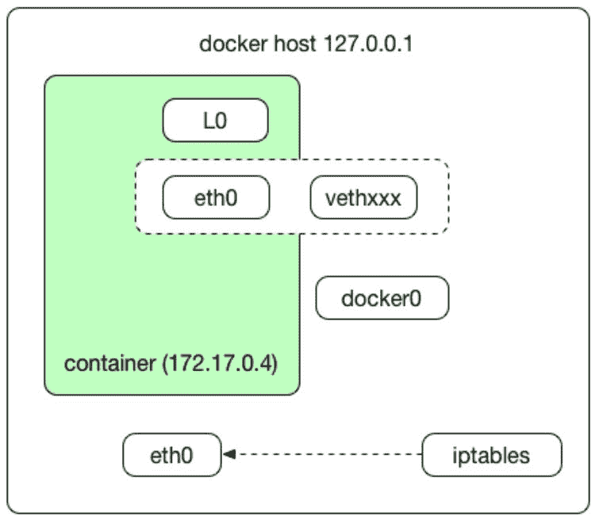
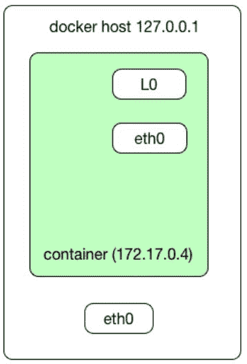
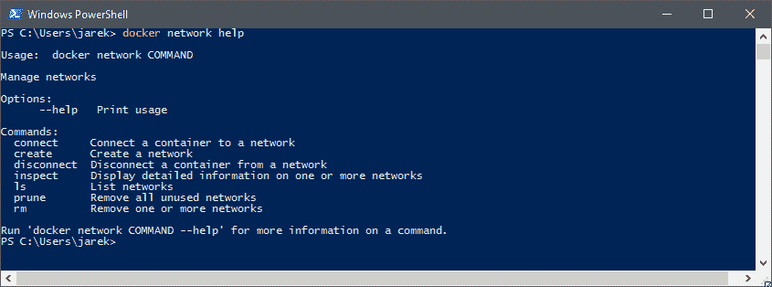
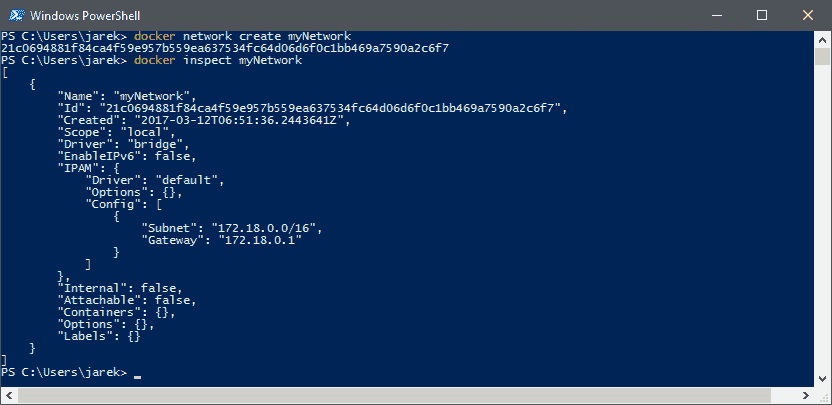
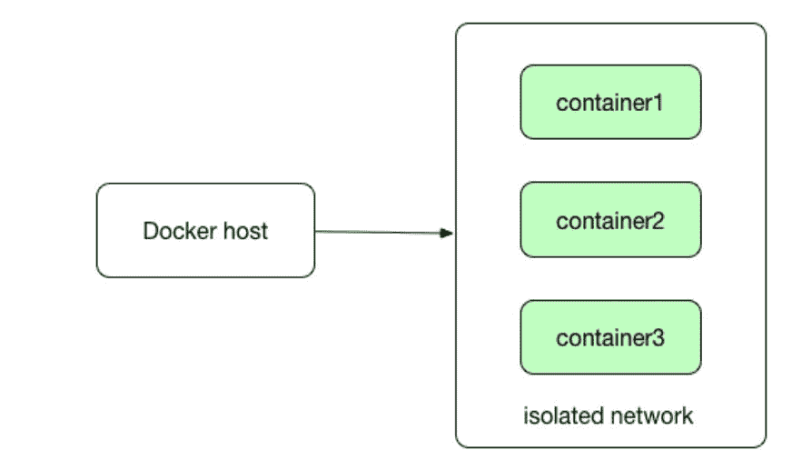
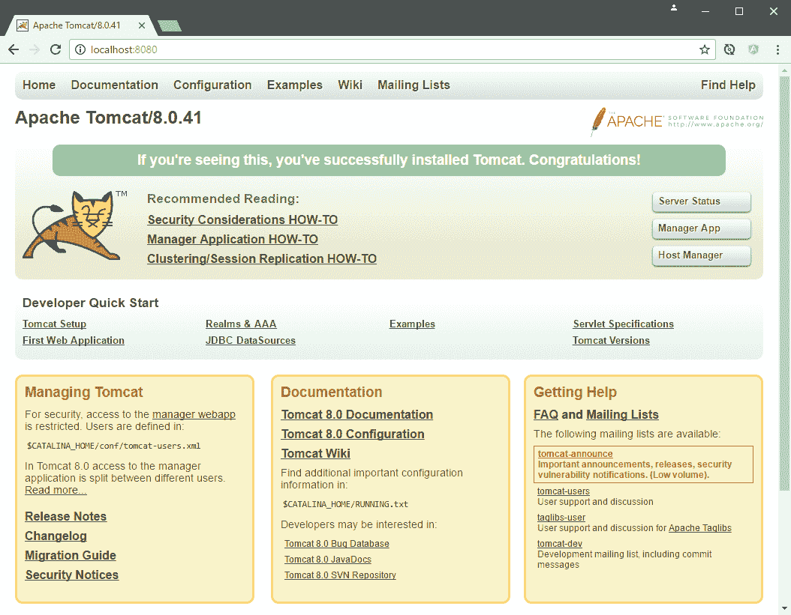
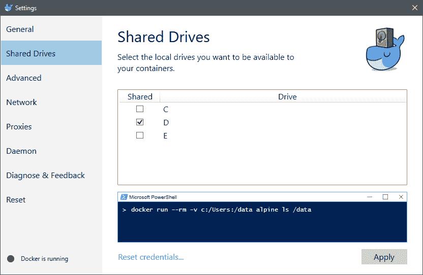

# 网络和持久存储

在前一章中，我们学习了很多关于 Docker 的概念。我们知道容器是映像的运行时。它将包含您的 Java 应用程序以及所有需要的依赖项，例如 JRE 或应用服务器。但是，Java 应用程序自给自足的情况很少。它总是需要与其他服务器(作为数据库)通信，或者向其他服务器(作为运行在应用服务器上的 web 应用程序，需要接受来自用户或其他应用程序的请求)公开自己。是时候描述向外界开放 Docker 容器、网络和持久存储的方法了。在本章中，您将学习如何配置网络，以及公开和映射网络端口。通过这样做，您将使您的 Java 应用程序能够与其他容器通信。想象一下下面的场景:您可以让一个容器用您的 Java 应用程序运行 Tomcat 应用服务器，与另一个运行数据库的容器通信，例如`PostgreSQL`。虽然与 Docker 默认提供的相比，Kubernetes 的网络方法有些不同，但现在让我们简单地关注一下 Docker 本身。稍后，我们将介绍 Kubernetes 的特定网络。集装箱与外界的交流不仅仅是联网；在本章中，我们还将关注数据量，作为在容器运行和停止周期之间保持数据的一种方式。

本章涵盖以下主题:

*   Docker 网络类型
*   网络命令
*   创建网络
*   映射和公开端口
*   与音量相关的命令
*   创建和删除卷

让我们从 Docker 网络开始。

# 建立工作关系网

为了使您的容器能够与外部世界通信，无论是另一个服务器还是另一个 Docker 容器，Docker 都提供了不同的网络配置方式。让我们从可用于容器的网络类型开始。

# Docker 网络类型

Docker 提供了三种不同的网络类型。要列出它们，执行`docker network ls`命令:

```
$ docker network ls  
```

Docker 将输出可用网络列表，其中包含唯一的网络标识符、网络名称和幕后驱动程序:


为了概述各种网络类型之间的差异，让我们现在逐一描述它们。

# 桥

这是 Docker 中的默认网络类型。当 Docker 服务守护程序启动时，它会配置一个名为`docker0`的虚拟桥。如果没有使用`docker run -net=<NETWORK>`选项指定网络，Docker 守护程序将默认将容器连接到桥接网络。此外，如果您创建一个新的容器，它将连接到桥接网络。对于 Docker 创建的每个容器，它分配一个虚拟以太网设备，该设备将连接到网桥。使用 Linux 命名空间，虚拟以太网设备被映射为在容器中显示为`eth0`，如下图所示:



`in-container eth0`接口从网桥的地址范围中获得一个 IP 地址。换句话说，Docker 将从桥上可用的范围中找到一个空闲的 IP 地址，并用该 IP 地址配置容器的`eth0`接口。从现在开始，如果新容器想，比如，连接到互联网，它将使用桥；主机自己的 IP 地址。网桥将自动在与其相连的任何其他网络接口之间转发数据包，并允许容器与主机以及同一台主机上的容器进行通信。桥接网络可能是最常用的网络。

# 主持

这种类型的网络只是将容器放在主机的网络堆栈中。也就是说，容器可以访问主机上定义的所有网络接口，如下图所示:



如果使用`-net=host`选项启动容器，那么容器将使用主机网络。它将和正常的网络一样快:没有桥梁，没有翻译，什么都没有。这就是为什么当您需要获得最佳网络性能时，它会很有用。与运行在网桥网络上的容器相比，运行在主机网络堆栈中的容器将获得更快的网络性能，无需遍历`docker0` `bridge`和`iptables`端口映射。在主机模式下，容器共享主机的网络命名空间(例如，您的本地机器)，直接将其暴露给外部世界。通过使用`-net=host`命令开关，可以通过主机的 IP 地址访问您的容器。然而，你需要意识到这可能是危险的。如果您有一个以 root 用户身份运行的应用程序，并且它有一些漏洞，那么就会有安全漏洞的风险，因为有人可以通过 Docker 容器远程控制主机网络。使用主机网络类型还意味着您需要使用端口映射来访问容器内部的服务。我们将在本章后面介绍端口映射。

# 没有人

长话短说，无网络根本不配置网络。此网络类型没有使用驱动程序。当您不需要容器来访问网络时，这很有用；`-net=none`切换到`docker run`命令完全禁用网络。

Docker 提供了一个简短的命令列表来处理网络。您可以从 shell (Linux 或 macOS)或 Windows 中的命令提示符和 PowerShell 运行它们。让我们现在了解他们。

# 网络命令

Docker 中管理网络的父命令是`docker network`。您可以使用`docker network help`命令列出整个命令集，如下图所示:



要获得特定命令可用的每个选项的详细语法和描述，请对每个命令使用`-help`开关。例如，要获得`docker network create`可用参数的描述，执行`docker network create -help`。

让我们简要描述每个可用的命令:

*   `**$ docker network ls**`:这是我们之前一直在使用的命令，它只是列出了你的容器可以使用的网络。它将输出网络标识符、名称、使用的驱动程序和网络范围
*   `**$ docker network create**`:创建新网络。该命令的完整语法是，`docker network create [OPTIONS] NETWORK`。我们一会儿将使用该命令
*   `**$ docker network rm**`:`dockercnetworkcrm`命令只是删除网络
*   `**$ docker network connect**`:将容器连接到特定网络
*   `**$ docker network disconnect**`:顾名思义，它会断开容器与网络的连接
*   `**$ docker network inspect**`:docker 网络检查命令显示网络的详细信息。如果你有网络问题，这非常有用。我们现在要创建并检查我们的网络

`docker network`检查命令显示网络的详细信息。如果你有网络问题，这非常有用。我们现在要创建并检查我们的网络。

# 创建和检查网络

让我们创建一个网络。我们将把我们的网络称为`myNetwork`。从 shell 或命令行执行以下命令:

```
$ docker network create myNetwork  
```

这是最简单的命令形式，但它可能是最常用的。它需要一个默认的驱动程序(我们没有使用任何选项来指定驱动程序，我们将只使用默认的驱动程序，即 bridge)。作为输出，Docker 将打印出新创建的网络的标识符:


稍后在将容器连接到该网络或检查网络属性时，您将使用该标识符来引用该网络。命令的最后一个参数是网络的名称，它比 ID 方便得多，也更容易记住。我们这里的网名是`myNetwork`。`docker network`创建命令需要更多参数，如下表所示:

| **选项** | **描述** |
| `-d, -driver="bridge"` | 管理网络的驱动程序 |
| `-aux-address=map[]` | 网络驱动程序使用的辅助 IPv4 或 IPv6 地址 |
| `-gateway=[]` | 主子网的 IPv4 或 IPv6 网关 |
| `-ip-range=[]` | 从子范围分配容器 IP |
| `-ipam-driver=default` | IP 地址管理驱动程序 |
| `-o`、`-opt=map[]` | 设置驾驶员的特定选项 |
| `-subnet=[]` | 代表网段的 CIDR 格式子网 |

最重要的参数之一是`-d` ( `--driver`)选项，默认值为 bridge。驱动程序允许您指定网络类型。如您所知，Docker 默认有几个可用的驱动程序:`host`、`bridge`和`none`。

创建网络后，我们可以使用`docker network inspect`命令检查其属性。从 shell 或命令行执行以下操作:

```
$ docker network inspect myNetwork 
```

作为回应，你会得到很多关于你的网络的详细信息。正如你在截图中看到的，我们新创建的网络使用桥驱动程序，即使我们没有明确要求:



如您所见，容器列表是空的，原因是我们还没有将任何容器连接到该网络。现在就开始吧。

# 将容器连接到网络

现在我们已经准备好了`myNetwork`，我们可以运行 Docker 容器并将其连接到网络。要启动容器，我们将使用`docker run --net=<NETWORK>`选项，其中`<NETWORK>`是默认网络或您自己创建的网络的名称。让我们以 Apache Tomcat 为例，它是 Java Servlet 和 JavaServer 页面技术的开源实现:

```
docker run -it --net=myNetwork tomcat  
```

这需要一段时间。Docker 引擎将从 Docker Hub 中提取 Tomcat 的所有映像层，然后运行 Tomcat 容器。还有另一个选项可以将网络连接到容器，您可以通知 Docker 您希望容器连接到与其他容器使用的网络相同的网络。这样，不需要显式指定网络，只需指示 Docker 希望两个容器在同一个网络上运行。为此，使用`container:`前缀，如下例所示:

```
docker run -it --net=bridge myTomcat
docker run -it --net=container:myTomcat myPostgreSQL  
```

在前面的例子中，我们使用桥接网络运行`myTomcat`映像。下一个命令将运行`myPostgreSQL`映像，使用与`myTomcat`相同的网络。这是一个非常常见的场景；您的应用程序将在与数据库相同的网络上运行，这将允许它们进行通信。当然，您启动到同一个网络中的容器必须在同一个 Docker 主机上运行。网络中的每个容器都可以直接与网络中的其他容器进行通信。但是，网络本身将容器与外部网络隔离开来，如下图所示:



如果您在一个桥接的、隔离的网络中运行您的容器，我们需要指导 Docker 如何将我们容器的端口映射到主机的端口。我们现在就要这么做。

# 公开端口和映射端口

一个常见的场景通常是您希望您的容器化应用程序接受来自其他容器或 Docker 外部的传入连接。它可以是监听端口 80 的应用服务器，也可以是接受传入请求的数据库。

映像可以暴露端口。公开端口意味着您的容器化应用程序将监听公开的端口。举个例子，Tomcat 应用服务器默认会监听端口`8080`。在同一台主机和同一网络上运行的所有容器都可以在此端口上与 Tomcat 通信。公开端口有两种方式。它可以在带有`EXPOSE`指令的 Dockerfile 中(我们将在后面关于创建映像的章节中介绍)或者在使用`--expose`选项的`docker run`命令中。以这个正式的 Tomcat 映像 Dockerfile 片段为例(注意，为了示例清晰起见，它被缩短了):

```
FROM openjdk:8-jre-alpine

ENV CATALINA_HOME /usr/local/tomcat

ENV PATH $CATALINA_HOME/bin:$PATH

RUN mkdir -p "$CATALINA_HOME"

WORKDIR $CATALINA_HOME

EXPOSE 8080

CMD ["catalina.sh", "run"]  
```

如您所见，在 Dockerfile 的末尾有一条`EXPOSE 8080`指令。这意味着我们可以预期容器在运行时将监听端口号`8080`。让我们再次运行最新的 Tomcat 映像。这一次，我们也会给我们的容器起一个名字，`myTomcat`。使用以下命令启动应用程序服务器:

```
docker run -it --name myTomcat --net=myNetwork tomcat  
```

为了检查同一网络上的容器是否可以通信，我们将使用另一个映像`busybox`。BusyBox 是一种在单个可执行文件中提供几个精简的 Unix 工具的软件。让我们在单独的 shell 或命令提示符窗口中运行以下命令:

```
docker run -it --net container:myTomcat busybox  
```

如您所见，我们已经指示 Docker，我们希望我们的`busybox`容器使用与 Tomcat 相同的网络。作为替代，我们当然可以使用`--net myNetwork`选项明确指定网络名称。

让我们看看他们是否真的能交流。在运行`busybox`的 shell 窗口中执行以下操作:

```
$ wget localhost:8080
```

上一条指令将在端口`8080`上执行`HTTP GET`请求，Tomcat 正在另一个容器中监听该端口。在成功下载 Tomcat 的`index.html`后，我们有证据表明两个容器都可以通信:


到目前为止，运行在同一台主机和同一网络上的容器可以相互通信。但是从外面和我们的容器沟通呢？映射端口很方便。我们可以将 Docker 容器公开的端口映射到主机的端口，在我们的例子中，主机将是本地主机。总的想法是，我们希望主机上的端口映射到正在运行的容器中的特定端口，与 Tomcat 容器的端口号`8080`相同。

要将一个端口(或一组端口)从主机绑定到容器，我们使用`docker run`命令的`-p`标志，如下例所示:

```
$ docker run -it --name myTomcat2 --net=myNetwork -p 8080:8080 tomcat  
```

前面的命令运行另一个 Tomcat 实例，也连接到`myNetwork`网络。然而，这一次，我们将容器的端口`8080`映射到相同号码的主机端口。`-p`开关的语法非常简单:您只需输入主机端口号、冒号，然后在您想要映射的容器中输入端口号:

```
$ docker run -p <hostPort>:<containerPort> <image ID or name> 
```

Docker 映像可以使用 Dockerfile 中的`EXPOSE`指令(例如，与`EXPOSE 7000-8000`相同)或`docker run`命令向其他容器公开整个范围的端口，例如:

```
$ docker run --expose=7000-8000 <container ID or name>  
```

然后，您可以使用`docker run`命令将主机的整个端口范围映射到容器:

```
$ docker run -p 7000-8000:7000-8000 <container ID or name>  
```

让我们验证我们是否可以从 Docker 之外访问 Tomcat 容器。为此，让我们用映射的端口运行 Tomcat:

```
$ docker run -it --name myTomcat2 --net=myNetwork -p 8080:8080 tomcat   
```

然后，我们可以简单地在我们最喜欢的网页浏览器中输入以下地址:`http://localhost:8080`。

因此，我们可以看到 Tomcat 的默认欢迎页面，直接从 Docker 容器运行中提供，如下面的截图所示:



很好，我们可以从 Docker 外部与我们的容器进行通信。顺便说一下，我们现在有两台独立的 Tomcats 在主机上运行，没有任何端口限制、资源限制等。这就是集装箱化的力量。

你可能会问，暴露和映射端口，也就是`--expose`交换机和`-p`交换机有什么区别？嗯，`--expose`将在运行时公开一个端口，但不会创建任何到主机的映射。暴露的端口将只对运行在同一网络、同一 Docker 主机上的另一个容器可用。另一方面，`-p`选项与`publish`相同:它将创建端口映射规则，将容器上的端口与主机系统上的端口进行映射。映射端口可从 Docker 外部获得。注意，如果你做了`-p`，但是 Dockerfile 中没有`EXPOSE`，Docker 会做一个隐式的`EXPOSE`。这是因为，如果一个端口对公众开放，它也会自动对其他 Docker 容器开放。

没有办法在 Dockerfile 中创建端口映射。映射一个或多个端口只是一个运行时选项。原因是端口映射配置取决于主机。Dockerfile 需要独立于主机且可移植。

You can bind a port using `-p` in the runtime only.

还有一个选项，允许您映射映像中暴露的所有端口(也就是说；在 Dockerfile 中)，在容器启动期间自动执行。`-P`开关(这次大写`P`)会将动态分配的随机主机端口映射到通过`EXPOSE`指令在 Dockerfile 中公开的所有容器端口。

The `-p` option gives you more control than `-P` when mapping ports. Docker will not automatically pick any random port; it's up to you what ports on the host should be mapped to the container ports.

如果运行以下命令，Docker 会将主机上的随机端口映射到 Tomcat 的公开端口号`8080`:

```
$ docker run -it --name myTomcat3 --net=myNetwork -P tomcat
```

要准确检查哪个主机端口已被映射，您可以使用`docker ps`命令。这可能是确定当前端口映射的最快方法。`docker ps`命令用于查看运行容器列表。从单独的 shell 控制台执行以下操作:

```
$ docker ps
```

在输出中，Docker 将列出所有正在运行的容器，在`PORTS`列中显示哪些端口已经映射:


正如你在前面的截图中看到的，我们的`myTomcat3`容器将把`8080`端口映射到主机上的端口号`32772`。再次，在`http://localhost:32772`地址上执行`HTTP GET`方法将会给我们`myTomcat3`的欢迎页面。`docker ps`命令的替代命令是 docker port 命令，与容器`ID`或`name`一起作为参数使用(这将为您提供关于映射了哪些端口的信息)。在我们的案例中，这将是:

```
$ docker port myTomcat3
```

因此，Docker 将输出映射，表示来自容器的端口号 80 已经映射到主机上的端口号`8080`:


docker inspect 命令的结果中也提供了关于所有端口映射的信息。执行以下命令，例如:

```
$ docker inspect myTomcat2
```

在`docker inspect`命令的输出中，您会发现包含映射信息的`Ports`部分:


让我们简要总结一下与在表中公开和映射端口相关的选项:

| **指令** | **表示** |
| `EXPOSE` | 表示指定端口上有服务可用。在 Dockerfile 中使用，并使公开的端口对其他容器开放。 |
| `--expose` | 与`EXPOSE`相同，但用于运行时，容器启动期间。 |
| `-p hostPort:containerPort` | 指定端口映射规则，将容器上的端口映射到主机上的端口。从 Docker 外部打开一个端口。 |
| `-P` | 将动态分配的主机随机端口映射到使用`EXPOSE`或`--expose`暴露的所有端口。 |

映射端口是一个很棒的特性。它为您提供了灵活的配置可能性，将您的容器向外部世界开放。事实上，如果您希望您的容器化 web 服务器、数据库或消息传递服务器能够与他人对话，这是必不可少的。如果一组默认的网络驱动程序还不够，你可以尝试在互联网上找到一个特定的驱动程序，或者自己开发一个。Docker Engine 网络插件扩展了 Docker，以支持广泛的网络技术，例如 IPVLAN、MACVLAN，或者一些完全不同的外来技术。在 Docker 中，联网的可能性几乎是无穷无尽的。现在让我们关注 Docker 容器可扩展性卷的另一个非常重要的方面。

# 持久存储

正如您从[第 1 章](01.html)*对 Docker* 的介绍中所记得的，Docker 容器文件系统默认情况下是临时的。如果您启动一个 Docker 映像(也就是运行容器)，您将在层堆栈的顶部得到一个读写层。您可以根据需要创建、修改和删除文件；如果您将更改提交回映像中，它们将被持久化。如果您想在映像中创建一个完整的应用程序设置，以及它的所有环境，这是一个很好的特性。但是，在存储和检索数据时，这不是很方便。最好的选择是将容器生命周期和应用程序与数据分开。理想情况下，您可能希望将这些分开，这样应用程序生成(或使用)的数据就不会被破坏或与容器生命周期相关联，从而可以重用。

一个完美的例子是网络应用服务器:Docker 映像包含网络服务器软件，例如与 Tomcat 相同，部署、配置并准备使用您的 Java 应用程序。但是，服务器将使用的数据应该与映像分开。这是通过卷来完成的，我们将在本章的这一部分重点讨论这一点。卷不是 union 文件系统的一部分，因此写操作是即时的，并且尽可能快，不需要提交任何更改。

Volumes live outside of the union filesystem and exist as normal directories and files on the host filesystem.

Docker 数据卷有三个主要用例:

*   为了在主机文件系统和 Docker 容器之间共享数据
*   移除容器时保留数据
*   与其他 Docker 容器共享数据

让我们从一个可以使用的卷相关命令列表开始。

# 与音量相关的命令

卷相关命令的基础是 docker 卷。命令如下:

*   `**$docker volume create**`:创建一个卷
*   `**$ docker volume inspect**`:显示一个或多个卷的详细信息
*   `**$docker volume ls**`:列出卷
*   `**$ docker volume rm**`:删除一个或多个卷
*   `**$ docker volume prune**`:删除所有未使用的卷，即不再映射到任何容器的所有卷

与网络相关的命令类似，如果使用`-help`开关执行，可以获得每个命令的详细描述和所有可能的选项，例如:docker volume create `-help`。让我们从创建卷开始。

# 创建卷

从[第 1 章](01.html)、*Docker 简介*开始，在 Docker for Windows 或 Docker for Mac 中有一个设置屏幕，允许我们指定 Docker 可以访问哪些驱动器。首先，让我们在窗口的 Docker 中标记驱动器 D，使其可用于 Docker 容器:



对于我们的卷示例，我在我的`D`驱动器上创建了一个`docker_volumes/volume1`目录，并在里面创建了一个空的`data.txt`文件:


创建卷有两种方法。第一个是在运行映像时指定`-v`选项。让我们运行我们已经知道的`busybox`映像，同时为我们的数据创建一个卷:

```
$ docker run -v d:/docker_volumes/volume1:/volume -it busybox  
```

在前面的命令中，我们使用`-v`开关创建了一个卷，并指示 Docker 将`host`目录`d:/docker_volumes/volume1`映射到运行容器中的`/volume`目录。如果我们现在列出正在运行的`busybox`容器中的`/volume`目录的内容，我们可以看到我们的空`data1.txt`文件，如下图所示:


`-v`选项中的参数是主机上的目录(在本例中是您自己的操作系统，在我们的示例中是`d:/docker_volumes/volume1`)、冒号以及容器可用的路径(在我们的示例中是`/volume1`)。创建的卷是一种映射目录。它可用于容器，也可用于主机操作系统。任何已经存在于映射目录(主机的`d:/docker_volumes/volume1`)中的文件将在容器中可用；它们不会在映射过程中被删除。

`-v`选项不仅可以用于目录，也可以用于单个文件。如果您希望容器中有可用的配置文件，这将非常有用。最好的例子是来自 Docker 官方文档的例子:

```
$ docker run -it -v ~/.bash_history:/root/.bash_history ubuntu 
```

执行前面的命令将在本地机器和运行的 Ubuntu 容器之间产生相同的 bash 历史。最重要的是，如果您退出容器，您自己的本地机器上的 bash 历史将包含您一直在容器内执行的 bash 命令。例如，作为开发人员，当调试或试用应用程序配置时，映射文件对您也很有用。

Mapping a single file from a host allows exposing a configuration of your application.

除了在启动容器时创建卷之外，还有一个在启动容器之前创建卷的命令。我们现在就用。

创建无名卷的最简单方式就是:

```
$ docker volume create 
```

作为输出，Docker 将为您提供卷标识符，您以后可以使用它来引用该卷。最好给一卷起一个有意义的名字。要创建独立的命名卷，请执行以下命令:

```
$ docker volume create --name myVolume  
```

要列出我们现在可用的卷，请执行`docker volume ls`命令:

```
$ docker volume ls  
```

输出将只是我们到目前为止创建的卷列表:


以这种方式创建的卷不会与主机上的路径显式映射。如果容器的基本映像包含指定装载点的数据(作为 Dockerfile 处理的结果)，该数据将在卷初始化时复制到新卷中。这与显式指定`host`目录不同。其背后的思想是，在创建映像时，您不应该关心卷在主机系统上的位置，这使得映像可以在不同的主机之间移植。让我们运行另一个容器，并将命名卷映射到其中:

```
$ docker run -it -v myVolume:/volume --name myBusybox3 busybox  
```

请注意，这次我们没有在主机上指定路径。相反，我们指示 Docker 使用我们在上一步中创建的命名卷。命名卷将在容器中的`/volume`路径可用。让我们在卷上创建一个文本文件:


如果我们现在运行另一个容器，指定相同的命名卷，我们将能够访问我们先前创建的`myBusybox3`容器中可用的相同数据:

```
$ docker run -it -v myVolume:/volume --name myBusybox4 busybox  
```

我们的两个容器现在共享同一个卷，如下面的截图所示:


Docker 命名卷是一种在容器之间共享卷的简单方法。它们也是纯数据容器的一个很好的替代，在 Docker 的旧时代，纯数据容器是一种常见的做法。现在已经不是这样了，命名卷要好得多。值得注意的是，每个容器的容量不仅限于一个，因为这将是一个严重的限制。

You can use the `-v` multiple times to mount multiple data volumes.

另一个在容器之间共享容积的选择是`-volumes-from`开关。如果您的一个容器已经装载了卷，通过使用此选项，我们可以指示 Docker 使用映射到其他容器中的卷，而不是提供卷的名称。考虑这个例子:

```
$ docker run -it -volumes-from myBusybox4 --name myBusybox5 busybox  
```

以这种方式运行`myBusybox5`容器后，同样，如果您在运行的`myBusybox5`容器中输入`/volume`目录，您将看到相同的`data.txt`文件。

`docker volume ls`命令可以取一些滤波器参数，可能会很有用。例如，您可以列出没有被任何容器使用的卷:

```
docker volume ls -f dangling=true 
```

任何容器不再使用的卷都可以通过使用 docker volumes prune 命令轻松删除:

```
docker volume prune  
```

要列出使用特定驱动程序创建的卷(我们稍后将介绍驱动程序)，您可以使用驱动程序过滤器过滤列表，如下例所示:

```
docker volume ls -f driver=local  
```

最后但同样重要的是，另一种创建卷的方法是 Dockerfile 中的`VOLUME CREATE`指令。我们将在本书后面的内容中使用它，从 Dockerfile 创建映像。与在容器启动期间使用`-v`选项相比，使用`VOLUME CREATE`指令创建卷有一个非常重要的区别:使用`VOLUME CREATE`时不能指定`host`目录。这类似于公开和映射端口。您不能映射 Dockerfile 中的端口。Dockerfiles 意味着可移植、可共享和独立于主机。`host`目录是 100%依赖主机的，并且会在任何其他机器上中断，这与 Docker 的想法有点不同。因此，只能在 Dockerfile 中使用可移植指令。

If you need to specify a `host` directory when creating a volume, you need to specify it at runtime.

# 删除卷

与创建卷相同，在 Docker 中有两种删除卷的方法。首先，您可以通过引用容器的名称并执行 docker `rm -v`命令来删除卷:

```
$ docker rm -v <containerName or ID>  
```

在没有提供`-v`选项的情况下移除容器时，Docker 不会警告您删除其体积。因此，您将拥有`dangling`卷—不再被容器引用的卷。正如您所记得的，使用 docker 卷清理命令很容易摆脱它们。

另一个删除卷的选项是使用`docker volume rm`命令:

```
$ docker volume rm <volumeName or ID>  
```

如果卷恰好被容器使用，Docker Engine 将不允许您删除它，并将向您发出警告消息:


正如您所看到的，在 Docker 中创建、共享和删除卷并不是那么棘手。它非常灵活，允许创建应用程序所需的设置。但这种灵活性还有更多。创建卷时，您可以指定一个`--driver`选项(或简称为`-d`，如果您需要映射一些外部的、不那么标准的存储，这可能会很有用。到目前为止，我们创建的卷使用的是本地文件系统驱动程序(文件存储在主机系统的本地驱动器上)；使用`volume inspect`命令检查卷时，可以看到驱动程序名称。不过，还有其他选择——让我们现在来看看。

# 音量驱动器

与网络驱动插件一样，卷插件扩展了 Docker 引擎的功能，并支持与其他类型的存储集成。网上有很多免费的现成插件；你可以在 Docker 的 GitHub 页面上找到一个列表。其中包括:

*   **用于 Azure 文件存储的 Docker 卷驱动**:这是一个 Docker 卷驱动，使用 Azure 文件存储将云上的文件共享作为卷挂载到 Docker 容器中。它使用 Azure 文件存储的网络文件共享(SMB/CIFS 协议)功能。您可以创建 Docker 容器，这些容器可以从一台主机无缝迁移到另一台主机，或者在不同主机上运行的多个容器之间共享卷。
*   **IPFS** :开源卷插件，允许使用 IPFS 文件系统作为卷。IPFS 是一个非常有趣和有前途的存储系统；它可以高效地分发大量数据。它提供了重复数据消除、高性能和集群持久性，提供了安全的 P2P 内容交付、快速性能和分散归档。IPFS 提供弹性数据访问，独立于低延迟或主干网连接。
*   **keywish**:你可以用这个驱动让你的容器和远程 keywish 服务器对话。Keywhiz 是一个用于管理和分发机密数据的系统，与 TLS 证书/密钥、GPG 密钥、API 令牌和数据库凭证相同。不是将这些数据放在配置文件或复制文件中(这类似于被泄露或难以跟踪)，keywish 使管理变得更容易和更安全:集群中的 keywish 服务器将加密的秘密集中存储在数据库中。客户使用**相互认证的顶级域名系统** ( **顶级域名系统**)来检索他们可以访问的机密。

从前面的例子可以看出，它们相当有趣，有时甚至具有异国情调。由于 Docker 及其插件架构的可扩展性，您可以创建非常灵活的设置。但是，第三方驱动程序并不总是引入全新的存储类型；有时，他们只是扩展现有的驱动程序。这方面的一个例子是本地持久插件，这是一个卷插件，它通过允许您在主机上的任何位置指定装载点来扩展默认本地驱动程序的功能，这使得文件能够始终持久，即使通过`docker volume rm`命令删除卷也是如此。

如果你需要一个还没有的卷插件，你可以自己写。这个过程在 Docker 的 GitHub 页面上有很好的记录，还有可扩展的例子。

我们现在已经介绍了如何向外部世界开放我们的容器。我们可以使用网络和装载的卷在容器和其他主机之间共享数据。让我们总结一下本章到目前为止所学的内容:

*   我们可以使用网络插件来进一步扩展网络数据交换
*   即使容器重新启动，卷也会保存数据
*   对卷上文件的更改是直接进行的，但在更新映像时不会包括这些更改
*   即使容器本身被删除，数据量仍然存在
*   卷允许在主机文件系统和 Docker 容器之间或其他 Docker 容器之间共享数据
*   我们可以使用卷驱动程序来进一步扩展文件交换的可能性

Containers from the same Docker host see each other automatically on the default bridge network.

# 摘要

在本章中，我们已经了解了 Docker 网络和存储卷功能。我们知道如何区分各种网络类型，如何创建网络，以及公开和映射网络端口。

我们已经完成了与卷相关的命令，现在可以创建或删除卷。在[第 3 章](03.html)、*使用微服务*中，我们将重点关注我们将使用 Docker 和 Kubernetes 部署的软件，以及稍后的 Java 微服务。