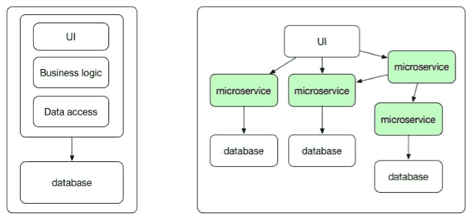
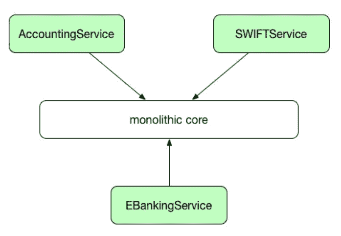
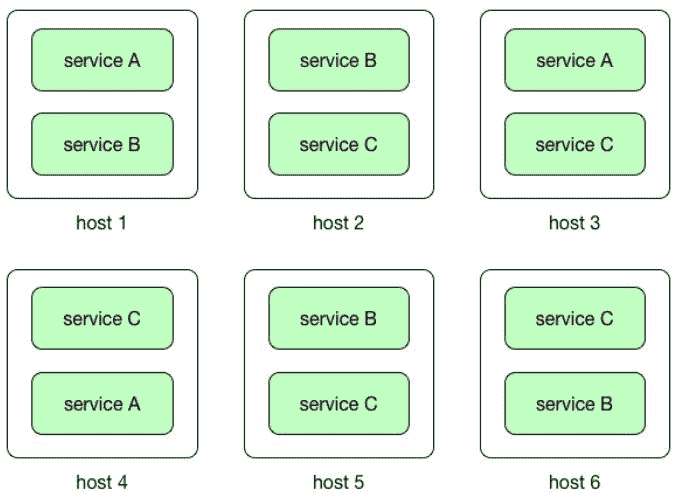
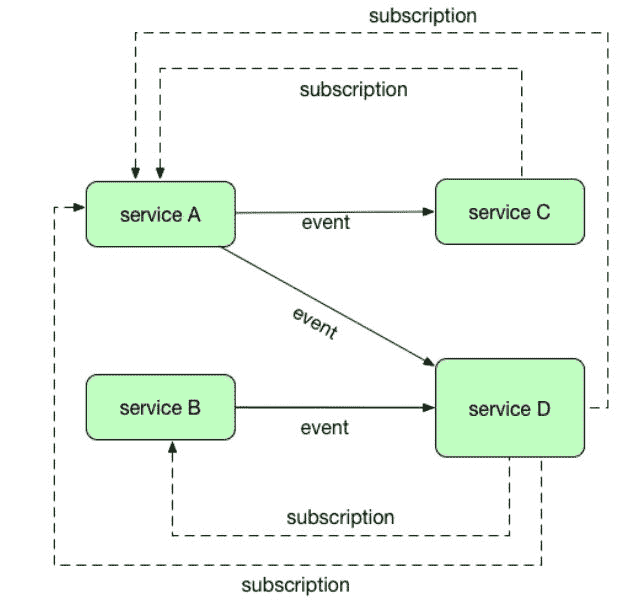

# 三、使用微服务

阅读前两章后，您现在应该对 Docker 体系结构及其概念有所了解。在我们继续我们的 Java、Docker 和 Kubernetes 之旅之前，让我们了解一下微服务的概念。

通过阅读这一章，您将发现为什么过渡到微服务和云开发是必要的，以及为什么单片架构不再是一种选择。微服务架构也是 Docker 和 Kubernetes 特别有用的地方。

本章将涵盖以下主题:

*   微服务介绍和单片体系结构比较
*   Docker 和 Kubernetes 如何融入微服务世界
*   何时使用微服务架构

在我们实际创建 Java 微服务并使用 Docker 和 Kubernetes 部署它之前，让我们先解释一下微服务的思想，并将其与单体架构进行比较。

# 微服务介绍

根据定义，微服务，也称为**微服务架构** ( **MSA** )，是一种架构风格和设计模式，它表示应用应该由松散耦合的服务集合组成。这个架构将业务领域模型分解成由服务实现的更小的、一致的部分。换句话说，每个服务都有自己的职责，独立于其他服务，每个服务都提供特定的功能。

这些服务应该是孤立的和自治的。然而，他们当然需要沟通来提供一些业务功能。他们通常使用`REST`曝光或以发布/订阅的方式发布和订阅事件来进行交流。

解释微服务概念背后的原因的最好方法是将它们与构建大型应用的传统方法——整体设计——进行比较。

请看下图，它展示了由微服务组成的整体应用和分布式应用:

正如您在前面的图表中所看到的，单体应用与使用微服务架构创建的应用完全不同。让我们比较一下这两种方法，并指出它们的优缺点。

# 单片与微服务

我们从描述单片架构开始进行比较，以呈现其特性。

# 整体架构

过去，我们将应用创建为完整的、大量的、统一的代码片段。让我们以一个 web MVC 应用为例。下图显示了此类应用的简化架构:

如您所见，该图展示了典型的 web 应用，在本例中是银行系统的一个片段。这是**模型** **视图控制器** ( **MVC** )应用，由模型、视图和控制器组成，将 HTML 内容提供回客户端的浏览器。它也可能通过 REST 端点接受和发送 JSON 内容。这种应用是作为单个单元构建的。如你所见，我们这里有几层。企业应用通常由三部分组成:客户端用户界面(由运行在浏览器中的 HTML 页面和 JavaScript 组成)，处理`HTTP`请求的服务器端部分(可能使用一些类似 spring 的控制器构建)，然后我们有一个服务层，它可能使用 EJB 或 Spring 服务来实现。服务层执行特定于域的业务逻辑，并最终检索/更新数据库中的数据。这是一个非常典型的 web 应用，我们每个人都可能偶尔创建一次。整个应用是一个整体，一个单一的逻辑可执行文件。要对系统进行任何更改，我们必须构建和部署整个服务器端应用的更新版本；这种应用被打包成单个 WAR 或 EAR 档案，以及所有静态内容，如 HTML 和 JavaScript 文件。部署后，所有应用代码都在同一台机器上运行。扩展这种类型的应用通常需要将完全相同的应用代码的多个副本部署到集群中的多台机器上，可能在某个负载平衡器的后面。

这个设计还不错，毕竟我们已经启动并运行了我们的应用。但是这个世界，尤其是当使用敏捷方法时，变化很快。企业开始要求比以往更快地发布软件。ASAP 已经成为 IT 开发语言词典中非常常见的一个词。规范是波动的，所以代码经常变化，并随着时间的推移而增长。如果开发应用的团队很大(在复杂、庞大的应用中可能会如此)，每个人都必须非常小心，不要破坏彼此的工作。每增加一个功能，我们的应用就会变得越来越复杂。编译和构建时间变得更长，使用单元或集成测试来测试整个事情迟早会变得棘手。此外，新成员加入团队的切入点可能令人望而生畏，他们需要从源代码库中签出整个项目。然后他们需要在集成开发环境中构建它(在大型应用的情况下，这并不总是那么容易)，并分析和理解组件结构来完成他们的工作。此外，从事用户界面部分工作的人员需要与从事中间层工作的开发人员、数据库建模人员、数据库管理员等进行交流。随着时间的推移，团队结构通常会开始模仿应用架构。有一种风险是，从事特定层工作的开发人员会倾向于在他所控制的层中尽可能多地放入逻辑。因此，随着时间的推移，代码可能变得不可维护。我们都去过那里，做过那件事，不是吗？

此外，单片系统的扩展并不像将 WAR 或 EAR 放入另一个应用服务器然后启动它那么容易。因为所有的应用代码都在服务器上的同一个进程中运行，所以通常几乎不可能扩展应用的单个部分。举个例子:我们有一个与 VOIP 外部服务集成的应用。我们的应用用户不多，但我们需要处理来自 VOIP 服务的大量事件。为了处理不断增加的负载，我们需要扩展我们的应用，在单块系统的情况下，我们需要扩展整个系统。这是因为应用是一个单一的大的工作单元。如果只有一个应用的服务需要 CPU 或资源，则必须为整个服务器提供足够的内存和 CPU 来处理负载。这可能很贵。每台服务器都需要一个快速的中央处理器和足够的内存来运行我们应用中要求最高的组件。

所有单片应用都具有这些特性:

*   它们相当大，经常有很多人在上面工作。当将您的项目加载到集成开发环境中时，这可能是一个问题，尽管有强大的机器和出色的开发环境，例如 IntelliJ IDEA。但这不仅仅是数百、数千或数百万行代码的问题。这是关于解决方案的复杂性，比如团队成员之间的沟通问题。通信问题可能导致在应用的不同部分出现同一问题的多个解决方案。这将使它变得更大，它很容易演变成一个大泥球，再也没有人能理解整个系统。此外，人们可能害怕对系统进行实质性的改变，因为在另一端的某些东西可能会突然停止工作。如果这是用户在生产系统上报告的，那就太糟糕了。
*   它们有很长的发布周期，我们都知道发布管理、权限、回归测试等过程。几乎不可能创造出一个具有巨大的整体应用的连续输送流。
*   它们很难扩展；运营团队在集群中放置一个新的应用实例通常需要大量的工作。扩展特定功能是不可能的，您唯一的选择是在集群中增加整个系统的实例。这使得向上和向下扩展成为一大挑战。
*   如果部署失败，整个系统将不可用。
*   您被锁定在特定的编程语言或技术堆栈中。当然，有了 Java，系统的部分可以用一种或多种运行在 JVM 上的语言来开发，比如 Scala、Kotlin 或 Groovy，但是如果需要集成一个`.net`库，麻烦就从这里开始了。这也意味着你不能总是使用合适的工具来完成工作。想象一个场景，其中您希望在数据库中存储大量复杂的文档。它们通常有不同的结构。MongoDB 作为文档数据库应该是合适的吧？是的，但是我们的系统运行在甲骨文上。
*   它不太适合敏捷开发过程，在敏捷开发过程中，我们需要一直实现变更，几乎同时发布到生产中，并为下一次迭代做好准备。

如您所见，单片应用只适合小规模团队和小项目。如果你需要一个规模比较大，涉及到很多团队的东西，最好还是看替代方案。但是如何处理你可能喜欢处理的现有单一系统呢？您可能会意识到，将系统的某些部分外包给小型服务会很方便。这将加快开发过程，增加可测试性。这也将使您的应用更容易扩展。尽管单片应用仍然保留了核心功能，但许多部分可以外包给支持核心模块的小型辅助服务。下图显示了这种方法:

在这种情况下，让我们说中介解决方案，主要的业务逻辑将留在您的应用整体。例如，集成、后台作业或其他可以由消息触发的小子系统可以移动到它们自己的服务中。您甚至可以将这些服务放入云中，以进一步限制管理基础架构的必要性。这种方法允许您逐步将现有的整体应用转移到完全面向服务的体系结构中。让我们看看微服务方法。

# 微服务架构

微服务架构旨在解决我们提到的单片应用的问题。主要的区别在于，在单体应用中定义的服务被分解成单独的服务。最重要的是，它们彼此分开部署在不同的主机上。请看下图:

使用微服务架构创建应用时，每个微服务负责一个特定的业务功能，并且只包含执行特定业务逻辑所需的实现。这就像是一种**除**和**征服**的方式来创建一个系统。这可能看起来类似于面向服务架构。事实上，传统的 SOA 和微服务架构有一些共同的特征。两者都将应用的片段组织成服务，并且都定义了一个服务可以与另一个服务分离的清晰边界。然而，SOA 的根源在于需要将单个应用相互集成。这通常是使用一个通常基于 SOAP 的应用编程接口，使用大量的 XML 消息来完成的。在 SOA 中，这种集成严重依赖于中间的某种中间件，通常是**企业服务总线** ( **ESB** )。微服务架构也可以利用消息总线，但有很大的不同。在微服务体系结构中，消息传递层根本没有逻辑，它纯粹是用作消息从一个服务到另一个服务的传输。这与 ESB 完全不同，ESB 需要大量的逻辑来进行消息路由、模式验证、消息翻译等等。因此，微服务架构没有传统的 SOA 那么麻烦。

当涉及到扩展时，将微服务与单块应用进行比较会有很大的不同。微服务的主要优势在于，单个服务可以根据资源需求单独扩展。那是因为他们自给自足，独立自主。由于微服务通常部署在较小(就资源而言)的主机上；主机只需要包含服务正常运行所需的资源。随着资源需求的增长，横向和纵向扩展都很容易。为了水平扩展，您只需部署所需数量的实例来处理特定组件上的负载。

在接下来的章节中，我们将回到这个概念，那时我们将了解 Kubernetes。与单体系统相比，垂直扩展也更容易、更便宜，您只需升级部署微服务的主机。此外，引入新版本的服务很容易，你不需要为了升级一个功能而停止整个系统。事实上，你可以在飞行中完成。部署时，微服务提高了整个应用的容错能力。例如，如果一个服务出现内存泄漏或其他问题，只有这个服务会受到影响，然后可以修复和升级，而不会干扰系统的其他部分。单片架构的情况并非如此，一个有故障的组件可能会导致整个应用瘫痪。

从开发人员的角度来看，将应用拆分成单独的部分单独部署会带来巨大的优势。精通服务器端 JavaScript 的开发人员可以开发它的部分`node.js`，而系统的其余部分将使用 Java 开发。这都与每个微服务公开的 API 有关；除了这个 API，每个微服务都不需要知道其他服务的任何信息。这使得开发过程更加容易。独立的微服务可以独立开发和测试。基本上，微服务方法规定，不是有一个所有开发人员都在工作的巨大代码库，这通常变得很难管理，而是有几个由小型敏捷团队管理的更小的代码库。服务之间唯一的依赖是它们公开的 API。存储数据也是有区别的。正如我们之前所说的，每个微服务都应该负责存储自己的数据，因为同样，它应该是独立的。这导致了微服务体系结构的另一个特性，一种拥有多语种持久性的可能性。微服务应该拥有自己的数据。

虽然微服务使用 REST 端点或事件与其他微服务通信和交换数据，但它们可以以最适合作业的形式存储自己的数据。如果数据是关系型的，服务将使用传统的关系型数据库，如 MySQL 或 PostgreSQL。如果文档数据库更适合这项工作，例如，微服务可以使用 MongoDB，如果它是作为数据的图形，则可以使用 Neo4j。这导致了另一个结论，通过实现微服务架构，我们现在只能选择最适合这项工作的编程语言或框架，这也适用于数据存储。当然，拥有自己的数据会给微服务架构带来挑战，即数据一致性。我们将在这一章中讨论这个问题。

让我们从开发过程的角度总结一下使用微服务架构的好处:

*   可以使用各种语言、框架及其版本来编写服务
*   每个微服务都相对较小，更容易被开发人员理解(这导致更少的错误)，易于开发，并且可测试
*   部署和启动时间很快，这使得开发人员更有效率
*   每个服务可以由多个服务实例组成，以提高吞吐量和可用性
*   每个服务都可以独立于其他服务进行部署，更易于频繁部署新版本的服务
*   更容易组织开发过程；每个团队拥有并负责一个或多个服务，并且可以独立于所有其他团队开发、发布或扩展他们的服务
*   你可以选择任何你认为最适合这项工作的编程语言或框架。对技术堆栈没有长期的承诺。如果需要，可以在新的技术堆栈中重写服务，如果没有 API 更改，这对于系统的其余部分将是透明的
*   它更适合持续交付，因为小型单元更容易管理、测试和部署。只要每个团队保持向后和向前的应用编程接口兼容性，它就可以在与其他团队分离的发布周期中工作。在某些情况下，这些发布周期是相互关联的，但这种情况并不常见

# 保持数据一致性

服务必须松散耦合，以便能够独立开发、部署和扩展。他们当然需要交流，但他们是相互独立的。它们有定义良好的接口，并封装了实现细节。但是数据呢？在现实世界和非平凡的应用中(微服务应用可能是非平凡的)，业务事务必须经常跨越多个服务。例如，如果您创建了一个银行应用，在您执行客户的汇款指令之前，您需要确保它不会超过他的账户余额。整体应用附带的单一数据库给了我们很多便利:原子事务、寻找数据的单一位置等等。

另一方面，在微服务领域，不同的服务需要独立。这也意味着它们可以有不同的数据存储要求。对于某些服务，它将是一个关系数据库，其他服务可能需要一个文档数据库，如 MongoDB，它擅长存储复杂的非结构化数据。

因此，当构建微服务并将我们的数据库拆分成多个更小的数据库时，我们如何应对这些挑战？我们还说过，服务应该拥有自己的数据。也就是说，每个微服务应该只依赖于它自己的数据库。该服务的数据库实际上是该服务实现的一部分。这在设计微服务架构时带来了相当有趣的挑战。正如马丁·福勒在他的`Microservice trade-offs`专栏中所说:对于分布式系统来说，保持强一致性是极其困难的，这意味着每个人都必须管理最终的一致性。我们该如何应对？嗯，这都是关于界限的。

微服务应该有明确定义的责任和边界。

微服务需要根据其业务领域进行分组。此外，在实践中，您将需要以这样一种方式设计您的微服务，即它们不能直接连接到另一个服务拥有的数据库。松散耦合意味着微服务应该公开清晰的 API 接口，这些接口对数据和与这些数据相关的访问模式进行建模。他们必须坚持那些接口，当需要改变时，你可能会引入一个版本控制机制，并创建微服务的另一个版本。您可以使用发布/订阅模式将事件从一个微服务分派给其他微服务处理，如下图所示:

您想要使用的发布/订阅机制应该为事件处理提供重试和回滚功能。在发布/订阅场景中，修改或生成数据的服务允许其他服务订阅事件。订阅的服务接收到数据已被修改的事件。通常情况下，事件包含已修改的数据。当然，事件发布/订阅模式不仅可以用于数据更改，还可以用作服务之间的通用通信机制。这是一个简单而有效的方法，但它有一个缺点，有可能会失去一个事件。

创建分布式应用时，您可能希望考虑到在一段时间内数据会不一致。当应用更改一台机器上的数据项时，该更改需要传播到其他副本。由于更改传播不是即时的，因此会有一个时间间隔，在此期间，一些副本会有最新的更改，但其他副本不会。但是，更改最终会传播到所有副本。这就是为什么这被称为最终一致性。您的服务需要假设数据将在一段时间内处于不一致的状态，并且需要通过按原样使用数据、推迟操作或者甚至忽略某些数据来处理这种情况。

如您所见，使用微服务架构背后有很多挑战，但也有很多优势。不过，你应该得到警告，我们需要应对更多的挑战。由于服务相互独立，它们可以用不同的编程语言实现。这意味着每个应用的部署过程可能会有所不同:对于一个 Java web 应用和一个`node.js`应用来说，部署过程将完全不同。这可能会使服务器部署变得复杂。这正是 Docker 出手相救的地方。

# Docker的角色

正如你从前面几章所记得的，Docker 利用了容器化的概念。您只需将您的应用(在这种情况下，应用将是一个微服务)放入一个单一的、可部署和可运行的软件中，称为映像。我们将在[第 4 章](04.html)、*创建 Java 微服务*中详细介绍将 Java 应用打包到映像中的过程。Docker 映像将包含我们的服务工作所需的一切，它可以是一个带有所有必需的库和应用服务器的 Java 虚拟机，也可以是一个与带有所有必需的`node.js`模块的`node.js`运行时打包在一起的`node.js`应用，例如`express.js`或`node.js`服务需要运行的任何东西。微服务可能由两个容器组成，一个运行服务代码，另一个运行数据库来保存服务自己的数据。

Docker 将容器隔离到一个过程或服务。实际上，我们应用的所有部分将只是一堆黑盒，打包好并准备使用 Docker 映像。容器作为完全隔离的沙箱运行，每个容器只有最少的操作系统内核。Docker 使用 Linux 内核，并利用内核接口，如 cnames 和名称空间，这允许多个容器共享同一个内核，同时彼此完全隔离运行。

因为底层系统的系统资源是共享的，所以您可以以最佳性能运行服务，与传统虚拟机相比，占用空间要小得多。因为容器是可移植的，正如我们在[第 2 章](02.html)、*网络和持久存储*中所说的，它们可以在 Docker 引擎可以运行的任何地方运行。这使得部署微服务的过程变得容易。为了部署在给定主机上运行的服务的新版本，可以简单地停止正在运行的容器，并使用最新版本的服务代码启动基于 Docker 映像的新容器。我们将在本书后面介绍创建映像新版本的过程。当然，主机上运行的所有其他容器都不会受到此更改的影响。

由于微服务需要使用`REST`协议进行通信，我们的 Docker 容器(或者更准确地说，您的 Java 微服务在 Docker 容器中打包并运行)也需要使用网络进行通信。正如您从[第 2 章](02.html)、*网络和持久存储*中所记得的，关于网络，很容易为 Docker 容器公开和映射网络端口。Docker 容器化似乎是微服务架构的理想选择。您可以将微服务打包到一个便携盒中，并公开所需的网络端口，使其能够与外界通信。需要时，您可以运行任意多个这样的盒子。

让我们总结一下在处理微服务时有用的 Docker 特性:

*   扩展和缩减服务很容易，只需更改运行的容器实例数
*   容器隐藏了每个服务背后的技术细节。我们服务的所有容器都以完全相同的方式启动和停止，无论它们使用什么技术堆栈
*   每个服务实例都是独立的
*   您可以限制容器消耗的 CPU 和内存的运行时约束
*   容器建造和启动都很快。正如您从[第 1 章](01.html)、*到 Docker* 所记得的，与传统虚拟化相比，开销最小
*   Docker 映像层被缓存，这在创建服务的新版本时给了你另一个速度提升

它不完全符合微服务架构的定义吗？当然有，但是有一个问题。因为我们的微服务分布在多个主机上，所以很难跟踪哪些主机正在运行某些服务，也很难监控哪些主机需要更多资源，或者在最坏的情况下，哪些主机已经停止运行并且无法正常工作。此外，我们需要对属于特定应用或功能的服务进行分组。这是我们拼图中缺失的元素:容器管理和编排。许多框架的出现仅仅是为了处理更复杂的场景:管理集群中的单个服务或跨主机的服务中的多个实例，或者如何在部署和管理级别上协调多个服务。其中一个工具是 Kubernetes。

# Kubernetes的角色

虽然 Docker 提供了容器的生命周期管理，但是 Kubernetes 通过提供编排和管理容器集群，将容器的生命周期管理提升到了一个新的水平。如您所知，使用微服务架构创建的应用将包含几个独立的服务。我们如何编排和管理它们？Kubernetes 是一个开源工具，非常适合这个场景。它定义了一组构建模块，提供了部署、维护和扩展应用的机制。Kubernetes 中的基本调度单元称为 pod。pod 中的容器运行在同一个主机上，共享同一个 IP 地址，并通过 localhost 找到彼此。它们还可以使用标准的进程间通信(如共享内存或信号量)相互通信。pod 为容器化组件增加了另一个抽象层次。pod 由一个或多个容器组成，这些容器保证位于主机上并且可以共享资源。这与属于应用的容器的逻辑集合是一样的。

对于传统服务，比如 REST 端点和相应的数据库(实际上是我们完整的微服务)，Kubernetes 提供了一个服务的概念。服务定义了一个逻辑单元组，并强制执行从外部访问这些逻辑单元组的规则。Kubernetes 将标签的概念用于 pod 和其他资源(服务、部署等)。这些是简单的键值对，可以在创建时附加到资源上，然后随时添加和修改。稍后，我们将使用标签来组织和选择资源子集(例如，pods)以作为一个实体来管理它们。

Kubernetes 可以自动将您的容器或一组容器放置在特定的主机中。为了找到合适的主机(工作负载最小的主机)，它将分析主机的当前工作负载以及不同的托管和可用性限制。当然，您可以手动指定主机，但是拥有此自动功能可以充分利用可用的处理能力和资源。Kubernetes 可以在容器、pod 和集群级别监控资源使用情况(CPU 和 RAM)。资源使用和性能分析代理在每个节点上运行，自动发现节点上的容器，并收集 CPU、内存、文件系统和网络使用统计数据。

Kubernetes 还管理容器实例的生命周期。如果它们太多，其中一些将被停止。如果工作量增加，新容器将自动启动。这个特性叫做容器自动缩放。它会根据内存、CPU 利用率或您为服务定义的其他指标(例如每秒查询数)自动更改运行容器的数量。

正如您从[第 2 章](02.html)、*网络和持久存储*中所记得的，Docker 操作卷来保存您的应用数据。Kubernetes 还支持两种卷:与 pod 具有相同生命周期的常规卷，以及独立于任何 pod 的生命周期的持久卷。卷类型以插件的形式以与 Docker 相同的方式实现。这种可扩展的设计使您能够拥有几乎任何类型的卷。它目前包含存储插件，如谷歌云平台卷、AWS 弹性块存储卷等。

Kubernetes 可以监控您的服务的运行状况，它可以通过对指定的 URL 执行指定的`HTTP`方法(例如与`GET`相同)并分析作为响应返回的`HTTP`状态代码来实现。此外，TCP 探测器可以检查指定的端口是否打开，这也可以用来监控服务的运行状况。最后但同样重要的是，您可以指定可以在容器中执行的命令，以及可以根据命令的响应采取的一些操作。如果指定的探测方法发出容器有问题的信号，它可以自动重启。当您需要更新软件时，Kubernetes 支持滚动更新。此功能允许您在最短的停机时间内更新已部署的容器化应用。滚动更新功能允许您指定在更新时可能停机的旧副本的数量。用 Docker 升级容器化软件特别容易，正如你已经知道的，这只是容器的一个新的映像版本。我猜你现在已经了解了全部情况。部署可以更新、展开或回滚。在 Kubernetes 中可以获得负载平衡、服务发现，以及在编排和管理从 Docker 容器中运行的微服务群时可能需要的所有功能。最初是由谷歌大规模制造的，现在各种规模的组织都广泛使用 Kubernetes 来运行生产中的容器。

# 何时使用微服务架构

微服务架构是构建应用的一种新方法。一开始，当您开始创建一个相对较小的系统时，可能不需要使用微服务方法。当然，基本的 web 应用没什么问题。当为你办公室的人做基本的 web 应用时，采用微服务架构可能有些过分。另一方面，如果你计划开发一种新的超级互联网服务，将被数百万移动客户端使用，我会从一开始就考虑使用微服务。开个玩笑，你明白了，总是试着为工作选择最好的工具。最终，目标是提供商业价值。

然而，你应该记住一段时间后你的系统的全貌。如果您的应用在特性和功能上比您预期的要大，或者您从一开始就知道，您可能希望开始将特性分解成微服务。您应该尝试进行功能分解，并指出您的系统中有明确边界的部分，这些部分需要扩展，并在未来进行单独部署。如果有很多人在一个项目上工作，让他们开发一个应用的独立部分将会给开发过程带来巨大的推动。可以混合使用各种技术栈，每个服务都可以用不同的编程语言或框架来实现，并将自己的数据存储在最合适的数据存储中。这都是关于 API 和服务之间相互通信的方式。与整体架构相比，采用这种架构将加快构建、测试和部署的上市时间。如果您只需要扩展需要处理更高工作负载的服务。有了 Docker 和 Kubernetes，没有理由不进入微服务架构；这肯定会在未来得到回报。

微服务架构不仅仅是一个新的流行词，它被普遍认为是当今构建应用的更好方式。微服务思想的诞生是由更好地利用计算资源的需求和维护越来越复杂的基于网络的应用的需求所驱动的。

Java 是构建微服务的绝佳选择。您可以将微服务创建为单个可执行的 JAR、独立的 Spring Boot 应用或部署在应用服务器(如 Wildfly 或 Tomcat)上的全功能 web 应用。根据您的用例以及您的微服务的职责和特性，前面的任何一个都可以。Docker 存储库包含许多有用的映像，您可以自由地将其用作微服务的基础。Docker Hub 中的许多映像都是由个人创建的，有些是扩展官方映像并根据他们的需求进行定制，但有些是从基础映像定制的整个平台配置。基本映像可以像纯 JDK 一样简单，也可以是完全配置的准备运行的 Wildfly。这大大提高了开发性能。

# 摘要

在本章中，我们比较了单片和微服务架构。希望你看到使用后者的好处。我们还了解了 Docker 和 Kubernetes 在部署容器化应用时是如何融入全局的，从而使这个过程变得更加容易和愉快。Java 是实现微服务的成熟生态系统。您将要创建的软件将由小的、高度可测试的、高效的模块组成。事实上，在[第 4 章](04.html)*创建 Java 微服务*中，我们就要把手弄脏，创建这样一个微服务。