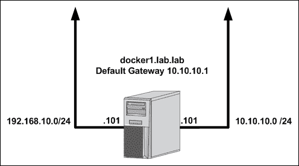
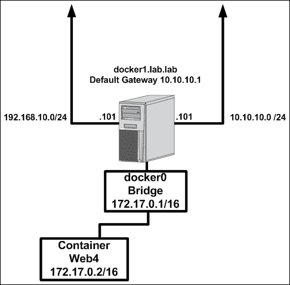
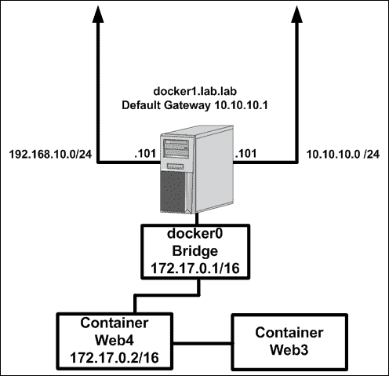
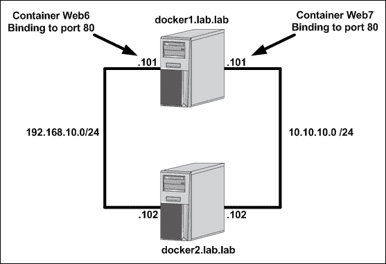

# 第二章。配置和监控Docker网络

在本章中，我们将介绍以下食谱:

*   验证影响 Docker 网络的主机级设置
*   以桥接模式连接容器
*   公开和发布端口
*   将容器连接到现有容器
*   以主机模式连接容器
*   配置服务级别设置

# 简介

Docker 让消费容器技术变得前所未有的简单。Docker 以其易用性而闻名，提供了许多高级功能，但安装时使用了一组合理的默认值，这使得快速开始构建容器变得容易。虽然网络配置通常是使用前需要额外注意的一个方面，但 Docker 可以轻松地让您的容器在网络上运行。

# 验证影响 Docker 网络的主机级设置

Docker 依靠能够执行某些功能的主机来使 Docker 网络工作。也就是说，您的 Linux 主机必须配置为允许 IP 转发。此外，自 Docker 1.7 发布以来，您现在可以选择使用发夹**网络地址转换** ( **NAT** )而不是默认的 Docker 用户陆地代理。在本食谱中，我们将回顾主机启用 IP 转发的要求。我们还将讨论 NAT 发夹，并讨论该选项的主机级要求。在这两种情况下，我们将展示 Docker 关于其设置的默认行为，以及您如何更改它们。

## 做好准备

您需要访问运行 Docker 的 Linux 主机，并且能够停止和重新启动服务。因为我们将修改系统级内核参数，所以您还需要对系统的根级访问。

## 怎么做…

正如我们在[第 1 章](01.html "Chapter 1. Linux Networking Constructs")、 *Linux 网络结构*中看到的，Linux 主机必须启用 IP 转发，以便能够在接口之间路由流量。由于 Docker 正是这样做的，因此必须启用 IP 转发，以便 Docker 网络能够按预期运行。如果 Docker 检测到 IP 转发被禁用，它将在您尝试运行容器时警告您该问题:

```
user@docker1:~$ docker run --name web1 -it \
jonlangemak/web_server_1 /bin/bash
WARNING: IPv4 forwarding is disabled. Networking will not work.
root@071d673821b8:/#
```

大多数 Linux 发行版将 IP 转发值默认为`disabled`或`0`。幸运的是，在默认配置中，Docker 会在 Docker 服务启动时将此设置更新为正确的值。例如，让我们看一下一个新重启的主机，它在启动时没有启用 Docker 服务。如果我们在启动 Docker 之前检查设置的值，我们可以看到它被禁用。启动 Docker 引擎会自动为我们启用设置:

```
user@docker1:~$ more /proc/sys/net/ipv4/ip_forward
0
user@docker1:~$
user@docker1:~$ sudo systemctl start docker
user@docker1:~$ sysctl net.ipv4.ip_forward
net.ipv4.ip_forward = 1
user@docker1:~$
```

Docker 中的这种默认行为可以通过将`--ip-forward=false`作为运行时选项传递给 Docker 服务来更改。

### 注

基于所使用的**初始化系统**，Docker 特定参数的配置变化很大。在撰写本文时，许多较新的 Linux 操作系统使用`systemd`作为其初始化系统。请务必参考 Docker 文档，根据您使用的操作系统查看其服务配置建议。在本章中，Docker 服务配置和选项将作为即将到来的菜谱的一部分进行更详细的讨论。在本食谱中，只需关注更改这些设置对 Docker 和主机本身的影响。

关于内核 IP 转发参数的进一步讨论可以在[第 1 章](01.html "Chapter 1. Linux Networking Constructs")、 *Linux 网络结构*中的配方*配置 Linux 主机路由*中找到。在这里，您可以找到如何自己更新参数，以及如何通过重新启动使设置持久化。

依赖内核级参数的 Docker 的另一个最新特性是发夹 NAT 功能。Docker 的早期版本实现并依赖于所谓的 Docker **用户域代理**来促进内部和公开的端口通信。默认情况下，任何公开端口的容器都是通过 userland 代理进程这样做的。例如，如果我们启动一个示例容器，我们可以看到除了 Docker 流程本身，我们现在还有一个`docker-proxy`流程:

```
user@docker1:~$ docker run --name web1 -d -P jonlangemak/web_server_1
bf3cb30e826ce53e6e7db4e72af71f15b2b8f83bd6892e4838ec0a59b17ac33f
user@docker1:~$
user@docker1:~$ ps aux | grep docker
root       771  0.0  0.1 509676 41656 ?        Ssl  19:30   0:00 /usr/bin/docker daemon
root      1861  0.2  0.0 117532 28024 ?        Sl   19:41   0:00 docker-proxy -proto tcp -host-ip 0.0.0.0 -host-port 32769 -container-ip 172.17.0.2 -container-port 80
…<Additional output removed for brevity>…
user@docker1:~$
```

每个发布的端口将在 Docker 主机上启动一个新的`docker-proxy`进程。作为用户域代理的替代方案，您可以选择让 Docker 使用发夹 NAT，而不是用户域代理。发夹型网络地址转换依赖于被配置为在主机本地环回接口上启用路由的主机系统。同样，Docker 服务负责更新正确的主机参数，以便在 Docker 服务启动时启用此功能(如果它被告知这样做的话)。

发夹 NAT 依赖于内核参数`net.ipv4.conf.docker0.route_localnet`被启用(设置为`1`)，以便主机通过主机环回接口访问容器服务。这可以通过我们用 IP 转发参数描述的相同方式来实现:

使用`sysctl`命令:

```
sysctl net.ipv4.conf.docker0.route_localnet 
```

通过直接查询`/proc/`文件系统:

```
more /proc/sys/net/ipv4/conf/docker0/route_localnet
```

如果返回值为`0`，很可能 Docker 处于默认配置，并且依赖于 userland 代理。由于您可以选择在任一模式下运行 Docker，我们需要做的不仅仅是更改内核参数，以便对发夹 NAT 进行更改。我们还需要告诉 Docker 通过将选项`--userland-proxy=false`作为运行时选项传递给 Docker 服务来改变它发布端口的方式。这样做将启用发夹 NAT，并告诉 Docker 将内核参数更新为发夹 NAT 工作的正确设置。让我们启用发夹 NAT 来验证 Docker 正在做它应该做的事情。

首先，让我们检查内核参数的值:

```
user@docker1:~$ sysctl net.ipv4.conf.docker0.route_localnet
net.ipv4.conf.docker0.route_localnet = 0
user@docker1:~$
```

它目前已被禁用。现在我们可以告诉 Docker 通过将`--userland-proxy=false`作为参数传递给 Docker 服务来禁用 userland 代理。一旦 Docker 服务被告知禁用 userland 代理，并且服务重新启动，我们应该会看到主机上启用了参数:

```
user@docker1:~$ sysctl net.ipv4.conf.docker0.route_localnet
net.ipv4.conf.docker0.route_localnet = 1
user@docker1:~$
```

此时运行带有映射端口的容器不会创建额外的`docker-proxy`流程实例:

```
user@docker1:~$ docker run --name web1 -d -P jonlangemak/web_server_1
5743fac364fadb3d86f66cb65532691fe926af545639da18f82a94fd35683c54
user@docker1:~$ ps aux | grep docker
root      2159  0.1  0.1 310696 34880 ?        Ssl  14:26   0:00 /usr/bin/docker daemon --userland-proxy=false
user@docker1:~$
```

此外，我们仍然能够通过主机的本地接口访问容器:

```
user@docker1:~$ curl 127.0.0.1:32768
<body>
  <html>
    <h1><span style="color:#FF0000;font-size:72px;">Web Server #1 - Running on port 80</span>
    </h1>
</body>
  </html>
user@docker1:~$
```

再次禁用参数会导致该连接失败:

```
user@docker1:~$ sudo sysctl -w net.ipv4.conf.docker0.route_localnet=0
net.ipv4.conf.docker0.route_localnet = 0
user@docker1:~$ curl 127.0.0.1:32768
curl: (7) Failed to connect to 127.0.0.1 port 32768: Connection timed out
user@docker1:~$
```

# 以桥接模式连接容器

正如我们前面提到的一样，Docker 提供了一组合理的默认值来让您的容器在网络上进行通信。从网络的角度来看，Docker 默认是将任何派生的容器连接到`docker0`桥。在本食谱中，我们将展示如何在默认桥接模式下连接容器，并解释如何处理离开和去往容器的网络流量。

## 做好准备

您需要访问 Docker 主机，并了解您的 Docker 主机是如何连接到网络的。在我们的示例中，我们将使用具有两个物理网络接口的 Docker 主机，如下图所示:



您需要确保您有权查看`iptables`规则以验证**网络过滤器**策略。如果您希望下载并运行示例容器，您的 Docker 主机也需要访问互联网。在某些情况下，我们所做的更改可能要求您具有对系统的根级访问权限。

## 怎么做…

安装并启动 Docker 后，您应该会注意到添加了一个名为`docker0`的新 Linux 桥。默认情况下，`docker0`网桥的 IP 地址为`172.17.0.1/16`:

```
user@docker1:~$ ip addr show docker0
5: docker0: <NO-CARRIER,BROADCAST,MULTICAST,UP> mtu 1500 qdisc noqueue state DOWN group default
    link/ether 02:42:54:87:8b:ea brd ff:ff:ff:ff:ff:ff
    inet 172.17.0.1/16 scope global docker0
       valid_lft forever preferred_lft forever
user@docker1:~$
```

Docker将在不指定网络的情况下将任何已启动的容器放置在`docker0`桥上。现在，让我们看一下在该主机上运行的示例容器:

```
user@docker1:~$ docker run -it jonlangemak/web_server_1 /bin/bash
root@abe6eae2e0b3:/# ip addr
1: lo: <LOOPBACK,UP,LOWER_UP> mtu 65536 qdisc noqueue state UNKNOWN qlen 1
    link/loopback 00:00:00:00:00:00 brd 00:00:00:00:00:00
    inet 127.0.0.1/8 scope host lo
       valid_lft forever preferred_lft forever
    inet6 ::1/128 scope host
       valid_lft forever preferred_lft forever
6: eth0@if7: <BROADCAST,MULTICAST,UP,LOWER_UP> mtu 1500 qdisc noqueue state UP
    link/ether 02:42:ac:11:00:02 brd ff:ff:ff:ff:ff:ff
    inet 172.17.0.2/16 scope global eth0
       valid_lft forever preferred_lft forever
    inet6 fe80::42:acff:fe11:2/64 scope link
       valid_lft forever preferred_lft forever
root@abe6eae2e0b3:/# 
```

通过以交互模式运行容器，我们可以检查容器认为它的网络配置是什么。在这种情况下，我们可以看到容器有一个 IP 地址为`172.17.0.2/16`的单个非环回网络适配器(`eth0`)。

此外，我们可以看到容器认为其默认网关是 Docker 主机上的`docker0`桥接口:

```
root@abe6eae2e0b3:/# ip route
default via 172.17.0.1 dev eth0
172.17.0.0/16 dev eth0  proto kernel  scope link  src 172.17.0.2
root@abe6eae2e0b3:/#
```

通过运行一些基本测试，我们可以看到容器可以访问 Docker 主机的物理接口以及基于互联网的资源。

### 注

基于互联网的容器访问是基于 Docker 主机可以访问互联网的事实。

```
root@abe6eae2e0b3:/# ping 10.10.10.101 -c 2
PING 10.10.10.101 (10.10.10.101): 48 data bytes
56 bytes from 10.10.10.101: icmp_seq=0 ttl=64 time=0.084 ms
56 bytes from 10.10.10.101: icmp_seq=1 ttl=64 time=0.072 ms
--- 10.10.10.101 ping statistics ---
2 packets transmitted, 2 packets received, 0% packet loss
round-trip min/avg/max/stddev = 0.072/0.078/0.084/0.000 ms
root@abe6eae2e0b3:/#
root@abe6eae2e0b3:/# ping 4.2.2.2 -c 2
PING 4.2.2.2 (4.2.2.2): 48 data bytes
56 bytes from 4.2.2.2: icmp_seq=0 ttl=50 time=29.388 ms
56 bytes from 4.2.2.2: icmp_seq=1 ttl=50 time=26.766 ms
--- 4.2.2.2 ping statistics ---
2 packets transmitted, 2 packets received, 0% packet loss
round-trip min/avg/max/stddev = 26.766/28.077/29.388/1.311 ms
root@abe6eae2e0b3:/#
```

假设容器所在的网络是由 Docker 创建的，我们可以放心地假设网络的其他部分并不知道它。也就是说，外部网络不知道`172.17.0.0/16`网络，因为它位于 Docker 主机的本地。也就是说，容器能够到达`docker0`桥以外的资源似乎很奇怪。Docker 通过将容器的 IP 地址隐藏在 Docker 主机的 IP 接口后面来实现这一点。交通流量如下图所示:


由于容器的流量在物理网络上被视为 Docker 主机的 IP 地址，其他网络资源知道如何将流量返回给容器。为了执行这个出站 NAT，Docker 使用了 Linux 网络过滤器框架。我们可以使用 netfilter 命令行工具`iptables`看到这些规则:

```
user@docker1:~$ sudo iptables -t nat -L
Chain PREROUTING (policy ACCEPT)
target     prot opt source               destination
DOCKER     all  --  anywhere             anywhere             ADDRTYPE match dst-type LOCAL

Chain INPUT (policy ACCEPT)
target     prot opt source               destination

Chain OUTPUT (policy ACCEPT)
target     prot opt source               destination
DOCKER     all  --  anywhere            !127.0.0.0/8          ADDRTYPE match dst-type LOCAL

Chain POSTROUTING (policy ACCEPT)
target     prot opt source               destination
MASQUERADE  all  --  172.17.0.0/16        anywhere

Chain DOCKER (2 references)
target     prot opt source               destination
RETURN     all  --  anywhere             anywhere
user@docker1:~$

```

如你所见，我们在`POSTROUTING`链中有一个规则，伪装或隐藏任何来源于主机接口后面的`docker0`桥(`172.17.0.0/16`)的东西。

虽然出站连接是默认配置和允许的，但是 Docker 默认不提供从 Docker 主机外部访问容器中的服务的方法。为了做到这一点，我们必须在容器运行时传递 Docker 附加标志。具体来说，我们可以在运行容器时传递`-P`标志。为了检查这个行为，让我们来看一个公开端口的容器图像:

```
docker run --name web1 -d -P jonlangemak/web_server_1
```

这告诉 Docker 将随机端口映射到容器映像公开的任何端口。在这个演示容器的情况下，图像暴露了端口`80`。运行容器后，我们可以看到映射到容器的主机端口:

```
user@docker1:~$ docker run --name web1 -P -d jonlangemak/web_server_1
556dc8cefd79ed1d9957cc52827bb23b7d80c4b887ee173c2e3b8478340de948
user@docker1:~$
user@docker1:~$ docker port web1
80/tcp -> 0.0.0.0:32768
user@docker1:~$
```

可以看到，容器端口`80`已经映射到主机端口`32768`。这意味着我们可以通过在端口`32768`的主机接口访问在容器的端口`80`上运行的服务。与出站容器访问非常相似，入站连接也使用 netfilter 来创建端口映射。我们可以通过检查 NAT 和过滤器表看到这一点:

```
user@docker1:~$ sudo iptables -t nat -L
Chain PREROUTING (policy ACCEPT)
target     prot opt source               destination
DOCKER     all  --  anywhere             anywhere             ADDRTYPE match dst-type LOCAL

Chain INPUT (policy ACCEPT)
target     prot opt source               destination

Chain OUTPUT (policy ACCEPT)
target     prot opt source               destination
DOCKER     all  --  anywhere            !127.0.0.0/8          ADDRTYPE match dst-type LOCAL

Chain POSTROUTING (policy ACCEPT)
target     prot opt source          destination
MASQUERADE  all  --  172.17.0.0/16  anywhere
MASQUERADE  tcp  --  172.17.0.2     172.17.0.2           tcp dpt:http

Chain DOCKER (2 references)
target     prot opt source               destination
RETURN     all  --  anywhere             anywhere
DNAT       tcp  --  anywhere             anywhere             tcp dpt:32768 to:172.17.0.2:80
user@docker1:~$ sudo iptables -t filter -L
Chain INPUT (policy ACCEPT)
target     prot opt source               destination

Chain FORWARD (policy ACCEPT)
target     prot opt source               destination
DOCKER-ISOLATION  all  --  anywhere             anywhere
DOCKER     all  --  anywhere             anywhere
ACCEPT     all  --  anywhere             anywhere             ctstate RELATED,ESTABLISHED
ACCEPT     all  --  anywhere             anywhere
ACCEPT     all  --  anywhere             anywhere

Chain OUTPUT (policy ACCEPT)
target     prot opt source               destination

Chain DOCKER (1 references)
target     prot opt source               destination
ACCEPT     tcp  --  anywhere             172.17.0.2           tcp dpt:http

Chain DOCKER-ISOLATION (1 references)
target     prot opt source               destination
RETURN     all  --  anywhere             anywhere
user@docker1:~$
```

由于所有接口(`0.0.0.0`)都公开了连通性，我们的入站图将如下所示:


如果不是定义的，则居住在同一主机上的容器，以及因此同一`docker0`桥，可以通过它们在任何端口上的分配的 IP 地址内在地相互通信，该端口绑定到一个服务。允许这种通信是默认行为，可以更改，我们将在后面的章节中讨论**容器间通信** ( **ICC** )配置时看到这一点。

### 注

应该注意的是，这是在不指定任何附加网络参数的情况下运行的容器的默认行为，即使用 Docker 默认桥接网络的容器。后面的章节将介绍其他选项，这些选项允许您将同一台主机上的容器放置在不同的网络上。

居住在不同主机上的容器之间的通信需要使用前面讨论的两个流的组合。为了测试这一点，让我们通过添加名为`docker2`的第二个主机来扩展我们的实验室。让我们假设主机`docker2`上的容器`web2`希望访问主机`docker1`上的容器`web1`，该主机在端口`80`上托管服务。流程如下所示:


让我们遍历每一步的流程，并展示在每一步中数据包到达网络时的样子。在这种情况下，容器`web1`正在暴露端口`80`，该端口已经发布到主机`docker1`上的端口`32771`。

1.  Traffic leaves the container `web2` destined for the exposed port (`32771`) on the `10.10.10.101` interface of host `docker1`:

    

2.  Traffic arrives at the container's default gateway, which is the IP interface of the `docker0` bridge (`172.17.0.1`). The host does a route lookup and determines that the destination lives out of its `10.10.10.102` interface, so it hides the container's real source IP behind that interface's IP address:

    

3.  Traffic arrives at the `docker1` host and is examined by the netfilter rules. `docker1` has a rule that exposes the service port of container 1 (`80`) on port `32271` of the host:

    

4.  The destination port is changed from `32771` to `80` and passed along to the `web1` container, which receives the traffic on the correct port `80`:

    

为了亲自尝试，让我们首先运行`web1`容器，并检查服务在哪个端口公开:

```
user@docker1:~/apache$ docker run --name web1 -P \
-d jonlangemak/web_server_1
974e6eba1948ce5e4c9ada393b1196482d81f510de 12337868ad8ef65b8bf723
user@docker1:~/apache$
user@docker1:~/apache$ docker port web1
80/tcp -> 0.0.0.0:32771
user@docker1:~/apache$
```

现在，让我们在主机 docker2 上运行第二个名为 web2 的容器，并尝试在端口 32771 上访问 web1 的服务…

```
user@docker2:~$ docker run --name web2 -it \
jonlangemak/web_server_2 /bin/bash
root@a97fea6fb0c9:/#
root@a97fea6fb0c9:/# curl http://10.10.10.101:32771
<body>
  <html>
    <h1><span style="color:#FF0000;font-size:72px;">Web Server #1 - Running on port 80</span>
    </h1>
</body>
  </html>
```

# 曝光和发布端口

正如我们在前面的例子中所看到的，将生活在容器中的服务暴露给外部世界是 Docker 的一个关键组成部分。到目前为止，我们已经让图像和 Docker 引擎在实际的端口映射方面为我们做了繁重的工作。为此，Docker 使用来自容器图像的元数据的组合以及用于跟踪端口分配的内置系统。在本食谱中，我们将介绍定义要公开的端口以及发布端口的选项的过程。

## 做好准备

您需要访问 Docker 主机，并了解您的 Docker 主机是如何连接到网络的。在本食谱中，我们将使用之前食谱中使用的`docker1`主机。您需要确保您有权查看`iptables`规则以验证网络过滤策略。如果您希望下载并运行示例容器，您的 Docker 主机也需要访问互联网。在某些情况下，我们所做的更改可能要求您具有对系统的根级访问权限。

## 怎么做…

而经常混淆，暴露端口和发布端口是两个完全不同的动作。公开端口实际上只是记录容器可能在哪些端口上提供服务的一种方式。这些定义作为图像的一部分存储在容器元数据中，可以由 Docker 引擎读取。发布端口是将容器端口映射到主机端口的实际过程。这可以使用公开的端口定义自动完成，也可以不使用公开的端口手动完成。

我们先讨论端口是如何暴露的。暴露端口的最常见机制是在图像的 **Dockerfile** 中定义它们。构建容器映像时，您有机会定义要公开的端口。考虑一下我用来为这本书构建一些演示容器的 Dockerfile 定义:

```
FROM ubuntu:12.04
MAINTAINER Jon Langemak jon@interubernet.com
RUN apt-get update && apt-get install -y apache2 net-tools inetutils-ping curl
ADD index.html /var/www/index.html
ENV APACHE_RUN_USER www-data
ENV APACHE_RUN_GROUP www-data
ENV APACHE_LOG_DIR /var/log/apache2
EXPOSE 80
CMD ["/usr/sbin/apache2", "-D", "FOREGROUND"]
```

作为 Dockerfile 的一部分，我可以定义我希望公开的端口。在这种情况下，我知道默认情况下，Apache 将在端口`80`上提供其网络服务器，因此这是我希望公开的端口。

### 注

请注意，默认情况下，Docker 总是假设您所指的端口是 TCP。如果您希望公开 UDP 端口，您可以通过在端口定义的末尾包含`/udp`标志来实现。例如`EXPOSE 80/udp`。

现在，让我们运行一个用这个 Dockerfile 构建的容器，看看会发生什么:

```
user@docker1:~$ docker run --name web1 -d jonlangemak/web_server_1
b0177ed2d38afe4f4d8c26531d00407efc0fee6517ba5a0f49955910a5dbd426
user@docker1:~$
user@docker1:~$ docker port web1
user@docker1:~$
```

正如我们所看到的，尽管有一个定义好的端口要公开，Docker 实际上并没有映射主机和容器之间的任何端口。如果您记得早期的配方，其中容器提供服务，我们在`docker run`命令语法中包含了`-P`标志。`-P`标志告诉 Docker 发布所有暴露的端口。让我们尝试在设置了`-P`标志的情况下运行该容器:

```
user@docker1:~$ docker run --name web1 -d -P jonlangemak/web_server_1
d87d36d7cbcfb5040f78ff730d079d353ee81fde36ecbb5ff932ff9b9bef5502
user@docker1:~$
user@docker1:~$ docker port web1
80/tcp -> 0.0.0.0:32775
user@docker1:~$
```

在这里，我们可以看到 Docker 现在已经自动将暴露的端口映射到主机上的随机高端口。港口`80`现在将被视为已发布。

除了通过图像 Dockerfile 公开端口，我们还可以在容器运行时公开它们。以这种方式公开的任何端口都与 Dockerfile 中公开的端口组合在一起。例如，让我们再次运行同一个容器，并将端口`80` UDP 作为`docker run`命令的一部分公开:

```
user@docker1:~$ docker run --name web1 --expose=80/udp \
-d -P jonlangemak/web_server_1
f756deafed26f9635a3b9c738089495efeae86a393f94f17b2c4fece9f71a704
user@docker1:~$
user@docker1:~$ docker port web1
80/udp -> 0.0.0.0:32768
80/tcp -> 0.0.0.0:32776
user@docker1:~$
```

如您所见，我们不仅发布了来自 Dockerfile ( `80/tcp`)的端口，还发布了来自`docker run`命令(`80/udp`)的端口。

### 注

在容器运行时公开端口允许您有一些额外的灵活性，因为您可以定义要公开的端口范围。在使用 Dockerfile `expose`语法创建图像期间，这目前是不可能的。当暴露大范围的端口时，您可以通过在命令的末尾添加您正在寻找的容器端口来过滤`docker port`命令的输出。

虽然 expose 方法确实很方便，但它并不能解决我们所有的需求。如果您想要更多地控制所使用的端口和接口，您可以绕过`expose`并在启动容器时直接发布端口。当传递`-P`标志时，发布所有公开的端口，传递`-p`标志允许您指定映射端口时使用的特定端口和接口。`-p`标志可以采用几种不同的形式，语法如下:

```
–p <host IP interface>:<host port>:<container port>
```

任何选项都可以省略，唯一需要的字段是容器港口。例如，您可以使用以下几种不同的语法:

*   指定主机端口和容器端口:

    ```
    –p <host port>:<container port>
    ```

*   指定主机接口、主机端口和容器端口:

    ```
    –p <host IP interface>:<host port>:<container port>
    ```

*   指定主机接口，让 Docker 选择一个随机的主机端口，并指定容器端口:

    ```
    –p <host IP interface>::<container port>
    ```

*   仅指定一个容器端口，并让 Docker 使用随机主机端口:

    ```
    –p <container port>
    ```

到目前为止，我们看到的所有发布的端口都使用了目的地 IP 地址(`0.0.0.0`)，这意味着它们绑定到 Docker 主机的所有 IP 接口。默认情况下，Docker 服务总是将发布的端口绑定到所有主机接口。然而，正如我们将在本章下面的食谱中看到的，我们可以通过向 Docker 服务传递`--ip`参数来告诉 Docker 使用特定的接口。

鉴于我们还可以定义将发布的端口绑定到哪个接口，作为`docker run`命令的一部分，我们需要知道哪个选项优先。一般规则是，在容器运行时定义的任何选项都将获胜。例如，让我们看一个例子，我们告诉 Docker 服务绑定到`docker1`主机的`192.168.10.101` IP 地址，方法是将以下选项传递给服务:

```
--ip=10.10.10.101
```

现在，让我们以两种不同的方式运行容器，看看结果:

```
user@docker1:~$ docker run --name web1 -P -d jonlangemak/web_server_1
629129ccaebaa15720399c1ac31c1f2631fb4caedc7b3b114a92c5a8f797221d
user@docker1:~$ docker port web1
80/tcp -> 10.10.10.101:32768
user@docker1:~$
```

在前面的例子中，我们看到了预期的行为。发布的端口绑定到服务级别`--ip`选项(`10.10.10.101`)中指定的 IP 地址。但是，如果我们在容器运行时指定一个 IP 地址，我们可以覆盖服务级别设置:

```
user@docker1:~$ docker run --name web2 -p 0.0.0.0::80 \
-d jonlangemak/web_server_2
7feb252d7bd9541fe7110b2aabcd6a50522531f8d6ac5422f1486205fad1f666
user@docker1:~$ docker port web2
80/tcp -> 0.0.0.0:32769
user@docker1:~$
We can see that we specified a host IP address of 0.0.0.0, which will match all the IP addresses on the Docker host. When we check the port mapping, we see that the 0.0.0.0 specified in the command overrode the service-level default.
```

有可能你找不到暴露端口的用途，而仅仅依靠手动发布它们。`EXPOSE`命令不是 Dockerfile 创建图像的要求。没有定义公开端口的容器图像可以直接发布，如以下命令所示:

```
user@docker1:~$ docker run --name noexpose -p 0.0.0.0:80:80 \
-d jonlangemak/web_server_noexpose
2bf21219b45ba05ef7169fc30d5eac73674857573e54fd1a0499b73557fdfd45
user@docker1:~$ docker port noexpose
80/tcp -> 0.0.0.0:80
user@docker1:~$
```

在前面的例子中，容器图像`jonlangemak/web_server_noexpose`是一个容器，作为其定义的一部分，它不暴露任何端口。

# 将容器连接到现有容器

至此，Docker 网络连接依赖于将容器中托管的单个服务暴露给物理网络。但是，如果您想将一个服务从一个容器公开给另一个容器，而不将其公开给 Docker 主机，那该怎么办？在本食谱中，我们将介绍如何在运行于同一 Docker 主机上的两个容器之间映射服务。

## 做好准备

您需要访问 Docker 主机，并了解您的 Docker 主机是如何连接到网络的。在本食谱中，我们将使用之前食谱中使用的`docker1`主机。您需要确保您有权查看`iptables`规则以验证网络过滤策略。如果您希望下载并运行示例容器，您的 Docker 主机也需要访问互联网。在某些情况下，我们所做的更改可能要求您具有对系统的根级访问权限。

## 怎么做…

将服务从一个容器映射到另一个容器有时被称为映射容器模式。映射容器模式允许您启动利用现有或主要容器网络配置的容器。也就是说，映射容器将使用与主容器相同的 IP 和端口配置。为了举例，让我们考虑运行以下容器:

```
user@docker1:~$ docker run --name web4 -d -P \
jonlangemak/web_server_4_redirect
```

运行这个容器会在桥模式下启动容器，并按照我们的预期将其连接到`docker0`桥。

在这一点上，拓扑看起来非常标准，如下图所示:



现在在同一个主机上运行第二个容器，但是这次指定网络应该是主容器`web4`的网络:

```
user@docker1:~$ docker run --name web3 -d --net=container:web4 \
jonlangemak/web_server_3_8080
```

我们的拓扑现在如下所示:



注意容器`web3`现在是如何被描绘成直接连接到`web4`而不是`docker0`桥。通过查看每个容器的网络配置，我们可以验证实际情况是否如此:

```
user@docker1:~$ docker exec web4 ip addr show
1: lo: <LOOPBACK,UP,LOWER_UP> mtu 65536 qdisc noqueue state UNKNOWN qlen 1
    link/loopback 00:00:00:00:00:00 brd 00:00:00:00:00:00
    inet 127.0.0.1/8 scope host lo
       valid_lft forever preferred_lft forever
    inet6 ::1/128 scope host
       valid_lft forever preferred_lft forever
16: eth0@if17: <BROADCAST,MULTICAST,UP,LOWER_UP> mtu 1500 qdisc noqueue state UP
    link/ether 02:42:ac:11:00:02 brd ff:ff:ff:ff:ff:ff
    inet 172.17.0.2/16 scope global eth0
       valid_lft forever preferred_lft forever
    inet6 fe80::42:acff:fe11:2/64 scope link
       valid_lft forever preferred_lft forever
user@docker1:~$
user@docker1:~$ docker exec web3 ip addr show
1: lo: <LOOPBACK,UP,LOWER_UP> mtu 65536 qdisc noqueue state UNKNOWN qlen 1
    link/loopback 00:00:00:00:00:00 brd 00:00:00:00:00:00
    inet 127.0.0.1/8 scope host lo
       valid_lft forever preferred_lft forever
    inet6 ::1/128 scope host
       valid_lft forever preferred_lft forever
16: eth0@if17: <BROADCAST,MULTICAST,UP,LOWER_UP> mtu 1500 qdisc noqueue state UP
    link/ether 02:42:ac:11:00:02 brd ff:ff:ff:ff:ff:ff
    inet 172.17.0.2/16 scope global eth0
       valid_lft forever preferred_lft forever
    inet6 fe80::42:acff:fe11:2/64 scope link
       valid_lft forever preferred_lft forever
user@docker1:~$
```

正如我们看到的，接口在 IP 配置和 MAC 地址上都是相同的。使用`docker run`命令中`--net:container<container name/ID>`的语法，将新容器连接到引用容器所在的同一网络结构。这意味着映射容器与主容器具有相同的网络配置。

这种配置有一个值得注意的限制。加入另一个容器网络的容器不能发布它自己的任何端口。因此，虽然这意味着我们不能向主机发布映射容器的端口，但我们可以在本地使用它们。回到我们的例子，这意味着我们不能向主机发布容器`web3`的端口`8080`。然而，容器`web4`可以在本地消费容器`web3`的非公共服务。例如，本例中的每个容器都承载一个 web 服务:

*   `web3`在端口`8080`上运行网络服务器
*   `web4`在端口`80`上运行网络服务器

从外部主机的角度来看，没有办法访问容器的 web 服务`web3`。然而，我们可以通过容器`web4`访问这些服务。容器`web4`正在托管一个名为`test.php`的 PHP 脚本，该脚本提取自己的网络服务器以及运行在端口`8080`上的网络服务器的索引页面。脚本如下:

```
<?
$page = file_get_contents('http://localhost:80/');
echo $page;
$page1 = file_get_contents('http://localhost:8080/');
echo $page1;
?>
```

该脚本位于 web 服务器的根托管目录(`/var/www/`)中，因此我们可以通过浏览到`web4`容器的发布端口，后跟`test.php`来访问该端口:

```
user@docker1:~$ docker port web4
80/tcp -> 0.0.0.0:32768
user@docker1:~$
user@docker1:~$ curl http://localhost:32768/test.php
<body>
  <html>
    <h1><span style="color:#FF0000;font-size:72px;">Web Server #4 - Running on port 80</span>
    </h1>
</body>
  </html>
<body>
  <html>
    <h1><span style="color:#FF0000;font-size:72px;">Web Server #3 - Running on port 8080</span>
    </h1>
</body>
  </html>
user@docker1:~$
```

正如您所看到的，该脚本能够从两个容器中提取索引页面。让我们停止容器`web3`并再次运行这个测试来证明它确实是提供这个索引页面响应的那个:

```
user@docker1:~$ docker stop web3
web3
user@docker1:~$ curl http://localhost:32768/test.php
<body>
  <html>
    <h1><span style="color:#FF0000;font-size:72px;">Web Server #4 - Running on port 80</span>
    </h1>
</body>
  </html>
user@docker1:~$
```

如您所见，我们不再从映射的容器中获得响应。映射容器模式适用于需要向现有容器提供服务，但不需要将任何映射容器的端口直接发布到 Docker 主机或外部网络的情况。尽管有一个限制，映射容器不能发布它们自己的任何端口，但这并不意味着我们不能提前发布它们。

例如，我们可以在运行主容器时公开端口`8080`:

```
user@docker1:~$ docker run --name web4 -d --expose 8080 \
-P jonlangemak/web_server_4_redirect
user@docker1:~$ docker run --name web3 -d --net=container:web4 \
jonlangemak/web_server_3_8080
```

因为我们在运行主容器(`web4`)时发布了映射容器的端口，所以在运行映射容器(`web3`)时不需要发布。我们现在应该能够通过每个服务的发布端口直接访问每个服务:

```
user@docker1:~$ docker port web4
80/tcp -> 0.0.0.0:32771
8080/tcp -> 0.0.0.0:32770
user@docker1:~$
user@docker1:~$ curl localhost:32771
<body>
  <html>
    <h1><span style="color:#FF0000;font-size:72px;">Web Server #4 - Running on port 80</span>
    </h1>
</body>
  </html>
user@docker1:~$ curl localhost:32770
<body>
  <html>
    <h1><span style="color:#FF0000;font-size:72px;">Web Server #3 - Running on port 8080</span>
    </h1>
</body>
  </html>
user@docker1:~$
```

在映射容器模式下，应注意不要试图在不同的容器上公开或发布相同的端口。由于映射的容器与主容器共享相同的网络结构，这将导致端口冲突。

# 以主机模式连接容器

在此点之前，我们所做的所有配置都依赖于使用`docker0`桥来促进容器之间的连接。我们必须考虑端口映射、接口和容器连接点。必须考虑这些因素，因为我们连接和处理容器的方式以及确保灵活部署模型的性质。主机模式采用不同的方法，将容器直接绑定到 Docker 主机的接口。这不仅消除了对入站和出站 NAT 的需求，还限制了我们如何部署容器。由于容器将与物理主机处于相同的网络结构中，因此我们不能重叠服务端口，因为这会导致冲突。在本食谱中，我们将介绍如何在主机模式下部署容器，并描述这种方法的优缺点。

## 做好准备

您需要访问 Docker 主机，并了解您的 Docker 主机是如何连接到网络的。在本食谱中，我们将使用之前食谱中使用的`docker1`和`docker2`主机。您需要确保有权查看`iptables`规则以验证网络过滤策略。如果您希望下载并运行示例容器，您的 Docker 主机也需要访问互联网。在某些情况下，我们所做的更改可能要求您具有对系统的根级访问权限。

## 怎么做…

从 Docker 的角度来看，以这种模式部署容器相当容易。很像映射容器模式，我们将一个容器放入另一个容器的网络结构中；主机模式将容器直接放入 Docker 主机的网络结构中。端口不再需要被发布和公开，因为您将容器直接映射到主机的网络接口上。这意味着容器进程可以执行某些特权操作，例如打开主机上的低级端口。因此，应谨慎使用此选项，因为在此配置中，容器将有更多的权限访问系统。

这也意味着 Docker 不知道您的容器正在使用什么端口，并且无法阻止您部署具有重叠端口的容器。让我们在主机模式下部署一个测试容器，这样您就可以明白我的意思了:

```
user@docker1:~$ docker run --name web1 -d --net=host \
jonlangemak/web_server_1
64dc47af71fade3cde02f7fed8edf7477e3cc4c8fc7f0f3df53afd129331e736
user@docker1:~$
user@docker1:~$ curl localhost
<body>
  <html>
    <h1><span style="color:#FF0000;font-size:72px;">Web Server #1 - Running on port 80</span>
    </h1>
</body>
  </html>
user@docker1:~$
```

为了实现主机模式，我们在容器运行时传递`--net=host`标志。在这种情况下，您可以看到，没有任何端口映射，我们仍然可以访问容器中的服务。Docker 只是将容器绑定到 Docker 主机，这意味着容器提供的任何服务都会自动映射到 Docker 主机的接口。

如果我们尝试在港口`80`运行另一个提供服务的容器，我们会发现 Docker 不会试图阻止我们:

```
user@docker1:~$ docker run --name web2 -d --net=host \
jonlangemak/web_server_2
c1c00aa387111e1bb09e3daacc2a2820c92f6a91ce73694c1e88691c3955d815
user@docker1:~$
```

虽然从 Docker 的角度来看看起来是一个成功的容器开始，但容器实际上在被繁殖后就死亡了。如果我们检查容器`web2`的日志，我们会看到它遇到了冲突，无法启动:

```
user@docker1:~$ docker logs web2
apache2: Could not reliably determine the server's fully qualified domain name, using 127.0.1.1 for ServerName
(98)Address already in use: make_sock: could not bind to address 0.0.0.0:80
no listening sockets available, shutting down
Unable to open logs
user@docker1:~$
```

在主机模式下部署容器会限制您可以运行的服务数量，除非您的容器被构建为在不同的端口上提供相同的服务。

因为服务的配置和它消耗的端口是容器的责任，所以有一种方法可以让我们部署多个容器，每个容器使用同一个服务端口。以我们前面的两个 Docker 主机为例，每个主机都有两个网络接口:



在 Docker 主机有多个网络接口的情况下，您可以让容器绑定到同一个端口，但在不同的接口上。同样，由于这是容器的责任，只要您不试图将同一个端口绑定到多个接口，Docker 就无法看到您是如何实现这一点的。

解决方案是改变服务绑定到接口的方式。大多数服务在服务启动时绑定到所有接口(`0.0.0.0`)。例如，我们可以看到我们的容器`web1`绑定到 Docker 主机上的`0.0.0.0:80`:

```
user@docker1:~$ sudo netstat -plnt
Active Internet connections (only servers)
Proto Recv-Q Send-Q Local Address           Foreign Address         State       PID/Program name
tcp        0      0 0.0.0.0:80              0.0.0.0:*               LISTEN      3724/apache2
tcp        0      0 0.0.0.0:22              0.0.0.0:*               LISTEN      1056/sshd
tcp6       0      0 :::22                   :::*                    LISTEN      1056/sshd
user@docker1:~$ 
```

我们可以通过将服务绑定到特定的接口来限制服务的范围，而不是将服务绑定到所有的接口。如果我们可以将一个容器服务只绑定到一个接口，我们就可以将同一个端口绑定到不同的接口，而不会导致冲突。出于这个例子的目的，我创建了两个容器图像，允许您向它们传递一个环境变量(`$APACHE_IPADDRESS`)。该变量在 Apache 配置中被引用，并指定服务应该绑定到哪个接口。我们可以通过在主机模式下将两个容器部署到同一台主机来测试这一点:

```
user@docker1:~$ docker run --name web6 -d --net=host \
-e APACHE_IPADDRESS=10.10.10.101 jonlangemak/web_server_6_pickip
user@docker1:~$ docker run --name web7 -d --net=host \
-e APACHE_IPADDRESS=192.168.10.101 jonlangemak/web_server_7_pickip
```

注意在每种情况下，我都会给容器传递一个不同的 IP 地址，让它绑定。快速查看主机上的端口绑定应该会确认容器不再绑定到所有接口:

```
user@docker1:~$ sudo netstat -plnt
[sudo] password for user:
Active Internet connections (only servers)
Proto Recv-Q Send-Q Local Address           Foreign Address         State       PID/Program name
tcp        0      0 192.168.10.101:80       0.0.0.0:*               LISTEN      1518/apache2
tcp        0      0 10.10.10.101:80         0.0.0.0:*               LISTEN      1482/apache2
tcp        0      0 0.0.0.0:22              0.0.0.0:*               LISTEN      1096/sshd
tcp6       0      0 :::22                   :::*                    LISTEN      1096/sshd
user@docker1:~$
```

请注意，Apache 不再绑定到所有接口，我们有两个 Apache 进程，一个绑定到 Docker 主机的每个接口。来自另一个 Docker 主机的测试将证明每个容器都在各自的接口上为 Apache 服务:

```
user@docker2:~$ curl http://10.10.10.101
<body>
  <html>
    <h1><span style="color:#FF0000;font-size:72px;">Web Server #6 - Running on port 80</span>
    </h1>
</body>
  </html>
user@docker2:~$
user@docker2:~$ curl http://192.168.10.101
<body>
  <html>
    <h1><span style="color:#FF0000;font-size:72px;">Web Server #7 - Running on port 80</span>
    </h1>
</body>
  </html>
user@docker2:~$
```

虽然对主机模式有一些限制，但它也不那么复杂，可能会提供更高的性能，因为缺少 NAT 和使用`docker0`桥。

### 注

请记住，由于 Docker 不参与主机模式，如果您有一个基于主机的防火墙正在强制实施策略，以便可以访问容器，那么您可能需要手动打开防火墙端口。

# 配置服务级别设置

虽然许多设置可以在容器运行时配置，但有些设置必须作为启动 Docker 服务的一部分进行配置。也就是说，它们需要在服务配置中被定义为 Docker 选项。在早期的菜谱中，我们接触到了其中一些服务级别选项，例如`--ip-forward`、`--userland-proxy`和`--ip`。在本食谱中，我们将介绍如何将服务级别参数传递给 Docker 服务，并讨论一些关键参数的功能。

## 做好准备

您需要访问 Docker 主机，并了解您的 Docker 主机是如何连接到网络的。在本食谱中，我们将使用之前食谱中使用的`docker1`和`docker2`主机。您需要确保您有权查看`iptables`规则以验证网络过滤策略。如果您希望下载并运行示例容器，您的 Docker 主机也需要访问互联网。

## 怎么做…

为了将运行时选项或参数传递给 Docker，我们需要修改服务配置。在我们的例子中，我们使用的是 Ubuntu 版本，它使用`systemd`来管理运行在 Linux 主机上的服务。向 Docker 传递参数的推荐方法是使用`systemd`文件拖放。要创建拖放文件，我们可以按照以下步骤创建服务目录和 Docker 配置文件:

```
sudo mkdir /etc/systemd/system/docker.service.d
sudo vi /etc/systemd/system/docker.service.d/docker.conf
```

在`docker.conf`配置文件中插入以下几行:

```
[Service] 
ExecStart= 
ExecStart=/usr/bin/dockerd
```

如果您希望将任何参数传递给 Docker 服务，您可以通过将它们附加到第三行来实现。例如，如果我想在服务启动时禁用 Docker 在主机上自动启用 IP 转发，我的文件将如下所示:

```
[Service] 
ExecStart= 
ExecStart=/usr/bin/dockerd --ip-forward=false
```

更改系统相关文件后，需要询问`systemd`重新加载配置。这是通过以下命令完成的:

```
sudo systemctl daemon-reload
```

最后，您可以重新启动服务以使设置生效:

```
systemctl restart docker
```

每次更改配置时，您都需要重新加载`systemd`配置并重新启动服务。

### 桥寻址

正如我们前面看到的，`docker0`桥的 IP 地址默认为`172.17.0.1/16`。但是，如果您愿意，您可以使用`--bip`配置标志更改该 IP 地址。例如，您可能希望将`docker0`网桥子网更改为`192.168.127.1/24`。这可以通过将以下选项传递给 Docker 服务来实现:

```
ExecStart=/usr/bin/dockerd --bip=192.168.127.1/24

```

更改此设置时，请确保您配置的是 IP 地址(`192.168.127.1/24`)而不是您想要定义的子网(`192.168.127.0/24`)。Docker 的早期版本要求在分配新的网桥 IP 之前重新启动主机或手动删除现有的网桥。在较新的版本中，您只需重新加载`systemd`配置，并为要分配的新网桥 IP 重新启动服务:

```
user@docker1:~$ sudo systemctl daemon-reload
user@docker1:~$ sudo systemctl restart docker
user@docker1:~$
user@docker1:~$ ip addr show docker0
5: docker0: <NO-CARRIER,BROADCAST,MULTICAST,UP> mtu 1500 qdisc noqueue state DOWN group default
    link/ether 02:42:a6:d1:b3:37 brd ff:ff:ff:ff:ff:ff
    inet 192.168.127.1/24 scope global docker0
       valid_lft forever preferred_lft forever
user@docker1:~$
```

除了更改`docker0`桥的 IP 地址，您还可以定义 Docker 可以分配给容器的 IP 地址。这是通过使用`--fixed-cidr`配置标志来完成的。例如，假设以下配置:

```
ExecStart=/usr/bin/dockerd --bip=192.168.127.1/24
--fixed-cidr=192.168.127.128/25

```

在这个场景中，`docker0`桥接口本身位于`192.168.127.0/24`子网，但是我们告诉 Docker 只分配子网外的容器 IP 地址`192.168.127.128/25`。如果我们添加这个配置并再次重新加载`systemd`并重新启动服务，我们可以看到 Docker 将为第一个容器分配一个`192.168.127.128`的 IP 地址:

```
user@docker1:~$ docker run --name web1 -it \
jonlangemak/web_server_1 /bin/bash
root@ff8872212cb4:/# ip addr show eth0
6: eth0@if7: <BROADCAST,MULTICAST,UP,LOWER_UP> mtu 1500 qdisc noqueue state UP
    link/ether 02:42:c0:a8:7f:80 brd ff:ff:ff:ff:ff:ff
    inet 192.168.127.128/24 scope global eth0
       valid_lft forever preferred_lft forever
    inet6 fe80::42:c0ff:fea8:7f80/64 scope link
       valid_lft forever preferred_lft forever
root@ff8872212cb4:/#
```

由于容器使用定义的`docker0`网桥 IP 地址作为默认网关，因此固定 CIDR 范围必须是在`docker0`网桥上定义的较小子网。

### 已发布端口的 Docker 接口绑定

在一些场景中，您可能有一台 Docker 主机，它有多个网络接口，这些接口位于不同的网段中。例如，假设您有两台主机，两台主机都有两个网络接口:


考虑这样一种情况，我们使用以下语法在主机`docker1`上启动一个提供 web 服务的容器:

```
docker run -d --name web1 -P jonlangemak/web_server_1
```

正如您所看到的，我们已经传递了`-P`标志，告诉 Docker 将图像中出现的任何暴露端口发布到随机端口上的 Docker 主机。如果我们检查端口映射，我们注意到虽然有动态端口分配，但没有主机 IP 地址分配:

```
user@docker1:~$ docker run -d --name web1 -P jonlangemak/web_server_1
d96b4dd005edb2218257a7701b674f51f4318b92baf4be686400d77912c75e58
user@docker1:~$ docker port web1
80/tcp -> 0.0.0.0:32768
user@docker1:~$
```

Docker 没有指定特定的 IP 地址，而是用`0.0.0.0`指定所有接口。这意味着容器中的服务可以在 Docker 主机的任何 IP 接口上的端口`32768`上访问。我们可以通过`docker2`主持人的测试来证明这一点:

```
user@docker2:~$ curl http://10.10.10.101:32768
<body>
  <html>
    <h1><span style="color:#FF0000;font-size:72px;">Web Server #1 - Running on port 80</span>
    </h1>
</body>
  </html>
user@docker2:~$ curl http://192.168.10.101:32768
<body>
  <html>
    <h1><span style="color:#FF0000;font-size:72px;">Web Server #1 - Running on port 80</span>
    </h1>
</body>
  </html>
user@docker2:~$
```

如果我们希望限制 Docker 默认发布端口的接口，我们可以将`--ip`选项传递给 Docker 服务。为了继续这个例子，我的选项现在可以如下所示:

```
ExecStart=/usr/bin/dockerd --bip=192.168.127.1/24
--fixed-cidr=192.168.127.128/25 --ip=192.168.10.101

```

将这些选项传递给 Docker 服务，并重新运行我们的容器，将导致端口仅映射到定义的 IP 地址:

```
user@docker1:~$ docker port web1
80/tcp -> 192.168.10.101:32768
user@docker1:~$
```

如果我们第二次从`docker2`主机运行我们的测试，我们应该看到服务只在`192.168.10.101`接口上公开，而不在`10.10.10.101`接口上公开:

```
user@docker2:~$ curl http://10.10.10.101:32768
curl: (7) Failed to connect to 10.10.10.101 port 32768: Connection refused
user@docker2:~$
user@docker2:~$ curl http://192.168.10.101:32768
<body>
  <html>
    <h1><span style="color:#FF0000;font-size:72px;">Web Server #1 - Running on port 80</span>
    </h1>
</body>
  </html>
user@docker2:~$
```

请记住，此设置仅适用于已发布的端口。这不会影响容器可能用于出站连接的接口。这是由主机的路由表决定的。

### 容器接口 MTU

在某些情况下，可能需要更改容器网络接口的 MTU。这可以通过将`--mtu`选项传递给 Docker 服务来完成。例如，我们可能希望将容器接口的 MTU 降低到`1450`以考虑某种类型的封装。为此，您可以传递以下标志:

```
ExecStart=/usr/bin/dockerd  --mtu=1450

```

添加此选项后，您可能会检查`docker0`桥 MTU，发现它没有变化，如下代码所示:

```
user@docker1:~$ ip addr show docker0
5: docker0: <NO-CARRIER,BROADCAST,MULTICAST,UP> mtu 1500 qdisc noqueue state DOWN group default
    link/ether 02:42:a6:d1:b3:37 brd ff:ff:ff:ff:ff:ff
    inet 192.168.127.1/24 scope global docker0
       valid_lft forever preferred_lft forever
    inet6 fe80::42:a6ff:fed1:b337/64 scope link
       valid_lft forever preferred_lft forever
user@docker1:~$ 
```

这其实是意料之中的行为。默认情况下，Linux 网桥会自动使用与其相关联的任何从接口的最低 MTU。当我们告诉 Docker 使用`1450`的 MTU 时，我们实际上是告诉它用`1450`的 MTU 启动任何容器。由于此时没有容器在运行，所以桥的 MTU 没有变化。让我们启动一个容器来验证这一点:

```
user@docker1:~$ docker run --name web1 -d jonlangemak/web_server_1
18f4c038eadba924a23bd0d2841ac52d90b5df6dd2d07e0433eb5315124ce427
user@docker1:~$
user@docker1:~$ docker exec web1 ip addr show
1: lo: <LOOPBACK,UP,LOWER_UP> mtu 65536 qdisc noqueue state UNKNOWN qlen 1
    link/loopback 00:00:00:00:00:00 brd 00:00:00:00:00:00
    inet 127.0.0.1/8 scope host lo
       valid_lft forever preferred_lft forever
    inet6 ::1/128 scope host
       valid_lft forever preferred_lft forever
10: eth0@if11: <BROADCAST,MULTICAST,UP,LOWER_UP> mtu 1450 qdisc noqueue state UP
    link/ether 02:42:c0:a8:7f:02 brd ff:ff:ff:ff:ff:ff
    inet 192.168.127.2/24 scope global eth0
       valid_lft forever preferred_lft forever
    inet6 fe80::42:c0ff:fea8:7f02/64 scope link
       valid_lft forever preferred_lft forever
user@docker1:~$
```

我们可以看到容器有正确的`1450`MTU。检查 Docker 主机，我们应该会看到网桥的 MTU 现在也降低了:

```
user@docker1:~$ ip addr show docker0
5: docker0: <BROADCAST,MULTICAST,UP,LOWER_UP> mtu 1450 qdisc noqueue state UP group default
    link/ether 02:42:a6:d1:b3:37 brd ff:ff:ff:ff:ff:ff
    inet 192.168.127.1/24 scope global docker0
       valid_lft forever preferred_lft forever
    inet6 fe80::42:a6ff:fed1:b337/64 scope link
       valid_lft forever preferred_lft forever
user@docker1:~$
```

如我们所料，用较低的 MTU 启动容器会自动影响桥 MTU。

### 容器默认网关

默认情况下，Docker 会将任何容器的默认网关设置为`docker0`桥的 IP 地址。这很有意义，因为容器需要通过`docker0`桥到达外部网络。但是，可以覆盖此设置，让 Docker 将默认网关设置为`docker0`网桥网络上的另一个 IP 地址。

例如，我们可以通过向 Docker 服务传递这些配置选项来将默认网关更改为`192.168.127.50`。

```
ExecStart=/usr/bin/dockerd --bip=192.168.127.1/24 --fixed-cidr=192.168.127.128/25 --default-gateway=192.168.127.50

```

如果我们添加这些设置，重新启动服务，并生成一个容器，我们可以看到新的容器有一个默认网关`192.168.127.50`，配置如下:

```
user@docker1:~$ docker run --name web1 -it \
jonlangemak/web_server_1 /bin/bash
root@b36baa4d0950:/# ip addr show eth0
12: eth0@if13: <BROADCAST,MULTICAST,UP,LOWER_UP> mtu 1500 qdisc noqueue state UP
    link/ether 02:42:c0:a8:7f:80 brd ff:ff:ff:ff:ff:ff
    inet 192.168.127.128/24 scope global eth0
       valid_lft forever preferred_lft forever
    inet6 fe80::42:c0ff:fea8:7f80/64 scope link
       valid_lft forever preferred_lft forever
root@b36baa4d0950:/#
root@b36baa4d0950:/# ip route show
default via 192.168.127.50 dev eth0
192.168.127.0/24 dev eth0  proto kernel  scope link  src 192.168.127.128
root@b36baa4d0950:/# 
```

请记住此时，该容器在其当前子网之外没有连接，因为该网关当前不存在。为了使容器能够连接到其本地子网之外的地方`192.168.127.50`，需要从容器到达并连接到外部网络。

### 注

还有其他在服务级别配置的选项，如`--iptables`、`--icc`。我们将在后面的章节中讨论它们的相关用例。