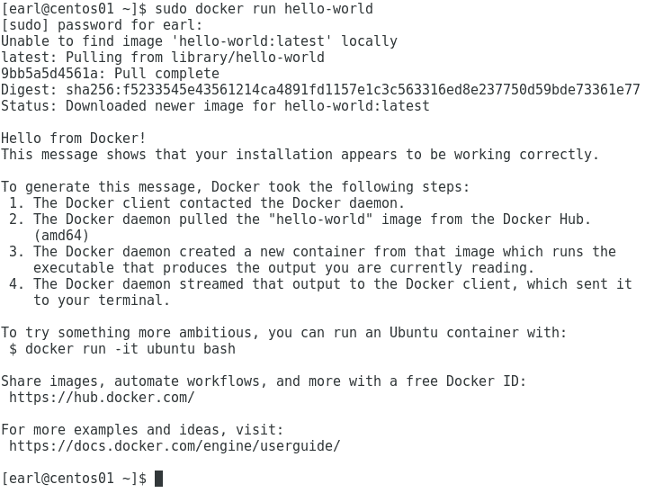
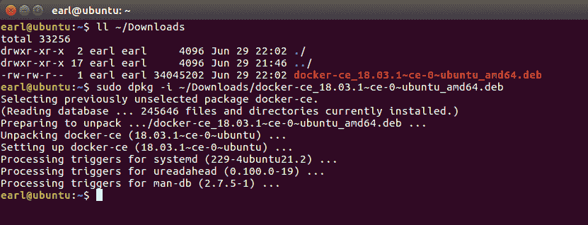
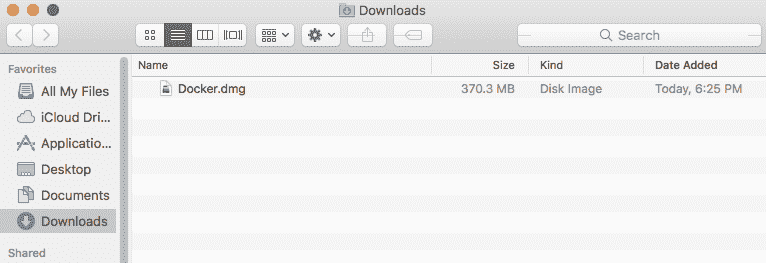

# 建立Docker开发环境

"Suddenly it occurred to me: Would it not be great if my trailer could simply be lifted up and placed on the ship without its contents being touched?" - Malcolm McLean, American trucking entrepreneur

在本章中，我们将在我们的工作站上为 Docker 开发设置一切。我们将学习如何在 Linux、Windows 和 OS X 工作站上设置 Docker 开发环境。然后我们将处理每个操作系统的一些安装后步骤。最后，我们将了解在每个操作系统上使用 Docker 有什么不同，以及它们之间需要注意什么。

到本章结束时，您将了解以下内容:

*   如何设置您的 Docker 开发环境，无论您的工作站是否运行在以下系统上:
    *   CentOS
    *   人的本质
    *   Windows 操作系统
    *   x 是什么
*   在不同操作系统上使用 Docker 时需要注意的差异

# 技术要求

您将需要一个使用您选择的操作系统的开发工作站，包括 Linux、Windows 或 OS X。您将需要工作站上的 sudo 或 admin 访问权限。由于您将安装从互联网上下载的 Docker 软件，因此您的工作站需要基本的互联网连接。

本章的代码文件可以在 GitHub 上找到:

[https://github . com/PacktPublishing/Docker-快速启动-指南/树/主/章节 01](https://github.com/PacktPublishing/Docker-Quick-Start-Guide/tree/master/Chapter01)

查看以下视频，查看正在运行的代码:
[http://bit.ly/2rbGXqy](http://bit.ly/2rbGXqy)

# 设置您的 Docker 开发环境

是时候把手弄脏了。让我们开始设置我们的工作站。不管你喜欢什么操作系统，都有一个 Docker。以下面的内容为指导，我们将在您的工作站上引导您完成 Docker 的设置。我们可以从设置您的 Linux 工作站开始，然后我们将处理一个 Windows 系统，最后可能是最常见的开发人员选项，OS X 工作站。虽然 OS X 可能是最受欢迎的开发人员选择，但我建议您考虑为您选择的工作站安装 Linux 发行版。我们将在稍后的“在 OS X 工作站上安装 Docker”一节中详细讨论为什么我会提出这个建议。但是现在，只要在 Linux 安装讨论中密切关注，以防你被说服在 Linux 上开发。

一般来说，有两种 Docker 风格可以考虑:Docker 企业版，或 Docker EE，和 Docker 社区版，或 Docker CE。通常，在企业中，您会选择企业版，尤其是对于生产环境。它旨在用于关键业务用例，正如其名称所示，Docker EE 在企业级级别得到了认证、保护和支持。这是一个由 Docker 支持并从 Docker 购买的商业解决方案。

另一个口味，Docker CE，是一个社区支持的产品。CE 是免费提供的，通常是小型企业生产环境和开发人员工作站的选择。Docker CE 是一个功能齐全的解决方案，允许开发人员创建可与团队成员共享的容器，与 CI/CD 的自动化构建工具一起使用，如果需要，还可以与 Docker 社区共享。因此，它是开发人员工作站的理想选择。值得注意的是，Docker CE 有稳定和边缘两种发布路径。我们将在本章的所有安装示例中使用 Docker CE 的稳定发布路径。

我们将从安装 CentOS Linux 开始讨论，但是如果你有急事的话，可以直接跳到 Ubuntu、Windows 或 Mac 部分。

# 在 Linux 工作站上安装 Docker

我们将对基于 RPM 的工作站(使用 CentOS)和基于 DEB 的工作站(使用 Ubuntu)执行 Docker 的 Linux 安装步骤，这样您将拥有最符合您当前使用的 Linux 发行版的指令，或者计划在未来某个时候使用。我们将从 CentOS 开始我们的安装之旅。

You can find all of the download links used in the installation of all OSes in the *References* section.

# 在 CentOS 工作站上安装 Docker

CentOS 的 Docker CE 需要 CentOS 7 的维护版本。虽然安装可以在存档版本上工作，但它们既没有经过测试，也不受支持。

在 CentOS 上安装 Docker CE 有三种方法:

*   通过 Docker 存储库
*   下载并手动安装远程桌面管理系统
*   运行 Docker 的便利脚本

最常用的方法是通过 Docker 存储库，所以让我们从这里开始。

# 通过 docker repository 安装 docker ce

首先，我们需要安装一些必需的软件包。打开终端窗口，输入以下命令:

```
# installing required packages sudo yum install -y yum-utils \
 device-mapper-persistent-data \
 lvm2
```

这将确保我们在系统上安装了`yum-config-manager`实用程序和设备映射程序存储驱动程序。下面的截图说明了这一点:

Note that your installation of CentOS 7 may already have these installed, and in that case the `yum install` command will report that there is nothing to do.


接下来，我们将为 Docker CE 建立 CentOS 稳定存储库。

值得注意的是，即使您想要安装边缘版本，您仍然需要设置稳定的存储库。

输入以下命令来设置稳定存储库:

```
# adding the docker-ce repo sudo yum-config-manager \
 --add-repo \
 https://download.docker.com/linux/centos/docker-ce.repo
```

或者，如果要使用边缘释放，可以使用以下命令启用它:

```
# enable edge releases sudo yum-config-manager --enable docker-ce-edge
```

同样，您可以使用以下命令禁用对边缘释放的访问:

```
# disable edge releases sudo yum-config-manager --disable docker-ce-edge
```

现在乐趣开始了...我们将安装 Docker CE。为此，请输入以下命令:

```
# install docker sudo yum -y install docker-ce 
```

如果出现需要安装`container-selinux`的错误，请使用此命令进行安装，然后重试:

```
# install container-selinux sudo yum -y --enablerepo=rhui-REGION-rhel-server-extras \
   install container-selinux

sudo yum -y install docker-ce
```

给你。安装 Docker CE 比你想象的要容易得多，对吗？

让我们使用最基本的方法，通过发出 version 命令来确认安装成功。

该命令验证我们安装了 Docker CE，并向我们显示刚刚安装了什么版本的 Docker。输入以下命令:

```
# validate install with version command docker --version
```

在撰写本文时，Docker CE 的最新版本是 18.03.1:


我们还有一个关键步骤。虽然安装了 Docker CE，但是 Docker 守护进程还没有启动。要启动它，我们需要发出以下命令:

```
# start docker deamon sudo systemctl start docker
```

它应该悄悄地启动，看起来像这样:


我们看到了如何使用 version 命令验证 Docker 安装。这是一个很好的快速测试，但是有一个简单的方法来确认不仅仅是安装，而是一切都开始了，并且如预期的那样工作，这是通过运行我们的第一个 Docker 容器。

让我们发出以下命令来运行 hello-world 容器:

```
# run a test container sudo docker run hello-world
```

如果一切正常，您将看到如下内容:



我们已经在 CentOS 工作站上安装了 Docker CE，它已经在运行容器了。我们有了一个良好的开端。现在我们知道了如何使用 Docker 存储库进行安装，让我们看看如何使用下载的 RPM 手动安装。

# 使用下载的转速手动安装 Docker CE

安装 Docker CE 的另一种方法是使用下载的 RPM。此方法包括下载您希望安装的版本的 Docker CE RPM。你需要浏览到 Docker CE 稳定转速下载网站。这个的网址是[https://download . docker . com/Linux/centos/7/x86 _ 64/stable/Packages](https://download.docker.com/linux/centos/7/x86_64/stable/Packages):


点击你想下载的 Docker CE 版本，当出现提示时，告诉你的浏览器保存文件。接下来，发出`yum install`命令，为下载的 RPM 文件提供路径和文件名。您的命令应该如下所示:

```
# install the docker rpm sudo yum install ~/Downloads/docker-ce-18.03.1.ce-1.el7.centos.x86_64.rpm
```

您将需要启动 Docker 守护程序。您将在 repo 部分使用前面的命令:

```
# start docker sudo systemctl start docker
```

正如我们之前了解到的，您可以使用以下命令验证安装的功能:

```
# validate the install and functionality docker --version
sudo docker run hello-world
```

虽然这种方法看起来更简单，更容易执行，但它不太理想，因为它更多的是一个手动过程，尤其是在需要更新 Docker CE 版本的时候。你必须再次浏览到下载页面，找到更高的版本，下载它，然后做`yum install`。使用前面描述的 Docker Repository 方法，升级就像发出`yum upgrade`命令一样简单。现在让我们再看一个在您的 CentOS 工作站上安装 Docker CE 的方法。

# 通过运行便利脚本安装 Docker CE

安装 Docker 的第三种方法是使用 Docker 提供的便利脚本。这些脚本允许您安装 Docker 的最新边缘版本或最新测试版本。不建议在生产环境中使用这两种方法，但它们确实有助于测试和开发最新的 Docker 版本。这些脚本有些局限性，因为它们不允许您在安装过程中自定义任何选项。相同的脚本可以在各种 Linux 发行版中使用，因为它们决定了您正在运行的基础发行版，然后根据这个决定进行安装。过程很简单。

使用`curl`下拉想要的脚本，然后使用 sudo 运行脚本。

运行最新边缘版本的命令如下:

```
# download and run the install script curl -fsSL get.docker.com -o get-docker.sh
sudo sh get-docker.sh
```

执行脚本将产生如下输出:


脚本已经为您创建了 docker 组，但是由于 CentOS 是以 RPM 为中心的，您仍然需要自己启动 Docker 服务:

```
# start docker sudo systemctl start docker
```

If this were a Debian-based system, the Docker service would have been started automatically by the script.

现在，我们已经研究了在您的 CentOS 工作站上安装 Docker 的三种方法，现在是讨论安装后设置中建议的一些附加步骤的好时机。

# 您可能需要考虑的安装后步骤

所有三种安装方法都会自动为您创建一个 docker 组，但是如果您希望能够在不使用`root`或 sudo 的情况下运行 docker 命令，那么您将希望将您的用户添加到 Docker 组中。

Be aware that many Docker commands require full admin access to execute, so adding a user to the docker group is comparable to granting them root access, and the security implications should be considered. If the user already has root access on their workstation, adding them to the docker group is only providing them a convenience.

使用以下命令可以轻松地将当前用户添加到 docker 组:

```
# add the current user to the docker group sudo usermod -aG docker $USER
```

您将需要注销并重新登录来更新您帐户上的组成员身份，但是一旦您这样做了，您应该都设置为执行任何 Docker 命令而不使用 sudo。

这可以通过在没有 sudo 的情况下运行 hello-world 容器来验证:

```
# test that sudo is not needed docker run hello-world
```

接下来，您需要配置您的系统，使 Docker 服务在系统引导时启动:

```
# configure docker to start on boot sudo systemctl enable docker
```

您应该考虑的另一个安装后步骤是安装 docker-compose。

这个工具可以成为你的 Docker 工具带的重要补充，我们将在[第 7 章](7.html)*Docker Stacks*中讨论它的使用。安装 docker-compose 的命令是:

```
# install docker compose
sudo curl -L \
 https://github.com/docker/compose/releases/download/1.21.2/docker-compose-$(uname -s)-$(uname -m) \
 -o /usr/local/bin/docker-compose
sudo chmod +x /usr/local/bin/docker-compose
```

恭喜，您的 CentOS 工作站现在可以开始开发您的 Docker 映像和部署您的 Docker 容器了。接下来，我们将学习如何使用 Ubuntu 工作站将 Docker 安装到基于 DEB 的系统上。如果你准备好了，继续读下去。

# 在 Ubuntu 工作站上安装 Docker

正如我们在 CentOS 工作站上所做的那样，我们将在我们的 Ubuntu 工作站上安装 Docker CE。在 Ubuntu 上安装 Docker CE 的要求是必须运行 64 位的最新 LTS 版本，比如仿生、Xenial 或 Trusty。你可以在 Ubuntu 的巧妙版本上安装 Docker CE 的边缘版本。

在 Ubuntu 上安装 Docker CE 有三种方法:

*   通过 Docker 存储库
*   下载并手动安装 DEB 包
*   运行便利脚本

最常用的方法是通过 Docker 存储库，所以让我们从这里开始。

# 通过 docker repository 安装 docker ce

我们需要先设置 Docker 存储库，然后才能进行安装，所以现在让我们来处理 repo。

第一步是更新 apt 包索引。使用以下命令来完成此操作:

```
# update apt-get libraries sudo apt-get update
```

现在我们需要安装一些支持包:

```
# install required packages sudo apt-get install \
 apt-transport-https \
 ca-certificates \
 curl \
 software-properties-common
```

接下来，我们需要为 Docker 获取 GPG 密钥:

```
# get the GPG key for docker curl -fsSL https://download.docker.com/linux/ubuntu/gpg | \
   sudo apt-key add -
```

您可以确认已成功添加 Docker 的 GPG 密钥；它会有`9DC8 5822 9FC7 DD38 854A E2D8 8D81 803C 0EBF CD88`的指纹。

您可以通过检查最后八个字符是否与该命令的`0EBFCD88`匹配来验证密钥:

```
# validating the docker GPG key is installed sudo apt-key fingerprint 0EBFCD88
```

最后，我们需要实际设置存储库。在我们的示例中，我们将重点关注稳定回购。

如果要安装 Docker CE 的 edge 或测试版，请务必在`stable`一词后添加`edge`或`test`(不要替换以下命令中的`stable`一词):

```
# adding the docker repository sudo add-apt-repository \
 "deb [arch=amd64] https://download.docker.com/linux/ubuntu \
 $(lsb_release -cs) \
 stable"
```

现在我们的系统已经为安装 Docker CE 建立了正确的存储库，让我们安装它。

首先，通过发出`apt-get update`命令，确保所有包都是最新的:

```
# update apt-get libraries again sudo apt-get update
```

现在我们将实际安装 Docker CE:

```
# install docker sudo apt-get install docker-ce
```

安装了 Docker。您可以在安装后检查 Docker 版本，以确认安装成功:

```
# validate install with version command docker --version
```

version 命令应该如下所示:


现在，让我们验证 Docker 安装是否按预期工作。为此，我们将使用以下命令运行 hello-world Docker 映像:

```
# validating functionality by running a container
sudo docker run hello-world
```


你注意到发生了什么有趣的事情吗？

我们不必像在 CentOS 安装中那样在安装后启动 Docker。这是因为，在基于 DEB 的 Linux 系统上，安装过程也会为我们启动 Docker。此外，Ubuntu 工作站被配置为在启动时启动 Docker。因此，在安装过程中，Docker 的两个启动步骤都会为您处理。很好！您的 Ubuntu 工作站现在已经安装了 Docker，我们已经验证它是否如预期的那样工作。

虽然使用 Docker 存储库是在您的工作站上安装 Docker 的最好方法，但是让我们快速了解一下在 Ubuntu 工作站上安装 Docker CE 的另一种方法，那就是使用 DEB 包手动安装它。

# 使用 DEB 包手动安装 Docker CE

现在我们将向您展示如何下载和安装 Docker CE DEB 包。无论出于什么原因，如果您的工作站无法使用存储库，您都应该考虑使用这种方法。

您将需要下载 Docker CE 包，因此首先打开您的浏览器，前往位于[https://download.docker.com/linux/ubuntu/dists/.](https://download.docker.com/linux/ubuntu/dists/)的 Ubuntu Docker CE 包下载站点

在那里，您会发现一个列出的 Ubuntu 版本文件夹列表，看起来像这样:


您要选择与您工作站上安装的 Ubuntu 版本相匹配的文件夹，在我的例子中是`xenial`文件夹。

继续浏览至`/pool/stable/`，然后浏览至与您的工作站硬件相匹配的处理器文件夹。对我来说，这是 amd64，它看起来像这样:


现在点击你想下载安装的 Docker CE 版本。

在单击“确定”之前，请务必选择“保存文件”选项。

一旦软件包下载到您的工作站，要安装它，只需使用`dpkg`命令手动安装软件包。

您将下载的 Docker CE 包的路径和文件名作为参数提供给`dpkg`。下面是我对刚下载的包使用的命令:

```
# installing docker package
sudo dpkg -i ~/Downloads/docker-ce_18.03.1~ce-0~ubuntu_amd64.deb
```

执行命令如下所示:



现在安装了 Docker，让我们使用 version 命令来确认安装成功，然后运行 hello-world 容器来验证 Docker 是否按预期工作:

```
# validating the install and functionality
docker --version
sudo docker run hello-world
```

这很好。就像存储库安装一样，您的 docker 组已经创建，并且在手动软件包安装中为您处理了两个开始步骤。您不必启动 Docker，也不必将 Docker 配置为在启动时启动。因此，您已经准备好开始创建 Docker 映像和运行 Docker 容器了。

然而，在我们开始创建和运行之前，还有一种在 Ubuntu 工作站上安装 Docker 的方法，我们将介绍一下。您可以使用 Docker 的便利脚本来安装 Docker CE 的最新边缘或测试版本。现在让我们来看看如何做到这一点。

# 通过运行便利脚本安装 Docker CE

安装 Docker 的另一种方法是使用 Docker 提供的便利脚本。这些脚本允许您安装 Docker 的最新边缘版本或最新测试版本。不建议在生产环境中使用这两种方法，但是，它们确实有助于测试和开发最新的 Docker 版本。这些脚本有些局限性，因为它们不允许您在安装中自定义任何选项。相同的脚本可以在各种 Linux 发行版中使用，因为它们决定了您正在运行的基本发行版，然后根据这个决定进行安装。过程很简单。使用`curl`下拉想要的脚本，然后使用 sudo 运行脚本。运行最新边缘版本的命令如下。

使用以下命令安装 curl:

```
# install curl sudo apt-get install curl
```

现在获取脚本并运行 docker 脚本进行安装:

```
# download and run the docker install script curl -fsSL get.docker.com -o get-docker.sh
sudo sh get-docker.sh
```

执行脚本将产生如下输出:


脚本已经为您创建了 docker 组。Docker 服务已启动，工作站已配置为在启动时运行 Docker。所以，再一次，你准备好开始使用 Docker 了。

我们已经研究了在 Ubuntu 工作站上安装 Docker 的三种方法，所以现在是讨论为您的安装后设置推荐的附加步骤的好时机。

# 您可能需要考虑的安装后步骤

所有这三种安装方法都会自动为您创建一个 docker 组，但是如果您希望能够在不使用`root`或 sudo 的情况下运行 docker 命令，您将希望将您的用户添加到 Docker 组中。

Be aware that many Docker commands require full admin access to execute, so adding a user to the docker group is comparable to granting them root access, and the security implications should be considered. If the user already has root access on their workstation, adding them to the docker group is only providing them a convenience.

使用以下命令可以轻松地将当前用户添加到 docker 组:

```
# add the current user to the docker group sudo usermod -aG docker $USER
```

您将需要注销并重新登录来更新您帐户上的组成员身份，但是一旦您这样做了，您应该都设置为执行任何 Docker 命令而不使用 sudo。

这可以通过 hello-world 容器来验证:

```
# validate that sudo is no longer needed docker run hello-world
```

您应该考虑的另一个安装后步骤是安装 docker-compose。

这个工具可以成为你的 Docker 工具带的重要补充，我们将在 [第 7 章](7.html)*Docker Stacks*中讨论它的使用。安装 docker-compose 的命令是:

```
# install docker-compose
sudo curl -L https://github.com/docker/compose/releases/download/1.21.2/docker-compose-$(uname -s)-$(uname -m) -o /usr/local/bin/docker-compose
sudo chmod +x /usr/local/bin/docker-compose
```

恭喜你，你的 Ubuntu 工作站现在已经准备好开始开发你的 Docker 映像和部署你的 Docker 容器了。接下来，我们将学习如何在基于 Windows 的工作站上安装 Docker。如果你准备好了，继续读下去。

# 在视窗工作站上安装 Docker

视窗版的 Docker CE 与视窗 10 专业版或企业版兼容。Windows 上的 Docker CE 通过与 Windows Hyper-V 虚拟化和网络集成，提供了完整的 Docker 开发解决方案。Windows 上的 Docker CE 支持创建和运行 Windows 和 Linux 容器。Windows 上的 Docker CE 可从 Docker 商店获得，网址为[https://store . Docker . com/editions/community/Docker-CE-desktop-Windows](https://store.docker.com/editions/community/docker-ce-desktop-windows)。

您需要登录 Docker 商店来下载 Windows 安装程序的 Docker CE，因此如果您还没有帐户，现在就创建一个帐户，然后登录它。

Be sure to save your Docker credentials securely as you will be using them a lot in the future.

登录后，您应该会看到获取 Docker 下载按钮。点击下载按钮，允许安装程序下载到您的工作站。安装程序完成下载后，您可以单击“运行”按钮开始安装。如果您进行了安全检查，请通过单击“运行”按钮确认您想要运行安装程序可执行文件。如果您在工作站上启用了 UAC，您可能会看到“用户帐户控制”警告，要求您确认是否允许 Docker CE 安装程序对您的设备进行更改。您必须选中“是”才能继续，所以现在就点击它。

Docker CE 安装程序将运行，并开始下载 Docker。一旦 Docker 安装文件成功下载，安装程序将要求您确认所需的配置。这里的选择很少。我建议您将快捷方式添加到桌面，并且不要选中使用 Windows 容器代替 Linux 容器选项:


安装程序将解压 Docker CE 文件。文件解压缩后，您将收到安装成功的通知。根据当前文档，安装程序将在安装结束时为您运行 Docker。根据我的经验，这种情况并不总是发生。要有耐心，给它时间，但是如果它第一次没有启动，你可能需要手动运行 Docker。

如果您选择了将 Docker 的快捷方式添加到桌面的配置选项，现在您将能够双击该快捷方式图标并首次启动 Docker。

Docker 将运行，您将获得一个欢迎屏幕，让您知道 Docker 已启动并运行。建议您提供您的 Docker 凭据，并在此时登录。

每当 Docker 运行时，您都会在任务栏通知区域看到一个鲸鱼图标。如果您将鼠标悬停在该图标上，您可以获得 Docker 进程的状态。您将看到诸如 Docker 正在启动和 Docker 正在运行这样的状态。您可以右键单击该图标，调出“窗口摘要”菜单:


一旦在您的 Windows 工作站上运行了 Docker，您就可以打开一个 Windows PowerShell 命令窗口并开始使用 Docker。要验证安装是否成功完成，请打开 PowerShell 窗口并输入版本命令。要确认 Docker 按预期工作，请运行 hello-world Docker 容器:

```
# validate install and functionality docker --version
docker run hello-world
```

您的 Windows 10 工作站现已设置为创建 Docker 映像和运行 Docker 容器。Docker 还应该配置为在启动时启动，这样当您需要重新启动工作站时，它就会自动启动。

请注意，在 Windows 工作站上使用 Docker CE 与在 Linux 工作站上使用 Docker CE 并不完全一样。还有一层隐藏在幕后的虚拟化。Docker 正在 Hyper-V 中运行一个小的 Linux 虚拟机，您的所有 Docker 交互都通过这个 Linux 虚拟机进行。对于大多数用例，这不会带来任何问题，但是会影响性能。我们将在*发现操作系统之间需要注意的差异*一节中对此进行更多讨论。

还有一点设置我们想看一下，所以如果你准备好了，直接跳到下一部分。

# 您可能需要考虑的安装后步骤

以下是我为您的 Docker Windows 工作站推荐的几个安装后步骤。

# 安装 Kitematic

Docker CE 的 Windows 安装与名为 Kitematic 的图形用户界面工具集成在一起。如果你是一个图形界面类型的人(既然你使用的是 Windows for Docker，我猜你也是)，你会想要安装这个工具。

在任务栏通知区域找到`Docker`图标，右键点击，弹出窗口 Docker 菜单。单击 Kitematic 菜单选项。默认情况下不安装 Kitematic。您必须下载包含该应用的归档文件。当您第一次单击 Kitematic 菜单选项时，会提示您下载它。单击下载按钮，将归档文件保存到您的工作站:


您需要解压缩 Kitematic 档案才能使用它。未压缩的 Kitematic 文件夹需要在文件夹名为`Kitematic`的`C:\Program Files\Docker`文件夹中，Docker 子菜单集成才能正常工作。在 Windows 工作站的正确路径上安装 Kitematic 后，您可以右键单击任务栏通知区域的`Docker`图标，然后再次选择 Kitematic 选项。

系统将提示您再次输入您的 Docker 凭据以连接到 Docker 集线器。你可以跳过这一步，但我建议你现在就登录。登录后(或跳过登录步骤)，您将看到 Kitematic 用户界面。它允许您在工作站上下载和运行 Docker 容器。继续尝试一个，比如 *hello-world-nginx* 容器，或者如果你想玩游戏，试试《我的世界》容器。

您现在已经准备好创建 Docker 映像并在您的 Windows 10 工作站中运行 Docker 容器，但是我们还有一个工作站操作系统要学习如何在其上安装 Docker CE。接下来让我们看看如何在 OS X 工作站上安装它。

# 为 PowerShell 设置 DockerCompletion

如果您曾经使用过命令行完成，您将会考虑为 PowerShell 安装 DockerCompletion。该工具为 Docker 命令提供命令行完成。安装起来相当容易。您需要设置您的系统以允许下载模块的执行。为此，请使用“以管理员身份运行”打开一个 PowerShell 命令窗口，并发出以下命令:

```
# allow remote signed scripts to run
Set-ExecutionPolicy RemoteSigned
```

现在，您可以关闭管理员命令窗口，并打开一个普通用户的 PowerShell 命令窗口。要安装`DockerCompletion`模块，发出以下命令:

```
# install Docker completion
Install-Module DockerCompletion -Scope CurrentUser
```

最后，要激活当前 PowerShell 窗口中的模块，请使用以下命令:

```
# enable Docker completion
Import-Module DockerCompletion
```

现在，您可以对所有 Docker 命令使用命令完成功能。这是一个伟大的击键保护程序！

Note that the Import-Module command is only active in the current PowerShell command window. If you want to have it available to all future PowerShell sessions, you will need to add the `Import-Module DockerCompletion` to your PowerShell profile. 

您可以使用以下命令轻松编辑您的 PowerShell 配置文件(或者创建一个新的配置文件，如果您还没有这样做的话):

```
# update your user profile to enable docker completion for every PowerShell command prompt
notepad $PROFILE
```

输入`Import-Module DockerCompletion`命令，保存配置文件。现在，您的 Docker 命令行完成功能将在以后的所有 PowerShell 会话中处于活动状态。

# 在 OS X 工作站上安装 Docker

近年来，Docker on Mac 的故事有了很大的发展，现在它是一个真正的、可用于您的 Mac 工作站的开发解决方案。Mac 的 Docker CE 需要 OS X El Capitan 10.11 或更高版本的 macOS。Docker CE 应用与 OS X 内置的虚拟机管理程序、网络和文件系统集成在一起。安装过程很简单:下载 Docker 安装程序映像并启动它。您可以从 Docker 商店下载安装程序映像。您必须登录 Docker 商店才能下载安装映像，因此，如果您还没有帐户，请在那里创建一个帐户。

Be sure to save your credentials securely as you will need them later.

在[https://store . Docker . com/editions/community/Docker-CE-desktop-Mac](https://store.docker.com/editions/community/docker-ce-desktop-mac)浏览到 Docker CE for Mac 的 Docker 商店页面。请记住，您必须登录 Docker 存储才能下载安装程序映像。

一旦登录到 Docker 商店，就可以点击“获取 Docker”按钮。请点击它开始下载。Mac 安装映像的 Docker CE 可能需要一些时间来下载。下载完成后，双击`Docker.dmg`镜像文件挂载并打开:



一旦苹果电脑的 Docker CE 镜像安装并打开，点击`Docker`图标并将其拖动到`Applications`图标上完成安装。将启动将`Docker`复制到`Applications`的操作。当复制过程完成时，Docker 应用将可以从您的`Applications`文件夹运行。双击您的`Docker`图标启动它。首次启动 Docker 将提醒您，您正在运行从互联网下载的应用，以确保您真的想要打开它。当 Docker 应用打开时，您将收到友好的欢迎 Docker 消息。

单击欢迎消息上的下一步将警告您 Docker 需要提升的权限才能运行，并将通知您必须提供凭据才能安装 Docker 的网络和应用链接。输入您的用户名和密码。Docker 应用将启动，在菜单通知区域添加一个鲸鱼图标。

还会提示您输入 Docker 商店凭据，以允许 Mac 的 Docker 登录到商店。输入您的凭证并点击`Log In`按钮。您将获得确认，显示您当前已登录。

为了验证我们的安装是否成功并确认我们安装的功能，我们将发出版本命令，然后运行 Docker 的 hello-world 容器:

```
# validate install and functionality docker --version
docker run hello-world
```

您的 macOS 工作站现已设置为创建 Docker 映像和运行 Docker 容器。您已经准备好将您的应用容器化了！您可以轻松地使用终端窗口完成所有 Docker 工作，但您可能会对 Mac 可用的图形用户界面工具感兴趣，该工具名为 **Kitematic** 。接下来让我们安装 Kitematic。

# 您可能需要考虑的安装后步骤

以下是我为您的 Docker OS X 工作站推荐的几个安装后步骤。

# 安装 Kitematic

虽然您可以在您的 OS X 终端窗口中使用 Docker CLI，并且可能会在您的大部分 Docker 开发工作中使用它，但是您可以选择使用一个名为 Kitematic 的图形用户界面工具。要安装 Kitematic，右键单击 OS X 菜单-通知区域中的鲸鱼图标，打开 Mac Docker 菜单。单击 Kitematic 菜单选项下载(稍后运行)Kitematic 应用。如果你还没有安装 Kitematic，当你点击它的 Docker for Mac 菜单时，你会看到一条包含下载链接的消息。该消息还提醒您必须将 Kitematic 安装到您的`Applications`文件夹中，以启用 Docker 菜单集成。单击此处链接下载 Kitematic 应用:


下载完成后，按照前面的指示，将下载的应用移动到您的`Applications`文件夹中。然后，使用 Docker for Mac 菜单，再次单击 Kitematic 菜单选项。这次它将运行 Kitematic 应用。第一次运行应用时，您会收到标准警告，提示您正在运行从互联网下载的东西，询问您是否真的要打开它。单击打开按钮进行操作。

将 Kitematic 安装在 Mac 工作站上后，您可以在菜单栏通知区域中单击 Docker whale 图标，然后再次选择 Kitematic 选项。

系统将提示您输入 Docker 凭据，以便将 Kitematic 连接到 Docker 集线器。你可以跳过这一步，但我建议你现在就登录。登录后(或跳过登录步骤)，您将看到 Kitematic 用户界面。这允许您在工作站上下载和运行 Docker 容器。继续尝试一个，比如 *hello-world-nginx* 容器，或者如果你想玩游戏，试试《我的世界》容器。

恭喜你！您现在可以使用 Docker 命令行界面和 Kitematic 图形用户界面来运行您的 Docker 容器和管理您的 Docker 映像。但是，您将使用 OS X 终端和您最喜欢的代码编辑器来创建 Docker 映像。

# 安装 Docker 命令行完成

安装自制程序。你可能(可能)已经在你的苹果电脑上安装了自制程序，但是如果没有，你应该现在就安装。下面是安装它的命令:

```
# install homebrew
/usr/bin/ruby -e "$(curl -fsSL https://raw.githubusercontent.com/Homebrew/install/master/install)"
```

接下来，使用自制程序安装`bash-completion`。下面是命令:

```
# use homebrew to install bash completion 
brew install bash-completion
```

`bash-completion`的安装将指示您将以下行添加到您的`~/.bash_profile`文件中:

```
# update the bash profile to enable bash completion for every terminal session 
[ -f /usr/local/etc/bash_completion ] && . /usr/local/etc/bash_completion
```

现在，创建启用 Docker 命令行完成功能所需的链接。每个 Docker 工具集都有一个链接。下面是 bash 的链接命令(如果使用`zsh`，请检查链接命令的下一个代码块):

```
# create links for bash shell
ln -s /Applications/Docker.app/Contents/Resources/etc/docker.bash-completion $(brew --prefix)/etc/bash_completion.d/docker
ln -s /Applications/Docker.app/Contents/Resources/etc/docker-machine.bash-completion $(brew --prefix)/etc/bash_completion.d/docker-machine
ln -s /Applications/Docker.app/Contents/Resources/etc/docker-compose.bash-completion $(brew --prefix)/etc/bash_completion.d/docker-compose
```

请注意，如果您使用的是`zsh`而不是 bash，则链接命令是不同的。以下是`zsh`的链接命令:

```
# create links for zsh shell
ln -s /Applications/Docker.app/Contents/Resources/etc/docker.zsh-completion /usr/local/share/zsh/site-functions/_docker
ln -s /Applications/Docker.app/Contents/Resources/etc/docker-machine.zsh-completion /usr/local/share/zsh/site-functions/_docker-machine
ln -s /Applications/Docker.app/Contents/Resources/etc/docker-compose.zsh-completion /usr/local/share/zsh/site-functions/_docker-compose
```

最后，重新启动您的终端会话—您现在可以使用 Docker 命令完成了！通过键入`docker`并按两次*选项卡*键来尝试。

# 参考

*   Docker 企业版数据:[https://www.docker.com/enterprise-edition](https://www.docker.com/enterprise-edition)
*   Docker社区版数据:[https://www.docker.com/community-edition](https://www.docker.com/community-edition)
*   下载 dock ce for centos:https://store . docker . com/versions/community/docker-ce-server-centes
*   下载 Ubuntu ce Docker:https://store . docker . com/versions/community/docker-ce-server-Ubuntu
*   下载 dock ce for windows:t1]https://store . docker . com/versions/community/docker-ce-desktop-windows
*   下载 Mac 的 ce dock:t1]https://store . docker . com/versions/community/docker-ce-desktop MAC
*   CentOS 的 Docker CE Stable RPM 下载站点:[https://download . Docker . com/Linux/CentOS/7/x86 _ 64/Stable/Packages](https://download.docker.com/linux/centos/7/x86_64/stable/Packages)
*   Docker安装报告:[https://github.com/docker/docker-install](https://github.com/docker/docker-install)
*   the docker ce deb package download site for Ubuntu:t1]https://download . docker . com/Linux/Ubuntu/dists/
*   在 Windows 上运行 Windows Docker 容器:[https://blog . Docker . com/2016/09/build-your-first-Docker-Windows-server-container/](https://blog.docker.com/2016/09/build-your-first-docker-windows-server-container/)
*   PowerShell 的完成日期:[https://github.com/matt9ucci/DockerCompletion](https://github.com/matt9ucci/DockerCompletion)
*   ce docker for MAC:https://store . docker . com/versions/community/docker-ce-desktop MAC
*   Mac 的命令行完成:[https://docs . docker . com/docker-for-Mac/# install-shell-completion](https://docs.docker.com/docker-for-mac/#install-shell-completion)
*   在你的苹果电脑上安装自制软件:https://brew.sh/

# 操作系统之间需要注意哪些差异

根据设计，Docker 映像是独立的包，包含运行应用所需的一切。Docker 的一大优势是 Docker 映像几乎可以在任何操作系统上运行。也就是说，在不同的操作系统上运行 Docker 映像的体验存在一些差异。Docker 是在 Linux 上创建的，并与一些关键的 Linux 构造深度集成。因此，正如您所料，当您在 Linux 上运行 Docker 时，一切都与操作系统直接无缝集成。Docker 原生地利用了 Linux 内核和文件系统。

不幸的是，当你运行 Docker for Windows 或 Docker for Mac 时，Docker 不能利用它在 Linux 上固有的相同结构，因为它们不存在于这些其他操作系统上。Docker 通过在虚拟机管理程序中为非 Linux 操作系统创建一个小型、高效的 Linux 虚拟机来处理这个问题。借助于 Windows Docker，这个 Linux 虚拟机是在 Hyper-V 中创建的。在 macOS 上，该虚拟机是在一个名为 **hyperkit** 的定制虚拟机管理程序中创建的。

如您所料，助手虚拟机会带来性能开销。但是，如果您确实将 Windows 或 OS X 用于您的开发工作站，您会很高兴知道 Docker 在这两个平台上都取得了许多积极的进展，随着每个新的主要版本的发布，降低了开销并显著提高了性能。有很多关于 OS X hyperkit 虚拟机管理程序的高 CPU 利用率的报告，但我个人没有遇到过这个问题。有了目前稳定的 Docker CE 版本，相信 Windows 和 OS X 都可以成功用于 Docker 开发。

尽管如此，除了处理性能之外，还有其他差异需要考虑。您应该注意两个方面:文件装载和端点。

Linux 操作系统上的 Docker CE 能够直接使用文件系统在运行的容器中装载文件，这提供了本机磁盘性能级别。您还可以更改用于实现不同性能级别的文件系统驱动程序。这不适用于 Windows 上的 Docker 或 Mac 上的 Docker。对于 Windows 和 OS X，还有一个额外的文件系统工具来处理文件装载。在 Windows 上，您将使用 Windows 共享文件，而在 OS X，它是 **osxfs** 。不幸的是，对于 Windows 和 OS X 用户来说，文件装载的性能损失是巨大的。尽管 Docker 在改进 Windows 和 OS X 版本 17 及更高版本的文件装载方面取得了长足的进步，但与在 Linux 操作系统上运行相比，这两个版本仍然明显较慢。特别是对于 Windows，文件装载选项非常严格。如果您正在开发一个磁盘利用率很高的应用，这种差异可能足以让您立即考虑切换到 Linux 开发工作站。

Linux 上的 Docker 和 Windows 上的 Docker 或 Mac 上的 Docker 的另一个不同之处是端点端口的利用率。Windows 的 Docker 就是一个例子；您不能使用 localhost 从容器的主机访问容器的端点。这是一个已知的错误，但是唯一的解决方法是从不同于运行它们的主机访问容器的端点。使用 Docker for Mac，还存在其他端点限制，例如无法 ping 通容器(因为 Docker for Mac 无法将 ping 流量路由到容器或从容器路由出)，并且您不能拥有每个容器的 IP 寻址(因为无法从 macOS 到达 Docker 桥网络)。

这些限制中的任何一个都足以让您考虑将您的开发工作站切换到 Ubuntu 或 CentOS 操作系统。这是给我的，你会发现这本书里的大多数例子都会在我的 Ubuntu 工作站上执行。如果您使用的是 Windows 或 OS X，我将尝试指出任何可能有显著不同的领域。

# 摘要

哇哦！我们在第一章中讲了很多。您现在应该能够在您的工作站上安装 Docker，而不管它运行的是什么操作系统。您应该能够使用三种不同的方法将 Docker 安装到 Linux 工作站上，并且知道在基于 RPM 的系统和基于 DEB 的系统上安装之间的一些区别。

我们还介绍了一些非常重要的原因，为什么您可能会考虑使用 Linux 工作站进行开发，而不是使用 Windows 或 macOS 工作站。到目前为止，您应该能够通过检查安装的 Docker 版本来轻松验证 Docker 的成功安装。

通过运行 hello-world 容器，您应该能够轻松地确认 Docker 正在按预期工作。对你的第一章来说还不错，对吧？好了，有了这个基础，以及您新准备好的 Docker 工作站，让我们直接进入[第 2 章](2.html)、*学习 Docker 命令*，在这里我们将了解您每天都会使用的许多 Docker 命令。

# 参考

*   Windows 限制的 docker:[https://docs . docker . com/docker-for-Windows/疑难解答/#限制-Windows-containers-for-localhost-and-published-port](https://docs.docker.com/docker-for-windows/troubleshoot/#limitations-of-windows-containers-for-localhost-and-published-ports)
*   Mac 限制的 docker:[https://docs . docker . com/v 17.09/docker-for-Mac/networking/#已知限制-用例和变通办法](https://docs.docker.com/v17.09/docker-for-mac/networking/#known-limitations-use-cases-and-workarounds)