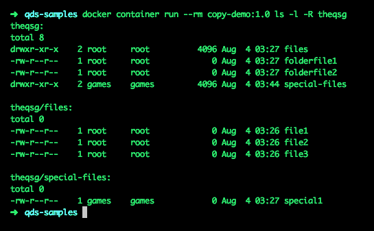
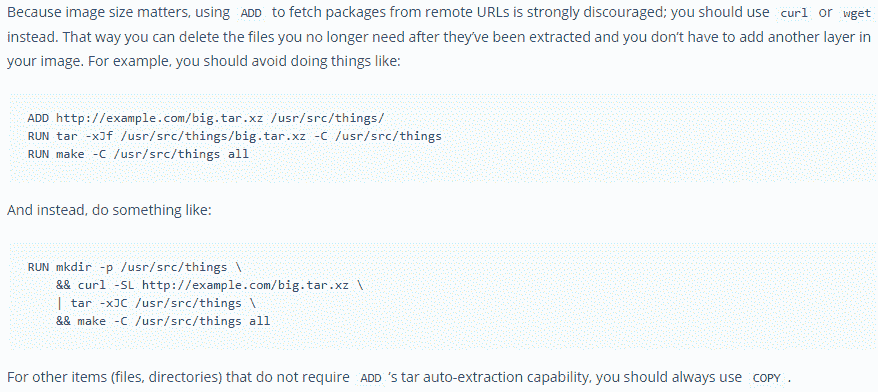
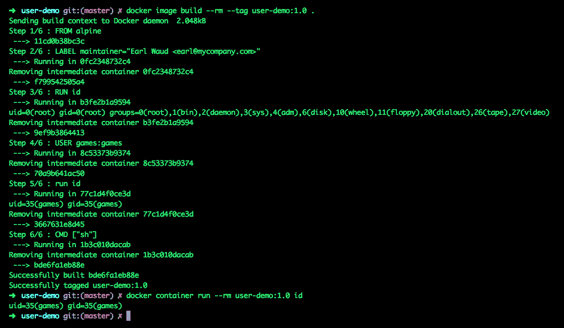
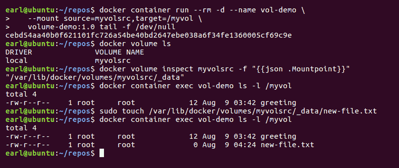
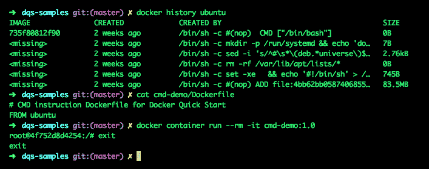

# 三、创建 Docker 映像

在本章中，我们将学习如何创建企业级 Docker 映像。我们将从了解 Docker 映像的主要构建块开始，特别是 Docker 文件。然后，我们将探索在 Dockerfile 中可以使用的所有指令。有些说明表面上看起来很相似。我们将揭示`COPY`和`ADD`指令、`ENV`和`ARG`指令之间的区别，最重要的是`CMD`和`ENTRYPOINT`指令之间的区别。接下来，我们将了解构建上下文是什么，以及它为什么重要。最后，我们将介绍实际的映像构建命令。

If well-maintained, the average shipping container has a lifespan of around 20 years, whereas the average lifespan of a Docker container is 2.5 days. – [https://www.tintri.com/blog/2017/03/tintri-supports-containers-advanced-storage-features](https://www.tintri.com/blog/2017/03/tintri-supports-containers-advanced-storage-features)

在本章中，我们将涵盖以下主题:

*   什么是 Dockerfile？
*   可以在 Dockerfile 中使用的所有指令
*   何时使用`COPY`或`ADD`指令
*   `ENV`和`ARG`变量之间的差异
*   为什么使用`CMD`和`ENTRYPOINT`指令
*   构建上下文的重要性
*   使用 Docker 文件构建 Docker 映像

# 技术要求

您将从 Docker 的公共存储库中提取 Docker 映像，因此需要基本的互联网访问来执行本章中的示例。

本章的代码文件可以在 GitHub 上找到:

[https://github . com/PacktPublishing/Docker-快速启动-指南/树/主/章节 03](https://github.com/PacktPublishing/Docker-Quick-Start-Guide/tree/master/Chapter03)

查看以下视频，查看正在运行的代码:
[http://bit.ly/2rbHvwC](http://bit.ly/2rbHvwC)

# 什么是 Dockerfile？

您在[第 2 章](2.html)、*学习 docker 命令*中了解到，您可以运行 Docker 容器，对正在运行的容器进行修改，然后使用 docker commit 命令保存这些更改，从而有效地创建新的 Docker 映像。虽然这种方法有效，但它不是创建 Docker 容器的首选方法。创建 Docker 映像的最佳方式是将 Docker 映像构建命令与描述所需映像的 Docker 文件一起使用。

Dockerfile(是的，正确的拼写都是一个单词，大写 *D* )是一个文本文件，包含 Docker 守护程序用来创建 Docker 映像的指令。使用一种值对语法来定义指令。每个指令都有一个指令字，后跟该指令的参数。每个命令在 Dockerfile 中都有自己的行。虽然 Dockerfile 指令不区分大小写，但是有一个很好使用的约定，即指令字总是大写。

Dockerfile 中指令的顺序很重要。指令按顺序评估，从文件的顶部开始，到文件的底部结束。如果你回想一下[第 1 章](1.html)、*设置 Docker 开发环境*，Docker 映像是由层组成的。在 Docker 文件中找到的所有指令将导致在构建 Docker 映像时生成一个新层，但是，一些指令将只向创建的映像添加零字节大小的元数据层。因为保持 Docker 映像尽可能小是最佳实践，所以您将希望尽可能高效地使用创建非零字节大小的层的指令。在接下来的部分中，我们将注意到在哪里使用指令创建非零字节大小的层，以及如何最好地使用该指令来最小化层的数量和大小。另一个重要的考虑是指令的顺序。某些指令必须在其他指令之前使用，但是除了这些例外，您可以按照自己喜欢的任何顺序放置其他指令。最佳实践是使用在 Dockerfile 早期更改最少的指令，以及在 Dockerfile 后期更改更频繁的指令。原因是，当您需要重建映像时，唯一重建的图层是位于 Dockerfile 中第一行更改处或之后的图层。如果你还不明白这一点，不要担心，一旦我们看到一些例子，它会更有意义。

我们将在本节末尾回顾构建命令，但是我们将首先从 Dockerfile 可用的指令开始，从必须是 Dockerfile 中第一条指令的指令开始:`FROM`指令。

# “从”指令

每个 Dockerfile 必须有一个`FROM`指令，并且必须是文件中的第一个指令。(其实 ARG 指令可以用在`FROM`指令之前，但不是必选指令。我们将在 ARG 指令部分详细讨论这一点。)

`FROM`指令为正在创建的映像设置基础，并指示 Docker 守护程序新映像的基础应该是作为参数指定的现有 Docker 映像。可以使用我们在 [第 2 章](2.html)*学习 Docker 命令*中看到的相同语法来描述指定的映像。这里是`FROM`指令，指定使用版本为 1.15.2 的官方`nginx`映像:

```
# Dockerfile
FROM nginx:1.15.2
```

请注意，在此示例中，没有指定存储库来指示指定的映像是正式的 nginx 映像。如果没有指定标签，将采用`latest`标签。

`FROM`指令将在我们的新映像中创建第一层。该图层将是指令参数中指定的映像大小，因此最好指定满足新映像所需标准的最小映像。特定于应用的映像(如`nginx`)将比操作系统映像(如 ubuntu)小。此外，`alpine`的操作系统映像将比其他操作系统的映像小得多，例如 Ubuntu、CentOS 或 RHEL。有一个特殊的关键字可以作为`FROM`指令的参数。正是`scratch`。Scratch 不是一个可以拉取或运行的映像，它只是一个信号，告诉 Docker 守护程序您想要构建一个具有空基础映像层的映像。从头开始指令被用作许多其他基础映像或特定应用映像的基础层。你已经看到了这样一个专门的应用映像的例子:hello-world。hello-world 映像的完整 Dockerfile 如下所示:

```
# hello-world Dockerfile
FROM scratch
COPY hello /
CMD ["/hello"]
```

我们将很快讨论`COPY`和`CMD`指令，但是您应该会根据它的 Dockerfile 了解 hello-world 映像有多小。在 Docker 映像的世界里，越小越好。看一下一些图片的大小供参考:


# LABEL 指令

`LABEL`指令是向 Docker 映像添加元数据的一种方式。该指令将嵌入的键值对添加到映像中。`LABEL`指令在创建映像时向映像添加零字节大小的层。一个映像可以有多个`LABEL`，每个`LABEL`指令可以提供一个或多个标签。`LABEL`指令最常见的用途是提供有关映像维护者的信息。这个数据过去有自己的指令。参见以下提示框，了解现已弃用的`MAINTAINER`说明。以下是一些有效`LABEL`说明的例子:

```
# LABEL instruction syntax
# LABEL <key>=<value> <key>=<value> <key>=<value> ...
LABEL maintainer="Earl Waud <earlwaud@mycompany.com>"
LABEL "description"="My development Ubuntu image"
LABEL version="1.0"
LABEL label1="value1" \
 label2="value2" \
 lable3="value3"
LABEL my-multi-line-label="Labels can span \
more than one line in a Dockerfile."
LABEL support-email="support@mycompany.com" support-phone="(123) 456-7890"
```

`LABEL`指令是 Dockerfile 中可以多次使用的指令之一。您将在以后了解到，一些可以多次使用的指令将导致只有最后一次使用才是重要的，从而忽略所有以前的使用。`LABEL`指令不同。`LABEL`指令的每次使用都会给生成的映像添加一个附加标签。但是，如果`LABEL`的两次或多次使用具有相同的键，标签将获得最后匹配的`LABEL`指令中提供的值。看起来是这样的:

```
# earlier in the Dockerfile
LABEL version="1.0"
# later in the Dockerfile...
LABEL version="2.0"
# The Docker image metadata will show version="2.0"
```

重要的是要知道，您的`FROM`指令中指定的基础映像可能包括用`LABEL`指令创建的标签，并且它们将自动包含在您正在构建的映像的元数据中。如果 Dockerfile 中的`LABEL`指令与 FROM 映像的 Dockerfile 中的`LABEL`指令使用相同的键，则您的(稍后)值将覆盖 FROM 映像中的值。您可以使用`inspect`命令查看映像的所有标签:


The MAINTAINER instruction
There is a Dockerfile instruction specifically for providing the info about the image maintainer, however, this instruction has been deprecated. Still, you will probably see it used in a Dockerfile at some point. The syntax goes like this: `"maintainer": "Earl Waud <earlwaud@mycompany.com>"`.

# COPY 指令

您已经在*中显示的 hello-world Dockerfile 中看到了一个使用`COPY`指令的例子，FROM 指令*部分。`COPY`指令用于将文件和文件夹复制到正在构建的 Docker 映像中。`COPY`指令的语法如下:

```
# COPY instruction syntax
COPY [--chown=<user>:<group>] <src>... <dest>
# Use double quotes for paths containing whitespace)
COPY [--chown=<user>:<group>] ["<src>",... "<dest>"]
```

注意`--chown`参数只对基于 Linux 的容器有效。如果没有`--chown`参数，所有者标识和组标识都将设置为 0。

`<src>`或源是文件名或文件夹路径，被解释为与构建的上下文相关。我们将在本章的后面讨论构建上下文，但是现在，可以把它看作是运行构建命令的地方。来源可能包括通配符。

`<dest>`或目标是正在创建的映像内部的文件名或路径。除非前面有`WORKDIR`指令，否则目标是相对于映像文件系统的根的。我们稍后将讨论`WORKDIR`指令，但现在，只需将其视为设置当前工作目录的一种方式。当 COPY 命令出现在 Dockerfile 中的`WORKDIR`指令之后时，被复制到映像中的文件或文件夹将被放置在相对于当前工作目录的目标中。如果目标包含包含一个或多个文件夹的路径，则所有文件夹都将被创建，如果它们还不存在的话。

在我们之前的 hello-world Dockerfile 示例中，您看到了一条`COPY`指令，该指令将一个名为`hello`的可执行文件复制到文件系统根位置的映像中。它看起来像这样:`COPY hello /`。这是可以使用的最基本的`COPY`指令。以下是其他一些例子:

```
# COPY instruction Dockerfile for Docker Quick Start
FROM alpine:latest
LABEL maintainer="Earl Waud <earlwaud@mycompany.com>"
LABEL version=1.0
# copy multiple files, creating the path "/theqsg/files" in the process
COPY file* theqsg/files/
# copy all of the contents of folder "folder1" to "/theqsg/" 
# (but not the folder "folder1" itself)
COPY folder1 theqsg/
# change the current working directory in the image to "/theqsg"
WORKDIR theqsg
# copy the file special1 into "/theqsg/special-files/"
COPY --chown=35:35 special1 special-files/
# return the current working directory to "/"
WORKDIR /
CMD ["sh"]
```

我们可以看到，使用前面的 Dockerfile，通过运行映像中的容器，并执行`ls`命令，结果映像的文件系统会得到什么，如下所示:



您可以看到目标路径中指定的文件夹是在复制过程中创建的。您还会注意到，提供`--chown`参数会在目标文件上设置所有者和组。一个重要的区别是，当源是文件夹时，复制的是文件夹的内容，而不是文件夹本身。请注意，使用`WORKDIR`指令改变映像文件系统中的路径，并且遵循`COPY`指令现在将相对于新的当前工作目录。在这个例子中，我们将当前的工作目录返回到`/`，这样在容器中执行的命令将相对于`/`运行。

# 加法指令

`ADD`指令用于将文件和文件夹复制到正在构建的 Docker 映像中。`ADD`指令的语法如下:

```
# ADD instruction syntax
ADD [--chown=<user>:<group>] <src>... <dest>
# Use double quotes for paths containing whitespace)
ADD [--chown=<user>:<group>] ["<src>",... "<dest>"]
```

大概现在你在想`ADD`指令好像和我们刚刚复习的`COPY`指令一模一样。你没有错。基本上，我们看到的`COPY`指令做的所有事情，`ADD`指令也能做。它使用与`COPY`指令相同的语法，并且`WORKDIR`指令的效果在两者之间是相同的。那么，为什么我们有两个命令做同样的事情呢？

# 复制和添加的区别

答案是`ADD`指令实际上可以比`COPY`指令做得更多。更多取决于源输入使用的值。使用`COPY`指令，来源可以是文件或文件夹。但是，使用`ADD`指令，源文件可以是文件、文件夹、本地`.tar`文件或网址。

当`ADD`指令有一个源值为`.tar`文件时，该 TAR 文件的内容被提取到映像内相应的文件夹中。

When you use a `.tar` file as the source in an `ADD` instruction and include the `--chown` parameter, you might expect the owner and group in the image to be set on the files extracted from the archive. This is currently not the way it works. Unfortunately, the owner, group, and permissions on the extracted contents will match what is contained within the archive in spite of the `--chown` parameter. When you use a `.tar` file, you will probably want to include `RUN chown -R X:X` after the ADD.

如上所述，`ADD`指令可以使用一个 URL 作为源值。下面是一个 Dockerfile 示例，其中包含一个使用 URL 的`ADD`指令:

```
# ADD instruction Dockerfile for Docker Quick Start
FROM alpine
LABEL maintainer="Earl Waud <earlwaud@mycompany.com>"
LABEL version=3.0
ADD https://github.com/docker-library/hello-world/raw/master/amd64/hello-world/hello /
RUN chmod +x /hello
CMD ["/hello"]
```

在`ADD`指令中使用网址工作时，将文件下载到映像中，即使 Docker 也不建议使用该功能。以下是 Docker 文档对使用`ADD`的看法:



所以，一般来说，只要你能使用`COPY`指令将想要的内容输入到映像中，那么你就应该选择使用`COPY`而不是`ADD`。

# ENV 指令

正如您可能猜测的那样，`ENV`指令用于定义环境变量，这些变量将在从正在构建的映像创建的运行容器中设置。变量是使用典型的键值对定义的。一个 Dockerfile 可以有一个或多个`ENV`指令。以下是`ENV`指令语法:

```
# ENV instruction syntax
# This is the form to create a single environment variable per instruction
# Everything after the space following the <key> becomes the value
ENV <key> <value>
# This is the form to use when you want to create more than one variable per instruction
ENV <key>=<value> ...
```

每个`ENV`指令将创建一个或多个环境变量(除非键名重复)。让我们看一下 Dockerfile 中的一些`ENV`指令:

```
# ENV instruction Dockerfile for Docker Quick Start
FROM alpine
LABEL maintainer="Earl Waud <earlwaud@mycompany.com>"
ENV appDescription This app is a sample of using ENV instructions
ENV appName=env-demo
ENV note1="The First Note First" note2=The\ Second\ Note\ Second \
note3="The Third Note Third"
ENV changeMe="Old Value"
CMD ["sh"]
```

使用此 Dockerfile 构建映像后，您可以检查映像元数据并查看已创建的环境变量:


当使用`--env`参数运行容器时，可以设置(或覆盖)环境变量。在这里，我们看到这个特性在起作用:


重要的是要知道，使用`ENV`指令会在生成的映像中创建一个零字节大小的附加层。如果您要向映像中添加多个环境变量，并且可以使用支持用一条指令设置多个变量的指令形式，这样做只会创建一个额外的映像层，因此这是正确的方法。

# ARG 指令

有时在构建 Docker 映像时，您可能需要使用变量数据来定制构建。`ARG`指令是处理这种情况的工具。要使用它，您可以将`ARG`指令添加到您的 Dockerfile 中，然后当您执行构建命令时，您可以传递带有`--build-arg`参数的变量数据。`--build-arg`参数使用现在熟悉的键值对格式:

```
# The ARG instruction syntax
ARG <varname>[=<default value>]

# The build-arg parameter syntax
docker image build --build-arg <varname>[=<value>] ...
```

您可以在 docker 文件中使用多个`ARG`指令，并在 docker 映像构建命令中使用相应的`--build-arg`参数。您必须在每次使用`--build-arg`参数时附上`ARG`说明。没有`ARG`指令，`--build-arg`参数在构建过程中不会被设置，你会得到一个警告信息。如果没有为现有的`ARG`指令提供`--build-arg`参数或者没有为`--build-arg`参数提供键值对的值部分，并且`ARG`指令包含默认值，那么变量将被赋予默认值。

请注意，在映像构建期间，即使`--build-arg`作为 docker 映像构建命令的参数包含在内，在 Dockerfile 中到达`ARG`指令之前，相应的变量不会被设置。换句话说，`--build-arg`参数的键值对的值将永远不会被设置，直到在 Dockerfile 中其对应的`ARG`行之后。

`ARG`指令中定义的参数不会保存到从创建的映像运行的容器中，但是，ARG 指令会在生成的映像中创建新的零字节大小的层。以下是使用`ARG`指令的教育示例:

```
# ARG instruction Dockerfile for Docker Quick Start
FROM alpine
LABEL maintainer="Earl Waud <earlwaud@mycompany.com>"

ENV key1="ENV is stronger than an ARG"
RUN echo ${key1}
ARG key1="not going to matter"
RUN echo ${key1}

RUN echo ${key2}
ARG key2="defaultValue"
RUN echo ${key2}
ENV key2="ENV value takes over"
RUN echo ${key2}
CMD ["sh"]
```

使用前面代码块中显示的内容创建一个 Dockerfile，并运行下面的构建命令，查看`ENV`和`ARG`指令的作用域如何发挥作用:

```
# Build the image and look at the output from the echo commands
 docker image build --rm \
 --build-arg key1="buildTimeValue" \
 --build-arg key2="good till env instruction" \
 --tag arg-demo:2.0 .
```

通过第一个`echo ${key1}`你会看到，即使`key1`有一个`--build-arg`参数，它也不会被存储为`key1`，因为有一个`ENV`指令有相同的键名。第二个`echo ${key1}`仍然如此，它在 ARG `key1`指令之后。当`ARG`和`EVN`指令具有相同的键名时，ENV 变量值总是赢家。

然后，你会看到第一个`echo ${key2}`是空的，即使它有一个`--build-arg`参数。它是空的，因为我们还没有到达`ARG key2`指令。第二个`echo ${key2}`将包含相应`--build-arg`参数的值，即使`ARG key2`指令中提供了默认值。最终的`echo ${key2}`将显示`ENV key2`指令中提供的值，尽管`ARG`中有默认值，也有通过`--build-arg`参数传入的值。再次，这是因为`ENV`总是胜过 ARG。

# ENV 和 ARG 的区别

同样，这里有一对具有类似功能的指令。它们都可以在映像构建期间使用，设置参数以便在其他 Dockerfile 指令中使用。可以使用这些参数的其他 Dockerfile 指令有`FROM`、`LABEL`、`COPY`、`ADD`、`ENV`、`USER`、`WORKDIR`、`RUN`、`VOLUME`、`EXPOSE`、`STOPSIGNAL`和`ONBUILD`。以下是在其他 Docker 命令中使用`ARG`和`ENV`变量的示例:

```
# ENV vs ARG instruction Dockerfile for Docker Quick Start
FROM alpine
LABEL maintainer="Earl Waud <earlwaud@mycompany.com>"
ENV lifecycle="production"
RUN echo ${lifecycle}
ARG username="35"
RUN echo ${username}
ARG appdir
RUN echo ${appdir}
ADD hello /${appdir}/
RUN chown -R ${username}:${username} ${appdir}
WORKDIR ${appdir}
USER ${username}
CMD ["./hello"]
```

有了这个 Dockerfile，您将需要为`appdir` `ARG`指令提供`--build-arg`参数，并为构建命令提供用户名(如果您想要覆盖默认值)。您也可以在运行时提供一个`--env`参数来覆盖生命周期变量。以下是您可以使用的可能的构建和运行命令:

```
# Build the arg3 demo image
docker image build --rm \
 --build-arg appdir="/opt/hello" \
 --tag arg-demo:3.0 .

# Run the arg3 demo container
docker container run --rm --env lifecycle="test" arg-demo:3.0
```

虽然`ENV`和`ARG`的指令看似相似，但实际上却大不相同。以下是由`ENV`和`ARG`指令创建的参数之间需要记住的主要区别:

*   env 持久化到运行的容器中，而 arg 不会。
*   参数使用相应的构建参数，而 env 不使用。
*   `ENV`指令必须包括一个键和值，`ARG`指令有一个键，但(默认)值是可选的。
*   环境变量比自变量更重要。

You should never use either `ENV` or `ARG` instructions to provide secret data to the build command or resulting containers because the values are always visible in clear text to any user that runs the docker history command.

# 用户指令

用户指令允许您为 Dockerfile 中的所有指令以及从构建映像运行的容器设置当前用户(和组)。`USER`指令的语法如下:

```
# User instruction syntax
USER <user>[:<group>] or
USER <UID>[:<GID>]
```

如果指定用户(或组)作为参数提供给`USER`指令，则该用户(和组)必须已经存在于系统的 passwd 文件(或组文件)中，否则将出现构建错误。如果将`UID`(或`GID`)作为参数提供给`USER`命令，则不执行查看用户(或组)是否存在的检查。考虑以下文件:

```
# USER instruction Dockerfile for Docker Quick Start 
FROM alpine
LABEL maintainer="Earl Waud <earl@mycompany.com>"
RUN id
USER games:games
run id
CMD ["sh"]
```

当映像构建开始时，当前用户是 root 或`UID=0` `GID=0`。然后，执行`USER`指令，将当前用户和组设置为`games:games`。由于这是 Dockerfile 中`USER`指令的最后一次使用，所有使用构建映像运行的容器都将当前用户(和组)设置为游戏。下面是构建和运行的样子:



注意第 3/6 步的输出:RUN id 显示当前用户为 root，然后在第 5/6 步(在`USER`指令之后)显示当前用户为 games。最后，请注意从映像运行的容器中有当前的用户游戏。`USER`指令在映像中创建一个零字节大小的层。

# 工作目录指令

我们已经看到了用于演示其他指令的一些示例中使用的`WORKDIR`指令。这有点像 Linux `cd`和`mkdir`命令的组合。`WORKDIR`指令将映像中的当前工作目录更改为指令中提供的值。如果`WORKDIR`指令参数中的任何路径段尚不存在，它将作为指令执行的一部分被创建。`WORKDIR`指令的语法如下:

```
# WORKDIR instruction syntax
WORKDIR instruction syntax
WORKDIR /path/to/workdir
```

`WORKDIR`指令可以对其全部或部分参数使用`ENV`或`ARG`参数值。一个 Dockerfile 可以有多个`WORKDIR`指令，并且每个后续的`WORKDIR`指令都是相对于前一个指令的(如果使用相对路径)。这里有一个例子证明了这种可能性:

```
# WORKDIR instruction Dockerfile for Docker Quick Start
FROM alpine
# Absolute path...
WORKDIR /
# relative path, relative to previous WORKDIR instruction
# creates new folder
WORKDIR sub-folder-level-1
RUN touch file1.txt
# relative path, relative to previous WORKDIR instruction
# creates new folder
WORKDIR sub-folder-level-2
RUN touch file2.txt
# relative path, relative to previous WORKDIR instruction
# creates new folder
WORKDIR sub-folder-level-3
RUN touch file3.txt
# Absolute path, creates three sub folders...
WORKDIR /l1/l2/l3
CMD ["sh"]
```

从这个 Dockerfile 构建映像将导致映像具有三层嵌套文件夹。从映像中运行一个容器并列出文件和文件夹，如下所示:


`WORKDIR`指令将在结果映像中创建一个零字节大小的层。

# VOLUME 指令

您应该记住，Docker 映像是由一系列互为基础的只读层组成的，当您从 Docker 映像运行容器时，它会创建一个新的读写层，您可以将其视为位于只读层之上。对容器的所有更改都应用于读写层。如果对其中一个只读层中的文件进行了更改，则会创建该文件的副本并将其添加到读写层中。然后，所有更改都将应用于副本。该副本隐藏了在只读层中找到的版本，因此，从运行容器的角度来看，该文件只有一个版本，并且是已经更改的版本。这大致是统一文件系统的工作方式。

这其实是一件很棒的事情。然而，这带来了一个挑战，即当运行的容器退出并被移除时，所有的更改都会随之被移除。通常情况下，这是可以的，除非您希望一些数据在容器寿命结束后仍然存在，或者您希望在容器之间共享数据。Docker 有一个帮助你解决这个问题的指令，`VOLUME`指令。

`VOLUME`指令将在联合文件系统之外创建一个存储位置，通过这样做，允许存储在容器的生命周期之外持续存在。以下是`VOLUME`指令的语法:

```
# VOLUME instruction syntax
VOLUME ["/data"]
# or for creating multiple volumes with a single instruction
VOLUME /var/log /var/db /moreData
```

创建卷的其他方法是向 docker `container run`命令添加卷参数或使用 docker 卷创建命令。我们将在[第 4 章](4.html)、*Docker卷*中详细介绍这些方法。

这里有一个简单的 Dockerfile 示例。它在`/myvol`创建一个卷，该卷将有一个名为`greeting`的文件:

```
# VOLUME instruction Dockerfile for Docker Quick Start
FROM alpine
RUN mkdir /myvol
RUN echo "hello world" > /myvol/greeting
VOLUME /myvol
CMD ["sh"]
```

基于从该 Dockerfile 生成的映像运行容器将在最初包含`greeting`文件的主机系统上创建装载点。当容器退出时，挂载点将保持不变。在运行具有您希望持久化的挂载点的容器时，请小心使用`--rm`参数。在没有其他体积参数的情况下，使用`--rm`将导致装载点在容器退出时与容器一起被清理。这是它的样子:


我们从没有卷开始。然后，我们在分离模式下运行一个基于从前面的 Dockerfile 生成的映像的容器。我们再次检查卷，看到通过运行容器创建的卷。然后，我们停止容器，再次检查卷，现在卷不见了。通常，使用`VOLUME`指令的目的是在容器消失后将数据保存在装载点。因此，如果您要在运行容器时使用`--rm`，您应该包括`--mount`运行参数，我们将在[第 4 章](4.html)、*Docker卷*中详细介绍。

您可以使用卷的装载点与主机上的数据进行交互。这里有一个例子可以证明这一点:



在这个演示中，我们运行一个基于用前面的 Dockerfile 创建的映像的容器。然后，我们列出卷并看到 myvolsrc 卷(因为我们在 run 命令中提供了这个名称，所以我们已经知道了它的名称，但是您可以使用`ls`命令来查找您可能不知道的卷名称)。使用卷的名称，我们检查卷以找到它在主机上的装载点。为了验证容器中卷的内容，我们使用 exec 命令对文件夹进行 ls。接下来，使用挂载点路径，我们使用 touch 命令创建一个新文件。最后，我们使用相同的 exec 命令，并看到容器内部的卷已被更改(来自容器外部的操作)。同样，如果容器更改了卷的内容，它们会立即反映在主机装载点上。

The preceding example will not work on OS X directly as shown. It requires some extra work. Don't panic though! We'll show you how to deal with the extra work required for OS X in [Chapter 4](4.html), *Docker Volumes*.

使用`VOLUME`指令既强大又危险。它的强大之处在于，它让您拥有的数据可以在容器的生命周期之外持续存在。这是危险的，因为数据是瞬间从容器传递到主机的，如果容器被破坏了，那将会带来麻烦。这就是为什么出于安全考虑，最好不要在您的 Dockerfiles 中包含基于主机的 VOLUME 挂载。我们将在[第 4 章](4.html)*Docker卷*中介绍一些更安全的替代品。

`VOLUME`指令将向生成的 Docker 映像添加一个零字节大小的层。

# EXPOSE 指令

`EXPOSE`指令是一种记录当使用 Dockerfile 构建的映像运行容器时，映像期望打开哪些网络端口的方法。`EXPOSE`指令的语法如下:

```
# EXPOSE instruction syntax
EXPOSE <port> [<port>/<protocol>...]
```

重要的是要理解，在 Dockerfile 中包含`EXPOSE`指令实际上并不会打开容器中的网络端口。当容器在其 Dockerfile 中使用`EXPOSE`指令从映像中运行时，仍然需要包含`-p`或`-P`参数来实际打开容器的网络端口。

您可以根据需要在 Dockerfile 中包含多个`EXPOSE`指令。在运行时包含`-P`参数是为 Dockerfile 中包含的所有`EXPOSE`指令自动打开端口的快捷方式。使用运行命令上的`-P`参数时，将随机分配相应的主机端口。

将`EXPOSE`指令想象成来自映像开发者的消息，告诉您映像中的应用期望您在运行容器时打开指定的端口。`EXPOSE`指令在结果映像中创建一个零字节大小的层。

# 运行指令

`RUN`指令是 Dockerfile 的真正主力。这是一个工具，通过它您可以对最终的 docker 映像产生最大的影响。基本上，它允许您执行映像中的任何命令。`RUN`指令有两种形式。以下是语法:

```
# RUN instruction syntax
# Shell form to run the command in a shell
# For Linux the default is "/bin/sh -c"
# For Windows the default is "cmd /S /C"
RUN <command>

# Exec form
RUN ["executable", "param1", "param2"]
```

每一条`RUN`指令都会在映像中创建一个新的图层，而后续每条指令的图层都将建立在`RUN`指令图层的结果上。指令的外壳形式将使用默认外壳，除非它被`SHELL`指令覆盖，我们将在*外壳指令*部分讨论。如果您正在构建一个不包含 shell 的容器，您将需要使用`RUN`指令的 exec 形式。您也可以使用指令的 exec 形式来使用不同的 shell。例如，要使用 bash shell 运行命令，您可以添加一条`RUN`指令，如下所示:

```
# Exec form of RUN instruction using bash
RUN ["/bin/bash", "-c", "echo hello world > /myvol/greeting"]
```

`RUN`命令的用途仅受想象力的限制，因此提供一份详尽的`RUN`指令样本列表是不可能的，但这里有几个使用这两种指令形式的例子，只是为了给你一些想法:

```
# RUN instruction Dockerfile for Docker Quick Start
FROM ubuntu
RUN useradd --create-home -m -s /bin/bash dev
RUN mkdir /myvol
RUN echo "hello DQS Guide" > /myvol/greeting
RUN ["chmod", "664", "/myvol/greeting"]
RUN ["chown", "dev:dev", "/myvol/greeting"]
VOLUME /myvol
USER dev
CMD ["/bin/bash"]
```

There is a fun and useful `RUN` instruction you can add when you know your image will include bash. This idea was shared with me by my colleague *Marcello de Sales* after he learned of it at Dockercon 16. You can use the following code to create a custom prompt displayed when you shell into your containers. If you don't like the whale graphic, you can switch it up and use anything you like better. I've included some of my favorite options. Here's the code:

```
# RUN instruction Dockerfile for Docker Quick Start
FROM ubuntu
RUN useradd --create-home -m -s /bin/bash dev
# Add a fun prompt for dev user of my-app
# whale: "\xF0\x9F\x90\xB3"
# alien:"\xF0\x9F\x91\xBD"
# fish:"\xF0\x9F\x90\xA0"
# elephant:"\xF0\x9F\x91\xBD"
# moneybag:"\xF0\x9F\x92\xB0"
RUN echo 'PS1="\[$(tput bold)$(tput setaf 4)\]my-app $(echo -e "\xF0\x9F\x90\xB3") \[$(tput sgr0)\] [\\u@\\h]:\\W \\$ "' >> /home/dev/.bashrc && \
 echo 'alias ls="ls --color=auto"' >> /home/dev/.bashrc
USER dev
CMD ["/bin/bash"]
```

结果提示如下所示:


# CMD 指令

`CMD`指令用于定义当容器从用其 Dockerfile 构建的映像运行时采取的默认操作。虽然可以在一个 Dockerfile 中包含多个`CMD`指令，但只有最后一个指令才是重要的。本质上，最终的`CMD`指令为映像提供了默认操作。这允许您覆盖或使用 Dockerfile 的`FROM`指令中使用的映像中的`CMD`。这里有一个例子，一个普通的 Dockerfile 不包含`CMD`指令，并且依赖于在`FROM`指令中使用的 ubuntu 映像中找到的指令:



从 history 命令的输出可以看到 ubuntu 映像中包含了`CMD ["/bin/bash"]`指令。您还会看到，我们的 Dockerfile 没有自己的`CMD`指令。当我们运行容器时，默认操作是运行`"/bin/bash"`。

`CMD`指令有三种形式。第一种是壳形式。第二种是 exec 表单，这是使用的最佳实践表单。第三种是特殊的 exec 形式，正好有两个参数，它与`ENTRYPOINT`指令结合使用，我们将在*ENTRYPOINT*T5 指令部分讨论。以下是`CMD`指令的语法。

```
# CMD instruction syntax
CMD command param1 param2 (shell form)
CMD ["executable","param1","param2"] (exec form)
CMD ["param1","param2"] (as default parameters to ENTRYPOINT)
```

这里有几个`CMD`指令的例子供你欣赏:

```
# CMD instruction examples
CMD ["/bin/bash"]
CMD while true; do echo 'DQS Expose Demo' | nc -l -p 80; done
CMD echo "How many words are in this echo command" | wc -
CMD tail -f /dev/null
CMD ["-latr", "/var/opt"]
```

与`RUN`指令一样，`CMD`指令的 shell 形式默认使用`["/bin/sh", "-c"]` shell 命令(或 Windows 的`["cmd", "/S", "/C"]`)，除非被`SHELL`指令覆盖。然而，与`RUN`指令不同的是，`CMD`指令在构建映像期间不执行任何操作，而是在运行从映像构建的容器时执行。如果正在构建的容器映像没有 shell，那么可以使用指令的 exec 形式，因为它不调用 shell。`CMD`指令将零字节大小的图层添加到映像中。

# ENTRYPOINT 指令

`ENTRYPOINT`指令用于将 docker 映像配置为像应用或命令一样运行。例如，我们可以使用`ENTRYPOINT`指令制作一个显示`curl`命令帮助的映像。考虑这个 Dockerfile:

```
# ENTRYPOINT instruction Dockerfile for Docker Quick Start
FROM alpine
RUN apk add curl
ENTRYPOINT ["curl"]
CMD ["--help"]
```

我们可以在不覆盖`CMD`参数的情况下运行容器映像，它将显示`curl`命令的帮助。然而，当我们运行带有`CMD`覆盖参数的容器时，在这种情况下，是一个 URL，响应将是`curl`URL。看一看:


当运行参数被提供给具有`ENTRYPOINT`命令执行形式的容器时，这些参数将被附加到`ENTRYPOINT`指令中，覆盖`CMD`指令中提供的任何内容。在本例中，`--help`被`google.com`运行参数覆盖，因此得到的指令是`curl google.com`。以下是`ENTRYPOINT`指令的实际语法:

```
# ENTRYPOINT instruction syntax
ENTRYPOINT command param1 param2 (shell form)
ENTRYPOINT ["executable", "param1", "param2"] (exec form, best practice)
```

和`CMD`指令一样，只有最后一条`ENTRYPOINT`指令才是有意义的。同样，这允许您使用或覆盖所使用的`FROM`映像中的`ENTRYPOINT`指令。像`RUN`和`CMD`指令一样，使用外壳形式将调用一个外壳作为`["/bin/sh", "-c"]`(或在 Windows 上的`["cmd", "/S", "/C"]`)。当使用指令的 exec 形式时，情况并非如此。如果您有一个没有外壳的映像，或者如果外壳对于活动用户上下文不可用，这是关键。但是，您不会得到 shell 处理，因此在使用指令的 exec 形式时，任何 shell 环境变量都不会被替换。通常认为最佳做法是尽可能使用`ENTRYPOINT`指令的执行形式。

# CMD 和 ENTRYPOINT 的区别

这里，我们有两个表面上看起来非常相似的指令。的确，两者在功能上有些重叠。这两条指令都提供了一种定义默认应用的方法，该应用在容器运行时执行。然而，它们各自服务于自己独特的目的，在某些情况下，它们共同提供比单独的指令更大的功能。

最佳实践是，当您希望容器作为应用执行时，使用`ENTRYPOINT`指令，提供特定的(开发人员)定义的函数，当您希望给用户更多的灵活性来决定容器将提供什么功能时，使用`CMD`。

这两个指令都有两种形式:shell 形式和 exec 形式。最佳做法是尽可能使用任一的 exec 形式。这样做的原因是，根据定义，shell 表单将运行`["/bin/sh", "-c"]`(或 Windows 上的`["cmd", "/S", "/C"]`)来启动指令参数中的应用。因此，容器中运行的主要进程不是应用。相反，它是外壳。这会影响容器的退出方式，影响信号的处理方式，还会给不包含`"/bin/sh"`的映像带来问题。您可能需要使用 shell 形式的一个用例是，如果您需要 shell-环境-变量替换。

在 Dockerfile 中使用这两个指令还有一个用例。当两者都使用时，您可以定义一个在容器运行时执行的特定应用，并允许用户轻松地提供与定义的应用一起使用的参数。在这种情况下，您可以使用`ENTRYPOINT`指令来设置正在执行的应用，并使用`CMD`指令为应用提供一组默认参数。通过这种配置，容器的用户可以受益于`CMD`指令中提供的默认参数，或者他们可以通过在`container run`命令中提供这些参数作为参数来轻松覆盖应用中使用的那些参数。强烈建议您在同时使用这两个指令时，使用它们的 exec 形式。

# 健康检查说明

`HEALTHCHECK`指令是 Dockerfile 的一个相当新的补充，用于定义在容器内部运行的命令，以测试容器的应用运行状况。当一个容器有一个`HEALTHCHECK`时，它会得到一个特殊的状态变量。最初，该变量将被设置为`starting`。只要`HEALTHCHECK`执行成功，状态将设置为`healthy`。当执行`HEALTHCHECK`并失败时，失败计数值将增加，然后对照重试值进行检查。如果失败计数等于或超过重试值，状态将设置为`unhealthy`。`HEALTHCHECK`指令的语法如下:

```
# HEALTHCHECK instruction syntax
HEALTHCHECK [OPTIONS] CMD command (check container health by running a command inside the container)
HEALTHCHECK NONE (disable any HEALTHCHECK inherited from the base image)
```

设置`HEALTHCHECK`时可以使用四个选项，这些选项如下:

```
# HEALTHCHECK CMD options
--interval=DURATION (default: 30s)
--timeout=DURATION (default: 30s)
--start-period=DURATION (default: 0s)
--retries=N (default: 3)
```

`--interval`选项允许您定义`HEALTHCHECK`测试之间的时间间隔。`--timeout`选项允许您定义对于`HEALTHCHECK`测试来说被认为太长的时间量。如果超过超时时间，测试将自动被视为失败。`--start-period`选项允许在容器启动期间定义无故障时间段。最后，`--retries`选项允许您定义将`HEALTHCHECK`状态更新为`unhealthy`所需的连续故障次数。

`HEALTHCHECK`指令的`CMD`部分遵循与`CMD`指令相同的规则。有关完整的详细信息，请查看前面关于`CMD`说明的部分。所使用的`CMD`将在退出时提供一个状态，该状态要么为 0 表示成功，要么为 1 表示失败。下面是一个使用`HEALTHCHECK`指令的 Dockerfile 示例:

```
# HEALTHCHECK instruction Dockerfile for Docker Quick Start
FROM alpine
RUN apk add curl
EXPOSE 80/tcp
HEALTHCHECK --interval=30s --timeout=3s \
 CMD curl -f http://localhost/ || exit 1
CMD while true; do echo 'DQS Expose Demo' | nc -l -p 80; done
```

从用前面的 Dockerfile 构建的映像运行容器如下所示:


可以看到`HEALTHCHECK`最初上报的状态为`starting`，但是`HEALTHCHECK` `CMD`上报成功后，状态更新为`healthy`。

# ONBUILD 指令

`ONBUILD`指令是创建映像时使用的工具，该映像将成为另一个 Dockerfile 中`FROM`指令的参数。`ONBUILD`指令只是将元数据添加到您的映像中，特别是存储在映像中的触发器，否则不会使用。但是，当您的映像作为另一个 Dockerfile 的`FROM`命令中的参数提供时，元数据触发器确实会被使用。以下是`ONBUILD`指令语法:

```
# ONBUILD instruction syntax
ONBUILD [INSTRUCTION]
```

`ONBUILD`指令有点像用来向未来发送指令的 Docker 时光机。(如果你知道我刚打了多少次*医生时光机*你可能会笑！)让我们用一个简单的例子来演示`ONBUILD`指令的使用。首先，我们将使用以下文件构建一个名为`my-base`的映像:

```
# my-base Dockerfile
FROM alpine
LABEL maintainer="Earl Waud <earlwaud@mycompany.com>"
ONBUILD LABEL version="1.0"
ONBUILD LABEL support-email="support@mycompany.com" support-phone="(123) 456-7890"
CMD ["sh"]
```

接下来，让我们构建一个名为`my-app`的映像，它被构建为`FROM``my-base`映像，如下所示:

```
# my-app Dockerfile
FROM my-base:1.0
CMD ["sh"]
```

检查得到的`my-app`映像显示`ONBUILD`指令中提供的 LABEL 命令被及时发送，到达`my-app`映像:


如果您对`my-base`映像进行类似的检查，您会发现它不包含版本和支持标签。还要注意的是`ONBUILD`指令是一次性使用的时光机。如果您要使用`FROM`指令中的`my-app`构建新映像，新映像将会*而不是*获得`my-base`映像的 ONBUILD 指令中提供的标签。

# 停止信号指令

`STOPSIGNAL`指令用于设置系统调用信号，该信号将被发送到容器，告诉其退出。指令中使用的参数可以是一个无符号数，它等于内核的 syscall 表中的一个位置，也可以是一个大写的实际信号名。以下是指令的语法:

```
# STOPSIGNAL instruction syntax
STOPSIGNAL signal
```

`STOPSIGNAL`指令的示例包括以下内容:

```
# Sample STOPSIGNAL instruction using a position number in the syscall table
STOPSIGNAL 9
# or using a signal name
STOPSIGNAL SIGQUIT
```

当发出`docker container stop`命令时，使用提供给`STOPSIGNAL`指令的参数。请记住，使用您的`ENTRYPOINT`和/或`CMD`指令的执行形式是至关重要的，以便应用是 PID 1，并将直接接收信号。这里有一个关于使用 Docker 信号的优秀博文的链接:[https://medium . com/@ gchudnov/trapping-signal-in-Docker-containers-7a 57 fdda 7d 86](https://medium.com/@gchudnov/trapping-signals-in-docker-containers-7a57fdda7d86)。本文提供了一个使用 node.js 应用来处理信号的优秀示例，包括代码和 Dockerfile。

# SHELL 指令

正如您在本章的许多章节中所阅读的，有几个指令采用两种形式，exec 形式或 shell 形式。如上所述，所有外壳形式使用的默认值是 Linux 容器的`["/bin/sh", "-c"]`，Windows 容器的`["cmd", "/S", "/C"]`。`SHELL`指令允许您更改默认值。以下是`SHELL`指令的语法:

```
# SHELL instruction syntax
SHELL ["executable", "parameters"]
```

`SHELL`指令可以在 Dockerfile 中多次使用。所有使用外壳的指令，以及在`SHELL`指令之后的指令，都将使用新的外壳。因此，您可以根据需要在单个 Dockerfile 中多次更改外壳。这在创建窗口容器时尤其强大，因为它允许您在使用`cmd.exe`和`powershell.exe`之间来回切换。

# Docker 映像构建命令

好的，所以映像构建命令不是 Dockerfile 指令。相反，它是 docker 命令，用于将 docker 文件转换为 docker 映像。docker 映像构建命令将 docker 构建上下文(包括 Docker 文件)发送给 Docker 守护程序，Docker 守护程序解析 Docker 文件并逐层构建映像。我们将很快讨论构建上下文，但是现在，考虑它是基于 Docker 文件中的内容构建 Docker 映像所需的一切。构建命令语法如下:

```
# Docker image build command syntax
Usage: docker image build [OPTIONS] PATH | URL | -
```

映像构建命令有许多选项。我们现在不会涵盖所有选项，但让我们来看看一些最常见的选项:

```
# Common options used with the image build command
--rm         Remove intermediate containers after a successful build
--build-arg  Set build-time variables
--tag        Name and optionally a tag in the 'name:tag' format
--file       Name of the Dockerfile (Default is 'PATH/Dockerfile')
```

Docker 守护程序通过从 Dockerfile 中的每个命令创建一个新映像来构建映像。每一个新形象都是建立在以前的基础上的。当构建成功完成时，使用可选的`--rm`参数将指示守护程序删除所有中间映像。当您重建成功构建的映像时，使用此选项将会减慢构建过程，但会保持本地映像缓存更干净。

当我们讨论`ARG`指令时，我们已经讨论了构建参数。请记住，`--build-arg`选项是如何为 Dockerfile 中的`ARG`指令提供值的。

`--tag`选项允许你给你的映像一个更人性化的名字和版本。我们在前面的几个例子中也看到了这个选项。

`--file`选项允许您使用 Dockerfile 以外的文件名，并将 Dockerfile 保存在构建上下文文件夹以外的路径中。

以下是一些供参考的映像构建命令:

```
# build command samples
docker image build --rm --build-arg username=35 --tag arg-demo:2.0 .
docker image build --rm --tag user-demo:1.0 .
docker image build --rm --tag workdir-demo:1.0 .
```

您会注意到前面每个例子中的结尾`.`。此时间段表示当前工作目录是映像构建的构建上下文的根。

# 解析器指令

解析器指令是 Dockerfile 中可选注释行的一个特殊子集。任何解析器指令都必须出现在第一个普通注释行之前。它们还必须在任何空白行或其他构建指令之前，包括`FROM`指令。基本上，所有解析器指令都必须在 Dockerfile 的最顶端。顺便说一下，如果你还没有想通，你可以在 Dockerfile 中创建一个普通的注释行，以`#`字符开始。解析器指令的语法如下:

```
# directive=value
# The line above shows the syntax for a parser directive
```

那么，你能用解析器指令做什么呢？现在唯一支持的是`escape`。`escape`解析器指令用于更改使用什么字符来指示指令中的下一个字符将被视为一个字符，而不是它所代表的特殊字符。如果没有使用解析器指令，默认值为`\`。在本章的几个示例中，您已经看到了这种方法用于转义换行符，允许指令继续到 Dockerfile 中的下一行。如果需要使用不同的`escape`字符，可以使用`escape`解析器指令来处理。您可以将`escape`字符设置为两个选项之一:

```
# escape=\ (backslash)
Or
# escape=` (backtick)
```

一个例子是，当你在 Windows 系统上创建一个 Dockerfile 时，你可能想要改变用作`escape`字符的字符。如您所知，`\`用于区分路径字符串中的文件夹级别，如`c:\windows\system32
\drivers`。切换到`escape`字符的倒勾将避免需要转义这样的字符串:`c:\\windows\\system32\\drivers`。

# 构建上下文

构建上下文是使用构建映像命令时发送给 Docker 守护程序的所有内容。这包括 Dockerfile 和发出构建命令时当前工作目录的内容，包括当前工作目录可能包含的所有子目录。通过使用`-f`或`--file`选项，可以将 Dockerfile 放在当前工作目录之外的目录中，但是 Dockerfile 仍然与构建上下文一起发送。使用`.dockerignore`文件，当文件被发送到 Docker 守护程序时，您可以从构建上下文中排除文件和文件夹。

构建 Docker 映像时，保持构建上下文尽可能小是非常重要的。这是因为整个构建上下文被发送到 Docker 守护程序以构建映像。如果您在构建上下文中有不必要的文件和文件夹，那么它会减慢构建过程，并且根据 Dockerfile 的内容，会导致映像膨胀。这是一个非常重要的考虑因素，每个映像构建命令都将构建上下文的大小显示为命令输出的第一行。看起来是这样的:


构建上下文成为 Dockerfile 中命令的文件系统根。例如，考虑使用以下`COPY`指令:

```
# build context Dockerfile for Docker Quick Start guide
FROM scratch
COPY hello /
CMD ["/hello"]
```

这告诉 Docker 守护程序将`hello`文件从构建上下文的根复制到容器映像的根。

如果命令成功完成，将显示映像标识，如果提供了`--tag`选项，也将显示新的标签和版本:


保持构建上下文小的关键之一是使用`.dockerignore`文件。

# 那个。dockerignore 文件

如果你熟悉使用`.gitignore`文件，那么你就已经对`.dockerignore`文件的用途有了一个基本的了解。`.dockerignore`文件用于在 docker 映像构建期间排除不想包含在构建上下文中的文件。使用它有助于防止敏感文件和其他不需要的文件包含在构建上下文中，并可能包含在 docker 映像中。这是一个很好的工具，有助于保持你的 Docker 映像小。

`.dockerignore`文件需要在构建上下文的根文件夹中。像一个`.gitignore`文件一样，它使用一个换行符分隔的模式列表。`.dockerignore`文件中的注释以`#`作为一行的第一个字符。您可以通过包含例外行来覆盖模式。例外行以`!`作为该行的第一个字符。所有其他行都被视为用于排除文件和/或文件夹的模式。

`.dockerignore`文件中的行顺序很重要。文件中后面匹配的线条模式将覆盖文件中前面匹配的线条。如果您添加了与`.dockerignore`文件或 dockerfile 文件相匹配的模式，它们仍将与构建上下文一起发送给 Docker 守护程序，但它们将不可用于任何`ADD`或`COPY`指令，因此不会出现在结果映像中。这里有一个例子:

```
# Example of a .dockerignore file
# Exclude unwanted files
**/*~
**/*.log
**/.DS_Store
```

# 摘要

好的！那是一次冒险。你现在应该能够建立任何类型的 Docker 形象，你的心所希望的。你知道什么时候用`COPY`对`ADD`，什么时候用`ENV`对`ARG`，也许最重要的是，什么时候用`CMD`对`ENTERYPOINT`。你甚至学会了如何穿越时间！这些信息确实是开始使用 Docker 的一个很好的基础，并且在您开发更复杂的 Docker 映像时将作为一个很好的参考。

希望你从这一章中学到了很多，但我们还有更多要学的，所以让我们把注意力转向下一个话题。在[第 4 章](4.html)*Docker卷*中，我们将了解更多Docker卷的信息。翻开新的一页，让我们继续我们的快速入门之旅。

# 参考

有关本章中讨论的主题的信息，请查看以下链接:

*   hello-world GitHub 存储库:[https://github.com/docker-library/hello-world](https://github.com/docker-library/hello-world)
*   Docker卷:[https://docs.docker.com/storage/volumes/](https://docs.docker.com/storage/volumes/)
*   使用带有 Docker 的信号:[https://medium . com/@ gchudnov/trapping-signal-in-Docker-containers-7a 57 fdda 7d 86](https://medium.com/@gchudnov/trapping-signals-in-docker-containers-7a57fdda7d86)
*   `.dockerignore`参考文件:[https://docs . docker . com/engine/reference/builder/# dockrignore-file](https://docs.docker.com/engine/reference/builder/#dockerignore-file)
*   Dockerfile 的最佳实践:[https://docs . docker . com/v 17.09/engine/user guide/eng-image/docker file _ best-practices/](https://docs.docker.com/v17.09/engine/userguide/eng-image/dockerfile_best-practices/)