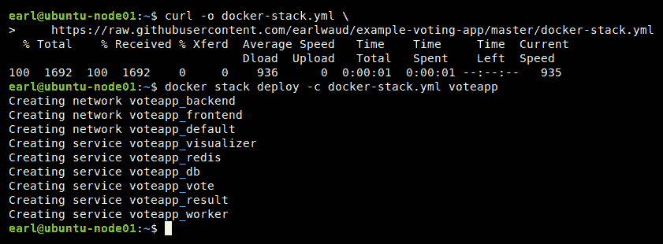
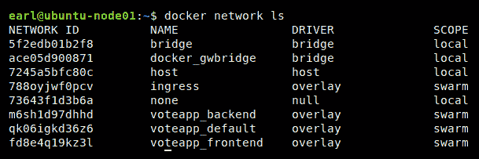
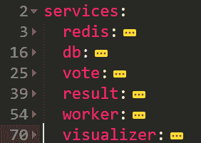
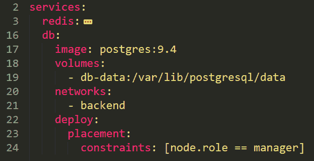
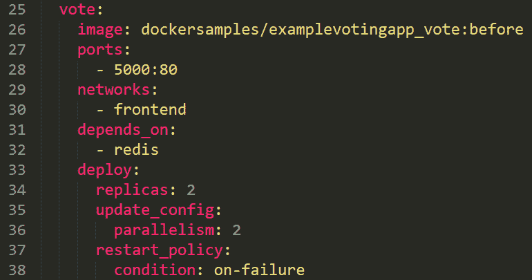
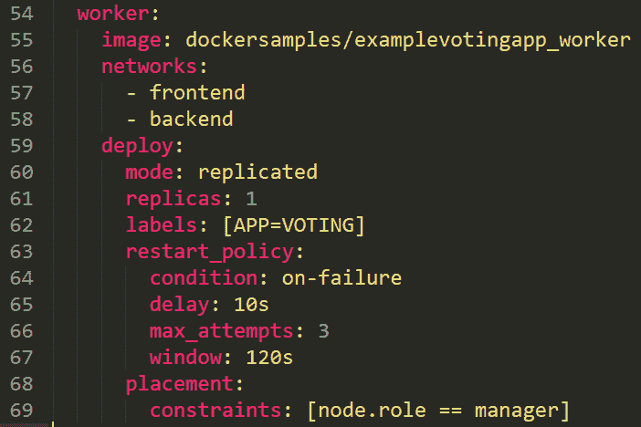
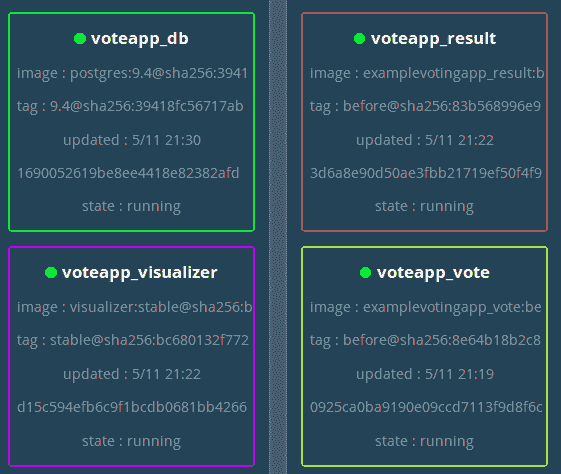
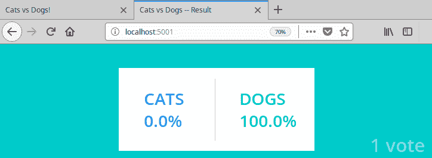
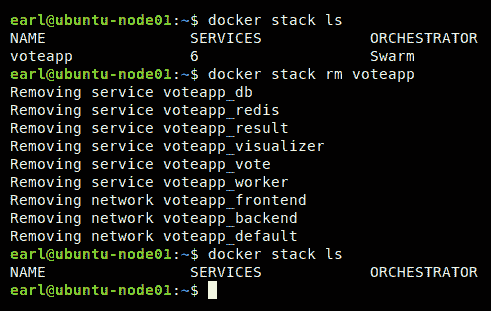

# 七、Docker栈

在这一章中，我们将把我们在前六章中学到的知识集中起来，并使用它来定义、部署和管理多容器应用。我们将通过使用 Docker 堆栈来实现这一点。我们将学习如何使用 Docker 栈和定义多容器应用所需的 YAML 文件。我们将利用我们所了解的 Docker 服务、Docker 卷、Docker Swarm和 Docker 网络来创建功能齐全的基于多服务 Docker 的应用。

The largest cargo ship is 400 meters long and can carry between 15,000 and 18,000 shipping containers!

在本章中，我们将涵盖以下主题:

*   使用 Docker 堆栈
*   部署多服务 Docker 应用
*   创建和使用合成(堆栈)YAML 文件
*   扩展已部署的多服务 Docker 应用

# 技术要求

您将从 Docker 的公共报告中获取 Docker 映像，并从 Weave 安装网络驱动程序，因此需要基本的互联网访问来执行本章中的示例。另外，我们将使用 jq 软件包，所以如果您还没有安装它，请查看如何安装的说明；它们可以在[第二章](2.html)*学习Docker命令*的*容器检查命令*部分找到。

本章代码文件可在 GitHub:
[https://GitHub . com/PacktPublishing/Docker-Quick-Start-Guide/tree/master/chapter 07](https://github.com/PacktPublishing/Docker-Quick-Start-Guide/tree/master/Chapter07)

查看以下视频，查看正在运行的代码:
[http://bit.ly/2E2qc9U](http://bit.ly/2E2qc9U)

# 了解 Docker 堆栈的使用

到目前为止，我们主要关注的是从单个 Docker 映像运行 Docker 容器，简化 Docker 模型以想象一个世界，其中每个应用只需要一个服务，因此只需要一个 Docker 映像来运行。然而，正如你所知，这是一个非常不现实的模式。现实世界的应用由多个服务组成，这些服务是使用多个 Docker 映像部署的。要运行所有必要的容器，并将它们保持在所需的副本数量，处理计划内和计划外停机时间、扩展需求以及所有其他服务管理需求，是一项非常艰巨和复杂的任务。在最近的过去，这个场景是使用一个叫做 Docker Compose 的工具来处理的。Docker Compose(正如您在[第 1 章](1.html)、*中所学的，设置 Docker 开发环境*)是一个额外的工具，您可以安装在您的 Docker 环境中，我们这样做是为了完成我们工作站的环境。虽然 Docker Compose 的大部分功能类似于您在 Docker 堆栈中找到的功能，但我们将在本章中重点介绍 Docker 堆栈。我们这样做是因为 Docker Compose 是用来管理容器的，Docker 世界已经朝着商品单元是服务而不是容器的方向发展。Docker stacks 管理服务，因此我将 Docker stacks 视为 Docker Compose 的发展(这是一个名为 Fig 的项目的发展)。我们没有在[第 1 章](1.html)、*中安装 Docker 栈的原因是，stacks 已经作为标准 Docker 安装的一部分。*

好的，所以 Docker 栈是新的和改进的 Docker Compose，它包含在我们的安装中。我打赌你在想，太好了。但这意味着什么呢？Docker 栈的用例是什么？好问题！Docker stacks 是*利用我们在前面章节中了解到的所有功能的*方式，例如 Docker 命令、Docker 映像、Docker 服务、Docker 卷、Docker Swarm和 Docker 网络，将它们打包成一个易于使用、易于理解的声明性文档文件，该文件将代表我们实例化和维护一个复杂的多映像应用。

您的大部分工作(仍然是最容易的部分)将是创建将在 Docker 堆栈命令中使用的合成文件。当 Docker 创建、启动和管理您的多服务(多容器)应用所需的所有服务时，所有真正困难的工作都将由它来完成。所有这些都由您的一个命令来处理。就像 image 一样，容器和群堆栈是另一个 Docker 管理组。让我们看看堆栈管理命令:


那么，我们这里有什么？对于这个管理组所代表的所有权力，它有一组非常简单的命令。主命令是`deploy`命令。它是发电站！有了这个命令(和一个合成文件)，您就可以启动您的应用，提取任何不在您的环境本地的映像，运行这些映像，根据需要创建卷，根据需要创建网络，为每个映像部署定义数量的副本，将它们分布在整个群集中以实现高可用性和负载平衡，等等。这个命令有点像*指环王*中的一个戒指。除了部署应用之外，当您需要执行诸如扩展应用之类的操作时，您还将使用相同的命令来更新正在运行的应用。

管理组中的下一个命令是列表堆栈命令。顾名思义，ls 命令允许您获取当前部署到集群的所有堆栈的列表。当您需要关于群中运行的特定堆栈的更多详细信息时，您将使用`ps`命令列出特定堆栈的所有任务。当使用部署的堆栈结束时，您将使用强大的 rm 命令。最后，将管理命令四舍五入，我们得到了服务命令，它允许我们获得作为堆栈一部分的服务列表。堆叠拼图中还有一个更重要的部分，那就是`--orchestrator`选项。有了这个选项，我们可以指示 Docker 使用 Docker swarm 或 Kubernetes 进行堆栈编排。当然，要使用 Kubernetes，必须安装它，要使用 swarm-如果未指定选项，这是默认设置-必须启用 swarm 模式。

在本章的剩余部分，我们将使用一个示例应用深入探讨 Docker 堆栈。Docker 提供了几个这样的示例，但是我们要检查的是投票应用示例。我将为该应用提供一个 Docker repo 的链接，以及一个在 Docker 应用发生巨大变化或项目消失时指向我的空间中的项目分叉的链接。让我们看一下示例投票应用的堆栈文件。

# 参考

有关更多信息，请查看以下链接:

*   Docker组合概述:https://docs . docker . com/compose/overview/
*   Docker堆栈命令参考:[https://docs.docker.com/engine/reference/commandline/stack/](https://docs.docker.com/engine/reference/commandline/stack/)
*   Docker样本:https://github . com/dock samples
*   Docker 投票应用示例:[https://github.com/dockersamples/example-voting-app](https://github.com/dockersamples/example-voting-app)
*   我的投票应用叉:[https://github.com/EarlWaud/example-voting-app](https://github.com/EarlWaud/example-voting-app)

# 如何为 Stacks 创建和使用合成 YAML 文件

堆栈文件是一个 YAML 文件，基本上和 Docker Compose 文件是一样的。这两个都是 YAML 文件，定义了一个基于 Docker 的应用。从技术上讲，堆栈文件是一个需要特定版本(或更高版本)的编写规范的编写文件。Docker 栈只支持 3.0 版及以上的规范。如果您有一个使用 Docker 编写 YAML 文件的现有项目，并且这些文件使用版本 2 或更旧的规范，那么您将需要将 YAML 文件更新到版本 3 规范，以便能够与 Docker 堆栈一起使用它们。值得注意的是，同一个 YAML 文件可以用于 Docker 栈或 Docker compose(前提是它是使用版本 3 或更高的规范编写的)。但是，有些指令会被一个或另一个工具忽略。例如，构建指令被 Docker 堆栈忽略。这是因为堆栈和合成之间最重要的区别之一是，所有使用的 Docker 映像都必须预先创建，以便与堆栈一起使用，而 Docker 映像可以作为建立基于合成的应用的过程的一部分来创建。另一个显著的区别是堆栈文件能够将 Docker 服务定义为应用的一部分。

现在是克隆投票应用项目和可视化映像的好时机:

```
# Clone the sample voting application and the visualizer repos
git clone https://github.com/EarlWaud/example-voting-app.git
git clone https://github.com/EarlWaud/docker-swarm-visualizer.git
```

严格来说，你不需要克隆这两个转帖，因为你真正需要的是来自投票应用的堆栈合成文件。这是因为所有的映像都已经创建完毕，并且可以从 hub.docker.com 公开获取，当您部署堆栈时，这些映像将作为部署的一部分为您提取。因此，下面是获取堆栈 YAML 文件的命令:

```
# Use curl to get the stack YAML file
curl -o docker-stack.yml\
 https://raw.githubusercontent.com/earlwaud/example-voting-app/master/docker-stack.yml
```

当然，如果您想以任何方式自定义应用，让项目本地允许您构建自己版本的 Docker 映像，然后使用您的自定义映像部署应用的自定义版本。

一旦您的系统上有了项目(或者至少是`docker-stack.yml`文件)，您就可以开始使用 Docker 堆栈命令了。现在，让我们开始使用`docker-stack.yml`文件来部署我们的应用。您需要设置您的 Docker 节点，并启用集群模式才能运行，因此如果您还没有这样做，请按照[第 5 章](5.html)、 *Docker Swarm* 中的描述设置您的集群。然后，使用以下命令部署示例投票应用:

```
# Deploy the example voting application 
# using the downloaded stack YAML file
docker stack deploy -c docker-stack.yml voteapp
```

这可能是这样的:



让我快速解释一下这个命令:我们使用`deploy`命令和`docker-stack.yml`组成文件，并命名我们的堆栈`voteapp`。该命令将处理新应用的所有配置、部署和管理。按照`docker-stack.yml`文件中的定义，启动和运行一切需要一些时间，所以当这种情况发生时，让我们开始进入堆栈合成文件。

现在，你知道我们正在使用`docker-stack.yml`文件。因此，当我们解释堆栈组成文件的各个部分时，您可以在您最喜欢的编辑器中调出该文件，然后继续。开始了。

我们首先要看的是顶级键。在这种情况下，它们如下:

*   版本
*   服务
*   网络
*   卷

如前所述，版本必须至少为 3 才能与 Docker 堆栈一起工作。查看`docker-stack.yml`文件中的第 1 行(版本密钥始终在第 1 行)，我们会看到以下内容:


完美！我们有一个 3 版规范的合成文件。跳过(折叠的)服务密钥部分一分钟，让我们先看看网络密钥，然后再看看卷密钥。在网络关键部分，我们指示 Docker 创建两个网络，一个名为前端，一个名为后端。实际上，在我们的例子中，网络将具有名称`voteapp_frontend`和`voteapp_backend`。这是因为我们将我们的栈命名为`voteapp`，Docker 会将栈名添加到它作为栈的一部分部署的各种组件中。只需在堆栈文件的网络密钥中包含所需网络的名称，Docker 就会在我们部署堆栈时创建我们的网络。我们可以提供每个网络的具体细节(正如我们在[第 6 章](6.html)、 *Docker Networking* 中了解到的)，但是如果我们不提供任何细节，那么将使用某些默认值。对于我们的堆栈来说，部署网络可能已经足够长了，所以让我们使用 network list 命令来看看我们现在有哪些网络:



它们是:`voteapp_frontend`和`voteapp_backend`。你可能想知道什么是`voteapp_default`网络。当您部署一个堆栈时，您总是会得到一个默认的群网络，如果在堆栈组成文件中没有为它们定义任何其他网络连接，那么所有容器都被附加到它上面。这很酷，对吧？！您不需要执行任何 docker 网络创建命令，就可以创建您想要的网络，并在应用中使用。

卷密钥部分与网络密钥部分的作用基本相同，只是它是针对卷的。部署堆栈时，会自动创建您定义的卷。如果堆栈文件中没有提供其他配置，则使用默认设置创建卷。在我们的例子中，我们要求 Docker 创建一个名为`db-data`的卷。正如您可能已经猜到的，创建的卷实际上有`voteapp_db-data`的名称，因为 Docker 在卷名前面加上了我们堆栈的名称。在我们的例子中，它看起来像这样:


因此，部署我们的堆栈创建了我们想要的网络和我们想要的卷。所有这些都包含在我们的堆栈组成文件中易于创建、易于阅读和理解的内容。好了，现在我们已经很好地掌握了堆栈合成文件中四个顶级关键部分中的三个。现在，让我们回到服务关键部分。如果我们展开这个关键部分，我们将看到我们希望作为应用的一部分部署的每个服务的定义。在`docker-stack.yml`文件的情况下，我们定义了六个服务。这些是 redis、db、投票、结果、工作者和可视化工具。在堆栈合成文件中，它们如下所示:



让我们扩展第一个，redis，并仔细看看什么是我们应用的 redis 服务:


如果你回想一下[第 5 章](5.html)、 *Docker Swarm* 中对 Docker 服务的讨论，这里显示的许多键应该对你来说很熟悉。现在让我们检查 redis 服务中的密钥。首先，我们有`image`键。服务定义需要映像密钥。这个键是告诉 docker 这个服务要拉取运行的 Docker 镜像是`redis:alpine`。正如你现在应该明白的，这意味着我们正在使用来自 hub.docker.com 的官方 redis 映像，请求标记为`alpine`的版本。下一个关键点`ports`是定义映像将从容器和主机暴露到哪个端口。在这种情况下，主机上要映射到容器的公开端口(`6379`)的端口留给 Docker 分配。您可以使用`docker container ls`命令找到分配的端口。在我的例子中，redis 服务正在将主机上的端口`30000`映射到容器上的端口`6379`。接下来使用的按键是`networks`。我们已经看到，部署堆栈将为我们创建网络。该指令告诉 Docker redis 副本容器应该连接到哪些网络；在这种情况下是`frontend`网络。如果我们检查 redis 副本容器，检查网络部分，我们会发现这是准确的。您可以使用如下命令查看您的部署(注意，容器名称在您的系统上略有不同):

```
# Inspect a redis replica container looking at the networks
docker container inspect voteapp_redis.1.nwy14um7ik0t7ul0j5t3aztu5  \
 --format '{{json .NetworkSettings.Networks}}' | jq
```

在我们的示例中，您应该看到容器连接到两个网络:入口网络和我们的`voteapp_frontend`网络。

我们的 redis 服务定义中的下一个键是 deploy 键。这是添加到版本 3 的编写文件规范中的一个关键类别。它定义了基于该服务中的映像运行容器的细节:在本例中，是 redis 映像。它本质上是编排指令。`replicas`标记告诉 docker 当应用完全部署时，应该运行多少个副本或容器。在我们的例子中，我们声明我们只需要为我们的应用运行一个 redis 容器实例。`update_config`键提供了`parallelism`和`delay`两个子键，告诉Docker应该并行启动多少个容器`replicas`，以及启动每套`parallel`容器`replicas`之间需要等待多长时间。当然，有了一个副本，并行性和延迟细节就没什么用了。如果`replicas`的值更大，例如`10`，我们的 update_config 键将导致一次启动两个副本，两次启动之间有 10 秒的等待时间。最终的部署密钥是`restart_policy`，它定义了在部署的堆栈中创建新副本的条件。在这种情况下，如果一个 redis 容器出现故障，将会启动一个新的 redis 容器来代替它。让我们看看我们应用中的下一个服务，`db`服务:



db 服务将有几个与 redis 服务相同的键，但是具有不同的值。首先，我们有映像键。这一次，我们表示我们想要带有 9.4 版本标签的官方 postgres 映像。我们的下一个键是卷键。我们表示我们正在使用名为 db-data 的卷，并且在 db 容器中，该卷应该安装在`/var/lib/postgresql/data`处。让我们看看我们环境中的卷信息:


使用 volume inspect 命令，我们获得卷装载点，然后将容器中文件夹的内容与主机上装载点的内容进行比较:


瞧啊。不出所料，他们匹配。这在苹果电脑上并不简单。请参阅 Docker 卷上的[第 4 章](4.html)、 *Docker Volumes、*了解如何在 OS X 上处理此问题的详细信息。下一个关键点是网络关键点，这里我们将指导 Docker 将后端网络连接到我们的数据库容器。接下来是部署密钥。在这里，我们看到了一个新的子键，叫做`placement`。这是一个指令，告诉 Docker 我们只希望 db 容器在管理器节点上运行，即在具有`manager`角色的节点上运行。

您可能已经注意到，部署键的一些子键存在于 redis 服务中，但在我们的 db 服务中却没有，最值得注意的是`replicas`键。默认情况下，如果不指定要维护的副本数量，Docker 将默认拥有一个副本。总之，数据库服务配置的描述与 redis 服务非常相似。您将看到所有服务配置之间的这种相似性。这是因为 Docker 使得定义我们服务的期望状态变得非常容易，并且通过关联，定义我们的应用。为了验证这一点，让我们来看看堆栈合成文件中的下一个服务，`vote`服务:



你应该开始熟悉这些键及其值了。在投票服务中，我们看到定义的映像不是官方容器映像之一，而是在名为`dockersamples`的公共回购中。在该报告中，我们使用了名为`examplevotingapp_vote`的映像，带有`before`的版本标签。我们的端口密钥告诉 Docker 和我们，我们希望在群集主机上打开端口`5000`，并将该端口上的流量映射到正在运行的投票服务容器中的端口 80。事实证明，投票服务是我们应用的`face`，我们将通过端口`5000`访问它。因为它是一项服务，所以我们可以通过访问群中任何一台主机上的端口*来访问它，即使特定的主机没有运行其中一个副本。*

查看下一个键，我们看到我们正在将`frontend`网络附加到我们的投票服务容器。然而，这并不是什么新鲜事，因为我们的下一把钥匙是一把我们从未见过的钥匙:`depends_on`钥匙。这个键告诉 Docker，我们的投票服务需要 redis 服务才能运行。这对我们的`deploy`命令意味着，在启动该服务之前，需要启动依赖的一个或多个服务。具体来说，redis 服务需要在投票服务之前启动。这里的一个关键区别是我说的开始。这并不意味着依赖的服务必须在启动该服务之前运行；依赖的服务必须在它之前启动。同样，具体来说，redis 服务不必在启动投票服务之前处于运行状态，它只需在启动投票服务之前启动。在投票服务的部署密钥中，我们还没有看到任何内容，唯一的区别是我们要求为投票服务提供两个副本。您是否开始理解堆栈组成文件中服务定义的简单性和强大功能了？

在我们的堆栈组成文件中定义的下一个服务是结果服务。然而，由于服务定义中没有我们在前面的服务中没有看到的键，我将跳过对结果服务的讨论，转到 worker 服务，在这里我们将看到一些新的东西。以下是工人服务定义:



你知道映像键及其含义。你知道网络密钥及其含义。您知道部署密钥，但是我们这里有一些新的子密钥，所以让我们从`mode`密钥开始讨论它们。您可能还记得我们在[第 5 章](5.html)、 *Docker Swarm* 中对服务的讨论，有一个`--mode `参数可以有两个值之一:`global`或`replicated`。这个键和我们在[第五章](5.html)*Docker Swarm*看到的参数完全一样。默认值是复制的，因此如果不指定模式键，您将获得复制行为，即精确定义复制副本的数量(如果未指定复制副本的数量，则为一个复制副本)。使用全局的其他值选项将忽略副本密钥，并为群中的每台主机部署一个容器。

在这个堆栈合成文件中，我们之前没有看到的下一个键是`labels`键。这个键的位置很重要，因为它可以作为自己的上层键出现，或者作为部署键的子键出现。区别是什么？当您使用`labels`键作为部署键的子键时，标签将仅在服务上设置。当您使用`labels`键作为其自己的上层键时，标签将被添加到作为服务的一部分部署的每个副本或容器中。在我们的示例中，`APP=VOTING `标签将应用于服务，因为`labels`键是部署键的子键。同样，让我们在我们的环境中看到这一点:

```
# Inspect the worker service to see its labels
docker service inspect voteapp_worker \
 --format '{{json .Spec.Labels}}' | jq
```

以下是我的系统上的情况:


在工作容器上执行 inspect 命令查看其上的标签将显示`APP=VOTING`标签没有出现。如果您想在系统上确认这一点，命令将如下所示(使用不同的容器名称):

```
# Inspect the labels on a worker container
docker container inspect voteapp_worker.1.rotx91qw12d6x8643z6iqhuoj \
 -f '{{json .Config.Labels}}' | jq
```

同样，这是它在我的系统上的样子:


restart_policy 键的两个新的子键是`max_attempts`和`window`键。你大概能猜到他们的目的；`max_attempts`键告诉 Docker，如果工人容器启动失败，继续尝试启动，最多三次，然后放弃。`window`键告诉 Docker，如果工作容器之前未能启动，在重试启动工作容器之前需要等待多长时间。很简单，对吧？同样，这些定义易于设置，易于理解，并且对于编排我们应用的服务极其强大。

好吧。我们还有一个新的服务定义需要审查，那就是可视化服务。这是我们的堆栈合成文件中的样子:


唯一真正新的钥匙是`stop_grace_period`钥匙。这个键告诉 Docker 在它告诉容器停止后要等待多长时间，它才会强制停止容器。如果不使用`stop_grace_period`键，默认时间段为 10 秒。当您需要更新堆栈，本质上是重新堆栈时，服务的容器将被告知优雅地关闭。Docker 将等待`stop_grace_period`键中指定的时间，如果没有提供该键，则等待 10 秒。如果容器在此期间关闭，容器将被移除，新的容器将在其位置启动。如果容器在这段时间内没有关闭，它将被强制停止，杀死它，然后移除它，然后启动一个新的容器来代替它。这个键的意义在于，它允许运行需要更长时间才能正常停止的进程的容器有必要的时间来真正正常停止。

我想指出的这项服务的最后一个方面是关于列出的那种奇怪的卷。这不是典型的卷，卷密钥定义中没有条目。`/var/run/docker.sock:/var/run/docker.sock`卷是访问主机的 Docker 守护程序正在监听的 Unix 套接字的一种方式。在这种情况下，它允许容器与其主机通信。可视化工具容器正在收集关于哪些容器在哪些主机上运行的信息，并且能够以图形方式呈现这些数据。您会注意到，它将 8080 主机端口映射到 8080 容器端口，因此我们可以通过浏览到我们的任何群集节点上的 8080 端口来查看它共享了什么数据。以下是我的(当前)三节点群的外观:



# 其余的堆栈命令

现在，让我们通过我们部署`voteapp`堆栈的群体镜头来快速查看我们的其他堆栈相关命令。首先，我们有列表栈命令:`docker stack ls`。试一试看起来是这样的:

```
# List the stacks deployed in a swarm
docker stack ls
```

以下是示例环境中的情况:


这表明我们目前部署了一个名为 voteapp 的堆栈，它由六个服务组成，并使用 swarm 模式进行编排。知道部署堆栈的名称允许我们使用其他堆栈命令收集更多关于它的信息。接下来是列表堆栈任务命令。让我们在示例环境中尝试一下这个命令:

```
# List the tasks for our voteapp stack filtered by desried state
docker stack ps voteapp --filter desired-state=running
```

这是我现在所处环境的结果；你的应该看起来很相似:


现在，我们来看看 stack services 命令。这个命令将为我们提供作为堆栈应用一部分部署的服务的概要。该命令如下所示:

```
# Look at the services associated with a deployed stack
docker stack services voteapp
```

这是我们在示例环境中看到的:


这个命令提供了一些非常有用的信息。我们可以快速查看我们服务的名称、所需的副本数量以及每个服务的实际副本数量。我们可以看到用于部署每个服务的映像，还可以看到用于每个服务的端口映射。在这里，我们可以看到可视化工具服务正在使用端口`8080`，正如我们前面提到的。我们还可以看到我们的投票服务暴露在我们的群主机的端口`5000`上。现在，让我们通过浏览到端口`5000`(在群中的任何节点上)来看看我们在 voteapp 中呈现的内容:


你是养狗的人还是养猫的人？你可以用自己的投票来表达自己！投票，然后使用 stack service 命令中的数据，通过浏览端口`5001`查看投票结果:



是的，我是一个爱狗的人。最后还有一个堆栈命令:remove 命令。通过发出`rm`命令，我们可以快速轻松地取下使用堆栈部署命令部署的应用。这是它的样子:

```
# Remove a deploy stack using the rm command
docker stack rm voteapp
```

现在你看到了，现在你没有:



你应该注意到没有你确定吗？手持，所以在按下*进入*这个命令之前一定要非常确定和小心。让我们以快速查看扩展或重新堆叠作为 Docker 堆栈部署的应用的最佳实践来结束关于 Docker 堆栈的讨论。

# 扩展堆栈应用的最佳实践

和 Docker 的大多数东西一样，有几种不同的方法来实现应用的期望状态。当您使用 Docker 堆栈时，您应该始终使用与部署应用相同的方法来更新应用。在堆栈组成文件中进行任何所需的状态更改，然后运行与部署堆栈完全相同的命令。这允许您使用标准源代码控制功能来正确处理您的合成文件，例如跟踪和检查更改。而且，它允许 Docker 为编排您的应用做正确的事情。如果需要在应用中向上或向下扩展服务，应该更新堆栈合成文件中的副本密钥，然后再次运行 deploy 命令。在我们的示例中，我们的投票服务有两个副本。如果投票需求激增，我们可以通过编辑`docker-stack.yml`文件，将副本值从 2 更改为 16，然后发出最初用于部署应用的相同命令，从而轻松扩展我们的应用:

```
# After updating the docker-stack.yml file, scale the app using the same deploy command
docker stack deploy -c docker-stack.yml voteapp
```

现在，当我们检查服务时，我们可以看到我们正在扩展我们的应用:


这就是它，一个易于使用、易于理解、非常非常强大的 Docker 应用编排！

# 参考

有关更多信息，请查看以下链接:

*   撰写文件参考:[https://docs.docker.com/compose/compose-file/](https://docs.docker.com/compose/compose-file/)
*   一些编写文件的例子:[https://github.com/play-with-docker/stacks](https://github.com/play-with-docker/stacks)
*   Docker上的Docker示例映像:https://hub . docker . com/u/dock samples/

*   在Docker上发现的官方 redis 映像标记:https://hub . docker . com/r/library/redis/tags/
*   一篇关于使用 Docker 守护程序套接字的精彩文章:[https://medium . com/lucjuggery/about-var-run-Docker-sock-3 bfd 276 e 12 FD](https://medium.com/lucjuggery/about-var-run-docker-sock-3bfd276e12fd)
*   堆栈部署命令引用:[https://docs . docker . com/engine/reference/command line/stack _ deploy/](https://docs.docker.com/engine/reference/commandline/stack_deploy/)
*   栈 ps 命令引用:[https://docs . docker . com/engine/reference/command line/stack _ PS/](https://docs.docker.com/engine/reference/commandline/stack_ps/)
*   栈服务命令引用:[https://docs . docker . com/engine/reference/command line/stack _ services/](https://docs.docker.com/engine/reference/commandline/stack_services/)

# 摘要

现在你知道了很多关于 Docker stacks 的知识。您可以使用合成文件轻松创建应用定义，然后使用 stack deploy 命令部署这些应用。您可以使用 ls、ps 和 services 命令探索已部署堆栈的细节。您可以通过对撰写文件进行简单的修改并执行与部署应用相同的命令来扩展应用。最后，您可以使用 stack rm 命令删除一个已经到达生命周期终点的应用。权力越大，责任越大，所以要非常小心删除命令。您现在有足够的信息来创建和编排世界一流的企业级应用，所以快去忙吧！然而，如果你想学习如何与Jenkins一起使用 Docker，你会很高兴知道这是[第 8 章](8.html)、 *Docker 和 Jenkins* 的主题，所以请翻页开始阅读！