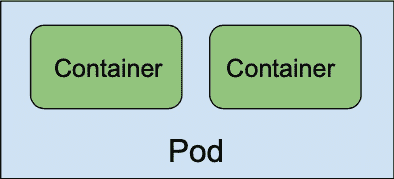

# *第 4 章*:创建和部署应用

在前面的章节中，我们已经了解了 Kubernetes 节点。最后，让我们使用 Kubernetes 部署来部署应用，扩展应用，并为其创建一个服务。

Kubernetes 部署是从 Docker 映像部署应用的一种方式，我们将把它用于我们的示例应用。

Kubernetes 支持一些容器运行时，所有这些都可以运行 Docker 映像:

*   Docker
*   把他养大
*   包含在内

在本章中，我们将涵盖以下主题:

*   豆荚介绍
*   创建部署
*   创建服务
*   扩展应用

# 豆荚介绍

pod 是具有共享卷的并置的组应用容器。

pod 中的应用都使用相同的网络名称空间、IP 地址和端口空间。他们可以使用 localhost 查找并相互通信。每个 pod 在平面共享网络命名空间中都有一个 IP 地址，可以与网络中的其他物理计算机和容器进行完全通信。

Pod 是最小的可部署单元，可以用 Kubernetes 来创建、调度和管理。豆荚也可以单独创建。由于豆荚没有可管理的生命周期，如果它们死亡，就不会被重新创造。因此，建议您使用部署，即使您正在创建单个 pod。

Pods 也用于 DaemonSets、StatefulSets、Jobs 和 CronJobs:



图 4.1–带有两个容器的Pod 

上图显示了一个带有两个容器的Pod 。pod 中的容器共享相同的 Linux 网络命名空间以及以下内容:

*   国际电脑互联网地址
*   本地主机
*   **IPC** ( **进程间通信**)

让我们继续讨论部署，它更适合现实世界的应用部署。

# 创建部署

Kubernetes 部署为副本集提供了更新，这确保了指定数量的 pod(副本)一直在运行:


图 4.2–三个Pod 的部署

上图显示了具有三个Pod 的部署；复制器组将试图保持三个Pod 一直运行。当然，如果 Kubernetes 集群中没有可用资源，运行的 pod 副本可能与所需的副本数量不匹配。

有几种方法可以创建 Kubernetes 部署，让我们来探索一下。最简单的方法就是使用`$ kubectl create deployment`。

让我们创建一个`nginx`部署:

```
$ kubectl create deployment
deployment.apps/nginx created
```

让我们检查创建的`nginx`部署:

```
$ kubectl get deployment
NAME    READY   UP-TO-DATE   AVAILABLE   AGE
nginx   1/1     1            1           19d
```

让我们检查创建的`nginx`Pod :

```
$ kubectl get pods
NAME                    READY   STATUS    RESTARTS   AGE
nginx-86c57db685-c9s49  1/1     Running   0          10d
```

前面的命令用一个`nginx-86c57db685-c9s49`Pod 创建了一个`nginx`部署。

看起来太容易了，对吧？一个命令和轰:你的部署正在运行。

重要说明

`kubectl create deployment`命令仅推荐用于测试图像，因为在那里您没有指定部署模板，并且您无法控制可能要为部署设置的任何附加设置。

让我们使用`$ kubectl apply`命令从文件部署:

1.  We have a file called `deployment.yaml` with the following contents:

    ```
    $ cat deployment.yaml
    apiVersion: apps/v1
    kind: Deployment
    metadata:
     name: nginx
     labels:
     app: nginx
    spec:
     replicas: 1
     selector:
     matchLabels:
     app: nginx
     template:
     metadata:
     labels:
     app: nginx
     spec:
     containers:
     - image: nginx:1.18.0
     imagePullPolicy: IfNotPresent
     name: nginx
    ```

    当将前面的文件与`kubectl`一起使用时，它将部署与我们使用`$ kubectl create deployment`命令所做的相同的`nginx`部署，但是在这种情况下，稍后，我们可以根据我们的需要更新文件并升级部署。

2.  让我们删除之前安装的部署:

    ```
    $ kubectl delete deployment nginx
    deployment.apps "nginx" deleted
    ```

3.  Let's redeploy using the `deployment.yaml` file this time:

    ```
    $ kubectl apply –f deployment.yaml
    deployment.apps/nginx created
    $ kubectl get deployment
    NAME    READY   UP-TO-DATE   AVAILABLE   AGE
    nginx   1/1     1            1           17s
    $ kubectl get pods
    NAME                    READY   STATUS    RESTARTS   AGE
    nginx-7df9c6ff5-pnnr6   1/1     Running   0          25s
    ```

    从前面的命令中可以看到，我们已经安装了一个 pod(副本)部署，但是这次我们使用了文件中的模板。

下图显示了具有三个Pod 的部署；复制集将尝试保持三个 pod 始终运行。同样，如果 Kubernetes 集群中没有可用资源，则运行的 pod 复制可能与所需的复制计数不匹配:


图 4.3-互连节点

让我们看看如何创建服务。

# 创建服务

Kubernetes 服务为一组豆荚提供单一稳定的名称和地址。它们充当基本的集群内负载平衡器。

大多数Pod 被设计成长时间运行的，但是当一个单独的进程死亡时，Pod 也随之死亡。如果它死亡，部署会用新的 pod 替换它。每个 pod 都有自己的专用 IP 地址，这允许容器拥有相同的端口(使用 NodePort 时除外)，即使它们共享相同的主机。但是当部署启动一个容器时，该容器会获得一个新的 IP 地址。

这才是服务真正有帮助的地方。服务被附加到部署。每个服务都被分配了一个虚拟 IP 地址，该地址在服务终止之前保持不变。只要我们知道服务的 IP 地址，服务本身就会跟踪部署创建的 pods，并将请求分发到部署 pods。

通过设置服务，我们得到了一个内部的 Kubernetes DNS 名称。此外，当您有多个复制集时，该服务充当群集中的负载平衡器。有了服务，当服务类型设置为负载平衡器时，您还可以将您的应用暴露给互联网:


图 4.4-互连节点

上图解释了服务是如何工作的。

随着应用的启动和运行，让我们为它创建一个 Kubernetes 服务:

1.  Let's start by running the following command:

    ```
    $ kubectl expose deployment nginx --port=80 --target-port=80
    service/nginx exposed
    ```

    我们使用了端口`80`，在该端口上，`nginx`服务暴露给了其他 Kubernetes 应用；`target-port=80`是我们的`nginx`容器港口。我们使用`port=80`容器是因为我们在 [*第 3 章*](03.html#_idTextAnchor039)*中部署的官方`nginx` Docker 映像([https://hub.docker.com/_/nginx](https://hub.docker.com/_/nginx))使用端口`80`。*

2.  Let's check the created `nginx` service:

    ```
    $ kubectl get service
    NAME         TYPE        CLUSTER-IP    EXTERNAL-IP   PORT(S)
    kubernetes   ClusterIP   10.16.0.1     <none>        443/TCP
    nginx        ClusterIP   10.16.12.233  <none>        80/TCP
    $ kubectl describe service nginx
    Name:              nginx
    Namespace:         default
    Labels:            app=nginx
    Annotations:       cloud.google.com/neg: {"ingress":true}
    Selector:          app=nginx
    Type:              ClusterIP
    IP:                10.16.12.233
    Port:              <unset>  80/TCP
    TargetPort:        80/TCP
    Endpoints:         10.8.0.133:80
    Session Affinity:  None
    Events:            <none>
    ```

    前面的`kubectl get service`命令显示服务列表，`kubectl describe service nginx`描述服务。

我们可以看到一些东西:

*   该服务获得了与我们公开的部署相同的名称`nginx`。
*   `Selector: app=nginx`与`nginx`部署中的`matchLabels`相同；这就是服务如何知道如何连接到正确的部署。
*   `Type: ClusterIP` is the default service type when no `–type` flag is provided.

    重要说明

    使用`kubectl expose`命令看起来是为应用设置服务的一种简单方法。但是，我们不能将该命令置于 Git 控制之下，也不能更改服务设置。出于测试的目的，这很好，但不适合运行真实世界的应用。

让我们使用`$ kubectl apply`命令从文件部署。

我们有一个名为`service.yaml`的文件，我们将使用它来更新服务:

```
$ cat service.yaml
apiVersion: v1
kind: Service
metadata:
  name: nginx
  labels:
    app: nginx
spec:
  type: ClusterIP
  ports:
  - port: 80
    protocol: TCP
    targetPort: 80
  selector:
    app: nginx
```

这次，让我们保留我们用`kubectl expose`创建的服务，看看我们是否可以将`service.yaml`文件中的更改应用到我们创建的服务中。

要部署服务，我们运行以下命令:

```
$ kubectl apply –f service.yaml
Warning: kubectl apply should be used on resource created by ether kubectl create –save-config or kubetl apply
service/nginx configured
```

我们得到了一个警告(因为首先我们使用了`kubectl expose`命令，然后我们试图从文件中更新服务)，但是我们的更改成功地应用到了服务中，从现在开始我们可以使用`service.yaml`对`nginx`服务进行更改。

小费

当您使用`kubectl expose`创建服务时，您可以使用`kubectl get service nginx -o yaml > service.yaml`命令将其模板导出到 YAML 文件中，并在将来可能需要进行的更改中重用该文件。

要导出`nginx`服务，运行以下命令:

```
$ kubectl get service nginx -o yaml
```

前面命令的输出如下图所示:


图 4.5–导出 nginx 服务

将其内容复制到一个文件中，在那里您应该删除以下部分，这些部分是由`kubectl`和生成的，在那里不需要:

*   `annotations`
*   `creationTimestamp`
*   `resourceVersion:`
*   `selfLink`
*   `uid`
*   `Status`

    重要说明

    您也可以使用`kubectl get deployment nginx -o yaml > deployment.yaml`命令将部署模板导出到 YAML 文件。

# 扩展应用

在前面的部分，我们部署了一个带有一个副本的应用；让我们将其部署扩展到两个副本。

运行多个副本的用例是为应用实现高可用性。要扩展我们的部署，请运行以下命令:

```
$ kubectl scale deployment nginx –replicas=2
deployment.apps/nginx scaled
$ kubectl get deployment nginx
NAME    READY   UP-TO-DATE   AVAILABLE   AGE
nginx   2/2     2            2           5d17h
$ kubectl get pods
NAME                    READY   STATUS    RESTARTS   AGE
nginx-7df9c6ff5-chnrk   1/1     Running   0          29s
nginx-7df9c6ff5-s65dq   1/1     Running   0          5d17h
```

从前面的输出中，我们可以看到`$ kubectl get deployment nginx`命令显示`nginx`部署有两个副本。有了`$ kubectl get pods`，我们看到了两个豆荚；其中一个还不到一分钟。

这是一个扩展部署的简洁命令，对于测试来说很方便。让我们尝试使用`deployment.yaml`文件来扩展部署。

这一次，让我们扩展到三个副本，但是使用`deployment.yaml`文件:

1.  用三个副本更新【T0:

    ```
    ...
    spec:
      replicas: 3
    ...
    ```

2.  运行与之前相同的命令:

    ```
    $ kubectl apply –f deployment.yaml
    deployment.apps/nginx configured
    $ kubectl get deployment nginx
    NAME    READY   UP-TO-DATE   AVAILABLE   AGE
    nginx   3/3     3            3           5d17h
    $ kubectl get pods
    NAME                    READY   STATUS    RESTARTS   AGE
    nginx-7df9c6ff5-chnrk   1/1     Running   0          21m
    nginx-7df9c6ff5-s65dq   1/1     Running   0          5d17h
    nginx-7df9c6ff5-tk7g4   1/1     Running   0          22s
    ```

不错:我们已经用`deployment.yaml`文件中的三个副本更新了`nginx`部署。

该服务将以循环方式在三个Pod 之间分发所有传入的请求。

# 总结

在本章中，我们学习了如何使用`kubectl`创建、部署和扩展应用。我们在本章中学到的新技能现在可以用于部署真实世界的应用。

在下一章中，我们将学习如何对已部署的应用进行更高级的更新。