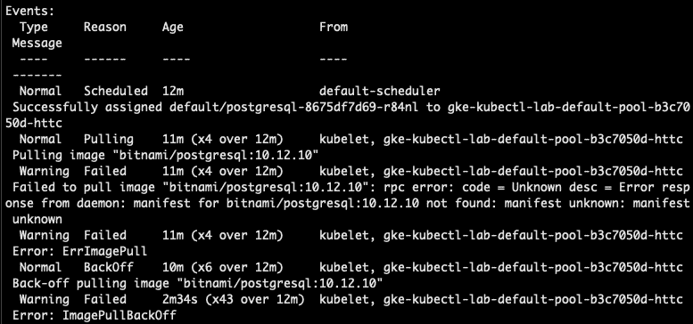
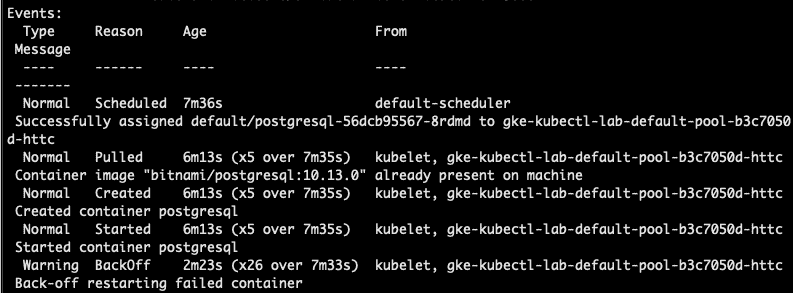
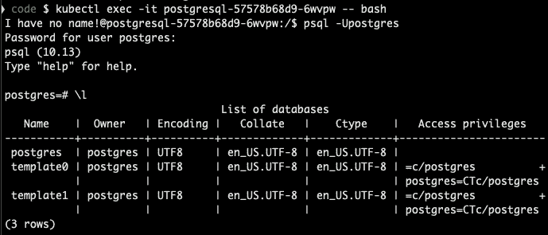

# 六、调试应用

有时您需要调试应用来解决与生产相关的问题。到目前为止，在本书中，我们已经学习了如何安装、更新和删除应用。

在本章中，我们将通过使用`kubectl describe`在 pod 中显示实际事件之前解析的对象配置和期望的状态来介绍应用调试。然后我们将检查 pod 日志中的错误，最后，在容器中执行(在容器中执行意味着在运行的容器中获得 shell 访问)并在那里运行命令。

在本章中，我们将涵盖以下主要主题:

*   描述一个PODS
*   检查Pod 日志
*   在运行的容器中执行命令

# 描述一个PODS

在前一章中，我们删除了一个正在运行的应用。对于这一章，那么，让我们安装另一个。为了调试应用，我们将使用来自 Docker Hub([https://hub.docker.com/r/bitnami/postgresql](https://hub.docker.com/r/bitnami/postgresql))的`bitnami/postgresql` Docker 映像，并且我们将使用`deployment-postgresql.yaml`文件安装应用:

```
$ cat deployment-postgresql.yaml
apiVersion: apps/v1
kind: Deployment
metadata:
  name: postgresql
  labels:
    app: postgresql
spec:
  replicas: 1
  selector:
    matchLabels:
      app: postgresql
  template:
    metadata:
      labels:
        app: postgresql
    spec:
      containers:
      - image: bitnami/postgresql:10.12.10
        imagePullPolicy: IfNotPresent
        name: postgresql
```

要安装Postgresql 部署，请运行以下命令:

```
$ kubectl apply –f deployment-postgresql.yaml
Deployment.apps/postgresql created
$ kubectl get pods
NAME                        READY   STATUS        RESTARTS   AGE
postgresql-867df7d69-r84nl  0/1     ErrImagePull  0          9s
```

哎呀，那里发生了什么？通过运行`$ kubectl get pods`命令，我们看到了一个`ErrImagePull`错误。让我们调查一下。在*第 1 章*、*介绍和安装 kubectl* 中，我们了解了`kubectl describe`命令；让我们用它来检查Pod 状态。要描述 PostgreSQL 窗格，请运行以下命令:

```
$ kubectl describe pod postgresql-8675df7d69-r84nl
```

运行前面的命令后，我们得到`Events`的如下输出:



图 6.1–描述命令的输出

在前面的截图中，由于`kubectl pod describe`的输出相当大，我们只显示了`Events`部分，需要检查才能排除问题。

就在这里，我们看到了为什么它不能拉出映像:

```
Failed to pull image "bitnami/postgresql:10.12.10": rpc error: code = Unknown desc = Error response from daemon: manifest for bitnami/postgresql:10.12.10 not found: manifest unknown: manifest unknown
```

查看之前的错误，我们可以看到我们为`postgresql` Docker 映像引用了错误的标签。让我们在`deployment-postgresql.yaml`文件中将其更改为`10.13.0`，然后再次运行`kubectl apply`。要更新`postgresql`部署，运行以下命令:

```
$ kubectl apply –f deployment-postgresql.yaml
Deployment.apps/postgresql configured
$ kubectl get pods
NAME                         READY   STATUS            RESTARTS   AGE
postgresql-56dcb95567-8rdmd  0/1     CrashLoopBackOff  0          36s
postgresql-8675df7d69-r84nl  0/1     ImagePullBackOff  0          35m
```

我们看到一个新的Pod `postgresql-56dcb95567-8rdmd`，它也正在崩溃。要检查此`postgresql`Pod ，运行以下命令:

```
$ kubectl describe pod postgresql-56dcb95567-8rdmd
```

运行前面的命令后，我们会得到以下输出:



图 6.2–检查带有固定 Docker 标签的 postgresql pod

嗯，这一次，`Events`没有列出太多关于为什么`postgresql`Pod 处于`CrashLoopBackOff`状态的信息，因为`bitnami/postgresql:10.13.0`映像被成功拉出。

在下一节中，让我们通过查看 pod 的日志来了解如何解决这个问题。

# 检查Pod 日志

当`kubectl describe pod`没有显示任何关于错误的信息时，我们可以使用另一个`kubectl`命令，即`logs`。`kubectl logs`命令允许我们打印容器日志，我们也可以实时查看。

小费

如果容器的前一个实例存在，您可以使用带有标志的`kubectl logs`来打印该实例的日志:

`$ kubectl logs -p some_pod`

现在，让我们在崩溃的`postgresql`Pod 上检查这个命令，并尝试找出它是怎么回事——为什么它会失败。要获取 pod 列表并检查 pod 日志，请运行以下命令:

```
$ kubectl get pods
$ kubectl logs postgresql-56dcb95567-njsp6
```

以下屏幕截图显示了上述命令的输出:


图 6.3–获取 postgresql pod 的错误日志

啊哈！您可以从前面的截图中看到，`postgresql` pod 出现故障，因为它需要将`POSTGRESQL_PASSWORD`环境变量设置为某个密码，或者将`ALLOW_EMPTY_PASSWORD`环境变量设置为`yes`，这将允许使用空白密码启动容器。

让我们用设置了一些密码的`POSTGRESQL_PASSWORD`环境变量来更新`deployment-postgresql.yaml`文件:

```
$ cat deployment-postgresql.yaml
apiVersion: apps/v1
kind: Deployment
metadata:
  name: postgresql
  labels:
    app: postgresql
spec:
  replicas: 1
  selector:
    matchLabels:
      app: postgresql
  template:
    metadata:
      labels:
        app: postgresql
    spec:
      containers:
      - image: bitnami/postgresql:10.13.0
        imagePullPolicy: IfNotPresent
        name: postgresql
        env:
        - name: POSTGRESQL_PASSWORD
          value: "VerySecurePassword:-)"
```

要更新`postgresql`部署，运行以下命令:

```
$ kubectl apply –f deployment-postgresql.yaml
Deployment.apps/postgresql configured
$ kubectl get pods
NAME                         READY   STATUS            RESTARTS   AGE
postgresql-56dcb95567-njsp6  0/1     CrashLoopBackOff  11         36m
postgresql-57578b68d9-b6lkv  0/1     ContainerCreating 0          1s
$ kubectl get pods
NAME                         READY   STATUS     RESTARTS   AGE
postgresql-57578b68d9-b6lkv  1/1     Running    0          21s
```

正如您在前面的代码块中看到的，更新了`postgresql`部署，成功创建了一个新的 pod，并且正在崩溃的 pod 已经终止。

重要说明

最佳实践不建议将密码直接存储在部署和其他 Kubernetes 模板中，而是将其存储在 Kubernetes Secrets 中。

现在让我们实时看看`postgresql`Pod 日志显示了什么。要实时检查 pod 日志，请运行以下命令:

```
$ kubectl logs postgresql-57578b68d9-b6lkv -f
```

前面命令的输出如下截图所示:


图 6.4–查看 postgresql 的日志

不错，PostgreSQL 部署已经启动并运行，准备接受连接。通过让该命令保持运行，当我们需要查看 PostgreSQL 容器中的情况时，我们可以实时查看日志。

# 在运行的容器中执行命令

因此，我们已经学习了如何使用`pod describe`和`logs`对 pods 进行故障排除，但是在某些情况下，您可能想要进行更高级的故障排除，例如检查一些配置文件或在容器中运行一些命令。这些事情可以使用`kubectl exec`命令来完成，这将允许`exec`进入容器，并在容器中进行交互会话，或者运行您的命令。

让我们看看如何使用`kubectl exec`命令获取`postgresql.conf`文件内容:

```
$ kubectl exec postgresql-57578b68d9-6wvpw cat \ /opt/bitnami/postgresql/conf/postgresql.conf
# -----------------------------
# PostgreSQL configuration file
# -----------------------------
#
# This file consists of lines of the form:
#
#   name = value
#
# (The "=" is optional.)  Whitespace may be used.  Comments are introduced with
# "#" anywhere on a line.  The complete list of parameter names and allowed
# values can be found in the PostgreSQL documentation.
…
```

前面的命令将显示`postgresql.conf`文件内容，因此您可以检查 PostgreSQL 设置，在这种情况下，这些设置是默认设置的。

接下来，让我们进入`postgresql`舱，打开一个外壳，然后运行`psql`命令来检查可用的数据库。

要执行进入`postgresql`舱，请运行以下命令:

```
$ kubectl exec –it postgresql-57578b68d9-6wvpw – bash
```

下面的屏幕截图显示了前面命令的输出:



图 6.5–在 postgresql 窗格中执行

正如你在前面的截图中看到的，我们使用`exec`进入`postgresql`Pod ，使用`bash`外壳，然后我们运行`psql –Upostgres`登录到`postgresql`实例，然后使用`\l`检查可用的数据库。这是一个如何使用交互式`exec`命令并在容器内部运行不同命令的好例子。

# 总结

在本章中，我们学习了如何描述 pod、检查日志和解决问题，还学习了如何为`postgresql` Docker 映像从头开始创建 Kubernetes 部署。

使用`kubectl describe`、`logs`和`exec`的故障排除技巧非常有用，可以让您知道应用窗格中正在发生什么。这些技术可以用来帮助您解决遇到的任何问题。

在下一章，我们将学习如何用插件扩展`kubectl`。