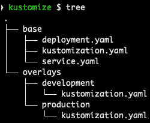
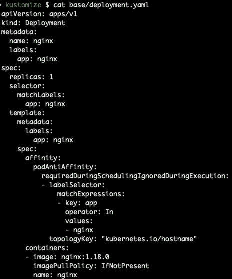
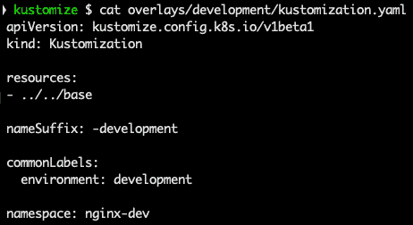
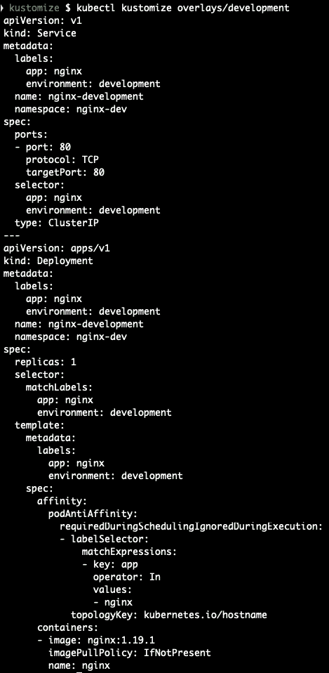
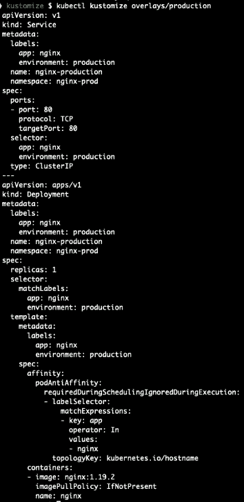

# 八、为 Kubernetes 用户介绍 Kustomize

在前一章中，我们学习了如何安装、使用和创建`kubectl`插件。

在本章中，让我们学习如何为 Kubernetes 使用 Kustomize。Kustomize 允许我们在不改变应用原始模板的情况下修补 Kubernetes 模板。我们将了解 Kustomize 以及如何在它的帮助下修补 Kubernetes 部署。

在本章中，我们将涵盖以下主要主题:

*   定制介绍
*   修补 Kubernetes 部署

# Kustomize 简介

Kustomize 使用 Kubernetes 清单的覆盖来添加、删除或更新配置选项，而无需分叉。Kustomize 所做的就是取一个 Kubernetes 模板，在`kustomization.yaml`中用指定的修改进行修补，然后部署到 Kubernetes。

这是一个方便的工具，用于修补不复杂的应用，例如，不同环境或资源名称空间需要的更改。

从 1.14 版本开始，Kustomize 可作为独立的二进制文件和本地命令在`kubectl`中使用。

让我们看几个 Kustomize 命令，使用以下命令:

*   要在终端上显示生成的修改模板，请使用以下命令:

    ```
    $ kubectl kustomize base 
    ```

*   要在 Kubernetes 上部署生成的修改模板:

    ```
    $ kubectl apply –k base
    ```

在前面的例子中，`base`是包含应用文件和`kustomization.yaml`的文件夹。

注意

由于没有`base`文件夹，上述命令将失败。这只是命令的一个例子。

# 修补一个永恒的应用

在本节中，让我们尝试用 Kustomize 修补应用。对于本例，我们有一个`kustomize`文件夹，其中包含以下文件:



图 8.1–Kustomize 示例

`base`文件夹有三个文件— `deployment.yaml`、`service.yaml`和`kustomization.yaml`。

让我们通过运行`$ cat base/deployment.yaml`命令来检查`deployment.yaml`文件:



图 8.2–部署文件

在前面的截图中，我们有`nginx`部署模板，我们将与 Kustomize 一起使用。

让我们通过运行`$ cat base/service.yaml`命令来获取`service.yaml`文件的内容:


图 8.3–service . YAML 文件

在前面的截图中，我们有了将要与 Kustomize 一起使用的`nginx`服务模板。

如您所见，我们正在再次使用`nginx`部署和服务模板，因此您将更容易理解 Kustomize 的工作。

让我们通过运行`$ cat base/kustomization.yaml`命令来获取`kustomization.yaml.yaml`文件的内容:


图 8.4–kustomization . YAML 文件

由于我们已经熟悉了`nginx`部署和服务，让我们来看看`kustomization.yaml`文件。

通过以下来自`kustomization.yaml`的代码，我们为`nginx`映像设置了一个新标签:

```
```
images:
- name: nginx
  newTag: 1.19.1
```
```

以下代码设置将设置应用到哪个`resources`。由于`service`没有映像，Kustomize 只适用于`deployment`，但是后面的步骤中我们需要`service`，所以我们还是设置了:

```
```
resources:
- deployment.yaml
- service.yaml
```
```

现在，让我们通过运行`$kubectl kustomize base`命令来检查 Kustomize 将如何更改部署:


图 8.5–kube CTL kustomize 基础输出

从前面的输出可以看到，Kustomize 生成了`service`和`deployment`内容。`service`的内容没有变化，但是我们来看看`deployment`。将原始文件`base/deployment.yaml`与前面的输出进行比较，我们看到`- image: nginx:1.18.0`被更改为`- image: nginx:1.19.1`，如`kustomization.yaml`文件中所指定的。

这是一个很好的简单的`image`标签更改，而不需要修改原始的`deployment.yaml`文件。

注意

这些技巧非常有用，尤其是在现实世界的应用部署中，不同的环境可能会使用不同的 Docker 映像标签。

## Kustomize 叠加

作为一名系统管理员，我希望能够使用专用的自定义配置来部署我的 web 服务的不同环境(开发和生产)，例如副本数量、分配的资源、安全规则或其他配置。我希望在不维护我的核心应用配置的重复的情况下做到这一点。

在本节中，让我们了解使用 Kustomize 部署到开发和生产环境，以及为每个环境使用不同的名称空间和 NGINX Docker 标记的更高级的定制。

在`overlays`文件夹中，我们有`development/kustomization.yaml`和`production/kustomization.yaml`文件；让我们检查一下。在下面的截图中，我们有`kustomization.yaml`文件，将应用到开发环境中。

让我们通过运行`$ cat overlays/development/kustomization.yaml`命令来获取`overlays/development/kustomization.yaml`文件的内容:



图 8.6–开发/kustomization.yaml 内容

在前面的截图中，我们有`kustomization.yaml`文件，将应用到开发环境中。

让我们通过运行`$ cat overlays/development/kustomization.yaml`命令来获取`overlays/production/kustomization.yaml`文件的内容:


图 8.7–生产/kustomization.yaml 内容

在前面的截图中，我们有`kustomization.yaml`文件，将应用到生产环境中。

好的，让我们检查一下`development/kustomization.yaml`文件中的变化:

```
resources:
- ../../base # setting where the main templates are stored
nameSuffix: -development # updating service/deployment name
commonLabels:
  environment: development # add new label
namespace: nginx-dev # setting namespace
```

让我们通过运行`$ kubectl kustomize overlays/development`命令来看看这些变化将如何应用于开发`deployment`和`service`:



图 8.8–kube CTL kustomize 覆盖/开发输出

如我们所见，`deployment`和`service`名称被更改，添加了一个名称空间，并且`nginx`映像标签根据`base`文件夹规范中的`kustomization.yaml`文件被更改。目前为止干得不错！

现在让我们检查一下`production/kustomization.yaml`文件:

```
resources:
- ../../base # setting where the main templates are stored
nameSuffix: -production # updating service/deployment name
commonLabels:
  environment: production # add new label
namespace: nginx-prod # setting namespace
images:
- name: nginx
  newTag: 1.19.2 # tag gets changed
```

我们要应用的更改与为`development`所做的更改非常相似，但我们也希望设置不同的 Docker 映像标签。

让我们通过运行`$ kubectl kustomize overlays/production`命令来看看它是如何工作的:



图 8.9–kube CTL kustomize 覆盖/生产输出

如您所见，所有必需的更改都已应用。

注意

Kustomize 合并所有找到的`kustomization.yaml`文件，先应用`base`文件夹中的文件，然后应用`overlay`文件夹中的文件。您可以选择如何命名文件夹。

现在，是时候使用 Kustomize 实际执行安装了:

```
$ kubectl create ns nginx-prod 
namespace/nginx-prod created
$ kubectl apply –k overlays/production/
service/nginx-prod created
deployment.apps/nginx-production created
$ kubectl get pods –n nginx-prod
NAME                    READY   STATUS    RESTARTS   AGE
nginx-production-dc9cbdb6-j4ws4   1/1     Running   0          17s
```

使用前面的命令，我们已经创建了`nginx-prod`名称空间，并在 Kustomize-applied 变更的帮助下安装了`nginx`应用，您可以看到它正在运行。

我们只学习了 Kustomize 的一些基本功能，因为超出了本书涵盖 Kustomize 所有内容的范围，更多信息请参考以下链接:[https://kustomize.io/](https://kustomize.io/)。

# 总结

在本章中，我们学习了如何使用 Kustomize 安装应用。

我们已经学习了如何将 Kustomize 应用于`nginx`部署和服务，更改它们的名称，添加名称空间，以及更改部署中的映像标签。所有这些都是在不改变应用原始模板的情况下完成的，方法是使用带有 Kustomize 的`kustomization.yaml`文件进行所需的更改。

在下一章中，我们将学习如何使用 Helm——Kubernetes 包管理器。