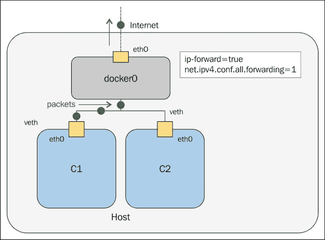
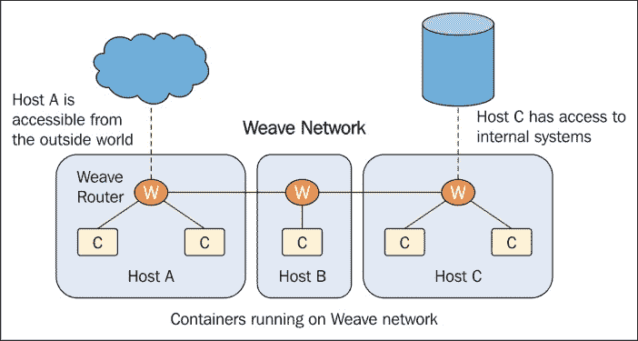

# 第二章。Docker 网络内部

本章详细讨论了 Docker 网络的语义和语法，揭示了当前 Docker 网络范例的优缺点。

它涵盖以下主题:

*   为 Docker 配置 IP 堆栈
    *   IPv4 支持
    *   IPv4 地址管理的问题
    *   IPv6 支持
*   配置域名系统
    *   域名系统基础知识
    *   多播域名系统
*   配置 Docker 桥
*   覆盖网络和底层网络
    *   它们是什么？
    *   Docker 如何使用它们？
    *   他们有哪些优势？

# 为 Docker 配置 IP 堆栈

Docker 使用 IP 栈使用 TCP 或 UDP 与外界进行交互。它支持 IPv4 和 IPv6 寻址基础架构，这将在以下小节中解释。

## IPv4 支持

默认情况下，Docker 为每个容器提供 IPv4 地址，这些地址被附加到默认的`docker0`桥。当使用`--fixed-cidr`标志启动 Docker 守护程序时，可以指定 IP 地址范围，如以下代码所示:

```
$ sudo docker –d --fixed-cidr=192.168.1.0/25

```

我们将在*配置 Docker 桥*部分对此进行更多讨论。

除了 Unix 套接字之外，Docker 守护程序还可以列在 IPv4 TCP 端点上:

```
$ sudo docker -H tcp://127.0.0.1:2375 -H unix:///var/run/docker.sock -d &

```

## 支持 IPv6

IPv4 和 IPv6 可以一起运行；这就是叫做**双栈**。通过运行带有`--ipv6`标志的 Docker 守护程序来启用双栈支持。Docker 将使用 IPv6 链路本地地址`fe80::1`建立`docker0`桥。容器之间共享的所有数据包都流经此桥。

要将全局可路由的 IPv6 地址分配给您的容器，您必须指定一个 IPv6 子网来从中选择地址。

启动 Docker 时，以下命令通过`--fixed-cidr-v6`参数设置 IPv6 子网，并向路由表添加新路由:

```
# docker –d --ipv6 --fixed-cidr-v6="1553:ba3:2::/64"
# docker run -t -i --name c0 ubuntu:latest /bin/bash

```

下图显示了配置了 IPv6 地址范围的 Docker 桥:


如果您使用容器内的`ifconfig`检查 IP 地址范围，您会注意到适当的子网已被分配给`eth0`接口，如以下代码所示:

```
#ifconfig
eth0      Link encap:Ethernet HWaddr 02:42:ac:11:00:01
          inet addr:172.17.0.1  Bcast:0.0.0.0  Mask:255.255.0.0
          inet6 addr: fe80::42:acff:fe11:1/64 Scope:Link
          inet6 addr: 1553:ba3:2::242:ac11:1/64 Scope:Global
          UP BROADCAST RUNNING MULTICAST  MTU:1500  Metric:1
          RX packets:7 errors:0 dropped:0 overruns:0 frame:0
          TX packets:10 errors:0 dropped:0 overruns:0 carrier:0
          collisions:0 txqueuelen:0
          RX bytes:738 (738.0 B)  TX bytes:836 (836.0 B)

lo        Link encap:Local Loopback
          inet addr:127.0.0.1  Mask:255.0.0.0
          inet6 addr: ::1/128 Scope:Host
          UP LOOPBACK RUNNING  MTU:65536  Metric:1
          RX packets:0 errors:0 dropped:0 overruns:0 frame:0
          TX packets:0 errors:0 dropped:0 overruns:0 carrier:0
          collisions:0 txqueuelen:0
          RX bytes:0 (0.0 B)  TX bytes:0 (0.0 B)
```

到`1553:ba3:2::/64`子网的所有流量将通过`docker0`接口路由。

前面的容器使用`fe80::42:acff:fe11:1/64`作为链路本地地址，`1553:ba3:2::242:ac11:1/64`作为全局可路由的 IPv6 地址进行分配。

### 注

链路本地和环回地址具有链路本地范围，这意味着它们将用于直连网络(链路)。所有其他地址都有全局(或通用)作用域，这意味着它们是全局可路由的，可以用来连接到任何地方具有全局作用域的地址。

# 配置域名系统服务器

Docker 为每个容器提供主机名和 DNS 配置，而我们无需构建自定义映像。它用虚拟文件覆盖容器内的`/etc`文件夹，可以在其中写入新信息。

这可以通过在容器内部运行`mount`命令来看到。容器在最初创建时会收到与主机相同的`resolv.conf`文件。如果主机的`resolv.conf`文件被修改，只有当容器重新启动时，这才会反映在容器的`/resolv.conf`文件中。

在 Docker 中，您可以通过两种方式设置 DNS 选项:

*   使用`docker run --dns=<ip-address>`
*   将`DOCKER_OPTS="--dns ip-address"`添加到 Docker 守护程序文件

也可以使用`--dns-search=<DOMAIN>`指定搜索域。

下图显示了使用 Docker 守护程序文件中的`DOCKER_OPTS`设置在容器中配置的 **名称服务器**:


主要的域名系统文件如下:

*   `/etc/hostname`
*   `/etc/resolv.conf`
*   `/etc/hosts`

以下是添加域名系统服务器的命令:

```
# docker run --dns=8.8.8.8 --net="bridge" -t -i  ubuntu:latest /bin/bash

```

使用以下命令添加主机名:

```
#docker run --dns=8.8.8.8 --hostname=docker-vm1  -t -i  ubuntu:latest /bin/bash

```

## 集装箱与外部网络之间的通信

如果`ip_forward`参数设置为`1`，包装只能在容器之间通过。通常，您只需将 Docker 服务器保持在默认设置`--ip-forward=true`，当服务器启动时，Docker 会为您将`ip_forward`设置为`1`。

要检查设置或手动打开 IP 转发，请使用以下命令:

```
# cat /proc/sys/net/ipv4/ip_forward
0
# echo 1 > /proc/sys/net/ipv4/ip_forward
# cat /proc/sys/net/ipv4/ip_forward
1

```

通过启用`ip_forward`，用户可以使容器和外部世界之间的通信成为可能；如果您处于多桥设置中，容器间通信也需要。下图显示了`ip_forward = false`如何将所有数据包从/从容器转发到外部网络:



Docker 不会从 Docker 筛选器链中删除或修改任何预先存在的规则。这允许用户创建规则来限制对容器的访问。

Docker 将`docker0`桥用于单个主机上所有容器之间的数据包流。它添加了一个规则，使用 IPTables 转发链，以便数据包在两个容器之间流动。设置 `--icc=false`将丢弃所有数据包。

当 Docker 守护程序配置了`--icc=false`和`--iptables=true`并且`docker run`通过`--link`选项被调用时，Docker 服务器将插入一对 IPTables 接受规则用于新容器，以连接到其他容器公开的端口，这些端口将是在其 Dockerfile 的公开行中已经提到的端口。下图显示了`ip_forward = false`如何将所有数据包从/从容器中丢弃到外部网络:


默认情况下，Docker 的`forward`规则允许所有外部 IP。要仅允许特定的 IP 或网络访问容器，请在 Docker 筛选器链的顶部插入一个否定规则。

例如，使用以下命令，您可以限制外部访问，以便只有源 IP `10.10.10.10`可以访问容器:

```
#iptables –I DOCKER –i ext_if ! –s 10.10.10.10 –j DROP

```

### 限制 SSH 从一个容器到另一个容器的访问

按照以下步骤限制 SSH 从一个容器到另一个容器的访问:

1.  Create two containers, `c1` and `c2.`

    对于`c1`，使用以下命令:

    ```
    # docker run -i -t --name c1 ubuntu:latest /bin/bash

    ```

    生成的输出如下:

    ```
    root@7bc2b6cb1025:/# ifconfig
    eth0      Link encap:Ethernet  HWaddr 02:42:ac:11:00:05
     inet addr:172.17.0.5  Bcast:0.0.0.0  Mask:255.255.0.0
     inet6 addr: 2001:db8:1::242:ac11:5/64 Scope:Global
     inet6 addr: fe80::42:acff:fe11:5/64 Scope:Link
     UP BROADCAST RUNNING MULTICAST  MTU:1500  Metric:1
     RX packets:7 errors:0 dropped:0 overruns:0 frame:0
     TX packets:8 errors:0 dropped:0 overruns:0 carrier:0
     collisions:0 txqueuelen:0
     RX bytes:738 (738.0 B)  TX bytes:696 (696.0 B)
    lo        Link encap:Local Loopback
     inet addr:127.0.0.1  Mask:255.0.0.0
     inet6 addr: ::1/128 Scope:Host
     UP LOOPBACK RUNNING  MTU:65536  Metric:1
     RX packets:0 errors:0 dropped:0 overruns:0 frame:0
     TX packets:0 errors:0 dropped:0 overruns:0 carrier:0
     collisions:0 txqueuelen:0
     RX bytes:0 (0.0 B)  TX bytes:0 (0.0 B)

    ```

    对于`c2`，使用以下命令:

    ```
    # docker run -i -t --name c2 ubuntu:latest /bin/bash

    ```

    以下是生成的输出:

    ```
    root@e58a9bf7120b:/# ifconfig
    eth0      Link encap:Ethernet  HWaddr 02:42:ac:11:00:06
     inet addr:172.17.0.6  Bcast:0.0.0.0  Mask:255.255.0.0
     inet6 addr: 2001:db8:1::242:ac11:6/64 Scope:Global
     inet6 addr: fe80::42:acff:fe11:6/64 Scope:Link
     UP BROADCAST RUNNING MULTICAST  MTU:1500  Metric:1
     RX packets:6 errors:0 dropped:0 overruns:0 frame:0
     TX packets:8 errors:0 dropped:0 overruns:0 carrier:0
     collisions:0 txqueuelen:0
     RX bytes:648 (648.0 B)  TX bytes:696 (696.0 B)
    lo        Link encap:Local Loopback
     inet addr:127.0.0.1  Mask:255.0.0.0
     inet6 addr: ::1/128 Scope:Host
     UP LOOPBACK RUNNING  MTU:65536  Metric:1
     RX packets:0 errors:0 dropped:0 overruns:0 frame:0
     TX packets:0 errors:0 dropped:0 overruns:0 carrier:0
     collisions:0 txqueuelen:0
     RX bytes:0 (0.0 B)  TX bytes:0 (0.0 B)

    ```

    我们可以使用刚刚发现的 IP 地址测试容器之间的连通性。让我们现在使用`ping`工具来看看这个:

    ```
    root@7bc2b6cb1025:/# ping 172.17.0.6
    PING 172.17.0.6 (172.17.0.6) 56(84) bytes of data.
    64 bytes from 172.17.0.6: icmp_seq=1 ttl=64 time=0.139 ms
    64 bytes from 172.17.0.6: icmp_seq=2 ttl=64 time=0.110 ms
    ^C
    --- 172.17.0.6 ping statistics ---
    2 packets transmitted, 2 received, 0% packet loss, time 999ms
    rtt min/avg/max/mdev = 0.110/0.124/0.139/0.018 ms
    root@7bc2b6cb1025:/#

    root@e58a9bf7120b:/# ping 172.17.0.5
    PING 172.17.0.5 (172.17.0.5) 56(84) bytes of data.
    64 bytes from 172.17.0.5: icmp_seq=1 ttl=64 time=0.270 ms
    64 bytes from 172.17.0.5: icmp_seq=2 ttl=64 time=0.107 ms
    ^C
    --- 172.17.0.5 ping statistics ---
    2 packets transmitted, 2 received, 0% packet loss, time 1002ms
    rtt min/avg/max/mdev = 0.107/0.188/0.270/0.082 ms
    root@e58a9bf7120b:/#

    ```

2.  将`openssh-server`安装在两个容器上:

    ```
    #apt-get install openssh-server

    ```

3.  Enable iptables on the host machine:
    1.  最初，您将能够从一个容器到另一个容器进行 SSH。
    2.  Stop the Docker service and add `DOCKER_OPTS="--icc=false --iptables=true"` to the default Dockerfile of the host machine. This option will enable the iptables firewall and drop all ports between the containers.

        默认情况下，主机上不启用`iptables`。使用以下命令启用它:

        ```
        root@ubuntu:~# iptables -L -n
        Chain INPUT (policy ACCEPT)
        target     prot opt source               destination
        Chain FORWARD (policy ACCEPT)
        target     prot opt source               destination
        DOCKER     all  --  0.0.0.0/0            0.0.0.0/0
        ACCEPT     all  --  0.0.0.0/0            0.0.0.0/0            ctstate RELATED,ESTABLISHED
        ACCEPT     all  --  0.0.0.0/0            0.0.0.0/0
        DOCKER     all  --  0.0.0.0/0            0.0.0.0/0
        ACCEPT     all  --  0.0.0.0/0            0.0.0.0/0            ctstate RELATED,ESTABLISHED
        ACCEPT     all  --  0.0.0.0/0            0.0.0.0/0
        ACCEPT     all  --  0.0.0.0/0            0.0.0.0/0
        ACCEPT     all  --  0.0.0.0/0            0.0.0.0/0

        #service docker stop
        #vi /etc/default/docker

        ```

    3.  Docker Upstart 和 SysVinit 配置文件。自定义 Docker 二进制文件的位置(特别是用于开发测试):

        ```
        #DOCKER="/usr/local/bin/docker"

        ```

    4.  使用`DOCKER_OPTS`修改守护进程的启动选项:

        ```
        #DOCKER_OPTS="--dns 8.8.8.8 --dns 8.8.4.4"
        #DOCKER_OPTS="--icc=false --iptables=true"

        ```

    5.  重新启动码头工人服务:

        ```
        # service docker start

        ```

    6.  检查`iptables` :

        ```
        root@ubuntu:~# iptables -L -n
        Chain INPUT (policy ACCEPT)
        target     prot opt source             destination
        Chain FORWARD (policy ACCEPT)
        target     prot opt source             destination
        DOCKER     all  --  0.0.0.0/0          0.0.0.0/0
        ACCEPT     all  --  0.0.0.0/0          0.0.0.0/0    ctstate RELATED, ESTABLISHED
        ACCEPT     all  --  0.0.0.0/0          0.0.0.0/0
        DOCKER     all  --  0.0.0.0/0          0.0.0.0/0
        ACCEPT     all  --  0.0.0.0/0          0.0.0.0/0   ctstate RELATED, ESTABLISHED
        ACCEPT     all  --  0.0.0.0/0          0.0.0.0/0
        ACCEPT     all  --  0.0.0.0/0          0.0.0.0/0
        DROP       all  --  0.0.0.0/0          0.0.0.0/0

        ```

    `DROP`规则已添加到主机上的 iptables 中，这将断开容器之间的连接。现在，您将无法在容器之间进行 SSH。

4.  We can communicate with or connect containers using the `--link` parameter, with the help of following steps:
    1.  创建第一个容器，它将充当服务器，`sshserver` :

        ```
        root@ubuntu:~# docker run -i -t -p 2222:22 --name sshserver ubuntu bash
        root@9770be5acbab:/#

        ```

    2.  执行`iptables`命令，会发现增加了一个 Docker 链规则:

        ```
        #root@ubuntu:~# iptables -L -n
        Chain INPUT (policy ACCEPT)
        target     prot opt source         destination
        Chain FORWARD (policy ACCEPT)
        target     prot opt source         destination
        Chain OUTPUT (policy ACCEPT)
        target     prot opt source         destination
        Chain DOCKER (0 references)
        target     prot opt source         destination
        ACCEPT     tcp  --  0.0.0.0/0        172.17.0.3     tcp dpt:22

        ```

    3.  创建第二个容器，它的行为类似于客户端，`sshclient` :

        ```
        root@ubuntu:~# docker run -i -t --name sshclient --link sshserver:sshserver ubuntu bash
        root@979d46c5c6a5:/#

        ```

    4.  We can see that there are more rules added to the Docker chain rule:

        ```
        root@ubuntu:~# iptables -L -n
        Chain INPUT (policy ACCEPT)
        target     prot opt source               destination
        Chain FORWARD (policy ACCEPT)
        target     prot opt source               destination
        Chain OUTPUT (policy ACCEPT)
        target     prot opt source               destination
        Chain DOCKER (0 references)
        target     prot opt source               destination
        ACCEPT     tcp  --  0.0.0.0/0            172.17.0.3           tcp dpt:22
        ACCEPT     tcp  --  172.17.0.4           172.17.0.3           tcp dpt:22
        ACCEPT     tcp  --  172.17.0.3           172.17.0.4           tcp spt:22
        root@ubuntu:~#

        ```

        下图解释了使用`--link`标志的容器之间的通信:

        

    5.  You can inspect your linked container with the `docker inspect` command:

        ```
        root@ubuntu:~# docker inspect -f "{{ .HostConfig.Links }}" sshclient
        [/sshserver:/sshclient/sshserver]

        ```

        现在你可以用它的 IP 成功地 ssh 到 sshserver 了。

        ```
        #ssh root@172.17.0.3 –p 22

        ```

    使用`--link`参数，Docker 在容器之间创建了一个安全通道，不需要在容器外部暴露任何端口。

# 配置码头工人桥

Docker 服务器在 Linux 内核内部默认创建了一个名为`docker0`的网桥，它可以在其他物理或虚拟网络接口之间来回传递数据包，使它们表现为单个以太网。运行以下命令，找出虚拟机中的接口列表及其连接的 IP 地址:

```
root@ubuntu:~# ifconfig
docker0   Link encap:Ethernet  HWaddr 56:84:7a:fe:97:99
 inet addr:172.17.42.1  Bcast:0.0.0.0  Mask:255.255.0.0
 inet6 addr: fe80::5484:7aff:fefe:9799/64 Scope:Link
 inet6 addr: fe80::1/64 Scope:Link
 UP BROADCAST RUNNING MULTICAST  MTU:1500  Metric:1
 RX packets:11909 errors:0 dropped:0 overruns:0 frame:0
 TX packets:14826 errors:0 dropped:0 overruns:0 carrier:0
 collisions:0 txqueuelen:0
 RX bytes:516868 (516.8 KB)  TX bytes:46460483 (46.4 MB)
eth0      Link encap:Ethernet  HWaddr 00:0c:29:0d:f4:2c
 inet addr:192.168.186.129  Bcast:192.168.186.255  Mask:255.255.255.0
 inet6 addr: fe80::20c:29ff:fe0d:f42c/64 Scope:Link
 UP BROADCAST RUNNING MULTICAST  MTU:1500  Metric:1
 RX packets:108865 errors:0 dropped:0 overruns:0 frame:0
 TX packets:31708 errors:0 dropped:0 overruns:0 carrier:0
 collisions:0 txqueuelen:1000
 RX bytes:59902195 (59.9 MB)  TX bytes:3916180 (3.9 MB)
lo        Link encap:Local Loopback
 inet addr:127.0.0.1  Mask:255.0.0.0
 inet6 addr: ::1/128 Scope:Host
 UP LOOPBACK RUNNING  MTU:65536  Metric:1
 RX packets:4 errors:0 dropped:0 overruns:0 frame:0
 TX packets:4 errors:0 dropped:0 overruns:0 carrier:0
 collisions:0 txqueuelen:0
 RX bytes:336 (336.0 B)  TX bytes:336 (336.0 B)

```

一旦一个或多个容器启动并运行，您可以通过在主机上运行`brctl`命令并查看输出的`interfaces`列来确认 Docker 已将它们正确连接到`docker0`桥。

在配置`docker0`桥之前，安装桥实用程序:

```
# apt-get install bridge-utils

```

这是一台连接了两个不同容器的主机:

```
root@ubuntu:~# brctl show
bridge name     bridge id               STP enabled     interfaces
docker0         8000.56847afe9799       no              veth21b2e16
 veth7092a45

```

每当创建容器时，Docker 都会使用`docker0`桥接设置。每当创建新容器时，它都会从网桥上可用的范围中分配一个新的 IP 地址，如下所示:

```
root@ubuntu:~# docker run -t -i --name container1 ubuntu:latest /bin/bash
root@e54e9312dc04:/# ifconfig
eth0      Link encap:Ethernet  HWaddr 02:42:ac:11:00:07
 inet addr:172.17.0.7  Bcast:0.0.0.0  Mask:255.255.0.0
 inet6 addr: 2001:db8:1::242:ac11:7/64 Scope:Global
 inet6 addr: fe80::42:acff:fe11:7/64 Scope:Link
 UP BROADCAST RUNNING MULTICAST  MTU:1500  Metric:1
 RX packets:7 errors:0 dropped:0 overruns:0 frame:0
 TX packets:8 errors:0 dropped:0 overruns:0 carrier:0
 collisions:0 txqueuelen:0
 RX bytes:738 (738.0 B)  TX bytes:696 (696.0 B)
lo        Link encap:Local Loopback
 inet addr:127.0.0.1  Mask:255.0.0.0
 inet6 addr: ::1/128 Scope:Host
 UP LOOPBACK RUNNING  MTU:65536  Metric:1
 RX packets:0 errors:0 dropped:0 overruns:0 frame:0
 TX packets:0 errors:0 dropped:0 overruns:0 carrier:0
 collisions:0 txqueuelen:0
 RX bytes:0 (0.0 B)  TX bytes:0 (0.0 B)
root@e54e9312dc04:/# ip route
default via 172.17.42.1 dev eth0
172.17.0.0/16 dev eth0  proto kernel  scope link  src 172.17.0.7

```

默认情况下，Docker 提供一个名为`docker0`的虚拟网络，其 IP 地址为`172.17.42.1`。码头工人集装箱的 IP 地址在`172.17.0.0/16`的范围内。

要更改 Docker 中的默认设置，请修改文件`/etc/default/docker`。

将默认桥从`docker0`更改为`br0`可以这样进行:

```
# sudo service docker stop
# sudo ip link set dev docker0 down
# sudo brctl delbr docker0
# sudo iptables -t nat -F POSTROUTING
# echo 'DOCKER_OPTS="-b=br0"' >> /etc/default/docker
# sudo brctl addbr br0
# sudo ip addr add 192.168.10.1/24 dev br0
# sudo ip link set dev br0 up
# sudo service docker start

```

以下命令显示 Docker 服务的新桥名和 IP 地址范围:

```
root@ubuntu:~# ifconfig
br0       Link encap:Ethernet  HWaddr ae:b2:dc:ed:e6:af
 inet addr:192.168.10.1  Bcast:0.0.0.0  Mask:255.255.255.0
 inet6 addr: fe80::acb2:dcff:feed:e6af/64 Scope:Link
 UP BROADCAST RUNNING MULTICAST  MTU:1500  Metric:1
 RX packets:0 errors:0 dropped:0 overruns:0 frame:0
 TX packets:7 errors:0 dropped:0 overruns:0 carrier:0
 collisions:0 txqueuelen:0
 RX bytes:0 (0.0 B)  TX bytes:738 (738.0 B)
eth0      Link encap:Ethernet  HWaddr 00:0c:29:0d:f4:2c
 inet addr:192.168.186.129  Bcast:192.168.186.255  Mask:255.255.255.0
 inet6 addr: fe80::20c:29ff:fe0d:f42c/64 Scope:Link
 UP BROADCAST RUNNING MULTICAST  MTU:1500  Metric:1
 RX packets:110823 errors:0 dropped:0 overruns:0 frame:0
 TX packets:33148 errors:0 dropped:0 overruns:0 carrier:0
 collisions:0 txqueuelen:1000
 RX bytes:60081009 (60.0 MB)  TX bytes:4176982 (4.1 MB)
lo        Link encap:Local Loopback
 inet addr:127.0.0.1  Mask:255.0.0.0
 inet6 addr: ::1/128 Scope:Host
 UP LOOPBACK RUNNING  MTU:65536  Metric:1
 RX packets:4 errors:0 dropped:0 overruns:0 frame:0
 TX packets:4 errors:0 dropped:0 overruns:0 carrier:0
 collisions:0 txqueuelen:0
 RX bytes:336 (336.0 B)  TX bytes:336 (336.0 B)

```

# 覆盖网络和底层网络

覆盖层是建立在底层网络基础设施(底层)之上的虚拟网络。的目的是实现物理网络中不可用的网络服务。

网络覆盖极大地增加了可以在物理网络上创建的虚拟子网的数量，从而支持多租户和虚拟化。

Docker 中的每个容器都被分配了一个 IP 地址，用于与其他容器进行通信。如果容器必须与外部网络通信，您可以在主机系统中设置网络，并将端口从容器公开或映射到主机。这样，在容器内运行的应用程序将无法通告它们的外部 IP 和端口，因为这些信息对它们不可用。

解决方案是以某种方式为所有主机上的每个 Docker 容器分配唯一的 IP，并拥有一些在主机之间路由流量的网络产品。

有不同的项目来处理 Docker 网络，如下所示:

*   法兰绒
*   织法
*   打开 vSwitch

法兰绒通过给每个容器一个可用于容器间通信的 IP，提供了一个解决方案。使用数据包封装，它在主机网络上创建一个虚拟覆盖网络。默认情况下，法兰绒为主机提供一个`/24`子网，Docker 守护程序从该子网向容器分配 IP。下图显示了使用法兰绒的容器之间的通信:


法兰绒在每台主机上运行一个代理**法兰绒**，负责从预配置的地址空间中分配子网租约。法兰绒使用 etcd 存储网络配置、分配的子网和辅助数据(如主机的 IP)。

法兰绒使用通用 TUN/TAP 设备，并使用 UDP 创建覆盖网络来封装 IP 数据包。子网分配是在 etcd 的帮助下完成的，etcd 维护覆盖子网到主机的映射。

Weave 创建了一个虚拟网络，将跨主机/虚拟机部署的 Docker 容器连接起来，并支持它们的自动发现。下图显示了一个编织网络:



Weave 可以穿越防火墙，在部分连接的网络中运行。流量可以选择加密，从而允许主机/虚拟机通过不受信任的网络进行连接。

Weave 增强了 Docker 现有的(单主机)网络能力，例如`docker0`桥，因此这些可以继续被容器使用。

Open vSwitch 是一个开放的源支持 OpenFlow 的虚拟交换机，通常与虚拟机管理程序一起使用，以跨网络互连主机内和不同主机之间的虚拟机。覆盖网络需要使用支持的隧道封装来创建虚拟数据路径，例如 VXLAN 和 GRE。

覆盖数据路径被提供在驻留在 Docker 主机中的隧道端点之间，这给出了给定提供商段内的所有主机彼此直接连接的外观。

当新容器上线时，路由协议中的前缀会更新，通过隧道端点宣布其位置。当其他 Docker 主机接收到更新时，会将转发规则安装到主机所在的隧道端点的 OVS 中。当主机被解除供应时，类似的过程发生，隧道端点 Docker 主机移除解除供应的容器的转发条目。下图显示了通过基于 OVS 的 VXLAN 隧道在多台主机上运行的容器之间的通信:


# 总结

在本章中，我们讨论了 Docker 的内部网络架构。我们在 Docker 中学习了 IPv4、IPv6 和 DNS 配置。在本章的后面，我们介绍了 Docker 桥以及单个主机和多个主机中容器之间的通信。

我们还讨论了覆盖隧道和在 Docker 网络中实现的不同方法，如 OVS、法兰绒和编织。

在下一章中，我们将学习用各种框架组合起来的动手 Docker 网络。