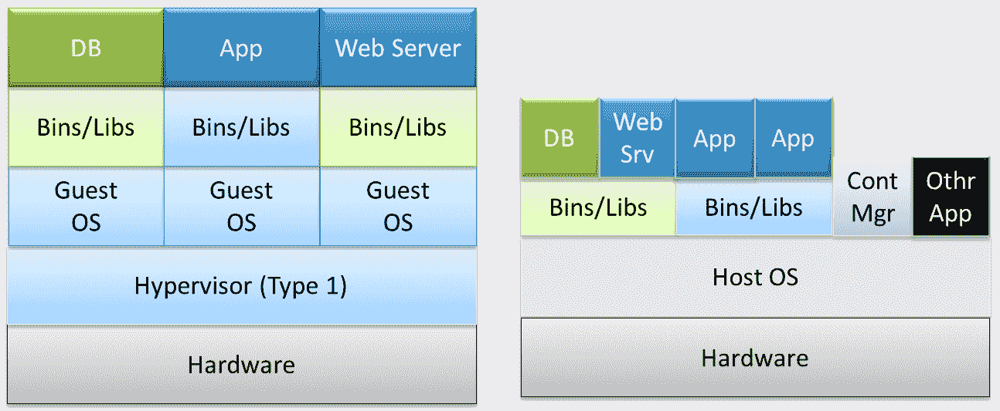
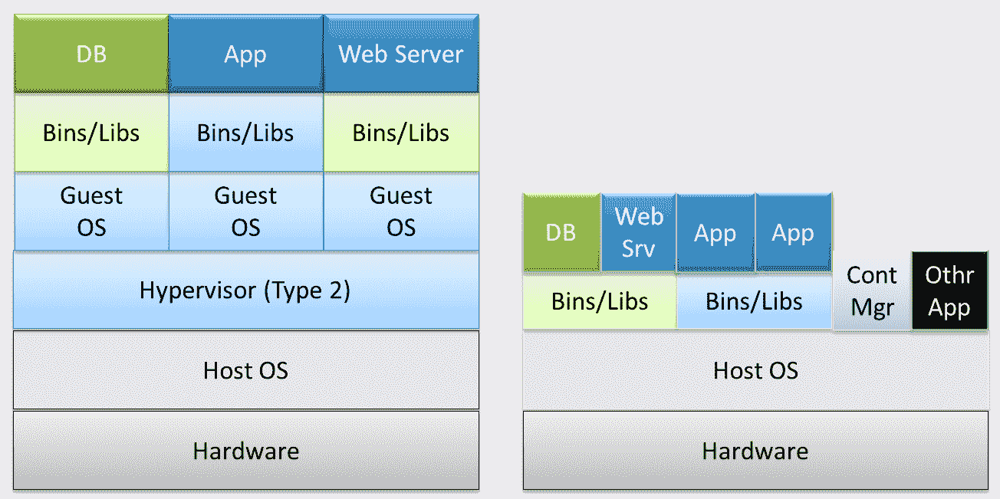
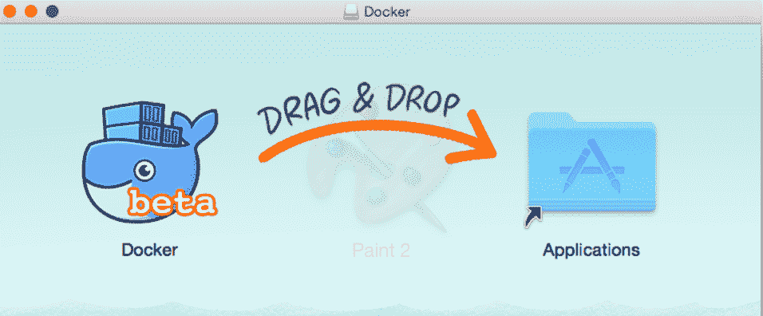
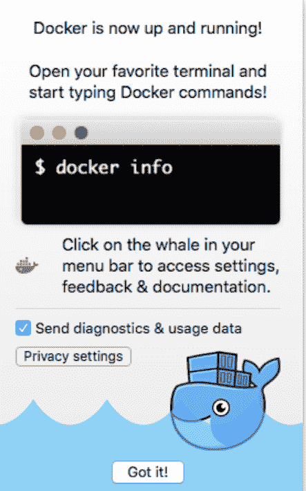
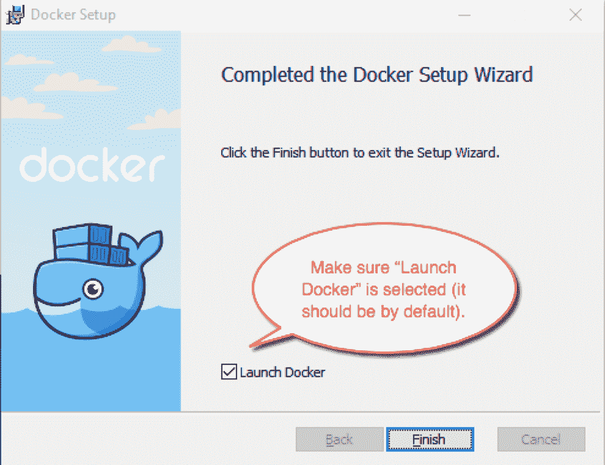
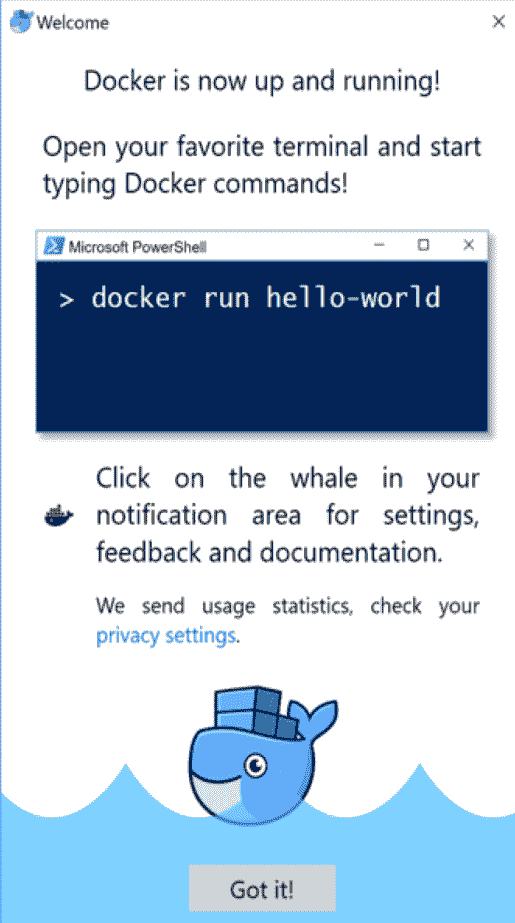
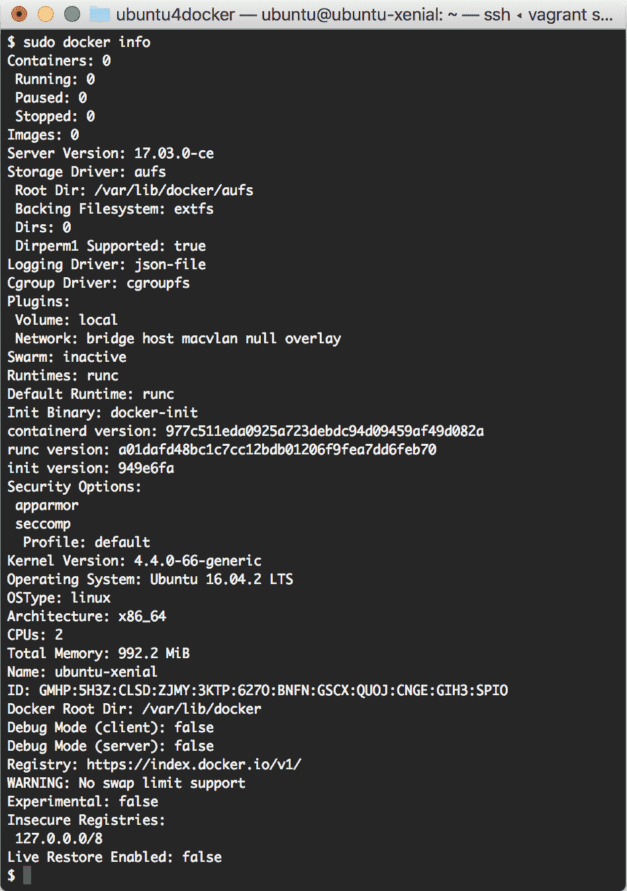
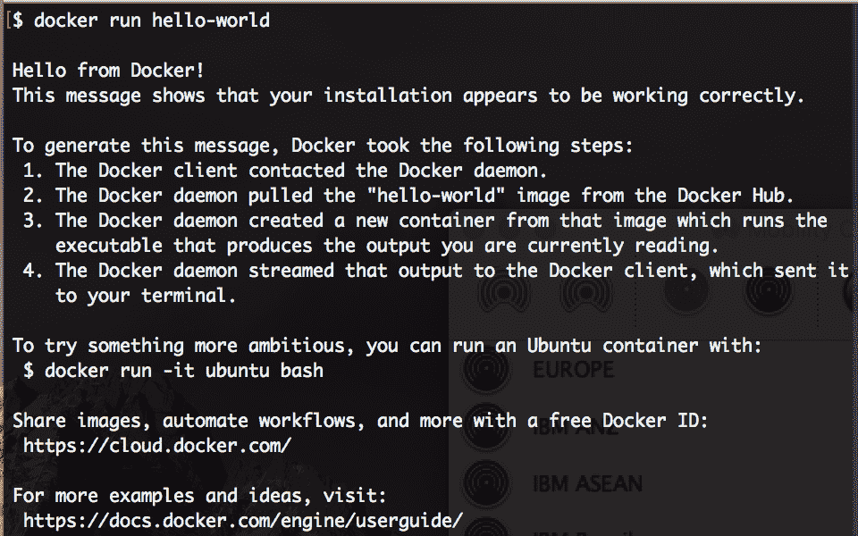

# Docker 入门

不可否认，码头工人是当今信息技术界最受欢迎的技术。主要来说，在 Docker 领域有两个主要趋势。首先，开源 Docker 平台正在不断配备更多正确和相关的特性和功能，以使其成为最强大和最具开拓性的信息技术平台，不仅适用于软件开发人员，也适用于内部和外部信息技术运营团队。第二个趋势是全球各种信息技术服务和解决方案提供商史无前例地采用了 Docker 启发的集装箱化技术，以便为其消费者和客户带来越来越多的优质产品。新软件应用程序开发中的增强的简单性、Docker 容器的自动化和加速部署以及 Docker 容器的极端可操作性被广泛吹捧为这一独特范例取得空前成功的关键区别。

在这一章中，我们想更多地了解 Docker，并展示为什么它被吹捧为最新的*最好的东西*即将到来的数字理念和深刻的经济。我们想向您介绍 Docker 实用的一面；在本章中，我们将涵盖以下主题:

*   码头化的关键驱动因素
*   区分容器化和虚拟化
*   安装码头工人发动机
*   了解 Docker 设置
*   下载第一个图像
*   运行第一个容器
*   Docker 容器故障排除

## 码头化的关键驱动因素

支持 Docker 的容器化的第一个也是最重要的驱动因素是能够胜任并完全克服广泛表达的虚拟化范式的局限性。事实上，我们已经致力于成熟的虚拟化技术和工具很长一段时间了，以实现非常需要的软件可移植性。也就是说，以消除软件和硬件之间的抑制性依赖为目标，已经有几个正确的计划，包括成熟和稳定的虚拟化范例。虚拟化是一种有益的抽象，通过在硬件资源和软件组件之间加入额外的间接层来实现。通过这个新引入的抽象层(虚拟机管理程序或**虚拟机监视器** ( **VMM** ))，任何类型的软件应用程序都可以在任何底层硬件上运行，没有任何障碍。简而言之，软件可移植性的长期目标是试图通过这个中间件层来实现。然而，即使是虚拟化技术也不能完全满足大量发布的可移植性目标。来自不同供应商的虚拟机管理程序软件妨碍了确保急需的应用程序可移植性。此外，操作系统和应用程序工作负载的分布、版本、版本和修补差异阻碍了工作负载跨系统和位置的顺利移植。

类似地，虚拟化范式还有各种其他缺点。在数据中心和服务器场中，虚拟化技术通常用于从物理机中创建多个**虚拟机** ( **虚拟机**)，每个虚拟机都有自己的**操作系统** ( **操作系统**)。通过自动化工具和受控资源共享实现的这种坚实可靠的隔离，多个异构应用程序被容纳在一台物理机器中。也就是说，硬件辅助虚拟化使不同的应用程序能够在单个物理服务器上同时运行。借助虚拟化范例，各种 IT 基础架构(服务器、存储设备和网络解决方案)变得开放、可编程、可远程监控、可管理和可维护。但是，由于冗长和臃肿(每个虚拟机都有自己的操作系统)，虚拟机配置通常需要几分钟时间，这种较长的持续时间对于生产环境来说是不可接受的。

与虚拟化密切相关的另一个广泛表达的缺点是，由于过度使用宝贵且昂贵的信息技术资源(处理、内存、存储、网络带宽等)，虚拟化系统的性能也会下降。除了运行时间更长之外，虚拟机的执行时间也更长，因为从来宾操作系统、虚拟机管理程序到底层硬件都有多个层次。

最后，计算虚拟化蓬勃发展，而其他密切相关的网络和存储虚拟化概念刚刚起步；准确地说，构建分布式应用程序和满足不同的业务期望要求所有参与的 IT 资源具有更快、更灵活的资源调配、高可用性、可靠性、可扩展性和可操作性。计算、存储和网络组件需要协同工作，以满足不同的信息技术和业务需求。这大大增加了虚拟环境的管理复杂性。

进入集装箱化的世界。前面提到的所有障碍都可以一蹴而就。也就是说，不断发展的应用程序容器化概念冷静而自信地促成了软件可移植性目标的空前成功。容器通常包含一个应用程序。除了主应用程序之外，它的所有相关库、二进制文件和其他依赖项都被填充和压缩在一起，打包并呈现为一个全面而紧凑的容器，以便在任何本地和远程环境中轻松地进行运输、运行和管理。容器非常轻便、高度便携、可快速部署、可扩展，等等。此外，许多行业领导者已经聚集在一起，组成一个联盟，开始一个决定性的旅程，向系统生产，包装和交付行业实力和标准化的容器。这种有意识的集体行动使 Docker 具有深刻的洞察力、渗透力和说服力。开源社区同时通过各种协调一致的活动来简化和精简集装箱化概念，从而成为集装箱化难题的先锋。这些集装箱化生命周期步骤正在通过各种工具实现自动化。

Docker 生态系统也在快速发展，以便在集装箱化领域引入尽可能多的自动化。容器集群和编排正在取得很大进展；因此，地理上分布的容器及其集群可以很容易地链接起来，以产生更大和更好的应用感知容器。因此，云中心的分布式本质是，随着所有巧妙的进步在集装箱领域获得强大的立足点，从中获得巨大的好处。云服务提供商和企业信息技术环境都将采用这种独特的技术，以提高资源利用率，并将坚持已久的基础架构优化提升到一个新的水平。在性能方面，大量测试表明 Docker 容器实现了本机系统性能。简而言之，通过灵活地利用 Dockerization，可以保证 DevOps 方面的信息技术敏捷性，这反过来会带来业务敏捷性、适应性和可负担性。

## 区分容器化和虚拟化

这是相关的，并且对于提取和阐述 Docker 启发的容器化运动相对于广泛使用和完全成熟的虚拟化范式的改变游戏规则的优势是至关重要的。如前所述，虚拟化是前所未有地采用云化的突破性想法和改变游戏规则的趋势，云化使信息技术产业化范式成为可能。然而，通过无数的真实案例研究，云服务提供商得出结论，虚拟化技术有其自身的缺点，因此容器化运动蓬勃发展。

容器化通过一些关键且定义明确的合理化以及对计算资源的深刻共享，带来了战略上合理的优化。Linux 内核的一些与生俱来且迄今未被充分利用的功能已经被重新发现。还嵌入了一些附加功能，以加强集装箱化的过程和适用性。这些能力因带来了人们梦寐以求的自动化和加速而受到称赞，这将使羽翼未丰的集装箱化想法在未来几天达到更高的水平。容器化值得注意的业务和技术优势包括裸机级性能、实时可扩展性、更高的可用性、IT DevOps、软件可移植性等。所有不需要的凸起和赘肉都被明智地消除，以加快数百个应用程序容器在几秒钟内推出的速度。左侧的下图描述了虚拟化方面，而右侧的图生动地说明了容器中正在实现的简化:



Type 1 Virtualization versus Containerization

众所周知，虚拟化主要有两种类型。在类型 1 虚拟化中，虚拟机管理程序提供操作系统功能以及虚拟机配置、监控和管理功能，因此不需要任何主机操作系统。VMware ESXi 是领先的第 1 类虚拟化虚拟机管理程序。生产环境和任务关键型应用程序在类型 1 虚拟化上运行。



Type 2 virtualization versus Containerization

第二种是类型 2 虚拟化，其中虚拟机管理程序在主机操作系统上运行，如上图所示。这一附加层会影响系统性能，因此通常类型 2 虚拟化用于开发、测试和试运行环境。类型 2 虚拟化大大降低了性能，因为在执行过程中涉及多个模块。在这里，支持 Docker 的容器化的到来给系统性能带来了巨大的提升。

总之，虚拟机是久经考验、久经考验的软件堆栈，有许多支持工具可以管理其上的操作系统和应用程序。虚拟化工具生态系统不断扩展。虚拟机中的应用程序通过虚拟机管理程序对主机操作系统隐藏。但是，Docker 容器不使用虚拟机管理程序来提供隔离。对于容器，Docker 主机使用 Linux 内核的进程和文件系统隔离功能来保证非常需要的隔离。

Docker 容器需要减少磁盘占用空间，因为它们不包括整个操作系统。因此，设置和启动时间明显低于典型虚拟机。容器的主要优势是应用程序代码的开发、编写、打包和广泛共享的速度。容器成为基于微服务的分布式应用程序更快创建、部署和交付的最突出和最主要的平台。使用容器，有很多值得注意的信息技术资源节约，因为容器消耗更少的内存空间。

伟大的思想家对虚拟机和容器做了一个简洁的比较。他们从房子和公寓的角度强调思考。这所房子有自己的管道、电气、供暖和不受不速之客的影响，是独立的。公寓综合体拥有与房屋相同的资源，如电力、管道和供暖，但它们由所有单元共享。单独的公寓有各种尺寸，你只租你需要的，而不是整个建筑群。公寓是集装箱，共享资源是集装箱主机。

开发人员可以使用简单的增量命令来创建易于部署的固定映像，并可以使用`Dockerfile`自动构建这些映像。开发人员可以使用简单的、Git 风格的`push`和`pull`命令向公共或私有 Docker 注册表轻松共享这些图像。自 Docker 技术问世以来，用于简化和精简支持 Docker 的容器化的第三方工具出现了前所未有的增长。

### Docker 平台的最新新增功能

容器主要作为下一代应用交付平台出现。容器带来了一种高效虚拟化操作系统的机制，其唯一目的是在单个内核主机上运行应用程序。应用程序还可以包括快速出现的微服务。开源 Docker 平台现在主要有两种变体:

*   **Docker 企业版** ( **Docker EE** ):这是为在大规模生产中构建、运输和运行业务关键型应用程序的企业开发和 IT 团队设计的。Docker EE 经过集成、认证和支持，可为企业提供业内最安全的容器平台，以实现所有应用的现代化。

*   **Docker 社区版** ( **Docker CE** ):这是希望开始使用 Docker 并尝试基于容器的应用程序的开发人员和小团队的理想选择。Docker CE 在很多平台上都有，从桌面到云再到服务器。Docker CE 适用于 macOS 和 Windows，提供原生体验，帮助您专注于学习 Docker。您可以构建和共享容器，并自动化开发管道，所有这些都来自一个环境。

#### Windows 容器

Docker 和微软达成了持久的合作关系，将 Docker 平台急需的敏捷性、可移植性和安全性优势带到了 Windows Server 2016 的每个版本中。将服务器升级到这种新操作系统的组织将能够从开发环境到生产环境使用容器。Windows 使用命名空间隔离、资源控制和进程隔离机制来限制每个容器可以访问的文件、网络端口和正在运行的进程。这种隔离确保了在容器中运行的应用程序不能与在主机操作系统或其他容器中运行的其他应用程序交互或看到它们。微软包括两种不同类型的容器。第一种类型基于 Windows Server 核心映像，称为 **Windows Server 容器**。第二个叫做 **Hyper-V 容器**，基于 Windows Nano Server 映像。

Windows 服务器容器共享底层操作系统内核。这种体系结构支持更快的启动和高效的打包，同时提供了在每个主机上运行多个容器的能力。容器共享本地数据和 API，它们之间的隔离级别较低。这些容器最适合不需要强隔离和安全约束的同构应用程序。由多个容器组成的大型微服务应用程序可以使用 Windows Server 容器来提高性能和效率。

Hyper-V 容器提供了两个世界中最好的:虚拟机和容器。由于每个容器都有一个专用的 Windows 内核和内存副本，Hyper-V 容器比 Windows Server 容器具有更好的隔离和安全级别。容器更安全，因为与主机操作系统和其他容器的交互很少。这种有限的资源共享也增加了启动时间和打包容器的大小。

Hyper-V 容器在公共云等多租户环境中是首选。下面是 Windows 容器行话的摘要和描述:

*   **容器主机**:配置了 Windows 容器功能的物理或虚拟机。
*   **容器映像**:容器映像包含基础 OS、应用程序以及快速部署容器所需的所有应用程序依赖关系。
*   **容器 OS 镜像**:容器 OS 镜像就是 OS。
*   **容器注册表**:容器镜像存储在容器注册表中，可以按需下载。注册表可以是异地的，也可以是本地的。
*   **Docker 引擎**:是开源 Docker 平台的核心。它是一个轻量级的容器运行时，构建并运行 Docker 容器。
*   **Dockerfile** :开发人员使用`Dockerfile`来构建和自动化容器映像的创建。有了`Dockerfile`，Docker 守护程序可以自动构建容器映像。

微软有自己的公共和官方存储库，可通过以下网址获得:[https://hub.docker.com/u/microsoft/](https://hub.docker.com/u/microsoft/)。**亚马逊网络服务** ( **AWS** )已经开始支持 Windows 容器，为老应用程序提供了一种更直接的方式来跳入云端。

Windows 容器为运行在 Windows 上的应用程序提供了与 Linux 容器相同的优势。Windows 容器支持 Docker 映像格式和 Docker API。但是，也可以使用 PowerShell 来管理它们。Windows 容器、Windows 服务器容器和 Hyper-V 容器提供了两种容器运行时。Hyper-V 容器通过将每个容器托管在一个超级优化的虚拟机中，提供了额外的隔离层。

这解决了在操作系统上运行容器的安全问题。此外，它还增强了计算实例中的容器密度。也就是说，通过在 Hyper-V 虚拟机中运行多个容器，您可以有效地将密度计数提升到另一个水平，并在单个主机上运行数百个容器。Windows 容器只是 Docker 容器。目前，您可以在 Windows Server 2016(完整版、核心版或纳米服务器版)、Windows 10(企业版和专业版)以及 Azure 中部署 Windows 容器。您可以从任何 Docker 客户端部署和管理这些容器，包括安装 Docker 引擎时的 Windows 命令行。您也可以从开源软件 PowerShell 中管理它们。

在这本书里，我们把重点放在了码头工人身上。

## 安装码头工人发动机

Docker 引擎构建在 Linux 内核之上，它广泛利用了 Linux 内核的特性，如名称空间和 cgroups。由于 Docker 的迅速流行，它现在被所有主要的 Linux 发行版打包，这样他们就可以保留他们的忠实用户并吸引新用户。您可以使用 Linux 发行版的相应打包工具来安装 Docker Engine，例如，对 Debian 和 Ubuntu 使用`apt-get`命令，对 Red Hat、Fedora 和 CentOS 使用`yum`命令。或者，您可以使用全自动安装脚本，它将在幕后为您完成所有艰苦的工作。

如果您是苹果或微软视窗用户，您可以在 Linux 仿真(虚拟机)上运行 Docker。有多种解决方案可以使用 Linux 虚拟机运行 Docker，这将在后面的小节中解释。Docker 和微软正在努力支持原生 Windows 容器来运行原生 Windows 应用程序，这超出了本书的范围。

For all practical purposes, we have chosen the Ubuntu 16.04 LTS (Xenial Xerus) (64-bit) Linux distribution.

### 在 Ubuntu 上安装坞站

Docker 目前仅在 64 位架构的 Linux 上受支持，Linux 内核必须是 3.10 或更高版本。在撰写本书时，最新版本的 Docker 是
17.03.0-ce。以下步骤详细规定了 Ubuntu Linux 16.04 上 Docker 引擎的安装步骤:

1.  首先，在 Ubuntu 中安装任何软件的最佳实践始于包存储库的重新同步。这一步将根据最新发布的包更新包存储库，因此我们将确保始终使用此处显示的命令获得最新发布的版本:

```
 $ sudo apt-get update

```

Downloading the example code
You can download the example code files from your account at
[http://www.packtpub.com](http://www.packtpub.com) for all the Packt Publishing books you have purchased. If you purchased this book elsewhere, you can visit
[http://www.packtpub.com/support](http://www.packtpub.com/support) and register to have the files e-mailed directly to you.

2.  将 Ubuntu 16.04 的 Docker 包存储库路径添加到您的 APT 源中，如下所示:

```
 $ sudo sh -c "echo deb https://apt.dockerproject.org/repo \
 ubuntu-xenial main > /etc/apt/sources.list.d/docker.list"

```

3.  运行以下命令，添加 **GNU 隐私保护** ( **GPG** )键:

```
 $ sudo apt-key adv --keyserver \
 hkp://p80.pool.sks-keyservers.net:80 --recv-keys \ 
 58118E89F3A912897C070ADBF76221572C52609D

```

4.  使用以下命令与包存储库重新同步:

```
      $ sudo apt-get update

```

5.  安装 Docker 并启动 Docker 服务:

```
      $ sudo apt-get install -y docker-engine

```

6.  安装好 Docker 引擎后，让我们通过运行`docker --version`来验证我们的安装，如下所示:

```
 $ docker --version
 Docker version 17.03.0-ce, build 60ccb22

```

万岁！！我们已经成功安装了 Docker 版本 17.03.0 社区版。

### 使用自动化脚本安装 Docker

在前一节中，我们通过手动配置 GPG 密钥、APT 存储库等来安装 Docker 引擎。然而，Docker 社区已经向前迈进了一步，将所有这些细节都隐藏在自动安装脚本中。该脚本可以通过`curl`命令或`wget`命令在大多数流行的 Linux 发行版上安装 Docker，如下所示:

*   对于`curl`命令:

```
      $ sudo curl -sSL https://get.docker.io/ | sh

```

*   对于`wget`命令:

```
      $ sudo wget -qO- https://get.docker.io/ | sh

```

The preceding automated script approach enforces AUFS as the underlying Docker filesystem because AUFS is preferred over `devicemapper`. This script probes the AUFS driver, and then installs it automatically if it is not found in the system. In addition, it also conducts some basic tests upon installation for verifying the sanity.

### 在苹果电脑上安装 Docker

在 Mac 系统上，可以在 Linux 虚拟机上运行 Docker。像游民和 Docker 工具箱这样的工具在 Mac 上模拟 Linux 并在上面运行 Docker 非常方便。Docker 最近在 Mac 上发布了 Docker 作为测试版，使用`xhyve`虚拟机管理程序来提供 Linux 仿真。`xhyve`虚拟机管理程序为 Docker 守护程序虚拟化了 Docker 引擎环境和特定于 Linux 内核的功能。

It is always recommended that you use Docker for Mac for supported OS X versions 10.10.3, Yosemite or newer.

以下步骤描述了为 Mac 安装 Docker 的过程:

1.  从链接“[”https://download . Docker . com/Mac/beta/docker . dmg](https://download.docker.com/mac/beta/Docker.dmg)下载 MAC 的 docker。
2.  双击下载`Docker.dmg`并移动，如下图:



3.  现在，双击`Applications`中的`Docker.app`，它将安装所有 Docker 组件。在安装过程中，它会询问机器的管理密码来安装软件。
4.  成功安装后，鲸鱼图标将出现在顶部状态栏中:



5.  最后，验证 Docker 版本:

```
 $ docker --version
 Docker version 17.03.0-ce, build 60ccb22
 $ docker-compose --version
 docker-compose version 1.11.2, build dfed245
 $ docker-machine --version
 docker-machine version 0.10.0, build 76ed2a6

```

### 在 Windows 上安装 Docker

就像苹果电脑一样，在视窗系统上，你也可以使用工具在 Linux 虚拟机上运行 Docker，比如 royal 和 Docker 工具箱。最近，Docker 发布了 Windows Docker 的 Beta 版本，该版本使用 Hyper-V 虚拟化 Docker 引擎和运行 Docker 引擎必不可少的 Linux 内核特定功能。

在撰写本书时，Windows 上的 Docker 仅在 64 位 Windows 10 企业和教育(1511 年 11 月更新，Build 10586 或更高版本)上受支持。未来，Docker 将支持更多版本的 Windows 10。请注意，必须启用 Hyper-V 软件包。

如果您有受支持的 Windows 10 操作系统，建议您始终使用 Docker 本机。在 Windows 上安装 Docker 需要以下步骤:

1.  从 https://download . Docker . com/win/beta/install docker . MSI 下载 Windows installer 的 docker。
2.  双击`InstallDocker.msi`；安装向导将启动。它将要求 Windows 管理密码来完成安装:



3.  Docker 会自动启动，鲸鱼会出现在状态栏中:



4.  最后，验证 Docker 版本:

```
 $ docker --version
 Docker version 17.03.0-ce, build 60ccb22
 $ docker-compose --version
 docker-compose version 1.11.2, build dfed245
 $ docker-machine --version
 docker-machine version 0.10.0, build 76ed2a6

```

对于其他版本的 Windows，可以从[https://docs.docker.com/toolbox/overview/](https://docs.docker.com/toolbox/overview/)安装 Docker 工具箱。Docker 工具箱在 Oracle VirtualBox 虚拟机管理程序上运行一个轻量级 Linux 虚拟机 Boot2Docker，并在其上安装 Docker 引擎。

## 了解 Docker 设置

了解 Docker 组件及其版本、存储、执行驱动程序、文件位置等非常重要。顺便说一句，理解 Docker 设置的探索也将揭示安装是否成功。您可以使用两个 Docker 子命令来实现这一点:`docker version`和`docker info`。

让我们从`docker version`子命令开始我们的 Docker 之旅，如下所示:

```
$ sudo docker version
Client:
 Version: 17.03.0-ce
 API version: 1.26
 Go version: go1.7.5
 Git commit: 60ccb22
 Built: Thu Feb 23 10:57:47 2017
 OS/Arch: linux/amd64

Server:
 Version: 17.03.0-ce
 API version: 1.26 (minimum version 1.12)
 Go version: go1.7.5
 Git commit: 60ccb22
 Built: Thu Feb 23 10:57:47 2017
 OS/Arch: linux/amd64
 Experimental: false  

```

虽然`docker version`子命令列出了许多文本行，但作为 Docker 用户，您应该知道以下输出行的含义:

*   客户端版本
*   客户端应用编程接口版本
*   服务器版本
*   服务器应用编程接口版本

这里，客户端和服务器都是社区版 17.03.0，客户端 API 和服务器 API 都是 1.26 版。

如果我们剖析`docker version`子命令的内部，那么它将首先列出本地存储的客户端相关信息。随后，它将通过 HTTP 对服务器进行 REST API 调用，以获取与服务器相关的详细信息。

使用`docker info`子命令了解更多关于 Docker 环境的信息:



正如您所看到的，在新安装的 Docker Engine 的输出中，`Containers`和`Images`的数量总是为零。`Storage Driver`已设置为`aufs`，目录已给定`/var/lib/docker/aufs`位置。运行时间已设置为`runc`。该命令还列出了详细信息，如`Logging Driver`、`Cgroups Driver`、`Kernel Version`、`Operating System`、`CPUs`和`Total Memory`。

### 客户端-服务器通信

在 Linux 安装中，Docker 通常被编程为使用 Unix 套接字(`/var/run/docker.sock`)执行服务器-客户端通信。Docker 还有一个在 IANA 注册的港口，那就是`2375`。但是，出于安全原因，默认情况下不会启用此端口。

## 下载第一个 Docker 映像

成功安装了 Docker 引擎后，下一个逻辑步骤是从 Docker 注册表下载映像。Docker Registry 是一个托管各种应用程序的应用程序存储库，从基本的 Linux 映像到高级应用程序。`docker pull`子命令用于从注册表下载任意数量的图像。在本节中，我们将使用以下命令下载示例`hello-world`图像:

```
$ sudo docker pull hello-world
Using default tag: latest
latest: Pulling from library/hello-world
78445dd45222: Pull complete 
Digest: sha256:c5515758d4c5e1e838e9cd307f6c6a0d620b5e07e6f927b07d05f6d12a1ac8d7
Status: Downloaded newer image for hello-world:latest 

```

下载图像后，可以使用`docker images`子命令进行验证，如下所示:

```
$ sudo docker images
REPOSITORY TAG IMAGE ID CREATED VIRTUAL SIZE
hello-world latest 48b5124b2768 6 weeks ago 1.84 kB  

```

## 运行第一个 Docker 容器

现在，您可以启动第一个 Docker 容器，如下所示:



很酷，不是吗？您很快就建立了第一个 Docker 容器。在前面的例子中，`docker run`子命令被用来从`hello-world`图像创建容器。

### Docker 容器故障排除

大多数情况下，您在安装 Docker 时不会遇到任何问题。但是，可能会出现意外故障。因此，有必要讨论突出的故障排除技术和技巧。让我们从本节讨论故障排除技巧开始。第一个提示是，应该使用以下命令检查 Docker 的运行状态:

```
$ sudo service docker status  

```

如果 Docker 服务正在运行，则`Active`列(从顶部算起的第三列)会将 Docker 服务的状态列为`active (running)`，如下所示:


但是，如果`Active`列显示`inactive`或`maintenance`为状态，则您的 Docker 服务没有运行。在这种情况下，请重新启动 Docker 服务，如下所示:

```
$ sudo service docker restart  

```

如果您仍然遇到 Docker 设置的问题，那么您必须使用`journalctl -u docker`命令提取 Docker 日志，以便进一步调查。

## 摘要

在某种程度上，Docker 容器是虚拟机的轻量级、松散耦合和灵活的表亲。如前所述，容器能够紧凑地打包应用程序及其所有依赖项，并将其运送到其他地方，在开发、测试和生产环境中顺利运行。Docker 智能地利用了一些强大的内核级特性，并提供了一个不断增长的工具生态系统，用于以自动化方式实现和运行容器。最终结果是分布式应用程序开发人员和系统管理员的潜在游戏规则改变者。随着混合云成为全球企业对其信息技术需求的吐司，Docker 平台对企业信息技术团队来说是塞翁失马焉知非福。容器是典型的沙箱，将进程相互隔离。Docker 在推进容器化范例方面做得很好，达到了许多目的，例如轻量级包装、无摩擦运输、更快的部署和更快的软件应用交付。

下一章将更详细地介绍 Docker 容器的操作方面，特别是为了生成真实世界的 Docker 化应用程序而对容器的明智处理。