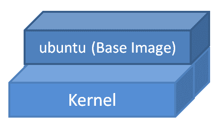
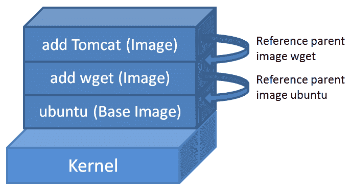
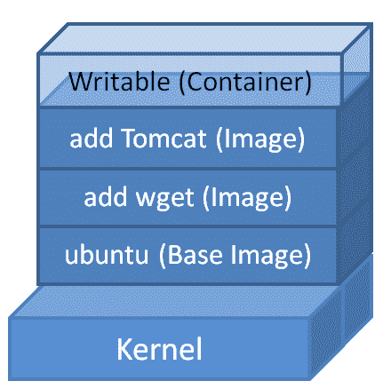

# 二、处理Docker容器

在前一章中，我们解释了刺激和可持续的概念，这些概念清楚地阐明了 Docker 制作未来和灵活的应用感知容器的方式。我们讨论了将 Docker 容器引入多个环境(内部和外部)的所有相关细节。您可以在自己的环境中轻松复制这些 Docker 功能，以获得有益的体验。现在，我们的下一个逻辑步骤是果断地理解容器生命周期的各个方面。您将学习如何以高效和无风险的方式优化您自己的容器以及其他第三方容器的利用率。容器将被发现、访问、评估，并用于更大更好的分布式应用。

在本章中，我们将深入探讨并详细描述容器搬运的关键方面。为了读者的利益，还将讨论一些利用容器的实用技巧和执行命令。

在本章中，我们将涵盖以下主题:

*   澄清 Docker 术语
*   使用 Docker 映像和容器
*   Docker 注册表及其存储库的含义
*   Docker中心登记处
*   搜索 Docker 映像
*   使用交互式容器
*   跟踪容器内部的变化
*   控制和管理Docker容器
*   从容器构建映像
*   将容器作为守护程序启动

## 澄清 Docker 术语

为了大大简化本章的可理解性，并尽量减少任何形式的歧义，经常使用的术语将在下一节中解释。

### Docker 映像

Docker 映像是组成可执行软件应用的所有文件的集合。这个集合包括应用以及所有的库、二进制文件和其他依赖项，比如部署描述符，这些都是运行应用所必需的。Docker 映像中的这些文件是只读的，因此无法更改映像的内容。如果您选择更改映像的内容，Docker 允许的唯一选项是使用新的更改添加另一个图层。换句话说，Docker 映像由层组成，您可以使用`docker history`子命令查看这些层，如[第 3 章](03.html)、*建筑映像*中所述。

Docker 映像体系结构有效地利用这种分层概念，无缝地向现有映像添加附加功能，以满足不同的业务需求，并提高映像的重用。换句话说，可以通过在现有映像上添加额外的图层并导出新映像来为该映像添加功能。Docker 映像具有父子关系，最底部的映像称为**基础映像**。基本映像是没有任何父映像的特殊映像:



在上图中，`ubuntu`是一个基础映像，它没有任何父映像。

Ubuntu is a Debian-based Linux operating system. The Ubuntu Docker image is a minimalist bundle of software libraries and binaries that are critical to run an application. It does not include the Linux kernel, device drivers, and various other services a full-fledged Ubuntu operating system would provide.



正如你在上图中看到的，一切都从一个基础映像开始，在这个例子中，它是`ubuntu`。此外，`wget`功能将作为图层添加到映像中，`wget`映像将引用`ubuntu`映像作为其父映像。在下一层中，添加了一个 Tomcat 应用服务器的实例，并将`wget`映像作为其父映像。对原始基础映像所做的每个添加都存储在一个单独的层中(这里生成了一种层次结构来保持原始身份)。准确地说，任何 Docker 映像都必须源自基础映像，并且通过获取新的模块来不断丰富映像的功能，这是通过在现有 Docker 映像上逐个添加额外的模块作为新层来实现的，如上图所示。

Docker 平台提供了一种构建新映像或扩展现有映像的简单方法。您还可以下载其他人已经创建并存放在 Docker 映像存储库中(私有或公共)的 Docker 映像。每个映像都有一个唯一的标识，如下一节所述。

### Docker 容器

Docker 映像是应用堆栈捆绑包的只读模板，它们没有任何关联的状态。Docker 容器是从 Docker 映像中分离出来的，它在静态映像层之上添加了一个读写层。如果我们试图与面向对象的编程范式进行比较，Docker 映像通常是类，而 Docker 容器是对象(类的实例)。

Docker 映像定义了 Docker 容器的行为，例如当容器启动时运行什么进程。在前一章中，当您调用`docker run hello-world`时，Docker 引擎从`hello-world` Docker 映像中启动了一个新的容器，它继续在屏幕上输出大量信息。从这个例子中，很明显 Docker 映像是 Docker 容器的基本构建块，Docker 映像规定了 Docker 容器的行为。



如上图所示，当容器被剥离时，可写(读写)层被添加到映像的顶部，以保持应用状态。容器层下可能有几个只读映像(可写)。

### Docker注册表

一个**Docker登记处**是一个可以存储Docker映像的地方，以便世界各地的软件开发人员可以公开或私下找到、访问和使用这些映像，从而在没有任何风险的情况下快速创建新的复合应用。因为所有存储的映像都经过了多次验证、确认和细化，所以这些映像的质量非常高。您可以将 Docker 映像发送到注册表，以便使用`docker push`子命令进行注册和存放。您可以使用`docker pull`子命令从注册表下载 Docker 映像。

Docker Registry 可以由第三方托管为公共或私有注册表，类似于以下注册表之一:

*   Docker集线器
*   Docker
*   谷歌容器注册
*   容器登记处

每个机构、创新者和个人都可以拥有自己的 Docker Registry 来存储他们的映像，以供内部和/或外部访问和使用。

## 使用 Docker 映像

在前一章中，我们使用
`hello-world`映像演示了典型的 *Hello World* 示例。现在，需要更仔细地观察`docker pull`子命令的输出，这是下载 Docker 映像的实际命令。现在，在本节中，我们将使用`busybox`映像，一个最小但非常方便的 Docker 映像，来深入探讨 Docker 映像处理:


如果你密切关注`docker pull`子命令的输出，你会注意到`Using default tag: latest`文本。Docker 映像管理功能(Docker 主机或 Docker 映像注册表上的本地映像存储)支持存储 Docker 映像的多个变体。换句话说，你可以使用标签来修改你的图片。

默认情况下，Docker 始终使用标记为`latest`的映像。每个映像变体都可以通过用适当的标签对其进行限定来直接识别。可以通过在标签和存储库名称(`<repository>:<tag>`)之间添加冒号(`:`)来对映像进行标签限定。为了演示，我们将拉出`busybox`的`1.24`标记版本，如下所示:


太棒了。不是吗？我们能够拉一个特定版本的`busybox`；在这种情况下，就是`busybox:1.24`。`docker pull`命令还支持`-a`选项来下载所有可用的映像变体。谨慎使用此选项，因为最终可能会填满磁盘空间。

到目前为止，我们从存储库中下载了一些 Docker 映像，现在它们在 Docker 主机中本地可用。您可以通过运行`docker images`子命令找到 Docker 主机上可用的映像:


显然，我们在前面的列表中有三个项目，为了更好地理解这些项目，我们需要理解`docker images`子命令打印出来的信息。以下是可能的类别列表:

*   `REPOSITORY`:这是存储库或映像的名称。在前面的示例中，存储库名称是`hello-world`和`busybox`。
*   `TAG`:这是与映像关联的标签，例如`1.24`和`latest`。一个或多个标签可以与一个映像相关联。
*   `IMAGE ID`:每个映像都与一个唯一的 ID 相关联。映像标识使用 64 位十六进制长随机数表示。默认情况下，`docker images`子命令只显示 12 个十六进制数字。您可以使用`--no-trunc`标志显示所有 64 个十六进制数字(例如:`sudo docker images --no-trunc`)。
*   `CREATED`:表示映像创建的时间。
*   `SIZE`:此类别突出显示映像的虚拟大小。

### Docker枢纽

在上一节中，当您运行`docker pull`子命令时，`busybox`映像被神秘下载。在这一节中，让我们解开围绕`docker pull`子命令的谜团，以及 Docker Hub 如何为这一意想不到的成功做出巨大贡献。

Docker 社区中的好人已经建立了一个映像存储库，并在默认位置`index.docker.io`公开提供。这个默认位置被称为**Docker中心**。`docker pull`子命令被编程为在该位置寻找映像。因此，当你拉一张`busybox`图片时，它会毫不费力地从默认注册表中下载。这种机制有助于加速 Docker 容器的旋转。Docker Hub 是官方存储库，包含全球 Docker 开发社区创建和存放的所有精心策划的映像。实施这种所谓的解决方案是为了通过大量隔离任务来确保存储在 Docker Hub 中的所有映像都是安全的。还有其他机制，如创建映像摘要和内容信任，这使您能够验证通过任何渠道从注册表接收的所有数据的完整性和发布者。

从这些 Docker 映像中清除任何有意或无意引入的恶意软件、广告软件、病毒等，都有成熟的验证和确认方法。数字签名是 Docker 映像最大完整性的突出机制。尽管如此，如果官方映像已经被破坏或篡改，那么 Docker 引擎将发出警告，然后继续运行该映像。

除了官方存储库，Docker Hub 注册表还为第三方开发人员和提供商提供了一个平台，用于共享他们的映像以供一般消费。第三方映像以其开发者或存款人的用户标识为前缀。例如`thedockerbook/helloworld`为第三方图片，其中`thedockerbook`为用户 ID，`helloworld`为图片库名称。您可以使用`docker pull`子命令下载任何第三方映像，如下所示:

```
$ sudo docker pull thedockerbook/helloworld

```

除了前面的存储库，Docker 生态系统还提供了一种利用来自除 Docker Hub 注册表之外的任何第三方存储库中心的映像的机制，并且它还提供了由本地存储库中心托管的映像。如前所述，Docker Engine 已经被编程为在默认情况下在`index.docker.io`查找映像，而在第三方或本地存储库中心的情况下，我们必须手动指定应该从哪里提取映像的路径。手动存储库路径类似于没有协议说明符的 URL，例如`https://`、`http://`和`ftp://`。以下是从第三方存储库中心提取映像的示例:

```
$ sudo docker pull registry.example.com/myapp  

```

### 搜索 Docker 映像

正如我们在上一节中所讨论的，Docker Hub 存储库通常既包含官方映像，也包含第三方 Docker 爱好者提供的映像。在撰写本书时，数以千计的精选 Docker 映像(也称为**Docker 化应用)**可供用户使用。其中大部分被数百万用户下载。这些映像可以按原样使用，也可以作为特定于用户的应用的构造块。

您可以使用`docker search`子命令在 Docker Hub 注册表中搜索 Docker 映像，如本例所示:

```
$ sudo docker search mysql  

```

在`mysql`上的搜索将列出许多`mysql`映像，但是我们将通过使用`head -10`命令将它限制为五行，如下所示:


正如您在前面的搜索输出摘录中看到的，映像是根据它们的星级排序的。搜索结果还指示该映像是否是官方映像(由 Docker Inc .策划和主持)。搜索结果还指示映像是否使用 Docker Inc .提供的自动化框架构建。由 Docker Inc .策划和托管的`mysql`映像具有`2759`星级，这表明这是最受欢迎的`mysql`映像。出于安全原因，我们强烈建议您使用 Docker Inc .正式托管的映像，否则请确保这些映像由可信且知名的来源提供。列表中的下一张图片是`mysql-server`，由第三方`mysql`提供，星级为`178`。Docker 容器是分布式应用的标准构建块。

在全球多个社区成员的热情贡献下，Docker 映像的动态存储库正在实现。软件工程师可以下载存储在 Docker Hub 中的映像，并提供不同的映像和容器，以满足不同的业务需求。这种安排是为了优雅地自动化和加速软件应用的构建、部署和使用。Docker Hub 代表了为应用提供大量映像的社区努力，这样开发人员和系统管理员可以专注于构建新的特性和功能，同时最大限度地减少他们在商品脚手架和管道上的重复工作。

基于 Docker Hub 注册表中的搜索查询以及与许多开发人员社区成员的讨论，Docker 公司(它是 Docker 运动的先锋)如此有力和热情地得出结论，开发人员社区想要他们最喜欢的编程语言的预构建堆栈。具体来说，开发人员希望尽可能快地开始工作，编写代码时不浪费时间，也不与环境、脚手架和依赖关系做斗争。

## 使用交互式容器

在第一章中，我们运行了我们的第一个 *Hello World* 容器，以了解容器化技术是如何工作的。在本节中，我们将以交互模式运行容器。`docker run`子命令将映像作为输入，并将其作为容器启动。您必须将`-t`和`-i`标志传递给`docker run`子命令，以使容器具有交互性。`-i`标志是关键驱动，通过抓取容器的标准输入(`STDIN`)使容器具有交互性。`-t`标志分配一个伪 TTY 或伪终端(终端仿真器)，然后将其分配给容器。

在下面的例子中，我们将使用`ubuntu:16.04`映像和`/bin/bash`作为命令来启动一个交互式容器:

```
$ sudo docker run -i -t ubuntu:16.04 /bin/bash  

```

由于`ubuntu`映像尚未下载，如果我们使用`docker pull`子命令，那么我们将获得以下消息，`docker run`命令将开始自动拉动`ubuntu`映像，并显示以下消息:

```
Unable to find image 'ubuntu:16.04' locally
16.04: Pulling from library/ubuntu

```

一旦下载完成，容器将与`ubuntu:16.04`映像一起启动。它还将在容器内启动一个 Bash shell，因为我们已经指定`/bin/bash`作为要执行的命令。这将使我们进入一个 Bash 提示，如下所示:

```
root@742718c21816:/# 

```

前面的 Bash 提示将确认我们的容器已经成功启动，并准备接受我们的输入。如果你对提示符中的十六进制数字`742718c21816`感到疑惑，那么它只不过是容器的主机名。按照 Docker 的说法，主机名与容器 ID 相同。

让我们快速交互运行几个命令，并确认我们提到的提示是正确的，如下所示:

```
root@742718c21816:/# hostname
742718c21816
root@742718c21816:/# id
uid=0(root) gid=0(root) groups=0(root)
root@742718c21816:/# echo $PS1
[e]0;u@h: wa]${debian_chroot:+($debian_chroot)}u@h:w$ 
root@742718c21816:/#  

```

从前面的三个命令中，很明显，提示是使用用户标识、主机名和当前工作目录组成的。

现在，让我们使用 Docker 的一个利基特性将其从交互式容器中分离出来，然后看看 Docker 为这个容器管理的细节。是的，我们可以使用 *Ctrl* + *P* 和 *Ctrl* + *Q* 转义序列将其从我们的容器中分离出来。这个转义序列会将 TTY 从容器中分离出来，并在 Docker 主机提示`$`中让我们着陆；但是，容器将继续运行。`docker ps`子命令将列出所有正在运行的容器及其重要属性，如下所示:

```
$ sudo docker ps
CONTAINER ID IMAGE COMMAND CREATED 
STATUS PORTS NAMES
742718c21816 ubuntu:16.04 "/bin/bash" About a 
minute ago Up About a minute jolly_lovelace

```

`docker ps`子命令将列出以下细节:

*   `CONTAINER ID`:显示与容器关联的容器 ID。容器标识是一个 64 位十六进制长随机数。默认情况下，`docker ps`子命令将只显示 12 个十六进制数字。您可以使用`--no-trunc`标志显示所有 64 位数字(例如`sudo docker ps --no-trunc`)。
*   `IMAGE`:这显示了制作 Docker 容器的映像。
*   `COMMAND`:这显示了容器启动期间执行的命令。
*   `CREATED`:这告诉你容器是什么时候创建的。
*   `STATUS`:这告诉你容器的当前状态。
*   `PORTS`:这告诉您是否有任何端口被分配给该容器。
*   `NAMES`:Docker 引擎通过串联一个形容词和一个名词自动生成一个随机的容器名。容器标识或其名称可用于对容器采取进一步的操作。可以使用`docker run`子命令中的`--name`选项手动配置容器名称。

查看了容器状态后，让我们使用`docker attach`子命令连接回我们的容器，如下例所示。我们可以使用容器标识或其名称。在这个例子中，我们使用了容器名。如果没有看到提示，则再次按下*进入*键:

```
$ sudo docker attach jolly_lovelace
root@742718c21816:/#  

```

Docker allows attaching with a container any number of times, which proves to be very handy for screen sharing.

`docker attach`子命令将我们带回到容器提示。让我们对使用以下命令启动并运行的交互式容器进行更多的实验:

```
root@742718c21816:/# pwd
/
root@742718c21816:/# ls
bin dev home lib64 mnt proc run srv tmp var
boot etc lib media opt root sbin sys usr
root@742718c21816:/# cd usr
root@742718c21816:/usr# ls
bin games include lib local sbin share src
root@742718c21816:/usr# exit
exit
$  

```

一旦向交互容器发出 Bash `exit`命令，就会终止 Bash shell 进程，进而停止容器。因此，我们将登陆 Docker 主机的提示`$`。

### 跟踪容器内部的变化

在上一节中，我们演示了如何以`ubuntu`为基础映像制作容器，然后运行一些基本命令，例如分离和连接容器。在这个过程中，我们还向您展示了`docker ps`子命令，它提供了基本的容器管理功能。在本节中，我们将演示如何有效地跟踪我们在容器中引入的更改，并将其与启动容器时的映像进行比较。让我们以交互模式启动一个容器，如前一节所述:

```
$ sudo docker run -i -t ubuntu:16.04 /bin/bash  

```

我们把目录改成`/home`，如下图:

```
root@d5ad60f174d3:/# cd /home  

```

现在，我们可以使用`touch`命令创建三个空文件，如下所示。第一个`ls -l`命令显示目录中没有文件，第二个`ls -l`命令显示有三个空文件:

```
root@d5ad60f174d3:/home# ls -l
total 0
root@d5ad60f174d3:/home# touch {abc,cde,fgh}
root@d5ad60f174d3:/home# ls -l
total 0
-rw-r--r-- 1 root root 0 Sep 29 10:54 abc
-rw-r--r-- 1 root root 0 Sep 29 10:54 cde
-rw-r--r-- 1 root root 0 Sep 29 10:54 fgh
root@d5ad60f174d3:/home#  

```

Docker 引擎优雅地管理它的文件系统，它允许我们使用`docker diff`子命令检查容器文件系统。为了检查容器文件系统，我们可以将其从容器中分离出来，或者使用 Docker 主机的另一个终端，然后发出`docker diff`子命令。由于我们知道任何`ubuntu`容器都有其主机名，这是其提示的一部分，也是容器的 ID，因此我们可以使用从提示中获取的容器 ID 直接运行`docker diff`子命令，如下所示:

```
$ sudo docker diff d5ad60f174d3  

```

在给定的示例中，`docker diff`子命令将生成四行，如下所示:

```
C /home
A /home/abc
A /home/cde
A /home/fgh 

```

前面的输出表示`/home`目录已经修改，用`C`表示，添加了`/home/abc`、`/home/cde`和`/home/fgh`文件，用`A`表示。另外，`D`表示删除。因为我们没有删除任何文件，所以它不在我们的示例输出中。

When we work with an image and if we don't specify that image through an appropriate identity (say, a new name), then the `latest` image (recently generated) will always be identified and used by the Docker Engine.

### 控制Docker容器

到目前为止，我们已经讨论了一些实际的例子来清楚地阐明 Docker 容器的本质。在这一节中，我们将介绍一些基本的以及一些高级的命令结构，用于详细说明如何管理 Docker 容器。

Docker 引擎使您能够使用一组子命令`start`、`stop`和`restart`容器。让我们从`docker stop`子命令开始，它停止一个正在运行的容器。当用户发出该命令时，Docker Engine 将 **SIGTERM** (-15)发送给在容器内部运行的主进程。SIGTERM 信号请求进程优雅地自行终止。大多数进程都会处理这个信号，并促进优雅的退出。但是，如果此过程失败，则 Docker 引擎将等待一段宽限期。宽限期过后，如果流程尚未终止，则 Docker 引擎将强制终止流程。强制终止通过发送**信号终止** (-9)来实现。SIGKILL 信号不能被捕获或忽略，因此，如果没有适当的清除，它将导致进程的突然终止。

现在，让我们启动容器并使用`docker stop`子命令进行实验，如下所示:

```
$ sudo docker run -i -t ubuntu:16.04 /bin/bash
root@da1c0f7daa2a:/#  

```

启动容器后，让我们使用从提示中获取的容器标识对此容器运行`docker stop`子命令。当然，我们必须使用第二个屏幕/终端来运行该命令，并且该命令将总是回显到容器 ID，如下所示:

```
$ sudo docker stop da1c0f7daa2a
da1c0f7daa2a  

```

现在，如果我们切换到运行容器的屏幕/终端，我们会注意到容器正在被终止。如果你观察得更敏锐一点，那么你也会注意到容器提示旁边的`exit`文字。这是由于 Bash 外壳的 SIGTERM 处理机制造成的，如下所示:

```
root@da1c0f7daa2a:/# exit
$  

```

如果我们更进一步运行`docker ps`子命令，那么我们在列表中的任何地方都找不到这个容器。事实是`docker ps`子命令默认总是列出处于运行状态的容器。由于我们的容器处于停止状态，它被轻松地排除在列表之外。现在，您可能会问，我们如何看到处于停止状态的容器？嗯，`docker ps`子命令有一个额外的参数`-a`，它将列出 Docker 主机中的所有容器，而不管其状态如何。这可以通过运行以下命令来完成:

```
$ sudo docker ps -a
CONTAINER ID IMAGE COMMAND 
CREATED STATUS PORTS 
NAMES
da1c0f7daa2a ubuntu:16.04 "/bin/bash" 
20 minutes ago Exited (0) 10 minutes ago 
desperate_engelbart
$  

```

接下来，让我们看看`docker start`子命令，它用于启动一个或多个停止的容器。通过`docker stop`子命令或通过正常或异常终止容器中的主进程，容器可以移动到停止状态。在正在运行的容器上，此子命令不起作用。

让我们使用`docker start`子命令，通过指定容器标识作为参数来启动之前停止的容器，如下所示:

```
$ sudo docker start da1c0f7daa2a
da1c0f7daa2a
$  

```

默认情况下，`docker start`子命令不会附加到容器。您可以使用`docker start`子命令中的`-a`选项或者通过显式使用`docker attach`子命令将其附加到容器，如下所示:

```
$ sudo docker attach da1c0f7daa2a
root@da1c0f7daa2a:/#  

```

现在，让我们运行`docker ps`并验证容器的运行状态，如下所示:

```
$ sudo docker ps
CONTAINER ID IMAGE COMMAND 
CREATED STATUS PORTS 
NAMES
da1c0f7daa2a ubuntu:16.04 "/bin/bash" 25 minutes ago Up 3 minutes 
desperate_engelbart
$  

```

`restart`命令是`stop`和`start`功能的组合。换句话说，`restart`命令将按照`docker stop`子命令遵循的相同步骤停止正在运行的容器，然后它将启动`start`过程。默认情况下，该功能将通过`docker restart`子命令执行。

下一组重要的容器控制子命令是`docker pause`和`docker unpause`。`docker pause`子命令实质上将冻结该容器内所有进程的执行。相反，`docker unpause`子命令将解冻该容器内所有进程的执行，并从冻结点恢复执行。

看完`pause` / `unpause`的技术说明，我们来看一个详细的例子来说明这个特性是如何工作的。我们使用了两个屏幕/终端场景。在一个终端上，我们启动了我们的容器，并使用无限 while 循环来显示日期和时间，休眠 5 秒钟，然后继续循环。我们将运行以下命令:

```
$ sudo docker run -i -t ubuntu:16.04 /bin/bash
root@c439077aa80a:/# while true; do date; sleep 5; done
Thu Oct 2 03:11:19 UTC 2016
Thu Oct 2 03:11:24 UTC 2016
Thu Oct 2 03:11:29 UTC 2016
Thu Oct 2 03:11:34 UTC 2016
Thu Oct 2 03:11:59 UTC 2016
Thu Oct 2 03:12:04 UTC 2016
Thu Oct 2 03:12:09 UTC 2016
Thu Oct 2 03:12:14 UTC 2016
Thu Oct 2 03:12:19 UTC 2016
Thu Oct 2 03:12:24 UTC 2016
Thu Oct 2 03:12:29 UTC 2016
Thu Oct 2 03:12:34 UTC 2016    

```

我们的小脚本非常忠实地每 5 秒打印一次日期和时间，以下位置有一个例外:

```
Thu Oct 2 03:11:34 UTC 2016
Thu Oct 2 03:11:59 UTC 2016  

```

这里，我们遇到了 25 秒的延迟，因为这是我们在第二个终端屏幕上的容器上启动`docker pause`子命令的时间，如下所示:

```
$ sudo docker pause c439077aa80a
c439077aa80a  

```

当我们暂停容器时，我们使用容器上的`docker ps`子命令查看进程状态，它在同一个屏幕上，并且它清楚地指示容器已经暂停，如该命令结果所示:

```
$ sudo docker ps
CONTAINER ID IMAGE COMMAND 
CREATED STATUS PORTS NAMES
c439077aa80a ubuntu:16.04 "/bin/bash" 
47 seconds ago Up 46 seconds (Paused) 
ecstatic_torvalds 

```

我们继续发出`docker unpause`子命令，解冻我们的容器，继续执行，然后开始打印日期和时间，正如我们在前面的命令中看到的，如下所示:

```
$ sudo docker unpause c439077aa80a
c439077aa80a  

```

我们在本节开始时解释了`pause`和`unpause`命令。最后，使用`docker stop`子命令停止容器和其中运行的脚本，如下所示:

```
$ sudo docker stop c439077aa80a
c439077aa80a  

```

### 家政容器

在前面的许多例子中，当我们发出`docker ps -a`时，我们看到了许多停止的容器。如果我们选择不干预，这些容器可能会在很长一段时间内保持停止状态。一开始，它可能看起来像一个小故障，但实际上，我们可以执行操作，例如从容器提交映像并重新启动停止的容器。然而，并非所有停止的容器都将被再次重用，并且这些未使用的容器中的每一个都将占用 Docker 主机的文件系统中的磁盘空间。Docker 引擎提供了两种方法来缓解这个问题。让我们开始探索它们。

在容器启动期间，一旦容器达到停止状态，我们就可以指示 Docker 引擎清理容器。为此，`docker run`子命令支持一个`--rm`选项(例如，`sudo docker run -i -t --rm ubuntu:16.04 /bin/bash`)。

另一种方法是使用`docker ps`子命令的`-a`选项列出所有容器，然后使用`docker rm`子命令手动移除它们，如下所示:

```
$ sudo docker ps -a
CONTAINER ID IMAGE COMMAND CREATED 
STATUS PORTS 
NAMES
7473f2568add ubuntu:16.04 "/bin/bash" 5 seconds ago 
Exited (0) 3 seconds ago 
jolly_wilson 
$ sudo docker rm 7473f2568add
7473f2568add
$  

```

两个 Docker 子命令，即`docker rm`和`docker ps`，可以组合在一起自动删除当前未运行的所有容器，如下命令所示:

```
$ sudo docker rm $(sudo docker ps -aq)  

```

在前面的命令中，`$()`中的命令将生成每个容器的完整容器标识列表，无论是运行的还是不运行的，这将成为`docker rm`子命令的参数。除非使用`-f`选项强制，否则`docker rm`子命令将仅移除不处于运行状态的容器。它将为正在运行的容器生成以下错误，然后继续到列表中的下一个容器:

```
Error response from daemon: You cannot remove a running container. 
Stop the container before attempting removal or use -f  

```

也许我们可以通过使用`docker ps`子命令的过滤器(`-f`)选项过滤处于`Exited`状态的容器来避免前面的错误，如下所示:

```
$ sudo docker rm $(sudo docker ps -aq -f state=exited)

```

对输入如此长而复杂的命令感到沮丧？这是给你的好消息。`docker container prune`子命令可以方便地移除所有停止的容器。该功能在 Docker 版本中引入，以下是`docker container prune`子命令的示例运行:


### 从容器构建映像

到目前为止，我们已经使用标准的基本映像`busybox`和`ubuntu`制作了一些容器。在本节中，让我们看看如何在运行的容器上向基础映像添加更多的软件，然后将该容器转换为供将来使用的映像。

让我们将`ubuntu:16.04`作为我们的基础映像，安装`wget`应用，然后通过执行以下步骤将运行的容器转换为映像:

1.  使用`docker run`子命令启动`ubuntu:16.04`容器，如下所示:

```
      $ sudo docker run -i -t ubuntu:16.04 /bin/bash

```

2.  启动容器后，让我们快速验证`wget`是否可用于我们的映像。为此，我们使用带有`wget`的`which`命令作为参数，在我们的例子中，它返回空的，这实质上意味着它在这个容器中找不到任何`wget`安装。该命令按如下方式运行:

```
 root@472c96295678:/# which wget
 root@472c96295678:/#

```

3.  现在，让我们继续下一步，这涉及到`wget`安装。由于它是一个全新的`ubuntu`容器，在安装`wget`之前，我们必须将其与 Ubuntu 包库同步，如下所示:

```
      root@472c96295678:/# apt-get update

```

4.  Ubuntu 包库同步完成后，我们可以继续安装`wget`，如下图所示:

```
      root@472c96295678:/# apt-get install -y wget

```

5.  完成`wget`安装后，让我们以`wget`为参数调用`which`命令来确认`wget`的安装，如下图所示:

```
 root@472c96295678:/# which wget
 /usr/bin/wget
 root@472c96295678:/#

```

6.  安装任何软件都会改变基础映像的构成，我们也可以使用*跟踪容器内部变化*部分中引入的`docker diff`子命令来跟踪。从第二个终端/屏幕，我们可以发出`docker diff`子命令，如下所示:

```
      $ sudo docker diff 472c96295678

```

前面的命令将显示对`ubuntu`映像的几百行修改。此次修改包括对软件包库、`wget`二进制文件和`wget.`支持文件的更新

7.  最后，让我们进入提交映像的最重要的一步。`docker commit`子命令可以在运行或停止的容器上执行。当在运行的容器上执行提交时，Docker 引擎将在`commit`操作期间暂停容器，以避免任何数据不一致。我们强烈建议您在停止的容器上执行`commit`操作。我们可以使用`docker commit`子命令将容器提交给映像，如下所示:

```
      $ sudo docker commit 472c96295678 \
 learningdocker/ubuntu_wget sha256:a530f0a0238654fa741813fac39bba2cc14457aee079a7ae1f 
 e1c64dc7e1ac25  

```

我们用`learningdocker/ubuntu_wget`这个名字来承诺我们的形象。

我们还看到了如何一步一步地从容器创建映像。现在，让我们使用以下命令快速列出 Docker 主机上的映像，并查看这个新创建的映像是否是映像列表的一部分:

```
$ sudo docker images
REPOSITORY TAG IMAGE ID 
CREATED VIRTUAL SIZE
learningdocker/ubuntu_wget latest a530f0a02386 
48 seconds ago 221.3 MB busybox latest e72ac664f4f0 
2 days ago 2.433 MB
ubuntu 16.04 6b4e8a7373fe 
2 days ago 194.8 MB  

```

从前面的`docker images`子命令输出中，很明显我们从容器中创建的映像非常成功。

现在，您已经学习了如何使用一些简单的步骤从容器创建映像，我们鼓励您主要使用这种方法进行测试。最优雅也是最推荐的创建映像的方法是使用`Dockerfile`方法，这将在下一章中介绍。

### 将容器作为守护程序启动

我们已经试验了一个交互式容器，跟踪对容器所做的更改，从容器中创建映像，然后获得对容器化范例的见解。现在，让我们继续了解 Docker 技术的真正主力。是的，没错。在本节中，我们将指导您完成在分离模式下启动容器所需的步骤；换句话说，您将了解作为守护程序启动容器所需的步骤。我们还将查看容器中生成的文本。

`docker run`子命令支持`-d`选项，该选项将在分离模式下启动一个容器，也就是说，它将作为守护程序启动一个容器。为了说明，让我们求助于我们在`pause` / `unpause`容器示例中使用的日期和时间脚本，如下所示:

```
$ sudo docker run -d ubuntu \
 /bin/bash -c "while true; do date; sleep 5; done"
0137d98ee363b44f22a48246ac5d460c65b67e4d7955aab6cbb0379ac421269b

```

`docker logs`子命令用于查看我们的守护程序容器生成的输出，如下所示:

```
$ sudo docker logs \
0137d98ee363b44f22a48246ac5d460c65b67e4d7955aab6cbb0379ac421269b
Sat Oct 4 17:41:04 UTC 2016
Sat Oct 4 17:41:09 UTC 2016
Sat Oct 4 17:41:14 UTC 2016
Sat Oct 4 17:41:19 UTC 2016

```

## 摘要

在本章中，我们描述了实现后阶段所需的洞察力，主要是关于 Docker 容器的操作方面。我们从澄清重要的术语开始这一章，例如映像、容器、注册中心和存储库，以便使您能够清楚地理解后面说明的概念。我们解释了如何在 Docker 存储库中搜索映像。我们还讨论了 Docker 容器的操作和处理，如何跟踪容器内部的变化，以及如何控制和管理容器。在下一章中，我们将解释以易于掌握的方式构建 Docker 映像的有前途和潜在的技术和工具。