# 发布映像

在前一章中，您学习了如何构建 Docker 映像。下一个合乎逻辑的步骤是将这些映像发布到公共存储库中，供公众发现和使用。所以，这一章的重点是在 Docker Hub 上发布映像，以及如何充分利用 Docker Hub。我们将创建一个新的 Docker 映像，使用`commit`命令和一个`Dockerfile`，在其上构建，并将其推送到 Docker Hub。将讨论 Docker 可信存储库的概念。这个 Docker 受信任的存储库是从 GitHub 或 Bitbucket 创建的，然后它可以与 Docker Hub 集成，根据存储库中的更新自动构建映像。GitHub 上的这个存储库用来存储先前创建的`Dockerfile`。此外，我们将说明全球组织如何使他们的开发团队能够制作和贡献各种各样的 Docker 映像，并将其存放在 Docker Hub 中。Docker Hub REST APIs 可用于用户管理和以编程方式操作存储库。

本章涵盖以下主题:

*   了解坞站集线器
*   将映像推送到 Docker 集线器
*   映像的自动构建
*   Docker 集线器上的私有存储库
*   在码头中心创建组织
*   坞站集线器 REST API

## 了解坞站集线器

Docker Hub 是用于将 Docker 映像保存在公共或私有存储库中的中心位置。Docker Hub 提供了一些功能，例如 Docker 映像的存储库、用户身份验证、自动化映像构建、与 GitHub 或 Bitbucket 的集成以及管理组织和组。Docker Hub 的 Docker 注册表组件管理 Docker 映像的存储库。此外，您可以使用 Docker 安全扫描来保护您的存储库，该扫描目前是免费的。这个特性最初是在 IBM 容器存储库中启用的。

Docker 注册表是用于存储映像的存储系统。自动构建是 Docker Hub 的一个特性，在撰写本书时，它还不是开源的。下图显示了典型特征:

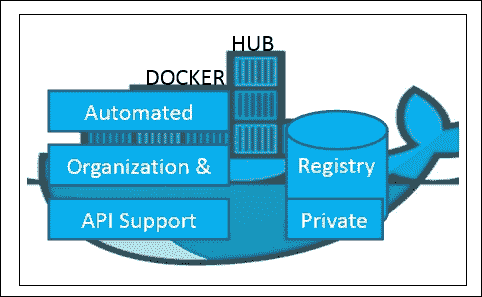

为了使用 Docker Hub，您必须向 Docker Hub 注册，并使用[https://hub.docker.com/](https://hub.docker.com/)提供的链接创建一个帐户。您可以更新 Docker Hub ID、电子邮件地址和密码字段，如下图所示:


完成注册过程后，您需要完成通过电子邮件收到的验证。电子邮件验证完成后，当您登录 Docker Hub 时，您将看到类似于以下屏幕截图的内容:

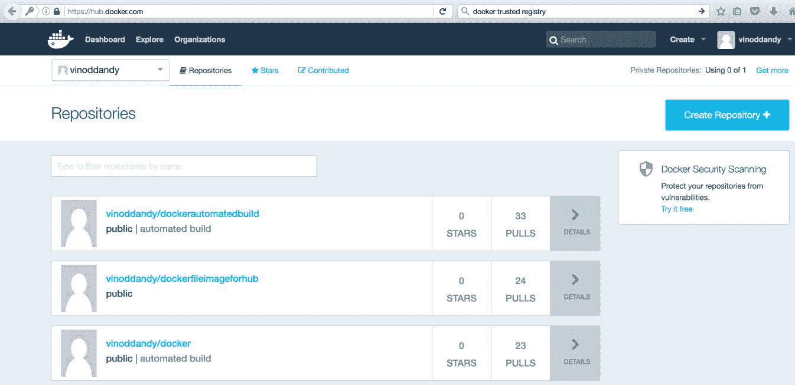

在 Docker Hub 中创建账户已成功完成，现在您可以从[https://hub.docker.com/login/](https://hub.docker.com/login/)登录到您的 Docker Hub 账户，如下图截图所示:

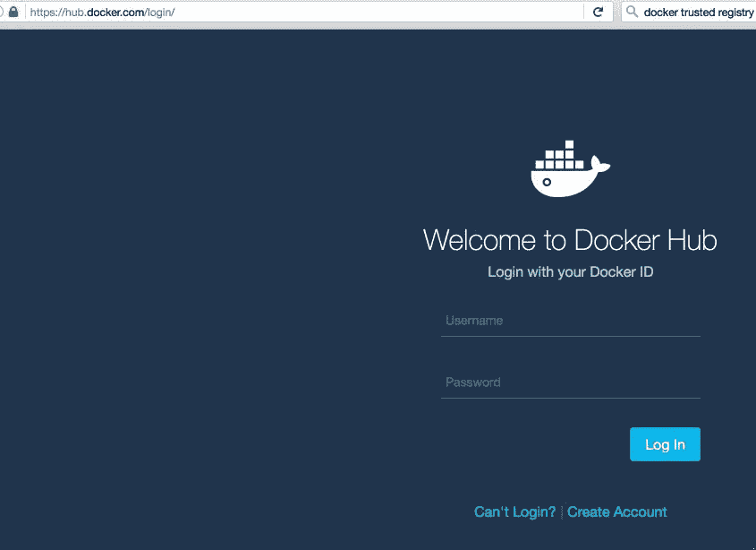

Docker Hub 还支持使用 Ubuntu 终端对 Docker Hub 进行命令行访问:

```
$ sudo docker login  

```

使用您的 Docker ID 登录，从 Docker Hub 推送和拉取映像。如果您没有Docker编号，请前往[https://hub.docker.com](https://hub.docker.com)创建一个。在终端中输入您的用户名和密码:

```
Username: vinoddandy
Password: 

```

成功登录后，输出如下:

```
Login Succeeded

```

您可以在[https://hub.docker.com/explore/](https://hub.docker.com/explore/)的 Docker Hub 中浏览可用映像，如下所示:

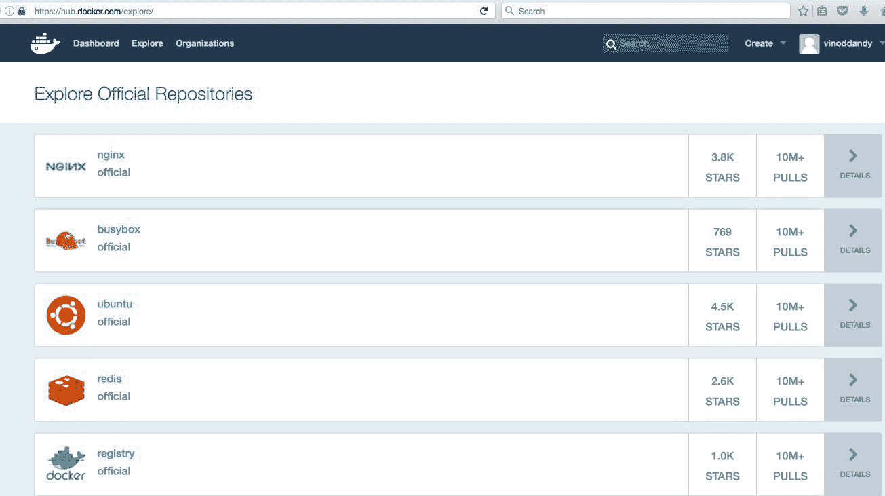

此外，您可以查看您的设置，更新您的个人资料，并获得受支持社区的详细信息，如推特、堆栈溢出、#IRC、谷歌群组和 GitHub。

## 将映像推送到 Docker 集线器

这里，我们将在本地机器上创建一个 Docker 映像，并将此映像推送到 Docker Hub。您需要在本节中执行以下步骤:

1.  通过执行以下操作之一，在本地计算机上创建 Docker 映像:

*   使用`docker commit`子命令
*   使用带有`Dockerfile`的`docker commit`子命令

2.  将此创建的映像推送到 Docker Hub
3.  从 Docker 集线器中删除映像

我们将使用`ubuntu`基础映像，运行容器，添加一个新目录和一个新文件，然后创建一个新映像。在[第 3 章](03.html)、*建筑形象*中，我们看到了如何使用`Dockerfile`创建Docker形象。你可以参考那一章来查看`Dockerfile`语法的细节。

我们将从基础`ubuntu`映像运行名为`containerforhub`的容器，如下面的终端代码所示:

```
$ sudo docker run -i --name="containerforhub" -t ubuntu /bin/bash 
Unable to find image 'ubuntu:latest' locally 
latest: Pulling from library/ubuntu 
952132ac251a: Pull complete 
Digest: sha256:f4691c96e6bbaa99d99ebafd9af1b68ace2aa2128ae95a60369c506dd6e6f6ab 
Status: Downloaded newer image for ubuntu:latest 
root@1068a1fae7da:/#  

```

接下来，我们将在`containerforhub`容器中创建新的目录和文件。我们还将使用一些示例文本更新新文件，以便稍后测试:

```
root@1068a1fae7da:/# mkdir mynewdir 
root@1068a1fae7da:/# cd mynewdir 
root@1068a1fae7da:/mynewdir# echo 'this is my new container to make image and then push to hub' > mynewfile 
root@1068a1fae7da:/mynewdir# cat mynewfile 
this is my new container to make image and then push to hub 
root@1068a1fae7da:/mynewdir# 

```

让我们用刚刚创建的容器中的`docker commit`命令构建新的映像。

The `commit` command will be executed from the host machine, from where the container is running, and not from inside this container:

```
$ sudo docker commit -m="NewImage for second edition" containerforhub vinoddandy/imageforhub2 
sha256:619a25519578b0525b4c098e3d349288de35986c1f3510958b6246fa5d3a3f56 

```

您应该使用自己的 Docker Hub 用户名代替`vinoddandy`来创建映像。

现在，我们在本地机器上有了一个名为`vinoddandy/imageforhub2`的新 Docker 映像。此时，带有`mynewdir`和`mynewfile`的新映像在本地创建:

```
$ sudo docker images -a 
REPOSITORY TAG IMAGE ID CREATED SIZE 
vinoddandy/imageforhub2 latest 619a25519578 
2 minutes ago 126.6 MB 

```

我们将使用`sudo docker login`命令登录 Docker Hub，如本章前面所述。

让我们将此映像从主机推送到 Docker Hub:

```
$ sudo docker push vinoddandy/imageforhub2 
The push refers to a repository [docker.io/vinoddandy/imageforhub2] 
0ed7a0595d8a: Pushed 
0cad5e07ba33: Mounted from library/ubuntu 
48373480614b: Mounted from library/ubuntu 
latest: digest: sha256:cd5a86d1b26ad156b0c74b0b7de449ddb1eb51db7e8ae9274307d27f810280c9 size: 1564 

```

现在，我们将登录到 Docker Hub，并在存储库中验证该映像。

为了测试 Docker Hub 中的映像，让我们从本地机器中删除这个映像。要删除映像，首先我们需要停止容器，然后删除容器:

```
$ sudo docker stop containerforhub 
$ sudo docker rm containerforhub 

```

我们也将删除`vinoddandy/imageforhub2`映像:

```
$ sudo docker rmi vinoddandy/imageforhub2
Untagged: vinoddandy/imageforhub2:latest 
Untagged: vinoddandy/imageforhub2@sha256:cd5a86d1b26ad156b0c74b0b7de449ddb1eb51db7e8ae9274307d27f810280c9 
Deleted: sha256:619a25519578b0525b4c098e3d349288de35986c1f3510958b6246fa5d3a3f56 

```

我们将从 Docker Hub 中提取新创建的映像，并在本地机器上运行新的容器:

```
$ sudo docker run -i --name="newcontainerforhub" -t \ vinoddandy/imageforhub2 /bin/bash 
Unable to find image 'vinoddandy/imageforhub2:latest' locally 
latest: Pulling from vinoddandy/imageforhub2 

952132ac251a: Already exists 
82659f8f1b76: Already exists 
Digest: sha256:cd5a86d1b26ad156b0c74b0b7de449ddb1eb51db7e8ae9274307d27f810280c9 
Status: Downloaded newer image for vinoddandy/imageforhub2:latest 
root@9dc6df728ae9:/# cat /mynewdir/mynewfile 
this is my new container to make image and then push to hub 
root@9dc6df728ae9::/# 

```

因此，我们从 Docker Hub 中提取了最新的映像，并用新的`vinoddandy/imageforhub2`映像创建了容器。请注意，`Unable to find image 'vinoddandy/imageforhub2:latest' locally`消息确认映像是从 Docker Hub 的远程存储库中下载的。

`mynewfile`中的文字验证是之前创建的同一个映像。

最后，我们将在[https://hub.docker.com/r/vinoddandy/imageforhub2/](https://hub.docker.com/r/vinoddandy/imageforhub/)从 Docker Hub 删除映像，然后点击设置，然后删除，如下图截图所示:

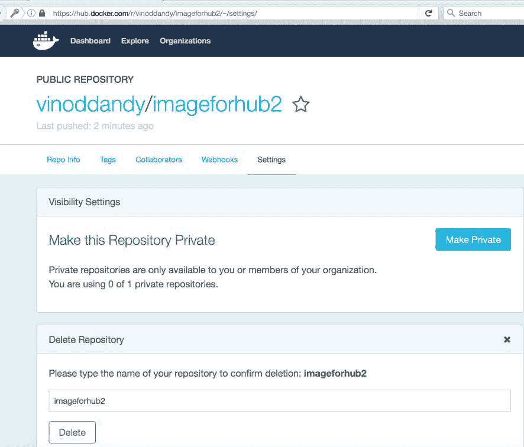

我们将再次创建这个映像，但是现在使用`Dockerfile`过程。因此，让我们使用[第 3 章](03.html)、*构建映像*中解释的`Dockerfile`概念来创建 Docker 映像，并将此映像推送到 Docker Hub。

本地机器上的`Dockerfile`如下:

```
########################################### 
# Dockerfile to build a new image 
########################################### 
# Base image is Ubuntu 
FROM ubuntu:16.04 
# Author: Dr. Peter 
MAINTAINER Dr. Peter <peterindia@gmail.com> 
# create 'mynewdir' and 'mynewfile' 
RUN mkdir mynewdir 
RUN touch /mynewdir/mynewfile 
# Write the message in file 
   RUN echo 'this is my new container to make image and then push to hub'  
 >/mynewdir/mynewfile 

```

现在，我们将使用以下命令在本地构建映像:

```
$ sudo docker build -t="vinoddandy/dockerfileimageforhub1" .
Sending build context to Docker daemon 16.74 MB
Step 1 : FROM ubuntu:16.04
16.04: Pulling from library/ubuntu
862a3e9af0ae: Pull complete 
7a1f7116d1e3: Pull complete 
Digest: sha256:5b5d48912298181c3c80086e7d3982029b288678fccabf2265899199c24d7f89
Status: Downloaded newer image for ubuntu:16.04
---> 4a725d3b3b1c
Step 2 : MAINTAINER Dr. Peter <peterindia@gmail.com>
---> Running in 5be5edc9b970
---> 348692986c9b
Removing intermediate container 5be5edc9b970
Step 3 : RUN mkdir mynewdir
---> Running in ac2fc73d75f3
---> 21585ffffab5
Removing intermediate container ac2fc73d75f3
Step 4 : RUN touch /mynewdir/mynewfile
---> Running in c64c98954dd3
---> a6304b678ea0
Removing intermediate container c64c98954dd3
Step 5 : RUN echo 'this is my new container to make image and then push to hub' > /mynewdir/mynewfile
---> Running in 7f6d087e29fa
---> 061944a9ba54
Removing intermediate container 7f6d087e29fa
Successfully built 061944a9ba54  

```

我们将使用此映像运行容器，如下所示:

```
$ sudo docker run -i --name="dockerfilecontainerforhub" -t vinoddandy/dockerfileimageforhub1 /bin/bash 
root@236bfb39fd48:/# cat /mynewdir/mynewfile 
this is my new container to make image and then push to hub 

```

`mynewdir`中的这段文字确认了新映像是用新目录和新文件正确构建的。

在 Docker Hub 中重复登录过程，并推送这个新创建的映像:

```
$ sudo docker login
Login with your Docker ID to push and pull images from Docker Hub. If you don't have a Docker ID, head over to https://hub.docker.com to create one.
Username (vinoddandy): vinoddandy
Password: 
Login Succeeded

$ sudo docker push vinoddandy/dockerfileimageforhub1
The push refers to a repository [docker.io/vinoddandy/dockerfileimageforhub1]
92e394693590: Pushed 
821a2be25576: Pushed 
dca059944a2e: Pushed 
ffb6ddc7582a: Mounted from library/ubuntu 
344f56a35ff9: Mounted from library/ubuntu 
530d731d21e1: Mounted from library/ubuntu 
24fe29584c04: Mounted from library/ubuntu 
102fca64f924: Mounted from library/ubuntu 
latest: digest: sha256:c418c88f260526ec51ccb6422e2c90d0f6fc16f1ab81da9c300160d0e0f7bd87 size: 1979

```

最后，我们可以在 Docker Hub 上验证映像的可用性:

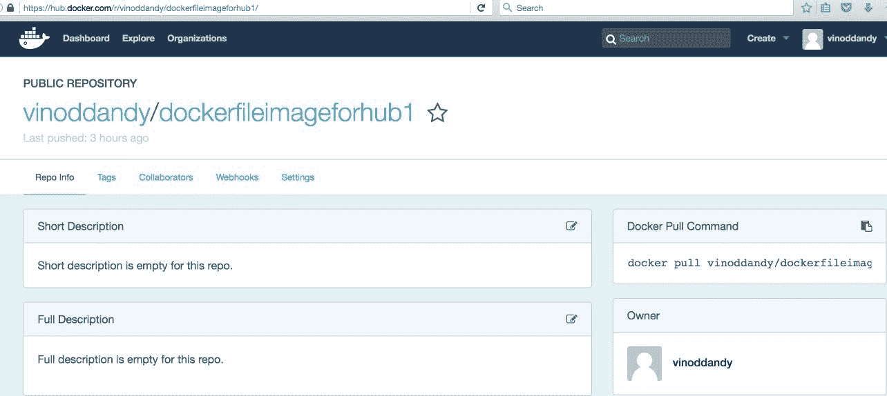

## 自动化映像的构建过程

您学习了如何在本地构建映像并将这些映像推送到 Docker Hub。Docker Hub 还具有从 GitHub 或 Bitbucket 的存储库中保存的`Dockerfile`自动构建映像的能力。GitHub 和 Bitbucket 的私有和公共存储库都支持自动化构建。Docker 中心注册表保存了所有的自动构建映像。Docker Hub 注册表是开源的，可以从[https://github.com/docker/docker-registry](https://github.com/docker/docker-registry)访问。

我们将讨论实现自动化构建过程所需的步骤:

1.  我们首先将 Docker Hub 连接到我们的 GitHub 帐户。
2.  从[https://hub.docker.com/login/](https://hub.docker.com/login/)登录 Docker Hub，点击创建，然后导航至创建自动构建，如下图截图所示:


3.  我们现在将选择链接帐户:

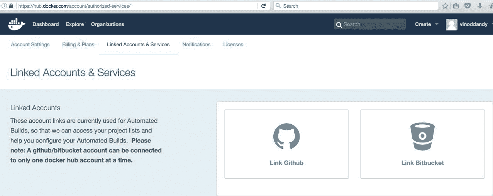

4.  选择 GitHub 后，我们将选择公共和私有(推荐)，如下所示:


点击选择后，您的 GitHub 存储库将会显示出来。

5.  现在，提供 GitHub 凭据，将您的 GitHub 帐户与 Docker Hub 链接起来，并选择登录:

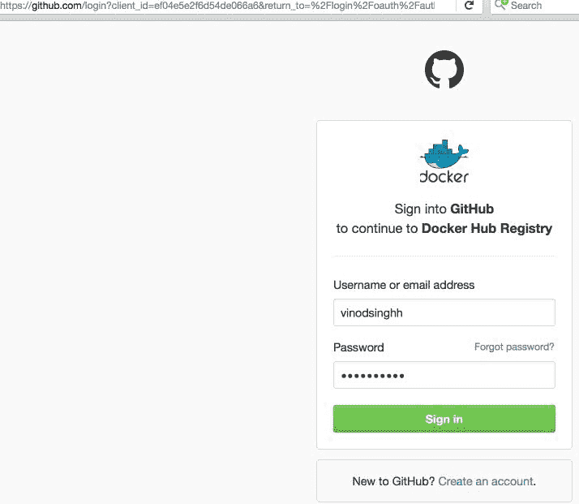

6.  成功登录后，“链接帐户和服务”屏幕如下图所示:

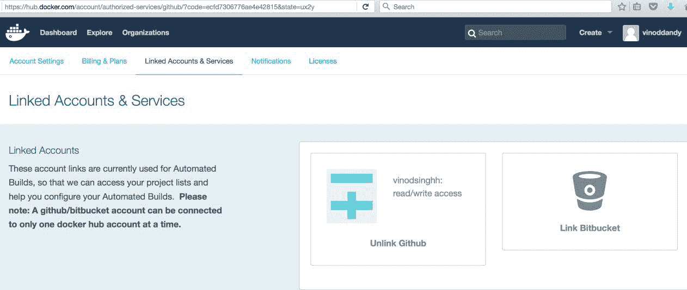

因此，每当在 GitHub 中更新`Dockerfile`时，自动构建就会被触发，一个新的映像将被存储在 Docker Hub 注册表中。我们可以随时检查构建历史。我们可以在本地机器上更改`Dockerfile`并推送到 GitHub。现在，我们可以在[看到 Docker Hub 的自动构建链接:](https://hub.docker.com/r/vinoddandy/dockerautomatedbuild/builds/)

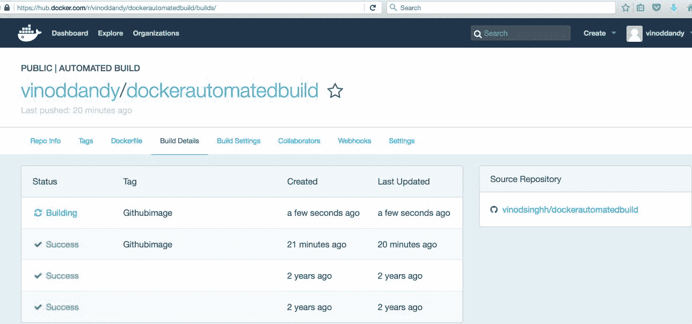

## Docker 集线器上的私有存储库

Docker Hub 提供公共和私有存储库。公共存储库对用户是免费的，私有存储库是付费服务。拥有私有存储库的计划有不同的规模，如微型、小型、中型或大型订阅。

Docker 已经在 https://github.com/docker/docker-registry向开源发布了其公共存储库代码。

通常，企业不喜欢将其 Docker 映像保存在 Docker 公共或私有存储库中。他们更喜欢保留、维护和支持他们自己的存储库。因此，Docker 还为企业提供了创建和安装自己的存储库的选项。

让我们使用 Docker 提供的`registry`映像在本地机器中创建一个存储库。我们将在本地机器上运行注册表容器，使用来自 Docker 的`registry`映像:

```
$ sudo docker run -p 5000:5000 -d registry 
768fb5bcbe3a5a774f4996f0758151b1e9917dec21aedf386c5742d44beafa41

```

在自动化构建部分，我们构建了`vinoddandy/dockerfileimageforhub1`映像。让我们将`224affbf9a65`映像标识标记到本地创建的注册表映像中。本地存储库中的唯一标识需要对映像进行标记。此映像注册表在存储库中可能有多个变体，因此此标签将帮助您识别特定的映像:

```
$ sudo docker tag 224affbf9a65 \ localhost:5000/vinoddandy/dockerfileimageforhub1  

```

标记完成后，使用`docker push`命令将该映像推送到新的注册表:

```
$ sudo docker push localhost:5000/vinoddandy/dockerfile
imageforhub1
The push refers to a repository [localhost:5000/vinoddandy/dockerfileimageforhub1
] (len: 1)
Sending image list
Pushing repository localhost:5000/vinoddandy/dockerfileimageforhub1 (1 tags)
511136ea3c5a: Image successfully pushed
d497ad3926c8: Image successfully pushed
----------------------------------------------------
224affbf9a65: Image successfully pushed
Pushing tag for rev [224affbf9a65] on {http://localhost:5000/v1/repositories/vinoddandy/dockerfileimageforhub1/tags/latest}  

```

现在，本地存储库中有了新的映像。您可以从本地注册表中检索此映像并运行容器。这个任务留给你去完成。

## Docker 中心的组织和团队

私有存储库的一个有用的方面是，您只能与您的组织或团队成员共享它们。Docker Hub 允许您创建组织，您可以在其中与同事协作并管理私有存储库。接下来，您将学习如何创建和管理组织。

第一步是在[https://hub.docker.com/organizations/add/](https://hub.docker.com/organizations/add/)的 Docker Hub 上创建一个组织，如下图截图所示:

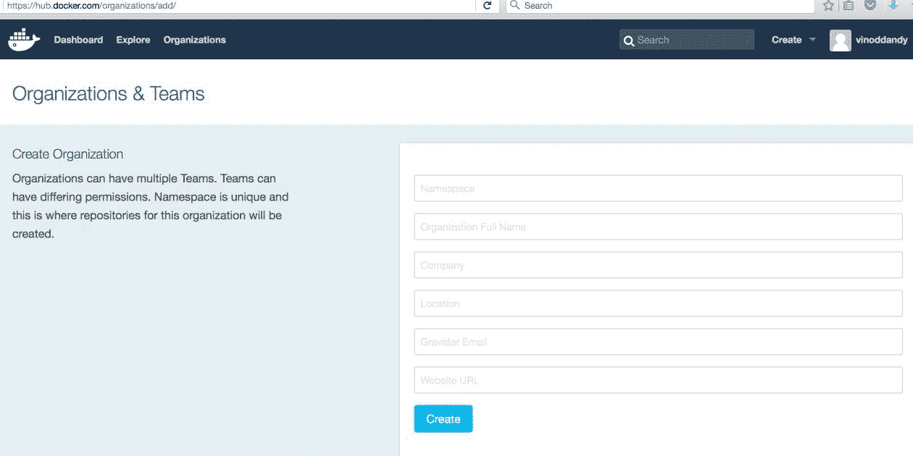

在组织内部，您可以添加更多组织，然后向其中添加成员:

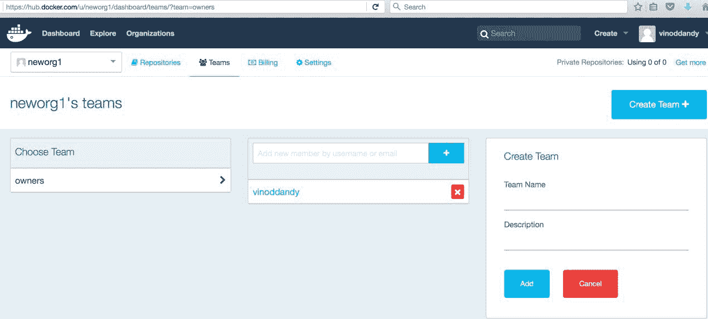

您的组织和组的成员可以与组织和团队协作。这个特性在私有存储库的情况下会更有用。

## Docker中心的休息应用编程接口

Docker Hub 提供了一个 REST API，通过程序来集成 Hub 的功能。用户和存储库管理都支持 REST 应用编程接口。

用户管理支持以下功能:

*   **用户登录**:用于用户登录 Docker Hub:

```
 GET /v1/users 
 $ curl --raw -L --user vinoddandy:password 
 https://index.docker.io/v1/users 
 4 
 "OK" 
 0 

```

*   **用户注册**:用于注册新用户:

```
 POST /v1/users 

```

*   **更新用户**:用于更新用户密码和电子邮件:

```
 PUT /v1/users/(username)/ 

```

存储库管理支持以下功能:

*   **创建用户存储库**:这将创建用户存储库:

```
 PUT /v1/repositories/(namespace)/(repo_name)/ 
 $ curl --raw -L -X POST --post301 -H 
 "Accept:application/json" -H "Content-Type: 
 application/json" --data-ascii '{"email": 
 "singh_vinod@yahoo.com", "password": "password", 
 "username": "singhvinod494" }' 
 https://index.docker.io/v1/users 
 e 
 "User created" 
 0 

```

创建存储库后，您的存储库将在此列出，如下图所示:

*   **删除用户库**:删除用户库:

```
 DELETE /v1/repositories/(namespace)/(repo_name)/ 

```

*   **创建库存储库**:这将创建一个库存储库，并且只对 Docker 管理员可用:

```
 PUT /v1/repositories/(repo_name)/ 

```

*   **删除库库**:删除库库，只对 Docker 管理员可用:

```
 DELETE /v1/repositories/(repo_name)/ 

```

*   **更新用户存储库映像**:这将更新用户存储库的映像:

```
 PUT /v1/repositories/(namespace)/(repo_name)/images 

```

*   **列出用户存储库映像**:这列出了用户存储库中的映像:

```
 GET /v1/repositories/(namespace)/(repo_name)/images 

```

*   **更新库存储库映像**:这将更新库存储库中的映像:

```
 PUT /v1/repositories/(repo_name)/images 

```

*   **列出库存储库映像**:这列出了库存储库中的映像:

```
 GET /v1/repositories/(repo_name)/images 

```

*   **授权库存储库的令牌**:这授权库存储库的令牌:

```
 PUT /v1/repositories/(repo_name)/auth 

```

*   **授权用户存储库的令牌**:授权用户存储库的令牌:

```
 PUT /v1/repositories/(namespace)/(repo_name)/auth 

```

## 摘要

Docker 映像是用于导出真实世界 Docker 容器的最突出的构建块，这些容器可以作为服务通过任何网络公开。开发人员可以查找和检查映像的独特功能，并根据自己的目的使用它们来创建高度可用、可公开发现、可通过网络访问和可认知组合的容器。所有精心制作的映像都需要放在公共注册表存储库中。在本章中，我们清楚地解释了如何在存储库中发布映像。我们还讨论了可信存储库及其独特的特性。最后，我们演示了如何利用存储库的 REST API，以编程方式推进和处理 Docker 映像和用户管理。

Docker 映像需要存储在一个公共的、可控的、可通过网络访问的位置，以便全球软件工程师和系统管理员能够轻松找到和利用。Docker Hub 被吹捧为集中聚合、策划和管理 Docker 映像的同类最佳方法，源自 Docker 爱好者(内部和外部)。然而，企业负担不起将其 Docker 映像保存在公共域中的费用，因此下一章将专门解释在私有 IT 基础架构中部署和管理映像所需的步骤。