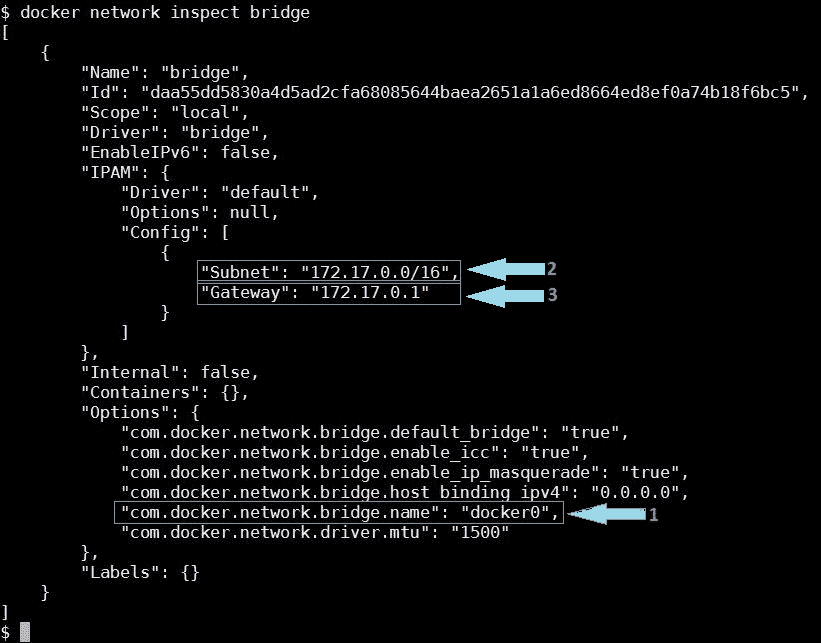
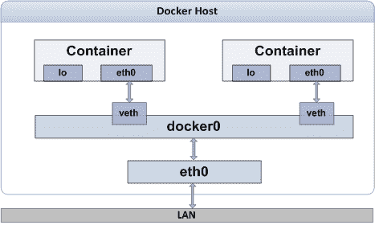

# 在容器中运行服务

到目前为止，我们已经仔细解释了 Docker 技术的各个方面。前面的章节无疑已经为被压倒性接受的 Docker 平台奠定了坚实的基础，接下来的章节将会像在这个宏伟的基础上精心打造的建筑一样。

我们描述了重要的构建块(高度可用和可重用的 Docker 映像)来产生强大的 Docker 容器。这里简要介绍了各种易于学习和使用的技术，以及如何通过设计良好的存储框架存储和共享 Docker 映像的技巧。通常，映像必须经过一系列不断的验证、确认和细化，以便对有抱负的开发社区来说是正确的和相关的。

在这一章中，我们将通过详细介绍创建小型网络服务器、在容器中运行该服务器以及使外部人员能够通过互联网连接到容器化网络服务器的关键步骤，将我们的学习提升到一个新的水平。

在本章中，我们将涵盖以下主题:

*   容器网络
*   **容器即服务**(**CaaS**)–构建、运行、暴露和连接到容器服务
*   发布和检索容器的端口
*   将容器绑定到特定的 IP 地址
*   自动生成 Docker 主机端口
*   使用`EXPOSE`和`-P`选项进行端口绑定

## 容器网络概述

网络是企业和云信息技术的关键基础设施组件。特别是，随着计算变得极其分散，网络变得不可或缺。通常，一个 Docker 主机包含多个 Docker 容器，因此网络已经成为实现复合容器化应用程序的关键组件。Docker 容器还需要与本地和远程容器进行交互和协作，以推出分布式应用程序。准确地说，不同的分布式容器需要被公开发现、网络可访问和可组合，以产生以业务为中心和过程感知的应用程序。

Docker 容器化范例的关键优势之一是无需用户付出太多努力就能无缝联网的能力。Docker 的早期版本只支持桥接网络；后来，Docker 收购了 SDN 初创公司 SocketPlane，以增加额外的网络功能。从那以后，Docker 的网络能力突飞猛进，引入了一组单独的子命令，即`docker network connect`、`docker network create`、`docker network disconnect`、`docker network inspect`、`docker network ls`和`docker network rm`，来处理 Docker 网络的本质。默认情况下，在安装过程中，Docker Engine 会为您创建三个网络，您可以使用`docker network ls`子命令列出这些网络，如下所示:


正如你在前面的截图中看到的，在 Docker 设置期间，Docker 引擎创建了`bridge`、`host`和`none` ( `null`)网络。默认情况下，当 Docker 旋转一个新容器时，它会为该容器创建一个网络堆栈，并连接到默认的`bridge`网络。但是，您可以选择使用`docker run`子命令的`--net`选项将容器连接到`host`或`none`网络或用户定义的网络。如果您选择`host`网络，容器将连接到`host`网络堆栈，并共享主机的 IP 地址和端口。`none`网络模式仅使用环回(`lo`)接口创建网络堆栈。我们可以使用`docker run --rm --net=none busybox ip addr`命令确认这一点，如下所示:


显然，正如您在前面的截图中看到的，容器只有一个环回接口。因为这个容器只有一个环回接口，所以它不能与其他容器或外部世界通信。

如果未使用`docker run`子命令的`--net`选项配置网络，则`bridge`网络是 Docker Engine 分配给容器的默认网络接口。为了更好地理解`bridge`网络，让我们首先使用`docker network inspect`子命令对其进行检查，如下所示:



在上面的截图中，我们强调了三个至关重要的见解。您可以找到 Docker 安装过程中发生的相关描述:

*   `docker0` : Docker 在 Linux 内核内部创建一个以太网桥接口，在 Docker 主机上使用`docker0`名称。该接口用作容器之间以及容器与外部网络之间传递以太网帧的桥梁。
*   `Subnet` : Docker 还从`172.17.0.0`到`172.17.255.255`的地址范围中选择了一个私有 IP 子网，并以其容器而备受尊敬。在前面的截图中，Docker 为容器选择了`172.17.0.0/16`子网。
*   `Gateway`:`docker0`接口是`bridge`网络的网关，Docker 从之前选择的 IP 子网范围中为`docker0`分配一个 IP 地址。这里，在前面的例子中，`172.17.0.1`被分配给网关。

我们可以通过使用`ip addr show` Linux 命令列出`docker0`接口来交叉检查网关地址:

```
$ ip addr show docker0

```

输出的第三行显示了分配的 IP 地址及其网络前缀:

```
inet 172.17.0.1/16 scope global docker0 

```

显然，从前面的文本来看，`172.17.0.1`是分配给以太网桥接口`docker0`的 IP 地址，在`docker network inspect bridge`命令的输出中也被列为网关地址。

现在我们已经清楚地了解了网桥创建和子网/网关地址选择过程，让我们更详细地探讨一下`bridge`模式下的容器联网。在`bridge`网络模式下，在容器启动期间，Docker Engine 创建一个具有 Loopback ( `lo`)接口和 Ethernet ( `eth0`)接口的网络堆栈。我们可以通过运行`docker run --rm busybox ip addr`命令来快速检查这一点:


显然，`ip addr`命令的前面输出显示 Docker 引擎已经为容器创建了一个具有两个网络接口的网络堆栈，如下所示:

*   第一个接口是`lo`(环回)接口，Docker 引擎为其分配了`127.0.0.1`环回地址。环回接口用于容器内的本地通信。

*   第二个接口是`eth0`(以太网)接口，Docker 引擎为其分配了`172.17.0.3` IP 地址。显然，该地址也属于`docker0`以太网桥接口的相同 IP 地址范围。此外，分配给`eth0`接口的地址用于容器内通信和主机到容器的通信。

The `ip addr` and/or `ifconfig` commands are not supported by all Docker images, including `ubuntu:14.04` and `ubuntu:16.04`. The `docker inspect` subcommand is the reliable way to find the IP address of the container.

前面我们提到了`docker0`，以太网桥接口，作为容器之间以及容器和外部世界之间传递以太网帧的管道。然而，我们还没有澄清容器如何与`docker0`桥连接。下图揭示了这种联系的一些奥秘:



如图所示，容器的`eth0`接口使用`veth`连接到`docker0`桥。`eth0`和`veth`接口属于一种特殊类型的 Linux 网络接口，称为**虚拟以太网** ( **veth** )接口。`veth`接口总是成对出现，它们就像一根水管，从一个`veth`接口发送的数据会从另一个接口出来，反之亦然。Docker 引擎将其中一个`veth`接口分配给名称为`eth0`的容器，并将容器 IP 地址分配给该接口。配对的另一个`veth`接口绑定到`docker0`桥接接口。这确保了 Docker 主机和容器之间的无缝数据流。

Docker 将私有 IP 地址分配给容器，这是无法从 Docker 主机外部访问的。然而，容器 IP 地址对于 Docker 主机内的调试来说很方便。正如我们前面提到的，许多 Docker 映像不支持`ip addr`或`ifconfig`命令，此外，我们可能无法直接访问容器提示来运行这些命令。幸运的是，Docker 提供了一个`docker inspect`子命令，它像瑞士军刀一样方便，可以深入了解 Docker 容器或映像的低级细节。`docker inspect`子命令报告了很多细节，包括 IP 地址和网关地址。实际上，您可以选择一个正在运行的容器或临时启动一个容器，如下所示:

```
$ sudo docker run -itd ubuntu:16.04   

```

这里，我们假设容器 ID 为`4b0b567b6019`，运行`docker inspect`子命令，如下图所示:

```
$ sudo docker inspect 4b0b567b6019

```

这个命令生成了大量关于容器的信息。这里，我们从`docker inspect`子命令的输出中显示了容器网络配置的一些摘录:

```
"Networks": {
 "bridge": {
 "IPAMConfig": null,
 "Links": null,
 "Aliases": null,
 "NetworkID": "ID removed for readability",
 "EndpointID": "ID removed for readability",
 "Gateway": "172.17.0.1",
 "IPAddress": "172.17.0.3",
 "IPPrefixLen": 16,
 "IPv6Gateway": "",
 "GlobalIPv6Address": "",
 "GlobalIPv6PrefixLen": 0,
 "MacAddress": "02:42:ac:11:00:03"
 }
}

```

以下是网络配置中一些重要字段的详细信息:

*   `Gateway`:这是容器的网关地址，也是`bridge`接口的地址
*   `IPAddress`:这是分配给容器的 IP 地址
*   `IPPrefixLen`:这是 IP 前缀长度，另一种表示子网掩码的方式

毫无疑问，`docker inspect`子命令非常方便找到容器或映像的细微细节。然而，仔细检查令人生畏的细节并找到我们热切寻找的正确信息是一项令人厌倦的工作。也许，您可以使用`grep`命令将其缩小到正确的信息。或者，更好的是，`docker inspect`子命令帮助您使用`docker inspect`子命令的`--format`选项从 JSON 数组中选择正确的字段。

值得注意的是，在下面的例子中，我们使用`docker inspect`子命令的`--format`选项来检索容器的 IP 地址。可通过 JSON 阵列的`.NetworkSettings.IPAddress`字段访问该 IP 地址:

```
$ sudo docker inspect \
 --format='{{.NetworkSettings.IPAddress}}' 4b0b567b6019
172.17.0.3

```

除了`none`、`host`和`bridge`网络模式外，Docker 还支持`overlay`、`macvlan`和`ipvlan`网络模式。

## 将容器视为服务

我们为 Docker 技术的基础打下了良好的基础。在本节中，我们将重点关注用 HTTP 服务创建一个映像，使用创建的映像在容器中启动 HTTP 服务，然后演示与容器中运行的 HTTP 服务的连接。

### 构建一个 HTTP 服务器映像

在本节中，我们将创建一个 Docker 映像，以便在 Ubuntu 16.04 基础映像上安装 Apache2，并使用`ENTRYPOINT`指令配置一个 Apache HTTP 服务器作为可执行文件运行。

在[第三章](03.html)、*构建映像*中，我们举例说明了`Dockerfile`的概念，在 Ubuntu 16.04 基础映像之上构建一个 Apache2 映像。这里，在这个例子中，我们将使用`ENTRYPOINT`指令，通过设置 Apache 日志路径并将 Apache2 设置为默认执行应用程序来扩展这个`Dockerfile`。以下是`Dockerfile`内容的详细说明。

我们将使用`FROM`指令构建一个以`ubuntu:16.04`为基础映像的映像，如`Dockerfile`片段所示:

```
########################################### 
# Dockerfile to build an apache2 image 
########################################### 
# Base image is Ubuntu 
FROM ubuntu:16.04 

```

使用`MAINTAINER`指令设置作者的详细信息:

```
# Author: Dr. Peter 
MAINTAINER Dr. Peter <peterindia@gmail.com> 

```

使用一条`RUN`指令，我们将同步 APT 资源库源列表，安装`apache2`包，然后清理检索到的文件:

```
# Install apache2 package 
RUN apt-get update && \ 
     apt-get install -y apache2 && \ 
     apt-get clean 

```

使用`ENV`指令设置 Apache 日志目录路径:

```
# Set the log directory PATH 
ENV APACHE_LOG_DIR /var/log/apache2 

```

现在，最后的指令是使用`ENTRYPOINT`指令启动`apache2`服务器:

```
# Launch apache2 server in the foreground 
ENTRYPOINT ["/usr/sbin/apache2ctl", "-D", "FOREGROUND"] 

```

在前一行中，您可能会惊讶地看到`FOREGROUND`参数。这是传统范例和容器范例之间的关键区别之一。在传统范例中，服务器应用程序通常作为服务或守护程序在后台启动，因为主机系统是通用系统。然而，在容器范例中，必须在前台启动一个应用程序，因为映像是为唯一目的而制作的。

已经在`Dockerfile`中规定了映像构建指令，现在让我们进入下一个逻辑步骤，通过将映像命名为`apache2`，使用`docker build`子命令构建映像，如下所示:

```
$ sudo docker build -t apache2 .  

```

现在让我们使用`docker images`子命令快速验证映像:

```
$ sudo docker images

```

正如我们在前面章节中看到的，`docker images`命令显示 Docker 主机中所有映像的详细信息。然而，为了精确地说明使用`docker build`子命令创建的映像，我们从完整的映像列表中突出显示了`apache2:latest`(目标映像)和`ubuntu:16.04`(基础映像)的细节，如以下输出片段所示:

```
    apache2 latest 1b34e47c273d About a minute ago 265.5 MB
ubuntu 16.04 f753707788c5 3 weeks ago 127.2 MB 

```

构建了 HTTP 服务器映像后，现在让我们进入下一个会话，学习如何运行 HTTP 服务。

### 将 HTTP 服务器映像作为服务运行

在本节中，我们将使用我们在上一节中创建的 Apache HTTP 服务器映像启动一个容器。这里，我们使用`docker run`子命令的`-d`选项以分离模式(类似于 UNIX 守护进程)启动容器:

```
$ sudo docker run -d apache2
9d4d3566e55c0b8829086e9be2040751017989a47b5411c9c4f170ab865afcef  

```

启动容器后，让我们运行`docker logs`子命令，看看我们的 Docker 容器是否在其 stdin(标准输入)或 stderr(标准错误)上生成任何输出:

```
$ sudo docker logs \
9d4d3566e55c0b8829086e9be2040751017989a47b5411c9c4f170ab865afcef 

```

由于我们没有完全配置 Apache HTTP 服务器，您会发现以下警告，作为`docker logs`子命令的输出:

```
AH00558: apache2: Could not reliably determine the server's fully qualified domain name, using 172.17.0.13\. Set the 'ServerName' directive globally to suppress this message

```

从前面的警告消息中，很明显分配给这个容器的 IP 地址是`172.17.0.13`。

### 连接到 HTTP 服务

在前一节中，不光彩的是，从警告信息中，我们发现容器的 IP 地址是`172.17.0.13`。在完全配置的 HTTP 服务器容器上，没有这样的警告，所以我们仍然运行`docker inspect`子命令来使用容器标识检索 IP 地址:

```
$ sudo docker inspect \
--format='{{.NetworkSettings.IPAddress}}' 
9d4d3566e55c0b8829086e9be2040751017989a47b5411c9c4f170ab865afcef
172.17.0.13

```

找到了作为`172.17.0.13`的容器的 IP 地址后，让我们使用`wget`命令，从 Docker 主机的 shell 提示符中快速运行一个关于这个 IP 地址的 web 请求。在这里，我们选择用`-qO -`运行`wget`命令，以便在安静模式下运行，并在屏幕上显示检索到的 HTML 文件:

```
$ wget -qO - 172.17.0.13

```

在这里，我们只展示了检索到的 HTML 文件的前五行:

```
<!DOCTYPE html PUBLIC "-//W3C//DTD XHTML 1.0 Transitional//EN" 
 "http://www.w3.org/TR/xhtml1/DTD/xhtml1-transitional.dtd"> 
<html > 
  <!-- 
    Modified from the Debian original for Ubuntu 
    Last updated: 2014-03-19 

```

太棒了，不是吗？我们让我们的第一个服务在一个容器中运行，我们能够从我们的 Docker 主机中获得我们的服务。

此外，在普通的 Docker 安装中，Docker 主机中的任何其他容器都可以访问一个容器提供的服务。您可以继续，在交互模式下启动一个新的 Ubuntu 容器，使用`apt-get`安装`wget`包，并运行相同的`wget -qO - 172.17.0.13`命令，就像我们在 Docker 主机中所做的那样。当然，您会看到相同的输出。

## 公开容器服务

到目前为止，我们成功地启动了一个 HTTP 服务，并从 Docker 主机以及同一 Docker 主机内的另一个容器访问了该服务。此外，如[第 2 章](02.html)*处理Docker容器*的*从容器*构建映像部分所示，容器能够通过互联网连接到公共可用的 APT 存储库来成功安装`wget`包。尽管如此，默认情况下，外部世界无法访问容器提供的服务。一开始，这似乎是 Docker 技术的一个限制。然而，事实是，容器通过设计与外界隔绝。

Docker 通过 IP 地址分配标准实现容器的网络隔离，如下所述:

*   为容器分配一个无法从外部网络访问的私有 IP 地址
*   在主机的 IP 网络之外为容器分配一个 IP 地址

因此，即使从连接到与 Docker 主机相同的 IP 网络的系统也无法到达 Docker 容器。这种分配方案还提供了保护，防止可能出现的 IP 地址冲突。

现在，您可能想知道如何让服务在外部世界可以访问的容器中运行，换句话说，公开容器服务。好吧，Docker 利用了 Linux 的功能，以一种优雅的方式弥合了这种连接差距。

在前端，Docker 为其用户提供了两种不同的构建模块来弥补这一连接差距。构建模块之一是使用`docker run`子命令的`-p`(向主机接口发布容器端口)选项绑定容器端口。另一种选择是结合使用`Dockerfile`的`EXPOSE`指令和`docker run`子命令的`-P`(将所有暴露的端口发布到主机接口)选项。

### 发布容器的端口选项

Docker 使您能够通过将容器的端口绑定到主机接口来发布容器内部提供的服务。`docker run`子命令的`-p`选项使您能够将容器端口绑定到 Docker 主机的用户指定或自动生成的端口。因此，目的地为Docker主机的 IP 地址和端口的任何通信将被转发到容器的端口。`-p`选项实际上支持以下四种形式的参数:

*   `<hostPort>:<containerPort>`
*   `<containerPort>`
*   `<ip>:<hostPort>:<containerPort>`
*   `<ip>::<containerPort>`

这里，`<ip>`是 Docker 主机的 IP 地址，`<hostPort>`是 Docker 主机端口号，`<containerPort>`是容器的端口号。在本节中，我们向您展示`-p <hostPort>:<containerPort>`格式，并在后续章节中介绍其他格式。

为了更好地理解端口绑定过程，让我们重用之前创建的`apache2` HTTP 服务器映像，并使用`docker run`子命令的`-p`选项旋转容器。`80`端口是 HTTP 服务的发布端口，作为默认行为，我们的`apache2` HTTP 服务器也可以在端口`80`上使用。这里，为了展示这种能力，我们将使用`docker run`子命令的`-p <hostPort>:<containerPort>`选项，将容器的端口`80`绑定到 Docker 主机的端口`80`，如下命令所示:

```
$ sudo docker run -d -p 80:80 apache2
baddba8afa98725ec85ad953557cd0614b4d0254f45436f9cb440f3f9eeae134

```

现在我们已经成功启动了容器，我们可以使用任何外部系统的任何网络浏览器连接到我们的 HTTP 服务器(前提是它具有网络连接性)来访问我们的 Docker 主机。

到目前为止，我们还没有向我们的`apache2` HTTP 服务器映像添加任何网页。因此，当我们从网络浏览器连接时，我们会看到下面的屏幕，它只是 Ubuntu Apache2 包附带的默认页面:


### 容器的网络地址转换

在前一节中，我们看到了`-p 80:80`选项是如何发挥魔力的，不是吗？嗯，实际上，在引擎盖下，Docker Engine 通过在 Linux `iptables`配置文件中自动配置**网络地址转换** ( **NAT** )规则来实现这种无缝连接。

为了说明在 Linux `iptables`中 NAT 规则的自动配置，让我们查询 Docker 主机`iptables`的 NAT 条目，如下所示:

```
$ sudo iptables -t nat -L -n  

```

接下来的文本是从`iptables` NAT 条目中摘录的，它是由 Docker 引擎自动添加的:

```
Chain DOCKER (2 references)
target prot opt source destination
DNAT tcp -- 0.0.0.0/0 0.0.0.0/0 tcp dpt:80 to:172.17.0.14:80

```

从前面的摘录中，很明显 Docker 引擎有效地增加了一个`DNAT`规则。以下是`DNAT`规则的细节:

*   `tcp`关键字表示此`DNAT`规则仅适用于 TCP 传输协议。
*   第一个`0.0.0.0/0`地址是源地址的元 IP 地址。该地址表示连接可以来自任何 IP 地址。
*   第二个`0.0.0.0/0`地址是 Docker 主机上目的地址的元 IP 地址。该地址表示可以连接到 Docker 主机中的任何有效 IP 地址。
*   最后，`dpt:80 to:172.17.0.14:80`是转发指令，用于将 Docker 主机的端口`80`上的任何 TCP 活动转发到`172.17.0.17` IP 地址，即我们的容器和端口`80`的 IP 地址。

Therefore, any TCP packet that the Docker host receives on port `80` will be forwarded to port `80` of the container.

### 正在检索容器端口

Docker 引擎至少提供了三种不同的选项来检索容器的端口绑定详细信息。在这里，让我们首先探索选项，然后，继续剖析检索到的信息。选项如下:

*   `docker ps`子命令始终显示容器的端口绑定详细信息，如下所示:

```
 $ sudo docker ps
 CONTAINER ID IMAGE COMMAND 
 CREATED STATUS PORTS 
 NAMES
 baddba8afa98 apache2:latest 
 "/usr/sbin/apache2ct 
 26 seconds ago Up 25 seconds 
 0.0.0.0:80->80/tcp 
 furious_carson

```

*   `docker inspect`子命令是另一种选择；然而，你必须浏览相当多的细节。运行以下命令:

```
      $ sudo docker inspect baddba8afa98

```

*   `docker inspect`子命令显示三个 JSON 对象中的端口绑定相关信息，如下图所示:

*   `ExposedPorts`对象枚举通过`Dockerfile`中的`EXPOSE`指令暴露的所有端口，以及使用`docker run`子命令中的`-p`选项映射的容器端口。由于我们没有在`Dockerfile`中添加`EXPOSE`指令，我们所拥有的只是使用`-p 80:80`作为参数映射到`docker run`子命令的容器端口:

```
             "ExposedPorts": {
 "80/tcp": {}
 },

```

*   `PortBindings`对象是`HostConfig`对象的一部分，该对象列出了通过`docker run`子命令中的`-p`选项完成的所有端口绑定。该对象不会列出通过`Dockerfile`中的`EXPOSE`指令暴露的端口:

```
 "PortBindings": {
 "80/tcp": [
 {
 "HostIp": "",
 "HostPort": "80"
 }
 ]
 },

```

*   `NetworkSettings`对象的`Ports`对象具有与前面的`PortBindings`对象相同的细节级别。但是，该对象包括通过`Dockerfile`中的`EXPOSE`指令显示的所有端口，以及使用`docker run`子命令中的`-p`选项映射的容器端口:

```
 "NetworkSettings": {
 "Bridge": "",
 "SandboxID":"ID removed for readability",
 "HairpinMode": false,
 "LinkLocalIPv6Address": "",
 "LinkLocalIPv6PrefixLen": 0,
 "Ports": {
 "80/tcp": [
 {
 "HostIp": "0.0.0.0",
 "HostPort": "80"
 }
 ]
 },

```

当然，可以使用`docker inspect`子命令的`--format`选项过滤特定端口字段。

`docker port`子命令使您能够通过指定容器的端口号来检索 Docker 主机上的端口绑定:

```
$ sudo docker port baddba8afa98 80
0.0.0.0:80  

```

显然，在前面的所有输出摘录中，突出的信息是`0.0.0.0` IP 地址和`80`端口号。`0.0.0.0` IP 地址是一个元地址，代表 Docker 主机上配置的所有 IP 地址。实际上，`80`容器的端口绑定到 Docker 主机上的所有有效 IP 地址。因此，可以通过 Docker 主机上配置的任何有效 IP 地址来访问 HTTP 服务。

### 将容器绑定到特定的 IP 地址

到目前为止，通过您学习的方法，容器总是绑定到 Docker 主机上配置的所有 IP 地址。但是，您可能希望在不同的 IP 地址上提供不同的服务。换句话说，特定的 IP 地址和端口将被配置为提供特定的服务。我们可以在 Docker 中使用`docker run`子命令的`-p <ip>:<hostPort>:<containerPort>`选项来实现这一点，如下例所示:

```
$ sudo docker run -d -p 198.51.100.73:80:80 apache2
92f107537bebd48e8917ea4f4788bf3f57064c8c996fc23ea0fd8ea49b4f3335  

```

这里，IP 地址必须是 Docker 主机上的有效 IP 地址。如果指定的 IP 地址不是 Docker 主机上的有效 IP 地址，容器启动将失败并显示错误消息，如下所示:

```
2014/11/09 10:22:10 Error response from daemon: Cannot start container 
99db8d30b284c0a0826d68044c42c370875d2c3cad0b87001b858ba78e9de53b: 
Error starting user land proxy: listen tcp 10.110.73.34:49153: bind:cannot assign requested address

```

现在，让我们快速查看前面示例的端口映射和 NAT 条目:

*   以下文本是显示该容器详细信息的`docker ps`子命令输出的摘录:

```
 92f107537beb apache2:latest "/usr/sbin/apache2ct 
 About a minute ago Up About a minute 198.51.100.73:80->80/tcp 
 boring_ptolemy

```

*   以下文本是`iptables -n nat -L -n`命令输出的摘录，显示了为此容器创建的`DNAT`条目:

```
 DNAT tcp -- 0.0.0.0/0 198.51.100.73 tcp dpt:80 
 to:172.17.0.15:80

```

在查看了`docker run`子命令的输出和`iptables`的`DNAT`条目后，您将会意识到 Docker 引擎在 Docker 主机的`198.51.100.73` IP 地址和`80`端口上配置了容器提供的服务是多么优雅。

### 自动生成 Docker 主机端口

Docker 容器天生就是轻量级的，由于它们的轻量级特性，您可以在单个 Docker 主机上运行具有相同或不同服务的多个容器。特别是，根据需求跨多个容器自动扩展相同的服务是当今信息技术基础设施的需要。在本节中，您将了解到使用相同服务旋转多个容器的挑战，以及 Docker 解决这一挑战的方式。

在本章的前面，我们通过绑定到 Docker 主机的端口`80`，使用 Apache2 HTTP 服务器启动了一个容器。现在，如果我们尝试再启动一个具有相同端口`80`绑定的容器，该容器将无法以错误消息开始，如下例所示:

```
$ sudo docker run -d -p 80:80 apache2
6f01f485ab3ce81d45dc6369316659aed17eb341e9ad0229f66060a8ba4a2d0e
2014/11/03 23:28:07 Error response from daemon: Cannot start container 
6f01f485ab3ce81d45dc6369316659aed17eb341e9ad0229f66060a8ba4a2d0e: 
Bind for 0.0.0.0:80 failed: port is already allocated  

```

显然，在前面的例子中，容器无法启动，因为前面的容器已经映射到`0.0.0.0`(Docker 主机的所有 IP 地址)和端口`80`。在 TCP/IP 通信模型中，IP 地址、端口和传输协议(TCP、UDP 等)的组合必须是唯一的。

我们可以通过手动选择 Docker 主机端口号(例如，`-p 81:80`或`-p 8081:80`)来克服这个问题。虽然这是一个很好的解决方案，但它不能很好地扩展到自动扩展场景。相反，如果我们将控制权交给 Docker，它将自动生成 Docker 主机上的端口号。通过使用`docker run`子命令的`-p <containerPort>`选项，不指定 Docker 主机端口号来生成端口号，如下例所示:

```
$ sudo docker run -d -p 80 apache2
ea3e0d1b18cff40ffcddd2bf077647dc94bceffad967b86c1a343bd33187d7a8  

```

用自动生成的端口成功启动新容器后，让我们查看端口映射以及前面示例的 NAT 条目:

*   以下文本是显示该容器详细信息的`docker ps`子命令输出的摘录:

```
 ea3e0d1b18cf apache2:latest "/usr/sbin/apache2ct 
 5 minutes ago Up 5 minutes 0.0.0.0:49158->80/tcp 
 nostalgic_morse  

```

*   以下文本是`iptables -n nat -L -n`命令输出的摘录，显示了为此容器创建的`DNAT`条目:

```
 DNAT tcp -- 0.0.0.0/0 0.0.0.0/0 tcp dpt:49158 
 to:172.17.0.18:80  

```

在查看了`docker run`子命令的输出和`iptables`的`DNAT`条目后，最突出的是`49158`端口号。`49158`端口号由 Docker 主机上的 Docker 引擎在底层操作系统的帮助下统一自动生成。此外，`0.0.0.0`元 IP 地址意味着容器提供的服务可以通过 Docker 主机上配置的任何有效 IP 地址从外部访问。

您可能有一个想要自动生成端口号的用例。但是，如果您仍然希望将服务限制在 Docker 主机的特定 IP 地址，可以使用`docker run`子命令的`-p <IP>::<containerPort>`选项，如下例所示:

```
$ sudo docker run -d -p 198.51.100.73::80 apache2
6b5de258b3b82da0290f29946436d7ae307c8b72f22239956e453356532ec2a7

```

在前面两个场景中，Docker 引擎在 Docker 主机上自动生成端口号，并将其暴露给外部世界。网络通信的一般规范是通过预定义的端口号公开任何服务，以便任何人都知道 IP 地址，并且端口号可以轻松访问所提供的服务。然而，这里的端口号是自动生成的，因此，外部世界不能直接到达所提供的服务。因此，这种容器创建方法的主要目的是实现自动缩放，以这种方式创建的容器将与预定义端口上的代理或负载平衡服务接口。

### 使用 EXPOSE 和-P 选项的端口绑定

到目前为止，我们已经讨论了向外部世界发布在容器内部运行的服务的四种不同方法。在所有这四种方法中，端口绑定决定是在容器启动期间做出的，并且该映像没有关于提供服务的端口的信息。到目前为止，它运行良好，因为我们正在建立形象，我们非常了解提供服务的港口。

然而，在第三方映像的情况下，容器内部的端口使用必须明确地公布。此外，如果我们为第三方消费甚至为我们自己使用而构建映像，那么显式地声明容器提供服务的端口是一个很好的做法。也许，映像构建者可以随映像一起发送一个自述文件。然而，更好的做法是将端口详细信息嵌入到映像本身中，以便您可以手动或通过自动脚本轻松地从映像中找到端口详细信息。

Docker 技术允许我们使用`Dockerfile`中的`EXPOSE`指令嵌入端口信息，我们在[第 3 章](03.html)、*建筑映像*中介绍了该指令。在这里，让我们编辑一下本章前面我们用来构建`apache2` HTTP 服务器映像的`Dockerfile`，并添加一个`EXPOSE`指令，如下代码所示。HTTP 服务的默认端口是端口`80`，因此会显示端口`80`:

```
########################################### 
# Dockerfile to build an apache2 image 
########################################### 
# Base image is Ubuntu 
FROM ubuntu:16.04 
# Author: Dr. Peter 
MAINTAINER Dr. Peter <peterindia@gmail.com> 
# Install apache2 package 
RUN apt-get update &&  
     apt-get install -y apache2 &&  
     apt-get clean 
# Set the log directory PATH 
ENV APACHE_LOG_DIR /var/log/apache2 
# Expose port 80 
EXPOSE 80 
# Launch apache2 server in the foreground 
ENTRYPOINT ["/usr/sbin/apache2ctl", "-D", "FOREGROUND"] 

```

现在我们已经将`EXPOSE`指令添加到我们的`Dockerfile`中，让我们进入下一步，使用`docker build`命令构建映像。在这里，让我们重复使用`apache2`映像名称，如下图所示:

```
$ sudo docker build -t apache2 .  

```

成功构建映像后，让我们检查映像以验证`EXPOSE`指令对映像的效果。如前所述，我们可以使用`docker inspect`子命令，如下所示:

```
$ sudo docker inspect apache2  

```

仔细查看前面命令生成的输出，您会发现 Docker 将公开的端口信息存储在`Config`对象的`ExposedPorts`字段中。以下是如何显示公开端口信息的摘录:

```
"ExposedPorts": {
 "80/tcp": {}
},  

```

或者，您可以将`--format`选项应用到`docker inspect`子命令，以便将输出缩小到非常具体的信息。在这种情况下，`Config`对象的`ExposedPorts`字段如下例所示:

```
$ sudo docker inspect --format='{{.Config.ExposedPorts}}' apache2
map[80/tcp:map[]]  

```

为了继续讨论`EXPOSE`指令，我们现在可以使用刚刚制作的`apache2`映像旋转容器。然而，`EXPOSE`指令本身不能在 Docker 主机上创建端口绑定。为了为使用`EXPOSE`指令声明的端口创建端口绑定，Docker 引擎在`docker run`子命令中提供了一个`-P`选项。

在下面的示例中，从较早重建的`apache2`映像启动一个容器。这里，`-d`选项用于在分离模式下启动容器，`-P`选项用于使用`Dockerfile`中的`EXPOSE`指令在 Docker 主机上为所有声明的端口创建端口绑定:

```
$ sudo docker run -d -P apache2
fdb1c8d68226c384ab4f84882714fec206a73fd8c12ab57981fbd874e3fa9074  

```

现在，我们已经使用使用`EXPOSE`指令创建的映像启动了新容器，就像前面的容器一样，让我们查看前面示例的端口映射和 NAT 条目:

*   以下文本是显示该容器详细信息的`docker ps`子命令输出的摘录:

```
      ea3e0d1b18cf apache2:latest "/usr/sbin/apache2ct 
 5 minutes ago Up 5 minutes 0.0.0.0:49159->80/tcp 
 nostalgic_morse 

```

*   以下文本是`iptables -t nat -L -n`命令输出的摘录，显示了为此容器创建的`DNAT`条目:

```
      DNAT tcp -- 0.0.0.0/0 0.0.0.0/0 
 tcp dpt:49159 to:172.17.0.19:80

```

`docker run`子命令的`-P`选项不接受任何附加参数，如 IP 地址或端口号；因此，不可能对端口绑定进行微调，例如`docker run`子命令的`-p`选项。如果端口绑定的微调对您至关重要，您可以随时使用`docker run`子命令的`-p`选项。

## 摘要

容器不会以孤立或单独的方式运送任何实质性的东西。需要系统地构建它们，并为它们提供网络接口和端口号。这些导致了容器向外部世界的标准化展示，便于其他主机或容器在任何网络上查找、绑定和利用它们的独特功能。因此，网络可访问性对于容器被注意到并以无数方式被利用来说是至关重要的。这一章专门展示了容器是如何作为服务被设计和部署的，以及随着时间的推移，容器网络是如何在精确和丰富地增强容器服务这一特殊领域中派上用场的。在接下来的章节中，我们将详细讨论软件密集型 IT 环境中 Docker 容器的各种功能。