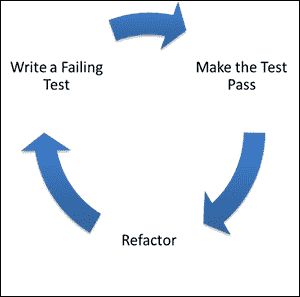
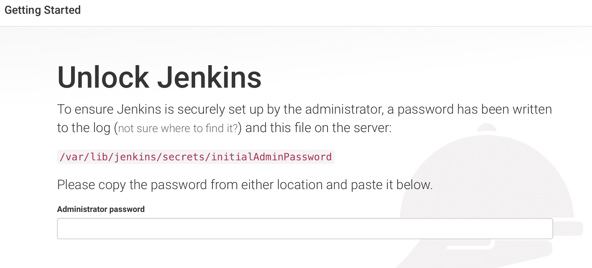
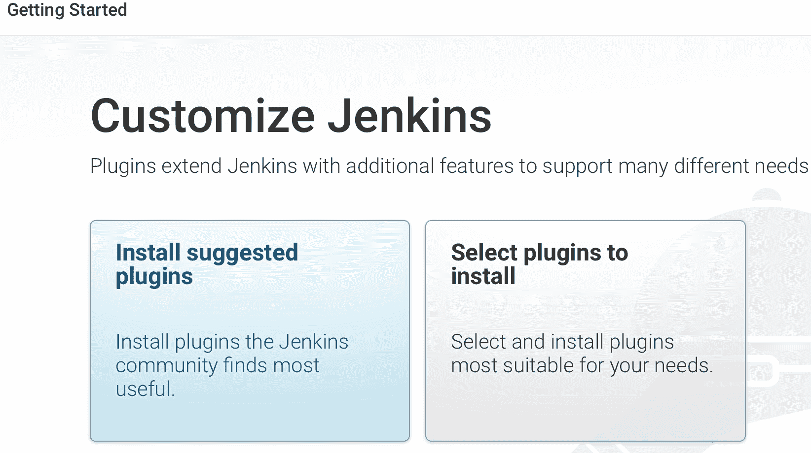
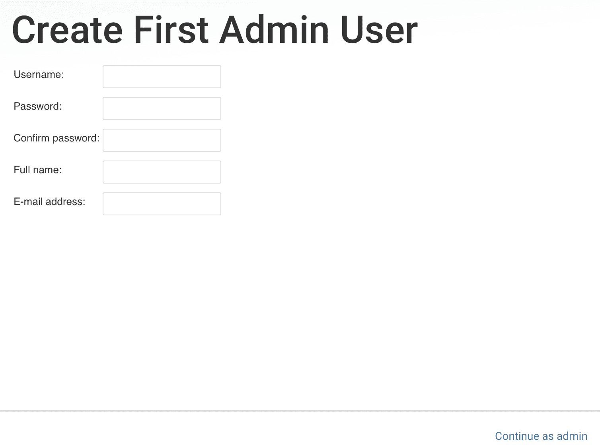
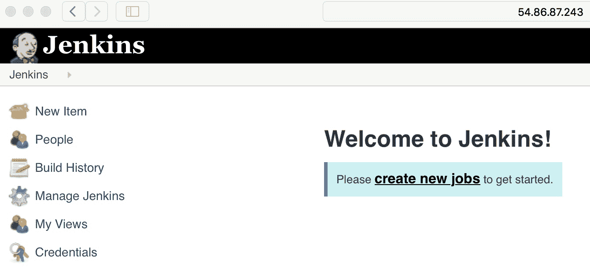
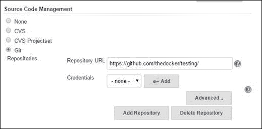
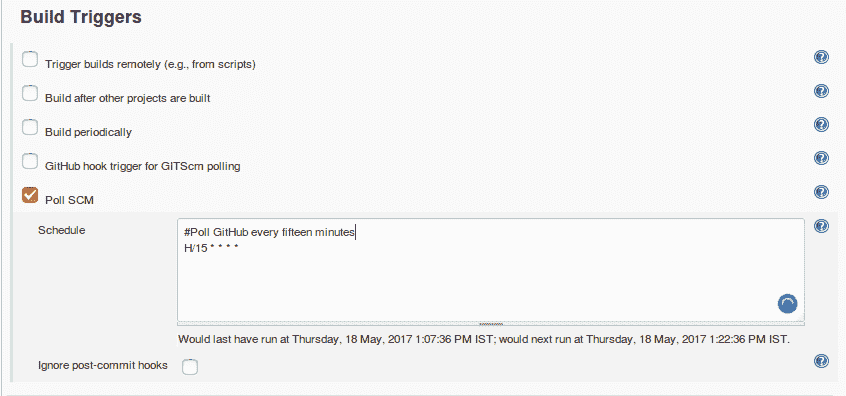
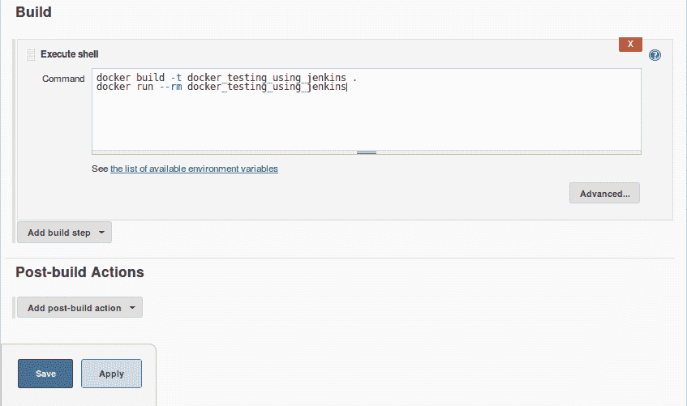
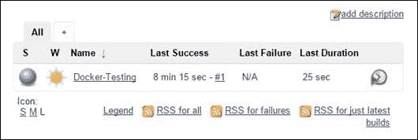
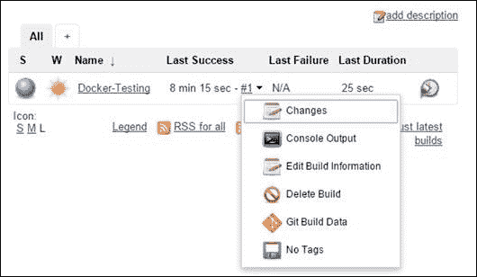

# 用 Docker 测试

毫无疑问，测试的特性一直处于软件工程学科的前沿。如今，为了拥有大量智能、互联和数字化的资产，软件在我们日常环境中的各种有形物体中的深入和决定性存在被广泛接受。此外，随着对分布式和同步软件的日益关注，软件设计、开发、测试和调试、部署和交付的复杂性也在不断上升。各种方法和机制被发掘出来，以简化和精简软件构建的迫切需要的自动化以及软件可靠性、弹性和可持续性的认证。Docker 正在成为一种极其灵活的工具来测试各种各样的软件应用程序。在本章中，我们将讨论如何有效地利用 Docker 在软件测试方面的显著进步及其在加速和增强测试自动化方面的独特优势。

本章将讨论以下主题:

*   TDD 概述
*   在 Docker 中测试您的代码
*   将 Docker 测试过程集成到 Jenkins 中

Docker 容器目前正被用来创建开发和测试环境，它们是生产环境的精确副本。与虚拟机相比，容器需要更少的开销，虚拟机一直是开发、转移和部署环境的主要环境。让我们从下一代软件的**测试驱动开发** ( **TDD** )以及 Docker 启发的容器化在简化 TDD 过程中是如何变得得心应手的概述开始。

## TDD 概述

在过去的几十年里，软件开发的漫长而艰难的旅程经历了许多波折，然而其中一个突出的软件工程技术是 TDD。

For more details and documents on TDD refer to [http://agiledata.org/essays/tdd.html](http://agiledata.org/essays/tdd.html).

简单来说，TDD 是一种软件开发实践，其中开发周期从编写一个会失败的测试用例开始，然后编写实际的软件使测试通过，并继续重构和重复这个周期，直到软件达到可接受的水平。下图描述了这一过程:



## 在 Docker 中测试您的代码

在本节中，我们将带您完成一段旅程，在这段旅程中，我们将向您展示如何使用存根来完成 TDD，以及在部署等效系统中开发软件时，Docker 如何派上用场。为此，我们采用一个 web 应用程序用例，该用例具有跟踪每个用户访问次数的功能。对于这个例子，我们使用 Python 作为实现语言，`redis`作为键值对数据库来存储用户命中次数。此外，为了展示 Docker 的测试能力，我们将我们的实现限制在两个功能上——`hit`和`getHit`。

All the examples in this chapter use Python 3 as the runtime environment. The Ubuntu 16.04 installation comes with Python 3 by default. If you don't have Python 3 installed on your system, refer to the respective manual to install Python 3.

根据 TDD 实践，我们从为`hit`和`getHit`函数添加单元测试用例开始，如下面的代码片段所示。这里，测试文件被命名为`test_hitcount.py`:

```
import unittest 
import hitcount 

class HitCountTest (unittest.TestCase): 
     def testOneHit(self): 
         # increase the hit count for user user1 
         hitcount.hit("user1") 
         # ensure that the hit count for user1 is just 1 
         self.assertEqual(b'1', hitcount.getHit("user1")) 

if __name__ == '__main__': 
    unittest.main() 

```

这个例子在[https://github.com/thedocker/testing/tree/master/src](https://github.com/thedocker/testing/tree/master/src)也有。

这里，在第一行，我们正在导入`unittest` Python 模块，该模块提供了运行单元测试和生成测试执行详细报告所需的框架和功能。在第二行中，我们将导入`hitcount` Python 模块，在这里我们将实现命中计数功能。然后，我们将继续添加测试`hitcount`模块功能的测试代码。

现在，使用 Python 的单元测试框架运行测试套件，如下所示:

```
$ python3 -m unittest   

```

以下是单元测试框架生成的输出:

```
E
======================================================================
ERROR: test_hitcount (unittest.loader.ModuleImportFailure)
----------------------------------------------------------------------
Traceback (most recent call last):
...OUTPUT TRUNCATED ...
ImportError: No module named 'hitcount'

----------------------------------------------------------------------
Ran 1 test in 0.001s

FAILED (errors=1)

```

不出所料，测试失败，出现`ImportError: No module named 'hitcount'`错误消息，因为我们甚至没有创建文件，因此无法导入`hitcount`模块。

现在，在与`test_hitcount.py`相同的目录下创建一个名为`hitcount.py`的文件:

```
$ touch hitcount.py  

```

继续运行单元测试套件:

```
$ python3 -m unittest  

```

以下是单元测试框架生成的输出:

```
E
======================================================================
ERROR: testOneHit (test_hitcount.HitCountTest)
----------------------------------------------------------------------
Traceback (most recent call last):
 File "/home/user/test_hitcount.py", line 10, in testOneHit
 hitcount.hit("peter")
AttributeError: 'module' object has no attribute 'hit'

---------------------------------------------------------------------- 
Ran 1 test in 0.001s

FAILED (errors=1)

```

同样，测试套件像前面一样失败了，但是出现了不同的错误消息`AttributeError: 'module' object has no attribute 'hit'`。我们得到这个错误是因为我们还没有实现`hit`功能。

让我们继续在`hitcount.py`中实现`hit`和`getHit`功能，如下图所示:

```
import redis 
# connect to redis server 
r = redis.StrictRedis(host='0.0.0.0', port=6379, db=0) 

# increase the hit count for the usr 
def hit(usr): 
    r.incr(usr) 

# get the hit count for the usr 
def getHit(usr): 
    return (r.get(usr)) 

```

这个例子也可以在 https://github.com/thedocker/testing/tree/master/src 的 GitHub 上找到。

To continue with this example, you must have the Python 3 compatible version of package installer (`pip3`).

以下命令用于安装`pip3`:

```
$ wget -qO- https://bootstrap.pypa.io/get-pip.py | sudo python3 -

```

在前面程序的第一行，我们正在导入`redis`驱动程序，它是`redis`数据库的连接驱动程序。在下面一行中，我们正在连接到`redis`数据库，然后我们将继续实现`hit`和`getHit`功能。

`redis`驱动程序是可选的 Python 模块，所以让我们使用`pip`安装程序继续安装`redis`驱动程序，如下图所示:

```
$ sudo pip3 install redis  

```

即使安装了`redis`驱动程序，我们的`unittest`模块仍然会失败，因为我们还没有运行`redis`数据库服务器。因此，我们可以运行一个`redis`数据库服务器来成功地完成我们的单元测试，或者采用嘲笑`redis`驱动程序的传统 TDD 方法。模仿是一种测试方法，其中复杂的行为被预先定义或模拟的行为所替代。在我们的示例中，为了模拟`redis`驱动程序，我们将利用名为`mockredis`的第三方 Python 包。该模拟包在[https://github.com/locationlabs/mockredis](https://github.com/locationlabs/mockredis)提供，`pip`安装程序名称为`mockredispy`。让我们使用`pip`安装程序安装这个模拟:

```
$ sudo pip3 install mockredispy  

```

安装了`mockredispy`、`redis` mock 之后，让我们重构我们的测试代码`test_hitcount.py`(我们之前已经写过了)来使用由`mockredis`模块提供的模拟的`redis`功能。这是通过`unittest.mock`嘲讽框架提供的`patch`方法完成的，如下代码所示:

```
import unittest 
from unittest.mock import patch 

# Mock for redis 
import mockredis 
import hitcount 

class HitCountTest(unittest.TestCase): 

    @patch('hitcount.r',
        mockredis.mock_strict_redis_client(host='0.0.0.0', 
        port=6379,  db=0)) 
    def testOneHit(self): 
        # increase the hit count for user user1 
        hitcount.hit("user1") 
        # ensure that the hit count for user1 is just 1 
        self.assertEqual(b'1', hitcount.getHit("user1")) 

if __name__ == '__main__': 
    unittest.main() 

```

这个例子也可以在 https://github.com/thedocker/testing/tree/master/src 的 GitHub 上找到。

现在，再次运行测试套件:

```
$ python3 -m unittest
.
----------------------------------------------------------------------
Ran 1 test in 0.000s

OK

```

最后，正如我们在前面的输出中所看到的，我们通过测试、代码和重构周期成功地实现了访问者计数功能。

### 在容器中运行测试

在前一节中，我们向您介绍了 TDD 的完整周期，在这个周期中，我们安装了额外的 Python 包来完成我们的开发。然而，在现实世界中，一个人可能在多个项目上工作，这些项目可能有冲突的库，因此需要隔离运行时环境。在 Docker 技术出现之前，Python 社区曾经利用 Virtualenv 工具来隔离 Python 运行时环境。Docker 通过打包操作系统、Python 工具链和运行时环境，将这种隔离更进一步。这种类型的隔离为开发社区提供了很大的灵活性，可以根据项目需要使用合适的软件版本和库。

下面是将前一节的测试和访问者计数实现打包到 Docker 容器中并在容器内执行测试的分步过程:

1.  用`python3`运行时、`redis`和`mockredispy`包、`test_hitcount.py`测试文件和访客计数实现`hitcount.py`创建一个映像，最后启动单元测试:

```
      ############################################# 
      # Dockerfile to build the unittest container 
      ############################################# 

      # Base image is python 
      FROM python:latest 

      # Author: Dr. Peter 
      MAINTAINER Dr. Peter <peterindia@gmail.com> 

      # Install redis driver for python and the redis mock 
      RUN pip install redis && pip install mockredispy 

      # Copy the test and source to the Docker image 
      ADD src/ /src/ 

      # Change the working directory to /src/ 
      WORKDIR /src/ 

      # Make unittest as the default execution 
      ENTRYPOINT python3 -m unittest 

```

这个例子也可以在 https://github.com/thedocker/testing/tree/master/src 的 GitHub 上找到。

2.  现在创建一个名为`src`的目录，我们在这里制作了`Dockerfile`。将`test_hitcount.py`和`hitcount.py`文件移动到新创建的`src`目录。
3.  使用`docker build`子命令构建`hit_unittest` Docker 映像:

```
 $ sudo docker build -t hit_unittest .
 Sending build context to Docker daemon 11.78 kB
 Sending build context to Docker daemon
 Step 0 : FROM python:latest
 ---> 32b9d937b993
 Step 1 : MAINTAINER Dr. Peter <peterindia@gmail.com>
 ---> Using cache
 ---> bf40ee5f5563
 Step 2 : RUN pip install redis && pip install mockredispy
 ---> Using cache
 ---> a55f3bdb62b3
 Step 3 : ADD src/ /src/
 ---> 526e13dbf4c3
 Removing intermediate container a6d89cbce053
 Step 4 : WORKDIR /src/
 ---> Running in 5c180e180a93
 ---> 53d3f4e68f6b
 Removing intermediate container 5c180e180a93
 Step 5 : ENTRYPOINT python3 -m unittest
 ---> Running in 74d81f4fe817
 ---> 063bfe92eae0
 Removing intermediate container 74d81f4fe817
 Successfully built 063bfe92eae0  

```

4.  现在我们已经成功构建了映像，让我们使用`docker run`子命令启动带有单元测试包的容器，如下图所示:

```
 $ sudo docker run --rm -it hit_unittest .
 --------------------------------------------------------------- 
 -------
 Ran 1 test in 0.001s 
 OK

```

显然，单元测试运行成功，没有错误，因为我们已经打包了测试过的代码。

在这种方法中，对于每一个变化，都构建 Docker 映像，然后启动容器来完成测试。

#### 使用 Docker 容器作为运行时环境

在前一节中，我们构建了一个 Docker 映像来执行测试。特别是，在 TDD 实践中，单元测试用例和代码会经历多次变更。因此，需要一遍又一遍地建立 Docker 映像，这是一项艰巨的任务。在本节中，我们将看到一种替代方法，其中 Docker 容器是用运行时环境构建的，开发目录作为卷装载，测试在容器内部执行。

在此 TDD 周期中，如果需要额外的库或对现有库的更新，则容器将使用所需的库进行更新，更新后的容器将作为新映像提交。这种方法提供了任何开发人员梦寐以求的隔离性和灵活性，因为运行时及其依赖关系存在于容器中，任何错误配置的运行时环境都可以被丢弃，并且可以从以前的工作映像构建新的运行时环境。这也有助于从库的安装和卸载中保持 Docker 主机的健全性。

以下示例是如何将 Docker 容器用作无污染但非常强大的运行时环境的分步说明:

1.  我们从启动 Python 运行时交互容器开始，使用`docker run`子命令:

```
      $ sudo docker run -it \
 -v /home/peter/src/hitcount:/src \
 python:latest /bin/bash

```

这里，在这个例子中，`/home/peter/src/hitcount` Docker 主机目录被指定为源代码和测试文件的占位符。该目录作为`/src`安装在容器中。

2.  现在，在 Docker 主机的另一个终端上，将`test_hitcount.py`测试文件和`hitcount.py`访客计数实现复制到`/home/peter/src/hitcount`目录。
3.  切换到 Python 运行时交互容器 Terminal，将当前工作目录改为`/src`，运行单元测试:

```
 root@a8219ac7ed8e:~# cd /src
 root@a8219ac7ed8e:/src# python3 -m unittest
 E
 =====================================================
 =================
 ERROR: test_hitcount 
 (unittest.loader.ModuleImportFailure)
 . . . TRUNCATED OUTPUT . . . 
 File "/src/test_hitcount.py", line 4, in <module>
 import mockredis
 ImportError: No module named 'mockredis'
 --------------------------------------------------------------- 
 Ran 1 test in 0.001s 
 FAILED (errors=1)

```

显然，测试失败了，因为它找不到`mockredis` Python 库。

4.  继续安装`mockredispy`画中画包，因为上一步失败了，因为在运行时环境中找不到`mockredis`库:

```
      root@a8219ac7ed8e:/src# pip install mockredispy

```

5.  重新运行 Python 单元测试:

```
 root@a8219ac7ed8e:/src# python3 -m unittest
 E
 =====================================================
 ============
 ERROR: test_hitcount 
 (unittest.loader.ModuleImportFailure)
 . . . TRUNCATED OUTPUT . . . 
 File "/src/hitcount.py", line 1, in <module>
 import redis
 ImportError: No module named 'redis'

 Ran 1 test in 0.001s

 FAILED (errors=1)

```

再次，测试失败，因为`redis`驱动程序尚未安装。

7.  使用`pip`安装器继续安装`redis`驱动程序，如下图所示:

```
      root@a8219ac7ed8e:/src# pip install redis

```

8.  成功安装`redis`驱动程序后，让我们再次运行单元测试:

```
 root@a8219ac7ed8e:/src# python3 -m unittest
 .
 ---------------------------------------------------------------
 --
 Ran 1 test in 0.000s

 OK

```

显然，这一次单元测试通过了，没有警告或错误消息。

9.  现在我们有了一个足够好的运行环境来运行我们的测试用例。最好使用`docker commit`子命令将这些更改提交给 Docker 映像以供重用:

```
      $ sudo docker commit a8219ac7ed8e \ 
 python_rediswithmock
fcf27247ff5bb240a935ec4ba1bddbd8c90cd79cba66e52b21e1b48f984c7db2

```

10.  从现在开始，我们可以使用`python_rediswithmock`映像为我们的 TDD 推出新的容器。

在这一节中，我们生动地说明了如何使用 Docker 容器作为测试环境，同时通过隔离和限制容器内的运行时依赖性来保持 Docker 主机的健全性和神圣性。

## 将 Docker 测试集成到 Jenkins 中

在前面的部分中，我们为软件测试、如何利用 Docker 技术进行软件测试以及容器技术在测试阶段的独特优势奠定了激励性的基础。在本节中，我们将向您介绍为使用 Docker 进行测试而准备 Jenkins 环境所需的步骤，然后演示如何使用众所周知的命中数用例，扩展 Jenkins 以使用 Docker 进行集成和自动化测试。

### 准备Jenkins环境

在本节中，我们将带您完成Jenkins的安装步骤，Jenkins和`git`的 GitHub 插件，以及修订控制工具。步骤如下:

1.  我们从添加Jenkins信任的 PGP 公钥开始:

```
 $ wget -q -O - \
 https://jenkins-ci.org/debian/jenkins-ci.org.key | \
 sudo apt-key add -

```

这里，我们使用`wget`下载 PGP 公钥，然后使用`apt-key`工具将其添加到可信密钥列表中。由于 Ubuntu 和 Debian 共享同一个软件包，Jenkins 为 Ubuntu 和 Debian 提供了一个通用的包。

2.  将 Debian 包位置添加到`apt`包源列表中，如下所示:

```
 $ sudo sh -c \
 'echo deb http://pkg.jenkins-ci.org/debian binary/ > \
 /etc/apt/sources.list.d/jenkins.list'

```

3.  添加包源后，继续运行`apt-get`命令`update`选项以重新同步来自源的包索引:

```
      $ sudo apt-get update

```

4.  现在，使用`apt-get`命令`install`选项安装 Jenkins，如下所示:

```
      $ sudo apt-get install jenkins

```

5.  最后，使用`service`命令激活Jenkins服务:

```
      $ sudo service jenkins start

```

通过指定安装了 Jenkins 的系统的 IP 地址(`54.86.87.243`)，可以通过任何网络浏览器访问 Jenkins 服务。Jenkins的默认端口号是`8080`。已经安装了最新的 Jenkins 2.62。以下截图是 Jenkins 的登录页面或仪表板:



6.  从文件中提供密码并登录。该用户是管理员:

```
 $ sudo cat \
 /var/lib/jenkins/secrets/initialAdminPassword
 b7ed7cfbde1443819455ab1502a19de2

```

7.  这将带您进入定制Jenkins页面，如下图所示:



8.  选择屏幕左侧的安装建议插件，这将带我们进入安装页面。

9.  在“创建第一个管理员用户”页面上，选择继续作为管理员:

****

这就把我们带到Jenkins准备好了！页面，如下图截图所示:


10.  现在，点击开始使用Jenkins按钮将带你到欢迎来到Jenkins！页面:



11.  确保安装了`git`包，否则使用`apt-get`命令安装`git`包:

```
      $ sudo apt-get install git

```

12.  到目前为止，我们一直在使用`sudo`命令运行 Docker 客户端，但不幸的是，我们无法在 Jenkins 内部调用`sudo`，因为有时它会提示输入密码。为了克服`sudo`密码提示问题，我们可以使用 Docker 组，其中属于 Docker 组的任何用户都可以调用 Docker 客户端，而无需使用`sudo`命令。Jenkins 安装程序总是设置一个名为`jenkins`的用户和组，并使用该用户和组运行 Jenkins 服务器。因此，我们只需要将`jenkins`用户添加到 Docker 组，就可以让 Docker 客户端在没有 sudo 命令的情况下工作:

```
 $ sudo gpasswd -a jenkins docker
 Adding user jenkins to group docker  

```

13.  使用以下命令重新启动 Jenkins 服务，使组更改生效:

```
 $ sudo service jenkins restart
 * Restarting Jenkins Continuous Integration Server
 jenkins [ OK ]  

```

我们已经建立了一个 Jenkins 环境，该环境现在能够自动从[http://github.com](http://github.com)存储库中提取最新的源代码，将其打包为 Docker 映像，并执行规定的测试场景。

我们也鼓励您从 https://github.com/jenkinsci/docker 的官方JenkinsDocker映像中运行JenkinsDocker容器。这也是一个很好的练习，可以验证前面章节中的 Docker 容器概念。

### 自动化 Docker 测试流程

在本节中，我们将探索如何使用 Jenkins 和 Docker 实现测试自动化。如前所述，我们将使用 GitHub 作为我们的存储库。我们已经将上一个示例的`Dockerfile`、`test_hitcount.py`和`hitcount.py`文件上传到位于[https://github.com/thedocker/testing](https://github.com/thedocker/testing)的 GitHub，我们将在接下来的示例中使用这些文件。但是，我们强烈建议您在
[【http://github.com】](http://github.com)设置您自己的存储库，使用您可以在[https://github.com/thedocker/testing](https://github.com/thedocker/testing)找到的分叉选项，并在随后的示例中尽可能替换此地址。

以下是自动化 Docker 测试的详细步骤:

将 Jenkins 配置为在 GitHub 存储库中修改文件时触发构建，如以下子步骤所示:

1.  再次连接到Jenkins服务器。
2.  选择创建新作业。

3.  如下图所示，给项目命名(例如`Docker-Testing`)，选择自由式项目:


4.  如下面的截图所示，选择源代码管理下的 Git 单选按钮，并在存储库 URL 文本字段中指定 GitHub 存储库 URL:



5.  选择构建触发器下的轮询配置管理，为每 15 分钟的间隔安排一次 GitHub 轮询。在日程文本框中输入下面一行代码`H/15 * * * *`，如下图所示。出于测试目的，您可以缩短轮询间隔:



6.  将屏幕向下滚动一点，然后单击“构建”下的“添加构建步骤”按钮。在下拉列表中，选择执行外壳并键入文本，如下图所示:



7.  最后，单击保存按钮保存配置。
8.  回到 Jenkins 仪表板，您可以在仪表板上找到您的测试:


9.  您可以等待Jenkins时间表来启动构建，也可以单击屏幕右侧的时钟图标来立即启动构建。一旦构建完成，仪表板就会更新，显示构建成功或失败的状态以及构建编号:



10.  如果您将鼠标悬停在更靠近内部版本号的位置，您将获得一个带有选项的下拉按钮，如“更改”和“控制台输出”，如下图所示:



11.  控制台输出选项将显示为构建突出显示的详细信息，如下所示:

```
 Started by user Vinod Singh
 Building in workspace 
 /var/lib/jenkins/workspace/Docker-testing
 Cloning the remote Git repository
 Cloning repository 
 https://github.com/thedocker/testing
 > git init \ 
 /var/lib/jenkins/workspace/Docker-testing \
 # timeout=10
 Fetching upstream changes from 
 https://github.com/thedocker/testing
 > git --version # timeout=10
 Removing intermediate container 76a53284f1e3
 Successfully built d9e22d1d52c6
 + docker run --rm docker_testing_using_jenkins
 .
 --------------------------------------------
 --------------------------
 Ran 1 test in 0.000s

 OK
 Finished: SUCCESS

```

12.  现在，让我们测试失败的案例，因为我们故意引入了错误的模块名称`error_hitcount`。现在，让我们通过在`test_hitcount.py`中故意引入一个 bug 来实验一个负面场景，并观察对Jenkins构建的影响。我们已经配置了 Jenkins，它忠实地轮询 GitHub 并启动构建。

显然，构建如我们所料失败了:


13.  最后一步，打开失败构建的控制台输出:

```
 Started by an SCM change
 Building in workspace 
 /var/lib/jenkins/jobs/Docker-Testing/workspace
 . . . OUTPUT TRUNCATED . . . 
 ImportError: No module named 'error_hitcount'

 ---------------------------------------------
 -------------------------
 Ran 1 test in 0.001s

 FAILED (errors=1)
 Build step 'Execute shell' marked build as failure
 Finished: FAILURE  

```

显然，测试失败是因为我们故意引入了错误的模块名称`error_hitcount`。

很酷，不是吗？我们使用Jenkins和多克自动化了我们的测试。此外，我们能够使用 Jenkins 和 Docker 体验测试自动化的力量。在一个大规模的项目中，Jenkins 和 Docker 可以结合在一起，自动完成完整的单元测试需求，从而自动捕获任何开发人员引入的任何缺陷和不足。

## 摘要

容器化的潜在好处正在软件工程的广度和长度上被发现。以前，测试复杂的软件系统涉及许多昂贵且难以管理的服务器模块和集群。考虑到所涉及的成本和复杂性，大多数软件测试都是使用模拟程序和存根完成的。随着 Docker 技术的成熟，所有这些都将永远结束。Docker 的开放性和灵活性使其能够与其他技术无缝协作，从而大大减少测试时间和复杂性。

长期以来，测试软件系统的主要方式包括模仿、依赖、注入等。通常，这些要求在代码中创建许多复杂的抽象。当前针对应用程序开发和运行测试用例的实践实际上是在存根上完成的，而不是在整个应用程序上。这意味着，使用容器化的工作流，非常有可能测试具有所有依赖关系的真实应用程序容器。Docker 范式的贡献，特别是对于测试现象和阶段的贡献，因此在最近的过去被仔细阐述和记录。准确地说，随着 Docker 领域的所有创新，软件工程领域正在走向更智能、更阳光的时代。

在本章中，我们清楚地阐述和解释了一个强大的测试框架，用于使用 Docker 启发的容器化范例的集成应用程序。越来越多的，对于敏捷世界来说，被证明和潜在的 TDD 方法被坚持作为一种有效的软件构建和支撑方法。本章利用 Python 单元测试框架来说明 TDD 方法是如何成为软件工程的先驱工具的。单元测试框架被调整为高效且优雅的容器化，Docker 容器与 Jenkins 无缝集成，Jenkins 是一个用于持续交付的现代部署工具，并且是敏捷编程世界的重要组成部分，如本章所述。Docker 容器源代码在进入 GitHub 代码存储库之前进行了预检查。Jenkins工具从 GitHub 下载代码，并在容器中运行测试。在下一章中，我们将通过容器技术和各种调试工具和技术深入探讨和描述进程隔离的理论方面。