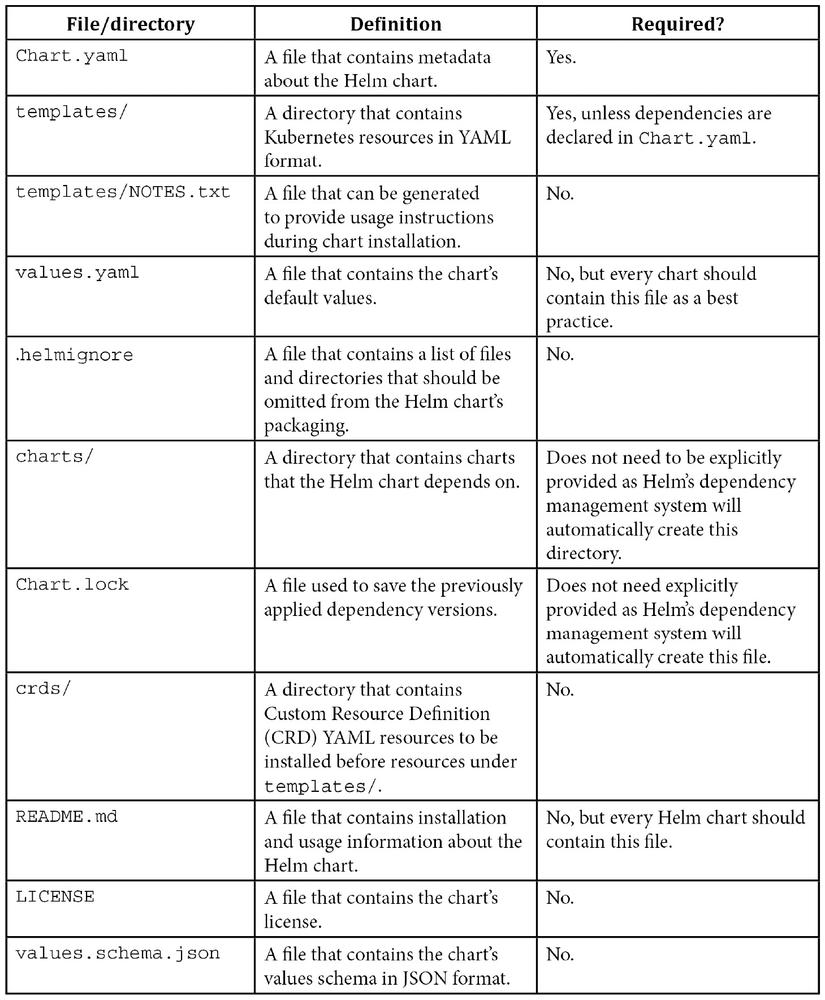
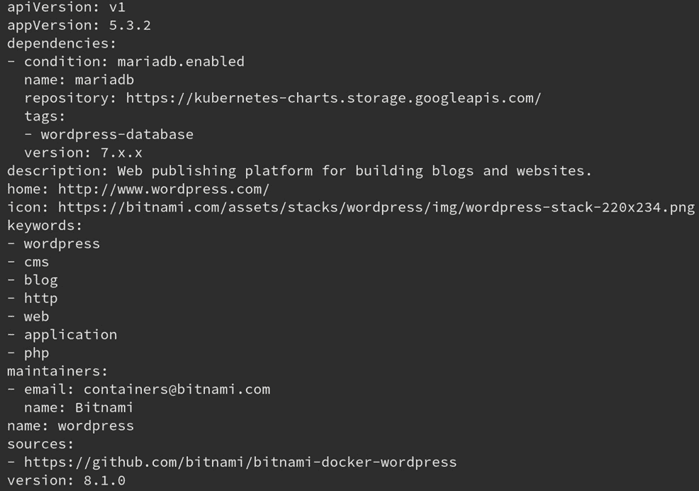
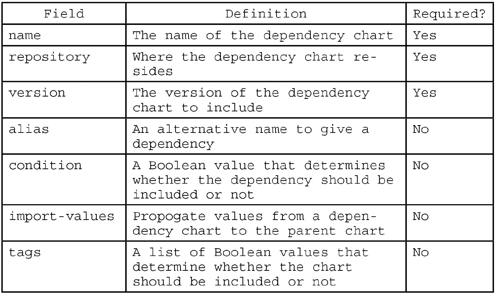
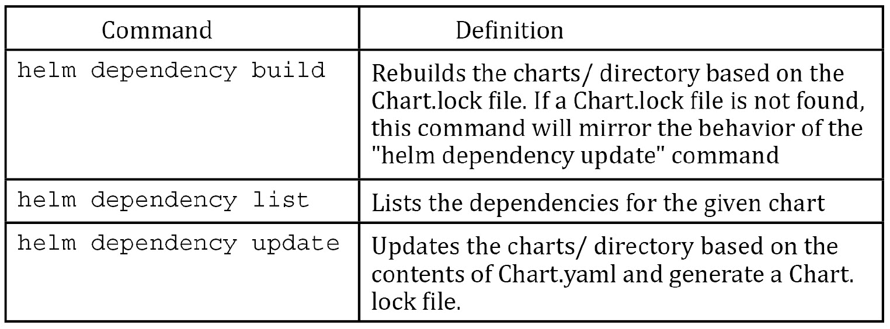
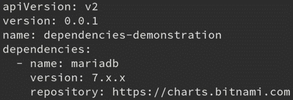
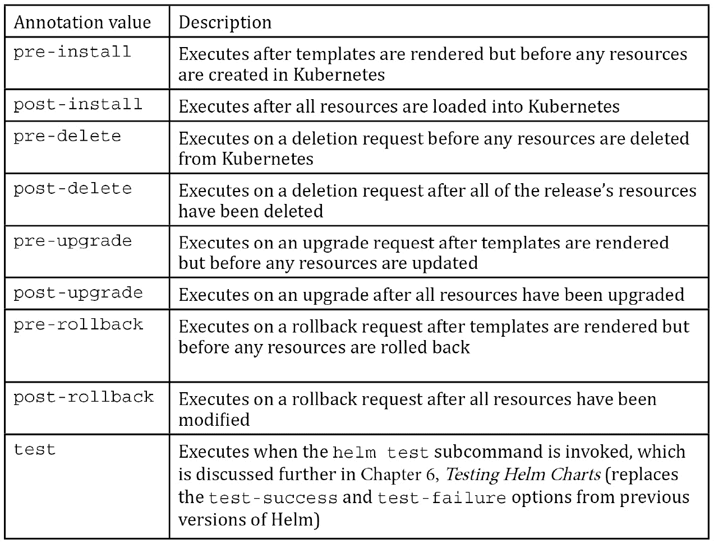

# *第四章*:了解掌舵图

在上一章中，您学习了如何从最终用户的角度使用 Helm，利用它作为包管理器将应用程序安装到 Kubernetes。以这种方式使用 Helm 不需要任何 Kubernetes 的专业知识或对应用程序的深刻理解，因为所有的资源和逻辑都包含在 Helm 图表中。您需要熟悉的唯一概念是图表提供的值，以便自定义您的安装。

我们现在将从使用 Helm 图表转向了解它们是如何工作和创建的。

为此，我们将涵盖以下主题:

*   理解 YAML 格式
*   理解图表模板
*   理解图表定义
*   生命周期管理
*   记录掌舵图

# 技术要求

本节要求将`helm`二进制文件安装在您的本地机器上。该工具的安装和配置在 [*第 2 章*](02.html#_idTextAnchor098) 【准备库本内斯和赫尔姆环境】中有所介绍。

# 了解 YAML 格式

**YAML 不是标记语言** **(YAML)** 是用于创建人类可读配置的文件格式。它是最常用于配置 Kubernetes 资源的文件格式，也是 Helm 图表中许多文件使用的格式。

YAML 文件遵循键值格式来声明配置。让我们来探索 YAML 的关键价值结构。

## 定义键值对

这里显示了 YAML 键值对的一个最基本的例子:

```
name: LearnHelm
```

在前面的例子中，`name`键被赋予了一个`LearnHelm`值。在 YAML，键和值用冒号(:)分隔。写在冒号左边的字符代表键，写在冒号右边的字符代表值。

YAML 格式的间距很重要。下面一行不构成键值对:

```
name:LearnHelm
```

请注意冒号和`LearnHelm`字符串之间缺少一个空格。这将导致解析错误。冒号和值之间必须有空格。

虽然前面的示例表示一个简单的键值对，但是 YAML 允许用户使用嵌套的元素或块来配置更复杂的配对。这里显示了一个示例:

```
resources:
  limits:
    cpu: 100m
    memory: 512Mi
```

前面的示例演示了一个 resources 对象，该对象包含两个键值对的映射:


通过跟随 YAML 块下的缩进来确定键。每个缩进都会在键的名称中添加一个点(`.`)分隔符。当 YAML 区块中不再有任何凹痕时，就达到了该键的值。按照惯例，YAML 的缩进应该使用两个空格，但是用户可以提供任意多的空格，只要整个文档中的空格是一致的。

重要提示:

**标签**不被 YAML 支持，使用它们会导致解析错误。

了解了 YAML 键-值对之后，现在让我们来探索一些可以定义值的常见类型。

## 值类型

YAML 文件中的值可以是不同的类型。最常见的类型是字符串，它是一个文本值。字符串可以通过在引号中包装一个值来声明，但这并不总是必需的。如果一个值至少包含一个字母或特殊字符，则该值被视为一个字符串，带有或不带有引号。可以使用管道(`|`)符号设置多行字符串，如图所示:

```
configuration: |
  server.port=8443
  logging.file.path=/var/log
```

值也可以是整数。当值是没有用引号括起来的数字字符时，它就是整数。下面的 YAML 声明了一个整数值:

```
replicas: 1
```

将此与以下为字符串值分配副本的 YAML 进行比较:

```
replicas: '1'
```

也经常使用布尔值，可以用 true 或 false 来声明:

```
ingress:
  enable: true
```

该 YAML 将`ingress.enable`设置为`true`布尔值。其他可接受的布尔值有`yes`、`no`、`on`、`off`、`y`、`n`、`Y`和`N`。

还可以将值设置为更复杂的类型，如列表。YAML 列表中的项目由破折号(`-`)标识。

下面演示了一个 YAML 列表:

```
servicePorts:
  - 8080
  - 8443
```

该 YAML 将`servicePorts`设置为整数列表(如`8080`和`8443`)。该语法也可用于描述对象列表:

```
deployment:
  env:
    - name: MY_VAR
      value: MY_VALUE
    - name: SERVICE_NAME
      value: MY_SERVICE
```

在这种情况下，`env`被设置为包含`name`和`value`字段的对象列表。列表经常在 Kubernetes 和 Helm 配置中使用，了解它们对最大限度地利用 Helm 很有价值。

虽然 YAML 在库本内特和赫尔姆的世界中更常用于易读性，但是也可以使用 JavaScript 对象符号 T2 格式。让我们简单描述一下这个形式 t。

JSON 格式

YAML 是另一种广泛使用的格式——JSON 的超集。JSON 是一串键值对，类似于 YAML。关键区别在于，虽然 YAML 依靠间距和缩进来正确配置键值对，但 JSON 依靠大括号和方括号。

以下示例将前面的 YAML 示例转换为 JSON 格式:

```
{
  'deployment': {
    'env': [
      {
        'name': 'MY_VAR',
        'value': 'MY_VALUE'
      },
      {
        'name': 'SERVICE_NAME',
        'value': 'MY_SERVICE'
      }
    ]
  }
```

JSON 中的所有键都用引号括起来，并放在冒号之前:

*   大括号(`{`)表示一个块，就像缩进表示 YAML 的一个块一样。
*   方括号(`[`)表示列表，类似于破折号表示 YAML 的列表。

YAML 和 JSON 格式有更多的构造，但是这个介绍提供了足够多的信息来理解它们如何在 Helm 图表中使用。

在下一节中，我们将讨论 Helm 图表文件结构，您可能会注意到它包含几个 YAML 和 JSON fil es。

掌舵图结构

正如您将从前面几章中回忆到的，一个 Helm 图表是 Kubernetes 资源的一个打包，允许用户向 Kubernetes 部署不同复杂性的应用程序。但是，为了被视为 Helm 图表，必须遵循特定的文件结构:

```
my-chart/
  # chart files and directories
```

最佳做法是将顶级目录命名为 Helm 图表的名称。这不是一个技术要求，但是它使得识别 Helm 图表的名称变得简单得多。对于前面的示例文件结构，Helm 图表的名称可能是`my-chart`。

顶层目录下是组成 Helm 图表的文件和目录。下表显示了这些可能的文件和目录:



在本章的中，我们将探索这些文件中的每一个，以了解如何创建一个 Helm 图表。我们将首先了解图表模板是如何工作的，以允许库本内特资源被动态生成。

# 了解图表模板

Helm 图的主要目的是创建和管理构成应用程序的 Kubernetes 资源。这是通过图表模板来完成的，用值作为参数来自定义这些模板。在本节中，我们将讨论 Helm 模板和值是如何工作的。

Helm 图表必须包含一个`templates/`目录，该目录定义了要部署的 Kubernetes 资源(尽管如果图表声明了依赖关系，则该目录不是严格必需的)。`templates/`目录下的内容是由 Kubernetes 资源组成的 YAML 文件。`templates/`目录的内容可能如下所示:

```
templates/
  configmap.yaml
  deployment.yaml
  service.yaml
```

`configmap.yaml`资源可能如下所示:

```
apiVersion: v1
kind: ConfigMap
metadata:
  name: {{ .Release.Name }}
data:
  configuration.txt: |-
    {{ .Values.configurationData }}
```

您可能会质疑前面的示例是否是有效的 YAML 语法。这是因为`configmap.yaml`文件实际上是一个 Helm 模板，它将根据某一组值修改该资源的配置，以生成有效的 YAML 资源。左大括号和右大括号代表在安装或升级过程中将被删除的 **Golang** ( **Go** )模板的输入文本。

让我们了解更多关于围棋模板以及如何使用它们来生成库本内特资源。

## 去做模板

**Go** 是谷歌在 2009 年开发的编程语言。它是 Kubernetes、Helm 以及 Kubernetes 和容器社区中的许多其他工具使用的编程语言。Go 编程语言的一个核心组件是模板，它可以用来生成不同格式的文件。就 Helm 而言，Go 模板用于在 Helm 图表的`templates/`目录下生成 Kubernetes YAML 资源。

Go 模板控制结构和处理，以两个开始的大括号(`{{`)开始，以两个结束的大括号(`}}`)结束。虽然这些标点符号可能会出现在`templates/`目录下的本地文件中，但它们会在安装或升级过程中被删除。

我们将在 [*第 5 章*](05.html#_idTextAnchor265)*构建你的第一个掌舵图*中深入探讨围棋模板化，在这里你将构建你自己的掌舵图。在本章中，我们将讨论 Go 模板的常见功能，作为对该功能的介绍，然后再进行一些实践。我们将从 Go 模板提供的一系列功能开始讨论，首先是参数选项。

### 用值和内置对象参数化字段

掌舵图表在其图表目录中包含一个`values.yaml`文件。该文件声明了图表的所有默认值，这些值由 Go 模板引用，并由 Helm 处理以动态生成 Kubernetes 资源。

图表的`values.yaml`文件可以具有如下定义的值:

```
## chapterNumber lists the current chapter number
chapterNumber: 4
## chapterName gives a description of the current chapter
chapterName: Understanding Helm Charts
```

以井号(`#`)开头的行是注释(在执行过程中被忽略)，应该提供它们所描述的值的详细信息，以便用户理解应该如何应用它们。注释还可以包括值的名称，以允许在搜索值时出现注释。文件中的其他行代表键值对。本章开头介绍了 YAML 格式。

以`.Values`开头的 Go 模板将引用在`values.yaml`文件中定义的值，或者在安装或升级过程中使用`--set`或`--values`标志传递的值。

以下示例表示处理之前的模板:

```
env:
  - name: CHAPTER_NUMBER
    value: {{ .Values.chapterNumber }}
  - name: CHAPTER_NAME
    values: {{ .Values.chapterName }}
```

在模板被处理后，YAML 资源的一个片段被渲染如下:

```
env:
  - name: CHAPTER_NUMBER
    value: 4
  - name: CHAPTER_NAME
    values: Understanding Helm Charts
```

用于引用图表值的`.Values`构造是一个可用于参数化的内置对象。在 Helm docume [目录(https://helm.sh/docs/chart_template_guide/builtin](https://helm.sh/docs/chart_template_guide/builtin_objects/)_ objects/)中可以找到内置对象的完整列表，但最常见的对象如下表所示:


每个对象前面的点(`.`)代表对象范围。后跟对象名称的点将范围限制在该对象上。例如，`.Values`范围仅使图表的值可见；`.Release`范围仅使`Release`对象下的字段可见；`.`范围代表全局范围，使所有这些对象可见，加上上表中定义的公共对象。

### values.schema.json 文件

在值和参数化的话题上，让我们花点时间讨论一下`values.schema.json`文件，它是图表目录中可能包含的文件之一。`values.schema.json`文件用于实施`values`文件中的特定模式。此模式可用于在安装或升级过程中验证提供的值。

以下片段显示了`values.schema.json`文件的样子:

```
{
  '$schema': 'https://json-schema.org/draft-07/schema#',
  'properties': {
    'replicas': {
      'description': 'number of application instances to deploy',
      'minimum': 0
      'type' 'integer'
    },
    . . .
  'title': 'values',
  'type': 'object'
}
```

有了这个模式文件，`replicas`值至少应该设置为`0`。添加到该文件的附加值对可以提供的值施加了附加限制。该文件是确保用户只提供图表模板中支持的参数值的好方法。

虽然 Go 模板允许图表开发人员参数化 Helm 图表，但它们也允许开发人员将条件逻辑提供到 YAML 文件中。接下来我们将探讨这一特性。

### 具有流控制的细粒度模板处理

虽然参数化允许图表开发人员用某些值替换字段，但 Go 模板化也为开发人员提供了控制其模板的流程和结构的能力。这可以使用以下关键词(在 Go 中称为`actions`)来完成:


在图表模板化过程中，有时可能需要包含或排除某些 Kubernetes 资源或资源的某些部分。`if…else`动作可用于此目的。部署模板的以下片段包含一个条件块:

```
readinessProbe:
{{- if .Values.probeType.httpGet }}
  httpGet:
    path: /healthz
    port: 8080
    scheme: HTTP
{{- else }}
  tcpSocket:
    port: 8080
{{- end }}
  initialDelaySeconds: 30
  periodSeconds: 10
```

`if`块用于有条件地设置`readinessProbe`小节。如果`probeType.httpGet`值评估为`true`或非空，则将模板化`httpGet` `readinessProbe`。否则，创建的`readinessProbe`将是`tcpSocket` `readinessProbe`类型。花括号中使用的破折号用于指示空白应在处理后删除。左大括号后使用的破折号删除大括号前的空白，右大括号前使用的破折号删除大括号后的空白。

图表开发人员也可以使用`with`操作来修改值的范围。当引用的值块深度嵌套时，此操作非常有用。通过减少引用深度嵌套值所需的字符数量，它可以简化模板文件的可读性和可维护性。

下面的代码描述了一个`values`文件，它包含深度嵌套的值:

```
application:
  resources:
    limits:
      cpu: 100m
      memory: 512Mi
```

如果没有`with`动作，这些值将在`template`文件中引用，如下所示:

```
cpu: {{ .Values.application.resources.limits.cpu }}
memory: {{ .Values.application.resources.limits.memory }}
```

`with`动作允许开发人员修改这些值的范围，并使用简短的语法引用它们:

```
{{- with .Values.application.resources.limits }}
cpu: {{ .cpu }}
memory: {{ .memory }}
{{- end }}
```

最后，开发人员可以使用`range`动作执行重复的动作。此操作允许开发人员在值列表中循环。假设图表具有以下值:

```
servicePorts:
  - name: http
    port: 8080
  - name: https
    port: 8443
  - name: jolokia
    port: 8778
```

前面的代码提供了一个`servicePorts`列表，可以循环，如下例所示:

```
spec:
  ports:
{{- range .Values.servicePorts }}
  - name: {{ - name }}
  port: {{ .port }}
{{- end }}
```

`with`和`range`动作将范围限制在所提供的对象上。在`range`示例中，`range`作用于`.Values.servicePorts`对象，限制了点(。)符号转换为此对象下定义的值。要在`range`下制定一个引用所有值和内置对象的全局范围，开发人员应该在引用前加上美元符号(`$`)符号，如图所示:

```
{{- range .Values.servicePorts }}
  - name: {{ $.Release.Name }}-{{ .name }}
  port: {{ .port }}
{{- end }}
```

除了图表的值，开发人员还可以创建变量来帮助呈现资源。我们将在下一节探讨这个问题

### 模板变量

虽然它们不如其他模板功能常用，但图表开发人员可以在其图表模板中创建变量，以提供额外的处理选项。这种方法的一个常见用途是流控制，但是模板变量也可以服务于其他用例。

图表模板中的变量定义如下:

```
{{ $myvar := 'Hello World!' }}
```

这会将`myvar`变量设置为`Hello World!`字符串。变量也可以分配给对象，例如图表的值:

```
{{ $myvar := .Values.greeting }}
```

设置的变量随后会以下列方式在模板中引用:

```
data:
  greeting.txt: |
    {{ $myvar }}
```

使用变量的最佳情况之一是在范围块中，其中变量被设置为捕获列表迭代的索引和值:

```
data:
  greetings.txt: |
{{- range $index, $value := .Values.greetings }}
    Greeting {{ $index }}: {{ $value }}
{{- end }}
```

结果可以呈现如下:

```
data:
  greetings.txt: |
    Greeting 0: Hello
    Greeting 1: Hola
    Greeting 2: Hallo
```

变量也可以简化地图迭代的处理，如图所示:

```
data:
  greetings.txt: |
{{- range $key, $val := .Values.greetings }}
    Greeting in {{ $key }}: {{ $val }}
{{- end }}
```

可能的结果如下:

```
data:
  greetings.txt: |
    Greeting in English: Hello
    Greeting in Spanish: Hola
    Greeting in German: Hallo
```

最后，变量可以用来引用当前范围之外的值。

考虑以下`with`块:

```
{{- with .Values.application.configuration }}
My application is called {{ .Release.Name }}
{{- end }}
```

像这样的模板将无法处理，因为`.Release.Name`不在`.Values.application.configuration`的范围内。纠正这种情况的一种方法是将变量设置为`with`块上方的`.Release.Name`:

```
{{ $appName := .Release.Name }}
{{- with .Values.application.configuration }}
My application is called {{ $appName }}
{{- end }}
```

虽然这是解决这个问题的一种可能的方法，但是最好使用美元符号来表示全局范围，因为它需要配置的行数较少，并且随着图表复杂性的增加，更容易阅读。

流量控制和变量是允许动态生成资源的强大概念。除了进行流程控制，图表开发人员还可以利用函数和管道来辅助资源渲染和格式化 ting。

### 具有功能和管道的复杂处理

Go 提供了函数和管道的概念，支持在模板中进行复杂的数据处理。

一个 Go 模板函数类似于你可能在其他语言和构造中遇到的其他函数。函数包含设计用于消费某些输入并基于所提供的输入提供输出的逻辑。

对于 Go 模板，使用以下语法调用函数:

```
functionName arg1 arg2 . . .
```

常用的一个围棋功能是`indent`功能。由于 YAML 是一种对空格敏感的标记语言，这个函数用于缩进指定数量的字符串，以确保字符串的格式正确。`indent`函数将缩进的空格数作为输入，以及应该缩进的字符串。

以下模板说明了这一点:

```
data:
  application-config: |-
{{ indent 4 .Values.config }}
```

本示例将包含在`config`值中的字符串缩进`4`个空格，以确保字符串在`application-config` YAML 键下正确缩进。

Helm 提供的另一个构造是管道。管道是从 **UNIX** 借用的一个概念，其中一个命令的输出被作为不同命令的输入:

```
cat file.txt | grep helm
```

前面的示例显示了一个 UNIX 管道。管道左侧(`|`)是第一个命令，右侧是第二个命令。第一个命令`cat file.txt`打印名为`file.txt`的文件的内容，并将其作为输入传递给`grep helm`命令，该命令为单词`helm`过滤第一个命令的输出。

Go 管道的工作方式类似。这可以通过`indent`功能再次证明:

```
data:
  application-config: |-
{{ .Values.config | indent 4 }}
```

这也将使`config`值缩进 4 个空格。管道最好用于将多个命令链接在一起。第三个命令可以添加到管道中，称为`quote`，在最终的模板化产品周围加上引号:

```
data:
  application-config: |-
{{ .Values.config | indent 4 | quote }}
```

因为这个写的是流水线，读起来简单自然。

有许多不同的围棋模板函数可以在一个掌舵图中使用。这些功能可以在 https://golang.org/pkg/text/template/#hdr-Functions 的 Go 文档和 T2 的 Sprig 模板中找到。io/sprig/图表开发过程中可能用到的一些常用围棋模板功能如下:

*   `date`:设置日期格式
*   `default`:设置一个默认值
*   `fail`:使模板渲染失败
*   `include`:执行一个 Go 模板并返回结果
*   `nindent`:类似缩进，只是在缩进前加一个新行
*   `indent`:将文本缩进一定数量的空格
*   `now`:至显示当前日期/时间
*   `quote`:用引号将串括起来
*   `required`:至需要用户输入
*   `splitList`:将一个字符串拆分成一个字符串列表
*   `toYaml`:将字符串转换为 YAML 格式

Go 模板语言还包含以下布尔运算符，可用于`if`操作以进一步控制 YAML 资源的生成:

*   `and`
*   `or`
*   `not`
*   `eq`(简称为相等)
*   `ne`(短的表示不相等)
*   `lt`(短为小于)
*   `le`(短表示小于或等于)
*   `gt`(短的表示大于)
*   `ge`(短表示大于或等于)

除了生成 Kubernetes 资源之外，Go 模板还可以用来创建可以在具有重复模板的 YAML 资源中重用的函数。这可以通过创建命名模板来实现，如下一节所述。

### 启用命名模板的代码重用

创建模板文件时，在 Kubernetes 资源中可能有样板或重复的 YAML 块。

这方面的一个例子是资源的标签，可以指定如下:

```
labels:
  'app.kubernetes.io/instance': {{ .Release.Name }}
  'app.kubernetes.io/managed-by': {{ .Release.Service }}
```

为了保持一致性，这些标签中的每一个都可以添加到 Helm 图表中的每个资源中。如果图表包含许多不同的 Kubernetes 资源，在每个文件中包含所需的标签可能会很麻烦，尤其是如果需要修改标签或者将来需要向每个资源添加新标签。

Helm 提供了一种称为命名模板的构造，它允许图表开发人员创建可重复使用的模板，这些模板可用于减少样板文件。命名模板在`templates/`目录下定义，是以下划线开头，以`.tpl`文件扩展名结尾的文件。许多图表是用一个名为`_helpers.tpl`的文件创建的，该文件包含命名模板，尽管该文件不需要被称为`helpers`。

要在`tpl`文件中创建命名模板，开发人员可以利用`define`动作。以下示例创建一个命名模板，可用于封装资源标签:

```
{{- define 'mychart.labels' }}
labels:
  'app.kubernetes.io/instance': {{ .Release.Name }}
  'app.kubernetes.io/managed-by': {{ .Release.Service }}
{{- end }}
```

`define`动作以模板名称作为参数。在前面的例子中，模板名叫做`mychart.labels`。命名模板的通用惯例是`$CHART_NAME.$TEMPLATE_NAME`，其中`$CHART_NAME`是 Helm 图表的名称，`$TEMPLATE_NAME`是描述模板用途的简短描述性名称。

`mychart.labels`名称意味着模板是`mychart` Helm 图表的原生模板，并将为其应用的资源生成标签。

要在 Kubernetes YAML 模板中使用命名模板，可以使用`include`函数，该函数有以下用法:

```
include [TEMPLATE_NAME] [SCOPE]
```

`TEMPLATE_NAME`参数是应该处理的命名模板的名称。`SCOPE`参数是应该处理的值和内置对象的范围。大多数情况下，此参数是一个点(`.`)来表示当前顶级范围，但是如果命名模板引用当前范围之外的值，则应使用美元符号(`$`)符号。

以下示例演示了如何使用`include`函数处理命名模板:

```
metadata:
  name: {{ .Release.Name }}
{{- include 'mychart.labels' . | indent 2 }}
```

本示例首先将资源的名称设置为版本的名称。然后它使用`include`函数来处理标签，并按照管道的声明将每一行缩进两个空格。处理完成后，一个名为`template-demonstration`的版本中的资源可能会显示如下:

```
metadata:
  name: template-demonstration
  labels:
    'app.kubernetes.io/instance': template-demonstration
    'app.kubernetes.io/managed-by': Helm
```

Helm 还提供了一个`template`动作，也可以展开命名模板。这个动作的用法与`include`相同，但是有一个主要的限制——它不能在管道中使用来提供额外的格式化和处理。`template`操作用于简单地内联显示数据。由于这个限制，图表开发人员应该在`template`操作上使用`include`功能，因为`include`具有与`template`相同的功能，但也提供了管道处理的额外好处。

在下一节中，我们将学习如何使用命名模板来减少跨多个不同图表的样板 ac 。

### 图书馆图表

掌舵图在`Chart.yaml`文件中定义了一个`type`字段，该字段被设置为`application`或`library`。应用程序图表用于将完整的应用程序部署到 Kubernetes。这是最常见的图表类型，也是默认设置。但是，图表也可以定义为库图表。这种类型的图表不是用来部署应用程序的，而是用来提供可以跨多个不同图表使用的命名模板。这个用例的一个例子是前面章节中定义的`labels`例子。开发人员可以维护多个不同的图表，这些图表的资源具有相同的标签。开发人员无需在每个图表的`_helpers.tpl`文件中定义相同的命名模板，而是可以将提供用于生成资源标签的命名模板的库图表声明为依赖项。

虽然 Helm 最常用于创建传统的 Kubernetes 资源，但它也可以创建**自定义资源** ( **CRs** )，我们将在下一节对此进行解释。

### 模板化 CRs

**CRs** 用于创建非库本内特斯 API 本地的资源。您可能希望使用此功能来增强 Kubernetes 提供的功能。CRs 可以使用 Helm 模板(如本地 Kubernetes 资源)创建，但首先必须有一个定义 CR 的**自定义资源定义(CRD)** 。如果在创建 CR 之前 CRD 不存在，安装将失败。

掌舵图可以包括一个`crds/`文件夹，该文件夹由模板安装前必须显示的 CRD 组成。这里显示了一个示例`crds/`文件夹:

```
crds/
  my-custom-resource-crd.yaml
```

文件`my-custom-resource-crd.yaml`可能有以下内容:

```
apiVersion: apiextensions.k8s.io/v1
kind: CustomResourceDefinition
metadata:
  name: my-custom-resources.learnhelm.io
spec:
  group: learnhelm.io
  names:
    kind: MyCustomResource
    listKind: MyCustomResourceList
    plural: MyCustomResources
    singular: MyCustomResource
    scope: Namespaced
    version: v1
```

然后，模板/目录可以包含 MyCustomResource 资源的一个实例。

```
templates/
  my-custom-resource.yaml
```

像这样的文件结构将确保在`templates/`目录下定义的 CR 之前安装`MyCustomResource` CRD。

重要提示:

此功能要求用户是群集管理员，因为创建 CRD 需要升级权限。如果您不是集群管理员，最好让管理员提前创建您的 CRD。如果您这样做了，`crds/`文件夹将不需要包含在您的图表中，因为 CRDs 已经存在于集群中。

到目前为止，我们已经详细介绍了 Helm 模板。总而言之，Helm 模板是 Helm 图表的“大脑”，用于生成 Kubernetes 资源。我们将在 [*第 5 章*](05.html#_idTextAnchor265)*构建你的第一个掌舵图*中获得编写掌舵模板的实践经验，以及本章中讨论的其他主题。

现在，让我们用一个与图表模板同等重要的话题继续我们对赫尔姆图表基础的讨论——文件`Chart.yaml`。

# 理解图表定义

`Chart.yaml`文件，也称为图表定义，是一个声明关于一个 Helm 图表的不同元数据的资源。此文件是必需的，如果它不包含在图表的文件结构中，您将收到以下错误:

```
Error: validation: chart.metadata is required
```

在 [*第三章*](03.html#_idTextAnchor147)*安装你的第一张掌舵图*中，我们通过运行`helm show chart`命令探索了**碧波的 WordPress 图表**的图表定义。通过再次运行此命令来调用此图表定义。我们将假设自从在 [*第 3 章*](03.html#_idTextAnchor147)*安装您的第一个舵手图*中执行该任务以来，已经添加了 Bitnami 图表存储库:

```
$ helm show chart bitnami/wordpress --version 8.1.0
```

下面列出了 wordpress 图表的图表定义。



图 4.1–WordPress 图表的图表定义。

图表定义或`Chart.yaml`文件可以包含许多不同的字段。一些字段是必需的，而大多数其他字段是可选的，只有在必要时才能提供。

现在我们已经对`Chart.yaml`文件有了基本的了解，我们将在下一节探讨该文件的必填字段。

## 必填字段

图表定义必须包含以下包含关键图表元数据的字段:


让我们更详细地探讨一下这些必填字段:

*   The `apiVersion` field can be set to one of two different values:

    `v1`

    `v2`

*   如果`apiVersion`字段设置为`v1`，这意味着图表遵循传统图表结构。这是 Helm 3 发布前使用的`apiVersion`值，其中图表结构中支持附加的`requirement.yaml`文件，而图表定义中的`type`字段不受支持。Helm 3 向后兼容`apiVersion`值`v1`，但新图表应设置为`apiVersion`值`v2`，以避免使用不推荐使用的功能。
*   `name`字段用于定义 Helm 图表的名称。该值应该等于包含 Helm 图表文件的顶级目录的名称。Helm 图表的名称出现在`helm search`命令和`helm list`命令的搜索结果中，以返回用于发布的图表的名称。该字段的值应该简洁但具有描述性，用一个简短的名称描述图表安装的应用程序，如`wordpress`或`redis-cluster`。烤串大小写，或者用破折号分隔单词，是区分名字中不同单词的常见习惯。有时候，名字会写成一个字，比如`rediscluster`。
*   `version`字段用于确定 Helm 图表的版本。版本必须遵循**语义版本化** ( **版本** ) `2.0.0`格式才能成为有效的图表版本。SemVer 描述了一个基于`Major.Minor.Patch`格式的版本，其中`Major`版本在引入突破性变化时应该增加，当向后兼容特性发布时`Minor`版本应该增加，当 bug 修复时`Patch`版本应该增加。当`Minor`版本增加时，`Patch`版本设置回`0`。当`Major`版本增加时，`Minor`和`Patch`版本都重置为`0`。当增加图表版本时，图表开发人员应该特别小心，因为它们用于指示何时发布变更、新特性和错误修复。

虽然这三个字段是`Chart.yaml`文件中唯一需要的字段，但还可以包含更多可选字段来为图表添加额外的元数据。

让我们看看其他可能的`Chart.yaml`场 ds。

可选元数据

除了必填字段外，还有许多可选字段可用于提供图表的其他详细信息，如下表所述:


其中一些字段提供简单的元数据，向用户显示关于 Helm 图表的信息。但是，其他字段用于修改 Helm 图表的行为。这些字段中的第一个是`type`字段，可以设置为`application`或`library`。如果设置为`application`，图表将部署 Kubernetes 资源。如果设置为`library`，图表通过帮助模板的形式向其他图表提供功能。

第二个可以修改 Helm 图表行为的字段是`dependencies`字段，这将在下一节中讨论。

## 管理图表相关性

图表依赖用于安装 Helm 图表可能依赖的其他图表资源。这方面的一个例子是`wordpress`图表，它将`mariaDB`图表声明为保存后端数据的依赖项。通过使用`mariadb`依赖关系，WordPress 图表不需要从头定义它的资源。

通过填充`dependencies`字段，在`Chart.yaml`文件中声明依赖关系。以下是`wordpress`图表定义的相关片段:


图 4.2–WordPress Helm 图表中声明的马里亚数据库依赖关系。

虽然此示例显示了单个依赖项`mariadb`，但是依赖项块可以定义多个依赖项的列表。

一个`dependencies`块包含许多不同的字段，可以用来修改图表的依赖关系管理的行为。下表中定义了这些字段:



`dependencies`块下最少需要的字段是`name`、`repository`和`version`字段。如前面的`wordpress`依赖关系片段中的所示，依赖关系的名称是马里亚数据库，可以在[https://kubernetes-charts.storage.googleapis.com](https://kubernetes-charts.storage.googleapis.com/)找到该存储库。这将在提供的存储库中搜索一个 Helm 图表，该图表的`Chart.yaml`文件中的`name`字段为`mariadb`。`dependencies`块的`version`字段指定了应该包含的图表版本。这可以固定到特定版本，如`7.0.0`，也可以指定通配符版本。上例中列出的依赖项提供了通配符版本`7.x.x`，它指示 Helm 下载与通配符匹配的图表的最新版本。

现在，了解了必需的依赖项字段，让我们了解如何下载声明的依赖项。

## 下载依赖项

依赖关系可以使用下表中列出的`helm dependency`子命令下载:



要第一次下载依赖项，可以运行`helm dependency update`命令，将每个依赖项下载到给定 Helm 图表的`charts/`目录中:

```
$ helm dependency update $CHART_PATH
```

`helm dependency update`命令以`GZip`存档的形式从存储库中下载依赖项。`tgz`文件扩展名。该命令还会生成一个名为`Chart.lock`的文件。`Chart.lock`文件类似于`Chart.yaml`文件。然而，虽然`Chart.yaml`文件包含图表依赖项的期望状态，但是`Chart.lock`文件定义了所应用的依赖项的实际状态。

这里可以看到一个`Chart.lock`文件的例子:


图 4.3–一个`Chart.lock`文件

将此与简单的对应`Chart.yaml`文件进行比较:



图 4.4–对应的`Chart.yaml`文件

在`Chart.yaml`文件中，可以看到指定`mariadb`依赖的版本是`7.x.x`版本，但是`Chart.lock`文件中的版本是`7.3.1`版本。这是因为`Chart.yaml`文件指示 Helm 下载最新版本的`7.x.x`版本，实际下载的版本是`7.3.1`版本。

有了`Chart.lock`文件，Helm 能够在`charts/`目录被删除或需要重建的情况下重新加载最初下载的确切依赖项。这可以通过对图表运行`helm dependency build`命令来完成:

```
$ helm dependency build $CHART_PATH
```

因为您可以使用`helm dependency build`命令下载依赖项，所以可以从源代码管理中省略`charts/`目录来减小存储库的大小。

随着时间的推移，`7.x.x`版本下的更新版本将会出现。可以再次运行`helm dependency update`命令来协调这种依赖性，这意味着将下载最新的可用版本，并且`Chart.lock`文件将重新生成。如果将来您想从`8.x.x`版本下载，或者想将依赖关系锁定到某个特定版本，如`7.0.0`，您可以在`Chart.yaml`文件中进行设置并运行`helm dependency update`。

`helm dependency list`命令可用于查看保存到本地机器的 Helm 图表的下载依赖项:

```
$ helm dependency list $CHART_NAME
```

您将看到类似如下的输出:


图 4.5–“舵依赖列表”输出

`STATUS`列确定依赖项是否已经成功下载到`charts/`目录。如果状态为`ok`，则已下载。如果状态显示为`missing`，则说明该依赖项尚未下载。

默认情况下，`Chart.yaml`文件中的每个声明的依赖项都将被下载，但这可以通过提供`dependencies`块的`condition`或`tags`字段来修改，我们将在下一节中讨论。

## 条件依赖

在安装或升级过程中，可以利用`condition`和`flags`字段有条件地包含依赖关系。考虑一个例子`Chart.yaml`文件中的`dependencies`块:

```
dependencies:
  - name: dependency1
    repository: https://example.com
    version: 1.x.x
    condition: dependency1.enabled
    tags:
      - monitoring
  - name: dependency2
    repository: https://example.com
    version: 2.x.x
    condition: dependency2.enabled
    tags:
      - monitoring
```

请注意包含`condition`和`tags`字段。`condition`字段列出了应由用户提供或在图表的`values.yaml`文件中设置的值。如果评估结果为`true`，`condition`字段会将图表作为依赖项包含在内。如果`false`，则不包括依赖关系。可以通过用逗号分隔每个条件来定义多个条件，如下所示:

```
condition: dependency1.enabled, global.dependency1.enabled
```

设置条件的最佳实践是遵循`chartname.enabled`值格式，其中每个依赖项都有一个取决于依赖项图表名称的唯一条件集。这允许用户通过遵循直观的值模式来启用或禁用单个图表。如果条件值不包含在图表的`values.yaml`文件中，或者不是由用户提供的，则忽略该字段。

`condition`字段用于启用或禁用单个依赖项，而`tags`字段用于启用或禁用依赖项组。在前面的`dependencies`块中，两个依赖项都列出了一个名为`monitoring`的标签。这意味着如果启用了`monitoring`标签，则两个依赖项都包括在内。如果`monitoring`标签设置为`false`，则省略相关性。通过在父图表的`values.yaml`文件中的`tags` YAML 对象下设置标签来启用或禁用标签，如下所示:

```
tags:
  monitoring: true
```

通过遵循列表的 YAML 语法，依赖项可以在`Chart.yaml`文件中定义多个标签。只有一个标签需要评估为`true`才能包含依赖关系。

重要提示:

如果依赖项的所有标记都被忽略，默认情况下将包含该依赖项。

在本节中，我们讨论了如何有条件地声明依赖关系。接下来，我们将讨论如何覆盖和引用依赖关系中的值。

## 覆盖和引用子图表中的值

默认情况下，属于依赖关系图表(也称为**子图表**)的值可以通过将其包装在名称设置为与子图表相同的映射中而被覆盖或引用。想象一个名为`my-dep`的子图表，它支持以下值:

```
replicas: 1
servicePorts:
  - 8080
  - 8443
```

当该图表作为依赖项安装时，可以通过在父图表的`my-dep` YAML 对象中设置这些值来覆盖它们，如图所示:

```
my-dep:
  replicas: 3
  servicePorts:
    - 8080
    - 8443
    - 8778
```

上例覆盖了在`my-dep`中定义的`replicas`和`servicePorts`值，为`replicas`设置`3`，并将`8778`添加到`servicePorts`。这些值可以在父图表的模板中按照点标记法引用，例如`my-dep.replicas`。除了覆盖和引用值之外，您还可以通过定义`import-values`字段直接导入依赖关系值，这将在下一节中解释。

## 用导入值导入值

`Chart.yaml`文件的`dependencies`块支持`import-values`字段，该字段可用于导入子图表的默认值。这个领域有几种运作方式。第一种方法是提供要从子图表导入的键列表。为此，子图表必须在`exports`块下声明值，如下所示:

```
exports:
  image:
    registry: 'my-registry.io'
    name: learnhelm/my-image
    tag: latest
```

然后，父图表可以在`Chart.yaml`文件中定义`import-values`字段:

```
dependencies:
  - name: mariadb
    repository: https://charts.bitnami.com
    version: 7.x.x
    import-values:
      - image
```

这允许子图表中`exports.image`下的默认值在父图表中被如下引用:

```
registry: 'my-registry.io'
name: learnhelm/my-image
tag: latest
```

请注意，这已经删除了`image`映射，只留下了它下面的键值对。如果您不想发生这种情况，`import-values`字段可以通过遵循所谓的`child-parent`格式来保留`image`地图。这允许图表开发人员指定应该从子图表导入的值，并提供在父图表中应该引用的名称。`child-parent`格式允许这样做，而不需要子图表中的`exports`块中的值。下面的`dependencies`块演示了一个例子:

```
dependencies:
  - name: mariadb
    repository: https://charts.bitnami.com
    version: 7.x.x
    import-values:
      - child: image
        parent: image
```

本示例获取子图表中`image`块下的每个值，并将其导入父图表中的`image`块下。

重要提示:

使用`import-values`字段导入的值不能在父图表中被覆盖。如果您需要覆盖子图表中的值，您不应该使用`import-values`字段，而应该通过在每个子图表前面加上子图表的名称来覆盖所需的值。

在本节中，我们介绍了如何在`Chart.yaml`文件中管理依赖关系。现在，让我们了解如何在 Helm c hart 中定义生命周期管理钩子。

# 生命周期管理

Helm 图表及其相关版本的主要优势之一是能够在 Kubernetes 上管理复杂的应用程序。一个版本在其生命周期中经历多个阶段。为了围绕发布的生命周期提供额外的管理能力，Helm 采用了`hooks`机制，以便在发布周期内的不同时间点采取行动。在这一节中，我们将探讨发布生命周期的不同阶段，并介绍如何使用`hooks`来提供不仅与发布交互，而且与整个 Kubernetes 环境交互的功能。

在 [*第 3 章*](03.html#_idTextAnchor147)*安装您的第一个头盔图表*中，我们遇到了几个阶段，涵盖了头盔版本的整个生命周期，包括其安装、升级、移除和回滚。考虑到 Helm 图表可能很复杂，因为它们管理一个或多个将要部署到 Kubernetes 的应用程序，所以除了仅仅部署资源之外，通常还需要执行额外的操作。这些可能包括以下内容:

*   完成应用程序所需的先决条件，如管理证书和机密
*   数据库管理是执行备份或恢复的图表升级的一部分
*   移除图表前清理资产

潜在选项的列表可能很长，首先了解 Helm hooks 的基础知识以及它们何时可以执行非常重要，我们将在下一步中描述。

## 舵钩的基本原理

钩子作为在释放的生命周期中的指定时间点执行一次性动作。与 Helm 中的大多数特性一样，钩子是作为另一个 Kubernetes 资源实现的，更具体地说，是在容器中实现的。虽然 Kubernetes 中的大多数工作负载都是为长时间运行的流程设计的，例如服务于应用编程接口请求的应用程序，但工作负载也可以由单个任务或一组任务组成，这些任务使用脚本执行，一旦完成，脚本会指示成功或失败。

在 Kubernetes 环境中创建短期任务时通常使用的两个选项是使用裸露的**吊舱**或**作业**。裸 pod 是一个运行到完成然后终止的 pod，但是如果底层节点出现故障，它将不会被重新调度。因此，最好将生命周期挂钩作为作业运行，如果节点出现故障或变得不可用，将重新计划挂钩。

由于钩子被简单地定义为 Kubernetes 资源，它们也被放在`templates/`文件夹中，并用 helm.sh/hook 注释进行注释。此注释的指定确保了它们不会与标准处理期间应用于 Kubernetes 环境的其余资源一起呈现。相反，它们是基于在 helm.sh/hook 注释中指定的值来呈现和应用的，该值决定了何时应该在 Kubernetes 中作为 Helm 发布生命周期的一部分来执行它。

下面是一个如何将钩子定义为作业的例子:

```
apiVersion: batch/v1
kind: Job
metadata:
  name: helm-auditing
  annotations:
    'helm.sh/hook': pre-install,post-install
spec:
  template:
    metadata:
      name: helm-auditing
    spec:
      restartPolicy: Never
      containers:
      - name: helm-auditing
        command: ["/bin/sh", "-c", "echo Hook Executed at $(date)"]
        image: alpine
```

这个简单的例子在休眠 10 秒之前打印出容器中的当前日期和时间。Helm 在安装图表之前和之后执行这个钩子，如“helm.sh/hook”注释的值所示。这种挂钩的一个用例是连接到一个审计系统，该系统跟踪应用程序到 Kubernetes 环境的安装。安装完成后，可以添加一个类似的钩子来跟踪完成图表安装过程所花费的总时间。

既然我们已经解释了赫尔姆钩子的基本知识，让我们讨论如何在赫尔姆图中定义钩子。

## 挂钩执行

正如你在上一节的`job`勾中看到的，`helm.sh/hook`标注的值是`pre-install`。`pre-install`是 Helm 图表生命周期中可以执行钩子的点之一。

下表表示`helm.sh/hook`注释的可用选项，指示何时执行钩子。每个钩子的描述参考了官方的 Helm 文档，可以在 https://Helm . sh/docs/topics/charts _ hooks/#可用的钩子:



`helm.sh/hook`注释可以包含多个值，指示同一资源在图表发布周期内的不同时间点执行。例如，对于要在图表安装前后执行的挂钩，可以在 pod 或作业上定义以下注释:

```
annotations:
  'helm.sh/hook': pre-install,post-install
```

为了确定图表生命周期中需要选择的阶段，了解如何以及何时执行钩子是很有用的。如前例所述，当一个钩子被标记为在执行`helm install`命令的`pre-install`和`post-install`部分运行时，会发生以下动作:

1.  用户安装一个 Helm 图表(通过运行，例如，`helm install bitnami/wordpress --version 8.1.0`)。
2.  赫尔姆应用编程接口被调用。
3.  `crds/`文件夹中的 CRD 被加载到 Kubernetes 环境中。
4.  执行图表模板的验证并呈现资源。
5.  `pre-install`钩子按重量排序，然后渲染并加载到 Kubernetes。
6.  赫尔姆一直等到钩子准备好。
7.  模板资源被呈现并应用于 Kubernetes 环境。
8.  执行`post-install`挂钩。
9.  掌舵人一直等到`post-install`钩子完成。
10.  返回`helm install`命令的结果。

了解了 Helm hook 执行的基础知识后，让我们讨论一些关于 Helm hook 的更高级的主题。

## 高级钩子概念

虽然将一个标准的 Helm 模板资源转换成一个钩子只需要很少的努力，但是还有其他的选项可以帮助图表的执行和资源的移除。

在一个 Helm 图表的生命周期中，可以执行的钩子的数量没有限制，并且可能存在为同一个生命周期阶段配置多个钩子的情况。当出现这种情况时，默认情况下，钩子按名称的字母顺序排列。但是，您可以通过使用`helm.sh/weight`注释指定每个钩子的重量来定义顺序。权重按升序排序，但如果多个挂钩包含相同的权重值，则使用按名称字母顺序排序的默认逻辑。

虽然钩子为生命周期管理提供了一种有用的机制，但是您应该记住，钩子不同于常规模板资源，在调用`helm uninstall`命令期间不会随图表的其余部分一起被移除，因为它们没有被 Helm 跟踪或管理。相反，在发布的生命周期中，可以使用一些策略来移除钩子，例如配置删除策略和设置作业的 TTL。

首先，可以在与钩子相关联的吊舱或作业上指定`helm.sh/hook-delete-policy`注释。这个注释决定了 Helm 应该何时从 Kubernetes 中移除资源。以下选项可用(描述参考 Helm 文档，可在 https://Helm . sh/docs/topics/charts _ hooks/# hook-delete-policy 找到):


此外，Kubernetes 为提供了定义**生存时间** ( **TTL** )机制的选项，以 使用作业的`ttlSecondsAfterFinished`属性限制资源在完成后保留的时间，如图所示:

```
apiVersion: batch/v1
kind: Job
metadata:
  name: ttl-job
  annotations:
    'helm.sh/hook': post-install
spec:
  ttlSecondsAfterFinished: 60
```

在本例中，资源在完成或失败后的 60 秒内被移除。

版本生命周期的最后阶段是删除，虽然标准图表模板在调用`helm uninstall`命令时被删除，但您可能希望保留某些资源，这样 Helm 就不会对它们采取行动。这种情况的一个常见用例是，通过`PersistentVolumeClaim`命令在发行版生命周期的开始创建一个新的持久卷，但不应该在结束时与其他资源一起删除，以便保留该卷的数据。通过使用`helm.sh/resource-policy`注释启用该选项，如图所示:

```
'helm.sh/resource-policy': keep
```

Helm 将不再考虑在执行`helm uninstall`命令时移除该资源。需要注意的是，当资源不再被管理时，一旦剩余的资源被移除，它就会变成孤立的。如果使用`helm install`命令，这可能会导致挑战，因为它可能会导致与先前未删除的现有资源的资源命名冲突。使用`kubectl delete`命令可以手动删除孤立的资源。

本节讨论了如何编写钩子和自动化来管理图表的生命周期。在下一节中，我们将讨论如何正确记录 Helm 图表，以确保其用户拥有流畅的体验。

# 记录舵角图

与用户交互的任何其他软件一样，赫尔姆图表应该被适当地记录下来，以便用户知道如何与之交互。Helm 图表结构支持用于记录使用情况的`README.md`文件、用于覆盖使用和分发权限的`LICENSE`文件以及用于在图表安装期间生成使用说明的`templates/NOTES.txt`文件 n

自述文件

**README** 是软件开发中常用的描述产品安装、使用等细节的文件。Helm 图表的自述文件通常包含以下详细信息:

*   **先决条件**:先决条件的一个常见示例是在安装图表之前为库本内特集群创建一个`secret`或一组秘密。以便安装到 Kubernetes 部署中。用户可以通过参考自述文件了解这一要求。
*   **值**:图表通常由许多不同的值组成，每个值都应该在`README`文件的表格中描述。该表应指定值的名称、描述或函数及其默认值。您可能还会发现，指明在安装或升级过程中是否需要提供该值很有帮助。
*   **应用程序特定信息**:一旦使用 Helm 图表安装了应用程序，您可能需要关于应用程序本身的附加信息，例如如何访问它或应用程序如何运行。这些细节也可以在`README`文件中提供。

头盔显示器是使用**标记**格式语言编写的。Markdown 通常用于 GitHub 项目和开源软件，是一种轻松编码文本的方式，可以以优雅的格式显示。可以在**降价指南**网站上进一步探索降价，网址为 https://www . markdownguide.org/.

## 许可文件

除了包含在`README`文件中的技术说明，图表维护者可能会发现有必要包含一个许可证，表明用户对图表使用和分发的权限。这些细节可以在图表目录下一个名为`LICENSE`的文件中合成。

`LICENSE`文件是包含软件许可证的明文文件。许可证可以是定制的，也可以是开源软件中常用许可证的副本，如 Apache 许可证 2.0 或麻省理工学院许可证。了解许可证之间的差异以及使用和分发软件的合法性超出了本书的范围，但是您可以在**选择许可证** [网站(https://Choose Ali](https://choosealicense.com/)cense . com/)开始探索这些细节，这将帮助您为您的 He lm 图表选择合适的许可证。

## 模板/NOTES.txt 文件

与`README.md`文件类似，`templates/NOTES.txt`文件用于在使用 Helm 安装后为应用程序提供使用说明。区别在于`README.md`文件是静态的，而`NOTES.txt`文件可以使用 Go 模板动态生成。

假设一个 Helm 图表在其`values.yaml`文件中配置了以下值:

```
## serviceType can be set to NodePort or LoadBalancer
serviceType: NodePort
```

根据设置的服务类型，访问应用程序的指令会有所不同。如果服务是`NodePort`服务，将通过使用在每个 Kubernetes 节点上设置的特定端口号来获得访问权限。如果服务设置为`LoadBalancer`，将使用创建服务时自动提供的负载平衡器的网址来访问应用程序。对于经验较少的 Kubernetes 用户来说，理解如何基于所使用的服务类型来访问应用程序可能很困难，因此该图表的维护者应该在`templates/`目录下提供一个`NOTES.txt`文件，该文件提供了如何访问应用程序的说明。

以下示例说明了如何将`templates/NOTES.txt`文件用于此目的:

```
Follow these instructions to access your application.
{{- if eq .Values.serviceType 'NodePort' }}
export NODE_PORT=$(kubectl get --namespace {{ .Release.Namespace }} -o jsonpath='{.spec.ports[0].nodePort}' services {{.Release.Name }})
export NODE_IP=$(kubectl get nodes --namespace {{ .Release.Namespace }} -o jsonpath='{.items[0].status.addresses[0].address}')
echo "URL: http://$NODE_IP:$NODE_PORT"
{{- else }}
export SERVICE_IP=$(kubectl get svc --namespace {{ .Release.Name }} wordpress --template '{{ range (index .status.loadBalancer.ingress 0) }}{{.}}{{ end }}')
echo "URL: http://$SERVICE_IP"
{{- end }}
```

该文件将在应用程序的安装、升级和回滚阶段生成和显示，并可通过运行`helm get notes`命令调用。通过提供该文件，用户将更好地理解如何使用该应用程序。

到目前为止，我们已经在本章中描述了组成 Helm 图表的大部分资产，除了实际的打包，它允许图表易于分发。这个概念将在下一节中描述。

# 包装舵角图

虽然赫尔姆图表遵循一个共同的文件结构，但它们应该打包以便于分发。图表打包在`tgz`档案中。虽然可以使用`tar` bash 实用程序或归档管理器手动创建此归档，但 Helm 提供了`helm package`命令来简化此任务。`helm package`命令的语法如下所示:

```
$ helm package [CHART_NAME] [...] [flags]
```

`helm package`命令针对本地图表目录运行。如果该命令成功，它将生成具有以下文件格式的`tgz`档案:

```
$CHART_NAME-$CHART_VERSION.tgz
```

然后可以通过推送至图表存储库来分发档案，这是一项在 [*第 5 章*](05.html#_idTextAnchor265)*构建您的第一张掌舵图*中进一步探讨的任务。

`helm package`命令包括图表目录下的每个文件。虽然这通常是首选行为，但如果目录包含对 Helm 来说不重要的文件，则可能并不总是需要这样做。这种情况经常发生的目录的一个例子是`.git/`目录，它存在于由 **Git SCM** 管理的项目中。如果这个文件被打包到图表的`tgz`档案中，它将没有任何用途，只会增加档案的大小。Helm 支持一个名为`.helmignore`的文件，可以用来从 Helm 档案中省略某些文件和文件夹。下面描述一个例子`.helmignore`文件:

```
# Ignore git directories and files
.git/
.gitignore
```

前面的文件表明，如果`.git/`目录或`.gitignore`文件出现在图表目录中，它们将被`helm package`命令忽略，这意味着它们不会出现在最终的`tgz`档案中。该文件中以井号(`#`)开头的行用作注释。如果您的图表目录包含对图表的整体功能 n 不必要的文件和文件夹，请确保在您的 Helm 图表中包含一个`.helmignore`文件。

# 总结

Helm 图表是一组文件，主要以 YAML 格式编写，遵循特定的文件结构。`Chart.yaml`文件用于设置图表元数据和声明依赖关系。`templates/`目录用于包含 Go 模板化的 Kubernetes YAML 资源，允许它们动态生成。在`templates/`目录下定义的 Kubernetes 资源也可以包含某些钩子来配置应用程序生命周期中的阶段。为了向用户提供文档，图表可以包含`README.md`和`templates/NOTES.txt`文件，也可以包含`LICENSE`文件来声明图表的使用和分发权限。最后，图表可以包含一个`.helmignore`文件，用于从最终打包的产品中省略声明的文件。

在本章中，您学习了 Helm 图表的结构以及如何配置关键图表组件。有了本章的知识，你现在已经了解了如何从头开始写你的第一张掌舵图的基本概念，我们将在 [*第 5 章*](05.html#_idTextAnchor265)*构建你的第一张掌舵图*中进行。

# 进一步阅读

要了解更多关于创建 Helm 图表背后的基础知识，请参考 https://helm.sh/docs/chartHelm d[文档中的图表模板指南页面。https://helm.sh/doc](https://helm.sh/docs/chart_template_guide/)的 Ch [艺术部分/主题/图表/也描述了本章讨论的许多主题，包括图表文件结构、依赖关系和`Chart.yaml`文件。](https://helm.sh/docs/topics/charts/a)

# 问题

1.  在 Kubernetes 和 Helm 中最常用的文件格式是什么？
2.  `Chart.yaml`文件中有哪三个必填字段？
3.  如何引用或覆盖图表依赖关系中的值？
4.  假设您想要对使用 Helm 部署的数据库进行数据快照。在将数据库升级到更新版本之前，您可以做些什么来确保获取一个数据`snapshot`？
5.  作为图表开发人员，您可以创建哪些文件来为最终用户提供文档并简化图表安装过程？
6.  您可以利用什么样的 Helm 模板构造来生成重复的 YAML 部分？
7.  `Chart.yaml`文件和`Chart.lock`文件有什么不同？
8.  将资源定义为钩子的注释的名称是什么？
9.  图表模板中函数和管道的用途是什么？可以使用的常用功能有哪些？