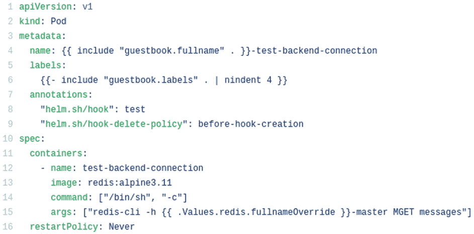
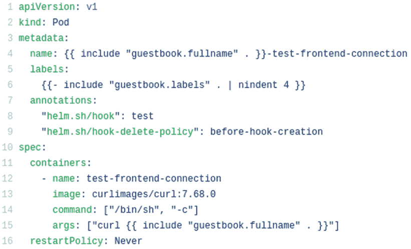
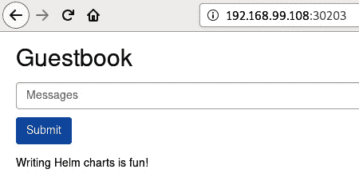
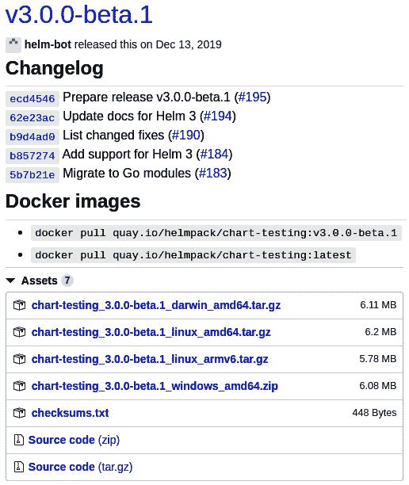

# *第六章*:测试舵轮图

测试是工程师在软件开发过程中必须执行的常见任务。执行测试是为了验证产品的功能，并防止产品随着时间的推移而退化。经过良好测试的软件随着时间的推移更容易维护，并允许开发人员更自信地向最终用户提供新版本。

应该对 Helm 图表进行适当的测试，以确保其交付的特性达到预期的质量水平。在本章中，我们将讨论实现健壮的 Helm 图表测试的方法，包括以下主题:

*   设置您的环境
*   验证赫尔姆模板
*   在实时集群中进行测试
*   用图表测试项目改进图表测试
*   清理

# 技术要求

本章将使用以下技术:

*   `minikube`
*   `kubectl`
*   `helm`
*   `git`
*   `yamllint`
*   `yamale`
*   `chart-testing` ( `ct`)

除了这些工具，您还可以跟随位于[https://github.com/PacktPublishing/-Learn-Helm](https://github.com/PacktPublishing/-Learn-Helm)的 Packt GitHub 存储库中的示例，这将在本章中引用。在本章使用的许多示例命令中，我们将引用 Packt 存储库，因此您可能会发现通过运行`git clone`命令来克隆该存储库很有帮助:

```
$ git clone https://github.com/PacktPublishing/-Learn-Helm Learn-Helm
```

现在，让我们继续设置您的本地`minikube`环境。

# 设置您的环境

在本章中，我们将为上一章中创建的`Guestbook`图表创建并运行一系列测试。运行以下步骤来设置您的`minikube`环境，我们将在其中测试留言簿图表:

1.  运行`minikube start`命令启动`minikube`:

    ```
    minikube start
    ```

2.  然后，创建一个名为`chapter6` :

    ```
    kubectl create namespace chapter6
    ```

    的新命名空间

准备好`minikube`环境后，让我们开始讨论如何测试 Helm 图表。我们将从概述您可以用来验证 Helm 模板的方法开始讨论。

# 验证头盔模板

在前一章中，我们从头开始构建了一个 Helm 图。最终的产品相当复杂，包含参数化、条件模板化和生命周期挂钩。由于 Helm 的主要目的之一是创建 Kubernetes 资源，因此您应该确保在将资源模板应用到 Kubernetes 集群之前，正确生成资源模板。这可以通过多种方式实现，我们将在下一节中讨论。

## 使用掌舵模板在本地验证模板生成

验证图表模板的第一种方法是使用`helm template`命令，该命令可用于在本地渲染图表模板，并在标准输出中显示其完全渲染的内容。

`helm template`命令具有以下语法:

```
$ helm template [NAME] [CHART] [flags]
```

该命令在本地渲染一个模板，使用`NAME`参数来满足内置对象的`.Release`和包含Kubernetes模板的图表的`CHART`参数。Packt 存储库中的`helm-charts/charts/guestbook`文件夹可用于演示`helm template`命令的功能。此文件夹包含上一节中开发的图表以及本章稍后将使用的其他资源。

通过运行以下命令在本地渲染`guestbook`图表:

```
$ helm template my-guestbook Learn-Helm/helm-charts/charts/guestbook
```

该命令的结果将显示每个 Kubernetes 资源，如果将它们应用于集群，将会创建这些资源，如图所示:


图 6.1–“舵模板”输出

上一张截图显示了`helm template`命令输出的开始部分，该命令是针对上一章创建的留言簿图表执行的。正如你所看到的，一个完全渲染的`ConfigMap`与另一个随着版本创建的`ConfigMap`一起显示。在本地呈现这些资源可以让您了解如果版本是针对 Kubernetes 集群安装的话，将会创建的确切资源和规范。

在图表开发过程中，您可能希望定期使用`helm template`命令来验证您的 Kubernetes 资源是否生成正确。

您想要验证的图表开发的一些常见方面包括:

*   参数化字段被默认值或重写值成功替换
*   控制动作如`if`、`range`和`with`根据提供的值成功生成 YAML 文件
*   资源包含适当的间距和缩进
*   正确使用函数和管道来正确格式化和操作 YAML 文件
*   诸如`required`和`fail`之类的函数基于用户输入正确地验证值

了解了如何在本地呈现图表模板后，现在让我们深入了解一些具体方面，您可以通过利用`helm template`逗号 nd 来测试和验证这些方面。

### 测试模板参数化

检查模板参数是否成功填充了值非常重要。这很重要，因为你的图表将可能由多个不同的值组成。您可以通过确保每个值都有一个合理的默认值，或者如果没有提供值，则验证会导致图表呈现失败，从而确保图表被正确参数化。

设想以下部署:

```
apiVersion: apps/v1
kind: Deployment
<skipping>
  replicas: {{ .Values.replicas }}
<skipping>
          ports:
            - containerPort: {{ .Values.port }}
```

`replicas`和`port`值的合理默认值应在图表的`values.yaml`文件中定义，如下所示:

```
replicas: 1
port: 8080
```

对该模板资源运行`helm template`命令会呈现以下部署，用默认值替换`replicas`和`port`值:

```
apiVersion: apps/v1
kind: Deployment
<skipping>
  replicas: 1
<skipping>
          ports:
            - containerPort: 8080
```

`helm template`的输出允许您验证您的参数是否被其默认值正确替换。您也可以通过将`--values`或`--set`参数传递给`helm template`命令来验证所提供的值是否被成功覆盖:

```
$ helm template my-chart $CHART_DIRECTORY --set replicas=2
```

生成的模板反映了您提供的值:

```
apiVersion: apps/v1
kind: Deployment
<skipping>
  replicas: 2
<skipping>
          ports:
            - containerPort: 8080
```

虽然定义了默认设置的值通常很容易用`helm template`进行测试，但更重要的是测试需要验证的值，因为无效值会妨碍图表的正确安装。

您应该使用`helm template`来确保带有限制的值，例如那些只有允许特定输入的值，通过`required`和`fail`函数成功验证。

想象一下下面的部署模板:

```
apiVersion: apps/v1
kind: Deployment
<skipping>
  replicas: {{ .Values.replicas }}
<skipping>
      containers:
        - name: main
          image: {{ .Values.imageRegistry }}/{{ .Values.imageName }}
          ports:
            - containerPort: {{ .Values.port }}
```

如果此部署属于具有与前面代码块中定义的相同`values`文件的图表，并且您期望用户提供`imageRegistry`和`imageName`值来安装图表，那么如果您使用`helm template`命令而不提供这些值，那么结果就不尽如人意，如以下输出所示:

```
apiVersion: apps/v1
kind: Deployment
<skipping>
  replicas: 1
<skipping>
      containers:
        - name: main
          image: /
          ports:
            - containerPort: 8080
```

由于处没有门控，渲染结果是一个带有无效图像`/`的部署。因为我们用`helm template`测试了这个，我们知道我们需要处理这些值没有定义的情况。这可以通过使用`required`功能来验证这些值是否被指定来实现:

```
apiVersion: apps/v1
kind: Deployment
<skipping>
  replicas: {{ .Values.replicas }}
<skipping>
      containers:
        - name: main
          image: {{ required 'value 'imageRegistry' is required' .Values.imageRegistry }}/{{ required 'value 'imageName' is required' .Values.imageName }}
          ports:
            - containerPort: {{ .Values.port }}
```

当`helm template`命令应用于具有更新的部署模板的图表时，结果显示一条消息，指示用户提供模板引擎遇到的第一个缺失值:

```
$ helm template my-chart $CHART_DIRECTORY
Error: execution error at (test-chart/templates/deployment.yaml:17:20): value 'imageRegistry' is required
```

您可以通过在`helm template`命令旁边提供有效值文件来进一步测试该验证。对于本例，我们将假设用户管理的`values`文件中提供了以下值:

```
imageRegistry: my-registry.example.com
imageName: learnhelm/my-image
```

执行以下命令时可以提供该文件:

```
$ helm template my-chart $CHART_DIRECTORY --values my-values.yaml
---
# Source: test-chart/templates/deployment.yaml
apiVersion: apps/v1
kind: Deployment
<skipping>
  replicas: 1
<skipping>
      containers:
        - name: main
          image: my-registry.example.com/learnhelm/my-image
          ports:
            - containerPort: 8080
```

作为参数化的一般经验法则，请确保跟踪您的值，并确保每个值都在图表中使用。在`values.yaml`文件中设置合理的默认值，在无法设置默认值的情况下使用`required`功能。使用`helm template`功能，确保值被正确渲染并产生所需的Kubernetes资源配置。

另外，您可能还想考虑将所需的值作为空字段包含在您的`values.yaml`文件中，并注明它们是必需的。这允许用户查看您的`values.yaml`文件并查看您的图表支持的所有值，包括他们需要为自己提供的值。在添加了`imageRegistry`和`imageName`值后，考虑以下`values`文件:

```
replicas: 1
port: 8080
## REQUIRED
imageRegistry:
## REQUIRED
imageName:
```

虽然这些值被写入图表的`values.yaml`文件中，但是当`helm template`命令运行时，这些值的计算结果仍然为空，提供了与先前执行中未定义的值相同的行为。不同的是，您现在可以明确地看到这些值是必需的，所以当您第一次尝试安装图表时，您不会感到惊讶。

接下来，我们将讨论在本地生成图表模板如何帮助您测试图表的控制动作。

### 测试控制动作

除了基本的参数化，您还应该考虑使用`helm template`命令来验证控制动作(特别是`if`和`range`)是否被正确处理以产生期望的结果。

考虑以下部署模板:

```
apiVersion: apps/v1
kind: Deployment
<skipping>
{{- range .Values.env }}
          env:
            - name: {{ .name }}
              value: {{ .value }}
{{- end }}
{{- if .Values.enableLiveness }}
          livenessProbe:
            httpGet:
              path: /
              port: {{ .Values.port }}
            initialDelaySeconds: 5
            periodSeconds: 10
{{- end }}
          ports:
            containerPort: 8080
```

如果`env`和`enableLiveness`值都是`null`，您可以通过运行`helm template`命令来测试该渲染是否仍然会成功:

```
$ helm template my-chart $CHART_DIRECTORY --values my-values.yaml
---
# Source: test-chart/templates/deployment.yaml
apiVersion: apps/v1
kind: Deployment
<skipping>
          ports:
            - containerPort: 8080
```

您会注意到`range`和`if`动作都没有生成。空值或空值没有受到`range`条款影响的任何条目，当提供给`if`操作时，这些值也被评估为`false`。通过向`helm template`提供`env`和`enableLiveness`值，您可以验证您已经编写了使用这些操作正确生成 YAML 的模板。

您可以将这些值添加到一个`values`文件中，如图所示:

```
env:
  - name: BOOK
    value: Learn Helm
enableLiveness: true
```

进行这些更改后，验证`helm template`命令的预期结果，以证明模板被正确写入以使用这些值:

```
---
# Source: test-chart/templates/deployment.yaml
apiVersion: apps/v1
kind: Deployment
<skipping>
          env:
            - name: BOOK
              value: Learn Helm
          livenessProbe:
            httpGet:
              path: /
              port: 8080
            initialDelaySeconds: 5
            periodSeconds: 10
          ports:
            - containerPort: 8080
```

当您在图表中添加额外的控制结构时，您应该确保您有定期使用`helm template`渲染模板的习惯，因为它们会迅速使图表开发过程更加困难，尤其是在控制结构众多或复杂的情况下。

除了检查控制结构是否正确生成之外，您还应该检查您的功能和管道是否按照设计工作，这将在下面讨论。

### 测试功能和管道

`helm template`命令对于验证由函数和管道产生的渲染也很有用，这些函数和管道通常用于产生格式化的 YAML。

以下面的模板为例:

```
apiVersion: apps/v1
kind: Deployment
<skipping>
          resources:
{{ .Values.resources | toYaml | indent 12 }}
```

该模板包含一个管道，该管道对`resources`值进行参数化和格式化，以指定容器的资源需求。明智的做法是在图表的`values.yaml`文件中包含一个合理的默认值，以确保应用有适当的限制来防止过度利用集群资源。

此处显示了该模板的`resources`值示例:

```
resources:
  limits:
    cpu: 200m
    memory: 256Mi
```

您需要运行`helm template`命令，以确保该值被正确转换为有效的`YAML`格式，并且输出被正确缩进以产生有效的部署资源。

对该模板运行`helm template`命令会产生以下输出:

```
apiVersion: apps/v1
kind: Deployment
<skipping>
          resources:
            limits:
              cpu: 200m
              memory: 256Mi
```

接下来，我们将讨论如何在使用 `helm template.`渲染资源时启用服务器端验证

向图表呈现添加服务器端验证

虽然`helm template`命令对于图表开发过程来说是重要的，并且应该经常使用来验证您的图表渲染，但是它确实有一个关键的限制。`helm template`命令的主要目的是提供客户端渲染，也就是说它不与 Kubernetes API 服务器通信来提供资源验证。如果您想确保您的资源在生成后有效，您可以使用`--validate`标志指示`helm template`在资源生成后与 Kubernetes API 服务器通信:

```
$ helm template my-chart $CHART_DIRECTORY --validate
```

任何未生成有效 Kubernetes 资源的生成模板都会提供一条错误消息。例如，假设使用了一个部署模板，其中`apiVersion`值被设置为`apiVersion: v1`。为了生成有效的部署，您必须将`apiVersion`值设置为`apps/v1`，因为这是服务于部署资源的 API 的正确名称。简单地将其设置为`v1`将通过客户端渲染`helm template`生成看似有效的资源，而没有`--validation`标志，但是有了`--validation`标志，您将会看到以下错误:

```
Error: unable to build kubernetes objects from release manifest: unable to recognize '': no matches for kind 'Deployment' in version 'v1'
```

`--validate`标志旨在捕获您生成的资源中的错误。如果您可以访问 Kubernetes 集群，并且想要确定图表是否正在生成有效的 Kubernetes 资源，则应该使用此标志。或者，您可以针对`install`、`upgrade`、`rollback`和`uninstall`命令使用`--dry-run`标志来执行验证。

此处显示了将此标志用于`install`命令的示例:

```
$ helm install my-chart $CHART --dry-run
```

该标志将生成图表模板并执行验证，类似于使用`--validate`标志运行`helm template`命令。使用`--dry-run`会将每个生成的资源打印到命令行，并且不会在 Kubernetes 环境中创建资源。它主要供最终用户在运行安装之前执行健全性检查，以确保他们提供了正确的值，并且安装将产生所需的结果。图表开发人员可以选择以这种方式使用`--dry-run`标志来测试图表渲染和验证，或者他们可以选择使用`helm template`在本地生成图表资源并提供`--validate`来添加额外的服务器端验证。

虽然有必要验证您的模板是按照您的预期方式生成的，但也有必要确保您的模板是按照简化开发和维护的最佳实践方式生成的。Helm 提供了一个名为`helm lint`的命令，可以用于此目的，接下来我们将详细了解。

## 林挺·赫尔姆图表和模板

林挺您的图表是重要的，以防止错误的图表格式或图表的定义文件和提供了指导最佳做法时，使用赫尔姆图表。`helm lint`命令具有以下语法:

```
$ helm lint PATH [flags]
```

`helm lint`命令设计为针对图表目录运行，以确保图表有效且格式正确。

重要提示:

`helm lint`命令不验证渲染的应用编程接口模式或在您的 YAML 风格上执行林挺，而是简单地检查图表是否由有效的赫尔姆图表应该具有的适当文件和设置组成。

您可以对您在 [*第 5 章*](05.html#_idTextAnchor265)*中创建的留言簿图表运行`helm lint`命令，或者对位于[https://GitHub . com/PacktPublishing/-Learn-Helm/tree/master/Helm-charts/charts/留言簿](https://github.com/PacktPublishing/-Learn-Helm/tree/master/helm-charts/charts/guestbook)中 Packt GitHub 存储库中`helm-charts/charts/guestbook`文件夹下的图表运行*命令:**

```
$ helm lint $GUESTBOOK_CHART_PATH
==> Linting guestbook/
[INFO] Chart.yaml: icon is recommended
1 chart(s) linted, 0 chart(s) failed
```

该输出声明图表有效，由`1 chart(s) linted, 0 chart(s) failed`消息记录。`[INFO]`消息建议图表在`Chart.yaml`文件中包含一个`icon`字段，但这不是必需的。其他类型的消息包括`[WARNING]`，表示图表违反了图表惯例，以及`[ERROR]`，表示图表将在安装时失败。

让我们来看几个例子。考虑具有以下文件结构的图表:

```
guestbook/
  templates/
  values.yaml
```

请注意，此图表结构存在问题。该图表缺少定义图表元数据的`Chart.yaml`文件。对具有此结构的图表运行 linter 会产生以下错误:

```
==> Linting .
Error unable to check Chart.yaml file in chart: stat Chart.yaml: no such file or directory
Error: 1 chart(s) linted, 1 chart(s) failed
```

此错误表示 Helm 找不到`Chart.yaml`文件。如果一个空的`Chart.yaml`文件被添加到图表中以提供正确的文件结构，由于`Chart.yaml`文件包含无效的内容，仍然会出现错误:

```
guestbook/
  Chart.yaml  # Empty
  templates/
  values.yaml
```

对照该图表运行短绒会产生以下错误:

```
==> Linting .
[ERROR] Chart.yaml: name is required
[ERROR] Chart.yaml: apiVersion is required. The value must be either 'v1' or 'v2'
[ERROR] Chart.yaml: version is required
[INFO] Chart.yaml: icon is recommended
[ERROR] templates/: validation: chart.metadata.name is required
Error: 1 chart(s) linted, 1 chart(s) failed
```

该输出列出了`Chart.yaml`文件中缺少的必填字段。它表示文件必须包含`name`、`apiVersion`和`version`字段，因此这些字段应该添加到`Chart.yaml`文件中以生成有效的 Helm 图表。短绒机对`apiVersion`和`version`设置提供额外的反馈，检查`apiVersion`值是否设置为`v1`或`v2`，以及`version`设置是否为正确的`SemVer`版本。

linter 还将检查是否存在其他必需或推荐的文件，如`values.yaml`文件和`templates`目录。它还将确保`templates`目录下的文件具有`.yaml`、`.yml`、`.tpl`或`.txt`文件扩展名。`helm lint`命令非常适合检查你的图表是否包含适当的内容，但是它不能在你的图表的 YAML 风格上执行广泛的林挺。

要执行此林挺，您可以使用另一个名为`yamllint`的工具，该工具可以在[https://github.com/adrienverge/yamllint](https://github.com/adrienverge/yamllint)找到。这个工具可以使用`pip`包管理器跨一系列操作系统安装，使用以下命令:

```
pip install yamllint --user
```

它也可以安装在您的操作系统的软件包管理器中，如[https://yamllint.readthedocs.io/en/stable/quickstart.html](https://yamllint.readthedocs.io/en/stable/quickstart.html)的`yamllint`快速启动说明中所述。

为了在图表的 YAML 资源上使用`yamllint`，您必须将其与`helm template`命令结合使用，以移除 Go 模板并生成您的 YAML 资源。

以下是对 Packt GitHub 存储库中的留言簿图表运行该命令的示例:

```
$ helm template my-guestbook Learn-Helm/helm-charts/charts/guestbook | yamllint -
```

该命令将生成`templates/`文件夹下的资源，并将输出传送到`yamllint`。

结果如下所示:


图 6.2–示例`yamllint`输出

所提供的行号反映了整个`helm template`输出，这使得很难确定`yamllint`输出中的哪一行对应于您的 YAML 资源中的哪一行。

您可以通过重定向`helm template`输出来简化这一过程，使用以下命令对`guestbook`图表确定其行号:

```
$ cat -n <(helm template my-guestbook Learn-Helm/helm-charts/charts/guestbook)
```

`yamllint`会违背许多不同的规则，包括以下:

*   刻痕
*   线长度
*   培训空间
*   空行
*   格式如何

您可以通过创建以下文件之一来指定您自己的规则，从而覆盖默认规则:

*   当前工作目录中的`.yamllint`、`.yamllint.yaml`、`.yamllint.yml`
*   `$XDB_CONFIG_HOME/yamllint/config`
*   `~/.config/yamllint/config`

要覆盖根据留言簿图表报告的缩进规则，您可以在当前工作目录中创建一个包含以下内容的`.yamllint.yaml`文件:

```
rules:
  indentation:
    # Allow      myList
    #            - item1
    #            - item2
    # Or
    #            myList
    #              - item1
    #              - item2
    indent-sequences: whatever
```

该配置覆盖了`yamllint`，因此在添加列表条目时，它不会强制一种特定的缩进方法。由`indent-sequences: whatever`线配置。创建此文件并对留言簿再次运行摘要将消除之前看到的缩进错误:

```
$ helm template my-guestbook guestbook | yamllint -
```

在本节中，我们讨论了如何使用`helm template`和`helm lint`命令验证 Helm 图表的本地渲染。然而，这实际上并没有测试你的图表的功能或者应用使用你的图表创建的资源的能力。

在下一节中，我们将学习如何在一个实时的 Kubernetes 环境中创建测试来测试你的 Helm 图表。

# 在实时集群中测试

创建图表测试是开发和维护 Helm 图表的重要部分。图表测试有助于验证图表是否按预期运行，并且有助于防止图表添加功能和修复后出现倒退。

测试包括两个不同的步骤。首先，您需要在图表的`templates/`目录下创建包含 helm.sh/hook`: test`注释的`pod`模板。这些`pods`将运行测试图表和应用功能的命令。接下来，您需要运行`helm test`命令，该命令启动一个`test`钩子，并使用前面提到的注释创建资源。

在本节中，我们将学习如何通过向留言簿图表添加测试来在实时集群中进行测试，继续您在上一章中创建的图表的开发。作为参考，您将创建的测试可以在位于[https://github . com/Packt publishing/-Learn-Helm/tree/master/Helm-charts/charts/guest book](https://github.com/PacktPublishing/-Learn-Helm/tree/master/helm-charts/charts/guestbook)的 Packt 存储库中的留言簿图表中查看。

首先在留言簿图表的`templates/`目录下添加`test/frontend-connection.yaml`和`test/redis-connection.yaml`文件。请注意，图表测试不必位于`test`子目录下，但是将它们保留在那里是一种很好的方法，可以让您的测试有条不紊，并与主图表模板分开:

```
$ mkdir $GUESTBOOK_CHART_DIR/templates/test
$ touch $GUESTBOOK_CHART_DIR/templates/test/frontend-connection.yaml
$ touch $GUESTBOOK_CHART_DIR/templates/test/backend-connection.yaml
```

在本节中，我们将用逻辑填充这些文件，以验证它们相关的应用组件。

现在让我们开始编写测试，因为 ir 占位符已经被添加。

## 创建图表测试

大家还记得，留言簿图表由一个 Redis 后端和一个 PHP 前端组成。用户在前端的对话框中输入消息，消息被保存到后端。让我们编写几个测试，确保安装后前端和后端资源都可用。我们将从检查 Redis 后端可用性的测试开始。将以下内容添加到图表的模板/测试/后端-connection.yaml 文件中(该文件也可以在 Packt 存储库中查看，网址为 https://github . com/PackPublishing/-Learn-Hem/blob/master/Hem-charts/charts/guest book/templates/test/后端-connection.yaml):



图 6.3 -留言簿掌舵图的后端连接测试

该模板定义了将在测试生命周期挂钩期间创建的 Pod。该模板中还定义了一个钩子删除策略，该策略指示何时应该删除以前的测试盒。如果我们将要创建的测试需要以任何顺序运行，您也可以添加挂钩权重。

containers 对象下面的 args 字段显示了测试将基于的命令。它将使用 redis-cli 工具连接到 redis 主机，并运行命令 MGET 消息。留言簿前端设计用于将用户输入的消息添加到名为“消息”的数据库键中。这个简单的测试旨在检查是否可以连接到 Redis 数据库，它将返回用户通过查询 messages 键输入的消息。

PHP 前端也应该进行可用性测试，因为它是应用面向用户的组件。将以下内容添加到 templates/test/front-connection . YAML 文件中(这些内容也可以在位于 https://github . com/Packt publishing/-Learn-Helm/blob/master/Helm-charts/charts/guest book/templates/test/front-connection . YAML 的 Packt 存储库中查看)。



图 6.4 -留言簿掌舵图的前端连接测试

这是一个非常简单的测试，对留言簿服务运行一个 HTTP 请求。发送到服务的流量将在留言簿前端实例之间进行负载平衡。该测试将检查负载平衡是否成功执行，以及前端是否可用。

现在，我们已经完成了图表测试所需的模板。请注意，这些模板也可以通过 helm template 命令在本地呈现，并使用 helm lint 和 yamllint 进行链接，如本章前面部分所述。开发自己的 Helm 图表时，您可能会发现这对更高级的测试用例很有用。

既然已经编写了测试，我们将继续在 Minikube 环境中运行它们。

## 运行图表测试

为了运行图表的测试，图表必须首先使用`helm install`命令安装在 Kubernetes 环境中。因为所编写的测试设计为在安装完成后运行，所以在安装图表时可以使用`--wait`标志，以便更容易确定Pod 何时准备就绪。运行以下命令安装留言簿图表:

```
$ helm install my-guestbook $GUESTBOOK_CHART_DIR -n chapter6 --wait
```

图表安装好后，可以使用`helm test`命令执行`test`生命周期挂钩，创建测试资源。`helm test`命令的语法如下所示:

```
helm test [RELEASE] [flags]
```

对`my-guestbook`释放运行`helm test`命令:

```
$ helm test my-guestbook -n chapter6
```

如果您的测试成功，您将在输出中看到以下结果:

```
TEST SUITE:     my-guestbook-test-frontend-connection
Last Started:   Tue Jan 28 18:50:23 2020
Last Completed: Tue Jan 28 18:50:25 2020
Phase:          Succeeded
TEST SUITE:     my-guestbook-test-backend-connection
Last Started:   Tue Jan 28 18:50:25 2020
Last Completed: Tue Jan 28 18:50:26 2020
Phase:          Succeeded
```

当运行您的测试时，您也可以使用`--logs`标志将您的日志从测试的执行打印到命令行。

使用此标志再次运行测试:

```
$ helm test my-guestbook -n chapter6 --logs
```

除了每个测试的相关容器日志之外，您将看到与以前相同的测试摘要。以下是前端连接测试日志输出的第一部分:

```
POD LOGS: my-guestbook-test-frontend-connection
  % Total    % Received % Xferd  Average Speed   Time    Time     Time  Current
                                 Dload  Upload   Total   Spent    Left  Speed
<html ng-app='redis'>
  <head>
    <title>Guestbook</title>
```

以下是后端连接`test`日志输出:

```
POD LOGS: my-guestbook-test-backend-connection
```

此测试的日志将显示为空，因为您尚未在留言簿前端输入任何消息。您可以在从前端添加消息后再次运行测试，以确保消息持久。当您运行安装和`test`套件时，会打印确定留言簿前端网址的说明。

这些说明再次显示在这里:

```
export IP=$(kubectl get nodes -o jsonpath='{.items[0].status.addresses[0].address}')
export PORT=$(kubectl get svc my-guestbook -n chapter6 -o jsonpath='{.spec.ports[0].nodePort}')
echo http://$IP:$PORT
```

从浏览器访问前端后，从留言簿应用添加消息。

下面的截图显示了一个示例:



图 6.4-1–留言簿应用的前端

添加消息后，再次运行`test`套件，提供`--logs`标志以显示测试日志。您应该能够通过观察后端连接`test`日志输出来验证此消息是否已添加:

```
$ helm test my-guestbook -n chapter6 --logs
```

以下是显示后端连接`test`日志输出的片段。您可以验证消息是否被保存到了 Redis 数据库:

```
POD LOGS: my-guestbook-test-backend-connection
,Writing Helm charts is fun!
```

在这一节中，我们编写了简单的测试，总体来说，对图表的安装进行了冒烟测试。这些测试到位后，我们将对做出更改和向该图表添加功能更有信心，前提是图表测试在每次修改后运行，以确保功能得到保留。

在下一节中，我们将讨论如何通过利用名为`ct`的工具来改进测试过程。

# 用图表测试项目改进图表测试

上一节写的测试已经足够测试留言簿应用是否能够成功安装。然而，有一些关键的限制是标准 Helm 测试过程所固有的，需要指出。

首先要考虑的限制是测试图表值中可能出现的不同排列的难度。由于`helm test`命令不能修改您的版本值，使其超出安装或升级时设置的值，因此针对不同的值设置运行`helm test`时，必须遵循以下工作流程:

1.  用一组初始值安装图表。
2.  违背你的释放运行`helm test`。
3.  删除您的版本。
4.  用一组不同的值安装图表。
5.  重复*步骤 2* 至*步骤 4* ，直到大量的价值可能性被测试。

除了测试不同的值排列，您还应该确保在修改图表时不会出现回归。在测试图表的较新版本时，防止回归的最佳方法是使用以下工作流程:

1.  安装以前的图表版本。
2.  将您的版本升级到较新的图表版本。
3.  删除版本。
4.  安装较新的图表版本。

应对每组值排列重复此工作流程，以确保没有回归或预期的突破性变化。

这些过程听起来很乏味，但想象一下当维护多个不同的赫尔姆图表时，图表开发人员会承受额外的压力和维护，在这些图表中应该进行仔细的测试。当维护多个 Helm 图表时，图表开发人员倾向于采用`git`单回购设计。当多个不同的工件或模块包含在同一个存储库中时，存储库被认为是 monorepo。

在 Helm 图表的情况下，单一回购可能具有以下文件结构:

```
helm-charts/
  guestbook/
    Chart.yaml
    templates/
    README.md
    values.yaml
  redis/           # Contains the same file structure as 'guestbook'
  wordpress/       # Contains the same file structure as 'guestbook'
  README.md
```

维护良好的单一回购中的掌舵图应在修改时进行测试，以确保不会出现预期的突破性变化。修改图表时，其`Chart.yaml`文件中的`version`字段也应根据正确的`SemVer`版本增加，以表示所做的更改类型。`SemVer`版本遵循`MAJOR.MINOR.PATCH`版本编号格式。

使用以下列表作为如何增加版本的指南:

*   如果要对图表进行重大更改，请增加`MAJOR`版本。突破性变更是指与以前的图表版本不向后兼容的变更。
*   如果您正在添加功能，但没有进行重大更改，则增加`MINOR`版本。如果您正在进行的更改与以前的图表版本向后兼容，则应该增加此版本。
*   如果您正在修补不会导致重大变更的 bug 或安全漏洞，请增加`PATCH`版本。如果更改与以前的图表版本向后兼容，则该版本应该递增。

如果没有写得很好的自动化，要确保图表在修改时得到测试，并且它们的版本是递增的，会变得越来越困难，尤其是在维护一个带有多个赫尔姆图表的单一回购时。这一挑战促使 Helm 社区创建了一个名为`ct`的工具，围绕图表测试和维护提供结构和自动化。接下来我们将讨论这个工具。

## 介绍图表测试项目

可以在 https://github.com/helm/chart-testing T4 找到的图表测试项目被设计成在单回购中对照图表使用，以执行自动林挺、验证和测试。自动化测试通过使用`git`来检测针对目标分支更改的图表来实现。更改的图表应该经过测试过程，而未更改的图表不需要测试。

项目的命令行界面`ct`提供了四个主要命令:

*   `lint`:修改并验证已修改的图表
*   `install`:安装并测试已修改的图表
*   `lint-and-install`:修改、安装和测试图表
*   `list-changed`:列出已修改的图表

`list-changed`命令不执行任何验证或测试，而`lint-and-install`命令将`lint`和`install`命令组合到`lint`、`install`和`test`修改图表中。它还会检查您是否在每个图表“`Chart.yaml`文件中增加了修改后的图表“`version`字段，并且未通过版本未增加但内容已修改的图表的测试。这种验证有助于维护人员根据所做的更改类型严格增加他们的图表版本。

除了检查图表版本，图表测试还提供了为测试目的为每个图表指定多个值文件的能力。在调用`lint`、`install`和`lint-and-install`命令期间，图表测试循环通过每个测试`values`文件，以覆盖图表的默认值，并基于提供的不同值排列执行验证和测试。测试`values`文件写在一个名为`ci/`的文件夹下，以将这些值与图表的默认`values.yaml`文件分开，如下例文件结构所示:

```
guestbook/
  Chart.yaml
  ci/
    nodeport-service-values.yaml
    ingress-values.yaml
  templates/
  values.yaml
```

图表测试应用`ci/`文件夹下的每个`values`文件，而不管该文件使用的名称。你可能会发现根据被覆盖的值来命名每个`values`文件是有帮助的，这样维护者和贡献者可以理解文件内容。

您可能使用的最常见的`ct`命令是`lint-and-install`命令。下面列出了该命令用于清理、安装和测试在`git` monorepo 中修改的图表的步骤:

1.  检测已修改的图表。
2.  使用`helm repo update`命令更新本地 Helm 缓存。
3.  使用`helm dependency build`命令下载每个修改后图表的依赖关系。
4.  检查每个修改过的图表版本是否已经增加。
5.  对于在*步骤 4* 中评估为`true`的每个图表，在`ci/`文件夹下清除该图表和每个`values`文件。
6.  For each chart that evaluates to `true` in *step 4*, perform the following additional steps:

    在自动创建的命名空间中安装图表。

    通过执行`helm test`运行测试。

    删除命名空间。

    对`ci/`文件夹下的每个`values`文件重复上述步骤。

如您所见，该命令执行各种不同的步骤，通过在一个单独的名称空间中安装和测试每个修改的图表，为在`ci/`文件夹下定义的每个`values`文件重复该过程，来确保您的图表被正确地链接和测试。但是，默认情况下，`lint-and-install`命令不会通过从旧版本的图表执行升级来检查向后兼容性。可以通过添加`--upgrade`标志来启用该功能:

如果未指示中断变化，`--upgrade`标志通过运行以下步骤修改前一组步骤的*步骤 6* :

1.  在自动创建的命名空间中安装旧版本的图表。
2.  通过执行`helm test`运行测试。
3.  将版本升级到图表的修改版本，然后再次运行测试。
4.  删除命名空间。
5.  在自动创建的新命名空间中安装图表的修改版本。
6.  通过执行`helm test`运行测试。
7.  使用相同的图表版本再次升级版本，并重新运行测试。
8.  删除命名空间。
9.  对`ci/`文件夹下的每个`values`文件重复上述步骤。

建议您添加`--upgrade`标志，以便对 Helm 升级进行额外测试，并防止可能的倒退。

重要提示:

如果您已经增加了掌舵图的`MAJOR`版本，则`--upgrade`标志将不会生效，因为这表明您进行了突破性的更改，并且在此版本中原地提升等级将不会成功。

让我们在本地安装图表测试 CLI 及其依赖项，这样我们以后就可以看到这个过程在运行。

## 安装图表测试工具

为了使用图表测试命令行界面，您必须在本地机器上安装以下工具:

*   `helm`
*   `git`(版本`2.17.0`或更高版本)
*   `yamllint`
*   `yamale`
*   `kubectl`

图表测试在测试过程中使用这些工具。`helm`和`kubectl`安装在 [*第二章*](02.html#_idTextAnchor098)*准备Kubernetes和掌舵环境*中，Git 安装在 [*第五章*](05.html#_idTextAnchor265)*构建你的第一个掌舵图*中，yamllint 安装在本章开头。如果到目前为止您已经阅读了这本书，那么您现在应该需要安装的唯一必备工具是 Yamale，这是一个图表测试用来根据`Chart.yaml`模式文件验证图表的`Chart.yaml`文件的工具。

可以用`pip`包管理器安装 Yamale，如图:

```
$ pip install yamale --user
```

你也可以从[【https://github.com/23andMe/Yamale/archive/master.zip】](https://github.com/23andMe/Yamale/archive/master.zip)手动下载档案。

下载后，解压缩归档文件并运行安装脚本:

```
$ python setup.py install
```

请注意，如果您使用下载的归档文件安装该工具，您可能需要以提升的权限运行`setup.py`脚本，例如管理员或在 macOS 和 Linux 上以 root 用户身份运行。

一旦您安装了所需的工具，您应该从项目的 GitHub 版本页面下载图表测试工具，该页面位于[https://github.com/helm/chart-testing/releases](https://github.com/helm/chart-testing/releases)。每个版本都包含一个带有档案列表的*资产*部分。

下载与本地计算机平台类型相对应的归档文件。版本`v3.0.0-beta.1`是本书使用的版本:



图 6.5–GitHub 上的图表测试发布页面

从 GitHub 发行版页面下载适当的文件后，取消归档图表测试发行版。取消归档后，您将看到以下内容:

```
LICENSE
README.md
etc/chart_schema.yaml
etc/lintconf.yaml
ct
```

您可以删除不需要的`LICENSE`和`README.md`文件。

应将`etc/chart_schema.yaml`和`etc/lintconf.yaml`文件移动到本地机器上的`$HOME/.ct/`或`/etc/ct/`位置。`ct`文件应该移动到由系统的`PATH`变量管理的某个地方:

```
$ mkdir $HOME/.ct
$ mv $HOME/Downloads/etc/* $HOME/.ct/
$ mv $HOME/Downloads/ct /usr/local/bin/
```

现在，所有需要的工具都安装好了。对于本例，我们将在本地对 Packt 存储库进行更改，并使用图表测试来清理和安装修改后的图表。

如果您尚未将存储库克隆到您的本地计算机，您现在应该这样做:

```
$ git clone https://github.com/PacktPublishing/-Learn-Helm Learn-Helm
```

克隆后，您可能会注意到这个存储库的顶层有一个名为`ct.yaml`的文件，其内容如下:

```
chart-dirs:
  - helm-charts/charts
chart-repos:
  - bitnami=https://charts.bitnami.com
```

该文件的`chart-dirs`字段向`ct`指示相对于`ct.yaml`文件的`helm-charts/charts`目录是图表的单回购的根。`chart-repos`字段提供了图表测试应该运行的仓库列表`helm repo add`，以确保它能够下载依赖项。

有多种其他配置可以添加到该文件中，这在此时将不讨论 b [但是可以在位于](https://github.com/helm/chart-testing)[https://github.com/helm/chart-testing](https://github.com/helm/chart-testing)的图表测试 ng 文档中查看。每次调用`ct`命令都会引用`ct.yaml`文件。

现在已经安装了工具，并且已经克隆了 Packt 存储库，让我们通过执行`lint-and-install`命令来测试`ct` 工具。

运行测试 lint-and-install 命令的图表

`lint-and-install`命令用于对抗包含在`Learn-Helm/helm-charts/charts`中的三个舵图:

*   `guestbook`:这是你上一章写的留言簿图表。
*   `nginx`:这是一个额外的 Helm 图表，我们为了演示的目的加入了这个图表。该图表通过运行`helm create`命令创建，用于部署`nginx`反向代理。

要运行测试，首先，导航到`Learn-Helm`存储库的顶层:

```
$ cd $LEARN_HELM_LOCATION
$ ls
ct.yaml  guestbook-operator  helm-charts  jenkins  LICENSE  nginx-cd  README.md
```

`ct.yaml`文件通过`chart-dirs`字段显示图表的单回购的位置，因此您可以简单地从顶层运行`ct lint-and-install`命令:

```
$ ct lint-and-install
```

运行此命令后，您将在输出的末尾看到以下消息:


图 6.6–图表未修改时的图表测试`lint-and-install`输出

由于存储库中没有任何图表被修改，`ct`没有对您的图表执行任何操作。我们应该修改这些图表中的至少一个，以看到`lint-and-install`过程发生。修改应在除`master`以外的分支中进行，因此应通过执行以下命令创建一个名为`chart-testing-example`的新分支:

```
$ git checkout -b chart-testing-example
```

修改可以很大也可以很小；对于这个例子，我们将简单地修改每个图表的`Chart.yaml`文件。将`Learn-Helm/helm-charts/charts/guestbook/Chart.yaml`文件的`description`字段修改如下:

```
description: Used to deploy the Guestbook application
```

此前，该值为`A Helm chart for Kubernetes`。

将`Learn-Helm/helm-charts/charts/nginx/Chart.yaml`文件的`description`字段修改如下:

```
description: Deploys an NGINX instance to Kubernetes
```

此前，该值为`A Helm chart for Kubernetes`。通过运行`git status`命令，验证两个图表已经从上次`git`提交修改:


图 6.7–两个图表修改后的`git status`输出

你应该看到`guestbook`和`nginx`图表都有变化。修改这些图表后，再次尝试运行`lint-and-install`命令:

```
$ ct lint-and-install
```

这一次，`ct`确定该单回购中的两个图表是否发生了变化，如以下输出所示:


图 6.8–表示`guestbook`和`nginx`图表变化的信息

然而，这个过程稍后会失败，因为两个图表版本都没有被修改:


图 6.9–未进行图表更改时的输出

这可以通过增加`guestbook`和`nginx`图表版本来解决。由于本次变更没有引入新功能，我们将增加`PATCH`版本。将两个图表版本修改为各自`Chart.yaml`文件中的`version 1.0.1`:

```
version: 1.1.0
```

通过运行`git diff`命令，确保对每个图表进行了此更改。如果在输出中看到每个版本修改，继续再次运行`lint-and-install`命令:

```
$ ct lint-and-install
```

现在图表版本已经增加，`lint-and-install`命令将遵循完整的图表测试工作流程。您将会看到，每个修改后的图表都被剪切并部署到一个自动创建的名称空间中。一旦部署的应用的 pods 被报告为就绪，`ct`将自动运行每个图表的测试用例，如带有`helm.sh/hook: test`注释的资源所示。图表测试还将打印每个测试窗格的日志，以及名称空间事件。

您可能会注意到，在`lint-and-install`输出中，`nginx`图表部署了两次，而`guestbook`图表仅部署和测试了一次。这是因为`nginx`图表有一个位于`Learn-Helm/helm-charts/charts/nginx/ci/`的`ci/`文件夹，其中包含两个不同的`values`文件。通过图表测试对`ci/`文件夹中的`values`文件进行迭代，该测试安装图表的次数与`values`文件一样多，以确保每个值的组合都能成功安装。`guestbook`图表不包含`ci/`文件夹，所以该图表只安装了一次。

这可以在`lint-and-install`输出的以下行中观察到:

```
Linting chart with values file 'nginx/ci/clusterip-values.yaml'...
Linting chart with values file 'nginx/ci/nodeport-values.yaml'...
Installing chart with values file 'nginx/ci/clusterip-values.yaml'...
Installing chart with values file 'nginx/ci/nodeport-values.yaml'...
```

虽然该命令对测试两个图表的功能很有用，但它并没有验证升级到新版本是否会成功。

为此，我们需要向`lint-and-install`命令提供`--upgrade`标志。再次尝试运行此命令，但这次使用的是`--upgrade`标志:

```
$ ct lint-and-install --upgrade
```

这一次，`ci/`下的每个`values`文件都会进行就地升级。这可以在如下输出中看到:

```
Testing upgrades of chart 'guestbook => (version: '1.0.1', path: 'guestbook')' relative to previous revision 'guestbook => (version: '1.0.0', path: 'ct_previous_revision216728160/guestbook')'...
```

回想一下，只有当版本之间的`MAJOR`版本相同时，才会测试就地升级。如果您使用`--upgrade`标志，但确实更改了`MAJOR`版本，您将看到类似如下的消息:

```
Skipping upgrade test of 'guestbook => (version: '2.0.0', path: 'helm-charts/charts/guestbook')' because: 1 error occurred:
	* 2.0.0 does not have same major version as 1.0.0
```

现在，了解了如何使用图表测试对您的 Helm 图表执行健壮的测试，我们将以清理您的`minikube`环境来结束。

# 清理

如果您完成了本章中描述的示例，您可以从您的`minikube`集群中删除`chapter6`命名空间:

```
$ kubectl delete ns chapter6
```

最后，通过运行`minikube stop`舒 t 放下你的`minikube`集群。

# 总结

在本章中，您学习了可以应用于测试 Helm 图表的不同方法。测试图表最基本的方法是对本地图表目录运行`helm template`命令，以确定其资源是否正确生成。您也可以使用`helm lint`命令确保图表遵循正确的格式，并且可以使用`yamllint`命令去除图表中使用的 YAML 风格。

除了本地模板和林挺，您还可以使用`helm test`命令和`ct`工具在 Kubernetes 环境中执行实时测试。除了执行图表测试之外，图表测试还提供了一些功能，使图表开发人员更容易在单一报告中维护 Helm 图表。

在下一章中，您将从构建和测试 Helm 图表的图表开发人员的角度以及使用 Helm 向 Kubernetes 部署应用的最终用户的角度，了解 Helm 如何用于**持续集成/持续交付** ( **CI/CD** )和 GitOps 设置。

# 进一步阅读

有关`helm template`和`helm lint` com [命令的更多信息，请参考以下资源](https://helm.sh/docs/helm/helm_template/)资源:

*   `helm template`:[https://helm . sh/docs/helm/helm _ template/](https://helm.sh/docs/helm/helm_template/)
*   `helm lint`:[https://helm . sh/docs/helm/helm _ lint/](https://helm.sh/docs/helm/helm_lint/)

以下页面来自 Helm documentati [关于讨论图表测试和`helm test`](https://helm.sh/docs/topics/chart_tests/) 命令:

*   图表测试:[https://helm.sh/docs/topics/chart_tests/](https://helm.sh/docs/topics/chart_tests/)
*   `helm test`命令:[https://helm.sh/docs/helm/helm_test/](https://helm.sh/docs/helm/helm_test/)
*   最后，查看图表 te [sting GitHub 存储库了解更多关于`ct` CLI 的信息:](https://github.com/helm/chart-testing)[https://github.com/helm/chart-testing](https://github.com/helm/chart-testing)。

# 问题

1.  `helm template`命令的目的是什么？它与`helm lint`命令有何不同？
2.  在 Kubernetes 中安装图表模板之前，您可以做些什么来验证它们？
3.  可以利用什么工具来改变 YAML 资源的风格？
4.  图表测试是如何创建的？图表测试是如何执行的？
5.  `ct`工具为 Helm 的内置测试功能带来了哪些附加价值？
6.  与`ct`工具一起使用时，`ci/`文件夹的用途是什么？
7.  `--upgrade`标志如何改变`ct lint-and-install`命令的行为？