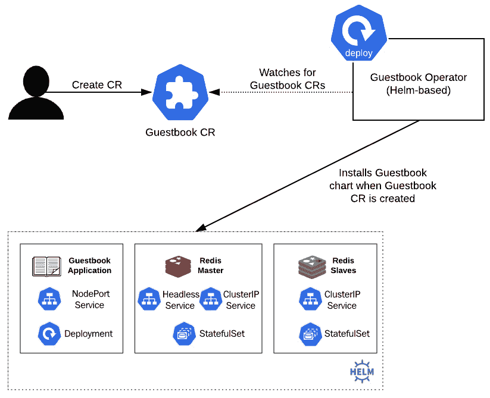
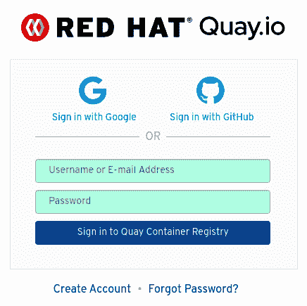
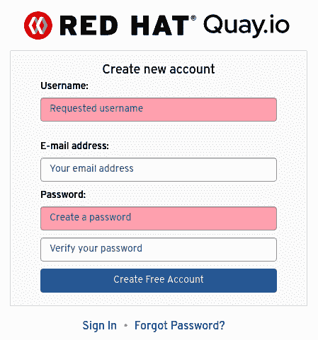
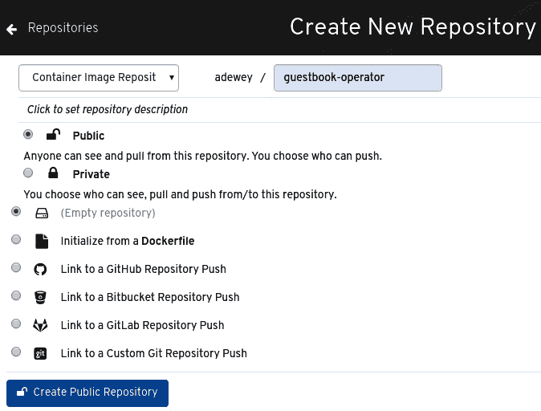
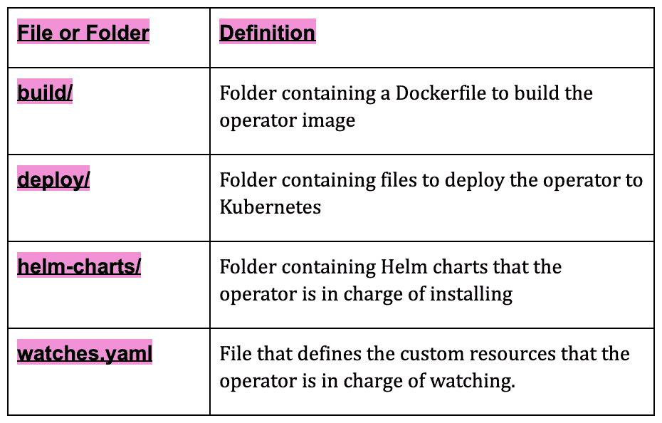
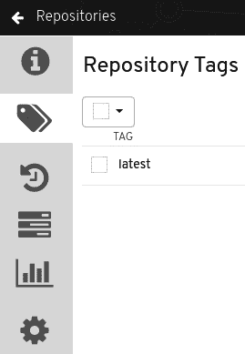
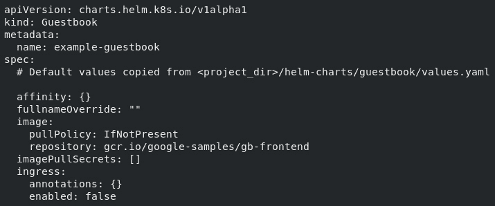

# 八、操作框架和Helm

使用 Helm 的优势之一是能够同步本地状态和活动状态。使用 Helm，本地状态由值文件管理，当使用`install`或`upgrade`命令提供时，这些值将应用于 Kubernetes 集群中的实时状态同步。在前面的章节中，这是通过在需要更改应用时调用这些命令来实现的。

同步这些更改的另一种方法是在集群中创建一个应用，定期检查所需的状态是否与环境中的当前配置相匹配。如果状态不匹配，应用可以自动修改环境以匹配所需的状态。这个应用被称为 Kubernetes 操作符。在本章中，我们将创建一个基于 Helm 的操作符，帮助确保本地定义的状态始终与集群的活动状态相匹配。如果没有，操作员将执行适当的 Helm 命令来更新环境。

我们将在本章中讨论以下主题:

*   理解库伯内特算子
*   创建掌舵操作员
*   使用 Helm 管理操作员和**定制资源** ( **CRs** )
*   清理你的 Kubernetes 环境

# 技术要求

对于本章，您需要在本地计算机上安装以下技术:

*   `minikube`
*   `helm`
*   `kubectl`

除了这些工具之外，您应该可以在 https://github.com/PacktPublishing/-Learn-Helm 的找到包含与 GitHub 上的示例相关的资源的 Packt 存储库。本章将引用该存储库。

# 理解库伯内特算子

自动化是 Kubernetes 平台的核心。正如 [*第 1 章*](01.html#_idTextAnchor017)*中所述，理解Kubernetes和Helm*，Kubernetes资源可以通过运行`kubectl`命令隐式管理，也可以通过应用 **YAML** 格式的表示声明性管理。一旦使用Kubernetes**命令行界面** ( **CLI** )应用了资源，Kubernetes 的基本原则之一就是将集群内资源的当前状态匹配到所需状态，这一过程被称为**控制循环**。这种持续、不终止的集群状态监控模式是通过使用控制器来实现的。Kubernetes 包括许多平台本地的控制器，例如拦截请求的准入控制器、Kubernetes **应用编程接口** ( **应用编程接口)**以及管理正在运行的 Pod 副本数量的复制控制器。

随着人们对 Kubernetes 的兴趣开始增长，为用户提供扩展基础平台功能的能力，以及围绕管理应用生命周期提供更多智能的方式，这两者的结合导致了几个重要概念的产生，这些概念定义了第二波 Kubernetes 开发。首先，**自定义资源定义** ( **CRDs** )的引入使用户能够扩展默认的 Kubernetes API(与 Kubernetes 平台交互的机制)，以便创建和注册新类型的资源。注册一个新的 CRD 会在 Kubernetes API 服务器上创建一个新的表示状态转移 ( **REST** **ful** )资源路径。因此，类似于如何使用 Kubernetes CLI 执行`kubectl get pods`来检索所有 Pod 对象，为名为**留言簿**的对象类型注册一个新的 CRD，例如，允许调用`kubectl get guestbook`来查看之前创建的所有留言簿对象。随着这一新功能的实现，开发人员现在可以创建自己的控制器来监控这些类型的 CRs，以管理可以通过使用 CRD 来描述的应用的生命周期。

第二个主要趋势是部署在 Kubernetes 上的应用类型的进步。越来越频繁地部署更复杂和有状态的应用，而不是小而简单的应用。这些类型的高级应用通常需要更高级别的管理和维护，例如处理多个组件的部署，以及围绕“第二天”活动的考虑，例如备份和恢复。这些任务超出了 Kubernetes 中常见的控制器类型，因为与它们所管理的应用相关的深厚知识必须嵌入其中。这种使用 CR 管理应用及其组件的模式被称为“T2”操作员模式。由软件公司 CoreOS 于 2016 年首次创造的“操作员”旨在获取操作员管理应用生命周期所需的知识。运营商被打包成普通的容器化应用——部署在Pod 中——对应用接口的变化作出反应，而不依赖于客户关系管理系统。

运算符通常使用名为“运算符框架”的工具包编写，并基于以下三种不同技术之一:

*   去
*   Ansible
*   舵

基于 Go 的运算符利用 Go 编程语言来实现控制循环逻辑。基于 Ansible 的操作员利用 Ansible 命令行界面工具和 Ansible 行动手册。Ansible 是一个自动化工具，它的逻辑写在 YAML 文件中，叫做剧本。

在这一章中，我们将集中讨论基于头盔的操作器。舵手操作员基于舵手图表和由舵手命令行界面提供的功能子集来进行他们的控制回路逻辑。因此，它们代表了 Helm 用户实现其运营商的一种简单方式。

了解了操作符之后，让我们创建一个自己的操作符，u 唱 Helm。

# 创建掌舵操作员

在本节中，我们将编写一个基于掌舵的操作器，用于安装在 [*第 5 章*](05.html#_idTextAnchor265)*中创建的留言簿Helm图表*。这个图表可以在 Pack [t 资源库的`guestbook/`文件夹下看到(https://github . com/PacktPublishing/-Learn-Helm/tree/master/Helm-charts/ch](https://github.com/PacktPublishing/-Learn-Helm/tree/master/helm-charts/charts/guestbook)arts/guest book)。

操作符被构建为一个容器映像，其中包含维护应用的控制循环逻辑。下图演示了留言簿操作器部署后的工作方式:



图 8.1–留言簿操作员工作流程

留言簿操作员将持续观察留言簿 CRs 的变化。创建留言簿 CR 时，留言簿操作员将安装您在 [*第 5 章*](05.html#_idTextAnchor265)*创建的留言簿图表*。相反，如果留言簿 CR 被删除，留言簿操作员将删除留言簿Helm图表。

了解了留言簿操作员将如何工作，让我们建立一个可以构建和部署操作员的环境。

## 设置环境

首先，由于操作员将被部署到 Kubernetes，您应该通过运行以下命令来启动您的 Minikube 环境:

```
$ minikube start
```

启动 Minikube 后，创建一个名为`chapter8`的命名空间，如下所示:

```
$ kubectl create ns chapter8
```

由于留言簿操作符是作为容器映像构建的，因此您需要创建一个可以存储它的映像存储库，以便以后可以引用它。为了存储这个映像，我们将在 Quay (quay.io)中创建一个新的存储库，这是一个公共的容器登记处(尽管如果您在其他地方有一个帐户，这也足够了)。我们还将准备一个本地开发环境，其中包含构建操作员形象所需的必要工具。

让我们从在Docker创建一个新的映像库开始。

### 创建Docker仓库

在Docker创建一个新的仓库需要你有一个Docker账户。按照以下步骤创建Docker accou [nt:](https://quay.io/signin/)

1.  [Navigate to https:/](https://quay.io/signin/)/quay.io/signin/ in your browser. You will be prompted by a screen to enter your Quay credentials, as illustrated in the following screenshot:

    

    图 8.2–红帽Docker签到页面

2.  At the bottom of the page, click the **Create Account** link. You will be prompted with a set of dialog boxes to create a new Quay account, as illustrated in the following screenshot:

    

    图 8.3–红帽Docker**创建新账户**页面

3.  输入您需要的凭证，然后选择**创建免费账户**。
4.  You will soon be sent an email confirmation. Click the link on the confirmation email to verify your account and continue using Quay with your new account.

    创建新的 Quay 帐户后，您可以继续为操作员映像创建新的映像存储库。

    要创建新的映像库，请选择Docker页面右上角的 **+** 加号图标，然后选择**新库**，如下图所示:

    

    图 8.4–选择“新存储库”以创建新的映像存储库

5.  You will then be taken to the **Create New Repository** page, where you should enter the following details:

    对于**存储库名称**，输入`guestbook-operator.`

    选择**公共**单选按钮，表示对存储库的未经验证的访问。这一更改将简化 Kubernetes 访问映像的方式。

    其余选项可以保持默认值。完成后，将出现**创建新存储库**页面，如下图所示:

    

    图 8.5–Docker的“创建新仓库”页面

6.  选择**创建公共仓库**按钮创建Docker仓库。

现在已经创建了一个存储库来存储留言簿操作员映像，让我们准备一个环境，其中包含构建 Helm 操作员所需的工具。

### 准备本地发展环境

为了创建 Helm 操作符，您至少需要以下 CLI 工具:

*   `operator-sdk`
*   `docker`、`podman`或`buildah`

`operator-sdk` CLI 是用于帮助开发 Kubernetes 操作员的工具包。它包含简化操作员开发流程的内在逻辑。在引擎盖下，`operator-sdk`需要一个容器管理工具，可以用来构建操作员形象。`operator-sdk` CLI 支持`docker`、`podman`和`buildah`作为底层容器管理工具。

要安装`operator-sdk`命令行界面，您只需从他们位于 https://github.com/operator-framework/运营商-sdk/releases 的 [GitHub 存储库中下载一个版本。但是，根据您的操作系统，安装`docker`、`podman`或`buildah`的过程可能会有很大不同；更不用说，Windows 用户将无法在本地使用`operator-sdk`](https://github.com/operator-framework/operator-sdk/releases)lkit。

幸运的是，Minikube **虚拟机** ( **虚拟机**)可以作为许多不同操作系统的开发人员的工作环境，因为它是一个 Linux 虚拟机，并且还包含 Docker CLI。在本节中，我们将把`operator-sdk`安装到 Minikube VM 中，并将使用这个环境来创建操作员。请注意，虽然提供的步骤是为在虚拟机中运行而设计的，但这些步骤中的大多数也将适用于所有 Linux 和 Mac 机器。

按照以下步骤将安装到迷你库贝虚拟机的上:

1.  通过运行`minikube ssh`命令来访问虚拟机，如下所示:

    ```
    $ minikube ssh
    ```

2.  Once inside the VM, you need to download the `operator-sdk` CLI. This can be accomplished using the `curl` command. Note that the `operator-sdk` version used at the time of writing was version `0.15.2`.

    要下载此版本的`operator-sdk`命令行界面，请运行以下命令:

    ```
    $ cu**rl -o operator-sdk -L https://github.com/operator-framework/operator-sdk/releases/download/v0.15.2/operator-sdk-v0**.15.2-x86_64-linux-gnu 
    ```

3.  下载后，您需要将`operator-sdk`二进制文件的权限更改为用户可执行。运行`chmod`命令进行修改，如下所示:

    ```
    $ chmod u+x operator-sdk
    ```

4.  接下来，将`operator-sdk`二进制文件移动到由虚拟机的`PATH`变量管理的位置，例如`/usr/bin`。由于该操作需要根权限，您将需要使用`sudo`运行命令，如下所示:

    ```
    $ sudo mv operator-sdk /usr/bin
    ```

5.  Finally, verify your `operator-sdk` installation by running the `operator-sdk version` command, like this:

    ```
    $ operator-sdk version
    operator-sdk version: 'v0.15.2', commit: 'ffaf278993c8fcb00c6f527c9f20091eb8dd3352', go version: 'go1.13.3 linux/amd64'
    ```

    如果此命令执行无误，则说明您已经成功安装了`operator-sdk` CLI。

6.  作为额外的步骤，您还应该在您的 Minikube 虚拟机中克隆 Packt 存储库，因为我们稍后将利用`guestbook` Helm 图表来构建 Helm 操作符。在虚拟机中运行以下命令来克隆 r [档案:](https://github.com/PacktPublishing/-Learn-Helm.git)

    ```
    **$ git clone https://github.com/PacktPub**lishing/-Learn-Helm.git Learn-Helm
    ```

现在您已经有了一个 Quay 映像存储库和一个从 Minikube VM 创建的本地开发环境，让我们开始编写留言簿操作符。请注意，操作员代码的一个示例位于 https://github.com/PacktPublishing/-Learn-Helm/tree/master/guestbook-operator 的 Packt 存储库中。

## 搭建操作员文件结构

类似于 Helm 图表本身，由`operator-sdk` CLI 构建的 Helm 操作符有一个必须遵守的特定文件结构。下表解释了文件结构:



图 8.6–解释的文件结构

可以使用`operator-sdk new`命令轻松创建操作员文件结构。在您的迷你库虚拟机中，执行以下命令来构建留言簿操作员:

```
$ operator-sdk new guestbook-operator --type helm --kind Guestbook --helm-chart Learn-Helm/helm-charts/charts/guestbook
INFO[0000] Creating new Helm operator 'guestbook-operator'. 
INFO[0003] Created helm-charts/guestbook       
WARN[0003] Using default RBAC rules: failed to get Kubernetes config: could not locate a kubeconfig 
INFO[0003] Created build/Dockerfile                     
INFO[0003] Created watches.yaml                         
INFO[0003] Created deploy/service_account.yaml          
INFO[0003] Created deploy/role.yaml                     
INFO[0003] Created deploy/role_binding.yaml             
INFO[0003] Created deploy/operator.yaml                 
INFO[0003] Created deploy/crds/charts.helm.k8s.io_v1alpha1_guestbook_cr.yaml 
INFO[0003] Generated CustomResourceDefinition manifests. 
INFO[0003] Project creation complete.
```

`operator-sdk new`命令创建了一个名为`guestbook-operator`的本地目录，其中包含操作员内容。规定应使用`--type`旗帜和`Guestbook`作为华润的名称创建掌舵人。

最后，`--helm-chart`标志指示`operator-sdk` CLI 将源留言簿图表复制到操作员目录。

随着留言簿操作员成功搭建，让我们构建操作员并将其推送到我们的Docker登记处。

## 建造操作员并将其推到Docker

`operator-sdk`命令行界面提供了一个`operator-sdk build`命令，使得可以直接构建操作员映像。该命令被设计为针对操作员的顶级目录运行，并将通过引用位于操作员的`build/` 文件夹下的 Dockerfile 来构建映像。

在您的迷你库虚拟机中，运行`operator-sdk build`命令，根据指示替换您的Docker用户名，如下所示:

```
$ cd guestbook-operator
$ operator-sdk build quay.io/$QUAY_USERNAME/guestbook-operator
```

如果构建成功，您将收到以下消息:

```
INFO[0092] Operator build complete.
```

由于 Minikube 虚拟机安装了 Docker，因此`operator-sdk` CLI 在后台使用 Docker 来构建映像。您可以运行`docker images`命令来验证映像是否已构建，如下所示:

```
$ docker images
```

在本地构建操作员映像后，必须将其推送到映像注册表中，以便从 Kubernetes 中提取。为了使用 Docker 将映像推送到注册表，您必须首先向目标注册表进行身份验证。使用`docker login`命令登录Docker，如以下代码片段所示:

```
$ docker login quay.io --username $QUAY_USERNAME --password $QUAY_PASSWORD
```

登录Docker后，使用`docker push`命令将操作员映像推送到Docker登记处，如下所示:

```
$ docker push quay.io/$QUAY_USERNAME/guestbook-operator
```

当推送完成后，返回到您在*创建Docker仓库*部分创建的`guestbook-operator`仓库。您应该能够看到在**存储库标签**部分下发布的新标签，如下图所示:



图 8.7–一个新的标签应该被推送到你的Docker登记处

现在您的操作符已经被推送到容器注册中心，让我们继续将操作符部署到您的 Kub ernetes 环境中。

## 部署留言簿操作员

在搭建留言簿操作员时，`operator-sdk` CLI 还创建了一个名为`deploy`的文件夹，并生成了在其中部署操作员所需的文件。

以下文件结构描述了`deploy`文件夹的内容:

```
deploy/
  crds/
    charts.helm.k8s.io_guestbooks_crd.yaml
    charts.helm.k8s.io_v1alpha1_guestbook_cr.yaml
  operator.yaml
  role_binding.yaml
  role.yaml
  service_account.yaml
```

`crds/`文件夹包含创建留言簿 CRD ( `charts.helm.k8s.io_guestbooks_crd.yaml`)所需的 YAML 资源。该文件是向Kubernetes注册新留言簿应用编程接口端点所必需的。此外，`crds/`文件夹包含一个示例留言簿 CR 应用(`charts.helm.k8s.io_v1alpha1_guestbook_cr.yaml`)。创建此文件将触发操作员安装留言簿Helm图表。

查看 CR 的内容，以便熟悉定义的属性类型，如下所示:

```
$ cat guestbook-operator/deploy/crds/charts.helm.k8s.io_v1alpha1_guestbook_cr.yaml
```

下面的代码块提供了输出的一个片段:



图 8.8–留言簿 CR 的片段

`spec`小节下的每个条目都是指留言簿图表的`values.yaml`文件。`operator-sdk`工具自动用该文件中包含的每个默认值创建了该示例 CR。在应用此 CR 之前，可以添加或修改其他条目，以覆盖留言簿图表的其他值。操作员在运行时使用这些值来相应地部署留言簿应用。

`deploy/operator.yaml`文件定义了实际的操作员本身，并包含一个简单的部署资源。我们将很快回到这个文件的内容。

创建`role_binding.yaml`、`role.yaml`和`service_account.yaml`文件的目的是为操作员提供必要的权限来查看留言簿 CRs 并将留言簿 Helm 图表安装到 Kubernetes。它通过使用`service_account.yaml`文件中定义的服务帐户向 Kubernetes API 进行身份验证来执行这些操作。一旦通过认证，运营商将获得基于`role.yaml`和`role_binding.yaml`资源的授权。`role.yaml`文件列出了细粒度的权限，这些权限描述了操作员被允许执行的确切资源和操作。`role_binding.yaml`文件将角色绑定到操作员的服务帐户。

了解在操作员的`deploy/`文件夹下创建的每个资源后，按照以下步骤部署您的留言簿操作员:

1.  不幸的是，Minikube 虚拟机不包含`Kubectl`，因此如果您仍然从命令行连接到虚拟机，您必须首先退出到您的本地系统，方法是运行以下命令:

    ```
    $ exit
    ```

2.  The resources that were created with `operator-sdk` earlier are also located in the Packt repository under the `guestbook-operator/` folder. If you have not cloned this repository in previous chapters, clone it now using the following command:

    ```
    $ git clone https://github.com/PacktPublishing/-Learn-Helm.git Learn-Helm
    ```

    另外，请注意，Packt 存储库中唯一一个从您在 Minikube 虚拟机中创建的资源中修改的资源是`role.yaml`文件。`operator-sdk`命令行界面基于包含在留言簿 Helm 图表中的模板文件生成了一个简单的`role.yaml`文件。然而，如果你还记得的话，留言簿图表包含了一些资源，这些资源只基于一个条件值。这些资源是`Job`和`PersistentVolumeClaim`挂钩资源，只有在启用持久存储时才会包括在内。这方面的一个例子显示在`PersistentVolumeClaim`模板中，在下面的代码片段中:

    ```
    {{- if .Values.redis.master.persistence.enabled }}
    apiVersion: v1
    kind: PersistentVolumeClaim
    ```

    `operator-sdk`命令行界面没有自动为`Jobs`和`PersistentVolumeClaims`创建**基于角色的访问控制** ( **RBAC** )规则，因为它不知道该模板是否包括在内。

    因此，作者将这些规则添加到了`role.yaml`文件中，该文件位于 https://github . com/PacktPublishing/-Learn-Helm/blob/master/guest book-operator/deploy/role . YAML # L81-L104。

3.  The Guestbook operator will be dependent on a new API endpoint. Create this endpoint by applying the CRD under the `guestbook-operator/deploy/crds` folder, as follows:

    ```
    $ kubectl apply -f guestbook-operator/deploy/crds/charts.helm.k8s.io_guestbooks_crd.yaml
    ```

    稍后，我们将使用该文件夹(CR)下的第二个文件来部署留言簿应用。

4.  Next, you will need to modify the `guestbook-operator/deploy/operator.yaml` file to specify the operator image that you built earlier. You will notice the following lines of code within this file:

    ```
    # Replace this with the built image name
    image: REPLACE_IMAGE
    ```

    用操作员映像的位置替换`REPLACE_IMAGE`文本。该值应类似于`quay.io/$QUAY_USERNAME/guestbook-operator`。

5.  一旦您应用了 CRD 并更新了您的`operator.yaml`文件，您就可以通过运行以下命令来应用`guestbook-operator/deploy/`文件夹下的每个资源:

    ```
    $ kubectl apply -f guestbook-operator/deploy -n chapter8
    ```

6.  等待操作员报告`1/1`就绪状态，方法是对`chapter8`名称空间中的 Pods 运行一个手表，如下所示:

    ```
    $ kubectl get pods -n chapter8 -w
    ```

现在已经部署了留言簿操作员，让我们用它来安装留言簿Helm图表。

## 部署留言簿应用

当通常使用 Helm 作为独立的命令行界面工具时，您可以通过运行`helm install`命令来安装 Helm 图表。通过Helm操作符，您可以通过创建一个 CR 来安装一个Helm图表。通过创建位于`guestbook-operator/deploy/crds/`文件夹下的提供的 CR 来安装留言簿Helm图表，如以下代码片段所示:

```
$ kubectl apply -f guestbook-operator/deploy/crds/charts.helm.k8s.io_v1alpha1_guestbook_cr.yaml -n chapter8
```

对`chapter8`命名空间中的 Pods 运行另一个`watch`命令，如下面的代码片段所示，您应该能够看到 Guestbook 和 Redis Pods 由于 Helm 图表的安装而旋转起来:

```
$ kubectl get pods -n chapter8 -w
```

以下代码块描述了处于`READY`状态的每个 Pod:

```
NAME                                  READY   STATUS    RESTARTS
example-guestbook-65bc5fdc55-jvkdz    1/1     Running   0
guestbook-operator-6fddc8d7cb-94mzp   1/1     Running   0
redis-master-0                        1/1     Running   0
redis-slave-0                         1/1     Running   0
redis-slave-1                         1/1     Running   0
```

创建留言簿 CR 时，操作员执行`helm install`命令安装留言簿图表。您可以确认通过运行`helm list`创建的版本，如下所示:

```
$ helm list -n chapter8
NAME             	NAMESPACE	REVISION	UPDATED       
example-guestbook	chapter8 	1       	2020-02-24
```

可以通过修改`example-guestbook` CR 来升级版本。修改您的`guestbook-operator/deploy/crds/charts.helm.k8s.io_v1alpha1_guestbook_cr.yaml`文件以更改来自`1 to 2`的副本数量，如下所示:

```
replicaCount: 2
```

更新`replicaCount`值后，应用更改，如下所示:

```
$ kubectl apply -f guestbook-operator/deploy/crds/charts.helm.k8s.io_v1alpha1_guestbook_cr.yaml -n chapter8
```

对留言簿 CR 的修改将触发`example-guestbook`释放的`helm upgrade`命令。大家可能还记得 [*第五章*](05.html#_idTextAnchor265)*构建你的第一个Helm图表*，留言簿Helm图表的升级挂钩会启动 Redis 数据库的备份。如果您在修改 CR 后对`chapter8`命名空间中的 Pods 运行观察，您将注意到备份`Job`开始，并且一旦备份完成，将看到两个留言簿 Pods 中的一个终止。您还会从以下代码片段中的`helm list`命令中注意到,`example-guestbook`版本的修订号增加到了`2`:

```
$ helm list -n chapter8
NAME             	NAMESPACE	REVISION	UPDATED       
example-guestbook	chapter8 	2       	2020-02-24
```

虽然版本号增加到了`2`，但是在编写本文时，基于 Helm 的运算符的一个限制是，您不能像使用 CLI 一样启动回滚到以前的版本。如果您试图对`example-guestbook`版本运行`helm history`，您还会注意到版本历史中只有第二个版本，如以下代码片段所示:

```
$ helm history example-guestbook -n chapter8
REVISION	UPDATED                 	STATUS        
2       	Tue Feb 25 04:36:10 2020	deployed
```

这是通过命令行界面定期使用 Helm 和通过基于 Helm 的操作员使用 Helm 之间的一个重要区别。因为不保留发布历史，所以基于 Helm 的操作符不允许您执行显式回滚。但是，在升级失败的情况下，将运行`helm rollback`命令。在这种情况下，将执行回滚挂钩，试图回滚到尝试的升级。

尽管基于 Helm 的运营商不保留发布历史，但它擅长的一个领域是同步应用的期望状态和实时状态。这是因为操作员不断地监视 Kubernetes 环境的状态，并确保应用始终配置为与 CR 上指定的配置相匹配。换句话说，如果其中一个留言簿应用的资源被修改，操作员将立即恢复更改，使其符合 CR 上定义的规范。您可以通过修改留言簿资源中的一个字段来查看此操作。

例如，我们将直接将留言簿部署的副本数量从`2`更改为`3`，并观察操作员将其自动恢复回`2`副本，以重新同步 CR 中定义的所需状态。

执行以下`kubectl patch`命令，将留言簿部署的副本数量从`2`更改为`3`:

```
$ kubectl patch deployment example-guestbook -p '{'spec':{'replicas':3}}' -n chapter8
```

通常，这只是添加了一个额外的留言簿应用副本。但是，由于留言簿 CR 目前只定义了`2`个副本，操作员很快将副本计数更改回`2`，并终止创建的附加 Pod。如果你真的想增加副本数量到`3`，你必须更新留言簿上的`replicaCount`值。这个过程提供了确保所需状态与集群的活动状态相匹配的优势。

使用基于 Helm 的操作器卸载留言簿应用就像移除 CR 一样简单。删除`example-guestbook` CR 卸载版本，如下图:

```
$ kubectl delete -f guestbook-operator/deploy/crds/charts.helm.k8s.io_v1alpha1_guestbook_cr.yaml -n chapter8
```

这将删除`example-guestbook`版本和所有相关资源。

您也可以删除留言簿操作符及其资源，因为我们在下一部分不需要它们。您可以通过运行以下命令来实现这一点:

```
$ kubectl delete -f guestbook-operator/deploy/ -n chapter8
```

一般来说，您应该始终确保在删除操作员之前先删除 CR。操作员被编程为当您删除 CR 时，在释放时执行`helm uninstall`命令。如果你不小心先删除了操作符，你将不得不从命令行手动运行`helm uninstall`。

在本节中，您创建了一个 Helm 操作符，并学习了如何使用基于操作符的方法部署应用。在下一节中，我们将通过研究如何使用 Helm 管理 y 来继续讨论运算符。

# 使用 Helm 管理操作员和 CRs

在的上一部分，你通过首先创建位于`guestbook-operator/deploy/crds/`文件夹下的 CRD 来安装留言簿操作器。接下来，您创建了包含在`guestbook-operator/deploy/`文件夹下的操作员资源。最后，您创建了 CR 来部署留言簿应用。这些任务中的每一项都是通过使用 Kubectl CLI 来执行的，但是这也可以使用 Helm 图表来完成，从而为安装和管理操作员提供更灵活和可重复的解决方案。

Helm 允许您在 Helm 图表中提供一个名为`crds/`的特殊目录，每当安装图表时，该目录都用于创建 CRD。Helm 在`templates/`文件夹下定义的任何其他资源之前创建 CRD，这使得安装依赖于 CRD 的应用(如操作员)变得更加简单。

以下文件结构描述了可用于安装留言簿操作器的 Helm 图表:

```
guestbook-operator/
  Chart.yaml
  crds/
    charts.helm.k8s.io_guestbooks_crd.yaml
  templates/
    operator.yaml
    role_binding.yaml
    role.yaml
    Service_account.yaml
  values.yaml
```

这个Helm图表，安装后，将首先安装留言簿 CRD。如果集群中已经存在 CRD，它将跳过 CRD 创建，而只创建模板资源。请注意，虽然 CRD 可以方便地包含在 Helm 图表中，但有几个限制。首先，Helm 图表中的 CRD 不能包含任何 Go 模板，因此 CRD 不能像典型资源一样从参数化中受益。CRD 也永远不能升级、回滚或删除。因此，如果需要这些操作，用户必须小心手动修改或删除 CRDs。最后，安装如前所述的图表需要群集管理权限，这是 Kubernetes 中允许的最高权限，因为该图表至少包含一个 CRD 资源。

集群管理员可以使用前面描述的 Helm 图表轻松安装留言簿操作器。然而，这只是等式的一半，因为最终用户仍然必须创建 CRs 来部署留言簿应用。幸运的是，运营商的最终用户也可以通过创建包装留言簿 CR 的 Helm 图表来利用 Helm。

下面的文件结构显示了这种 Helm 图表的布局示例:

```
guestbook-cr
  Chart.yaml
  templates/
    guestbook.yaml
  values.yaml
```

前面的例子包括一个名为`guestbook.yaml`的模板。该模板可能包含最初由`operator-sdk`命令行界面生成的留言簿 CR，名称为`charts.helm.k8s.io_v1alpha1_guestbook_cr.yaml`。与 CRD 不同的是，`templates/`文件夹下的 CRs 受益于 Go 模板和生命周期管理，所有其他资源也是如此。当客户关系报告包含复杂字段时，或者当同一版本中必须包含多个不同的客户关系报告时，这种方法可以提供最大的价值。使用这种方法，您还能够管理您的 CRs 的生命周期，并维护修订的历史记录。

现在您已经了解了如何创建 Helm 操作符以及如何使用 Helm 来帮助管理操作符，请在下一节中随意清理您的 Kubernetes e 环境。

# 清理你的 Kubernetes 环境

首先，运行以下命令删除你的留言簿 CRD:

```
$ kubectl delete crd guestbooks.charts.helm.k8s.io
```

在您继续下一个清理步骤之前，请注意，稍后在*问题*部分提出的一个问题将要求您编写自己的 Helm 图表，以实现在*使用 Helm 管理操作员和客户关系管理系统*部分讨论的图表设计。您可能希望推迟这些步骤来测试您的实现。

要继续清理，运行以下命令删除您的`chapter8`命名空间:

```
$ kubectl delete ns chapter8
```

最后，运行`minikube stop` 命令停止您的迷你库虚拟机。

# 总结

运算符对于帮助确保所需状态始终与活动状态相匹配非常重要。这样的壮举允许用户更容易地维护资源配置的真实来源。用户可以利用基于 Helm 的操作器来提供这种类型的资源协调，并且很容易开始，因为这使用 Helm 图表作为其部署机制。创建 CR 后，Helm 操作员将安装相关的 Helm 图表以创建新版本。修改 CR 时将执行后续升级，删除 CR 时将卸载版本。

为了管理操作员，集群管理员可以创建一个单独的 Helm 图表，用于创建操作员的资源和 CRD。最终用户还可以创建单独的 Helm 图表，该图表可用于创建运营商的 CRs，以及任何其他可能相关的资源。

在下一章中，我们将讨论 Helm 生态系统中围绕安全性的最佳实践和主题。

# 进一步阅读

有关 Kubernetes 资源的更多信息，您可以查看以下链接:

*   要发现更多由社区开发的运营商，请访问 b.com/operator-framework/awesome-Operators.
*   您可以从[https://Kubernetes . io/docs/concepts/extend-Kubernetes/operator/上的 Kubernetes 文档中了解更多关于运算符及其起源的信息。](https://kubernetes.io/docs/concepts/extend-kubernetes/operator/. )

# 问题

1.  Kubernetes 操作符是如何工作的？
2.  使用 Helm 命令行界面和使用基于 Helm 的操作符有什么区别？
3.  假设你的任务是从一个现有的Helm图表中创建一个Helm操作员。你会采取什么步骤来完成这项任务？
4.  Helm 操作系统中的安装、升级、回滚和卸载生命周期挂钩是如何工作的？
5.  Helm 图表中`crds/`文件夹的目的是什么？
6.  在*使用 Helm 管理运营商和 CRs* 部分，我们介绍了两种不同的 Helm 图表，可用于帮助管理运营商和 CRs。使用该部分中提供的图表布局实现 Helm 图表。图表应用于安装留言簿操作员和安装留言簿 CR。参考 [*第 5 章*](05.html#_idTextAnchor265)*建立你的第一个舵角图*获得创建舵角图的帮助。