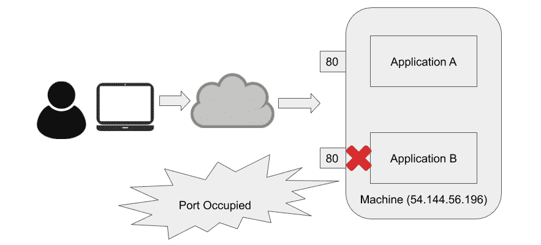
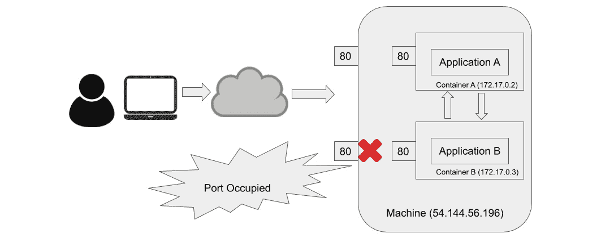
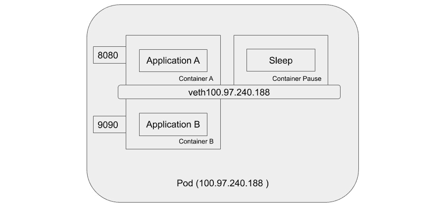
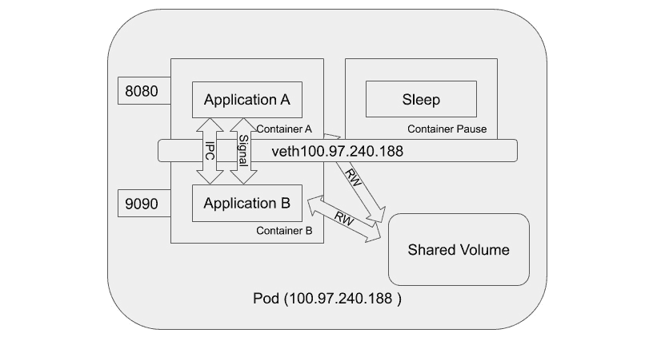
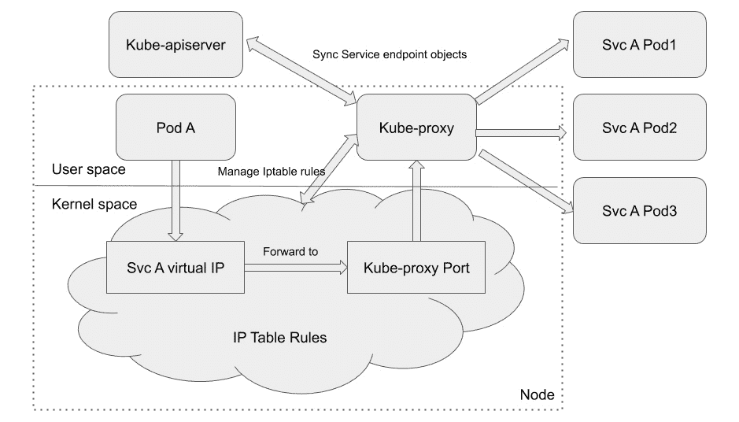
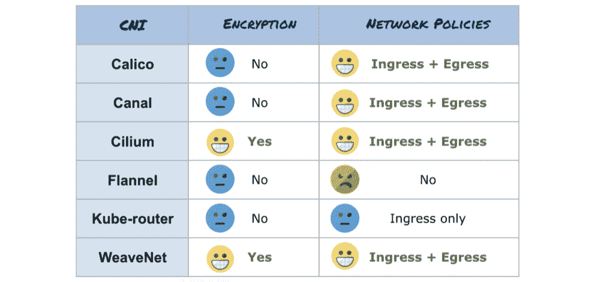

# 二、Kubernetes网络

当数以千计的微服务在 Kubernetes 集群中运行时，您可能会好奇这些微服务如何相互通信以及如何与互联网通信。在本章中，我们将揭示 Kubernetes 集群中的所有通信路径。我们希望您不仅知道通信是如何发生的，而且要以安全的心态来研究技术细节:常规的通信渠道总是会被滥用，成为扼杀链的一部分。

在本章中，我们将涵盖以下主题:

*   Kubernetes 网络模型概述
*   在PODS里交流
*   Pod 之间的通信
*   介绍 Kubernetes 服务
*   介绍 CNI 和 CNI 插件

# Kubernetes网络模型概述

在 Kubernetes 集群上运行的应用应该可以从集群内部访问，也可以从集群外部访问。从网络的角度来看，这意味着可能有一个**统一资源标识符** ( **URI** )或**互联网协议** ( **IP** )地址与应用相关联。多个应用可以在同一个 Kubernetes 工作节点上运行，但是它们如何在不相互冲突的情况下暴露自己呢？让我们一起来看看这个问题，然后潜入 Kubernetes 网络模型。

## 端口共享问题

传统上，如果有两个不同的应用在同一台机器上运行，并且机器 IP 是公共的，并且这两个应用是公共可访问的，那么这两个应用不能在机器的同一端口上侦听。如果它们都试图在同一台机器的同一个端口上侦听，那么当端口正在使用时，一个应用将不会启动。下图简单说明了这一点:



图 2.1–节点(应用)上的端口共享冲突

为了解决端口共享冲突问题，这两个应用需要使用不同的端口。显然，这里的限制是两个应用必须共享同一个 IP 地址。如果他们仍然坐在同一台机器上，却有自己的 IP 地址呢？这是纯粹的 Docker 方法。如果应用不需要向外公开自己，这将很有帮助，如下图所示:



图 2.2–节点(容器)上的端口共享冲突

在上图中，两个应用都有自己的 IP 地址，因此它们都可以监听端口 **80** 。它们可以在同一个子网中相互通信(例如，Docker 桥)。但是，如果两个应用都需要通过将容器端口绑定到主机端口来对外暴露自己，它们就不能绑定到同一个端口 **80** 。至少有一个端口绑定将失败。如上图所示，由于主机端口 **80** 被容器 **A** 占用，容器 **B** 无法绑定到主机端口 **80** 。端口共享冲突问题仍然存在。

动态端口配置给系统带来了端口分配和应用发现的复杂性；但是，Kubernetes 并不采用这种方法。让我们讨论一下解决这个问题的 Kubernetes 方法。

## 非立方体网络模型

在 Kubernetes 集群中，每个 pod 都有自己的 IP 地址。这意味着应用可以在 pod 级别相互通信。这种设计的美妙之处在于，它提供了一个干净、向后兼容的模型，从端口分配、命名、服务发现、负载平衡、应用配置和迁移的角度来看，pods 的行为类似于**虚拟机** ( **虚拟机**)或物理主机。同一容器内的容器共享相同的 IP 地址。使用相同默认端口的类似应用(Apache 和 nginx)不太可能在同一个 pod 中运行。实际上，捆绑在同一个容器中的应用通常具有依赖性或者服务于不同的目的，并且由应用开发人员将它们捆绑在一起。一个简单的例子是，在同一个窗格中，有一个**超文本传输协议** ( **HTTP** )服务器或 nginx 容器来提供静态文件，主 web 应用来提供动态内容。

Kubernetes 利用 CNI 插件来实现 IP 地址分配、管理和 pod 通信。然而，所有插件都需要遵循这里列出的两个基本要求:

1.  一个节点上的 Pods 可以与所有节点中的所有 pods 通信，而无需使用**网络地址转换** ( **NAT** )。
2.  `kubelet`等代理可以与同一个节点的PODS进行通信。

前面两个要求强化了将虚拟机内部的应用迁移到 pod 的简单性。

分配给每个 pod 的 IP 地址是私有 IP 地址或不可公开访问的群集 IP 地址。那么，如何才能让一个应用变得可以公开访问，而不与集群中的其他应用冲突呢？Kubernetes 服务是向公众展示内部应用的服务。我们将在后面的章节中深入探讨 Kubernetes 服务概念。现在，用图表来总结本章的内容将会很有用，如下所示:


图 2.3–暴露在互联网上的服务

在上图中，有一个 **k8s 集群**，其中有四个应用在两个 Pod 中运行:**应用 A** 和**应用 B** 在 **Pod X** 中运行，它们共享同一个 pod IP 地址—**100.97.240.188**—而它们分别监听端口 **8080** 和 **9090** 。同样的，**应用 C** 和**应用 D** 分别在**Pod  Y** 运行，在端口 **8000** 和 **9000** 监听。公众可通过以下面向公众的 Kubernetes 服务访问这四个应用:**svc.a.com**、**svc.b.com**、**svc.c.com**和**svc.d.com**。pods(【图中的 T33】 X【图中的 T34】和【图中的 T35】 Y【图中的 T36】)可以部署在单个工作节点中，也可以跨 1000 个节点进行复制。然而，从用户或服务的角度来看，这没有什么区别。虽然图中的部署非常不寻常，但是仍然需要在同一个 pod 中部署多个容器。是时候看看 s ame pod 内部的容器通信了。

# 在PODS里交流

同一个容器内的容器共享同一个容器的 IP 地址。通常，由应用开发人员将容器映像捆绑在一起，并解决任何可能的资源使用冲突，如端口侦听。在本节中，我们将深入探讨Pod 内部容器之间如何进行通信的技术细节，并将重点介绍发生在 netwo rk 层级之外的通信。

## Linux 命名空间和暂停容器

Linux 命名空间是 Linux 内核的一个特性，用于出于隔离目的对资源进行分区。通过分配名称空间，一组进程可以看到一组资源，而另一组进程可以看到另一组资源。名称空间是现代容器技术的一个主要的基本方面。为了深入了解 Kubernetes，读者理解这个概念是很重要的。因此，我们给出了所有 Linux 名称空间的解释。从 Linux 内核 4.7 版本开始，有七种命名空间，列举如下:

*   **cgroup** :隔离 cgroup 和根目录。cgroup 命名空间虚拟化进程的 cgroup 视图。每个 cgroup 命名空间都有自己的一组 cgroup 根目录。
*   **IPC** :隔离系统 V **进程间通信** ( **IPC** )对象或**便携操作系统接口** ( **POSIX** )消息队列。
*   **网络**:隔离网络设备、协议栈、端口、IP 路由表、防火墙规则等等。
*   **挂载**:隔离挂载点。因此，每个装载名称空间实例中的进程将看到不同的单目录层次结构。
*   **PID** :隔离**进程标识**(**PID**)。不同 PID 命名空间中的进程可以有相同的 PID。
*   **用户**:隔离用户标识和组标识、根目录、密钥和功能。在用户命名空间内部和外部，进程可以有不同的用户和组标识。
*   **Unix 分时(UTS)** :隔离两个系统标识:主机名和**网络信息服务** ( **NIS** )域名。

虽然这些名称空间都很强大，并且在不同的资源上起到隔离的作用，但是并不是所有的名称空间都被同一个容器所采用。同一 pod 内的容器至少共享相同的 IPC 命名空间和网络命名空间；因此，K8s 需要解决端口使用中的潜在冲突。将创建一个环回接口和虚拟网络接口，并为 pod 分配一个 IP 地址。更详细的图表如下所示:



图 2.4–容器内的容器

在该图中，有一个**暂停**容器与容器 **A** 和 **B** 一起在Pod 内运行。如果您将**安全外壳** ( **SSH** )放入 Kubernetes 集群节点，并在节点内部运行`docker ps`命令，您将看到至少一个用`pause`命令启动的容器。`pause`命令暂停当前进程，直到收到信号。基本上，这些容器除了睡觉什么都不做。尽管缺少活动，**暂停**容器在Pod 中起着关键作用。它作为一个占位符来保存同一容器中所有其他容器的网络名称空间。同时，**暂停**容器获取一个虚拟网络接口的 IP 地址，将被所有其他容器用来与 ea ch 和外部世界通信。

## 超越网络沟通

我们决定在同一个容器中的容器之间稍微超越网络通信。这样做的原因是，通信路径有时可能成为杀伤链的一部分。因此，了解实体之间可能的通信方式非常重要。你会在 [*第三章*](03.html#_idTextAnchor091)*威胁建模*中看到更多这方面的报道。

在 pod 中，所有容器共享同一个 IPC 名称空间，这样容器就可以通过 IPC 对象或 POSIX 消息队列进行通信。除了仪表板组合仪表通道之外，同一容器内的容器也可以通过共享的安装卷进行通信。装载的卷可以是临时内存、主机文件系统或云存储。如果卷是由 Pod 中的容器装载的，那么容器可以在卷中读写相同的文件。最后但并非最不重要的是，在测试版中，自 1.12 Kubernetes 发布以来，`shareProcessNamespace`功能最终在 1.17 版中发展稳定。为了允许容器在一个 pod 内共享一个公共的 PID 名称空间，用户可以简单地在 Podspec 中设置`shareProcessNamespace`选项。其结果是**容器 A** 中的**应用 A** 现在可以在**容器 B** 中看到**应用 B** 。因为它们都在同一个 PID 命名空间中，所以它们可以使用信号进行通信，如 SIGNOME、SIGKILL 等。这种交流可以在下图中看到:



图 2.5–容器内部容器之间可能的通信

如上图所示，同一个容器内的容器可以通过网络、IPC 通道、阿沙红色音量和信号相互通信。

# PODS间的交流

Kubernetes PODS是动态的生命，短暂的。当从一个部署或一个 DaemonSet 创建一组 pod 时，每个 pod 都有自己的 IP 地址；但是，当修补发生或 pod 死亡并重新启动时，pod 可能会分配一个新的 IP 地址。这导致了两个基本的通信问题，给定一组 pods(前端)需要与另一组 pods(后端)通信，详细如下:

*   鉴于 IP 地址可能会发生变化，目标Pod 的有效 IP 地址是什么？
*   知道有效的 IP 地址后，我们应该与哪个 pod 通信？

现在，让我们跳到 Kubernetes 服务，因为它是这两个问题的解决方案。

## 万世服务

Kubernetes 服务是一组荚的抽象，定义了如何访问荚。服务所针对的一组 pod 通常由基于 pod 标签的选择器来确定。Kubernetes 服务也获得一个分配的 IP 地址，但是它是虚拟的。之所以称之为虚拟 IP 地址，是因为从节点的角度来看，既没有名称空间，也没有像 pod 那样绑定到服务的网络接口。此外，与 pods 不同，该服务更稳定，并且其 IP 地址不太可能频繁更改。听起来我们应该能解决前面提到的两个问题。首先，用配置好的选择器为目标单元组定义一个服务；其次，让一些与服务相关的魔法来决定哪个目标 pod 接收请求。所以，当我们再次看Pod 到Pod 的通信时，我们实际上是在谈论Pod 到服务(然后是Pod 到Pod )的通信。

那么，这项服务背后有什么魔力呢？现在，我们将介绍伟大的网络魔术师:T0 组件。

## 多维数据集代理

你可以通过它的名字来猜测`kube-proxy`是做什么的。一般来说，代理(不是反向代理)所做的是，它通过两个连接在客户端和服务器之间传递流量:从客户端入站和出站到服务器。所以，`kube-proxy`解决前面提到的两个问题的做法是，将目的地为目标服务(虚拟 IP)的所有流量转发到按服务(实际 IP)分组的 pods 同时，`kube-proxy`监视 Kubernetes 控制平面，查看服务和端点对象(pods)的添加或删除。为了把这个简单的任务做好，`kube-proxy`已经进化了几次。

### 用户空间代理模式

用户空间代理模式中的`kube-proxy`组件就像一个真正的代理。首先，`kube-proxy`将监听节点上的一个随机端口，作为特定服务的代理端口。到代理端口的任何入站连接都将被转发到服务的后端 pods。当`kube-proxy`需要决定向哪个后端 pod 发送请求时，它会考虑服务的`SessionAffinity`设置。其次，`kube-proxy`将安装 **iptables 规则**将目的地为目标服务(虚拟 IP)的任何流量转发到代理端口，代理端口代理后端端口。Kubernetes 文档中的下图很好地说明了这一点:



图 2.6–kube 代理用户空间代理模式

默认情况下，用户空间模式下的`kube-proxy`使用循环算法来选择将请求转发到哪个后端 pod。这种模式的缺点显而易见。流量转发是在用户空间完成的。这意味着数据包被封送到用户空间，然后每次通过代理返回内核空间。从性能角度来看，解决方案并不理想。

### iptables 代理模式

iptables 代理模式中的`kube-proxy`组件使用 iptables 规则将转发流量作业卸载到`netfilter`。`kube-proxy`在 iptables 代理模式下只负责维护和更新 iptables 规则。根据`kube-proxy`管理的 iptables 规则，`netfilter`会将任何指向服务 IP 的流量转发到后端 pods。Kubernetes 文档中的下图说明了这一点:


图 2.7–kube 代理 iptables 代理模式

与用户空间代理模式相比，iptables 模式的优势显而易见。流量将不再通过内核空间到达用户空间，然后返回内核空间。相反，它将直接在内核空间中转发。开销要低得多。这种模式的缺点是需要错误处理。对于`kube-proxy`在 iptables 代理模式下运行的情况，如果第一个选择的 pod 没有响应，连接将失败。然而，在用户空间模式下，`kube-proxy`将检测到与第一个 pod 的连接失败，然后自动使用不同的后端 pod 重试。

### IPVS 代理模式

**IP 虚拟服务器** ( **IPVS** )代理模式中的`kube-proxy`组件管理并利用 IPVS 规则将目标服务流量转发到后端Pod 。正如 iptables 规则一样，IPVS 规则也在内核中起作用。IPVS 建在`netfilter`之上。作为 Linux 内核的一部分，它实现了传输层负载平衡，并集成到 **Linux 虚拟服务器** ( **LVS** )中。LVS 运行在一台主机上，并在一群真实服务器前充当负载平衡器，任何基于**传输控制协议** ( **TCP** )或**用户数据报协议** ( **UDP** )的 IPVS 服务流量都将被转发到真实服务器。这使得真实服务器的 IPVS 服务在单个 IP 地址上表现为虚拟服务。IPVS 是Kubernetes服务的完美搭配。Kubernetes 文档中的下图说明了这一点:


图 2.8–kube 代理 IPVS 代理模式

与 iptables 代理模式相比，IPVS 规则和 iptables 规则都在内核空间中工作。但是，iptables 规则会针对每个传入的数据包进行顺序评估。规则越多，过程就越长。IPVS 实现不同于 iptables:它使用由内核管理的哈希表来存储数据包的目的地，因此它比 iptables 规则具有更低的延迟和更快的规则同步。IPVS 模式还提供了更多负载平衡选项。使用 IPVS 模式的唯一限制是，您必须在节点上安装 IPVS Linux ava 才能消费。

# 介绍 Kubernetes 服务

Kubernetes 部署动态创建和销毁Pod 。对于一般的三层网络架构，如果前端和后端是不同的单元，这可能是一个问题。前端Pod 不知道如何连接到后端。Kubernetes 中的网络服务抽象解决了这个问题。

Kubernetes 服务支持一组逻辑单元的网络访问。荚的逻辑集合通常使用标签来定义。当对某项服务提出网络请求时，它会选择具有给定标签的所有 pod，并将网络请求转发给其中一个选定的 pod。

Kubernetes 服务是使用 **YAML 非标记语言** ( **YAML** )文件定义的，如下所示:

```
apiVersion: v1
kind: Service
metadata:
  name: service-1
spec:
  type: NodePort 
  selector:
    app: app-1
  ports:
    - nodePort: 29763
      protocol: TCP
      port: 80
      targetPort: 9376
```

在此 YAML 文件中，以下内容适用:

1.  `type`属性定义了服务如何暴露给网络。
2.  `selector`属性定义了Pod 的标签。
3.  `port`属性用于定义集群内部暴露的端口。
4.  `targetPort`属性定义了容器监听的端口。

服务通常用一个选择器来定义，选择器是一个标签，附加在需要在同一服务中的单元上。可以在没有选择器的情况下定义服务。这通常是为了访问外部服务或不同命名空间中的服务。没有选择器的服务使用端点对象映射到网络地址和端口，如下所示:

```
apiVersion: v1
kind: Endpoints
subsets:
  - addresses:
      - ip: 192.123.1.22
    ports:
      - port: 3909
```

该端点对象将为`192:123.1.22:3909`路由流量 c 到附加服务。

## 服务发现

为了找到 Kubernetes 服务，开发人员要么使用环境变量，要么使用**域名系统** ( **域名系统**，详细如下:

1.  **环境变量**:创建服务时，会在节点上创建一组形式为`[NAME]_SERVICE_HOST`和`[NAME]_SERVICE_PORT`的环境变量。这些环境变量可以被其他 pods 或应用用来联系服务，如下面的代码片段所示:

    ```
    DB_SERVICE_HOST=192.122.1.23
    DB_SERVICE_PORT=3909
    ```

2.  **域名系统**:域名系统服务作为附加服务被添加到Kubernetes。Kubernetes 支持两个插件:CoreDNS 和 Kube-DNS。DNS 服务包含服务名称到 IP 地址的映射。Pods 和应用使用这种映射来连接到服务。

客户端可以从环境变量以及通过域名系统查询来定位服务 IP，并且有种不同的种服务来服务不同类型的客户端。

## 服务类型

服务可以有四种不同的类型，如下所示:

*   **集群 IP** :这是默认的值。该服务仅在集群内可访问。Kubernetes 代理可用于从外部访问集群 IP 服务。使用`kubectl`代理更适合调试，但不推荐用于生产服务，因为它需要`kubectl`作为经过身份验证的用户运行。
*   **节点端口**:该服务可通过每个节点上的静态端口访问。节点端口每个端口公开一个服务，需要手动管理 IP 地址更改。这也使得节点端口不适合生产环境。
*   **负载平衡器**:此服务可通过负载平衡器访问。每个服务一个节点平衡器通常是一个昂贵的选择。
*   **外部名称**:此服务有关联的**规范名称记录** ( **CNAME** )用于访问服务。

有几种类型的服务可以使用，它们在 OSI 模型的第 3 层和第 4 层工作。它们都不能在第 7 层路由网络请求。对于将请求路由到应用，如果 Kubernetes 服务支持这样的特性，那将是理想的。让我们来看看入口对象在这方面有什么帮助。

## 用于路由外部请求的入口

入口不是服务的一种类型，但这里值得一提。入口是一个智能路由器，提供对集群中服务的外部**HTTP/HTTPS**(T4】超文本传输协议安全的简称)。除了 HTTP/HTTPS 之外的服务只能为节点端口或负载平衡器服务类型公开。入口资源是使用 YAML 文件定义的，如下所示:

```
apiVersion: extensions/v1beta1
kind: Ingress
spec:
  rules:
  - http:
      paths:
      - path: /testpath
        backend:
          serviceName: service-1
          servicePort: 80
```

这个最小入口规范将所有流量从`testpath`路由转发到`service-1`路由。

入口对象有五种不同的变化，如下所示:

*   **Single-service Ingress**: This exposes a single service by specifying a default backend and no rules, as illustrated in the following code block:

    ```
    apiVersion: extensions/v1beta1
    kind: Ingress
    spec:
      backend:
        serviceName: service-1
        servicePort: 80
    ```

    该入口暴露了`service-1`的专用 IP 地址。

*   **Simple fanout**: A fanout configuration routes traffic from a single IP to multiple services based on the **Uniform Resource Locator** (**URL**), as illustrated in the following code block:

    ```
    apiVersion: extensions/v1beta1
    kind: Ingress
    spec:
      rules:
      - host: foo.com
        http:
          paths:
          - path: /foo
            backend:
              serviceName: service-1
              servicePort: 8080
          - path: /bar
            backend:
              serviceName: service-2
              servicePort: 8080
    ```

    该配置允许请求`foo.com/foo`联系`service-1`和请求`foo.com/bar`联系`service-2`。

*   **Name-based virtual hosting**: This configuration uses multiple hostnames for a single IP to reach out to different services, as illustrated in the following code block:

    ```
    apiVersion: extensions/v1beta1
    kind: Ingress
    spec:
      rules:
      - host: foo.com
        http:
          paths:
          - backend:
              serviceName: service-1
              servicePort: 80
      - host: bar.com
        http:
          paths:
          - backend:
              serviceName: service-2
              servicePort: 80
    ```

    该配置允许请求`foo.com`连接到`service-1`，请求`bar.com`连接到`service-2`。在这种情况下，分配给两个服务的 IP 地址是相同的。

*   **Transport Layer Security (TLS)**: A secret can be added to the ingress spec to secure the endpoints, as illustrated in the following code block:

    ```
    apiVersion: extensions/v1beta1
    kind: Ingress
    spec:
      tls:
      - hosts:
        - ssl.foo.com
        secretName: secret-tls
      rules:
        - host: ssl.foo.com
          http:
            paths:
            - path: /
              backend:
                serviceName: service-1
                servicePort: 443
    ```

    通过这种配置，`secret-tls`机密为端点提供了私钥和证书。

*   **负载平衡**:负载平衡入口提供负载平衡策略，包括所有入口对象的负载平衡算法和权重方案。

在本节中，我们介绍了 Kubernetes 服务的基本概念，包括入口对象。这些都是 Kubernetes 的物件。然而，实际的网络通信魔法是由几个组件完成的，比如`kube-proxy`。接下来，我们将介绍 CNI 和 CNI 插件，这是一个服务于 Kubernetes 集群网络通信的基础。

# 介绍 CNI 和 CNI 插件

在Kubernetes， **CNI** 代表**容器网络接口**。CNI 是一个**云原生计算基金会** ( **CNCF** )项目——你可以在这里找到更多关于 GitHub 的信息:[https://github.com/containernetworking/cni](https://github.com/containernetworking/cni)。这个项目基本上有三个东西:一个规范，编写插件在 Linux 容器中配置网络接口的库，以及一些支持的插件。当人们谈论 CNI 的时候，他们通常会提到规范或者 CNI 插件。CNI 和 CNI 插件之间的关系是 CNI 插件是实现 CNI 规范的可执行二进制文件。现在，让我们从高层次来研究 CNI 规范和插件，然后我们将简要介绍 CNI 插件之一，Calico。

## CNI 规范和插件

CNI 规范只关注容器的网络连通性，以及删除容器时移除分配的资源。让我详细说明这一点。首先，从容器运行时的角度来看， CNI 规范定义了一个接口，供**容器运行时接口** ( **CRI** )组件(如 Docker)进行交互，例如，在创建容器时将容器添加到网络接口，或者在容器死亡时删除网络接口。其次，从 Kubernetes 网络模型的角度来看，由于 CNI 插件实际上是另一种味道的 Kubernetes 网络插件，它们必须符合 Kubernetes 网络模型的要求，详细如下:

1.  一个节点上的 Pods 可以与所有节点中的所有 pods 通信，而无需使用 NAT。
2.  `kubelet`等代理可以与同一个节点的PODS进行通信。

有一些 CNI 插件可供选择——仅举几个例子:印花布、Cilium、WeaveNet、Flannel等等。CNI 插件的实现各不相同，但总的来说，CNI 插件做的是相似的。他们执行以下任务:

*   管理容器的网络接口
*   为PODS分配 IP 地址。这通常是通过调用其他 **IP 地址管理** ( **IPAM** )插件如`host-local`来完成的
*   实施网络策略(可选)

CNI 规范中不要求网络策略的实现，但是当 DevOps 选择使用哪个 CNI 插件时，考虑安全性是很重要的。Alexis Ducastel 的文章([https://it next . io/benchmark-results-of-kubernetes-network-plugins-cni-over-10g bit-s-network-36475925 a560](https://itnext.io/benchmark-results-of-kubernetes-network-plugins-cni-over-10gbit-s-network-36475925a560))对主流 CNI 插件和 2019 年 4 月的最新更新做了很好的对比。安全对比值得注意，如下图所示:



图 2.9–CNI 插件比较

您可能会注意到，列表中的大多数 CNI 插件都不支持加密。Flannel不支持 Kubernetes 网络策略，`kube-router`只支持入口网络策略。

由于 Kubernetes 自带默认的`kubenet`插件，为了在 Kubernetes 集群中使用 CNI 插件，用户必须通过`--network-plugin=cni`命令行选项，并通过`--cni-conf-dir`标志或在`/etc/cni/net.d`默认目录中指定一个配置文件。以下是在 Kubernetes 集群中定义的示例配置，以便`kubelet`可以知道与哪个 CNI 插件交互:

```
{
  'name': 'k8s-pod-network',
  'cniVersion': '0.3.0',
  'plugins': [
    {
      'type': 'calico',
      'log_level': 'info',
      'datastore_type': 'kubernetes',
      'nodename': '127.0.0.1',
      'ipam': {
        'type': 'host-local',
        'subnet': 'usePodCidr'
      },
      'policy': {
        'type': 'k8s'
      },
      'kubernetes': {
        'kubeconfig': '/etc/cni/net.d/calico-kubeconfig'
      }
    },
    {
      'type': 'portmap',
      'capabilities': {'portMappings': true}
    }
  ]
}
```

CNI 配置文件告诉`kubelet`使用卡利科作为 CNI 插件，并使用`host-local`为Pod 分配 IP 地址。在列表中，还有另一个名为`portmap`的 CNI 插件，用于支持`hostPort`，该插件允许在主机 IP 上公开容器端口。

当使用**Kubernetes操作** ( **kops** 创建集群时，您还可以指定您想要使用的 CNI 插件，如以下代码块所示:

```
  export NODE_SIZE=${NODE_SIZE:-m4.large}
  export MASTER_SIZE=${MASTER_SIZE:-m4.large}
  export ZONES=${ZONES:-'us-east-1d,us-east-1b,us-east-1c'}
  export KOPS_STATE_STORE='s3://my-state-store'
  kops create cluster k8s-clusters.example.com \
  --node-count 3 \
  --zones $ZONES \
  --node-size $NODE_SIZE \
  --master-size $MASTER_SIZE \
  --master-zones $ZONES \
  --networking calico \
  --topology private \
  --bastion='true' \
  --yes
```

在本例中，集群是使用`calico` CNI 插件创建的。

## 印花布

Calico 是一个开放的源项目，支持云原生应用连接和策略。它与主要的编排系统集成，如 Kubernetes、Apache Mesos、Docker 和 OpenStack。与其他 CNI 插件相比，这里有一些关于 Calico 的东西值得强调:

1.  Calico 提供了一个扁平的 IP 网络，这意味着不会有 IP 封装附加到 IP 消息(没有覆盖)。此外，这意味着分配给 pod 的每个 IP 地址都是完全可路由的。无需覆盖即可运行的能力提供了出色的吞吐量特性。
2.  根据亚历克西斯·杜卡斯泰尔的实验，卡利科具有更好的性能和更少的资源消耗。
3.  与 Kubernetes 的内置网络策略相比，Calico 提供了更全面的网络策略。Kubernetes 的网络策略只能定义白名单规则，而 Calico 的网络策略可以定义黑名单规则(拒绝)。

将 Calico 集成到 Kubernetes 中时，您将看到三个组件在 Kubernetes 集群中运行，如下所示:

*   `calico/node`是一个 DaemonSet 服务，这意味着它运行在集群中的每个节点上。它负责编程和路由内核路由到本地工作负载，并强制实施集群中当前网络策略所需的本地过滤规则。它还负责向其他节点广播路由表，以保持整个集群中的 IP 路由同步。
*   CNI 插件二进制文件。这包括两个二进制可执行文件(`calico`和`calico-ipam`)和一个配置文件，该文件直接与每个节点上的 Kubernetes `kubelet`进程集成。它观察PODS创建事件，然后将PODS添加到印花布网络中。
*   作为独立Pod 运行的 Calico Kubernetes 控制器监控 Kubernetes **应用编程接口** ( **API** )以保持 Calico 同步。

卡利科是一个流行的 CNI 插件，也是谷歌Kubernetes引擎 ( **GKE** )的默认 CNI 插件。Kubernetes管理员有完全的自由选择任何符合他们要求的 CNI 插件。请记住，安全性是必不可少的，也是决策因素之一。在前面的部分中，我们已经讨论了很多关于 Kuberntes 网络的内容。在你忘记之前，让我们快速复习一遍。

## 收尾

在 Kubernetes 集群中，每个 pod 都分配了一个 IP 地址，但这是一个内部 IP 地址，不能从外部访问。同一个 pod 中的容器可以通过名称网络接口相互通信，因为它们共享同一个网络名称空间。同一个 pod 内部的容器也需要解决端口资源冲突问题；然而，这种情况不太可能发生，因为应用运行在不同的容器中，这些容器为了特定的目的分组在同一个 pod 中。此外，值得注意的是，同一个 pod 内的容器可以通过共享卷、IPC 通道和过程信号在网络之外进行通信。

Kubernetes 服务有助于稳定Pod 之间的通信，因为Pod 通常是短暂的。该服务还获得一个分配的 IP 地址，但这是虚拟的，这意味着没有为该服务创建网络接口。`kube-proxy`网络魔术师实际上将所有到达目标服务的流量路由到后端Pod 。`kube-proxy`有三种不同的模式:用户空间代理、iptables 代理和 IPVS 代理。Kubernetes 服务不仅支持Pod 到Pod 的通信，还支持来自外部的通信。

有几种方法可以公开服务，以便可以从外部源(如节点端口、负载平衡器和外部名称)访问它们。此外，您可以创建一个入口对象来实现相同的目标。最后，尽管很难，我们将使用下面的单个图表来尝试巩固我们想要在本章中强调的大部分知识:


图 2.10–通信:Pod 内部、Pod 之间以及外部来源

几乎总是有一个负载平衡器位于 Kubernetes 集群的前面。对于我们前面提到的不同服务类型，这可能是通过负载均衡器公开的单个服务(这是服务 **A** ，也可能是通过节点端口公开的。这是服务 **B** 使用两个节点中的节点端口 **30000** 接受外部流量。尽管入口不是一种服务类型，但与负载均衡器类型的服务相比，它功能强大且经济高效。服务 **C** 和服务 **D** 路由由同一个入口对象控制。在前面的标注图中，集群中的每个 pod 可能都有一个内部通信拓扑。

# 总结

在本章中，我们首先讨论了典型的端口资源冲突问题，以及 Kubernetes 网络模型如何避免这种情况，同时保持良好的兼容性，以便将应用从虚拟机迁移到 Kubernetes pods。然后，我们讨论了Pod 内部、Pod 之间以及从外部源到Pod 的通信。

最后但同样重要的是，我们介绍了 CNI 的基本概念，并介绍了 Calico 如何在 Kubernetes 环境中工作。在前两章之后，我们希望您对 Kubernetes 组件如何工作以及事物如何相互通信有一个基本的了解。

在下一章中，我们将讨论对 Kubernetes 集群进行威胁建模。

# 问题

1.  在 Kubernetes 集群中，IP 地址是分配给 pod 还是容器？
2.  同一个 pod 中的容器之间将共享哪些 Linux 名称空间？
3.  什么是暂停容器，它有什么用？
4.  Kubernetes 服务有哪些类型？
5.  除了负载平衡器类型的服务之外，使用入口有什么优势？

# 进一步阅读

如果你想建立自己的 CNI 插件或评估卡利科更多，请查看以下链接:

*   [https://github . com/container networking/CNI](https://github.com/containernetworking/cni)
*   [https://docs . project calico . org/v 3.11/reference/architecture/](https://docs.projectcalico.org/v3.11/reference/architecture/)
*   [https://docs . project calico . org/v 3.11/入门/kubernetes/安装/集成](https://docs.projectcalico.org/v3.11/getting-started/kubernetes/installation/integration)