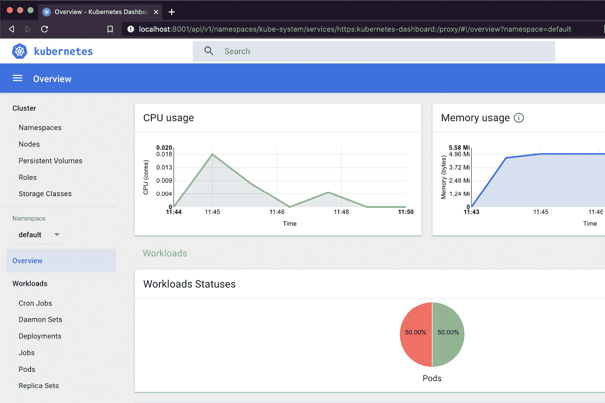
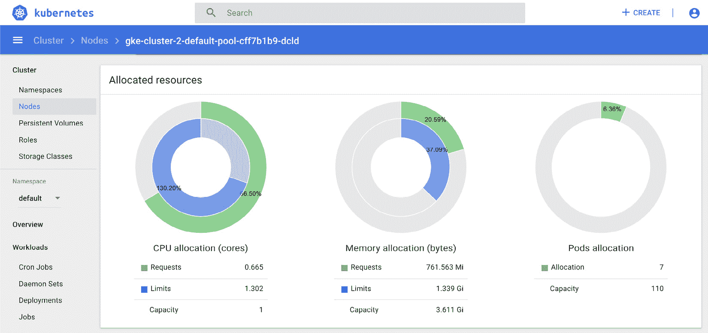
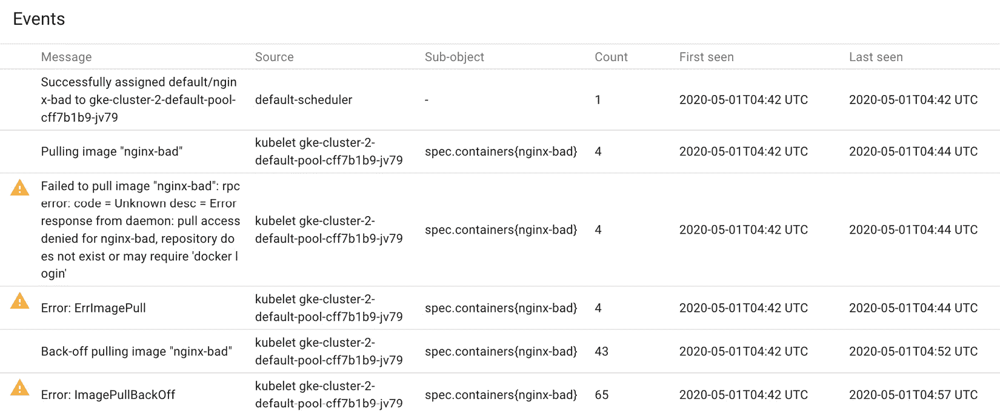

# *第 10 章*:Kubernetes集群的实时监控和资源管理

服务的可用性是**机密性、完整性和可用性** ( **CIA** )三位一体的关键组成部分之一。已经有许多恶意攻击者使用不同技术来破坏用户服务可用性的实例。对电网和银行等关键基础设施的一些攻击给经济造成了重大损失。最重大的攻击之一是对亚马逊 AWS 路由基础设施的攻击，导致全球核心 IT 服务中断。为了避免此类问题，基础架构工程师实时监控资源使用情况和应用运行状况，以确保组织提供的服务的可用性。实时监控通常插入到警报系统中，当观察到服务中断的症状时，该系统会通知风险承担者。

在本章中，我们将了解如何确保 Kubernetes 集群中的服务始终处于启动和运行状态。我们将首先讨论整体环境中的监控和资源管理。接下来，我们将讨论资源请求和资源限制，这是 Kubernetes 中资源管理的两个核心概念。然后，在将我们的重点转移到资源监控之前，我们将看看像`LimitRanger`这样的工具，Kubernetes 为资源管理提供了这些工具。我们将看看内置监视器，如 Kubernetes 仪表板和度量服务器。最后，我们将看看开源工具，如普罗米修斯和格拉夫纳，它们可以用来监控Kubernetes集群的状态。

在本章中，我们将讨论以下内容:

*   整体环境中的实时监控和管理
*   管理Kubernetes的资源
*   Kubernetes的资源监测

# 整体环境中的实时监控和管理

资源管理和监控在整体环境中也很重要。在整体环境中，基础架构工程师通常将 Linux 工具(如`top`、`ntop`和`htop`的输出传输到数据可视化工具，以监控虚拟机的状态。在托管环境中，内置工具(如亚马逊云观察和 Azure 资源管理器)有助于监控资源使用情况。

除了资源监控，基础架构工程师还主动为流程和其他实体分配最低资源要求和使用限制。这确保了有足够的资源可用于服务。此外，资源管理确保不良或恶意的进程不会占用资源并阻止其他进程工作。对于整体部署，资源(如中央处理器、内存和派生进程)对于不同的进程是有上限的。在 Linux 上，进程限制可以使用`prlimit`来限定:

```
$prlimit --nproc=2 --pid=18065
```

该命令将父进程可以派生的子进程限制为`2`。有了这个限制，如果 PID 为`18065`的进程试图产生比`2`子进程更多的子进程，它将被拒绝。

类似于整体环境，Kubernetes 集群运行多个Pod 、部署和服务。如果攻击者能够生成 Kubernetes 对象，如 pods 或部署，攻击者可以通过耗尽 Kubernetes 集群中的可用资源来导致拒绝服务攻击。如果没有足够的资源监控和资源管理，集群中运行的服务不可用会对组织造成经济影响。

# 管理Kubernetes的资源

Kubernetes 提供主动分配和限制 Kubernetes 对象可用资源的能力。在本节中，我们将讨论资源请求和限制，它们构成了 Kubernetes 中资源管理的基础。接下来，我们探索命名空间资源配额和限制范围。使用这两个特性，集群，管理员可以限制不同 Kubernetes 对象的计算和存储限制。

## 资源请求和限制

`kube-scheduler`，正如我们在 [*第 1 章*](01.html#_idTextAnchor020)*Kubernetes 架构*中所讨论的，是默认调度器，运行在主节点上。`kube-scheduler`为未调度的Pod 找到运行的最佳节点。它通过根据 pod 请求的存储和计算资源过滤节点来实现这一点。如果调度程序找不到 pod 的节点，pod 将保持挂起状态。此外，如果节点的所有资源都被 pods 利用，节点上的`kubelet`将清理死 pods-未使用的映像。如果清理不能减轻压力，`kubelet`将开始驱逐那些消耗更多资源的豆荚。

资源请求指定了 Kubernetes 对象保证会得到什么。不同的 Kubernetes 变体或云提供商对资源请求有不同的默认值。可以在工作负载的规范中指定 Kubernetes 对象的自定义资源请求。可以为中央处理器、内存和大内存指定资源请求。让我们看一个资源请求的例子。

让我们在`yaml`规范中创建一个没有资源请求的 pod，如下所示:

```
apiVersion: v1
kind: Pod
metadata:
  name: demo
spec:
  containers:
  - name: demo
```

pod 将使用默认资源请求进行部署:

```
$kubectl get pod demo —output=yaml
apiVersion: v1
kind: Pod
metadata:
  annotations:
    kubectl.kubernetes.io/last-applied-configuration: |
      {"apiVersion":"v1","kind":"Pod","metadata":{"annotations":{},"name":"demo","namespace":"default"},"spec":{"containers":[{"image":"nginx","name":"demo"}]}}
    kubernetes.io/limit-ranger: 'LimitRanger plugin set: cpu request for container
      demo'
  creationTimestamp: "2020-05-07T21:54:47Z"
  name: demo
  namespace: default
  resourceVersion: "3455"
  selfLink: /api/v1/namespaces/default/pods/demo
  uid: 5e783495-90ad-11ea-ae75-42010a800074
spec:
  containers:
  - image: nginx
    imagePullPolicy: Always
    name: demo
    resources:
      requests:
        cpu: 100m
```

对于前面的示例，默认资源请求是 pod 的 0.1 个 CPU 内核。现在让我们向`.yaml`规范添加一个资源请求，看看会发生什么:

```
apiVersion: v1
kind: Pod
metadata:
  name: demo
spec:
  containers:
  - name: demo
    image: nginx
    resources:
      limits:
          hugepages-2Mi: 100Mi
      requests:
        cpu: 500m         memory: 300Mi         hugepages-2Mi: 100Mi 
```

该规范创建了一个 pod，其资源请求为 0.5 个 CPU 内核、300 MB 和 100 MB 的`hugepages-2Mi`。您可以使用以下命令检查 pod 的资源请求:

```
$kubectl get pod demo —output=yaml
apiVersion: v1
kind: Pod
metadata:
  creationTimestamp: "2020-05-07T22:02:16Z"
  name: demo-1
  namespace: default
  resourceVersion: "5030"
  selfLink: /api/v1/namespaces/default/pods/demo-1
  uid: 6a276dd2-90ae-11ea-ae75-42010a800074
spec:
  containers:
  - image: nginx
    imagePullPolicy: Always
    name: demo
    resources:
      limits:
        hugepages-2Mi: 100Mi
      requests:
        cpu: 500m
        hugepages-2Mi: 100Mi
        memory: 300Mi
```

从输出中可以看到，pod 使用了 0.5 个 CPU 内核、300 MB`memory`和 100 MB 2mb`hugepages`的自定义资源请求，而不是默认的 1 MB。

另一方面，限制是对 pod 可以使用的资源的硬性限制。限制规定了Pod 允许使用的最大资源。如果需要的资源超过限制中指定的数量，则限制 Pods。与资源请求类似，您可以指定 CPU、内存和大内存的限制。让我们看一个极限的例子:

```
$ cat stress.yaml
apiVersion: v1
kind: Pod
metadata:
  name: demo
spec:
  containers:
  - name: demo
    image: polinux/stress
    command: ["stress"]
    args: ["--vm", "1", "--vm-bytes", "150M", "--vm-hang", "1"]
```

这个Pod 启动了一个压力过程，试图在启动时分配`150M`的内存。如果`.yaml`规范中没有规定限制，Pod 运行没有任何问题:

```
$ kubectl create -f stress.yaml pod/demo created
$ kubectl get pods NAME         READY   STATUS             RESTARTS   AGE demo         1/1     Running            0          3h
```

在Pod 的`yaml`规范的容器部分中增加了限制:

```
containers:
  - name: demo
    image: polinux/stress
    resources:
      limits:
        memory: "150Mi"
    command: ["stress"]
args: ["--vm", "1", "--vm-bytes", "150M", "--vm-hang", "1"]
```

应力过程无法运行，Pod 运行至`CrashLoopBackOff`:

```
$ kubectl get pods
NAME     READY   STATUS             RESTARTS   AGE
demo     1/1     Running            0          44s
demo-1   0/1     CrashLoopBackOff   1          5s
```

您可以看到，当您描述 pod 时，pod 因`OOMKilled`错误而终止:

```
$ kubectl describe pods demo
Name:         demo
Namespace:    default
...
Containers:
  demo:
    Container ID:  docker://a43de56a456342f7d53fa9752aa4fa7366 cd4b8c395b658d1fc607f2703750c2
    Image:         polinux/stress
    Image ID:      docker-pullable://polinux/stress@sha256:b61 44f84f9c15dac80deb48d3a646b55c7043ab1d83ea0a697c09097aaad21aa
...
    Command:
      stress
    Args:
      --vm
      1
      --vm-bytes
      150M
      --vm-hang
      1
    State:          Waiting
      Reason:       CrashLoopBackOff
    Last State:     Terminated
      Reason:       OOMKilled
      Exit Code:    1
      Started:      Mon, 04 May 2020 10:48:14 -0700
      Finished:     Mon, 04 May 2020 10:48:14 -0700
```

资源请求和限制被转换，映射到`docker`参数–`—cpu-shares`和`—memory`标志，并传递给容器运行时。

我们看了资源请求和限制如何作用于 pods 的例子，但是同样的例子也适用于 DaemonSet、Deployments 和 StatefulSets。接下来，我们看看命名空间资源配额如何帮助为 namespace 可以使用的资源设置上限。

## 命名空间资源配额

名称空间的资源配额有助于定义名称空间内所有对象可用的资源请求和限制。使用资源配额，您可以限制以下内容:

*   `request.cpu`:命名空间中所有对象对 CPU 的最大资源请求。
*   `request.memory`:命名空间中所有对象对内存的最大资源请求。
*   `limit.cpu`:命名空间中所有对象的 CPU 最大资源限制。
*   `limit.memory`:命名空间中所有对象的最大内存资源限制。
*   `requests.storage`:一个命名空间中存储请求的总和不能超过这个值。
*   `count`:资源配额也可以用来限制集群中不同 Kubernetes 对象的数量，包括 pods、服务、PersistentVolumeClaims 和 ConfigMaps。

默认情况下，云提供商或不同的变体对命名空间应用标准限制。在**谷歌 Kubernetes 引擎** ( **GKE** )上，`cpu`请求被设置为 0.1 个 CPU 内核:

```
$ kubectl describe namespace default
Name:         default
Labels:       <none>
Annotations:  <none>
Status:       Active
Resource Quotas
 Name:                       gke-resource-quotas
 Resource                    Used  Hard
 --------                    ---   ---
 count/ingresses.extensions  0     100
 count/jobs.batch            0     5k
 pods                        2     1500
 services                    1     500
Resource Limits
 Type       Resource  Min  Max  Default Request  Default Limit  Max Limit/Request Ratio
 ----       --------  ---  ---  ---------------  -------------  -----------------------
 Container  cpu       -    -    100m             -              -
```

让我们看一个将资源配额应用于命名空间时会发生什么的示例:

1.  创建名称空间演示:

    ```
    $ kubectl create namespace demo
    namespace/demo created
    ```

2.  定义资源配额。在本例中，配额将资源请求 CPU 限制为`1` CPU:

    ```
    $ cat quota.yaml
    apiVersion: v1
    kind: ResourceQuota
    metadata:
      name: compute-resources
    spec:
      hard:
        requests.cpu: "1"
    ```

3.  使用以下命令将配额应用于命名空间:

    ```
    $ kubectl apply -f quota.yaml --namespace demo
    resourcequota/compute-resources created
    ```

4.  您可以通过执行以下命令来检查资源配额是否成功应用于命名空间:

    ```
    $ kubectl describe namespace demo
    Name:         demo
    Labels:       <none>
    Annotations:  <none>
    Status:       Active
    Resource Quotas
     Name:         compute-resources
     Resource      Used  Hard
     --------      ---   ---
     requests.cpu  0     1
     Name:                       gke-resource-quotas
     Resource                    Used  Hard
     --------                    ---   ---
     count/ingresses.extensions  0     100
     count/jobs.batch            0     5k
     pods                        0     1500
     services                    0     500
    ```

5.  现在，如果我们尝试创建两个使用`1` CPU 的豆荚，第二个请求将失败，并出现以下错误:

    ```
    $ kubectl apply -f nginx-cpu-1.yaml --namespace demo
    Error from server (Forbidden): error when creating "nginx-cpu-1.yaml": pods "demo-1" is forbidden: exceeded quota: compute-resources, requested: requests.cpu=1, used: requests.cpu=1, limited: requests.cpu=1
    ```

资源配额确保命名空间 Kubernetes 对象的服务质量。

## 限定语

我们在 [*第七章*](07.html#_idTextAnchor186)*认证、授权和准入控制*中讨论了`LimitRanger`准入控制。集群管理员可以利用限制范围来确保行为不端的豆荚、容器或`PersistentVolumeClaims`不会消耗所有可用资源。

要使用极限范围，启用`LimitRanger`进气控制器:

```
$ ps aux | grep kube-api
root      3708  6.7  8.7 497216 345256 ?       Ssl  01:44   0:10 kube-apiserver --advertise-address=192.168.99.116 --allow-privileged=true --authorization-mode=Node,RBAC --client-ca-file=/var/lib/minikube/certs/ca.crt --enable-admission-plugins=NamespaceLifecycle,LimitRanger,ServiceAccount,DefaultStorageClass,DefaultTolerationSeconds,NodeRestriction,MutatingAdmissionWebhook,ValidatingAdmissionWebhook,ResourceQuota
```

使用 LimitRanger，我们可以对存储和计算资源实施`default`、`min`和`max`限制。集群管理员为容器、容器和持久卷声明等对象创建一个限制范围。对于任何对象创建或更新的请求，限制范围接纳控制器验证该请求没有违反任何限制范围。如果请求违反任何限制范围，将发送 403 禁止响应。

让我们看一个简单的极限范围的例子:

1.  创建将应用限制范围的命名空间:

    ```
    $kubectl create namespace demo
    ```

2.  为名称空间定义一个`LimitRange`:

    ```
    $ cat limit_range.yaml
    apiVersion: "v1"
    kind: "LimitRange"
    metadata:
      name: limit1
      namespace: demo
    spec:
      limits:
      - type: "Container"
        max:
          memory: 512Mi
          cpu: 500m
        min:
          memory: 50Mi
          cpu: 50m
    ```

3.  验证`limitrange`是否适用:

    ```
    $ kubectl get limitrange -n demo
    NAME     CREATED AT
    limit1   2020-04-30T02:06:18Z
    ```

4.  Create a pod that violates the limit range:

    ```
    $cat nginx-bad.yaml
    apiVersion: v1
    kind: Pod
    metadata:
      name: nginx-bad
    spec:
      containers:
      - name: nginx-bad
        image: nginx-bad
        resources:
          limits:
            memory: "800Mi"
            cpu: "500m"
    ```

    此请求将被拒绝:

    ```
    $ kubectl apply -f nginx-bad.yaml -n demo
    Error from server (Forbidden): error when creating "nginx-bad.yaml": pods "nginx-bad" is forbidden: maximum memory usage per Container is 512Mi, but limit is 800M
    ```

如果一个限制程序指定了一个中央处理器或内存，所有的容器和容器都应该有中央处理器或内存请求或限制。当应用编程接口服务器收到创建或更新对象的请求时，而不是在运行时，LimitRanger 会工作。如果一个Pod 在应用极限之前有违反极限，它将继续运行。理想情况下，应该在创建命名空间时对其进行限制。

现在，我们已经了解了一些可用于主动资源管理的功能，现在我们换个话题，看看可以帮助我们监控集群并在情况恶化之前通知我们的工具。

# Kubernetes资源监测

正如我们之前讨论的，资源监控是确保集群中服务可用性的重要步骤。资源监控发现集群中服务不可用的早期迹象或症状。资源监控通常辅以警报管理，以确保一旦观察到群集中的任何问题或与任何问题相关的症状，就会通知利益相关者。

在本节中，我们首先看一下 Kubernetes 提供的一些内置监视器，包括 Kubernetes 仪表板和 Metrics Server。我们看看如何设置它，并讨论如何有效地使用这些工具。接下来，我们看看一些开源工具，它们可以插入到你的 Kubernetes 集群中，并提供比内置工具更深入的洞察力。

## 内置监视器

让我们来看看 Kubernetes 提供的一些用于监控 Kubernetes 资源和对象的工具——Metrics Server 和 Kubernetes Dashboard。

### 忽必烈的控制板

Kubernetes Dashboard 为集群管理员创建、管理和监控集群对象和资源提供了一个 web UI。集群管理员还可以使用仪表板创建Pod 、服务和daemmonsets。仪表板显示集群的状态和集群中的任何错误。

Kubernetes Dashboard 提供集群管理员管理集群内的资源和对象所需的所有功能。鉴于仪表板的功能，对仪表板的访问应该仅限于集群管理员。仪表板具有从 1.7.0 版开始的登录功能。2018 年，在仪表板中发现了一个权限升级漏洞(CVE-2018-18264)，该漏洞允许未经身份验证的用户登录仪表板。这个问题没有已知的公开漏洞，但是这个简单的漏洞可能会对许多 Kubernetes 发行版造成严重破坏。

当前登录功能允许使用服务帐户和`kubeconfig`登录。建议使用服务帐户令牌来访问 Kubernetes 仪表板:



图 10.1-无间隙仪表板

要允许服务帐户使用 Kubernetes 仪表板，您需要向服务帐户添加`cluster-admin`角色。让我们看一个如何使用服务帐户访问 Kubernetes 仪表板的示例:

1.  在默认名称空间中创建服务帐户:

    ```
    $kubectl create serviceaccount dashboard-admin-sa
    ```

2.  将`cluster-admin`角色与服务帐户关联:

    ```
    $kubectl create clusterrolebinding dashboard-admin-sa --clusterrole=cluster-admin --serviceaccount=default:dashboard-admin-sa
    ```

3.  获取服务账户的令牌:

    ```
    $ kubectl describe serviceaccount dashboard-admin-sa
    Name:                dashboard-admin-sa
    Namespace:           default
    Labels:              <none>
    Annotations:         <none>
    Image pull secrets:  <none>
    Mountable secrets:   dashboard-admin-sa-token-5zwpw
    Tokens:              dashboard-admin-sa-token-5zwpw
    Events:              <none>
    ```

4.  使用以下命令获取服务帐户的令牌:

    ```
    $ kubectl describe secrets dashboard-admin-sa-token-5zwpw
    Name:         dashboard-admin-sa-token-5zwpw
    Namespace:    default
    Labels:       <none>
    Annotations:  kubernetes.io/service-account.name: dashboard-admin-sa
                  kubernetes.io/service-account.uid: 83218a92-915c-11ea-b763-42010a800022
    Type:  kubernetes.io/service-account-token
    Data
    ====
    ca.crt:     1119 bytes
    namespace:  7 bytes
    token:      <token>
    ```

5.  使用服务帐户令牌登录仪表板:


图 10.2-固定仪表板登录

使用 Kubernetes 仪表板，管理员可以深入了解资源可用性、资源分配、Kubernetes 对象和事件日志:



图 10.3–Kubernetes 仪表板–资源分配

前面的屏幕截图显示了节点上针对资源请求和限制的资源分配。以下屏幕截图突出显示了 Kubernetes 仪表板上某个节点的事件:



图 10.4–Kubernetes 仪表板–事件日志

Kubernetes Dashboard 作为主节点上的容器运行。您可以通过枚举主节点上的 Docker 容器看到这一点:

```
$ docker ps | grep dashboard
a963e6e6a54b        3b08661dc379           "/metrics-sidecar"       4 minutes ago       Up 4 minutes                            k8s_dashboard-metrics-scraper_dashboard-metrics-scraper-84bfdf55ff-wfxdm_kubernetes-dashboard_5a7ef2a8-b3b4-4e4c-ae85-11cc8b61c1c1_0
c28f0e2799c1        cdc71b5a8a0e           "/dashboard --insecu…"   4 minutes ago       Up 4 minutes                            k8s_kubernetes-dashboard_kubernetes-dashboard-bc446cc64-czmn8_kubernetes-dashboard_40630c71-3c6a-447b-ae68-e23603686ede_0
10f0b024a13f        k8s.gcr.io/pause:3.2   "/pause"                 4 minutes ago       Up 4 minutes                            k8s_POD_dashboard-metrics-scraper-84bfdf55ff-wfxdm_kubernetes-dashboard_5a7ef2a8-b3b4-4e4c-ae85-11cc8b61c1c1_0
f9c1e82174d8        k8s.gcr.io/pause:3.2   "/pause"                 4 minutes ago       Up 4 minutes                            k8s_POD_kubernetes-dashboard-bc446cc64-czmn8_kubernetes-dashboard_40630c71-3c6a-447b-ae68-e23603686ede_0
```

仪表板进程使用主节点上的一组参数运行:

```
$ ps aux | grep dashboard
dbus     10727  0.9  1.1 136752 46240 ?        Ssl  05:46   0:02 /dashboard --insecure-bind-address=0.0.0.0 --bind-address=0.0.0.0 --namespace=kubernetes-dashboard --enable-skip-login --disable-settings-authorizer
docker   11889  0.0  0.0  11408   556 pts/0    S+   05:51   0:00 grep dashboard
```

使用以下参数确保仪表板容器正在运行:

*   **禁用不安全端口** : `--insecure-port`启用 Kubernetes 仪表板通过 HTTP 接收请求。确保在生产环境中禁用。
*   **禁用不安全地址** : `--insecure-bind-address`应禁用，以避免出现可通过 HTTP 访问 Kubernetes 仪表板的情况。
*   **将地址绑定到本地主机** : `--bind-address`应设置为`127.0.0.1`以防止主机通过互联网连接。
*   **启用 TLS** :使用`tls-cert-file`和`tls-key-file`通过安全通道访问仪表盘。
*   **确保启用令牌认证模式**:可以使用`--authentication-mode`标志指定认证模式。默认设置为`token`。确保仪表板不使用基本身份验证。
*   **禁用不安全登录**:当仪表盘通过 HTTP 可用时，使用不安全登录。默认情况下，应禁用此功能。
*   **禁用跳过登录**:跳过登录允许未经认证的用户访问 Kubernetes 仪表盘。`--enable-skip-login`启用跳过登录；这不应该出现在生产环境中。
*   **禁用设置授权者** : `--disable-settings-authorizer`允许未经认证的用户访问设置页面。在生产环境中应禁用。

### 度量服务器

度量服务器使用每个节点上每个`kubelet`公开的摘要应用编程接口聚合集群使用数据。使用`kube-aggregator`注册`kube-apiserver`。度量服务器通过度量应用编程接口公开收集的度量，这些度量由水平容器自动缩放器和垂直容器自动缩放器使用。用于调试集群的`kubectl top`也使用了 Metrics API。度量服务器是专门为自动缩放而设计的。

默认情况下，在某些 Kubernetes 发行版上启用了度量服务器。您可以使用以下命令在`minikube`上启用它:

```
$ minikube addons enable metrics-server
```

您可以使用以下命令检查度量服务器是否已启用:

```
$ kubectl get apiservices | grep metrics
v1beta1.metrics.k8s.io                 kube-system/metrics-server   True        7m17s
```

一旦启用了度量服务器，就需要一些时间来查询概要应用编程接口并关联数据。您可以使用`kubectl top node`查看当前指标:

```
$ kubectl top node
NAME       CPU(cores)   CPU%   MEMORY(bytes)   MEMORY%
minikube   156m         7%     1140Mi          30%
$ kubectl top pod
NAME         CPU(cores)   MEMORY(bytes)
nginx-good   0m           2Mi
```

与其他服务和组件类似，度量服务器也有配置参数。在生产集群中，确保度量服务器不使用`--kubelet-insecure-tls`标志，该标志允许度量服务器跳过 CA 对证书的验证。

## 第三方监控工具

第三方监控工具将集成到 Kubernetes 中，为 Kubernetes 资源的健康状况提供更多功能和见解。在本节中，我们将讨论 Prometheus 和 Grafana，它们是开源社区中最流行的监控工具。

## 普罗米修斯和格拉夫纳

普罗米修斯是一个由 SoundCloud 开发并被 CNCF 采用的开放源代码工具和数据收集框架。普罗米修斯可以用来查看不同数据点的时间序列数据。普罗米修斯使用牵引系统。它发送一个名为 scrape 的 HTTP 请求，从系统组件中获取数据，包括应用编程接口服务器、`node-exporter`和`kubelet`。对刮擦的响应和度量标准存储在普罗米修斯服务器上的定制数据库中。

让我们看看如何设置普罗米修斯来监控Kubernetes的命名空间:

1.  创建名称空间:

    ```
    $kubectl create namespace monitoring
    ```

2.  Define a cluster role to read Kubernetes objects such as pods, nodes, and services and add the role binding to a service account. In this example, we are using the default service account:

    ```
    $ cat prometheus-role.yaml
    apiVersion: rbac.authorization.k8s.io/v1beta1
    kind: ClusterRole
    metadata:
      name: prometheus
    rules:
    - apiGroups: [""]
      resources:
      - nodes
      - nodes/proxy
      - services
      - endpoints
      - pods
      verbs: ["get", "list", "watch"]
    - apiGroups:
      - extensions
      resources:
      - ingresses
      verbs: ["get", "list", "watch"]
    - nonResourceURLs: ["/metrics"]
      verbs: ["get"]
    $ kubectl create -f prometheus-role.yaml
    clusterrole.rbac.authorization.k8s.io/prometheus created
    ```

    现在，我们创建一个角色绑定，将角色与默认服务帐户相关联:

    ```
    $ cat prometheus-rolebinding.yaml
    apiVersion: rbac.authorization.k8s.io/v1beta1
    kind: ClusterRoleBinding
    metadata:
      name: prometheus
    roleRef:
      apiGroup: rbac.authorization.k8s.io
      kind: ClusterRole
      name: prometheus
    subjects:
    - kind: ServiceAccount
      name: default
      namespace: monitoring
    ```

3.  普罗米修斯使用配置映射来指定刮擦规则。以下规则-刮擦`kube-apiserver`。可以定义多个废料来获取度量:

    ```
    $ cat config_prometheus.yaml apiVersion: v1
    kind: ConfigMap
    metadata:
      name: prometheus-server-conf
      labels:
        name: prometheus-server-conf
      namespace: monitoring
    data:
      prometheus.yml: |-
        global:
          scrape_interval: 5s
          evaluation_interval: 5s
      scrape_configs:    - job_name: 'kubernetes-apiservers'
          kubernetes_sd_configs:
          - role: endpoints
          scheme: https
          tls_config:
            ca_file: /var/run/secrets/kubernetes.io/serviceaccount/ca.crt
          bearer_token_file: /var/run/secrets/kubernetes.io/serviceaccount/token
          relabel_configs:
          - source_labels: [__meta_kubernetes_namespace, __meta_kubernetes_service_name, __meta_kubernetes_endpoint_port_name]
            action: keep
            regex: default;kubernetes;https
    ```

4.  为普罗米修斯

    ```
    spec:
          containers:
            - name: prometheus
              image: prom/prometheus:v2.12.0
              args:
                - "--config.file=/etc/prometheus/prometheus.yml"
                - "--storage.tsdb.path=/prometheus/"
              ports:
                - containerPort: 9090
              volumeMounts:
                - name: prometheus-config-volume
                  mountPath: /etc/prometheus/
                - name: prometheus-storage-volume
                  mountPath: /prometheus/
          volumes:
            - name: prometheus-config-volume
              configMap:
                defaultMode: 420
                name: prometheus-server-conf
            - name: prometheus-storage-volume
              emptyDir: {}
    ```

    创建部署
5.  Once deployment is successful, port forwarding or Kubernetes services can be used to access the dashboard:

    ```
    $ kubectl port-forward <prometheus-pod> 8080:9090 -n monitoring
    ```

    这将启用普罗米修斯Pod 的端口转发。现在，您可以使用端口`8080`上的集群 IP 来访问它:


图 10.5–普罗米修斯仪表板

查询可以作为表达式输入，结果可以作为**图形**或**控制台**消息查看。使用普罗米修斯查询，集群管理员可以查看普罗米修斯监控的集群、节点和服务的状态。

让我们看一些对集群管理员有帮助的普罗米修斯查询的例子:

*   立方 CPU 使用量:

    ```
    sum(rate(container_cpu_usage_seconds_total{container_name!="POD",pod_name!=""}[5m]))
    ```

*   命名空间占用的 CPU 数量:

    ```
    sum(rate(container_cpu_usage_seconds_total{container_name!="POD",namespace!=""}[5m])) by (namespace)
    ```

*   Pod 的中央处理器请求:

    ```
    sum(kube_pod_container_resource_requests_cpu_cores) by (pod)
    ```

让我们按名称空间来看一下演示集群的 CPU 使用情况:


图 10.6–按名称空间划分的 CPU 使用情况

普罗米修斯还允许集群管理员使用配置图设置警报:

```
prometheus.rules: |-
    groups:
    - name: Demo Alert
      rules:
      - alert: High Pod Memory
        expr: sum(container_memory_usage_bytes{pod!=""})  by (pod) > 1000000000
        for: 1m
        labels:
          severity: high
        annotations:
          summary: High Memory Usage
```

当容器内存使用量在`1`分钟内大于`1000`兆字节时，此警报触发标签严重度为`high`的警报:


图 10.7–普罗米修斯警报

将`Alertmanager`用于 Prometheus 有助于对来自 Prometheus 等应用的警报进行重复数据消除、分组和路由，并将其路由到集成的客户端，包括电子邮件、OpsGenie 和 PagerDuty。

普罗米修斯将与其他增强数据可视化和警报管理的第三方工具很好地集成在一起。Grafana 就是这样一个工具。Grafana 允许可视化、查询和对从普罗米修斯公司检索到的数据发出警报。

现在让我们看看我们是如何把格拉夫娜和普罗米修斯联系起来的:

1.  Grafana 需要一个用于摄取的数据源；在这种情况下，它就是普罗米修斯。可以使用用户界面添加数据源，也可以使用配置图指定数据源:

    ```
    $ cat grafana-data.yaml                                   apiVersion: v1
    kind: ConfigMap
    metadata:
      name: grafana-datasources
      namespace: monitoring
    data:
      prometheus.yaml: |-
        {
            "apiVersion": 1,
            "datasources": [
                {
                   "access":"proxy",
                    "editable": true,
                    "name": "prometheus",
                    "orgId": 1,
                    "type": "prometheus",
                    "url": "http://192.168.99.128:30000",
                    "version": 1
                }
            ]
        }
    ```

2.  为格拉夫纳创建部署:

    ```
    apiVersion: apps/v1
    kind: Deployment
    metadata:
      name: grafana
      namespace: monitoring
    spec:
      replicas: 1
      selector:
        matchLabels:
          app: grafana
      template:
        metadata:
          name: grafana
          labels:
            app: grafana
        spec:
          containers:
          - name: grafana
            image: grafana/grafana:latest
            ports:
            - name: grafana
              containerPort: 3000
            volumeMounts:
              - mountPath: /var/lib/grafana
                name: grafana-storage
              - mountPath: /etc/grafana/provisioning/datasources
                name: grafana-datasources
                readOnly: false
          volumes:
            - name: grafana-storage
              emptyDir: {}
            - name: grafana-datasources
              configMap:
                  name: grafana-datasources
    ```

3.  然后，可以使用端口转发或 Kubernetes 服务来访问仪表板:

    ```
    apiVersion: v1
    kind: Service
    metadata:
      name: grafana
      namespace: monitoring
      annotations:
          prometheus.io/scrape: 'true'
          prometheus.io/port:   '3000'
    spec:
      selector:
        app: grafana
      type: NodePort
      ports:
        - port: 3000
          targetPort: 3000
          nodePort: 32000
    ```

4.  The dashboard, by default, has `admin` as a username and password. Once logged in, you can either set up a new dashboard or import one from Grafana. To import one, you can click **+ > Import**, where you will be presented with the following screen. Enter `315` in the first textbox to import dashboard 315 from Grafana:

    

    图 10.8–在格拉夫纳导入仪表板

5.  This dashboard was created by Instrumentisto Team. On import, all fields on the next screen will be filled up automatically:

    

    图 10.9–grafana 控制板–315

6.  A new dashboard can also be created with custom Prometheus queries:

    

    图 10.10–定制仪表板

7.  与普罗米修斯类似，您可以在每个仪表板上设置警报:


图 10.11–格拉夫纳的新警报

还有与普罗米修斯集成的其他工具，使其成为 DevOps 和集群管理员的宝贵工具。

# 总结

在这一章中，我们讨论了可用性作为中央情报局三位一体的重要组成部分。我们从安全的角度讨论了资源管理和实时资源监控的重要性。然后我们介绍了资源请求和限制，这是 Kubernetes 中资源管理的核心概念。接下来，我们讨论了资源管理以及集群管理员如何主动确保 Kubernetes 对象不会出现问题。

我们深入研究了名称空间资源配额和限制范围的细节，并查看了如何设置它的示例。然后我们转向资源监控。我们查看了作为 Kubernetes 一部分的一些内置监视器，包括仪表板和度量服务器。最后，我们看了一些第三方工具——Prometheus 和 Grafana——它们功能更强大，更受大多数集群管理员和 DevOps 工程师的青睐。

使用资源管理，集群管理员可以确保 Kubernetes 集群中的服务有足够的资源可用于操作，并且恶意或行为不端的实体不会占用所有资源。另一方面，资源监控有助于实时识别问题和症状。警报管理与资源监控结合使用，一旦出现症状(如磁盘空间减少或内存消耗高)，风险承担者就会得到通知，确保停机时间最少。

在下一章中，我们将详细讨论深度防御。我们将研究集群管理员和 DevOps 工程师如何通过分层的安全方法来补充安全配置、资源管理和资源监控。深度防御将引入更多工具包，以确保在生产环境中能够轻松检测和减轻攻击。

# 问题

1.  资源请求和限制之间有什么区别？
2.  定义一个资源配额，将内存限制限制为 500 mi。
3.  限制范围与资源配额有何不同？
4.  Kubernetes Dashboard 推荐的身份验证方法是什么？
5.  最广泛推荐的资源监控工具是哪个？

# 进一步参考

有关本章主题的更多信息，您可以参考以下链接:

*   电气系统拒绝服务攻击:[https://www . CNBC . com/2019/05/02/DDOS-攻击-导致-电力系统中断-操作-doe.html](https://www.cnbc.com/2019/05/02/ddos-attack-caused-interruptions-in-power-system-operations-doe.html)
*   亚马逊 Route53 DDOS:[https://www . cpomagazine . com/cyber-security/DDOS-攻击亚马逊-网络服务-引发-云-安全-关注/](https://www.cpomagazine.com/cyber-security/ddos-attack-on-amazon-web-services-raises-cloud-safety-concerns/)
*   Limit Ranger 设计文档:[https://github . com/kubernetes/community/blob/master/投稿人/设计-提案/资源-管理/接纳 _ 控制 _limit_range.md](https://github.com/kubernetes/community/blob/master/contributors/design-proposals/resource-management/admission_control_limit_range.md)
*   忽必烈控制板:【https://github . com/kubricks/dashboard/blob/master/docs/readme . MD】
*   使用 Kubernetes 仪表板进行权限升级:[https://sysdig . com/blog/权限-升级-Kubernetes-仪表板/](https://sysdig.com/blog/privilege-escalation-kubernetes-dashboard/)
*   度量服务器:[https://github.com/kubernetes-sigs/metrics-server](https://github.com/kubernetes-sigs/metrics-server)
*   聚合 API 服务器:[https://github . com/kubernetes/community/blob/master/投稿人/设计-提案/API-机械/聚合-API-服务器. md](https://github.com/kubernetes/community/blob/master/contributors/design-proposals/api-machinery/aggregated-api-servers.md)
*   普罗米修斯查询:[https://Prometheus . io/docs/Prometheus/latest/query/examples/](https://prometheus.io/docs/prometheus/latest/querying/examples/)
*   Grafana 文档:[https://grafana . com/docs/grafana/latest/](https://grafana.com/docs/grafana/latest/)