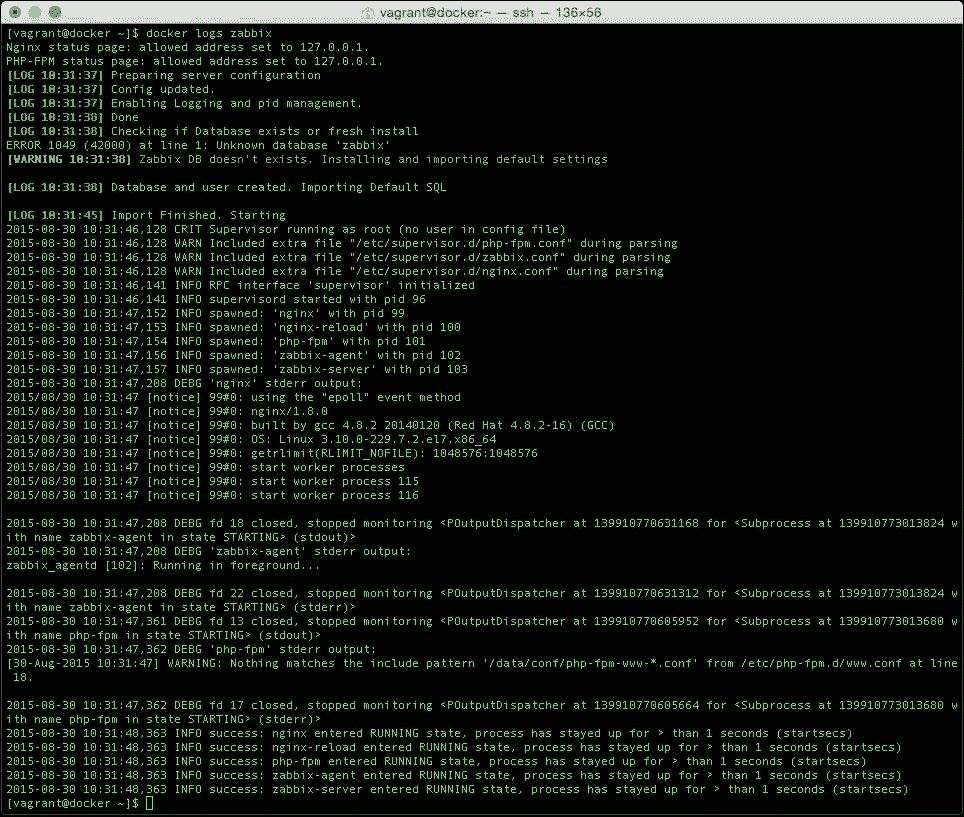
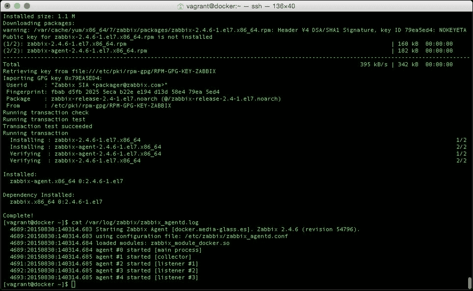
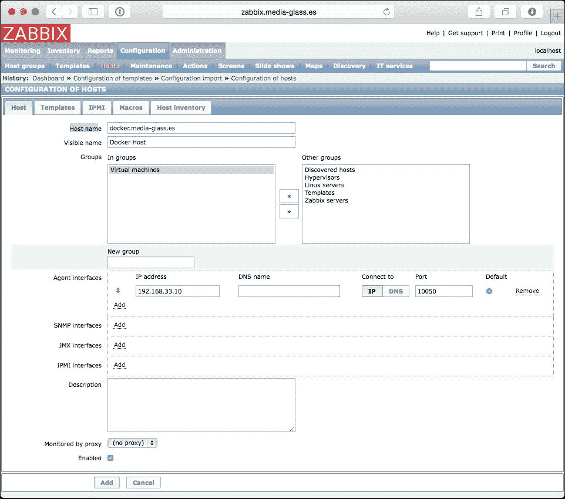
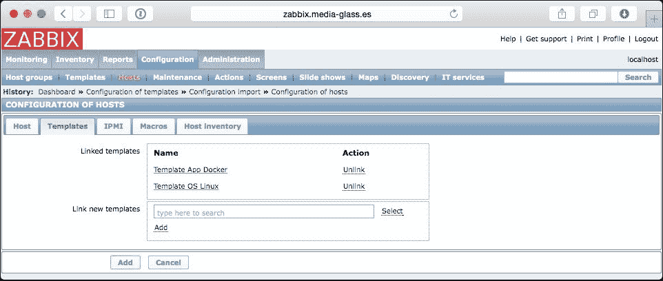

# 第四章。监控容器的传统方法

到目前为止，我们只关注了一些监控容器的技术，因此在本章中，我们将更多地关注用于监控服务的传统工具。到本章结束时，您应该知道如何使用 Zabbix 以及监控容器的各种方法。我们将在本章中讨论以下主题:

*   如何使用容器运行 Zabbix 服务器
*   如何在流浪机器上启动 Zabbix 服务器
*   如何使用 Zabbix 代理为监控容器准备我们的主机系统
*   如何在 Zabbix 网络界面中找到自己的路

# zabix

首先，什么是 Zabbix，为什么要用它？

我个人从 1.2 版本就开始使用了；Zabbix 网站对其描述如下:

> *“有了 Zabbix，就有可能从网络中收集几乎无限的数据类型。高性能实时监控意味着可以同时监控数万台服务器、虚拟机和网络设备。除了存储数据之外，可视化功能也是可用的(概图、地图、图表、屏幕等)，并且可以非常灵活地分析数据以发出警报。*
> 
> *Zabbix 为数据收集提供了出色的性能，并且可以扩展到非常大的环境。使用 Zabbix 代理可以获得分布式监控选项。Zabbix 具有基于 web 的界面、安全的用户身份验证和灵活的用户权限模式。支持轮询和捕获，本地高性能代理从几乎任何流行的操作系统收集数据；无代理监控方法也是可用的。”*

在我开始使用 Zabbix 的时候，唯一真正可行的选择如下:

*   纳吉奥斯:[https://www.nagios.org/](https://www.nagios.org/)
*   zabix:[http://www . zabix . com/](http://www.zabbix.com/)
*   Zeno ss:【http://www . Zeno ss . org/

在这三个选项中，扎比克斯似乎是当时最直白的一个。它做了足够的工作来管理我要监控的几百台服务器，而不必额外学习设置 Nagios 或 Zenoss 的复杂性；毕竟，考虑到软件的任务，我需要能够相信我已经正确设置了它。

在这一章中，虽然我将详细介绍使用 Zabbix 的设置和基础知识，但我们将只涉及其中的一些功能，这些功能不仅仅是监视您的容器。更多信息，我推荐以下作为好的起点:

*   zabix 博客:[http://blog . zabix . com](http://blog.zabbix.com)
*   zabix 2.4 手册:https://www . zabix . com/documentation/2.4/manual
*   进一步阅读:[https://www.packtpub.com/all/?search=zabbix](https://www.packtpub.com/all/?search=zabbix)

# 安装 Zabbix

从上一节的链接中你可能已经注意到了，Zabbix 中有很多移动的部分。它利用了几种开源技术，一个生产就绪的安装需要比我们在这一章中讨论的更多的计划。正因为如此，我们将快速查看安装 Zabbix 的两种方法，而不是过多地讨论细节。

## 使用容器

在撰写本文时，Docker Hub([https://hub.docker.com](https://hub.docker.com))上有超过 100 张提到 Zabbix 的 Docker 图片。从完整的服务器安装到不同的部分，如 Zabbix 代理或代理服务。

在列出的这些中，有一个是 Zabbix 自己推荐的。所以，我们来看看这个；可以在以下网址找到:

*   Docker枢纽:【https://hub . docker . com/u/zabix/
*   项目页面:https://github . com/zabix/zabix 社区Docker

要启动并运行`ZabbixServer`容器，我们必须首先启动一个数据库容器。让我们通过运行以下命令来重新开始我们的流浪实例:

```
[russ@mac ~]$ cd ~/Documents/Projects/monitoring-docker/vagrant-centos/
[russ@mac ~]$ vagrant destroy
default: Are you sure you want to destroy the 'default' VM? [y/N] y
==>default: Forcing shutdown of VM...
==>default: Destroying VM and associated drives...
==>default: Running cleanup tasks for 'shell' provisioner...
[russ@mac ~]$ vagrant up
Bringing machine 'default' up with 'virtualbox' provider...
==>default: Importing base box 'russmckendrick/centos71'...
==>default: Matching MAC address for NAT networking...
==>default: Checking if box 'russmckendrick/centos71' is up to date...

.....

==>default: => Installing docker-engine ...
==>default: => Configuring vagrant user ...
==>default: => Starting docker-engine ...
==>default: => Installing docker-compose ...
==>default: => Finished installation of Docker
[russ@mac ~]$ vagrantssh

```

现在，我们有了一个干净的环境，是时候启动我们的数据库容器了，如下所示:

```
docker run \
 --detach=true \
 --publish=3306 \
 --env="MARIADB_USER=zabbix" \
 --env="MARIADB_PASS=zabbix_password" \
 --name=zabbix-db \
million12/mariadb

```

这将从[https://hub.docker.com/r/million12/mariadb/](https://hub.docker.com/r/million12/mariadb/)下载`million12/mariadb`映像，并启动名为`zabbix-db`的容器，运行Mariadb 10([https://mariadb.org](https://mariadb.org))用户名为`zabbix`，拥有密码`zabbix_password`。我们还在容器上打开了 MariaDB 端口`3306`，但是因为我们将从链接的容器连接到它，所以没有必要在主机上公开该端口。

现在，我们已经启动并运行了数据库容器，我们现在需要启动我们的 Zabbix 服务器容器:

```
docker run \
 --detach=true \
 --publish=80:80 \
 --publish=10051:10051 \
 --link=zabbix-db:db \
 --env="DB_ADDRESS=db" \
 --env="DB_USER=zabbix" \
 --env="DB_PASS=zabbix_password" \
 --name=zabbix \
zabbix/zabbix-server-2.4

```

这个下载映像，在编写时超过 1 GB，所以这个过程可能需要几分钟，这取决于您的连接，并启动一个名为`zabbix`的容器。它将主机上的 web 服务器(端口`80`)和 Zabbix Server 进程(端口`10051`)映射到容器，创建到我们的数据库容器的链接，设置别名`db`，并将数据库凭证作为环境变量注入，以便在容器启动时启动的脚本可以填充数据库。

您可以通过检查容器上的日志来验证一切是否按预期运行。为此，输入`docker logs zabbix`。这将在屏幕上打印容器启动时发生的详细情况:



现在，一旦容器启动并运行，就到了我们第一次体验网络界面的时候了。在浏览器中转到`http://192.168.33.10/`，会出现欢迎页面；在开始使用 Zabbix 之前，我们需要完成安装。

在欢迎页面，点击**下一步**进入第一步。这将验证我们运行 Zabbix 服务器所需的一切都已安装。由于我们已经在一个容器中启动了它，您应该会在所有先决条件旁边看到 **OK** 。点击**下一步**进入下一步。

现在，我们需要为 web 界面配置数据库连接。在这里，您应该拥有与启动容器时相同的细节，如下图所示:


一旦您输入了详细信息，点击**测试连接**，您应该会收到一条**确定**的信息；在此测试成功完成之前，您将无法继续。一旦您输入详细信息并有**确定**信息，点击**下一步**。

接下来，是网络接口需要连接的 Zabbix 服务器的细节；点击**下一步**这里。接下来，您将收到安装摘要。要继续，点击**下一步**，您将确认`/usr/local/src/zabbix/frontends/php/conf/zabbix.conf.php`文件已经创建。点击**完成**进入登录页面。

## 使用游民

在写这一章的时候，我想了很多关于为 Zabbix Server 服务提供另一组安装说明的事情。虽然这本书完全是关于监控 Docker 容器的，但是让一个像 Zabbix 这样的服务在一个容器内运行，感觉有点违背直觉。正因为如此，有一个流浪机器使用 Puppet 引导 Zabbix 服务器的工作安装:

```
[russ@mac ~]$ cd ~/Documents/Projects/monitoring-docker/vagrant-zabbix/
[russ@mac ~]$ vagrant up
Bringing machine 'default' up with 'virtualbox' provider...
==>default: Importing base box 'russmckendrick/centos71'...
==>default: Matching MAC address for NAT networking...
==>default: Checking if box 'russmckendrick/centos71' is up to date...

.....

==>default: Debug: Received report to process from zabbix.media-glass.es
==>default: Debug: Evicting cache entry for environment 'production'
==>default: Debug: Caching environment 'production' (ttl = 0 sec)
==>default: Debug: Processing report from zabbix.media-glass.es with processor Puppet::Reports::Store

```

您可能已经注意到，有大量输出流至终端，那么刚才发生了什么？首先，启动了一个 CentOS 7 游民实例，然后安装了一个 Puppet 代理。安装完成后，安装工作交给了 Puppet。使用沃纳·迪吉克曼的扎比克斯木偶模块，安装了扎比克斯服务器；有关该模块的更多详细信息，请参见其位于[https://forge.puppetlabs.com/wdijkerman/zabbix](https://forge.puppetlabs.com/wdijkerman/zabbix)的傀儡锻造页面。

与容器化版本的 Zabbix Server 不同，不需要额外的配置，因此您应该可以在[http://zabbix.media-glass.es/](http://zabbix.media-glass.es/)访问 Zabbix 登录页面(配置中硬编码了`192.168.33.11`的 IP 地址)。

## 准备我们的主机

对于本章的剩余部分，我将假设您使用的是运行在自己的流浪实例上的 Zabbix 服务器。这有助于确保您的环境与我们将要查看的 Zabbix 代理的配置一致。

为了将统计数据从我们的容器传递到 Zabbix 代理，然后再将它们暴露给 Zabbix 服务器，我们将使用 Jan Garaj 开发的`Zabbix-Docker-Monitoring` Zabbix 代理模块进行安装。有关该项目的更多信息，请参见以下网址:

*   项目页面:[https://github . com/Monitoring artist/Zabbix-Docker-Monitoring/](https://github.com/monitoringartist/Zabbix-Docker-Monitoring/)
*   Zabbix 共享页面:[https://share . Zabbix . com/virtual/docker-containers-monitoring](https://share.zabbix.com/virtualization/docker-containers-monitoring)

要安装、配置和运行代理和模块，我们需要执行以下步骤:

1.  安装 Zabbix 包存储库。
2.  安装 Zabbix 代理。
3.  安装模块的先决条件。
4.  将 Zabbix 代理用户添加到 Docker 组。
5.  下载自动发现 bash 脚本。
6.  下载预编译的`zabbix_module_docker`二进制。
7.  用我们的 Zabbix 服务器和 Docker 模块的详细信息配置 Zabbix 代理。
8.  为我们下载和创建的所有文件设置正确的权限。
9.  启动 Zabbix 代理。

虽然对于 CentOS 和 Ubuntu 来说步骤保持不变，但是进行初始软件包安装所采取的操作略有不同。在`/monitoring_docker/chapter04/`文件夹中，每个主机操作系统都有一个脚本，而不是显示安装和配置代理的命令。要查看脚本，请从终端运行以下命令:

```
cat /monitoring_docker/chapter04/install-agent-centos.sh
cat /monitoring_docker/chapter04/install-agent-ubuntu.sh

```

现在，您已经了解了运行脚本的时间，要执行此操作，请键入以下命令之一。如果您正在运行 CentOS，请运行以下命令:

```
bash /monitoring_docker/chapter04/install-agent-centos.sh

```

对于 Ubuntu，运行以下命令:

```
bash /monitoring_docker/chapter04/install-agent-ubuntu.sh

```

要验证一切是否按预期运行，请通过运行以下命令来检查 Zabbix 代理日志文件:

```
cat /var/log/zabbix/zabbix_agentd.log

```

您应该看到文件的结尾确认代理已经启动并且`zabbix_module_docker.so`模块已经加载:



在我们进入 Zabbix 网络界面之前，让我们使用[第 2 章](2.html#K0RQ2-fcf7b4d102f841bba77b823d677470e0 "Chapter 2. Using the Built-in Tools")、*中的`docker-compose`文件，使用内置工具*启动几个容器:

```
[vagrant@docker ~]$ cd /monitoring_docker/chapter02/02-multiple/
[vagrant@docker 02-multiple]$ docker-compose up -d
[vagrant@docker 02-multiple]$ docker-compose scale web=3
[vagrant@docker 02-multiple]$ docker-compose ps

```

我们现在应该有三个运行的 web 服务器容器和一个在主机上运行的 Zabbix 代理。

## Zabbix 网络界面

一旦你安装了 Zabbix，你可以通过在你的浏览器中转到[http://zabbix.media-glass.es/](http://zabbix.media-glass.es/)来打开 Zabbix 网页界面，这个链接只有当你启动并运行了 Zabbix 游民箱时才会起作用，如果你没有运行它，页面将会超时。你应该会出现一个登录屏幕。在此输入默认用户名和密码，分别为`Admin`和`zabbix`(注意用户名有大写 *A* ，即可登录。

登录后，您需要添加主机模板。这些是预配置的环境设置，将添加一些关于 Zabbix 代理发送给服务器的统计信息的上下文，以及容器的自动发现。

要添加模板，进入顶部菜单的**配置**选项卡，选择**模板**；这将调出当前安装的所有模板列表。点击标题中的**导入**按钮，在你的主机上的`~/Documents/Projects/monitoring-docker/chapter04/template`文件夹中上传你能找到的两个模板文件的副本；上传模板时无需更改规则。

一旦两个模板都成功导入，就该添加我们的 Docker 主机了。再次进入**配置**选项卡，但这次选择**主机**。这里需要点击**创建主机**。然后，在**主机**标签中输入以下信息:



以下是上述信息的详细信息:

*   **主机名**:这是我们 Docker 主机的主机名
*   **可见名称**:在这里，名称服务器将显示为 Zabbix
*   **组**:您希望 Docker 主机属于 Zabbix 服务器中的哪个组
*   **代理接口**:这是我们 Docker 主机的 IP 地址或者 DNS 名称
*   **启用**:应勾选此项

在点击**上的添加**之前，您应该点击**模板**选项卡，并将以下两个模板链接到主机:

*   **模板应用程序 Docker**
*   **Linux 作业系统范本**

下面是主机的截图:



添加两个模板后，点击**添加**即可配置并启用主机。要验证主机添加是否正确，您应该进入**监控**选项卡，然后进入**最新数据**。点击**显示过滤器**，在**主机**框中输入主机。然后，您应该开始看到项目出现:


不要担心如果您没有立即看到 **Docker** 部分，默认情况下，Zabbix 将尝试每五分钟自动发现新容器。

# Docker指标

对于每个容器，Zabbix 发现将被记录的以下度量:

*   容器(您的容器名称)正在运行
*   中央处理器系统时间
*   中央处理器用户时间
*   已用高速缓冲存储器
*   用过的 RSS 内存
*   已用交换

除了“已用交换”，这些都是 cAdvisor 记录的相同指标。

## 创建自定义图形

您可以访问由 Zabbix 收集的任何指标的基于时间的图表；您也可以创建自己的自定义图表。在下面的图表中，我创建了一个图表，绘制了我们在本章前面启动的三个 web 容器的所有 CPU 系统统计数据:


正如您所看到的，我使用 ApacheBench 执行了一些测试，以使图表更加有趣。

有关如何创建自定义图形的更多信息，请参见文档网站[的图形部分，网址为 https://www . zabbix . com/documentation/2.4/manual/config/visualization/graphics](https://www.zabbix.com/documentation/2.4/manual/config/visualisation/graphs)。

## 将容器与主机进行比较

当我们向主机添加 Linux 操作系统模板和 Docker 模板时，我们也记录了大量关于系统的信息，这里我们可以告诉您使用 ApacheBench 进行的测试对整体处理器负载的影响:


我们可以进一步向下钻取整体利用率的信息:


## 触发器

Zabbix 的另一个特性是触发器:您可以定义当一个指标满足某组标准时发生的动作。在下面的例子中，Zabbix 配置了一个名为**容器关闭**的触发器；此将监控项目的状态更改为**问题**，严重程度为**灾难**:


状态的这种变化会触发一封电子邮件，通知由于某些原因，容器不再启动和运行:


这也可能触发其他任务，如运行自定义脚本、通过 Jabber 发送即时消息，甚至触发第三方服务，如寻呼机任务([https://www.pagerduty.com](https://www.pagerduty.com))或Slack([https://slack.com](https://slack.com))。

有关触发器、事件和通知的更多信息，请参见文档的以下章节:

*   [https://www . zabbix . com/documentation/2.4/manual/config/triggers](https://www.zabbix.com/documentation/2.4/manual/config/triggers)
*   [https://www . zabbix . com/documentation/2.4/manual/config/events](https://www.zabbix.com/documentation/2.4/manual/config/events)
*   [https://www . zabbix . com/documentation/2.4/manual/config/notifications](https://www.zabbix.com/documentation/2.4/manual/config/notifications)

# 总结

那么，这种传统的监控方法如何适应容器的生命周期呢？

回到宠物与牛的类比，乍一看，Zabbix 似乎更倾向于宠物:它的功能集最适合监控长时间静态的服务。这意味着同样的监控宠物的方法也可以应用于在你的容器中运行的长时间运行的过程。

Zabbix 也是监控混合环境的完美选择。也许您有几个数据库服务器没有作为容器运行，但是您有几个主机运行 Docker，并且您有需要监控的设备，例如交换机和 San。Zabbix 可以为您提供一个单一的窗格，向您显示所有环境的指标，并能够提醒您注意问题。

到目前为止，我们已经研究了使用由 Docker 和 LXC 提供的 API 和度量，但是我们可以使用的其他度量呢？在下一章中，我们将研究一个直接连接到主机内核的工具，以收集关于容器的信息。