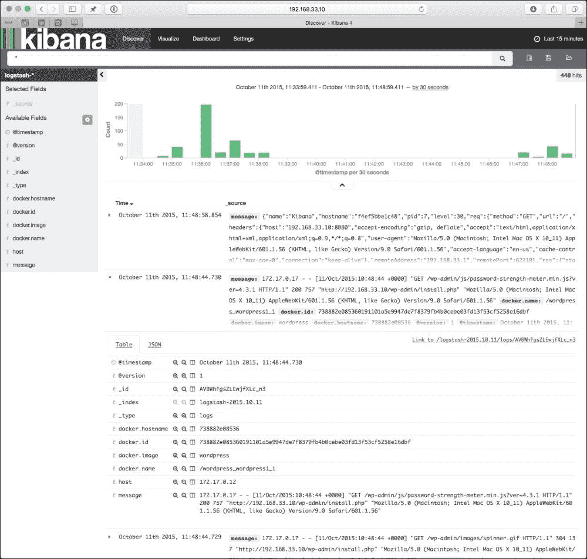
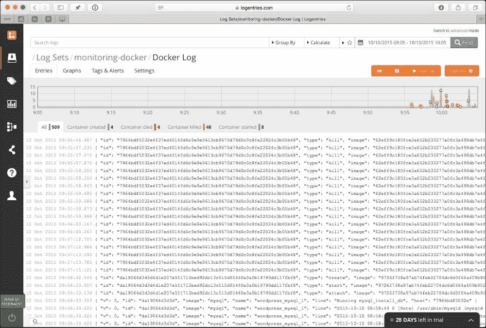

# 第七章。从容器中收集应用程序日志

监控中最容易被忽略的部分之一是应用程序或服务(如 NGINX、MySQL、Apache 等)生成的日志文件。到目前为止，我们已经研究了记录容器中进程在某个时间点的 CPU 和 RAM 利用率的各种方法，现在是时候对日志文件进行同样的记录了。

如果您是以“牛”或“鸡”的形式运行您的容器，那么您手动或自动处理销毁和重新启动容器问题的方式非常重要。虽然这应该可以解决眼前的问题，但它无助于追踪问题的根本原因，如果您不知道这一点，那么您如何尝试解决它，以便它不会再次发生。

在本章中，我们将了解如何将容器中运行的应用程序的日志文件内容放在中心位置，以便它们可用，即使您必须销毁和替换容器。我们将在本章中讨论以下主题:

*   如何查看容器日志？
*   使用 Docker 容器堆栈部署“ELK”堆栈，将日志运送到
*   查看您的日志
*   有哪些第三方选项？

# 查看集装箱日志

就像的`docker top`命令一样，有一种非常基本的查看日志的方式。当您使用`docker logs`命令时，您实际上是在查看容器内运行的进程的`STDOUT`和`STDERR`。

### 注

关于标准流的更多信息，请参见[https://en.wikipedia.org/wiki/Standard_streams](https://en.wikipedia.org/wiki/Standard_streams)。

从下面的截图可以看到，你要做的最简单的事情就是运行`docker logs`，后面跟着你的容器名:


要在您自己的主机上看到这一点，让我们使用以下命令从`chapter05`启动 WordPress 安装:

```
cd /monitoring_docker/chapter05/wordpress/
docker-compose up –d
docker logs wordpress_wordpress1_1

```

您可以通过在容器名称前添加以下标志来扩展`dockerlogs`命令:

*   `-f`或`--follow`将实时流式传输日志
*   `-t`或`--timestamps`将在每一行的开始显示一个时间戳
*   `--tail="5"`将显示最后 *x* 的行数
*   `--since="5m00s"`将只显示最近 5 分钟的条目

使用我们刚刚启动的 WordPress 安装，尝试运行以下命令:

```
docker logs --tail="2" wordpress_wordpress1_1

```

这将显示日志的最后两行，您可以使用以下命令添加时间戳:

```
docker logs --tail="2" –timestamps wordpress_wordpress1_1

```

正如您在下面的终端输出中看到的，您还可以将命令串在一起形成一种非常基本的查询语言:


使用`docker logs`的缺点与使用`docker top`完全相同，因为它仅在本地可用，并且日志仅在容器存在的时间内存在，您可以查看停止的容器的日志，但是一旦容器被移除，日志也将被移除。

# 每个堆栈

类似于我们在本书中介绍的一些技术，一个 ELK 堆栈真的值得拥有一本书；事实上，构成 ELK 堆栈的每个元素都有书籍，这些元素是:

*   Elasticsearch 是一款功能强大的搜索服务器，开发时考虑到了现代工作负载
*   Logstash 位于您的数据源和弹性搜索服务之间；它将您的数据实时转换为 Elasticsearch 可以理解的格式。
*   Kibana 位于您的 Elasticsearch 服务前面，允许您在功能丰富的基于网络的仪表板中查询数据。

有一个 ELK 栈有很多移动的部分，所以为了简化事情，我们将使用一个预建的栈来进行测试；但是，您可能不想在生产中使用这个堆栈。

## 开始堆叠

让我们启动一个新的流浪主机来运行 ELK 堆栈:

```
[russ@mac ~]$ cd ~/Documents/Projects/monitoring-docker/vagrant-centos/
[russ@mac ~]$ vagrant up
Bringing machine 'default' up with 'virtualbox' provider...
==> default: Importing base box 'russmckendrick/centos71'...
==> default: Matching MAC address for NAT networking...
==> default: Checking if box 'russmckendrick/centos71' is up to date...

.....

==> default: => Installing docker-engine ...
==> default: => Configuring vagrant user ...
==> default: => Starting docker-engine ...
==> default: => Installing docker-compose ...
==> default: => Finished installation of Docker
[russ@mac ~]$ vagrant ssh

```

现在，我们有了一个正常运行的干净主机，我们可以通过运行以下命令来启动堆栈:

```
[vagrant@docker ~]$ cd /monitoring_docker/chapter07/elk/
[vagrant@docker elk]$ docker-compose up -d

```

你可能已经注意到了，它做的更多，只是下拉了一些图片；事情是这样的:

*   一个弹性搜索容器使用来自[https://hub.docker.com/_/elasticsearch/](https://hub.docker.com/_/elasticsearch/)的官方图片发布。
*   一个 Logstash 容器是使用来自[https://hub.docker.com/_/logstash/](https://hub.docker.com/_/logstash/)的官方图片启动的，它也是用我们自己的配置启动的，这意味着我们的安装会监听从 Logspout 发送的日志(一分钟后会有更多相关信息)。
*   一个定制的基巴纳映像是使用来自[https://hub.docker.com/_/kibana/](https://hub.docker.com/_/kibana/)的官方映像构建的。它所做的只是添加了一个小脚本，以确保在我们的弹性搜索容器完全启动并运行之前，Kibana 不会启动。然后，它使用自定义配置文件启动。
*   一个定制的 Logspout 容器是使用来自[https://hub.docker.com/r/gliderlabs/logspout/](https://hub.docker.com/r/gliderlabs/logspout/)的官方图片构建的，然后我们添加了一个定制模块，这样 Logspout 就可以和 Logstash 对话了。

一旦`docker-compose`完成构建并启动堆栈，在运行`docker-compose ps`时，您应该能够看到如下内容:


我们现在已经建立并运行了我们的 ELK 堆栈，正如您可能已经注意到的，还有一个额外的容器正在运行，并为我们提供了一个 ELK-L 堆栈，那么什么是 Logspout 呢？

## 日志包

如果我们要启动 Elasticsearch、Logstash 和 Kibana 容器，我们应该有一个功能正常的 ELK 堆栈，但是我们将有很多配置要做来将我们的容器日志放入 Elasticsearch。

自 Docker 1.6 以来，您已经能够配置日志驱动程序，这意味着可以启动一个容器，并让它将其`STDOUT`和`STDERR`发送到系统日志服务器，在我们的例子中，该服务器将是 Logstash 但是，这意味着每次我们启动容器时，您都必须添加类似于以下选项的内容:

```
--log-driver=syslog --log-opt syslog-address=tcp://elk_logstash_1:5000 

```

这就是 Logspout 的用武之地，它被设计成通过截取 Docker 进程正在收集的消息来收集主机上的所有`STDOUT`和`STDERR`消息，然后以 Elasticsearch 能够理解的格式将它们路由到我们的 Logstash 实例。

正如日志驱动程序一样，它支持开箱即用的 Syslog 但是，有一个第三方模块将输出转换为 JSON，Logstash 理解这一点。作为构建的一部分，我们下载、编译并配置了该模块。

您可以在以下网址找到关于日志喷口和日志驱动程序的更多信息:

*   官方日志打印映像:https://hub . docker . com/r/gliderbs/logs 打印输出/
*   Logspout 项目页面:[https://github.com/gliderlabs/logspout](https://github.com/gliderlabs/logspout)
*   logspout logstash 模块:https://github . com/looplab/logpout-logtash
*   Docker 1.6 发行说明:[https://blog.docker.com/2015/04/docker-release-1-6/](https://blog.docker.com/2015/04/docker-release-1-6/)
*   Docker日志驱动程序:[https://docs.docker.com/reference/logging/overview/](https://docs.docker.com/reference/logging/overview/)

## 查看日志

现在，我们的 ELK 已经开始运行，并且有一个机制可以将容器生成的所有 T0 和 T1 消息流式传输到 Logstash，Logstash 再将数据路由到 Elasticsearch。现在是时候查看基巴纳的日志了。要访问基巴纳，请在浏览器中访问 T2；当你进入页面时，你会被要求**配置一个索引模式**，默认的索引模式对于我们的需求来说是可以的，所以只需点击**创建**按钮。

一旦您这样做了，您将看到一个索引模式列表，这些模式直接取自 Logspout 输出，您应该注意到索引中的以下项目:

*   `docker.name`:容器的名称
*   `docker.id`:满箱标识
*   `docker.image`:用于启动映像的映像名称

从这里，如果您点击顶部菜单中的**发现**，您将看到类似于以下页面的内容:



在截图中，你会看到我最近推出了 WordPress 堆栈，我们在整本书中都在使用它，使用了以下命令:

```
[vagrant@docker elk]$ cd /monitoring_docker/chapter05/wordpress/
[vagrant@docker wordpress]$ docker-compose up –d

```

为了让您了解正在记录的内容，下面是运行 WordPress 安装脚本时从 Elasticseach 获取的原始 JSON:

```
{
  "_index": "logstash-2015.10.11",
  "_type": "logs",
  "_id": "AVBW8ewRnBVdqUV1XVOj",
  "_score": null,
  "_source": {
    "message": "172.17.0.11 - - [11/Oct/2015:12:48:26 +0000] \"POST /wp-admin/install.php?step=1 HTTP/1.1\" 200 2472 \"http://192.168.33.10/wp-admin/install.php\" \"Mozilla/5.0 (Macintosh; Intel Mac OS X 10_11) AppleWebKit/601.1.56 (KHTML, like Gecko) Version/9.0 Safari/601.1.56\"",
    "docker.name": "/wordpress_wordpress1_1",
    "docker.id": "0ba42876867f738b9da0b9e3adbb1f0f8044b7385ce9b3a8a3b9ec60d9f5436c",
    "docker.image": "wordpress",
    "docker.hostname": "0ba42876867f",
    "@version": "1",
    "@timestamp": "2015-10-11T12:48:26.641Z",
    "host": "172.17.0.4"
  },
  "fields": {
    "@timestamp": [
      1444567706641
    ]
  },
  "sort": [
    1444567706641
  ]
}
```

从这里，你可以开始使用免费的文本搜索框并建立一些相当复杂的查询来深入到你的容器的`STDOUT`和`STDERR`日志中。

## 生产呢？

正如本节顶部提到的，您可能不想使用本章附带的`docker-compose`文件来运行您的生产 ELK 堆栈。首先，您希望您的弹性搜索数据存储在持久卷上，并且您非常希望您的日志存储服务高度可用。

有许多关于如何配置高可用性 ELK 堆栈的指南，以及弹性搜索的创建者弹性公司的托管服务，还有亚马逊网络服务，它提供弹性搜索服务:

*   ELK 教程:[https://www . YouTube . com/watch？v = ge 8 uhfb 1m](https://www.youtube.com/watch?v=ge8uHdmtb1M)
*   从 Elastic 找到:[https://www.elastic.co/found](https://www.elastic.co/found)
*   亚马逊弹性搜索服务:[https://aws.amazon.com/elasticsearch-service/](https://aws.amazon.com/elasticsearch-service/)

# 查看第三方选项

在自己的服务器实例外部托管容器的中央日志记录时，有几个选项。其中一些是:

*   日志条目:[https://logentries.com/](https://logentries.com/)
*   loggly:[https://www.loggly.com/](https://www.loggly.com/)

这两种服务都提供免费等级。日志条目还提供了一个“日志条目目录免费”帐户，您可以在[https://logentries.com/docker/](https://logentries.com/docker/)找到更多关于该帐户的信息

### 注

正如*探索第三方选项*一章所建议的，在评估第三方服务时，最好使用云服务。本章的其余部分假设您正在运行云主机。

让我们看看在外部服务器上配置日志条目，首先你需要在[https://logentries.com/](https://logentries.com/)注册一个账户。一旦你注册了，你应该被带到一个页面，在那里你的日志最终会被显示出来。

首先，点击页面右上角的**添加新日志**按钮，然后点击**平台**部分的 Docker 标志。

您必须在**选择集**部分命名您的日志集，因此请为您的日志集命名。您现在可以选择使用来自[https://github.com/logentries/docker-logentries](https://github.com/logentries/docker-logentries)的 Docker 文件在本地构建自己的容器:

```
git clone https://github.com/logentries/docker-logentries.git
cd docker-logentries
docker build -t docker-logentries .

```

运行上述命令后，您将获得以下输出:


在开始您的容器之前，您需要通过点击**生成日志令牌**来为您的日志集生成一个访问令牌。完成后，您可以使用以下命令启动本地构建的容器(用刚刚生成的令牌替换令牌):

```
docker run -d -v /var/run/docker.sock:/var/run/docker.sock docker-logentries -t wn5AYlh-jRhgn3shc-jW14y3yO-T09WsF7d -j

```

您可以通过运行以下命令直接从 Docker 集线器下载该映像:

```
docker run -d -v /var/run/docker.sock:/var/run/docker.sock logentries/docker-logentries -t wn5AYlh-jRhgn3shc-jW14y3yO-T09WsF7d –j

```

值得指出的是，日志条目给出的自动生成的指令在前台启动容器，而不是像前面的指令一样一旦启动就从容器中分离。

一旦`docker-logentries`容器启动并运行，您应该开始看到日志从您的容器实时流至您的仪表板:



从这里，您将能够查询您的日志，创建仪表板，并根据您选择的帐户选项创建警报。

# 总结

在本章中，我们已经介绍了如何使用 Docker 内置的工具查询容器的`STDOUT`和`STDERR`输出，如何将消息发送到外部源，我们的 ELK 堆栈，以及如何在容器终止后存储消息。最后，我们看了一些提供服务的第三方服务，您可以将日志流式传输到这些服务。

那么为什么要这么努力呢？监控不仅仅是保存和查询中央处理器、内存、硬盘和网络利用率指标；如果您没有访问日志文件的权限来查看当时是否产生了任何错误，那么了解一小时前是否出现了 CPU 峰值是没有意义的。

我们在本章中介绍的服务能够最快速、最高效地洞察到什么会迅速成为复杂的数据集。

在下一章中，我们将查看本书中涵盖的所有服务和概念，并将它们应用到一些真实世界的场景中。