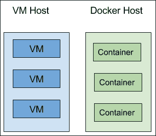
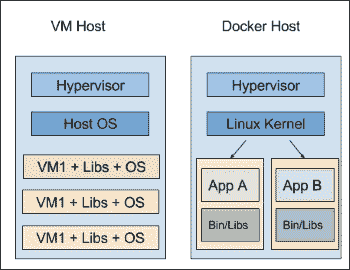

# 第一章。保护Docker主机

欢迎来到*安全Docker*书！我们很高兴您决定拿起这本书，我们希望确保您正在使用的资源以适当的方式得到保护，以确保系统完整性和防止数据丢失。理解为什么你应该关心安全性也很重要。如果防止数据丢失还没有吓到你，考虑一下最糟糕的情况——整个系统受损，你的秘密设计被他人泄露或窃取的可能性——可能有助于加强安全性。在本书中，我们将涵盖许多主题，以帮助安全地设置您的环境，这样您就可以安心地开始部署容器，因为您知道在开始时采取了正确的步骤来加强您的环境。在本章中，我们将了解如何保护 Docker 主机，并将涵盖以下主题:

*   Docker 主机概述
*   讨论 Docker 主机
*   虚拟化和隔离
*   Docker 守护程序的攻击面
*   保护 Docker 主机
*   Docker机器
*   SELinux 和 AppArmor
*   自动修补主机

# Docker 主机概述

在我们深入并深入之前，让我们先后退一步，回顾一下 Docker 主持人到底是什么。在本节中，我们将查看 Docker 主机本身，以了解我们在谈论 Docker 主机时所指的内容。我们还将研究 Docker 用来确保安全性的虚拟化和隔离技术。

# 讨论Docker主持人

当我们想到 Docker 主持人时，我们会想到什么？如果你把它放在几乎所有人都熟悉的虚拟机方面，让我们看看一个典型的虚拟机主机与 Docker 主机有什么不同。一台**虚拟机主机**就是虚拟机实际运行的地方。通常，如果您使用的是 VMware，这类似于 **VMware ESXi** 或者如果您使用的是 **Hyper-V** ，这类似于 **Windows Server** 。让我们看一下它们是如何比较的，这样您就可以直观地了解两者，如下图所示:



上图描绘了**虚拟机主机**和**Docker主机**之间的相似之处。如前所述，任何服务的主机只是 Docker 中底层虚拟机或容器运行的系统。因此，主机是操作系统或服务，它包含并操作您在其上安装和设置服务的底层系统，如 web 服务器、数据库等。

# 虚拟化和隔离

要了解如何保护Docker主机，我们必须首先了解如何设置Docker主机，以及在Docker主机中包含哪些项目。同样，与虚拟机主机一样，它们包含底层服务运行的操作系统。有了虚拟机，您将在这个**虚拟机主机**操作系统的基础上创建一个全新的操作系统。但是，在 Docker 上，您没有这样做，而是共享了 **Docker 主机**正在使用的**Linux 内核**。让我们看一下下面的图表来帮助我们表达这一点:



从上图中我们可以看出，在**虚拟机主机**和**Docker主机**上设置项目的方式有明显的不同。在**虚拟机主机**上，每个虚拟机都有自己的所有项目。每个容器化的应用程序都有自己的一套库，不管是 Windows 还是 Linux。现在，在 **Docker 主机**上，我们没有看到这一点。我们看到他们共享 **Docker 主机**上正在使用的 **Linux 内核**版本。也就是说，有一些安全方面的问题需要在 **Docker 主机**端解决。现在，在**虚拟机主机**端，如果有人破坏了虚拟机，操作系统将被隔离到该虚拟机。回到 **Docker 主机**方面，如果内核在 **Docker 主机**上受到损害，那么在该主机上运行的所有容器现在也处于高风险之中。

因此，现在您应该明白，当涉及到 Docker 主机时，我们关注安全性是多么重要。Docker 主机确实使用了一些隔离技术，这些技术将有助于防止内核或容器在几个方面受到损害。其中两种方法是通过实现**名称空间** 和**组**。在讨论它们如何帮助之前，让我们先给它们下一个定义。

众所周知，内核命名空间为将在您的主机上运行的容器提供了一种隔离形式。这是什么意思？这意味着您在 Docker 主机上运行的每个容器都将被赋予自己的网络堆栈，这样它就不会获得对另一个容器的套接字或接口的特权访问。但是，默认情况下，所有 Docker 容器都位于桥接接口上，因此它们可以轻松地相互通信。将桥接接口想象成所有容器都连接到的网络交换机。

名称空间还为进程和装载隔离提供隔离。在一个容器中运行的进程不能影响甚至看不到在另一个 Docker 容器中运行的进程。挂载点的隔离也是以容器为基础的。这意味着一个容器上的挂载点不能看到另一个容器上的挂载点或与之交互。

另一方面，控制组控制和限制将在 Docker 主机上运行的容器的资源。这可以归结为什么，意味着它将如何让你受益？这意味着 cgroups，正如它们将被称为前进，帮助每个容器获得其公平份额的内存、磁盘输入/输出、中央处理器等等。因此，一个容器不能通过耗尽其上的所有可用资源来关闭整个主机。这将有助于确保即使一个应用程序运行不正常，其他容器也不会受到该应用程序的影响，并且您的其他应用程序可以保证正常运行时间。

# Docker 守护进程的攻击面

虽然 Docker 确实减轻了虚拟化世界中的一些复杂工作，但是很容易忘记考虑在 Docker 主机上运行容器的安全影响。您需要注意的最大问题是 Docker 需要 root 权限才能操作。因此，您需要知道谁有权访问您的 Docker 主机和 Docker 守护程序，因为他们将对您的 Docker 主机上的所有 Docker 容器和映像拥有完全的管理权限。他们可以启动新的容器，停止现有的容器，删除映像，提取新的映像，甚至通过向容器中注入命令来重新配置正在运行的容器。他们还可以从容器中提取敏感信息，如密码和证书。因此，如果您确实需要对谁有权访问您的 Docker 守护程序保持单独的控制，请确保也将重要的容器分开。这是针对人们需要访问运行容器的 Docker 主机的容器。如果用户需要应用编程接口访问，那么这是不同的，分离可能没有必要。例如，在一台 Docker 主机上保留敏感的容器，同时在另一台 Docker 主机上保持正常操作容器运行，并授予其他工作人员访问非特权主机上的 Docker 守护程序的权限。如果可能，还建议从将在您的主机上运行的容器中删除 setuid 和 setgid 功能。如果要运行 Docker，建议只在这台服务器上使用 Docker，不要在其他应用上使用。Docker 还用一组非常有限的功能来启动容器，这有利于您解决安全问题。

### 注

要在启动 Docker 容器时删除 setuid 或 setgid 功能，您需要执行类似以下的操作:

```
$ docker run -d --cap-drop SETGID --cap-drop SETUID nginx

```

这将启动`nginx`集装箱，并降低集装箱的`SETGID`和`SETUID`能力。

Docker 的最终目标是将根用户映射到 Docker 主机上存在的非根用户。他们还致力于允许 Docker 守护程序在不需要 root 权限的情况下运行。这些未来的改进只会有助于促进 Docker 在实现其特性集时的关注度。

## 保护 Docker 守护进程

为了更好地保护 Docker 守护进程，我们可以保护 Docker 守护进程正在使用的通信。我们可以通过生成证书和密钥来做到这一点。在我们开始创建证书和密钥之前，很少有术语需要理解。A **证书颁发机构** ( **CA** )是颁发证书的实体。该证书通过证书中指定的主题来证明公钥的所有权。通过这样做，我们可以确保您的 Docker 守护程序将只接受来自其他守护程序的通信，这些守护程序拥有同样由同一 CA 签名的证书。

现在，我们将研究如何确保您将在 Docker 主机上运行的容器在几页内是安全的；但是，首先也是最重要的是，您希望确保 Docker 守护程序安全运行。为此，在守护进程启动时，需要启用一些参数。您需要提前做的一些事情如下:

1.  Create a CA.

    ```
    $ openssl genrsa -aes256 -out ca-key.pem 4096
    Generating RSA private key, 4096 bit long modulus
    ......................................................................................................................................................................................................................++
    ....................................................................++
    e is 65537 (0x10001)
    Enter pass phrase for ca-key.pem:
    Verifying - Enter pass phrase for ca-key.pem:

    ```

    您需要指定两个值，`pass phrase`和`pass phrase`。这需要介于`4`和`1023`字符之间。任何低于`4`或高于`1023`的都不会被接受。

    ```
    $ openssl req -new -x509 -days <number_of_days> -key ca-key.pem -sha256 -out ca.pem
    Enter pass phrase for ca-key.pem:
    You are about to be asked to enter information that will be incorporated
    into your certificate request.
    What you are about to enter is what is called a Distinguished Name or a DN.
    There are quite a few fields but you can leave some blank
    For some fields there will be a default value,
    If you enter '.', the field will be left blank.
    -----
    Country Name (2 letter code) [AU]:US
    State or Province Name (full name) [Some-State]:Pennsylvania
    Locality Name (eg, city) []:
    Organization Name (eg, company) [Internet Widgits Pty Ltd]:
    Organizational Unit Name (eg, section) []:
    Common Name (e.g. server FQDN or YOUR name) []:
    Email Address []:

    ```

    你会需要几样东西。您将需要您之前为`ca-key.pem`输入的`pass phrase`。您还需要`Country`、`State`、`city`、`Organization Name`、`Organizational Unit Name`、**全限定域名** ( **FQDN** )、T7】才能最终确定证书。

2.  创建客户端密钥和签名证书。

    ```
    $ openssl genrsa -out key.pem 4096
    $ openssl req -subj '/CN=<client_DNS_name>' -new -key key.pem -out client.csr

    ```

3.  签署公共密钥。

    ```
    $ openssl x509 -req -days <number_of_days> -sha256 -in client.csr -CA ca.pem -CAkey ca-key.pem -CAcreateserial -out cert.em

    ```

4.  更改权限。

    ```
    $ chmod -v 0400 ca-key.pem key.pem server-key.em
    $ chmod -v 0444 ca.pem server-cert.pem cert.em
    ```

现在，您可以确保您的 Docker 守护程序只接受来自您向其提供签名证书的其他 Docker 主机的连接:

```
$ docker daemon --tlsverify --tlscacert=ca.pem --tlscert=server-certificate.pem --tlskey=server-key.pem -H=0.0.0.0:2376
```

确保证书文件位于运行命令的目录中，否则需要指定证书文件的完整路径。

在每个客户端上，您需要运行以下命令:

```
$ docker --tlsverify --tlscacert=ca.pem --tlscert=cert.pem --tlskey=key.pem -H=<$DOCKER_HOST>:2376 version

```

同样，证书的位置也很重要。请确保将它们放在计划运行上述命令的目录中，或者指定证书和密钥文件位置的完整路径。

通过访问以下链接，您可以阅读更多关于在 Docker 守护程序中默认使用**传输层安全性** ( **TLS** )的信息:

[http://docs.docker.com/engine/articles/https/](http://docs.docker.com/engine/articles/https/)

更多阅读 **Docker 安全部署指南**中的，以下链接提供了一个表格，可用于深入了解您还可以利用的一些其他项目:

[https://github . com/gdssesecurity/Docker-Secure-Deployment-Guidelines](https://github.com/GDSSecurity/Docker-Secure-Deployment-Guidelines)

该网站的一些亮点包括:

*   收集安全和审计日志
*   运行 Docker 容器时使用特权开关
*   设备控制组
*   挂载点
*   安全审计

# 保护Docker主机

我们从哪里开始保护我们的主机？我们需要从什么工具开始？在本节中，我们将了解如何使用 Docker Machine，以及如何确保以安全的方式创建我们正在创建的主机。Docker主持人就像你家的前门，如果你不妥善保护他们，那么任何人都可以直接走进去。我们还将查看**安全性增强的 Linux** ( **SELinux** )和**appamor**，以确保您在创建的主机上拥有额外的安全层。最后，我们将了解一些支持操作系统并在发现安全漏洞时自动修补操作系统的操作系统。

# Docker机器

Docker Machine 是一个工具，允许你在你的虚拟主机上安装 Docker 守护进程。然后，您可以使用 Docker Machine 管理这些 Docker 主机。Docker 机器可以通过 Windows 和 Mac 上的 **Docker 工具箱**安装。如果您使用的是 Linux，您将通过一个简单的`curl`命令安装 Docker Machine:

```
$ curl -L https://github.com/docker/machine/releases/download/v0.6.0/docker-machine-`uname -s`-`uname -m` > /usr/local/bin/docker-machine && \
$ chmod +x /usr/local/bin/docker-machine

```

第一个命令将 Docker Machine 安装到`/usr/local/bin`目录中，第二个命令更改文件的权限并将其设置为可执行。

在下面的演练中，我们将使用 Docker Machine 来设置一个新的 Docker 主机。

Docker Machine 是您应该或将要用来设置主机的设备。因此，我们将从它开始，以确保您的主机以安全的方式设置。我们将看一看，当您使用 Docker Machine 工具创建主机时，如何判断它们是否安全。让我们看看使用 Docker Machine 创建 Docker 主机时的样子，如下所示:

```
$ docker-machine create --driver virtualbox host1

Running pre-create checks...
Creating machine...
Waiting for machine to be running, this may take a few minutes...
Machine is running, waiting for SSH to be available...
Detecting operating system of created instance...
Provisioning created instance...
Copying certs to the local machine directory...
Copying certs to the remote machine...

Setting Docker configuration on the remote daemon...

```

从前面的输出中，当 create 正在运行时，Docker Machine 正在做一些事情，例如创建机器、等待 SSH 可用、执行操作、将证书复制到正确的位置以及设置 Docker 配置，我们将看到如何将 Docker 连接到该机器，如下所示:

```
$ docker-machine env host1

export DOCKER_TLS_VERIFY="1"
export DOCKER_HOST="tcp://192.168.99.100:2376"
export DOCKER_CERT_PATH="/Users/scottpgallagher/.docker/machine/machines/host1"
export DOCKER_MACHINE_NAME="host1"
# Run this command to configure your shell:
# eval "$(docker-machine env host1)"

```

前面的命令输出显示了为将该机器设置为 Docker 命令现在要运行的机器而运行的命令:

```
 eval "$(docker-machine env host1)"

```

我们现在可以运行常规的 Docker 命令，如`docker info`，它将从`host1`返回信息，现在我们已经将其设置为我们的环境。

从前面突出显示的输出中，我们可以看到从两个导出行开始就安全地设置了主机。这是第一条高亮显示的线:

```
export DOCKER_TLS_VERIFY="1"

```

从另一个突出显示的输出中，`DOCKER_TLS_VERIFY`被设置为`1`或`true`。这是第二条高亮显示的线:

```
export DOCKER_HOST="tcp://192.168.99.100:2376"

```

我们正在设置主机在`2376`的安全端口上运行，而不是在`2375`的不安全端口上运行。

我们还可以通过运行以下命令来获取这些信息:

```
$ docker-machine ls
NAME      ACTIVE   DRIVER       STATE     URL                         SWARM 
host1              *        virtualbox     Running   tcp://192.168.99.100:2376 

```

如果您已经使用前面的说明将您的 Docker 主机和 Docker 容器设置为使用 TLS，请确保检查可以与 Docker Machine 一起使用的 TLS 开关选项。如果您有想要使用的现有证书，这些开关会很有帮助。通过运行以下命令，可以在高亮部分找到这些开关:

```
$ docker-machine --help

Options:
 --debug, -D      Enable debug mode
 -s, --storage-path "/Users/scottpgallagher/.docker/machine"
Configures storage path [$MACHINE_STORAGE_PATH]
 --tls-ca-cert      CA to verify remotes against [$MACHINE_TLS_CA_CERT]
 --tls-ca-key      Private key to generate certificates [$MACHINE_TLS_CA_KEY]
 --tls-client-cert     Client cert to use for TLS [$MACHINE_TLS_CLIENT_CERT]
 --tls-client-key       Private key used in client TLS auth [$MACHINE_TLS_CLIENT_KEY]
 --github-api-token     Token to use for requests to the Github API [$MACHINE_GITHUB_API_TOKEN]
 --native-ssh      Use the native (Go-based) SSH implementation. [$MACHINE_NATIVE_SSH]
 --help, -h      show help
 --version, -v      print the version

```

您也可以使用`regenerate-certs`子命令为机器重新生成 TLS 证书，以防您想要安心或您的密钥被泄露。一个示例命令看起来类似于以下命令:

```
$ docker-machine regenerate-certs host1 

Regenerate TLS machine certs?  Warning: this is irreversible. (y/n): y
Regenerating TLS certificates
Copying certs to the local machine directory...
Copying certs to the remote machine...
Setting Docker configuration on the remote daemon...

```

# SELinux 和 AppArmor

大多数 Linux 操作系统基于这样一个事实，即它们可以利用 SELinux 或 AppArmor 对操作系统上的文件或位置进行更高级的访问控制。使用这些组件，您可以限制容器作为具有根用户权限的根用户执行程序的能力。

Docker 确实提供了一个安全模型模板，它随 AppArmor 一起提供，Red Hat 也为 Docker 提供了 SELinux 策略。您可以利用这些提供的模板在您的环境之上添加额外的安全层。

有关 SELinux 和 Docker 的更多信息，我建议访问以下网站:

[https://www . mankier . com/8/docker _ selinux](https://www.mankier.com/8/docker_selinux)

另一方面，如果你想在 AppArmor 和 Docker 上阅读更多内容，我建议你访问以下网站:

[https://github . com/docker/docker/tree/master/contraib/apparmor](https://github.com/docker/docker/tree/master/contrib/apparmor)

在这里你会发现一个`template.go`文件，这是 Docker 随其应用程序附带的模板，也就是 AppArmor 模板。

# 自动修补主机

如果你真的想进入高级 Docker 主机，那么你可以使用 **CoreOS** 和 **Amazon Linux AMI** ，它们都以不同的方式执行自动修补。当安全更新出现时，CoreOS 将为您的操作系统打补丁并重新启动您的操作系统，而当您重新启动时，亚马逊 Linux AMI 将完成更新。因此，在设置 Docker 主机时选择使用哪个操作系统时，请确保考虑到这两个操作系统都实现了某种形式的自动修补，但方式不同。您将需要确保您正在实施某种类型的扩展或故障转移，以满足运行在 CoreOS 上的某些东西的需求，以便在重新启动以修补操作系统时不会出现停机。

# 总结

在本章中，我们研究了如何保护我们的 Docker 主机。Docker 主机是第一道防线，因为它们是您的容器运行以及彼此和终端用户通信的起点。如果这些都不安全，那么就没有继续前进的目的。您学习了如何设置 Docker 守护程序，通过为主机和客户端生成适当的证书来安全运行 TLS。我们还研究了使用 Docker 容器的虚拟化和隔离优势，但请务必记住 Docker 守护程序的攻击面。

其他项目包括如何使用 Docker Machine 在具有安全通信的安全操作系统上轻松创建 Docker 主机，并确保在使用它设置容器时使用安全方法进行设置。使用 SELinux 和 AppArmor 等项目也有助于提高您的安全足迹。最后，我们介绍了一些可以用于自动修补的 Docker 主机操作系统，例如 CoreOS 和 Amazon Linux AMI。

在下一章中，我们将研究如何保护 Docker 的组件。我们将着重于保护 Docker 的组件，例如您可以使用的注册表、在您的主机上运行的容器，以及如何对您的映像进行签名。