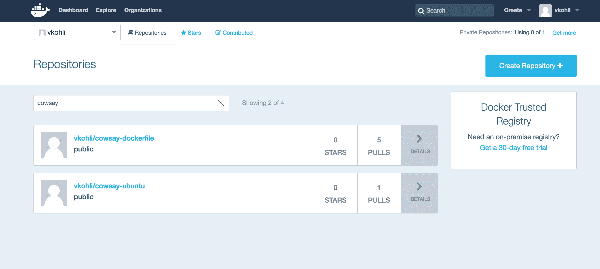
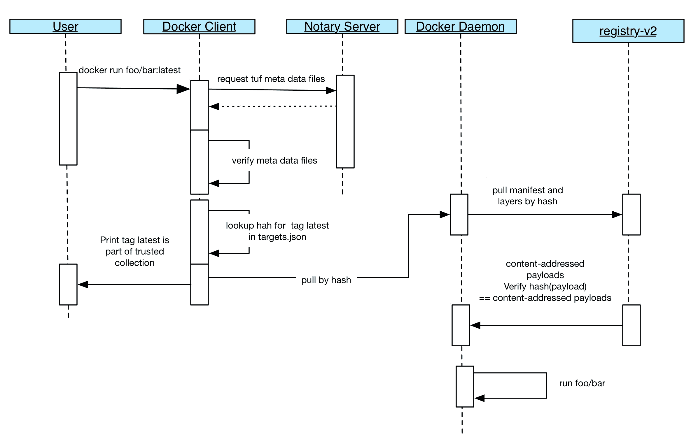
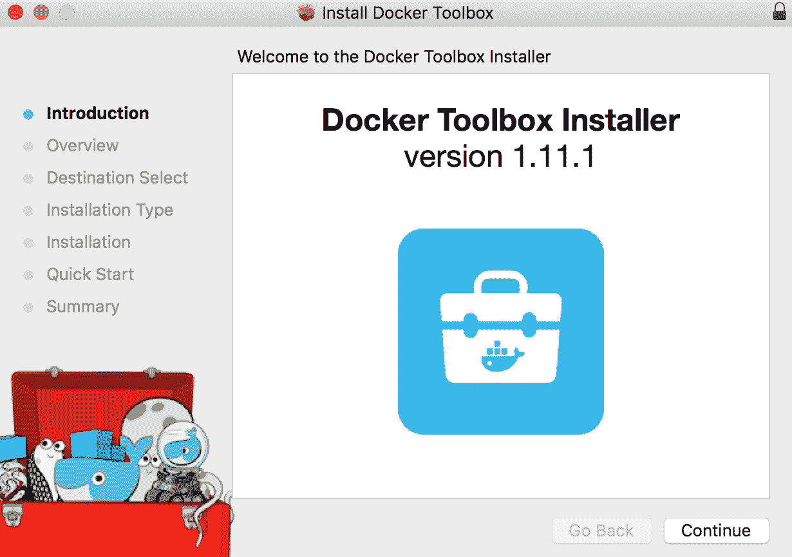

# 第五章。围绕容器化应用移动

在最后一章中，我们在 Docker 容器的帮助下介绍了微服务应用程序架构部署。在本章中，我们将探讨 Docker 注册表以及如何在公共和私有模式下使用它。我们还将深入探讨使用公共和私有 Docker 注册表时的故障排除问题。

我们将研究以下主题:

*   通过 docker registry 重新分发
*   公共Docker登记处
*   私人Docker注册处
*   确保映像的完整性-签名映像
*   **DTR** 可信注册Docker
*   通用控制平面

# 通过Docker登记处重新分配

Docker 注册表是允许用户存储和分发 Docker 映像的服务器端应用程序。默认情况下，公共 Docker 注册表(Docker Hub)可用于托管多个 Docker 映像，这些映像提供免费使用、零维护以及自动构建和组织帐户等附加功能。让我们详细看看公共和私有 Docker 注册中心。

## Docker公共存储库(Docker中心)

如前所述，Docker Hub 允许个人和组织与其内部团队和客户共享 Docker 映像，而无需维护基于云的公共存储库。它提供集中的资源映像发现和管理。它还为开发管道提供团队协作和工作流自动化。除了映像存储库管理之外，Docker Hub 的一些附加功能如下:

*   **自动化构建**:每当 GitHub 或 Bitbucket 存储库中的代码发生变化时，它都有助于创建新的映像
*   **WebHooks** :这是一个新特性，允许在映像成功推送至存储库后触发一个动作
*   **用户管理**:它允许创建工作组来管理组织的用户对映像存储库的访问

可以使用 Docker Hub 登录页面创建帐户，以便托管 Docker 映像；每个帐户都将链接到一个基于用户的唯一标识 Docker ID。基本功能，例如 Docker 映像搜索和从 Docker Hub 中拉出*，可以在不创建 Docker Hub 帐户的情况下执行。可以使用以下命令浏览 Docker Hub 中存在的映像:*

```
$ docker search centos

```

它将根据匹配的关键字在 Docker Hub 中显示现有映像。

也可以使用`docker login`命令创建Docker标识。以下命令将提示创建一个 Docker ID，该 ID 将是用户公共存储库的公共命名空间。系统会提示输入一个`Username`，还会提示输入`Password`和`Email`以完成注册流程:

```
$ sudo docker login 

Username: username 
Password: 
Email: email@blank.com 
WARNING:login credentials saved in /home/username/.dockercfg. 
Account created. Please use the confirmation link we sent to your e-mail to activate it.

```

为了注销，可以使用以下命令:

```
$ docker logout

```

## 私人Docker登记处

私有 Docker 注册表可以部署在本地组织内部；它在 Apache 许可下是开源的，易于部署。

使用私有 Docker 注册表，您有以下优势:

*   该组织可以控制和监视 Docker 映像的存储位置
*   完整的映像分发管道将归该组织所有
*   映像存储和分发对于内部开发工作流以及与其他 DevOps 组件(如 Jenkins)的集成非常有用

# 将映像推送到Docker中心

我们可以创建一个定制的映像，然后可以使用标签在 Docker Hub 上推送。让我们用一个基于终端的小应用程序创建一个简单的映像。创建包含以下内容的 Dockerfile:

```
FROM debian:wheezy 
RUN apt-get update && apt-get install -y cowsay fortune 

```

转到包含 Dockerfile 的目录，并执行以下命令来构建映像:

```
$ docker build -t test/cowsay-dockerfile . 
Sending build context to Docker daemon 2.048 kB 
Sending build context to Docker daemon 
Step 0 : FROM debian:wheezy 
wheezy: Pulling from debian 
048f0abd8cfb: Pull complete 
fbe34672ed6a: Pull complete 
Digest: sha256:50d16f4e4ca7ed24aca211446a2ed1b788ab5e3e3302e7fcc11590039c3ab445 
Status: Downloaded newer image for debian:wheezy 
 ---> fbe34672ed6a 
Step 1 : RUN apt-get update && apt-get install -y cowsay fortune 
 ---> Running in ece42dc9cffe

```

或者，如下图所示，我们可以首先创建一个容器并对其进行测试，然后创建一个标记的**Docker映像**，该映像可以轻松地推送到**Docker中心**:


从 Docker 容器创建 Docker 映像并将其推送到公共 Docker 中心的步骤

我们可以使用以下命令检查映像是否已创建。如您所见，`test/cowsay-dockerfile`映像被创建:

```
$ docker images
REPOSITORY                  TAG                 IMAGE ID
CREATED             VIRTUAL SIZE
test/cowsay-dockerfile      latest              c1014a025b02        33
seconds ago      126.9 MB
debian                      wheezy              fbe34672ed6a        2
weeks ago         84.92 MB
vkohli/vca-iot-deployment   latest              35c98aa8a51f        8
months ago        501.3 MB
vkohli/vca-cli              latest              d718bbdc304b        9
months ago        536.6 MB

```

为了将映像推送到 Docker Hub 帐户，我们必须使用映像 ID 以下列方式用 Docker 标签/Docker ID 对其进行标记:

```
$ docker tag c1014a025b02 username/cowsay-dockerfile

```

由于标记的用户名将与 Docker Hub ID 帐户相匹配，我们可以轻松地推送映像:

```
$ sudo docker push username/cowsay-dockerfile 
The push refers to a repository [username/cowsay-dockerfile] (len: 1) 
d94fdd926b02: Image already exists 
accbaf2f09a4: Image successfully pushed 
aa354fc0b2b2: Image successfully pushed 
3a94f42115fb: Image successfully pushed 
7771ee293830: Image successfully pushed 
fa81ed084842: Image successfully pushed 
e04c66a223c4: Image successfully pushed 
7e2c5c55ef2c: Image successfully pushed

```



Docker集线器屏幕截图

### 类型

可以预先检查的一个故障排除问题是，自定义 Docker 映像上标记的用户名应该符合 Docker Hub 帐户的用户名，以便成功推送映像。推送至 Docker Hub 的自定义映像将公开提供。Docker 免费提供了一个私有存储库，应该用来推送私有映像。Docker 客户端版本 1.5 和更低版本将无法将映像推送到 Docker Hub 帐户，但仍能拉取映像。仅支持版本 1.6 或更高版本。因此，总是建议保持 Docker 版本最新。

如果向 Docker Hub 的推送因 **500 内部服务器错误**而失败，问题与 Docker Hub 基础架构有关，重新推送可能会有所帮助。如果在推送 Docker 映像时问题仍然存在，应在`/var/log/docker.log in`参考 Docker 日志，以便详细调试。

## 安装私有本地 Docker 注册表

可以使用存在于 Docker 集线器上的映像来部署私有 Docker 注册表。映射到访问私有 Docker 注册表的端口将是`5000`:

```
$ docker run -p 5000:5000 registry

```

现在，我们将前面教程中创建的相同映像标记到`localhost:5000/cowsay-dockerfile`中，以便匹配的存储库名称和映像名称可以很容易地推送到私有 Docker 注册表中:

```
$ docker tag username/cowsay-dockerfile localhost:5000/cowsay-dockerfile

```

将映像推送到私有 Docker 注册表:

```
$ docker push localhost:5000/cowsay-dockerfile

```

推送指的是一个存储库(`localhost:5000/cowsay-dockerfile` ) (len: 1):

```
Sending image list 
Pushing repository localhost:5000/cowsay-dockerfile (1 tags) 
e118faab2e16: Image successfully pushed 
7e2c5c55ef2c: Image successfully pushed 
e04c66a223c4: Image successfully pushed 
fa81ed084842: Image successfully pushed 
7771ee293830: Image successfully pushed 
3a94f42115fb: Image successfully pushed 
aa354fc0b2b2: Image successfully pushed 
accbaf2f09a4: Image successfully pushed 
d94fdd926b02: Image successfully pushed 
Pushing tag for rev [d94fdd926b02] on {http://localhost:5000/v1/repositories/ cowsay-dockerfile/tags/latest}

```

图片 ID 可以通过浏览浏览器中的链接或者使用推送图片后出现的`curl`命令查看。

## 在主机之间移动映像

将映像从一个注册表移动到另一个注册表需要从互联网推送和拉出映像。如果需要将映像从一台主机移动到另一台主机，那么只需借助`docker save`命令即可实现，无需上传和下载映像的开销。Docker 提供了两种不同类型的方法来将容器映像保存到 tar ball 中:

*   `docker export`:这将容器的运行或暂停状态保存到 tar 文件中
*   `docker save`:这将非运行的容器映像保存到一个文件中

让我们借助以下教程来比较一下`docker export`和`docker save`命令:

使用导出，从 Docker Hub 中提取基本映像:

```
$ docker pull Ubuntu 
latest: Pulling from ubuntu 
dd25ab30afb3: Pull complete 
a83540abf000: Pull complete 
630aff59a5d5: Pull complete 
cdc870605343: Pull complete

```

让我们从前面的映像运行 Docker 容器后创建一个示例文件:

```
$ docker run -t -i ubuntu /bin/bash 
root@3fa633c2e9e6:/# ls 
bin  boot  dev  etc  home  lib  lib64  media  mnt  opt  proc  root 
run  sbin  srv  sys  tmp  usr  var 
root@3fa633c2e9e6:/# touch sample 
root@3fa633c2e9e6:/# ls 
bin  boot  dev  etc  home  lib  lib64  media  mnt  opt  proc  root 
run  sample  sbin  srv  sys  tmp  usr  var

```

在另一个 shell 中，我们可以看到正在运行的 Docker 容器，然后可以使用以下命令将其导出到 tar 文件中:

```
$  docker ps
CONTAINER ID        IMAGE               COMMAND             CREATED
         STATUS              PORTS               NAMES
3fa633c2e9e6        ubuntu              "/bin/bash"         45 seconds
ago      Up 44 seconds                           prickly_sammet
$ docker export prickly_sammet | gzip > ubuntu.tar.gz

```

然后，可以将 tar 文件导出到另一台计算机，然后使用以下命令导入:

```
$ gunzip -c ubuntu.tar.gz | docker import - ubuntu-sample 
4411d1d3001702b2304d5ebf87f122ef80b463fd6287f3de4e631c50efa01369

```

在另一台机器上运行 Ubuntu 示例映像中的容器后，我们可以发现示例文件完好无损:

```
$ docker images
REPOSITORY                   TAG                 IMAGE ID  CREATED 
IRTUAL SIZE
ubuntu-sample                    latest               4411d1d30017      20 seconds 
go    108.8 MB
$ docker run -i -t ubuntu-sample /bin/bash
root@7fa063bcc0f4:/# ls
bin  boot  dev  etc  home  lib  lib64  media  mnt  opt  proc  root run  sample 
bin  srv  sys  tmp  usr  var

```

使用 save，为了在运行 Docker 容器的情况下传输映像，如前面的教程所示，我们可以使用`docker save`命令将映像转换为 tar 文件:

```
$ docker save ubuntu | gzip > ubuntu-bundle.tar.gz

```

现在可以使用`docker load`命令提取`ubuntu-bundle.tar.gz`文件并在另一台机器中使用:

```
$ gunzip -c ubuntu-bundle.tar.gz | docker load

```

从另一台机器中的`ubuntu-bundle`映像运行容器，我们会发现样本文件不存在，因为`docker load`命令将存储零投诉的映像:

```
$ docker run -i -t ubuntu /bin/bash 
root@9cdb362f7561:/# ls 
bin  boot  dev  etc  home  lib  lib64  media  mnt  opt  proc  root 
run  sbin  srv  sys  tmp  usr  var 
root@9cdb362f7561:/#

```

前面的两个示例都显示了导出和保存命令之间的区别以及它们的用法，以便在不使用 Docker 注册表的情况下跨本地主机传输映像。

## 确保映像签名映像的完整性

从 Docker 1.8 版本开始，包含的功能是 Docker 容器信任，它使用公证将**更新框架** ( **TUF** )集成到 Docker 中，公证是一种开源工具，可提供对任何内容或数据的信任。它允许验证发布者——Docker Engine 使用发布者密钥来验证——并且用户将要运行的映像正是发布者所创建的；它没有被篡改，是最新的。因此，这是一个允许验证映像发布者的选择加入功能。Docker 中央命令- *推*、*拉*、*构建*、*创建*和*运行-* 将对具有内容签名或显式内容哈希的映像进行操作。在将映像推送到存储库之前，内容发布者用私钥对映像进行签名。当用户第一次与映像交互时，与发布者建立信任，然后所有后续交互只需要来自同一发布者的有效签名。该模型类似于我们熟悉的 SSH 的第一个模型。Docker 内容信任使用两个键- **离线键**和**标记键**-它们是在发布者推送映像时第一次生成的。每个存储库都有自己的标记键。当用户第一次运行`docker pull`命令时，使用离线密钥建立对存储库的信任:

*   **离线密钥**:是你的存储库信任的根源；不同的存储库使用相同的离线密钥。该密钥应该保持离线，因为它对某些类别的攻击有优势。基本上，在创建新存储库的过程中需要这个密钥。
*   **标记键**:为发布者拥有的每个新存储库生成。它可以导出并与需要为特定存储库的内容签名的人共享。

下面是通过遵循信任密钥结构提供的保护列表:

*   **防止映像伪造** : Docker 内容信任提供了防止中间人攻击的保护。如果注册表遭到破坏，恶意攻击者无法篡改内容并将其提供给用户，因为每个运行命令都将失败，并显示无法验证内容的消息。
*   **防御回复攻击**:在重放攻击的情况下，之前的有效载荷被攻击者用来欺骗系统。Docker 内容信任在发布映像时利用时间戳密钥，从而提供针对重放攻击的保护，并确保用户接收最新的内容。
*   **防止密钥泄露**:标记密钥由于其在线性质可能会被泄露，并且每次新内容被推送到存储库时都需要它。Docker 内容信任允许发布者对用户透明地旋转泄露的密钥，并有效地将其从系统中移除。

通过将公证集成到 Docker 引擎中，可以实现 Docker 内容信任。想要对任意收集的内容进行数字签名和验证的任何人都可以下载并实现公证。基本上，它是在分布式不安全网络上安全发布和验证内容的实用程序。在下面的序列图中，我们可以看到如何使用公证服务器来验证元数据文件及其与 Docker 客户端的集成的流程。可信集合将存储在公证服务器中，一旦 Docker 客户端有了命名散列(标签)的可信列表，它就可以从客户端到守护程序利用 Docker 远程 API。一旦拉取成功，我们就可以信任注册表拉取中清单和层上的所有内容。



Docker 可信运行的序列图

在内部，公证人使用 TUF，一个安全的软件分发和更新的通用设计，往往容易受到攻击。TUF 通过提供一个全面、灵活的安全框架来解决这个普遍存在的问题，开发人员可以将其与软件更新系统集成。通常，软件更新系统是在客户端系统上运行的应用程序，它获取并安装软件。

让我们开始安装公证人；在 Ubuntu 16.04 上，可以使用以下命令直接安装公证人:

```
$ sudo apt install notary 
Reading package lists... Done 
Building dependency tree        
Reading state information... Done 

The following NEW packages will be installed: 
  Notary 
upgraded, 1 newly installed, 0 to remove and 83 not upgraded. 
Need to get 4,894 kB of archives. 
After this operation, 22.9 MB of additional disk space will be used. 
...

```

否则可以从 GitHub 下载项目，手动搭建安装；构建项目需要安装 Docker Compose:

```
$ git clone https://github.com/docker/notary.git 
Cloning into 'notary'... 
remote: Counting objects: 15827, done. 
remote: Compressing objects: 100% (15/15), done. 

$ docker-compose build 
mysql uses an image, skipping 
Building signer 
Step 1 : FROM golang:1.6.1-alpine 

  $ docker-compose up -d 
$ mkdir -p ~/.notary && cp cmd/notary/config.json cmd/notary/root-ca.crt ~/.notary 

```

在上述步骤之后，将`127.0.0.1`公证服务器添加到`/etc/hosts`中，或者，如果使用了Docker机器，将`$(docker-machine ip)`添加到公证服务器中。

现在，我们将推送之前创建的`docker-cowsay`映像。默认情况下，内容信任被禁用；它可以在`DOCKER_CONTENT_TRUST`环境变量的帮助下启用，这将在本教程的后面进行。目前，操作内容信任的命令如下所示:

*   推
*   建设
*   创造
*   拉
*   奔跑

我们将用存储库名称标记映像:

```
$ docker images
REPOSITORY                  TAG                 IMAGE ID
CREATED             VIRTUAL SIZE
test/cowsay-dockerfile      latest              c1014a025b02        33
seconds ago      126.9 MB
debian                      wheezy              fbe34672ed6a        2
weeks ago         84.92 MB
vkohli/vca-iot-deployment   latest              35c98aa8a51f        8
months ago        501.3 MB
vkohli/vca-cli              latest              d718bbdc304b        9
months ago        536.6 MB
$ docker tag test/cowsay-dockerfile username/cowsay-dockerfile
$ docker push username/cowsay-dockerfile:latest
The push refers to a repository [docker.io/username/cowsay-dockerfile]
bbb8723d16e2: Pushing 24.08 MB/42.01 MB

```

现在，让我们检查公证人是否有这张映像的数据:

```
$ notary -s https://notary.docker.io -d ~/.docker/trust list docker.io/vkohli/cowsay-dockerfile:latest 
* fatal: no trust data available

```

正如我们在这里看到的，没有信任数据让我们启用`DOCKER_CONTENT_TRUST`标志，然后尝试推送映像:

```
$ docker push vkohli/cowsay-dockerfile:latest 
The push refers to a repository [docker.io/vkohli/cowsay-dockerfile] 
bbb8723d16e2: Layer already exists  
5f70bf18a086: Layer already exists  
a25721716984: Layer already exists  
latest: digest: sha256:0fe0af6e0d34217b40aee42bc21766f9841f4dc7a341d2edd5ba0c5d8e45d81c size: 2609 
Signing and pushing trust metadata 
You are about to create a new root signing key passphrase. This passphrase 
will be used to protect the most sensitive key in your signing system. Please 
choose a long, complex passphrase and be careful to keep the password and the 
key file itself secure and backed up. It is highly recommended that you use a 
password manager to generate the passphrase and keep it safe. There will be no 
way to recover this key. You can find the key in your config directory. 
Enter passphrase for new root key with ID f94af29:

```

正如我们在这里看到的，第一次推送时，它会询问密码以便对标记的映像进行签名。

现在，我们将从公证人那里获得之前推送的最新映像的信任数据:

```
$ notary -s https://notary.docker.io -d ~/.docker/trust list docker.io/vkohli/cowsay-dockerfile:latest
NAME                                 DIGEST                                SIZE 
BYTES)    ROLE
----------------------------------------------------------------------------------
-------------------
latest     0fe0af6e0d34217b40aee42bc21766f9841f4dc7a341d2edd5ba0c5d8e45d81c 
1374           targets

```

借助前面的例子，我们清楚地了解了公证人的工作以及 Docker 内容信任。

# Docker可信注册(DTR)

DTR 在内部和虚拟私有云中提供企业级 Docker 映像存储，以提供安全性并满足法规遵从性。DTR 运行在 Docker **通用控制平面** ( **UCP** )之上，它可以安装在内部或虚拟私有云之上，借助它，我们可以将 Docker 映像安全地存储在防火墙之后。


DTR 在 UCP 节点上运行

DTR 最重要的两个特点如下:

*   **Image management**: It allows the user to store Docker images securely behind firewall and DTR can be easily made as part of the continuous integration and delivery process in order to build, run, and ship applications.

    

    DTR 截图

*   **Access control and built-in security**: DTR provides authentication mechanism in order to add users as well as integrates with **Lightweight Directory Access Protocol** (**LDAP**) and Active Directory. It supports **role-based authentication** (**RBAC**) as well, which allows you to assign access control policies for each user.

    

    DTR 的用户身份验证选项

# Docker通用控制平面

Docker UCP 是企业级集群管理解决方案，允许您从单个平台管理 Docker 容器。它还允许您管理数千个节点，这些节点可以通过图形用户界面进行管理和监控。

UCP 有两个重要组成部分:

*   **控制器**:管理集群，保持集群配置
*   **节点**:为了运行容器，可以向集群中添加多个节点

UCP 可以使用沙盒安装安装在 Mac OS X 或 Windows 系统上使用 **Docker 工具箱**。安装由一个 UCP 控制器和一个或多个主机组成，这些主机将使用 Docker 工具箱作为节点添加到 UCP 集群中。

Docker 工具箱的一个先决条件是，需要使用 Docker 官方网站上提供的安装程序为 Mac OS X 和 Windows 系统安装工具箱。



Docker工具箱安装

让我们开始部署 Docker UCP:

1.  After the installation, launch the Docker Toolbox terminal:

    

    Docker快速启动终端

2.  使用`docker-machine`命令和`virtualbox`创建名为`node1`的虚拟机，该虚拟机将充当 UCP 控制器:

    ```
     $ docker-machine create -d virtualbox --virtualbox-memory 
            "2000" --virtualbox-disk-size "5000" node1 
            Running pre-create checks... 
            Creating machine... 
            (node1) Copying /Users/vkohli/.docker/machine/cache/
            boot2docker.iso to /Users/vkohli/.docker/machine/
            machines/node1/boot2docker.iso... 
            (node1) Creating VirtualBox VM... 
            (node1) Creating SSH key... 
            (node1) Starting the VM... 
            (node1) Check network to re-create if needed... 
            (node1) Waiting for an IP... 
            Waiting for machine to be running, this may take a few minutes... 
            Detecting operating system of created instance... 
            Waiting for SSH to be available... 
            Detecting the provisioner... 
            Provisioning with boot2docker... 
            Copying certs to the local machine directory... 
            Copying certs to the remote machine... 
            Setting Docker configuration on the remote daemon... 
            Checking connection to Docker... 
            Docker is up and running! 
            To see how to connect your Docker Client to the 
            Docker Engine running on this virtual machine, run: 
            docker-machine env node1

    ```

3.  同样创建一个`node2`虚拟机，稍后将配置为 UCP 节点:

    ```
            $ docker-machine create -d virtualbox --virtualbox-memory 
            "2000" node2 
            Running pre-create checks... 

            Creating machine... 
            (node2) Copying /Users/vkohli/.docker/machine/cache/boot2docker.iso 
            to /Users/vkohli/.docker/machine/machines/node2/
            boot2docker.iso... 
            (node2) Creating VirtualBox VM... 
            (node2) Creating SSH key... 
            (node2) Starting the VM... 
            (node2) Check network to re-create if needed... 
            (node2) Waiting for an IP... 
            Waiting for machine to be running, this may take a few minutes... 
            Detecting operating system of created instance... 
            Waiting for SSH to be available... 
            Detecting the provisioner... 
            Provisioning with boot2docker... 
            Copying certs to the local machine directory... 
            Copying certs to the remote machine... 
            Setting Docker configuration on the remote daemon... 
            Checking connection to Docker... 
            Docker is up and running! 
            To see how to connect your Docker Client to the 
            Docker Engine running on this virtual machine, 
            run: docker-machine env node2

    ```

4.  将`node1`配置为 UCP 控制器，负责为 UCP 应用程序提供服务，并运行管理 Docker 对象安装的流程。在此之前，设置环境将`node1`配置为 UCP 控制器:

    ```
            $ docker-machine env node1
            export DOCKER_TLS_VERIFY="1"
            export DOCKER_HOST="tcp://192.168.99.100:2376"
            export DOCKER_CERT_PATH="/Users/vkohli/.docker/machine/machines/node1"
            export DOCKER_MACHINE_NAME="node1"
            # Run this command to configure your shell:
            # eval $(docker-machine env node1)
            $ eval $(docker-machine env node1)
            $ docker-machine ls
    NAME    ACTIVE   DRIVER       STATE    URL            SWARM 
            DOCKER  ERRORS
    node1   *        virtualbox   Running  tcp://192.168.99.100:2376 
            1.11.1  
            node2   -        virtualbox   Running  tcp://192.168.99.101:2376                   v1.11.1  

    ```

5.  将`node1`设置为 UCP 控制器时，它将询问 UCP 管理员帐户的密码，并询问其他别名，可以使用 enter 命令添加或跳过这些别名:

    ```
    $ docker run --rm -it -v /var/run/docker.sock:/var/run
            /docker.sock --name ucp docker/ucp install -i --swarm-port 
            3376 --host-address $(docker-machine ip node1) 

            Unable to find image 'docker/ucp:latest' locally 
            latest: Pulling from docker/ucp 
            ... 
            Please choose your initial UCP admin password:  
            Confirm your initial password:  
            INFO[0023] Pulling required images... (this may take a while)  
            WARN[0646] None of the hostnames we'll be using in the UCP 
            certificates [node1 127.0.0.1 172.17.0.1 192.168.99.100] 
            contain a domain component.  Your generated certs may fail 
            TLS validation unless you only use one of these shortnames 
            or IPs to connect.  You can use the --san flag to add more aliases  

            You may enter additional aliases (SANs) now or press enter to 
            proceed with the above list. 
            Additional aliases: INFO[0646] Installing UCP with host address 
            192.168.99.100 - If this is incorrect, please specify an 
            alternative address with the '--host-address' flag  
            INFO[0000] Checking that required ports are available and accessible  

            INFO[0002] Generating UCP Cluster Root CA                
            INFO[0039] Generating UCP Client Root CA                 
            INFO[0043] Deploying UCP Containers                      
            INFO[0052] New configuration established.  Signalling the daemon
            to load it...  
            INFO[0053] Successfully delivered signal to daemon       
            INFO[0053] UCP instance ID:            
            KLIE:IHVL:PIDW:ZMVJ:Z4AC:JWEX:RZL5:U56Y:GRMM:FAOI:PPV7:5TZZ  
            INFO[0053] UCP Server SSL: SHA-256       
            Fingerprint=17:39:13:4A:B0:D9:E8:CC:31:AD:65:5D:
            52:1F:ED:72:F0:81:51:CF:07:74:85:F3:4A:66:F1:C0:A1:CC:7E:C6  
            INFO[0053] Login as "admin"/(your admin password) to UCP at         
            https://192.168.99.100:443 

    ```

6.  The UCP console can be accessed using the URL provided at the end of installation; log in with `admin` as the username and the password that you set previously while installing.

    

    UCP 许可证页Docker

7.  After logging in, the trail license can be added or skipped. The trail license can be downloaded by following the link on the UCP dashboard on the Docker website. The UCP console with multiple options such as listing application, container, and nodes:

    

    UCP 管理控制面板Docker

8.  首先通过设置环境将 UCP `node2`加入控制器:

    ```
            $ docker-machine env node2 
            export DOCKER_TLS_VERIFY="1" 
            export DOCKER_HOST="tcp://192.168.99.102:2376" 
            export DOCKER_CERT_PATH="/Users/vkohli/.docker/machine/machines/node2" 
            export DOCKER_MACHINE_NAME="node2" 
            # Run this command to configure your shell:  
            # eval $(docker-machine env node2) 
            $ eval $(docker-machine env node2)

    ```

9.  使用以下命令将节点添加到 UCP 控制器。将询问 UCP 控制器的网址、用户名和密码，如图所示:

    ```
    $ docker run --rm -it -v /var/run/docker.sock:/var/run/docker.sock
             --name ucp docker/ucp join -i --host-address 
            $(docker-machine ip node2) 

            Unable to find image 'docker/ucp:latest' locally 
            latest: Pulling from docker/ucp 
            ... 

            Please enter the URL to your UCP server: https://192.168.99.101:443 
            UCP server https://192.168.99.101:443 
            CA Subject: UCP Client Root CA 
            Serial Number: 4c826182c994a42f 
            SHA-256 Fingerprint=F3:15:5C:DF:D9:78:61:5B:DF:5F:39:1C:D6:
            CF:93:E4:3E:78:58:AC:43:B9:CE:53:43:76:50:
            00:F8:D7:22:37 
            Do you want to trust this server and proceed with the join? 
            (y/n): y 
            Please enter your UCP Admin username: admin 
            Please enter your UCP Admin password:  
            INFO[0028] Pulling required images... (this may take a while)  
            WARN[0176] None of the hostnames we'll be using in the UCP 
            certificates [node2 127.0.0.1 172.17.0.1 192.168.99.102] 
            contain a domain component.  Your generated certs may fail 
            TLS validation unless you only use one of these shortnames 
            or IPs to connect.  You can use the --san flag to add more aliases  

            You may enter additional aliases (SANs) now or press enter 
            to proceed with the above list. 
            Additional aliases:  
            INFO[0000] This engine will join UCP and advertise itself
            with host address 192.168.99.102 - If this is incorrect, 
            please specify an alternative address with the '--host-address' flag  
            INFO[0000] Verifying your system is compatible with UCP  
            INFO[0007] Starting local swarm containers               
            INFO[0007] New configuration established.  Signalling the 
            daemon to load it...  
            INFO[0008] Successfully delivered signal to daemon 

    ```

10.  UCP 的安装已经完成；现在，通过从 Docker Hub 中拉出官方的 DTR 映像，DTR 可以安装在`node2`上。完成 DTR 安装还需要 UCP 网址、用户名、密码和证书:

    ```
            $ curl -k https://192.168.99.101:443/ca > ucp-ca.pem 

            $ docker run -it --rm docker/dtr install --ucp-url https://
            192.168.99.101:443/ --ucp-node node2 --dtr-load-balancer 
            192.168.99.102 --ucp-username admin --ucp-password 123456 
            --ucp-ca "$(cat ucp-ca.pem)" 

            INFO[0000] Beginning Docker Trusted Registry installation  
            INFO[0000] Connecting to network: node2/dtr-br           
            INFO[0000] Waiting for phase2 container to be known to the 
            Docker daemon  
            INFO[0000] Connecting to network: dtr-ol                 
            ... 

            INFO[0011] Installation is complete                      
            INFO[0011] Replica ID is set to: 7a9b6eb67065            
            INFO[0011] You can use flag '--existing-replica-id 7a9b6eb67065' 
            when joining other replicas to your Docker Trusted Registry Cluster

    ```

11.  After the successful installation, DTR can be listed as an application in the UCP UI:

    

    Docker UCP 列出了所有的应用程序

12.  The DTR UI can be accessed using the `http://node2` URL. The new repository can be created by clicking on the **New repository** button:

    

    在 DTR 创建一个新的私人登记处

13.  The images can be pushed and pulled from the secured DTR created previously and the repository can be made private as well in order to keep the internal company-wide containers secured.

    

    在 DTR 创建一个新的私人登记处

14.  DTR can be configured using the **Settings** option from the menu that allows to set the domain name, TLS certificate, and storage backend for Docker images.

    

    DTR 的设置选项

# 总结

在这一章中，我们深入探讨了 Docker 注册表。我们从使用 Docker Hub 的 Docker 公共存储库的基本概念和与更多受众共享容器的用例开始。Docker 还提供了部署私有 Docker 注册中心的选项，我们研究了该注册中心，该注册中心可用于在组织内部推送、拉取和共享 Docker 容器。然后，我们研究了标记和确保 Docker 容器的完整性，方法是在公证服务器的帮助下对它们进行签名，公证服务器可以与 Docker Engine 集成。在 DTR 的帮助下，提供了一个更强大的解决方案，该解决方案在内部和虚拟私有云中提供企业级 Docker 映像存储，以提供安全性并满足法规遵从性。它运行在 Docker UCP 之上，如前面详细的安装步骤所示。我希望这一章已经帮助您排除故障，并了解 Docker 注册表的最新趋势。在下一章中，我们将研究在特权容器及其资源共享的帮助下使容器工作。*