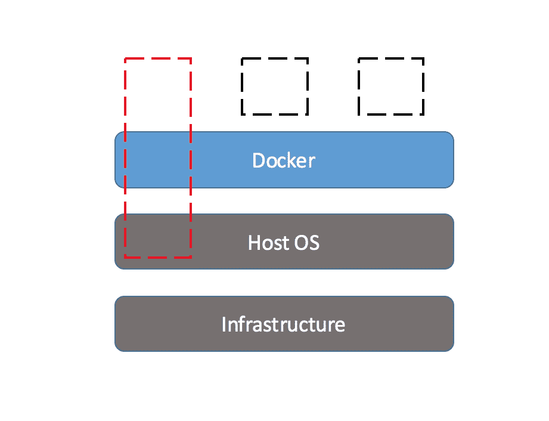
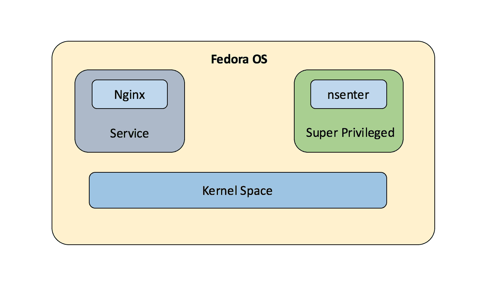
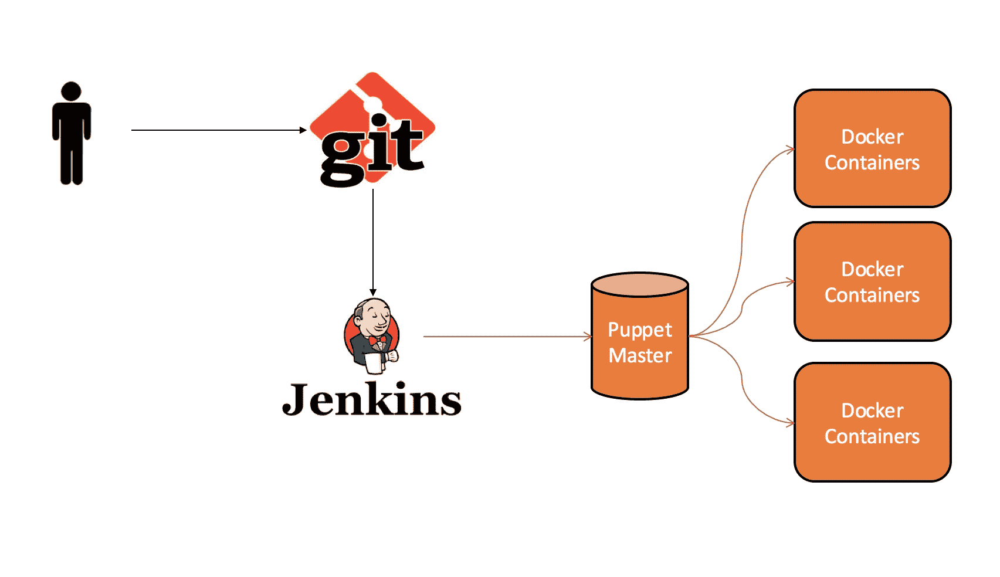

# 第六章。让容器发挥作用

在本章中，我们将探索创建带有附加模式的 Docker 容器的各种选项，例如特权模式和超级特权模式容器。我们还将探索这些模式的各种故障排除问题。

我们将深入研究各种部署管理工具，如**厨师**、**木偶**和 **Ansible** ，它们提供与 Docker 的集成，以减轻为生产环境部署数千个容器的痛苦。

在本章中，我们将涵盖以下主题:

*   特权容器和超级特权容器
*   解决创建容器时使用不同选项集的问题
*   让 Docker 容器与 Puppet、Ansible 和厨师一起工作
*   使用 Puppet 创建 Docker 容器并部署应用程序
*   用 Ansible 管理 Docker 容器
*   一起构建 Docker 和 Ansible
*   Docker厨师

借助前面的管理工具自动化 Docker 容器的部署具有以下优势:

*   **灵活性**:它们为您提供了在您选择的云实例或裸机上复制基于 Docker 的应用程序以及 Docker 应用程序所需的环境的灵活性。这有助于管理和测试，并在需要时提供开发环境加速。
*   **可审计性**:这些工具还提供了可审计性，因为它们提供了隔离，并帮助跟踪任何潜在的漏洞以及谁在哪个环境中部署了什么类型的容器。
*   **无处不在**:它们帮助您管理容器周围的完整环境，即管理容器以及非容器环境，如容器应用程序周围的存储、数据库和网络模型。

# 特权容器

默认情况下，容器以非特权模式运行，也就是说，我们不能在 Docker 容器中运行 Docker 守护程序。但是，特权 Docker 容器被授予对所有设备的访问权限。Docker 特权模式允许访问主机上的所有设备，并在**应用程序装甲**和 **SELinux** 中设置系统配置，以允许容器具有与主机上运行的进程相同的访问权限:



特权容器以红色突出显示

特权容器可以通过以下命令启动:

```
 $
docker run -it --privileged ubuntu /bin/bash 
root@9ab706a6a95c:/# cd /dev/
root@9ab706a6a95c:/dev# ls
agpgart          hdb6                psaux   sg1       tty32  tty7
atibm            hdb7                ptmx    shm       tty33  tty8
audio            hdb8                pts     snapshot  tty34  tty9
beep             hdb9                ram0    sr0       tty35  ttyS0

```

如我们所见，在特权模式下启动容器后，我们可以列出连接到主机的所有设备。

## 故障排除提示

Docker 允许您通过支持添加和删除功能来使用非默认配置文件。最好删除容器进程不特别需要的功能，因为这将使其安全。

如果运行容器的主机系统面临安全威胁，通常建议检查是否有任何容器以特权模式运行，这可能会通过运行安全威胁应用程序影响主机系统的安全性。

如下例所示，当我们在没有特权模式下运行容器时，我们无法更改内核参数，但是当我们在特权模式下使用`--privileged`标志运行容器时，它能够轻松更改内核参数，这可能会在主机系统上造成安全漏洞:

```
$ docker run -it centos /bin/bash
[root@7e1b1fa4fb89 /]#  sysctl -w net.ipv4.ip_forward=0
sysctl: setting key "net.ipv4.ip_forward": Read-only file system
$ docker run --privileged -it centos /bin/bash
[root@930aaa93b4e4 /]#  sysctl -a | wc -l
sysctl: reading key "net.ipv6.conf.all.stable_secret"
sysctl: reading key "net.ipv6.conf.default.stable_secret"
sysctl: reading key "net.ipv6.conf.eth0.stable_secret"
sysctl: reading key "net.ipv6.conf.lo.stable_secret"
638
[root@930aaa93b4e4 /]# sysctl -w net.ipv4.ip_forward=0
net.ipv4.ip_forward = 0

```

因此，在审核时，您应该确保主机系统上运行的所有容器都没有设置为`true`的特权模式，除非 Docker 容器中运行的某些特定应用程序需要:

```
$ docker ps -q | xargs docker inspect --format '{{ .Id }}: 
    Privileged={{ 
    .HostConfig.Privileged }}'
930aaa93b4e44c0f647b53b3e934ce162fbd9ef1fd4ec82b826f55357f6fdf3a: 
    Privileged=true

```

# 超级特权容器

这个概念是由红帽在一个原子项目博客中提出的。它提供了使用特殊/特权容器作为代理来控制底层主机的能力。如果我们只发送应用程序代码，我们就有可能把容器变成一个黑匣子。将代理打包为具有正确访问权限的 Docker 容器对主机有很多好处。我们可以通过`-v /dev:/dev`绑定设备，这将有助于在容器内安装设备，而不需要超级特权访问。

使用`nsenter`技巧，允许您在另一个命名空间中运行命令，也就是说，如果 Docker 有自己的私有装载命名空间，使用`nsenter`和正确的模式，我们可以到达主机并在其命名空间中装载东西。

我们可以在特权模式下运行，将整个主机系统挂载到某个路径上(`/media/host`):

```
$ docker run -it -v /:/media/host --privileged fedora 
nsenter --mount=/media/host/proc/1/ns/mnt --mount /dev/xvdf /home/mic 

```

然后我们可以在容器内使用`nsenter`；`--mount`告诉`nsenter`查看`/media/host`，然后为进程号 1 选择挂载名称空间。然后，运行将设备链接到装载点的常规装载命令。如前所述，该功能允许我们挂载主机套接字和设备(如文件)，因此所有这些都可以绑定挂载到容器中使用:



n 作为监控主机的超级特权容器运行

基本上，超级特权容器不仅提供了安全隔离、资源和进程隔离，还提供了运输容器的机制。如前所述，允许软件作为容器映像发货还允许我们管理主机操作系统和管理其他容器进程。

让我们考虑一个例子，目前，我们将所需的内核模块作为应用程序所需的 RPM 包加载，这些包不包含在主机操作系统中，并在应用程序启动时运行它们。这个模块可以在超级特权容器的帮助下被运送，与作为特权容器的一部分运送内核模块相比，这个定制内核模块可以很好地与当前内核一起工作。在这种方法中，不需要将应用程序作为特权容器运行；它们可以单独运行，内核模块可以作为不同映像的一部分加载，如下所示:

```
$ sudo docker run --rm --privileged foobar /sbin/modprobe PATHTO/foobar-kmod 
$ sudo docker run -d foobar 

```

## 故障排除-大规模Docker容器

在生产环境中工作意味着连续部署。当基础设施是分散的和基于云的时，我们经常在相同的系统上管理相同服务的部署。自动化这个系统的配置和管理的整个过程将是一个福音。部署管理工具就是为此目的而设计的。他们提供配方、行动手册和模板来简化流程编排和自动化，以提供标准且一致的部署。在接下来的部分中，我们将探索三种常见的配置自动化工具:Chef、Puppet 和 Ansible，以及它们为大规模部署 Docker 容器提供的便利。

# 木偶

Puppet 是一个自动引擎，它执行自动管理任务，例如根据用户规范更新配置、添加用户和安装软件包。Puppet 是一个众所周知的开源配置管理工具，它运行在各种系统上，如微软视窗、Unix 和 Linux。用户使用 Puppet 的声明性语言或特定于领域的语言(Ruby)来描述配置。Puppet 是模型驱动的，需要有限的编程知识才能使用。Puppet 提供了一个管理 Docker 容器的模块。Puppet 和 Docker 集成有助于轻松实现复杂的用例。Puppet 管理文件、包和服务，而 Docker 将二进制文件和配置封装在一个容器中，作为应用程序进行部署。

Puppet 的一个潜在用例是，它可以用来提供 Jenkins 构建所需的 Docker 容器，并且这可以根据开发人员的需要，也就是当构建被触发时，按比例完成。构建过程完成后，二进制文件可以交付给各自的所有者，容器可以在每次构建后销毁。Puppet 在这个用例中扮演着非常重要的角色，因为代码必须使用 Puppet 模板编写一次，并且可以在需要时触发:



整合 Puppet 和 Jenkins 以部署构建 docker 容器

管理 Docker 的 Puppet 模块可以按照`garethr-docker` GitHub 项目进行安装。该模块只需要包含一个单独的类:

```
    include 'docker'

```

它建立了一个 Docker 托管的存储库，并安装了 Docker 包和任何必需的内核扩展。Docker 守护程序将绑定到`unix socket /var/run/docker.sock`；该配置可以根据要求进行更改:

```
    class { 'docker':
      tcp_bind        => ['tcp://127.0.0.1:4245','tcp://10.0.0.1:4244'],
      socket_bind     => 'unix:///var/run/docker.sock',
      ip_forward      => true,
      iptables        => true,
      ip_masq         => true,
      bridge          => br0,
      fixed_cidr      => '10.21.1.0/24',
      default_gateway => '10.21.0.1',
    }

```

如前面的代码所示，Docker 的默认配置可以根据本模块提供的配置进行更改。

## 映像

Docker 映像可以在这里阐述的配置语法的帮助下进行提取。

`ubuntu:trusty docker`命令的替代方案如下:

```
 $ docker pull -t="trusty" ubuntu
 docker::image { 'ubuntu':
 image_tag => 'trusty'
    } 

```

甚至配置也允许链接到 Dockerfile，以便构建映像。映像的重建也可以通过订阅外部事件(如 Dockerfile 中的更改)来触发。我们订阅文件夹`vkohli/Dockerfile`中的更改，如下所示:

```
    docker::image { 'ubuntu':
      docker_file => '/vkohli/Dockerfile'
      subscribe => File['/vkohli/Dockerfile'],
    }

    file { '/vkohli/Dockerfile':
      ensure => file,
      source => 'puppet:///modules/someModule/Dockerfile',
    }

```

## 容器

创建映像后，可以使用许多可选参数启动容器。我们通过基本的`docker run`命令获得类似的功能:

```
    docker::run { 'sampleapplication':
      image           => 'base',
      command         => '/bin/sh -c "while true; do echo hello world; sleep 1; 
                         done"',
      ports           => ['4445', '4555'],
      expose          => ['4665', '4777'],
      links           => ['mysql:db'],
      net             => 'my-user-def',
      volumes         => ['/var/lib/couchdb', '/var/log'],
      volumes_from    => '6446ea52fbc9',
      memory_limit    => '20m', # (format: '<number><unit>', where unit = b, k, m 
                         or g)
      cpuset          => ['0', '4'],
      username        => 'sample',
      hostname        => 'sample.com',
      dns             => ['8.8.8.8', '8.8.4.4'],
      restart_service => true,
      privileged      => false,
      pull_on_start   => false,
      before_stop     => 'echo "The sample application completed"',
      after           => [ 'container_b', 'mysql' ],
      depends         => [ 'container_a', 'postgres' ],
      extra_parameters => [ '--restart=always' ],
    }

```

如这里所示，我们还能够传递更多的参数，例如:

*   `pull_on_start`:映像启动前，每次都会被新拉出来
*   `before_stop`:提到的命令会在停止容器之前执行
*   `extra_parameters`:需要传递给`docker run`命令的附加数组参数，如`--restart=always`
*   `after`:该选项允许表达需要先启动的容器

其他可以设置的参数有`ports`、`expose`、`env_files`、`volumes`。可以传递单个值或值数组。

## 联网

最新的 Docker 版本对网络有官方支持:该模块现在公开了一种类型，Docker 网络，可用于管理它们:

```
    docker_network { 'sample-net':
      ensure   => present,
      driver   => 'overlay',
      subnet   => '192.168.1.0/24',
      gateway  => '192.168.1.1',
      ip_range => '192.168.1.4/32',
    }

```

如前面的代码所示，可以创建一个新的覆盖网络`sample-net`，并且可以配置 Docker 守护程序来使用它。

## 复合Docker

Compose 是一个运行多个 Docker 容器应用程序的工具。使用合成文件，我们可以配置应用程序的服务并启动它们。提供了`docker_compose`模块类型，允许 Puppet 轻松运行撰写应用程序。

还可以添加一个合成文件，例如运行四个容器的缩放规则，如下面的代码片段所示。我们还可以提供网络和其他配置所需的其他参数:

```
    docker_compose { '/vkohli/docker-compose.yml':
      ensure  => present,
      scale   => {
        'compose_test' => 4,
      },
      options => '--x-networking'
    }

```

1.  如果你的机器上没有安装 Puppet 程序，可以通过以下方式完成:

    ```
    $ puppet module install garethr-docker
    The program 'puppet' is currently not installed. On Ubuntu 14.04 the 
            puppet program 
            can be installed as shown below; 
    $ apt-get install puppet-common
    Reading package lists... Done
    Building dependency tree
    Reading state information... Done
    ...
    The following extra packages will be installed:
    Unpacking puppet-common (3.4.3-1ubuntu1.1) ...
    Selecting previously unselected package ruby-rgen.
    Preparing to unpack .../ruby-rgen_0.6.6-1_all.deb ...
    ...

    ```

2.  安装 Puppet 模块后，`garethr-docker`模块可以安装，如图所示:

    ```
    $ puppet module install garethr-docker
    Notice: Preparing to install into /etc/puppet/modules ...
    Notice: Downloading from https://forge.puppetlabs.com ...
    Notice: Installing -- do not interrupt ...
    /etc/puppet/modules
            |__ garethr-docker (v5.3.0)
     |__ puppetlabs-apt (v2.2.2)
     |__ puppetlabs-stdlib (v4.12.0)
     |__ stahnma-epel (v1.2.2)

    ```

3.  我们将创建一个样例 hello world 应用程序，它将使用 Puppet:

    ```
     $ nano sample.pp 
            include 'docker' 
            docker::image { 'ubuntu': 
              image_tag => 'precise' 
            } 
            docker::run { 'helloworld': 
              image => 'ubuntu', 
              command => '/bin/sh -c "while true; do echo hello world; sleep 1; 
                         done"',  
            } 

    ```

    进行部署
4.  创建文件后，我们应用(运行)它:

    ```
     $ puppet apply sample.pp
     Warning: Config file /etc/puppet/hiera.yaml not found, using Hiera 
            defaults 
            Warning: Scope(Apt::Source[docker]): $include_src is deprecated and 
            will be removed in the next major release, please use $include => { 
            'src' => false } instead 
            ... 
            Notice: /Stage[main]/Main/Docker::Run[helloworld]/Service[docker-
            helloworld]/ensure: 
            ensure changed 'stopped' to 'running' 
            Notice: Finished catalog run in 0.80 seconds 
            Post installation it can be listed as running container: 
            $ docker ps 
            CONTAINER ID        IMAGE               COMMAND 
            CREATED             STATUS              PORTS               NAMES   
            bd73536c7f64        ubuntu:trusty       "/bin/sh -c 'while tr"   5 
            seconds ago       Up 5 seconds        helloworld

    ```

5.  我们可以将它附加到容器上，并看到输出:

    ```
    $ docker attach bd7
    hello world
    hello world
    hello world
    hello world

    ```

如前所述，容器可以跨多个主机部署，整个集群可以在单个 Puppet 配置文件的帮助下创建。

## 故障排除提示

如果即使在 Puppet `apply`命令成功运行后也无法列出 Docker 映像，请检查语法以及示例文件中是否有正确的映像名称。

# 可转换

Ansible 是一个工作流编排工具，在一个易于使用的平台的帮助下提供配置管理、资源调配和应用程序部署。Ansible 的一些强大功能如下:

*   **供应**:应用是在不同的环境中开发和部署的。它可以在本地或云上的裸机服务器、虚拟机或 Docker 容器上。借助 Ansible 塔式服务器和行动手册，Ansible 可以帮助简化资源调配步骤。
*   **配置管理**:保存通用的配置文件是 Ansible 的主要用例之一，有助于在所需的环境中进行管理和部署。
*   **应用部署** : Ansible 有助于管理应用从部署到生产的整个生命周期。
*   **持续交付**:管理持续交付管道需要各个团队的资源。这无法通过简单的平台来实现，因此，Ansible 行动手册在应用程序的整个生命周期中部署和管理应用程序方面发挥着至关重要的作用。
*   **安全性和合规性**:通过将各种安全策略集成为自动化流程的一部分，而不是事后才想到的流程或稍后将其合并，安全性可以成为部署阶段不可或缺的一部分。
*   **编排**:如前所述，Ansible 可以定义管理多个配置、与它们交互以及管理部署脚本的各个部分的方式。

## 用 Ansible 实现Docker自动化

Ansible 还提供了一种自动化 Docker 容器的方法；它使我们能够实现 Docker 容器构建的通道化和操作化，并自动完成目前大部分由人工处理的过程。Ansible 为编排 Docker 容器提供了以下模块:

*   **Docker_service**: The existing Docker compose files can be used to orchestrate containers on a single Docker daemon or swarm with the help of the Docker service part of Ansible. The Docker compose file has the same syntax as the Ansible playbook, as both of them are **Yaml** files and the syntax is almost the same. Ansible is also written in Python, and the Docker module uses the exact docker-py API client that docker compose uses internally.

    这里有一个简单的Docker组成文件:

    ```
            wordpress:
            image: wordpress
            links:
               - db:mysql
            ports:
               - 8080:80
            db:
            image: mariadb
            environment:
                  MYSQL_ROOT_PASSWORD: sample

    ```

    前面 Docker 编写文件的可翻译剧本看起来类似:

    ```
            # tasks file for ansible-dockerized-wordpress
            - name: "Launching DB container"
             docker:
               name: db
               image: mariadb
               env:
                 MYSQL_ROOT_PASSWORD: esample
            - name: "Launching wordpress container"
             docker:
               name: wordpress
               image: wordpress
               links:
               - db:mysql
               ports: 
               - 8081:80
    ```

*   **docker_container** :这通过提供启动、停止、创建和销毁 docker 容器的能力来管理 Docker 容器的生命周期。
*   **docker_image** :这为管理 docker 容器的映像提供了帮助，包括构建、推送、标记和移除 Docker 映像等命令。
*   **docker_login** :这将通过 docker 集线器或任何 Docker 注册表进行身份验证，并提供从注册表推送和拉出 Docker 映像的功能。

## 可运输容器

Ansible Container 是一个仅使用 Ansible 行动手册来编排和构建 Docker 映像的工具。通过使用 pip 安装创建`virtualenv`，可通过以下方式安装 Ansible Container:

```
$ virtualenv ansible-container
New python executable in /Users/vkohli/ansible-container/bin/python
Installing setuptools, pip, wheel...done.
vkohli-m01:~ vkohli$ source ansible-container/bin/activate
(ansible-container) vkohli-m01:~ vkohli$ pip install ansible-container
Collecting ansible-container
 Using cached ansible-container-0.1.0.tar.gz
Collecting docker-compose==1.7.0 (from ansible-container)
 Downloading docker-compose-1.7.0.tar.gz (141kB)
 100% |=============================| 143kB 1.1MB/s 
Collecting docker-py==1.8.0 (from ansible-container)
...
 Downloading docker_py-1.8.0-py2.py3-none-any.whl (41kB)
Collecting cached-property<2,>=1.2.0 (from docker-compose==1.7.0->ansible-
     container)

```

## 故障排除提示

如果您在安装如上所示的 Ansible Container 时遇到问题，可以通过从 GitHub 下载源代码来完成安装:

```
$ git clone https://github.com/ansible/ansible-container.git
Cloning into 'ansible-container'...
remote: Counting objects: 2032, done.
remote: Total 2032 (delta 0), reused 0 (delta 0), pack-reused 2032
Receiving objects: 100% (2032/2032), 725.29 KiB | 124.00 KiB/s, done.
Resolving deltas: 100% (1277/1277), done.
Checking connectivity... done.
$ cd ansible-container/
$ ls
AUTHORS      container        docs     EXAMPLES.md  LICENSE
README.md         setup.py  update-authors.py
codecov.yml  CONTRIBUTORS.md  example  INSTALL.md   MANIFEST.in
requirements.txt  test
$ sudo python setup.py install
running install
running bdist_egg
running egg_info
creating ansible_container.egg-info
writing requirements to ansible_container.egg-info/requires.txt

```

可移植容器有以下命令可以开始:

*   **ansible_container init** :这个命令为 ansible 文件创建一个目录来开始:

    ```
    $ ansible-container init
    Ansible Container initialized.
    $ cd ansible
    $ ls
    container.yml    main.yml    requirements.tx

    ```

*   **可移植容器构建**:这将从可移植目录中的可移植行动手册创建映像
*   **可转换容器运行**:这将启动`container.yml`文件中定义的容器
*   **可移植容器推送**:根据用户的选择，将项目的映像推送至私有或公共存储库
*   **可移植容器运送工具**:这将导出必要的行动手册和角色，以将容器部署到受支持的云提供商

如 GitHub 的例子所示，可以在`container.yml`文件中以如下方式定义 Django 服务:

```
    version: "1"
    services:
      django:
        image: centos:7
        expose:
          - "8080"
        working_dir: '/django'

```

# 厨师

厨师有一些重要的组成部分，如烹饪书和食谱。烹饪书定义了一个场景，包含了一切；第一个是菜谱，这是一个组织中的基本配置元素，它是用 Ruby 语言编写的。它主要是资源定义的使用模式的集合。烹饪书还包含属性值、文件分发和模板。Chef 允许以可版本化、可测试和可重复的方式管理 Docker 容器。它为您提供了为基于容器的开发构建高效工作流和管理发布管道的能力。厨师交付允许您自动化和使用可扩展的工作流来测试、开发和发布 Docker 容器。

Docker 食谱可在 GitHub([https://github.com/chef-cookbooks/docker](https://github.com/chef-cookbooks/docker))上获得，并提供在食谱中使用的定制资源。它提供了各种选项，例如:

*   `docker_service`:这些是`docker_installation`和`docker_service`经理使用的复合资源
*   `docker_image`:这涉及到从存储库中提取 Docker 映像
*   `docker_container`:这处理所有的 Docker 容器操作
*   `docker_registry`:处理所有 Docker 注册表操作
*   `docker_volume`:管理 Docker 容器的所有卷相关操作

以下是一个示例厨师 Docker 食谱，可用于参考使用厨师食谱部署容器:

```
    # Pull latest nginx image
    docker_image 'nginx' do
      tag 'latest'
      action :pull
      notifies :redeploy, 'docker_container[sample_nginx]'
    end

    # Run container by exposing the ports
    docker_container 'sample_nginx' do
      repo 'nginx'
      tag 'latest'
      port '80:80'
      host_name 'www'
      domain_name 'computers.biz'
      env 'FOO=bar'
      volumes [ '/some/local/files/:/etc/nginx/conf.d' ]
    end

```

# 总结

在本章中，我们首先深入探讨了特权容器，它可以访问所有主机设备以及超级特权容器，它展示了容器管理运行后台服务的能力，后台服务可以用来运行 Docker 容器中的服务来管理底层主机。然后，我们研究了关键的编排工具 Puppet，以及它如何在`garethr-docker` GitHub 项目的帮助下处理容器管理。我们还研究了 Ansible 和 Chef，它们为 Puppet 提供了类似的功能来大规模管理 Docker 容器。在下一章中，我们将探索 Docker 网络堆栈。