# 七、管理 Docker 容器的网络栈

在本章中，我们将涵盖以下主题:

*   Docker桥
*   Docker 桥配置故障排除
*   配置域名系统
*   对容器和外部网络之间的通信进行故障排除
*   ibnetwork 和容器网络模型
*   基于覆盖和底层网络的 Docker 网络工具
*   Docker 网络工具的比较
*   配置**打开开关** ( **OVS** )与Docker一起工作

# Docker网络

每个 Docker 容器都有自己的网络栈，这是由于 Linux 内核`net`命名空间，其中每个容器的新`net`命名空间被实例化，并且不能从容器或其他容器外部看到。

Docker 网络由以下网络组件和服务提供支持:

*   **Linux 桥**:内核内置的 L2/MAC 学习交换机，用于转发
*   **打开虚拟开关**:可编程并支持隧道的高级网桥
*   **网络地址转换器(NAT)** :这些是直接转换 IP 地址+端口的实体(SNAT，DNAT)
*   **IPtables** :内核中的策略引擎，用于管理数据包转发、防火墙和 NAT 功能
*   **appamor/SElinux**:可以定义每个应用的防火墙策略

各种网络组件可用于与 Docker 一起工作，提供了访问和使用基于 Docker 的服务的新方法。因此，我们看到了许多遵循不同联网方法的库。一些突出的例子是Docker写作，编织，Kubernetes，管道工程和图书馆网络。下图描述了 Docker 网络的基本思想:


Docker 网络模式

# Docker桥

**dock r0 桥**是默认组网的心脏。当 Docker 服务启动时，会在主机上创建一个 Linux 桥。容器上的接口与桥对话，桥代理外部世界。同一台主机上的多个容器可以通过 Linux 桥相互通信。

docker0 可以通过`--net`标志进行配置，一般有四种模式:

*   `--net default`:在这种模式下，默认桥被用作容器之间相互连接的桥
*   `--net=none`:有了这个标志，创建的容器就真正被隔离了，无法连接到网络
*   `--net=container:$container2`:使用此标志，创建的容器与名为`$container2`的容器共享其网络命名空间
*   `--net=host`:在这种模式下，创建的容器与主机共享其网络命名空间

## 故障排除 Docker 桥配置

在本节中，我们将了解如何将容器端口映射到主机端口，以及如何解决将容器连接到外部世界的问题。这种映射可以由 Docker 引擎隐式完成，也可以指定。

如果我们创建两个容器- **容器 1** 和**容器 2**-它们都从私有 IP 地址空间分配了一个 IP 地址，并且还连接到**Docker桥**，如下图所示:


两个容器通过Docker桥通话

前面的两个容器将能够相互 ping 通，并到达外部世界。对于外部访问，它们的端口将映射到主机端口。如前一节所述，容器使用网络名称空间。创建第一个容器时，会为该容器创建一个新的网络命名空间。

在容器和 Linux 桥之间创建了一个**虚拟以太网** ( **虚拟以太网**或**虚拟以太网**)链接。从容器的`eth0`端口发送的流量通过 vEth 接口到达网桥，并在此后被切换:

```
# show linux bridges 
$ sudo brctl show

```

前面命令的输出将类似于下面的命令，带有桥名和它所映射到的容器上的 vEth 接口:

```
$ bridge name  bridge            id    STP       enabled interfaces
docker0        8000.56847afe9799 no    veth44cb727    veth98c3700

```

### 连接容器和外部世界

主机上的 **iptables NAT** 表用于伪装所有外部连接，如下图所示:

```
$ sudo iptables -t nat -L -n 
... 
Chain POSTROUTING (policy ACCEPT) target prot opt
source destination MASQUERADE all -- 172.17.0.0/16
!172.17.0.0/16 
 ...

```

### 从外界到达容器

端口映射再次使用主机中的 iptables NAT 选项完成，如下图所示，其中**容器 1** 的端口映射用于与外部世界通信。我们将在本章的后半部分详细研究它。

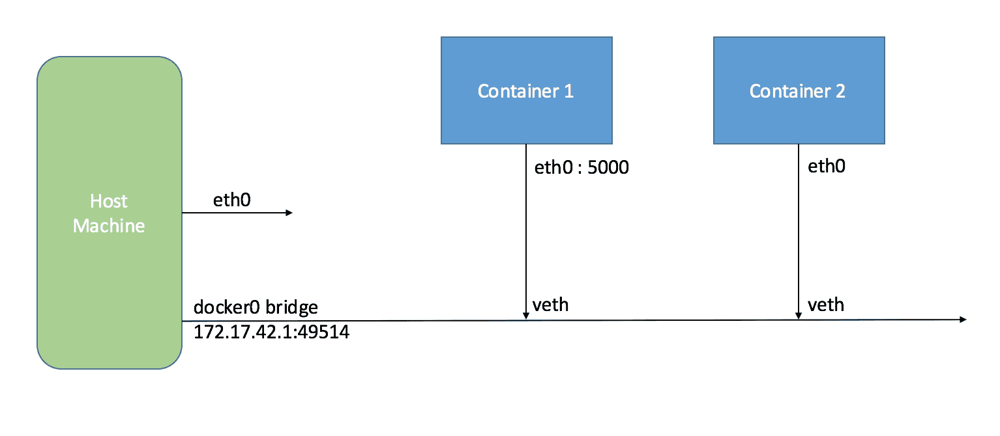

容器 1 与外部世界通信的端口映射

默认情况下，Docker 服务器会在 Linux 内核中创建一个`docker0`桥，该桥可以在其他物理或虚拟网络接口之间来回传递数据包，使它们表现为单个以太网:

```
root@ubuntu:~# ifconfig
docker0   Link encap:Ethernet  HWaddr 56:84:7a:fe:97:99
 inet addr:172.17.42.1  Bcast:0.0.0.0  Mask:255.255.0.0
 inet6 addr: fe80::5484:7aff:fefe:9799/64 Scope:Link
 inet6 addr: fe80::1/64 Scope:Link
 ...
 collisions:0 txqueuelen:0
 RX bytes:516868 (516.8 KB)  TX bytes:46460483 (46.4 MB)
eth0      Link encap:Ethernet  HWaddr 00:0c:29:0d:f4:2c
 inet addr:192.168.186.129  Bcast:192.168.186.255  
    Mask:255.255.255.0

```

一旦我们有一个或多个容器启动并运行，我们可以通过在主机上运行`brctl`命令并查看输出的 interfaces 列来确认 Docker 已经将它们正确连接到 docker0 桥。首先，使用以下命令安装网桥实用程序:

```
$ apt-get install bridge-utils

```

这是一台连接了两个不同容器的主机:

```
root@ubuntu:~# brctl show
bridge name     bridge id           STP enabled   interfaces
docker0         8000.56847afe9799   no            veth21b2e16
                                                  veth7092a45 

```

每当创建容器时，Docker 都会使用 docker0 桥设置。每当创建新容器时，它都会从网桥上可用的范围中分配一个新的 IP 地址:

```
 root@ubuntu:~# docker run -t -i --name container1 ubuntu:latest /bin/bash
 root@e54e9312dc04:/# ifconfig
 eth0 Link encap:Ethernet HWaddr 02:42:ac:11:00:07
 inet addr:172.17.0.7 Bcast:0.0.0.0 Mask:255.255.0.0
 inet6 addr: 2001:db8:1::242:ac11:7/64 Scope:Global
 inet6 addr: fe80::42:acff:fe11:7/64 Scope:Link
 UP BROADCAST RUNNING MULTICAST MTU:1500 Metric:1
 ...
 root@e54e9312dc04:/# ip route
 default via 172.17.42.1 dev eth0
 172.17.0.0/16 dev eth0 proto kernel scope link src 172.17.0.7

```

### 注

默认情况下，Docker 提供一个具有`172.17.42.1` IP 地址的 vnet docker0。Docker容器的 IP 地址在`172.17.0.0/16`范围内

要更改 Docker 中的默认设置，请修改`/etc/default/docker`文件。

将默认网桥从`docker0`更改为`br0`:

```
# sudo service docker stop
# sudo ip link set dev docker0 down
# sudo brctl delbr docker0
# sudo iptables -t nat -F POSTROUTING
# echo 'DOCKER_OPTS="-b=br0"' >> /etc/default/docker
# sudo brctl addbr br0
# sudo ip addr add 192.168.10.1/24 dev br0
# sudo ip link set dev br0 up
# sudo service docker start

```

以下命令显示 Docker 服务的新桥名和 IP 地址范围:

```
root@ubuntu:~# ifconfig
br0       Link encap:Ethernet  HWaddr ae:b2:dc:ed:e6:af
 inet addr:192.168.10.1  Bcast:0.0.0.0  Mask:255.255.255.0
 inet6 addr: fe80::acb2:dcff:feed:e6af/64 Scope:Link
 UP BROADCAST RUNNING MULTICAST  MTU:1500  Metric:1
 RX packets:0 errors:0 dropped:0 overruns:0 frame:0
 TX packets:7 errors:0 dropped:0 overruns:0 carrier:0
 collisions:0 txqueuelen:0
 RX bytes:0 (0.0 B)  TX bytes:738 (738.0 B)
eth0      Link encap:Ethernet  HWaddr 00:0c:29:0d:f4:2c
 inet addr:192.168.186.129  Bcast:192.168.186.255  Mask:255.255.255.0
 inet6 addr: fe80::20c:29ff:fe0d:f42c/64 Scope:Link
 ...

```

# 配置域名系统

Docker 为每个容器提供主机名和 DNS 配置，而无需构建自定义映像。它用虚拟文件覆盖容器内的`/etc`文件，在那里它可以写入新的信息。

这可以通过在容器内部运行`mount`命令来看到。容器在最初创建时与主机接收相同的`/resolv.conf`。如果主机的`/resolv.conf`文件被修改，只有当容器重新启动时，它才会反映在容器的`/resolv.conf`文件中。

在 Docker 中，您可以通过两种方式设置`dns`选项:

*   使用`docker run --dns=<ip-address>`
*   在 Docker 守护程序文件中，添加`DOCKER_OPTS="--dns ip-address"`

### 类型

也可以使用`--dns-search=<DOMAIN>`指定搜索域。

下图显示了使用 Docker 守护程序文件中的`DOCKER_OPTS`设置在容器中配置的名称服务器:

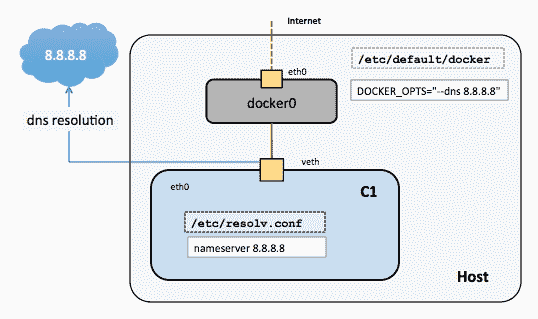

用于设置 DOCKER 容器的名称服务器设置

主要的域名系统文件如下:

```
/etc/hostname
/etc/resolv.conf
/etc/hosts

```

以下是添加域名系统服务器的命令:

```
# docker run --dns=8.8.8.8 --net="bridge" -t -i  ubuntu:latest /bin/bash

```

以下是添加主机名的命令:

```
#docker run --dns=8.8.8.8 --hostname=docker-vm1  -t -i  ubuntu:latest 
    /bin/bash

```

# 对容器和外部网络之间的通信进行故障排除

如果`ip_forward`参数设置为`1`，包只能在容器之间传递。通常，您只需将 Docker 服务器保留为其默认设置`--ip-forward=true`，当服务器启动时，Docker 会为您将`ip_forward`设置为`1`。要检查设置，请使用以下命令:

```
 # cat /proc/sys/net/ipv4/ip_forward
0 
# echo 1 > /proc/sys/net/ipv4/ip_forward 
# cat /proc/sys/net/ipv4/ip_forward 
1

```

通过启用`ip-forward`，用户可以使容器与外部世界的通信成为可能；如果您处于多网桥设置中，容器间通信也需要它:

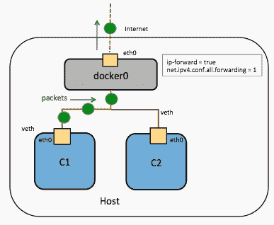

ip-forward = true 将所有进出容器的数据包转发到外部网络

Docker 不会从 Docker 筛选器链中删除或修改任何预先存在的规则。这允许用户创建规则来限制对容器的访问。Docker 使用 docker0 桥实现单个主机中所有容器之间的数据包流。它为 iptables 中的`FORWARD`链添加了一个规则(空白接受策略)，使数据包在两个容器之间流动。`--icc=false`选项将`DROP`所有的数据包。

当 Docker 守护程序配置有`--icc=false`和`--iptables=true`并且 Docker 运行通过`--link=`选项调用时，Docker 服务器将为新容器插入一对 iptables `ACCEPT`规则，以连接到其他容器公开的端口-它在 Dockerfile 的`EXPOSE`行中提到的端口:

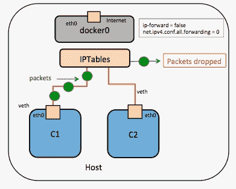

ip-forward = false 将所有进出容器的数据包转发到外部网络

默认情况下，Docker 的转发规则允许所有外部 IP。要仅允许特定的 IP 或网络访问容器，请在 Docker 筛选器链的顶部插入一个否定规则。

例如，您可以使用以下命令限制外部访问，以便只有源 IP `10.10.10.10`可以访问容器:

```
#iptables -I DOCKER -i ext_if ! -s 10.10.10.10 -j DROP

```

### 注

**参考文献:**

[https://docs.docker.com/v1.5/articles/networking/](https://docs.docker.com/v1.5/articles/networking/)

[https://docs.docker.com/engine/userguide/networking/](https://docs.docker.com/v1.5/articles/networking/)

http://container ops . org/

## 限制 SSH 从一个容器到另一个容器的访问

要限制从一个容器到另一个容器的 SSH 访问，请执行以下步骤:

1.  创建两个容器，c1 和 c2:

    ```
     # docker run -i -t --name c1 ubuntu:latest /bin/bash
     root@7bc2b6cb1025:/# ifconfig
     eth0 Link encap:Ethernet HWaddr 02:42:ac:11:00:05
     inet addr:172.17.0.5 Bcast:0.0.0.0 Mask:255.255.0.0
     inet6 addr: 2001:db8:1::242:ac11:5/64 Scope:Global
     inet6 addr: fe80::42:acff:fe11:5/64 Scope:Link
     ...
     # docker run -i -t --name c2 ubuntu:latest /bin/bash
     root@e58a9bf7120b:/# ifconfig
            eth0 Link encap:Ethernet HWaddr 02:42:ac:11:00:06
             inet addr:172.17.0.6 Bcast:0.0.0.0 Mask:255.255.0.0
             inet6 addr: 2001:db8:1::242:ac11:6/64 Scope:Global
             inet6 addr: fe80::42:acff:fe11:6/64 Scope:Link

    ```

2.  我们可以使用刚刚发现的 IP 地址测试容器之间的连通性。让我们现在使用`ping`工具来看看这个。
3.  让我们进入另一个容器 c1，并尝试 ping c2:

    ```
     root@7bc2b6cb1025:/# ping 172.17.0.6
            PING 172.17.0.6 (172.17.0.6) 56(84) bytes of data.
            64 bytes from 172.17.0.6: icmp_seq=1 ttl=64 time=0.139 ms
            64 bytes from 172.17.0.6: icmp_seq=2 ttl=64 time=0.110 ms
            ^C
            --- 172.17.0.6 ping statistics ---
            2 packets transmitted, 2 received, 0% packet loss, time 999ms
            rtt min/avg/max/mdev = 0.110/0.124/0.139/0.018 ms
            root@7bc2b6cb1025:/#
            root@e58a9bf7120b:/# ping 172.17.0.5
            PING 172.17.0.5 (172.17.0.5) 56(84) bytes of data.
            64 bytes from 172.17.0.5: icmp_seq=1 ttl=64 time=0.270 ms
            64 bytes from 172.17.0.5: icmp_seq=2 ttl=64 time=0.107 ms
            ^C
            --- 172.17.0.5 ping statistics ---

            2 packets transmitted, 2 received, 0% packet loss, time 1002ms
            rtt min/avg/max/mdev = 0.107/0.188/0.270/0.082 ms
            root@e58a9bf7120b:/#

    ```

4.  将`openssh-server`安装在两个容器上:

    ```
    #apt-get install openssh-server

    ```

5.  在主机上启用 iptables。最初，您将能够从一个容器到另一个容器进行 SSH。
6.  停止 Docker 服务，在主机的`default docker`文件中添加`DOCKER_OPTS="--icc=false --iptables=true"`。此选项将启用 iptables 防火墙并丢弃容器之间的所有端口。默认情况下，主机上不启用 iptables:

    ```
     root@ubuntu:~# iptables -L -n
            Chain INPUT (policy ACCEPT)
            target prot opt source destination
            Chain FORWARD (policy ACCEPT)
            target prot opt source destination
            DOCKER all -- 0.0.0.0/0 0.0.0.0/0
            ACCEPT all -- 0.0.0.0/0 0.0.0.0/0 ctstate RELATED,ESTABLISHED
            ACCEPT all -- 0.0.0.0/0 0.0.0.0/0
            DOCKER all -- 0.0.0.0/0 0.0.0.0/0
            ACCEPT all -- 0.0.0.0/0 0.0.0.0/0 ctstate RELATED,ESTABLISHED
            ACCEPT all -- 0.0.0.0/0 0.0.0.0/0
            ACCEPT all -- 0.0.0.0/0 0.0.0.0/0 
     ACCEPT all -- 0.0.0.0/0 0.0.0.0/0
    #service docker stop 
    #vi /etc/default/docker 

    ```

7.  Docker Upstart 和 SysVinit 配置文件，自定义 Docker 二进制文件的位置(特别是用于开发测试):

    ```
    #DOCKER="/usr/local/bin/docker"

    ```

8.  使用`DOCKER_OPTS`修改守护进程启动选项:

    ```
    #DOCKER_OPTS="--dns 8.8.8.8 --dns 8.8.4.4" 
    #DOCKER_OPTS="--icc=false --iptables=true"

    ```

9.  重新启动Docker服务:

    ```
     # service docker start

    ```

10.  检查仪表:

    ```
     root@ubuntu:~# iptables -L -n
     Chain INPUT (policy ACCEPT)
     target prot opt source destination
     Chain FORWARD (policy ACCEPT)
     target prot opt source destination
     DOCKER all -- 0.0.0.0/0 0.0.0.0/0
     ACCEPT all -- 0.0.0.0/0 0.0.0.0/0 ctstate RELATED, ESTABLISHED
     ACCEPT all -- 0.0.0.0/0 0.0.0.0/0
     DOCKER all -- 0.0.0.0/0 0.0.0.0/0
     ACCEPT all -- 0.0.0.0/0 0.0.0.0/0 ctstate RELATED, ESTABLISHED
     ACCEPT all -- 0.0.0.0/0 0.0.0.0/0
     ACCEPT all -- 0.0.0.0/0 0.0.0.0/0
     DROP all -- 0.0.0.0/0 0.0.0.0/0

    ```

`DROP`规则已添加到主机的 iptables 中，这将断开容器之间的连接。现在，您将无法在容器之间进行 SSH。

## 连接容器

我们可以使用`--link`参数来通信或连接遗留容器。

1.  创建第一个充当服务器的容器- `sshserver` :

    ```
    root@ubuntu:~# docker run -i -t -p 2222:22 --name sshserver ubuntu bash
    root@9770be5acbab:/#
    Execute the iptables command and you can find a Docker chain rule added.
    #root@ubuntu:~# iptables -L -n
    Chain INPUT (policy ACCEPT)
    target     prot opt source               destination
    Chain FORWARD (policy ACCEPT)
    target     prot opt source               destination
    Chain OUTPUT (policy ACCEPT)
    target     prot opt source               destination
    Chain DOCKER (0 references)
    target     prot opt source               destination
    ACCEPT     tcp  --  0.0.0.0/0            172.17.0.3           tcp dpt:22

    ```

2.  创建第二个类似 SSH 客户端的容器:

    ```
    root@ubuntu:~# docker run -i -t --name sshclient --link 
            sshserver:sshserver 
            ubuntu bash
    root@979d46c5c6a5:/#

    ```

3.  We can see that there are more rules added to the Docker chain rule:

    ```
    root@ubuntu:~# iptables -L -n
    Chain INPUT (policy ACCEPT)
    target     prot opt source               destination
    Chain FORWARD (policy ACCEPT)
    target     prot opt source               destination
    Chain OUTPUT (policy ACCEPT)
    target     prot opt source               destination
    Chain DOCKER (0 references)
    target     prot opt source               destination
    ACCEPT     tcp  --  0.0.0.0/0            172.17.0.3           tcp dpt:22
    ACCEPT     tcp  --  172.17.0.4           172.17.0.3           tcp dpt:22
    ACCEPT     tcp  --  172.17.0.3           172.17.0.4           tcp spt:22
    root@ubuntu:~#

    ```

    下图解释了使用`--link`标志的容器之间的通信:

    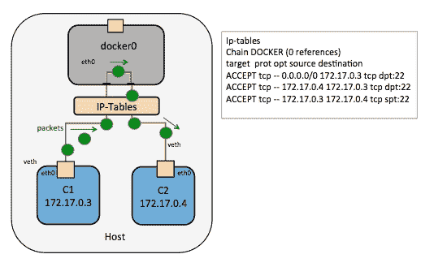

    Docker - link 在容器之间创建私有通道

4.  您可以使用`docker inspect` :

    ```
    root@ubuntu:~# docker inspect -f "{{ .HostConfig.Links }}" sshclient
    [/sshserver:/sshclient/sshserver]

    ```

    检查您的链接容器
5.  Now you can successfully SSH into the SSH server with its IP:

    ```
     **#ssh root@172.17.0.3 -p 22** 

    ```

    使用`--link`参数，Docker 在容器之间创建了一个安全通道，不需要在容器外部暴露任何端口。

# 图书馆网络和容器网络模型

libnetwork 在 Go 中实现，用于连接 Docker 容器。目的是提供一个**容器网络模型** ( **CNM** )帮助程序员提供网络库的抽象。libnetwork 的长期目标是遵循 Docker 和 Linux 的理念来交付独立工作的模块。libnetwork 的目标是为容器中的网络提供可组合的需求。它还旨在通过执行以下操作，将 Docker Engine 和 libcontainer 中的网络逻辑模块化为一个可重用的库:

*   用 libnetwork 替换 Docker 引擎的网络模块
*   允许本地和远程驱动程序向容器提供网络连接
*   为管理和测试 libnetwork 提供一个`dnet`工具——然而，这仍然是一项正在进行的工作

### 注

**参考:**T2】https://github.com/docker/libnetwork/issues/45

图书馆网络实现了 CNM。它形式化了为容器提供网络所需的步骤，同时提供了可用于支持多个网络驱动程序的抽象。它的端点 API 主要用于管理相应的对象并记录它们，以便提供 CNM 所要求的抽象级别。

## CNM 物件

CNM 建立在三个主要组件上，如下图所示:

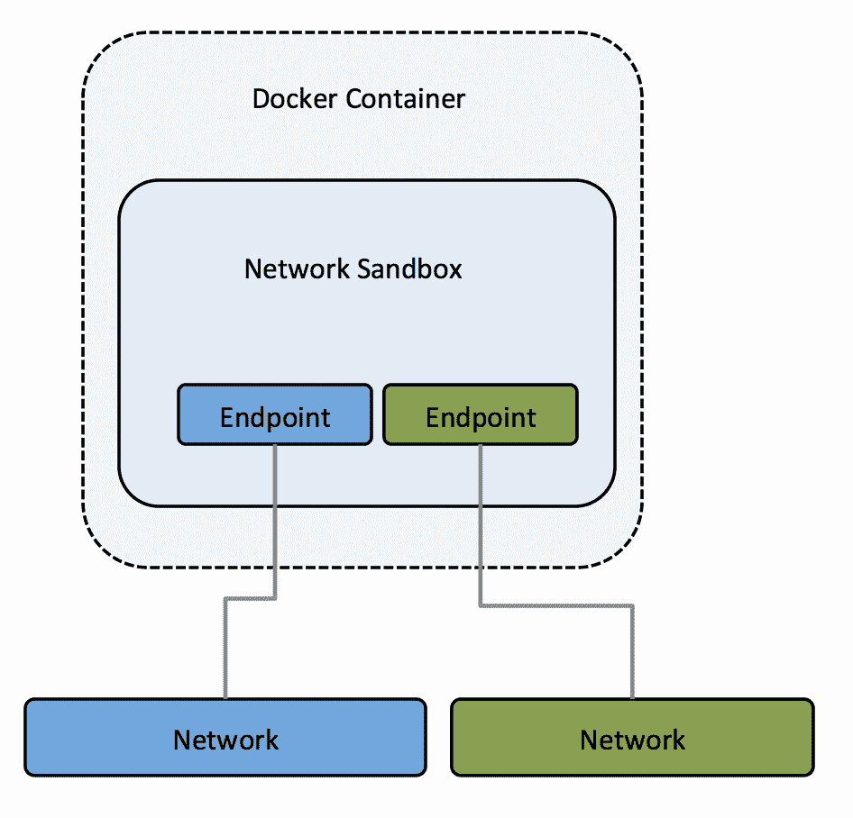

图书馆网络的网络沙盒模型

### 注

**参考:**T2】https://www.docker.com

### 沙盒

沙箱包含容器网络栈的配置，包括路由表管理、容器接口和 DNS 设置。沙盒的实现可以是一个 Linux 网络命名空间、一个 FreeBSD 监狱或另一个类似的概念。

沙箱可能包含来自多个网络的许多端点。它还表示容器的网络配置，如 IP 地址、MAC 地址和 DNS 条目。

libnetwork 利用特定于操作系统的参数来填充沙箱表示的网络配置。它提供了一个在多个操作系统中实现沙箱的框架。

**Netlink** 用于管理命名空间中的路由表，目前沙盒有两种实现方式- `namespace_linux.go`和`configure_linux.go`-用于唯一标识主机文件系统上的路径。沙箱与单个 Docker 容器相关联。

以下数据结构显示了沙箱的运行时元素:

```
    type sandbox struct {
          id            string
           containerID   string
          config        containerConfig
          osSbox        osl.Sandbox
          controller    *controller
          refCnt        int
          endpoints     epHeap
          epPriority    map[string]int
          joinLeaveDone chan struct{}
          dbIndex       uint64
          dbExists      bool
          isStub        bool
          inDelete      bool
          sync.Mutex
    }

```

从网络控制器实例化一个新的沙箱(稍后将详细解释):

```
    func (c *controller) NewSandbox(containerID string, options ...SandboxOption) 
     (Sandbox, error) {
        .....
    }

```

### 终点

端点将沙箱加入网络，并为容器向部署在同一网络中的其他容器公开的服务提供连接。它可以是开放式虚拟交换机的内部端口或类似的虚拟交换机对。

一个端点只能属于一个网络，并且只能属于一个沙盒。它代表一种服务，并提供各种 API 来创建和管理端点。它具有全局范围，但只连接到一个网络。

端点由以下结构指定:

```
    type endpoint struct { 
       name          string 
       id            string 
       network       *network 
       iface         *endpointInterface 
       joinInfo      *endpointJoinInfo 
       sandboxID     string 
       exposedPorts  []types.TransportPort 
       anonymous     bool 
       generic      map[string]interface{} 
       joinLeaveDone chan struct{} 
       prefAddress   net.IP 
       prefAddressV6 net.IP 
       ipamOptions   map[string]string 
       dbIndex       uint64 
       dbExists      bool 
       sync.Mutex 
    }
```

端点与唯一的标识和名称相关联。它连接到网络和沙盒标识。它还与 IPv4 和 IPv6 地址空间相关联。每个端点都与一个端点接口相关联。

### 网络

一组能够直接相互通信的端点称为**网络**。它在同一台主机或多台主机内提供所需的连接，并且每当创建或更新网络时，都会通知相应的驱动程序。一个例子是在集群中具有全局范围的 VLAN 或 Linux 桥。

网络由网络控制器控制，我们将在下一节讨论。每个网络都有名称、地址空间、标识和网络类型:

```
    type network struct { 
       ctrlr        *controller 
       name         string 
       networkType  string 
       id           string 
       ipamType     string 
       addrSpace    string 
       ipamV4Config []*IpamConf 
       ipamV6Config []*IpamConf 
       ipamV4Info   []*IpamInfo 
       ipamV6Info   []*IpamInfo 
       enableIPv6   bool 
       postIPv6     bool 
       epCnt        *endpointCnt 
       generic      options.Generic 
       dbIndex      uint64 
       svcRecords   svcMap 
       dbExists     bool 
       persist      bool 
       stopWatchCh  chan struct{} 
       drvOnce      *sync.Once 
       internal     bool 
       sync.Mutex   
    }
```

### 网络控制器

网络控制器对象提供了创建和管理网络对象的应用编程接口。通过将特定驱动程序绑定到给定网络，它是 libnetwork 的入口点，并且它支持多个内置和远程的活动驱动程序。网络控制器允许用户将特定的驱动程序绑定到给定的网络:

```
    type controller struct { 
       id             string 
       drivers        driverTable 
       ipamDrivers    ipamTable 
       sandboxes      sandboxTable 
       cfg            *config.Config 
       stores         []datastore.DataStore 
       discovery     hostdiscovery.HostDiscovery 
       extKeyListener net.Listener 
       watchCh        chan *endpoint 
       unWatchCh      chan *endpoint 
       svcDb          map[string]svcMap 
       nmap           map[string]*netWatch 
       defOsSbox      osl.Sandbox 
       sboxOnce       sync.Once 
       sync.Mutex 
    }   

```

每个网络控制器都涉及以下内容:

*   数据结构驱动程序表中的一个或多个驱动程序
*   数据结构中的一个或多个沙箱
*   数据存储
*   An ipamTable

    

处理 Docker 容器和 Docker 引擎之间的网络的网络控制器

上图显示了网络控制器如何位于 Docker 引擎、容器和它们所连接的网络之间。

### CNM 属性

以下是 CNM 属性:

*   **选项:**这些不是最终用户可见的，而是数据的键值对，以提供一种灵活的机制，将特定于驱动程序的配置从用户直接传递给驱动程序。libnetwork 仅在某个键与某个知名标签匹配时才对选项进行操作，因此会拾取一个由类属对象表示的值。
*   **标签:**这些是选项的子集，是使用`--labels`选项在用户界面中表示的最终用户变量。它们的主要功能是执行特定于驱动程序的操作，并且它们是从用户界面传递的。

### CNM 生命周期

CNM 的消费者通过 CNM 对象及其 API 进行交互，以将他们管理的容器联网；驱动程序向网络控制器注册。

内置驱动程序在 libnetwork 内部注册，而远程驱动程序使用插件机制向 libnetwork 注册。

每个驱动程序处理特定的网络类型，解释如下:

*   使用`libnetwork.New()`应用编程接口创建网络控制器对象，以管理网络的分配，并可选地使用特定于驱动程序的选项配置驱动程序。使用控制器的`NewNetwork()`应用编程接口、一个`name`和一个`NetworkType`作为参数创建网络对象。
*   `NetworkType`参数有助于选择驱动程序，并将创建的网络绑定到该驱动程序。网络上的所有操作都将由使用前面的应用编程接口创建的驱动程序来处理。
*   `Controller.NewNetwork()`应用编程接口接受一个可选的选项参数，该参数携带特定于驱动程序的选项和标签，驱动程序可以将其用于自己的目的。
*   `Network.CreateEndpoint()`被调用以在给定网络中创建新端点。该应用编程接口还接受随驱动程序而变化的可选选项参数。
*   `CreateEndpoint()`在网络中创建端点时，可以选择保留 IPv4/IPv6 地址。驱动程序使用在`driverapi`中定义的`InterfaceInfo`接口分配这些地址。需要 IPv4/IPv6 地址来完成端点即服务定义以及端点公开的端口。服务端点是应用容器正在侦听的网络地址和端口号。
*   `Endpoint.Join()` is used to attach a container to an endpoint. The `Join` operation will create a sandbox, if one doesn't exist for that container. The drivers make use of the sandbox key to identify multiple endpoints attached to the same container.

    有一个单独的应用编程接口来创建端点，还有一个应用编程接口来连接端点。

    端点代表独立于容器的服务。当一个端点被创建时，它拥有为容器保留的资源，以便以后连接到该端点。它给出了一致的网络行为。

*   当容器停止时调用`Endpoint.Leave()`。驱动程序可以清除在`Join()`调用期间分配的状态。当最后一个引用端点离开网络时，libnetwork 会删除沙箱。
*   只要端点仍然存在，libnetwork 就会一直保留 IP 地址。当容器(或任何容器)再次连接时，这些将被重用。它确保容器的资源在停止和再次启动时被重用。
*   `Endpoint.Delete()`从网络中删除一个端点。这将导致删除端点并清理缓存的`sandbox.Info`。
*   `Network.Delete()`用于删除一个网络。如果没有端点连接到网络，则允许删除。

# 基于覆盖和底层网络的 Docker 网络工具

覆盖层是建立在底层网络基础设施(底层)之上的虚拟网络。目的是实现物理网络中不可用的网络服务。

网络覆盖极大地增加了可以在物理网络上创建的虚拟子网的数量，从而支持多租户和虚拟化功能。

Docker 中的每个容器都被分配了一个用于与其他容器通信的 IP 地址。如果容器必须与外部网络通信，您可以在主机系统中设置网络，并将端口从容器公开或映射到主机。由于该应用在内部运行，容器将无法通告其外部 IP 和端口，因为信息对它们不可用。

解决方案是以某种方式为所有主机上的每个 Docker 容器分配唯一的 IP，并拥有一些在主机之间路由流量的网络产品。

有不同的项目和工具可以帮助 Docker 联网，如下所示:

*   法兰绒
*   织法
*   卡利科项目

## 法兰绒

**法兰绒**给每个容器一个可用于容器间通信的 IP。通过数据包封装，它在主机网络上创建了一个虚拟覆盖网络。默认情况下，法兰绒为主机提供一个`/24`子网，Docker 守护程序将从该子网向容器分配 IP。


使用法兰绒进行容器之间的通信

法兰绒在每台主机上运行一个代理`flanneld`，负责从预配置的地址空间中分配子网租约。法兰绒使用`etcd`([https://github.com/coreos/etcd](https://github.com/coreos/etcd))存储网络配置、分配的子网和辅助数据(如主机的 IP)。

为了提供封装，法兰绒使用**通用 TUN/TAP** 设备，并使用 UDP 创建覆盖网络来封装 IP 数据包。子网分配是在`etcd`的帮助下完成的，它维护覆盖子网到主机的映射。

## 编织

**Weave** 创建一个虚拟网络，将跨主机/虚拟机部署的 Docker 容器连接起来，并实现它们的自动发现。

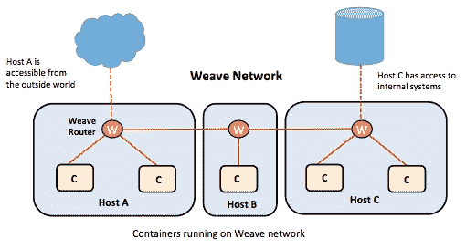

编织网络

Weave 可以穿越防火墙，在部分连接的网络中运行。流量可以选择加密，从而允许主机/虚拟机通过不受信任的网络进行连接。

Weave 增强了 Docker 现有的(单主机)网络功能，例如 docker0 桥，这样容器就可以继续使用这些功能。

## 印花布项目

**Calico 项目**为连接容器、虚拟机或裸机提供了可扩展的网络解决方案。Calico 使用可扩展的 IP 网络原理作为第 3 层方法来提供连接。Calico 可以在没有覆盖或封装的情况下部署。Calico 服务应该作为容器部署在每个节点上。它为每个容器提供了自己的 IP 地址，并且处理所有必要的 IP 路由、安全策略规则和跨节点集群的路由分布。

为了提供更好的网络解决方案，Calico 体系结构包含四个重要组件:

*   **Calico worker 流程 Felix** 是 Calico 网络的核心，主要路由主机上的工作负载，并为其提供所需的连接。它还为传出端点流量提供了到内核的接口
*   **BIRD** ，路线 ic。BIRD，路由分发开源 BGP，在主机之间交换路由信息。BIRD 拾取的内核端点被分发到 BGP 对等体，以便提供主机间路由。两个 BIRD 进程在*卡利科节点*容器中运行，一个用于 IPv4 (bird)，一个用于 IPv6 (bird6)
*   **confd** 是一个为 BIRD 自动生成配置的模板化过程，它监控`etcd`存储中 BGP 配置的任何更改，例如日志级别和 IPAM 信息。`confd`还根据来自`etcd`的数据动态生成 BIRD 配置文件，并在数据更新时自动触发。`confd`每当配置文件发生变化时，触发 BIRD 加载新文件。
*   **calicoctl** 是用于配置和启动 Calico 服务的命令行。它甚至允许数据存储(`etcd`)定义和应用安全策略。该工具还为 Calico 配置的一般管理提供了简单的界面，无论 Calico 是在虚拟机、容器还是裸机上运行。`calicoctl;`

    ```
     $ calicoctl
     Override the host:port of the ETCD server by setting the 
             environment 
            variable
     ETCD_AUTHORITY [default: 127.0.0.1:2379]
     Usage: calicoctl <command> [<args>...]
     status            Print current status information
     node              Configure the main calico/node container and 
             establish 
                              Calico
     networking
     container         Configure containers and their addresses
     profile           Configure endpoint profiles
     endpoint          Configure the endpoints assigned to existing 
             containers
     pool              Configure ip-pools
     bgp               Configure global bgp
     ipam              Configure IP address management
     checksystem       Check for incompatibilities on the host 
             system
     diags             Save diagnostic information
     version           Display the version of calicoctl
     config            Configure low-level component configuration 
            See 'calicoctl <command> --help' to read about a specific 
             subcommand.

    ```

    支持以下命令

根据 Calico 存储库([https://github.com/projectcalico/calico-containers](https://github.com/projectcalico/calico-containers))的官方 GitHub 页面，存在以下 Calico 集成:

*   Calico as Docker网络插件
*   没有 Docker 网络的 Calico
*   卡利科与库比涅斯
*   带介子的印花棉布
*   Calico with Docker Swarm

    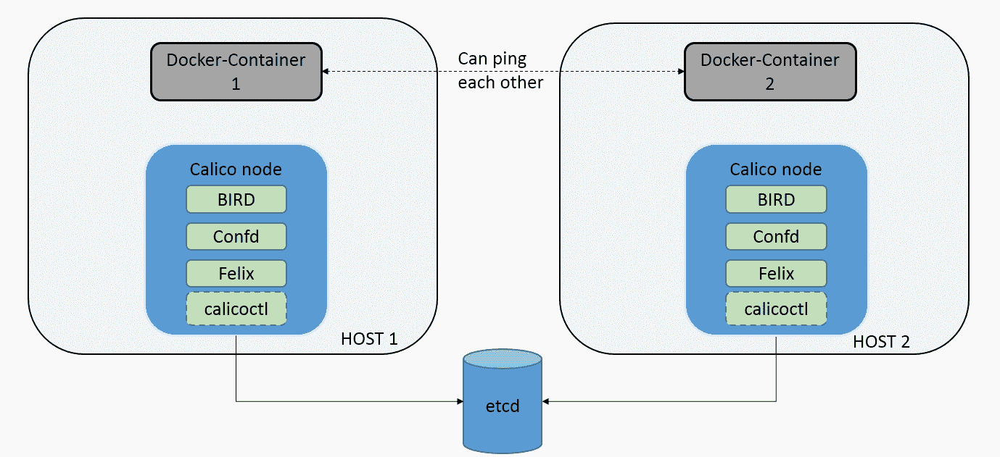

    卡利科建筑

# 使用 Docker 引擎群节点配置覆盖网络

随着 Docker 1.9 的发布，多主机和覆盖网络已成为其主要功能之一。它支持建立专用网络来连接多个容器。我们将在没有外部键值存储的群集群中运行的管理器节点上创建覆盖网络。群网络将使群中需要服务的节点可以使用该网络。

当我们部署使用覆盖网络的服务时，管理器会自动将网络扩展到运行服务任务的节点。多主机网络需要一个服务发现存储，所以现在我们将创建一个 Docker 机器来运行该服务。

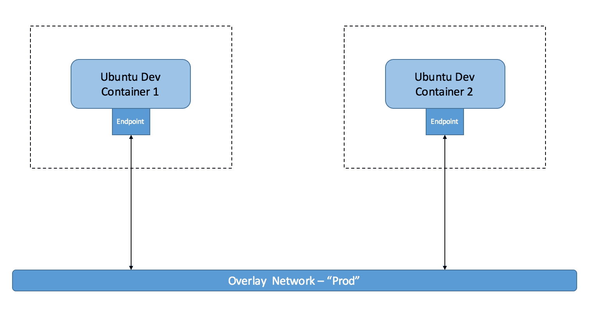

跨多台主机的覆盖网络

对于以下部署，我们将使用在虚拟化或云平台上创建 Docker 守护程序的 Docker 机器应用。对于虚拟化平台，我们将使用 VMware fusion 作为提供商。

Docker机器安装如下:

```
 $ curl -L https://github.com/docker/machine/releases/download/
    v0.7.0/docker-machine-`uname -s`-`uname -m` > /usr/local/bin/
    docker-machine && \
 > chmod +x /usr/local/bin/docker-machine
 % Total    % Received % Xferd  Average Speed   Time    Time    Time  Current
                                     Dload  Upload   Total   Spent   Left  Speed
 100   601    0   601    0     0    266      0 --:--:--  0:00:02 --:--:--   266
 100 38.8M  100 38.8M    0     0  1420k      0  0:00:28  0:00:28 --:--:-- 1989k
 $ docker-machine version
 docker-machine version 0.7.0, build a650a40

```

多用户网络需要一个服务发现存储，因此我们将创建一个 Docker 机器来运行该服务，创建新的 Docker 守护程序:

```
$ docker-machine create \
>   -d vmwarefusion \
>   swarm-consul
Running pre-create checks...
(swarm-consul) Default Boot2Docker ISO is out-of-date, downloading the latest 
    release...
(swarm-consul) Latest release for github.com/boot2docker/boot2docker is 
    v1.12.1
(swarm-consul) Downloading 
...

```

### 类型

要查看如何将您的 Docker 客户端连接到在该虚拟机上运行的 Docker 引擎，请运行`docker-machine env swarm-consul`。

我们将启动服务发现的 consul 容器:

```
$(docker-machine config swarm-consul) run \
>         -d \
>         --restart=always \
>         -p "8500:8500" \
>         -h "consul" \
>         progrium/consul -server -bootstrap
Unable to find image 'progrium/consul:latest' locally
latest: Pulling from progrium/consul
...
Digest: 
    sha256:8cc8023462905929df9a79ff67ee435a36848ce7a10f18d6d0faba9306b97274
Status: Downloaded newer image for progrium/consul:latest
d482c88d6a1ab3792aa4d6a3eb5e304733ff4d622956f40d6c792610ea3ed312

```

创建两个 Docker 守护程序来运行 Docker 集群，第一个守护程序是将自动运行用于协调集群的 swarm 容器的 Swarm 节点:

```
$ docker-machine create \
>   -d vmwarefusion \
>   --swarm \
>   --swarm-master \
>   --swarm-discovery="consul://$(docker-machine ip swarm-
     consul):8500" \
>   --engine-opt="cluster-store=consul://$(docker-machine ip swarm-
    consul):8500" \
>   --engine-opt="cluster-advertise=eth0:2376" \
>   swarm-0
Running pre-create checks...
Creating machine...
(swarm-0) Copying 
     /Users/vkohli/.docker/machine/cache/boot2docker.iso to 
    /Users/vkohli/.docker/machine/machines/swarm-0/boot2docker.iso...
(swarm-0) Creating SSH key...
(swarm-0) Creating VM...
...

```

Docker已经开始工作了！

### 类型

要查看如何将您的 Docker 客户端连接到在该虚拟机上运行的 Docker 引擎，请运行`docker-machine env swarm-0`。

第二个守护进程是 Swarm `secondary`节点，它将自动运行 Swarm 容器并将状态报告回`master`节点:

```
$ docker-machine create \
>   -d vmwarefusion \
>   --swarm \
>   --swarm-discovery="consul://$(docker-machine ip swarm-
     consul):8500" \
>   --engine-opt="cluster-store=consul://$(docker-machine ip swarm-
    consul):8500" \
>   --engine-opt="cluster-advertise=eth0:2376" \
>   swarm-1
Running pre-create checks...
Creating machine...
(swarm-1) Copying 
     /Users/vkohli/.docker/machine/cache/boot2docker.iso to 
    /Users/vkohli/.docker/machine/machines/swarm-1/boot2docker.iso...
(swarm-1) Creating SSH key...
(swarm-1) Creating VM...
...

```

Docker已经开始工作了！

### 类型

要查看如何将您的 Docker 客户端连接到在该虚拟机上运行的 Docker 引擎，请运行`docker-machine env swarm-1`。

Docker 可执行文件将与一个 Docker 守护程序通信。由于我们在一个集群中，我们将通过运行以下命令来确保 Docker 守护程序与集群的通信:

```
$ eval $(docker-machine env --swarm swarm-0)

```

之后，我们将创建一个带有覆盖驱动程序的私有`prod`网络:

```
$ docker $(docker-machine config swarm-0) network create --driver 
    overlay prod

```

我们将使用`--net parameter`启动两个虚拟`ubuntu:12.04`容器:

```
$ docker run -d -it --net prod --name dev-vm-1 ubuntu:12.04
426f39dbcb87b35c977706c3484bee20ae3296ec83100926160a39190451e57a

```

在下面的代码片段中，我们可以看到这个 Docker 容器有两个网络接口:一个连接到私有覆盖网络，另一个连接到 Docker 桥:

```
$ docker attach 426
root@426f39dbcb87:/# ip address
23: eth0@if24: <BROADCAST,MULTICAST,UP,LOWER_UP> mtu 1450 qdisc 
     noqueue state 
    UP 
 link/ether 02:42:0a:00:00:02 brd ff:ff:ff:ff:ff:ff
 inet 10.0.0.2/24 scope global eth0
 valid_lft forever preferred_lft forever
 inet6 fe80::42:aff:fe00:2/64 scope link 
 valid_lft forever preferred_lft forever
25: eth1@if26: <BROADCAST,MULTICAST,UP,LOWER_UP> mtu 1500 qdisc 
     noqueue state 
    UP 
 link/ether 02:42:ac:12:00:02 brd ff:ff:ff:ff:ff:ff
 inet 172.18.0.2/16 scope global eth1
 valid_lft forever preferred_lft forever
 inet6 fe80::42:acff:fe12:2/64 scope link 
 valid_lft forever preferred_lft forever

```

另一个容器也将连接到存在于另一台主机上的`prod`网络接口:

```
$ docker run -d -it --net prod --name dev-vm-7 ubuntu:12.04
d073f52a7eaacc0e0cb925b65abffd17a588e6178c87183ae5e35b98b36c0c25
$ docker attach d073
root@d073f52a7eaa:/# ip address
26: eth0@if27: <BROADCAST,MULTICAST,UP,LOWER_UP> mtu 1450 qdisc 
     noqueue state 
    UP 
 link/ether 02:42:0a:00:00:03 brd ff:ff:ff:ff:ff:ff
 inet 10.0.0.3/24 scope global eth0
 valid_lft forever preferred_lft forever
 inet6 fe80::42:aff:fe00:3/64 scope link 
 valid_lft forever preferred_lft forever
28: eth1@if29: <BROADCAST,MULTICAST,UP,LOWER_UP> mtu 1500 qdisc 
     noqueue state 
    UP 
 link/ether 02:42:ac:12:00:02 brd ff:ff:ff:ff:ff:ff
 inet 172.18.0.2/16 scope global eth1
 valid_lft forever preferred_lft forever
 inet6 fe80::42:acff:fe12:2/64 scope link 
 valid_lft forever preferred_lft forever
root@d073f52a7eaa:/# 

```

这就是如何在 Docker Swarm 集群中的主机之间配置专用网络。

## 所有多主机 Docker 网络解决方案的比较

<colgroup><col> <col> <col> <col> <col></colgroup> 
|  | **印花布** | **法兰绒** | **编织** | **Docker覆盖不适用** |
| **网络模型** | 第三层解决方案 | VxLAN 或 UDP | VxLAN 或 UDP | 维克斯兰 |
| **名称服务** | 不 | 不 | 是 | 不 |
| **协议支持** | TCP、UDP、ICMP 和 ICMPv6 | 全部 | 全部 | 全部 |
| **分布式存储** | 是 | 是 | 不 | 是 |
| **加密通道** | 不 | 坦克激光瞄准镜（Tank Laser-Sight 的缩写） | NaCI 图书馆 | 不 |

# 配置 openvsswitch(OVS)与 Docker 一起工作

**Open vsswitch**(**OVS**)是一款开源的 **OpenFlow** 功能虚拟交换机，通常与虚拟机管理程序一起使用，通过网络将主机内部以及不同主机之间的虚拟机互连起来。覆盖网络需要使用支持的隧道封装(如 VXLAN 或 GRE)来创建虚拟数据路径。

覆盖数据路径在驻留在 Docker 主机中的隧道端点之间提供，这给出了给定提供商段内的所有主机彼此直接连接的外观。

当新容器上线时，路由协议中的前缀会更新，通过隧道端点宣布其位置。当其他 Docker 主机收到更新时，会将转发安装到主机所在的 OVS 隧道端点。取消置备主机时，会发生类似的过程，隧道端点 Docker 主机会删除取消置备容器的转发条目:

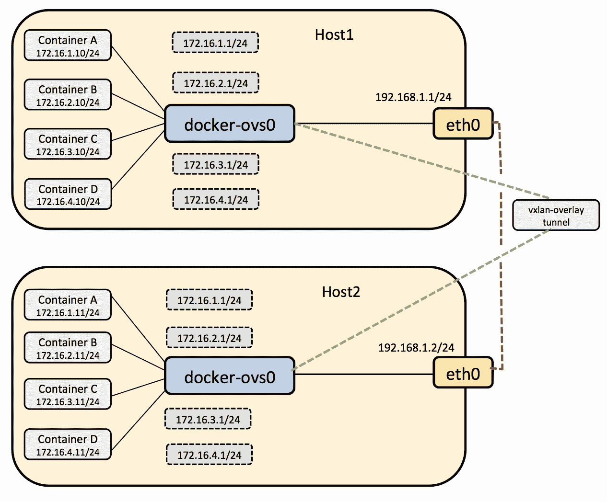

运行在多个主机上的容器之间通过基于 OVS 的 VXLAN 隧道进行通信

### 注

默认情况下，Docker 使用 Linux docker0 桥；但是，在某些情况下，可能需要 OVS，而不是 Linux 桥。一个 Linux 网桥只能处理 1，024 个端口；这限制了 Docker 的可扩展性，因为我们只能创建 1，024 个容器，每个容器都有一个网络接口。

## OVS 单主机设置故障排除

在单个主机上安装 OVS，创建两个容器，并将它们连接到 OVS 桥:

1.  安装 OVS:

    ```
    $ sudo apt-get install openvswitch-switch 

    ```

2.  Install the `ovs-docker` utility:

    ```
    $ cd /usr/bin 
    $ wget https://raw.githubusercontent.com/openvswitch/ovs/master
     /utilities/ovs-docker
    $ chmod a+rwx ovs-docker

    ```

    

    单一主持人 OVS

3.  建造一座 OVS 大桥。
4.  在这里，我们将添加一个新的 OVS 桥并对其进行配置，这样我们就可以将容器连接到不同的网络上:

    ```
    $ ovs-vsctl add-br ovs-br1 
    $ ifconfig ovs-br1 173.16.1.1 netmask 255.255.255.0 up 

    ```

5.  从 OVS 桥向 Docker 容器添加一个端口。
6.  创建两个`ubuntu` Docker 容器:

    ```
    $ docker run -i-t --name container1 ubuntu /bin/bash
    $ docker run -i-t --name container2 ubuntu /bin/bash

    ```

7.  将容器连接到 OVS 大桥:

    ```
    # ovs-docker add-port ovs-br1 eth1 container1 --
             ipaddress=173.16.1.2/24
    # ovs-docker add-port ovs-br1 eth1 container2 --
             ipaddress=173.16.1.3/24

    ```

8.  使用`ping`命令测试使用 OVS 桥连接的两个容器之间的连接。首先，找出他们的 IP 地址:

    ```
    # docker exec container1 ifconfig
    eth0      Link encap:Ethernet  HWaddr 02:42:ac:10:11:02
    inet addr:172.16.17.2  Bcast:0.0.0.0  Mask:255.255.255.0
    inet6 addr: fe80::42:acff:fe10:1102/64 Scope:Link
    ...
    # docker exec container2 ifconfig
    eth0      Link encap:Ethernet  HWaddr 02:42:ac:10:11:03
    inet addr:172.16.17.3  Bcast:0.0.0.0  Mask:255.255.255.0
    inet6 addr: fe80::42:acff:fe10:1103/64 Scope:Link
    ...

    ```

9.  因为我们知道`container1`和`container2`的 IP 地址，所以我们可以运行以下命令:

    ```
    # docker exec container2 ping 172.16.17.2
    PING 172.16.17.2 (172.16.17.2) 56(84) bytes of data.
    64 bytes from 172.16.17.2: icmp_seq=1 ttl=64 time=0.257 ms
    64 bytes from 172.16.17.2: icmp_seq=2 ttl=64 time=0.048 ms
    64 bytes from 172.16.17.2: icmp_seq=3 ttl=64 time=0.052 ms
    # docker exec container1 ping 172.16.17.2
    PING 172.16.17.2 (172.16.17.2) 56(84) bytes of data.
    64 bytes from 172.16.17.2: icmp_seq=1 ttl=64 time=0.060 ms
    64 bytes from 172.16.17.2: icmp_seq=2 ttl=64 time=0.035 ms
    64 bytes from 172.16.17.2: icmp_seq=3 ttl=64 time=0.031 ms

    ```

## OVS 多主机设置故障排除

首先，我们将使用 OVS 连接多个主机上的 Docker 容器:

让我们考虑一下我们的设置，如下图所示，它包含两台运行 Ubuntu 14.04 的主机- `Host1`和`Host2`:

1.  在两台主机上安装 Docker 和 OVS:

    ```
    # wget -qO- https://get.docker.com/ | sh
    # sudo apt-get install openvswitch-switch

    ```

2.  Install the `ovs-docker` utility:

    ```
    # cd /usr/bin 
    # wget https://raw.githubusercontent.com/openvswitch/ovs
            /master/utilities/ovs-docker
    # chmod a+rwx ovs-docker

    ```

    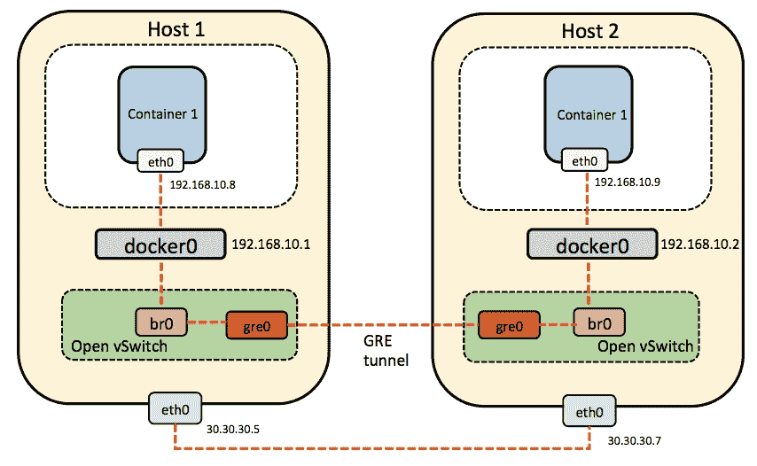

    与 OVS 的多主机容器通信

3.  默认情况下，Docker 选择一个随机网络来运行其容器。它创建一个 docker0 桥，并为其分配一个 IP 地址(`172.17.42.1`)。因此，`Host1`和`Host2`Docker桥的 IP 地址是相同的，因此两个主机中的容器很难通信。为了克服这一点，让我们为网络分配静态 IP 地址，即(`192.168.10.0/24`)。

要更改默认 Docker 子网:

1.  在`Host1`上执行以下命令:

    ```
    $ service docker stop
    $ ip link set dev docker0 down
    $ ip addr del 172.17.42.1/16 dev docker0
    $ ip addr add 192.168.10.1/24 dev docker0
    $ ip link set dev docker0 up
    $ ip addr show docker0
    $ service docker start

    ```

2.  添加`br0` OVS 大桥:

    ```
    $ ovs-vsctl add-br br0 

    ```

3.  创建到另一台主机的隧道:

    ```
    $ ovs-vsctl add-port br0 gre0 -- set interface gre0 type=gre 
            options:remote_ip=30.30.30.8

    ```

4.  将`br0`桥添加到`docker0`桥:

    ```
    $ brctl addif docker0 br0 

    ```

5.  在主机 2 上执行以下命令:

    ```
    $ service docker stop
    $ iptables -t nat -F POSTROUTING 
    $ ip link set dev docker0 down 
    $ ip addr del 172.17.42.1/16 dev docker0
    $ ip addr add 192.168.10.2/24 dev docker0 
    $ ip link set dev docker0 up
    $ ip addr show docker0
    $ service docker start

    ```

6.  添加`br0` OVS 大桥:

    ```
    $ ip link set br0 up
    $ ovs-vsctl add-br br0 

    ```

7.  创建到另一台主机的隧道，并将其连接到:

    ```
    # br0 bridge  
            $ ovs-vsctl add-port br0 gre0 -- set interface gre0 type=gre 
            options:remote_ip=30.30.30.7

    ```

8.  Add the `br0` bridge to the `docker0` bridge:

    ```
    $ brctl addif docker0 br0

    ```

    Docker桥连接到另一座桥- `br0.`这一次，它是一座 OVS 桥，这意味着容器之间的所有交通也通过`br0`路由。此外，我们需要将运行容器的两台主机的网络连接在一起。为此使用了一条 GRE 隧道([http://en.wikipedia.org/wiki/Generic_Routing_Encapsulation](http://en.wikipedia.org/wiki/Generic_Routing_Encapsulation))。这条隧道与`br0` OVS 大桥相连，因此也与`docker0`相连。在两台主机上执行上述命令后，您应该能够从两台主机 ping 通`docker0`网桥地址。

    在主机 1 上:

    ```
    $ ping 192.168.10.2
    PING 192.168.10.2 (192.168.10.2) 56(84) bytes of data.
    64 bytes from 192.168.10.2: icmp_seq=1 ttl=64 time=0.088 ms
    64 bytes from 192.168.10.2: icmp_seq=2 ttl=64 time=0.032 ms
    ^C
    --- 192.168.10.2 ping statistics ---
    2 packets transmitted, 2 received, 0% packet loss, time 999ms
    rtt min/avg/max/mdev = 0.032/0.060/0.088/0.028 ms

    ```

    在主机 2 上:

    ```
    $ ping 192.168.10.1
    PING 192.168.10.1 (192.168.10.1) 56(84) bytes of data.
    64 bytes from 192.168.10.1: icmp_seq=1 ttl=64 time=0.088 ms
    64 bytes from 192.168.10.1: icmp_seq=2 ttl=64 time=0.032 ms
    ^C
    --- 192.168.10.1 ping statistics ---
    2 packets transmitted, 2 received, 0% packet loss, time 999ms
    rtt min/avg/max/mdev = 0.032/0.060/0.088/0.028 ms

    ```

9.  Create containers on both the hosts.

    在主机 1 上，使用以下命令:

    ```
     $ docker run -t -i --name container1 ubuntu:latest /bin/bash 

    ```

    在主机 2 上，使用以下命令:

    ```
    $ docker run -t -i --name container2 ubuntu:latest /bin/bash 

    ```

现在我们可以从`container1.`ping`container2`了。这样，我们可以使用 OVS 连接多个主机上的 Docker 容器。

# 总结

在本章中，我们学习了 Docker 网络如何通过 docker0 桥供电、其故障排除问题和配置。我们还研究了 Docker 网络和外部网络之间通信问题的故障排除。接下来，我们深入研究了 libnetwork 和 CNM 及其生命周期。然后，我们研究了使用不同网络选项(如 Weave、OVS、法兰绒和 Docker 的最新覆盖网络)的多台主机之间的容器通信，并进行比较，以及其配置中涉及的故障排除问题。

我们看到，Weave 创建了一个虚拟网络，OVS 使用了 GRE 隧道技术，法兰绒提供了一个单独的子网，Docker 覆盖设置了每个主机来连接多个主机上的容器。之后，我们研究了 OVS 的 Docker 网络配置，并对单主机和多主机设置进行了故障排除。